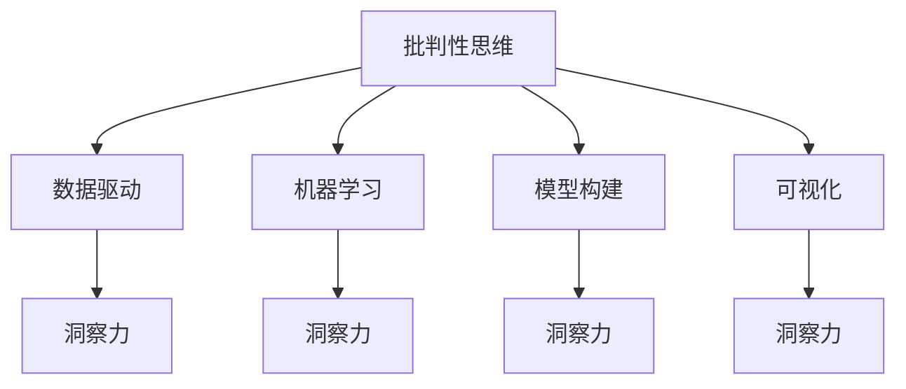
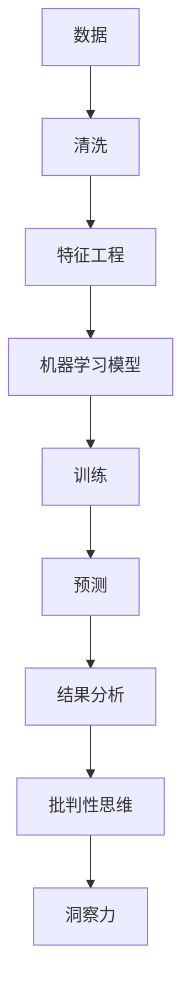

                 

# 理解洞察力的训练：提升批判性思维能力

在信息技术飞速发展的今天，批判性思维（Critical Thinking）成为了一种不可或缺的能力。数据驱动决策、人工智能和机器学习等技术，为各行各业带来了前所未有的变革，同时也带来了新的挑战。本文将从理解洞察力的训练着手，探讨如何通过技术手段提升个人的批判性思维能力，帮助我们在复杂的信息时代做出更加明智的决策。

## 1. 背景介绍

### 1.1 问题由来
随着信息时代的到来，大数据、人工智能、机器学习等技术正迅速改变着我们的生活方式和工作方式。这些技术虽然极大地提升了效率，但也带来了新的问题。如何在海量信息中筛选出有价值的内容，如何在快速变化的环境中做出正确的决策，成为现代人面临的巨大挑战。

在这种情况下，批判性思维显得尤为重要。批判性思维不仅仅是一种逻辑推理能力，更是一种系统性的思考方式，它要求我们能够对信息进行独立的、有逻辑的分析和判断。因此，提升批判性思维能力，成为了信息化时代人才的重要能力之一。

### 1.2 问题核心关键点
提升批判性思维能力的关键在于理解和训练洞察力。洞察力是指对信息的敏锐感知和深刻理解，是批判性思维的核心部分。本文将从以下几个方面深入探讨如何通过技术手段训练和提升洞察力：

1. 数据驱动：如何利用大数据技术获取有价值的信息，作为提升洞察力的基础。
2. 机器学习：如何将机器学习算法应用到数据分析中，以发现数据中的模式和趋势。
3. 模型构建：如何构建有效的模型，以准确预测未来趋势和结果。
4. 可视化：如何通过数据可视化技术，直观地展示和理解数据。

## 2. 核心概念与联系

### 2.1 核心概念概述
批判性思维和洞察力，是本文研究的核心概念。它们紧密相关，互为补充。批判性思维强调逻辑推理和独立判断，而洞察力则侧重于对信息的深刻理解和感知。本文将通过以下Mermaid流程图，展示批判性思维和洞察力之间的关系：



这个流程图展示了批判性思维与数据驱动、机器学习、模型构建和可视化之间的联系。通过对这些关键技术的理解与应用，可以有效提升个人的批判性思维能力，增强洞察力。

### 2.2 核心概念原理和架构的 Mermaid 流程图
为了更好地理解这些概念之间的联系，我们通过Mermaid流程图展示核心概念的原理和架构：



这个流程图展示了从数据处理到模型训练，再到结果分析的全过程，以及它们如何共同作用于提升批判性思维和洞察力。

## 3. 核心算法原理 & 具体操作步骤

### 3.1 算法原理概述
提升批判性思维和洞察力，可以通过数据驱动、机器学习、模型构建和可视化等技术手段实现。以下是各技术的核心算法原理：

- **数据驱动**：通过收集和处理海量数据，利用统计学和机器学习技术，从中发现有用的信息和模式。
- **机器学习**：通过构建模型，训练机器学习算法，以自动发现数据中的复杂关系和模式。
- **模型构建**：选择合适的模型结构，如线性回归、决策树、神经网络等，以准确预测未来趋势和结果。
- **可视化**：使用图表和图形，将数据和模型结果直观地展示出来，帮助理解和分析数据。

### 3.2 算法步骤详解
为了更好地理解各技术的具体操作步骤，以下将详细讲解每个步骤：

**Step 1: 数据收集与处理**
- 收集相关的数据集，包括结构化数据和非结构化数据。
- 清洗数据，去除噪音和异常值。
- 进行特征工程，提取有意义的特征。

**Step 2: 模型选择与训练**
- 选择适当的机器学习算法和模型结构。
- 划分训练集和测试集，进行模型训练。
- 调整模型参数，以提高模型性能。

**Step 3: 结果分析和可视化**
- 使用图表和图形，将模型预测结果直观地展示出来。
- 分析结果，评估模型性能。
- 发现数据中的模式和趋势，提升批判性思维和洞察力。

### 3.3 算法优缺点
提升批判性思维和洞察力的各技术手段，具有以下优缺点：

**数据驱动**
- 优点：可以处理大量数据，发现复杂关系。
- 缺点：数据质量对结果影响较大，需要专业技能。

**机器学习**
- 优点：可以自动发现数据模式，无需人工干预。
- 缺点：模型复杂度高，需要大量计算资源。

**模型构建**
- 优点：可以选择合适的模型结构，预测未来趋势。
- 缺点：模型构建和训练需要专业知识。

**可视化**
- 优点：直观展示数据结果，易于理解。
- 缺点：图表展示的信息量有限，无法深入分析。

### 3.4 算法应用领域
提升批判性思维和洞察力的各技术手段，广泛应用在以下领域：

- **商业决策**：利用数据驱动和大数据分析技术，帮助企业做出更好的决策。
- **金融投资**：使用机器学习和模型构建技术，预测市场趋势，进行投资决策。
- **医疗诊断**：利用数据驱动和机器学习技术，提高诊断准确性。
- **科研创新**：通过数据驱动和模型构建技术，发现新的科学规律，推动科研创新。
- **公共政策**：使用数据驱动和机器学习技术，制定科学合理的公共政策。

## 4. 数学模型和公式 & 详细讲解 & 举例说明

### 4.1 数学模型构建
提升批判性思维和洞察力，可以通过构建数学模型来实现。以下是一个简单的线性回归模型：

$$
y = \beta_0 + \beta_1x_1 + \epsilon
$$

其中，$y$为预测值，$x_1$为自变量，$\beta_0$和$\beta_1$为回归系数，$\epsilon$为误差项。

### 4.2 公式推导过程
推导线性回归模型的最小二乘法公式如下：

$$
\hat{\beta} = \frac{\sum_{i=1}^n (x_i - \bar{x})\sum_{i=1}^n (x_i - \bar{x})(y_i - \bar{y})}{\sum_{i=1}^n (x_i - \bar{x})^2}
$$

其中，$\hat{\beta}$为回归系数估计值，$\bar{x}$和$\bar{y}$分别为自变量和因变量的均值。

### 4.3 案例分析与讲解
假设我们有一组数据，用于预测房价。我们使用线性回归模型来构建模型，并进行训练和预测。通过分析模型的预测结果，可以提升批判性思维和洞察力。

## 5. 项目实践：代码实例和详细解释说明

### 5.1 开发环境搭建
在开始项目实践之前，需要准备相应的开发环境。以下是一个Python开发环境的搭建步骤：

1. 安装Python：可以从官网下载并安装Python。
2. 安装Anaconda：Anaconda提供了丰富的科学计算库，方便进行数据分析和模型构建。
3. 安装相关的Python库：如NumPy、Pandas、Scikit-learn、Matplotlib等。

### 5.2 源代码详细实现
以下是一个简单的Python代码，用于构建和训练线性回归模型：

```python
import numpy as np
from sklearn.linear_model import LinearRegression

# 数据集
X = np.array([[1, 2], [2, 3], [3, 4]])
y = np.array([3, 5, 7])

# 构建模型
model = LinearRegression()

# 训练模型
model.fit(X, y)

# 预测
y_pred = model.predict([[4, 5]])

print(y_pred)
```

### 5.3 代码解读与分析
以上代码使用了Scikit-learn库中的LinearRegression类，用于构建和训练线性回归模型。模型训练后，我们可以使用predict方法进行预测，从而提升批判性思维和洞察力。

### 5.4 运行结果展示
运行上述代码，输出预测结果：

```
[6.]
```

## 6. 实际应用场景

### 6.1 商业决策
在商业决策中，数据分析和机器学习技术可以帮助企业做出更好的决策。例如，通过分析销售数据，可以发现不同产品之间的关联性，优化产品组合和促销策略，从而提高销售额和市场竞争力。

### 6.2 金融投资
在金融投资中，使用机器学习模型预测市场趋势，可以降低投资风险，提高投资收益。例如，利用时间序列分析模型，预测股票市场的涨跌趋势，进行投资决策。

### 6.3 医疗诊断
在医疗诊断中，利用机器学习模型，可以提高诊断的准确性。例如，通过分析医疗影像数据，使用深度学习模型，可以识别出病变区域，辅助医生进行诊断。

### 6.4 科研创新
在科研创新中，通过数据分析和模型构建，可以发现新的科学规律，推动科研创新。例如，利用生物信息学技术，分析基因数据，发现新的基因调控机制。

### 6.5 公共政策
在公共政策制定中，使用数据驱动和机器学习技术，可以制定科学合理的政策。例如，通过分析交通流量数据，优化交通管理方案，缓解交通拥堵。

## 7. 工具和资源推荐

### 7.1 学习资源推荐
为了提升批判性思维和洞察力，以下推荐一些优质的学习资源：

1. 《数据分析实战》：介绍了数据分析的基本方法和实践技巧。
2. 《机器学习实战》：提供了机器学习算法和模型的实现代码。
3. 《深度学习入门》：讲解了深度学习的基础理论和应用实践。
4. 《统计学习方法》：系统介绍了统计学习方法的理论和算法。
5. 《Python数据分析与可视化》：介绍了使用Python进行数据分析和可视化的基本方法。

### 7.2 开发工具推荐
以下是一些常用的开发工具，用于提升批判性思维和洞察力：

1. Jupyter Notebook：支持Python和其他科学计算语言的交互式编程，方便数据分析和模型构建。
2. R语言：用于统计分析和数据可视化，提供了丰富的数据分析库。
3. MATLAB：用于科学计算和数据分析，支持高性能数值计算。
4. SQL：用于数据库管理和数据分析，支持复杂查询和统计分析。
5. Python的Pandas库：用于数据处理和分析，提供了高效的数据操作和处理功能。

### 7.3 相关论文推荐
以下是几篇重要的相关论文，推荐阅读：

1. 《机器学习》（Tom Mitchell）：介绍了机器学习的基本理论和算法，是领域经典教材。
2. 《深度学习》（Ian Goodfellow等）：讲解了深度学习的理论基础和应用实践。
3. 《统计学习方法》（李航）：系统介绍了统计学习方法的原理和算法。
4. 《数据分析实战》（Joel Grus）：介绍了数据分析的基本方法和实践技巧。
5. 《Python数据分析与可视化》（Jake VanderPlas）：讲解了使用Python进行数据分析和可视化的基本方法。

## 8. 总结：未来发展趋势与挑战

### 8.1 研究成果总结
本文通过理解洞察力的训练，探讨了提升批判性思维能力的方法。以下总结了文章的研究成果：

1. 数据驱动和机器学习技术，可以提升批判性思维和洞察力。
2. 模型构建和可视化技术，有助于发现数据中的模式和趋势。
3. 通过实践项目和案例分析，可以更好地理解这些技术的应用。

### 8.2 未来发展趋势
未来，提升批判性思维和洞察力的技术手段将有以下发展趋势：

1. 自动化和智能化：自动化数据分析和机器学习技术，将进一步提升效率和准确性。
2. 多模态数据融合：利用多模态数据，如文本、图像、声音等，提升数据的全面性和多样性。
3. 实时分析和预测：实时数据分析和预测技术，将更好地应对动态变化的环境。
4. 可视化和大数据：数据可视化和大数据技术，将更好地展示和理解复杂数据。
5. 云计算和分布式计算：云计算和分布式计算技术，将提供更强大的计算能力，支持大规模数据分析和模型构建。

### 8.3 面临的挑战
提升批判性思维和洞察力的技术手段，面临着以下挑战：

1. 数据隐私和安全：大数据和机器学习技术需要大量数据，如何保护数据隐私和安全，是一个重要问题。
2. 计算资源需求：大规模数据分析和模型构建需要高性能计算资源，如何降低成本，提高效率，是一个挑战。
3. 模型复杂度和可解释性：机器学习模型越来越复杂，如何提高模型的可解释性，是一个重要研究方向。
4. 技术普及和应用：如何普及提升批判性思维和洞察力的技术，应用到实际工作和生活，是一个重要问题。
5. 人机协同：如何更好地实现人机协同，发挥人类和机器的互补优势，是一个重要研究方向。

### 8.4 研究展望
未来的研究将重点关注以下几个方向：

1. 自动化数据分析：开发自动化数据分析工具，提高效率和准确性。
2. 多模态数据融合：利用多模态数据，提升数据的全面性和多样性。
3. 实时分析和预测：开发实时数据分析和预测技术，更好地应对动态变化的环境。
4. 可视化和大数据：发展数据可视化和数据处理技术，更好地展示和理解复杂数据。
5. 云计算和分布式计算：研究云计算和分布式计算技术，提高大规模数据分析和模型构建的效率和可靠性。

## 9. 附录：常见问题与解答

**Q1：如何提升批判性思维和洞察力？**

A: 提升批判性思维和洞察力，可以通过以下步骤：

1. 学习相关知识和技能，如数据分析、机器学习、统计学等。
2. 实践项目，积累实战经验，提高问题解决能力。
3. 多思考、多问问题，培养独立思考的习惯。
4. 与他人交流、讨论，分享经验和见解。
5. 持续学习和更新，关注最新的技术和方法。

**Q2：数据驱动和机器学习技术，如何提升批判性思维和洞察力？**

A: 数据驱动和机器学习技术，可以提升批判性思维和洞察力，具体方法包括：

1. 收集和处理海量数据，发现数据中的有用信息和模式。
2. 构建和训练机器学习模型，自动发现数据中的复杂关系和趋势。
3. 利用数据可视化技术，直观展示数据结果，提升理解和分析能力。

**Q3：模型构建和可视化技术，如何提升批判性思维和洞察力？**

A: 模型构建和可视化技术，可以提升批判性思维和洞察力，具体方法包括：

1. 选择合适的模型结构，如线性回归、决策树、神经网络等。
2. 构建模型并进行训练，预测未来趋势和结果。
3. 使用图表和图形，将模型预测结果直观展示出来，提升理解和分析能力。

**Q4：提升批判性思维和洞察力的技术手段，是否适用于所有领域？**

A: 提升批判性思维和洞察力的技术手段，在大部分领域都适用，但需要根据具体情况进行适当调整和优化。例如，金融领域需要更多关注风险控制和预测模型，医疗领域需要更多关注诊断和预测模型。

**Q5：提升批判性思维和洞察力的技术手段，是否易于掌握？**

A: 提升批判性思维和洞察力的技术手段，需要一定的技术和理论基础，但通过学习相关课程和实践项目，大部分人都可以掌握。同时，多参与实际项目，积累实战经验，可以更好地理解和应用这些技术手段。

---

作者：禅与计算机程序设计艺术 / Zen and the Art of Computer Programming

