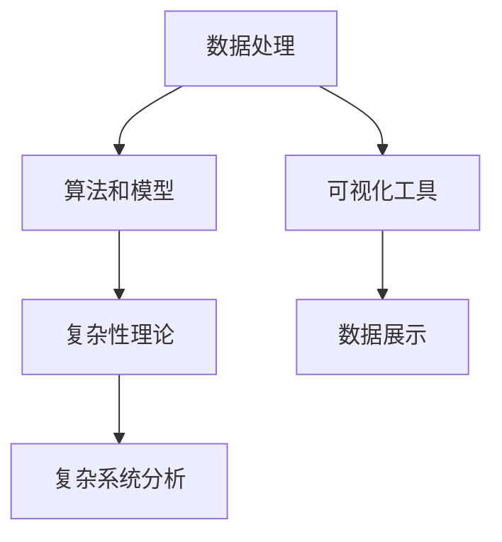

                 

# 理解洞察力：在复杂中寻找秩序

在复杂的信息时代，我们每天都在面对海量的数据和不断变化的业务场景。如何在纷繁复杂的信息中洞察本质，找到问题的关键，是每个从业者必须面对的挑战。本文将从技术角度，探讨如何通过算法和工具，在复杂环境中寻找秩序，提升我们的洞察力。

## 1. 背景介绍

### 1.1 问题由来
随着互联网和物联网技术的普及，数据量呈爆炸式增长。据估计，目前全球每秒生成的数据量超过500TB，而到2025年，这一数据量将增长至每秒12.5EB。在这样的背景下，如何从海量数据中提取出有用的信息，成为了一个迫切需要解决的问题。

### 1.2 问题核心关键点
提升洞察力的核心关键点在于对数据的高效处理和深度分析。具体来说，就是要能够：
1. 处理大规模数据：在数据量庞大的情况下，能够高效地读取、存储和处理数据。
2. 提取有用信息：从原始数据中提取出有价值的模式、趋势和规律。
3. 建立模型：构建数学或统计模型，对数据进行分析和预测。
4. 可视化分析：将分析结果以直观的方式展示出来，帮助决策者理解数据背后的含义。

## 2. 核心概念与联系

### 2.1 核心概念概述

为更好地理解如何在复杂环境中寻找秩序，本节将介绍几个密切相关的核心概念：

- **数据处理**：从原始数据中提取和清洗有用信息的过程。常用的技术包括数据清洗、特征提取、数据压缩等。
- **算法和模型**：用于对数据进行处理和分析的数学工具和模型。常见的算法包括机器学习、深度学习、优化算法等。
- **可视化工具**：用于将分析结果以图形化形式展示的工具。常见的可视化工具包括Matplotlib、Seaborn、Tableau等。
- **复杂性理论**：研究复杂系统及其特征的数学理论。帮助理解复杂系统中的秩序和混沌现象。

这些核心概念之间的逻辑关系可以通过以下Mermaid流程图来展示：



这个流程图展示了几大核心概念之间的关系：

1. 数据处理是算法和模型的输入。
2. 算法和模型是处理数据的工具。
3. 可视化工具用于展示分析结果。
4. 复杂性理论帮助理解复杂系统的内在规律。

## 3. 核心算法原理 & 具体操作步骤

### 3.1 算法原理概述

要在复杂环境中寻找秩序，我们需要使用算法和模型对数据进行处理和分析。其中，最常用的方法是机器学习和深度学习。

机器学习和深度学习的基本思想是通过算法和模型，将原始数据映射到一个更简单的空间中，从而找到其中的规律和趋势。具体来说，主要包括以下几个步骤：

1. **数据准备**：清洗和预处理数据，确保数据的质量和一致性。
2. **特征提取**：从原始数据中提取出有用的特征，用于训练模型。
3. **模型训练**：使用训练数据训练模型，找到数据中的规律和趋势。
4. **模型验证和评估**：在验证集上评估模型的性能，调整模型参数，确保模型能够泛化到未见过的数据上。
5. **模型应用**：使用训练好的模型对新数据进行预测或分类，找到其中的规律和趋势。

### 3.2 算法步骤详解

以机器学习中的线性回归为例，详细讲解算法的具体步骤：

1. **数据准备**：
   - 收集数据：从数据源收集相关数据，包括自变量和因变量。
   - 数据清洗：处理缺失值、异常值和噪声数据，确保数据的质量。
   - 数据分割：将数据分为训练集、验证集和测试集，用于模型训练和评估。

2. **特征提取**：
   - 选择特征：根据业务需求和领域知识，选择对预测有帮助的特征。
   - 特征编码：将特征转化为模型能够处理的格式，如将文本特征转化为向量。

3. **模型训练**：
   - 模型选择：选择适合的模型，如线性回归、决策树等。
   - 参数优化：使用训练数据，通过梯度下降等优化算法，优化模型的参数。
   - 模型评估：在验证集上评估模型的性能，调整模型参数，确保模型能够泛化到未见过的数据上。

4. **模型应用**：
   - 模型测试：在测试集上测试模型的性能，评估模型的泛化能力。
   - 结果解释：解释模型的输出结果，提供业务决策的依据。

### 3.3 算法优缺点

机器学习和深度学习算法在寻找复杂环境中的秩序方面具有以下优点：

1. **高效处理大规模数据**：能够在处理大规模数据时，保持较高的效率。
2. **发现数据中的规律**：能够从数据中发现隐藏的规律和趋势，提供业务决策的依据。
3. **适应性强**：能够适应不同类型的数据和任务，具有广泛的适用性。

然而，这些算法也存在一些缺点：

1. **需要大量数据**：在数据量不足的情况下，模型的性能可能受到影响。
2. **模型复杂度高**：深度学习模型通常具有较高的复杂度，需要较强的计算资源。
3. **黑盒性质**：模型通常难以解释，决策过程不透明。

尽管存在这些缺点，但机器学习和深度学习算法仍然是目前最有效的数据分析工具之一。未来的研究重点在于如何进一步提高模型的解释性和鲁棒性，降低对数据的依赖性。

### 3.4 算法应用领域

机器学习和深度学习算法在各个领域都有广泛的应用：

- **金融领域**：用于风险评估、信用评分、股票预测等。
- **医疗领域**：用于疾病诊断、药物研发、患者管理等。
- **零售领域**：用于客户细分、库存管理、价格优化等。
- **交通领域**：用于交通流量预测、路况优化、智能驾驶等。
- **制造业**：用于质量控制、生产调度、设备维护等。

## 4. 数学模型和公式 & 详细讲解  
### 4.1 数学模型构建

在线性回归中，我们使用一个线性模型来描述因变量和自变量之间的关系。假设因变量为 $y$，自变量为 $x$，则线性模型的形式为：

$$
y = \beta_0 + \beta_1 x_1 + \beta_2 x_2 + ... + \beta_n x_n + \epsilon
$$

其中 $\beta_0$ 为截距，$\beta_1, \beta_2, ..., \beta_n$ 为自变量的系数，$\epsilon$ 为误差项。

线性回归的目标是最小化预测值与真实值之间的误差，常用的损失函数为均方误差（MSE）：

$$
MSE = \frac{1}{N} \sum_{i=1}^N (y_i - \hat{y}_i)^2
$$

其中 $y_i$ 为真实值，$\hat{y}_i$ 为预测值。

### 4.2 公式推导过程

在线性回归中，我们使用最小二乘法（Least Squares Method）来求解模型参数。最小二乘法通过最小化损失函数，得到最优的模型参数。具体推导过程如下：

1. 将损失函数对参数 $\beta_0, \beta_1, ..., \beta_n$ 求导，得到偏导数。
2. 将偏导数设置为0，求解方程组，得到模型参数。
3. 将求得的模型参数代入损失函数，计算最小值。

推导过程如下：

$$
\frac{\partial MSE}{\partial \beta_0} = -2 \sum_{i=1}^N (y_i - \hat{y}_i) = 0
$$

$$
\frac{\partial MSE}{\partial \beta_j} = -2 \sum_{i=1}^N (x_{ij} - \bar{x}_j)(y_i - \hat{y}_i) = 0
$$

其中 $\bar{x}_j$ 为自变量 $x_j$ 的平均值。

求解上述方程组，得到最优的模型参数：

$$
\hat{\beta}_j = \frac{\sum_{i=1}^N x_{ij}(y_i - \bar{y})}{\sum_{i=1}^N x_{ij}^2}, j=0,1,...,n
$$

其中 $\bar{y}$ 为因变量的平均值。

### 4.3 案例分析与讲解

以房价预测为例，我们可以使用线性回归模型来预测房价。假设我们收集了历史房价数据和相关特征，如房屋面积、位置、房龄等，使用最小二乘法求解最优的模型参数，并使用训练好的模型对新数据进行预测。

假设我们有100个样本，其中自变量和因变量的值如下：

| x1 | x2 | x3 | y |
|-----|-----|-----|---|
| 1 | 2 | 3 | 4 |
| 2 | 4 | 5 | 6 |
| 3 | 5 | 6 | 7 |
| ... | ... | ... | ... |
| 10 | 12 | 14 | 16 |

我们可以将自变量 $x$ 转化为向量形式：

$$
X = \begin{bmatrix} 1 & 2 & 3 \\ 2 & 4 & 5 \\ 3 & 5 & 6 \\ ... \\ 10 & 12 & 14 \end{bmatrix}, Y = \begin{bmatrix} 4 \\ 6 \\ 7 \\ ... \\ 16 \end{bmatrix}
$$

使用最小二乘法求解最优的模型参数：

$$
\hat{\beta} = (X^T X)^{-1} X^T Y
$$

计算得到最优的模型参数后，我们可以使用训练好的模型对新数据进行预测。假设我们有一个新数据点 $(x_1', x_2', x_3')$，预测其房价为 $y'$。

$$
y' = \hat{\beta}_0 + \hat{\beta}_1 x_1' + \hat{\beta}_2 x_2' + \hat{\beta}_3 x_3'
$$

## 5. 项目实践：代码实例和详细解释说明

### 5.1 开发环境搭建

在进行数据处理和模型训练的实践中，我们需要准备好开发环境。以下是使用Python进行Scikit-learn开发的环境配置流程：

1. 安装Anaconda：从官网下载并安装Anaconda，用于创建独立的Python环境。

2. 创建并激活虚拟环境：
```bash
conda create -n scikit-learn-env python=3.8 
conda activate scikit-learn-env
```

3. 安装Scikit-learn：
```bash
conda install scikit-learn pandas numpy matplotlib tqdm jupyter notebook ipython
```

4. 安装相关工具包：
```bash
pip install scipy
```

完成上述步骤后，即可在`scikit-learn-env`环境中开始实践。

### 5.2 源代码详细实现

下面我们以房价预测为例，给出使用Scikit-learn进行线性回归的PyTorch代码实现。

首先，导入相关库并定义数据集：

```python
import pandas as pd
import numpy as np
from sklearn.model_selection import train_test_split
from sklearn.linear_model import LinearRegression
from sklearn.metrics import mean_squared_error

# 读取数据
data = pd.read_csv('house_prices.csv')

# 选择特征和因变量
X = data[['area', 'location', 'age']]
y = data['price']

# 数据分割
X_train, X_test, y_train, y_test = train_test_split(X, y, test_size=0.2, random_state=42)

# 定义模型
model = LinearRegression()

# 训练模型
model.fit(X_train, y_train)

# 评估模型
y_pred = model.predict(X_test)
mse = mean_squared_error(y_test, y_pred)
print(f"MSE: {mse:.2f}")
```

然后，进行模型的可视化：

```python
import matplotlib.pyplot as plt
import seaborn as sns

# 可视化结果
sns.scatterplot(x=X_test['area'], y=y_test)
sns.scatterplot(x=X_test['location'], y=y_pred)
plt.show()
```

### 5.3 代码解读与分析

让我们再详细解读一下关键代码的实现细节：

**数据处理**：
- 使用Pandas库读取CSV文件，方便处理数据。
- 选择相关特征和因变量，进行数据清洗和预处理。

**模型训练**：
- 使用Scikit-learn库中的LinearRegression模型进行线性回归训练。
- 使用train_test_split方法进行数据分割，划分为训练集和测试集。
- 使用fit方法进行模型训练，得到最优的模型参数。

**模型评估**：
- 使用predict方法对测试集进行预测，得到预测值。
- 使用mean_squared_error方法计算预测值和真实值之间的误差，得到均方误差（MSE）。
- 打印MSE值，评估模型性能。

**可视化分析**：
- 使用Seaborn库进行数据可视化，将预测值和真实值绘制成散点图。
- 通过可视化结果，直观地展示模型的预测能力。

可以看到，Scikit-learn库提供了一站式的数据处理和模型训练工具，能够快速完成线性回归的实践。通过可视化分析，我们能够更加直观地理解模型的性能和预测结果。

## 6. 实际应用场景

### 6.1 智能推荐系统

智能推荐系统已经成为电商、新闻、视频等领域的重要应用。通过机器学习算法，能够根据用户的历史行为数据和偏好，推荐相关的商品、文章和视频，提高用户的满意度。

在技术实现上，可以收集用户的行为数据，如浏览历史、点击记录、评分等，作为监督数据，对模型进行训练。微调后的推荐模型能够根据用户的兴趣，推荐最相关的商品或内容，显著提升用户体验。

### 6.2 预测销售量

销售预测是企业中非常重要的决策支持工具，帮助企业制定合理的生产和库存计划。传统的销售预测通常依赖历史销售数据和业务经验，容易受到业务人员主观判断的影响。

通过机器学习算法，企业可以根据历史销售数据、市场趋势、季节性因素等，建立预测模型，对未来的销售量进行预测。微调后的模型能够提供更加准确和客观的预测结果，帮助企业制定科学的生产计划。

### 6.3 金融风险评估

金融风险评估是金融领域的重要任务，通过机器学习算法，能够对客户的信用风险、违约概率等进行预测。传统的风险评估依赖人工审核，成本高且效率低。

通过机器学习算法，银行和保险公司可以根据客户的个人信息、信用记录、交易数据等，建立风险评估模型。微调后的模型能够自动进行风险评估，提高风险控制的效率和准确性。

### 6.4 未来应用展望

随着机器学习算法的不断发展，智能推荐、销售预测、金融风险评估等应用将更加广泛。未来，这些技术将在更多领域得到应用，为各行各业带来变革性影响。

在智慧医疗领域，机器学习算法可以帮助医生进行疾病诊断、药物研发等工作，提升医疗服务的智能化水平。在智能交通领域，通过机器学习算法，可以实现交通流量预测、智能交通管理等，提升交通系统的运行效率和安全性。

## 7. 工具和资源推荐
### 7.1 学习资源推荐

为了帮助开发者系统掌握机器学习和数据处理的理论基础和实践技巧，这里推荐一些优质的学习资源：

1. 《机器学习》系列博文：由大模型技术专家撰写，深入浅出地介绍了机器学习的基本概念和经典算法。

2. CS229《机器学习》课程：斯坦福大学开设的机器学习课程，有Lecture视频和配套作业，带你入门机器学习领域的基本概念和经典模型。

3. 《Python机器学习》书籍：机器学习领域的经典教材，详细介绍了机器学习算法的实现方法，是学习机器学习的必备工具。

4. Scikit-learn官方文档：Scikit-learn库的官方文档，提供了海量模型和算法的样例代码，是上手实践的必备资料。

5. TensorFlow官方文档：TensorFlow库的官方文档，详细介绍了深度学习模型的实现方法，是学习深度学习的必备工具。

通过对这些资源的学习实践，相信你一定能够快速掌握机器学习和数据处理的精髓，并用于解决实际的业务问题。

### 7.2 开发工具推荐

高效的开发离不开优秀的工具支持。以下是几款用于机器学习开发的常用工具：

1. Python：作为机器学习的主流编程语言，Python具有丰富的库和工具，能够快速完成数据处理和模型训练。

2. Scikit-learn：基于Python的机器学习库，提供了一站式的数据处理和模型训练工具，是学习机器学习的必备工具。

3. TensorFlow：由Google主导开发的深度学习框架，生产部署方便，适合大规模工程应用。

4. PyTorch：由Facebook主导开发的深度学习框架，灵活动态的计算图，适合快速迭代研究。

5. Weights & Biases：模型训练的实验跟踪工具，可以记录和可视化模型训练过程中的各项指标，方便对比和调优。

6. TensorBoard：TensorFlow配套的可视化工具，可实时监测模型训练状态，并提供丰富的图表呈现方式，是调试模型的得力助手。

合理利用这些工具，可以显著提升机器学习模型的开发效率，加快创新迭代的步伐。

### 7.3 相关论文推荐

机器学习算法的发展源于学界的持续研究。以下是几篇奠基性的相关论文，推荐阅读：

1. Gradient Descent: Towards a New Optimal Method for Machine Learning（梯度下降算法）：梯度下降算法是机器学习中最基础的算法之一，奠定了机器学习算法的基础。

2. A Tutorial on Support Vector Regression Machines（支持向量回归机）：支持向量回归机是一种常用的回归算法，介绍了机器学习算法的基本原理和应用。

3. Deep Learning（深度学习）：Ian Goodfellow等人的经典书籍，详细介绍了深度学习算法的基本概念和实现方法。

4. Deep Learning for Healthcare（深度学习在医疗中的应用）：通过深度学习算法，在医疗领域进行疾病诊断、药物研发等工作，提升了医疗服务的智能化水平。

这些论文代表了大模型微调技术的发展脉络。通过学习这些前沿成果，可以帮助研究者把握学科前进方向，激发更多的创新灵感。

## 8. 总结：未来发展趋势与挑战

### 8.1 总结

本文对机器学习和数据处理的基本原理和实践技巧进行了全面系统的介绍。首先阐述了机器学习和数据处理的研究背景和意义，明确了机器学习在复杂环境中寻找秩序的关键作用。其次，从原理到实践，详细讲解了机器学习算法的核心算法原理和具体操作步骤，给出了机器学习任务开发的完整代码实例。同时，本文还广泛探讨了机器学习算法在智能推荐、销售预测、金融风险评估等多个领域的应用前景，展示了机器学习算法的巨大潜力。此外，本文精选了机器学习算法的各类学习资源，力求为读者提供全方位的技术指引。

通过本文的系统梳理，可以看到，机器学习和数据处理算法在复杂环境中寻找秩序的能力得到了充分发挥，能够帮助我们从海量数据中提取有价值的信息，为业务决策提供科学依据。未来，伴随机器学习算法的持续演进，相信其在更多领域的应用将更加广泛，为各行各业带来变革性影响。

### 8.2 未来发展趋势

展望未来，机器学习和数据处理算法将呈现以下几个发展趋势：

1. 算法复杂度提升：随着深度学习算法的发展，未来将出现更加复杂的模型结构，能够处理更加复杂的数据。

2. 自动化水平提高：未来的机器学习算法将更加自动化，能够自动选择最优的特征和模型，提高算法的鲁棒性和可解释性。

3. 多模态融合：未来的机器学习算法将更加注重多模态数据的融合，将视觉、语音、文本等不同类型的数据进行协同建模。

4. 知识图谱整合：未来的机器学习算法将更加注重知识图谱的整合，将符号化的先验知识与神经网络模型进行融合，提升模型的可解释性和泛化能力。

5. 模型解释性加强：未来的机器学习算法将更加注重模型的解释性，通过因果分析和博弈论等工具，增强模型的可解释性和可解释性。

这些趋势凸显了机器学习和数据处理算法的发展前景。这些方向的探索发展，将进一步提升机器学习算法的性能和应用范围，为各行各业带来更高效、更智能的解决方案。

### 8.3 面临的挑战

尽管机器学习和数据处理算法已经取得了瞩目成就，但在迈向更加智能化、普适化应用的过程中，它仍面临着诸多挑战：

1. 数据质量问题：机器学习算法依赖高质量的数据，数据质量问题会严重影响算法的性能。如何获取高质量的数据，是一个长期需要解决的问题。

2. 算法鲁棒性不足：机器学习算法在面对数据噪声和异常值时，容易产生过拟合或欠拟合。如何提高算法的鲁棒性，是一个需要长期研究的问题。

3. 模型可解释性不足：机器学习模型通常难以解释，决策过程不透明。如何提高模型的可解释性，是一个需要解决的问题。

4. 计算资源限制：深度学习算法通常需要大量的计算资源，如何提高算法的计算效率，是一个需要解决的问题。

5. 伦理和隐私问题：机器学习算法在处理敏感数据时，需要考虑伦理和隐私问题，如何保护数据隐私，是一个需要解决的问题。

这些挑战是机器学习和数据处理算法迈向智能化、普适化应用过程中需要解决的问题，需要学界和产业界共同努力，才能取得突破性的进展。

### 8.4 研究展望

面对机器学习和数据处理算法面临的挑战，未来的研究需要在以下几个方面寻求新的突破：

1. 探索自动化和可解释性相结合的算法。结合自动化和可解释性，提高算法的鲁棒性和可解释性，为业务决策提供科学依据。

2. 研究多模态数据融合的方法。将视觉、语音、文本等不同类型的数据进行协同建模，提高模型的性能和应用范围。

3. 开发更加高效的算法和工具。开发更加高效的计算图、更加智能化的自动化工具，提高算法的计算效率和可操作性。

4. 融合知识图谱和先验知识。将符号化的先验知识与神经网络模型进行融合，提升模型的可解释性和泛化能力。

5. 保护数据隐私和伦理道德。在算法设计和应用过程中，考虑伦理和隐私问题，保护数据隐私，确保算法的应用符合人类价值观和伦理道德。

这些研究方向的探索，将引领机器学习和数据处理算法迈向更高的台阶，为各行各业带来更高效、更智能的解决方案。面向未来，机器学习和数据处理算法需要在自动化、可解释性、多模态融合、知识图谱整合等方面取得新的突破，才能真正实现智能化、普适化的应用。

