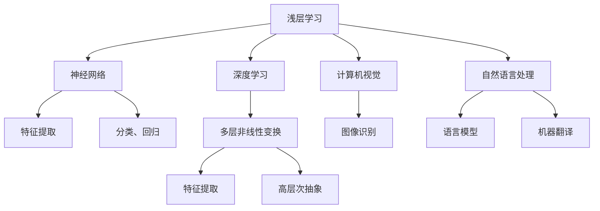

                 

# 理解的深度：从表层学习到深度学习的转变

> 关键词：深度学习,浅层学习,神经网络,特征提取,计算机视觉,自然语言处理

## 1. 背景介绍

在计算机科学的演变历程中，学习算法始终占据着核心地位。从早期的浅层前向传播神经网络，到后来经典的支持向量机、决策树等，再到目前极为兴盛的深度学习范式，学习算法不断演进，推动着AI技术不断进步。本文将从表层学习到深度学习的转变进行深入探索，揭示这一转变背后的原理、特点及应用。

## 2. 核心概念与联系

### 2.1 核心概念概述

为更好地理解从表层学习到深度学习的转变，本节将介绍几个核心概念：

- **浅层学习**：传统的前向传播神经网络，通常包含一个或几个线性层，后跟一个或多个非线性激活层。主要应用于特征提取、分类、回归等基本任务。

- **深度学习**：基于多层非线性变换的神经网络，通常包含多个隐层，可以自动学习从输入到输出的复杂非线性映射关系。目前广泛应用于计算机视觉、自然语言处理、语音识别等多个领域。

- **神经网络**：由大量人工神经元（节点）连接构成的网络结构，用于进行模式识别、预测等任务。

- **特征提取**：从原始输入数据中提取有意义的特征，便于后续的分类、聚类、识别等任务。

- **计算机视觉**：研究如何让计算机理解并解释图像、视频等视觉信息。

- **自然语言处理**：研究如何让计算机理解并处理人类语言，包括语言模型、机器翻译、文本生成等任务。

这些核心概念共同构成了从表层学习到深度学习的转变背景，理解它们有助于我们深入探索深度学习的本质。

### 2.2 核心概念原理和架构的 Mermaid 流程图(Mermaid 流程节点中不要有括号、逗号等特殊字符)



这个流程图展示了浅层学习和深度学习的主要区别与联系：

1. 浅层学习通常只包含1-2层神经元，适用于简单的特征提取和基本的分类、回归任务。
2. 深度学习包含多层神经元，可以自动学习高层次的抽象特征，适用于复杂任务。
3. 浅层学习主要用于计算机视觉、自然语言处理的基础任务，而深度学习在这些领域的应用非常广泛。
4. 浅层学习与深度学习都涉及特征提取，但深度学习能自动从数据中学习到更复杂、更抽象的特征。

## 3. 核心算法原理 & 具体操作步骤

### 3.1 算法原理概述

深度学习的核心在于多层非线性变换，通过反向传播算法优化权重参数，自动学习高层次的抽象特征。相比浅层学习，深度学习具有以下特点：

1. **自动特征提取**：深度学习通过多层网络自动学习从输入到输出的特征表示，无需手动设计特征提取器。
2. **高层次抽象**：深度学习能够学习到复杂的非线性映射，具备强健的泛化能力。
3. **并行计算**：深度学习模型通常由大量神经元组成，可以并行计算，加速训练过程。
4. **数据依赖**：深度学习的效果高度依赖于数据质量，需要大量高质量的标注数据。

### 3.2 算法步骤详解

基于深度学习的特征提取和分类任务，其核心步骤如下：

**Step 1: 数据准备**
- 收集、预处理数据，将其划分为训练集、验证集和测试集。
- 对于图像、文本等不同类型的数据，需要设计相应的预处理步骤，如归一化、分词、截断等。

**Step 2: 网络设计**
- 选择合适的深度神经网络结构，如卷积神经网络（CNN）、循环神经网络（RNN）、长短时记忆网络（LSTM）、Transformer等。
- 设计合适的层数、神经元数量、激活函数等超参数。

**Step 3: 模型训练**
- 选择合适的优化算法，如随机梯度下降（SGD）、Adam、Adagrad等，设置合适的学习率、批大小等超参数。
- 使用反向传播算法优化模型参数，不断调整权重以最小化损失函数。

**Step 4: 模型评估**
- 在验证集上评估模型性能，如准确率、精确率、召回率、F1-score等指标。
- 调整模型参数或网络结构，以提高模型性能。

**Step 5: 模型应用**
- 在测试集上测试模型的泛化能力，确认模型的稳定性。
- 使用模型进行特征提取、分类、预测等任务。

### 3.3 算法优缺点

深度学习具有以下优点：
1. **强大的表达能力**：多层非线性变换可以学习到复杂的数据分布，具备高层次的抽象能力。
2. **自动特征提取**：无需手动设计特征提取器，可以自动学习到特征表示。
3. **泛化能力强**：在大型数据集上进行训练，具备良好的泛化性能。

同时，深度学习也存在以下缺点：
1. **模型复杂度高**：深层网络的参数量巨大，训练和推理成本较高。
2. **过拟合风险高**：深层网络容易过拟合训练集，需要更多的正则化技术。
3. **数据需求量大**：需要大量高质量的标注数据，对于小样本问题效果有限。
4. **解释性差**：深层网络通常被视为"黑盒"，难以解释内部工作机制。

### 3.4 算法应用领域

深度学习在计算机视觉、自然语言处理、语音识别等领域得到了广泛应用，以下是几个主要应用方向：

- **计算机视觉**：图像分类、目标检测、人脸识别、图像生成等任务。卷积神经网络（CNN）是主要应用模型。

- **自然语言处理**：语言模型、机器翻译、文本分类、情感分析、对话系统等任务。循环神经网络（RNN）和Transformer模型是主要应用。

- **语音识别**：语音转文本、说话人识别、情感识别等任务。卷积神经网络（CNN）和长短时记忆网络（LSTM）是主要应用模型。

## 4. 数学模型和公式 & 详细讲解 & 举例说明

### 4.1 数学模型构建

基于深度学习的基本框架，假设输入数据为 $x$，目标输出为 $y$，网络结构为 $h_W(x)$，其中 $W$ 为网络权重，则目标函数可以表示为：

$$
L(h_W(x), y) = \frac{1}{2} ||h_W(x) - y||^2
$$

其中 $||.||$ 表示范数，$h_W(x)$ 为网络的预测输出，$y$ 为真实标签。

### 4.2 公式推导过程

对于深层神经网络，采用前向传播和反向传播算法进行训练。假设网络包含 $L$ 层，第 $l$ 层的输出为 $a^{(l)}$，权重为 $W^{(l)}$，激活函数为 $\phi$，则前向传播的计算过程为：

$$
a^{(1)} = W^{(1)} x
$$

$$
a^{(l)} = \phi(W^{(l)} a^{(l-1)})
$$

对于损失函数 $L(h_W(x), y)$ 关于 $W$ 的梯度，可以通过链式法则进行推导：

$$
\frac{\partial L}{\partial W^{(l)}} = \frac{\partial L}{\partial a^{(l)}} \frac{\partial a^{(l)}}{\partial z^{(l)}} \frac{\partial z^{(l)}}{\partial W^{(l)}}
$$

其中 $z^{(l)} = W^{(l)} a^{(l-1)} + b^{(l)}$，$b^{(l)}$ 为偏置项。

### 4.3 案例分析与讲解

假设有一个简单的多层感知器（MLP），包含两个隐层，每个隐层包含10个神经元，激活函数为ReLU。设输入 $x \in \mathbb{R}^{28\times28}$，输出 $y \in \mathbb{R}^{10}$。其网络结构为：

$$
h_W(x) = \phi(\phi(W^{(1)} x + b^{(1)}) W^{(2)} + b^{(2)})
$$

其中 $W^{(1)} \in \mathbb{R}^{10\times28\times28}$，$b^{(1)} \in \mathbb{R}^{10}$，$W^{(2)} \in \mathbb{R}^{10\times10}$，$b^{(2)} \in \mathbb{R}^{10}$。

设 $x$ 表示手写数字图像的像素值，$y$ 表示数字标签。给定一个训练集 $(x_i, y_i)$，网络的预测输出为 $h_W(x)$，则损失函数为：

$$
L(h_W(x_i), y_i) = \frac{1}{2} ||h_W(x_i) - y_i||^2
$$

利用反向传播算法更新网络参数 $W^{(1)}$ 和 $W^{(2)}$，过程如下：

1. 前向传播计算 $a^{(1)} = W^{(1)} x$，$a^{(2)} = \phi(W^{(2)} a^{(1)} + b^{(2)})$，$h_W(x) = a^{(2)}$。
2. 计算损失函数 $L$。
3. 反向传播计算梯度：$\frac{\partial L}{\partial a^{(2)}}$，$\frac{\partial a^{(2)}}{\partial z^{(2)}}$，$\frac{\partial z^{(2)}}{\partial W^{(2)}}$。
4. 利用梯度下降算法更新权重 $W^{(2)}$，$b^{(2)}$。
5. 重复步骤1-4，直到网络收敛。

## 5. 项目实践：代码实例和详细解释说明

### 5.1 开发环境搭建

在进行深度学习项目实践前，我们需要准备好开发环境。以下是使用Python进行PyTorch开发的环境配置流程：

1. 安装Anaconda：从官网下载并安装Anaconda，用于创建独立的Python环境。

2. 创建并激活虚拟环境：
```bash
conda create -n pytorch-env python=3.8 
conda activate pytorch-env
```

3. 安装PyTorch：根据CUDA版本，从官网获取对应的安装命令。例如：
```bash
conda install pytorch torchvision torchaudio cudatoolkit=11.1 -c pytorch -c conda-forge
```

4. 安装TensorBoard：用于可视化模型的训练过程，可以在TensorFlow中配合使用。
```bash
pip install tensorboard
```

5. 安装Numpy和Matplotlib：用于数值计算和图形绘制。
```bash
pip install numpy matplotlib
```

完成上述步骤后，即可在`pytorch-env`环境中开始深度学习项目的开发。

### 5.2 源代码详细实现

下面我们以手写数字识别（MNIST）任务为例，给出使用PyTorch进行深度学习的代码实现。

首先，导入必要的库：

```python
import torch
import torch.nn as nn
import torch.optim as optim
from torchvision import datasets, transforms
```

接着，定义数据集和数据预处理：

```python
transform = transforms.Compose([
    transforms.ToTensor(),
    transforms.Normalize((0.1307,), (0.3081,))
])

train_dataset = datasets.MNIST('data/', train=True, download=True, transform=transform)
test_dataset = datasets.MNIST('data/', train=False, download=True, transform=transform)
```

定义神经网络模型：

```python
class Net(nn.Module):
    def __init__(self):
        super(Net, self).__init__()
        self.fc1 = nn.Linear(28 * 28, 500)
        self.fc2 = nn.Linear(500, 10)

    def forward(self, x):
        x = x.view(-1, 28 * 28)
        x = torch.relu(self.fc1(x))
        x = self.fc2(x)
        return x
```

定义优化器和损失函数：

```python
model = Net()
criterion = nn.CrossEntropyLoss()
optimizer = optim.SGD(model.parameters(), lr=0.01, momentum=0.5)
```

定义训练函数：

```python
def train(epoch):
    model.train()
    running_loss = 0.0
    for i, data in enumerate(train_loader, 0):
        inputs, labels = data
        optimizer.zero_grad()
        outputs = model(inputs)
        loss = criterion(outputs, labels)
        loss.backward()
        optimizer.step()
        running_loss += loss.item()
    print('Train Epoch: {} \t Loss: {:.6f}'.format(epoch, running_loss / len(train_loader)))
```

定义测试函数：

```python
def test():
    model.eval()
    correct = 0
    total = 0
    with torch.no_grad():
        for data in test_loader:
            inputs, labels = data
            outputs = model(inputs)
            _, predicted = torch.max(outputs.data, 1)
            total += labels.size(0)
            correct += (predicted == labels).sum().item()
    print('Accuracy of the network on the 10000 test images: {} %'.format(100 * correct / total))
```

启动训练过程：

```python
for epoch in range(1, 10):
    train(epoch)
    test()
```

以上就是使用PyTorch进行手写数字识别的完整代码实现。可以看到，通过简单的代码，我们就搭建了一个多层感知器模型，完成了数据的预处理和模型的训练。

### 5.3 代码解读与分析

让我们再详细解读一下关键代码的实现细节：

**Net类定义**：
- 继承自nn.Module，表示一个神经网络。
- 包含两个线性层（fc1和fc2），输入和输出大小分别为784和500、10，对应28x28的图像。
- 前向传播函数forward定义了从输入到输出的计算过程。

**模型优化器**：
- 使用SGD优化器，设置学习率0.01和动量0.5，用于最小化交叉熵损失。

**训练函数**：
- 定义了训练集数据迭代器train_loader，使用数据集train_dataset加载数据。
- 在每个epoch中，对模型进行前向传播、计算损失、反向传播和参数更新。
- 在epoch结束后，输出该epoch的平均损失。

**测试函数**：
- 定义了测试集数据迭代器test_loader，使用数据集test_dataset加载数据。
- 在测试集上计算模型的准确率。

**训练过程**：
- 循环10个epoch，在每个epoch中训练模型，并在测试集上测试。

可以看到，深度学习的代码实现相对简洁，主要在于选择合适的网络结构、定义优化器和损失函数、进行前向传播和反向传播。

## 6. 实际应用场景

### 6.1 计算机视觉

深度学习在计算机视觉领域的应用非常广泛，涵盖了图像识别、目标检测、图像生成等多个方向。

- **图像分类**：如识别猫狗、识别人脸、识别交通标志等。深度学习模型（如CNN）在图像分类任务上取得了州际级的效果。

- **目标检测**：如检测行人、车辆、交通信号灯等。深度学习模型（如R-CNN、YOLO）在目标检测任务上实现了快速准确的检测效果。

- **图像生成**：如生成手写数字、人脸图像、艺术品等。深度学习模型（如GAN、VAE）在图像生成任务上取得了令人瞩目的效果。

### 6.2 自然语言处理

深度学习在自然语言处理领域的应用同样非常广泛，包括机器翻译、文本分类、情感分析等多个方向。

- **机器翻译**：如将英文翻译成中文、将中文翻译成英文等。深度学习模型（如Seq2Seq、Transformer）在机器翻译任务上实现了较高的翻译质量。

- **文本分类**：如新闻分类、评论情感分析等。深度学习模型（如CNN、RNN）在文本分类任务上取得了优异的性能。

- **情感分析**：如分析用户评论、社交媒体的情感倾向等。深度学习模型（如LSTM、BERT）在情感分析任务上具备良好的泛化能力。

### 6.3 语音识别

深度学习在语音识别领域的应用也日益普及，如语音转文本、说话人识别等。

- **语音转文本**：将语音信号转换为文本，如语音助手、语音识别输入等。深度学习模型（如CNN、RNN）在语音转文本任务上取得了较高的准确率。

- **说话人识别**：识别说话人的身份，如电话中的用户验证、视频中的说话人认证等。深度学习模型（如LSTM、Transformer）在说话人识别任务上表现出色。

### 6.4 未来应用展望

随着深度学习技术的不断进步，其应用场景也将不断扩展。以下是几个可能的未来方向：

- **自动驾驶**：深度学习模型可以用于处理大量的视觉和传感器数据，进行环境感知和决策。自动驾驶技术在深度学习技术的推动下，正在不断走向成熟。

- **医疗影像分析**：深度学习模型可以用于分析医学影像，如X光片、CT图像等，辅助医生进行疾病诊断和治疗。

- **金融风险评估**：深度学习模型可以用于分析金融市场数据，预测市场趋势，评估风险等级。

- **智能家居**：深度学习模型可以用于智能家居设备的控制和优化，如语音助手、智能家电等。

## 7. 工具和资源推荐

### 7.1 学习资源推荐

为帮助开发者系统掌握深度学习的基本原理和实践技巧，这里推荐一些优质的学习资源：

1. **深度学习入门系列**：深入浅出地介绍了深度学习的基本概念和算法，适合初学者入门。

2. **Deep Learning Specialization**：由Coursera提供的深度学习课程，由深度学习领域的权威专家讲授。

3. **Deep Learning with Python**：由Google深度学习团队编写的书籍，适合用Python进行深度学习开发。

4. **PyTorch官方文档**：提供了详细的PyTorch教程和文档，适合PyTorch开发初学者使用。

5. **TensorFlow官方文档**：提供了丰富的TensorFlow教程和文档，适合TensorFlow开发初学者使用。

通过对这些资源的学习实践，相信你一定能够快速掌握深度学习的精髓，并用于解决实际的计算机视觉、自然语言处理和语音识别问题。

### 7.2 开发工具推荐

高效的开发离不开优秀的工具支持。以下是几款用于深度学习开发的常用工具：

1. **PyTorch**：基于Python的开源深度学习框架，灵活动态的计算图，适合快速迭代研究。

2. **TensorFlow**：由Google主导开发的开源深度学习框架，生产部署方便，适合大规模工程应用。

3. **Keras**：高级深度学习API，可以在TensorFlow、Theano、CNTK等后端上运行，适合快速原型开发。

4. **MXNet**：由Apache开发的深度学习框架，支持多种编程语言，适合跨平台开发。

5. **Jupyter Notebook**：用于编写和分享代码的Web界面工具，支持实时执行代码和数据可视化。

合理利用这些工具，可以显著提升深度学习项目的开发效率，加快创新迭代的步伐。

### 7.3 相关论文推荐

深度学习的发展得益于学界的持续研究。以下是几篇奠基性的相关论文，推荐阅读：

1. **ImageNet Classification with Deep Convolutional Neural Networks**：提出了深度卷积神经网络，用于大规模图像识别任务。

2. **Long Short-Term Memory**：提出了长短时记忆网络，用于处理序列数据。

3. **Convolutional Neural Networks for Sentence Classification**：提出了卷积神经网络用于文本分类任务。

4. **Attention Is All You Need**：提出了Transformer模型，用于自然语言处理任务。

5. **Generative Adversarial Nets**：提出了生成对抗网络，用于图像生成任务。

这些论文代表了大深度学习的发展脉络。通过学习这些前沿成果，可以帮助研究者把握学科前进方向，激发更多的创新灵感。

## 8. 总结：未来发展趋势与挑战

### 8.1 研究成果总结

本文对深度学习的发展历程和应用进行了全面系统的介绍。首先阐述了深度学习的基本原理和核心算法，展示了深度学习在计算机视觉、自然语言处理和语音识别等领域的广泛应用。然后介绍了深度学习的数学模型和优化算法，详细讲解了深度学习的实践步骤。通过这些内容，使读者系统掌握了深度学习的核心概念和实践技巧。

### 8.2 未来发展趋势

展望未来，深度学习技术将呈现以下几个发展趋势：

1. **模型规模持续增大**：随着计算资源的丰富，深度学习模型的规模将进一步扩大，具备更强的泛化能力和表达能力。

2. **模型结构日益复杂**：深度学习模型将具备更深的层次和更多的神经元，以应对更复杂的任务。

3. **自监督学习范式兴起**：自监督学习可以有效地利用未标注数据进行预训练，减少对标注数据的依赖。

4. **联邦学习普及**：联邦学习可以在不共享数据的情况下，通过分布式训练提高模型性能。

5. **跨模态学习发展**：深度学习将进一步拓展到多模态学习，处理图像、语音、文本等多种类型的数据。

### 8.3 面临的挑战

尽管深度学习技术取得了巨大的成功，但在其发展过程中，仍面临诸多挑战：

1. **数据需求巨大**：深度学习模型需要大量高质量的标注数据，获取标注数据的成本较高。

2. **模型复杂度高**：深层网络参数量巨大，训练和推理成本高，需要高效的计算资源。

3. **过拟合风险高**：深层网络容易过拟合训练集，需要更多的正则化技术。

4. **可解释性差**：深度学习模型通常被视为"黑盒"，难以解释内部工作机制。

5. **计算资源需求高**：深度学习需要高性能的计算资源，对于小型企业和研究机构而言，硬件成本较高。

### 8.4 研究展望

面对深度学习所面临的挑战，未来的研究需要在以下几个方面寻求新的突破：

1. **高效计算范式**：开发更加高效的计算范式，如分布式训练、模型压缩、模型量化等，降低深度学习的计算成本。

2. **自监督学习范式**：发展更加有效的自监督学习范式，利用未标注数据进行预训练，减少对标注数据的依赖。

3. **可解释性研究**：研究如何提高深度学习模型的可解释性，使其具备更好的透明度和可信度。

4. **跨模态学习研究**：开发更加通用的跨模态学习算法，处理图像、语音、文本等多种类型的数据。

这些研究方向的探索，必将引领深度学习技术迈向更高的台阶，为计算机视觉、自然语言处理和语音识别等领域的持续进步提供新的动力。面向未来，深度学习需要与其他人工智能技术进行更深入的融合，如知识表示、因果推理、强化学习等，共同推动人工智能技术的全面发展。

## 9. 附录：常见问题与解答

**Q1: 深度学习和浅层学习的区别是什么？**

A: 深度学习和浅层学习的区别主要在于网络结构的不同。浅层学习通常只包含1-2层神经元，适用于简单的特征提取和基本的分类、回归任务。而深度学习包含多层神经元，可以自动学习高层次的抽象特征，适用于复杂任务。

**Q2: 深度学习算法的核心是什么？**

A: 深度学习算法的核心是多层非线性变换，通过反向传播算法优化权重参数，自动学习高层次的抽象特征。其中，前向传播和反向传播算法是深度学习算法的核心，用于计算损失函数和更新网络参数。

**Q3: 深度学习的应用场景有哪些？**

A: 深度学习在计算机视觉、自然语言处理、语音识别等多个领域得到了广泛应用，包括图像分类、目标检测、图像生成、机器翻译、文本分类、情感分析、语音转文本、说话人识别等任务。

**Q4: 深度学习的缺点是什么？**

A: 深度学习的缺点包括模型复杂度高、计算资源需求高、过拟合风险高、可解释性差等。这些问题需要进一步优化和改进，才能实现更广泛的应用。

**Q5: 未来深度学习技术将面临哪些挑战？**

A: 未来深度学习技术将面临数据需求巨大、计算资源需求高、过拟合风险高、可解释性差等挑战。需要在高效计算范式、自监督学习范式、可解释性研究、跨模态学习等方面寻求新的突破。

通过以上详细解答，相信读者对深度学习的核心概念、算法原理和应用前景有了更深入的理解，能够更好地应对深度学习技术的发展挑战，推动人工智能技术的持续进步。

---

作者：禅与计算机程序设计艺术 / Zen and the Art of Computer Programming

