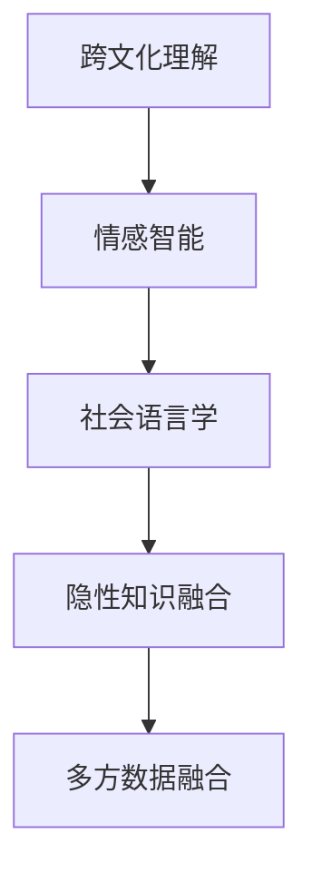

                 

# 理解的艺术：同理心与跨文化洞察力

> 关键词：同理心,跨文化洞察力,人工智能,自然语言处理,情感分析,多语言翻译,社交网络分析

## 1. 背景介绍

### 1.1 问题由来

在当今全球化的世界中，跨文化交流成为了人类社会的常态。不同国家和地区的人们通过文字、语音、视频等多种方式进行交流，而这种交流往往需要跨越语言和文化的障碍。近年来，人工智能技术在自然语言处理(NLP)领域取得了巨大的突破，尤其是基于深度学习的模型，如Transformer和BERT等，已经在语言理解、生成、翻译等多个方面展示了其强大的能力。

然而，这些模型在跨文化交流中仍面临着一些挑战：

- **文化差异**：不同语言和文化的表达方式和习惯差异较大，简单地进行语言翻译并不能完全传达原始语言的含义。
- **情感理解**：人类情感表达多样且复杂，而机器模型往往难以理解其细微之处。
- **社会语言学**：不同语言的社会语言学特征可能不同，比如语用规则、礼貌表达等，模型在处理时需要注意。
- **隐性知识**：一些知识可能无法用文字表达，而需要通过上下文或个人经验来理解。

为了解决这些问题，需要构建一种能够更好地理解人类情感和文化背景的AI系统。这不仅需要对自然语言处理技术进行改进，还需要引入其他学科的知识，如心理学、社会学等。

### 1.2 问题核心关键点

实现这种系统需要突破以下关键点：

- **跨文化理解**：如何构建一种能够理解不同文化背景下的语言表达的模型。
- **情感智能**：如何使模型能够准确识别和理解人类情感。
- **社会语言学知识**：如何捕捉不同语言中的社会语言学特征。
- **隐性知识融合**：如何利用非文本形式的隐性知识进行推理和决策。
- **多方数据融合**：如何融合来自不同来源的数据，提升模型的泛化能力。

这些关键点构成了理解和洞察力系统的核心。只有充分考虑这些方面，才能构建出真正具有同理心的跨文化交流系统。

## 2. 核心概念与联系

### 2.1 核心概念概述

为了更好地理解这些概念，本节将详细介绍几个核心概念及其相互联系：

- **跨文化理解**：指模型能够理解不同文化背景下的语言表达，包括俚语、习语、文化特定词汇等。
- **情感智能**：指模型能够识别和理解人类情感，如喜怒哀乐、复杂情绪等。
- **社会语言学**：指模型能够捕捉不同语言中的社会语言学特征，如礼貌表达、语用规则等。
- **隐性知识融合**：指模型能够利用非文本形式的隐性知识，如图像、视频、语音等，进行推理和决策。
- **多方数据融合**：指模型能够融合来自不同来源的数据，提升模型的泛化能力和准确性。

这些概念之间的逻辑关系可以通过以下Mermaid流程图来展示：



这个流程图展示了几大核心概念及其之间的相互关系：

1. 跨文化理解是情感智能和社会语言学的基础，只有理解了语言背后的文化，才能更好地识别情感和社会语言学特征。
2. 隐性知识融合是在跨文化理解和社会语言学的基础上，结合多方数据进行推理和决策。
3. 多方数据融合则是实现这些能力的前提，需要融合多种类型的数据以提升模型的泛化能力。

## 3. 核心算法原理 & 具体操作步骤

### 3.1 算法原理概述

基于同理心和跨文化洞察力的系统，其核心算法原理可以总结如下：

1. **多任务学习**：将多种任务（如翻译、情感分析、社交网络分析等）放在同一个模型中进行训练，提升模型在不同任务上的泛化能力。
2. **迁移学习**：在预训练和微调过程中，利用不同语言和文化的数据进行训练，以增强模型的跨文化理解能力。
3. **多模态融合**：结合文本、图像、视频、语音等多种类型的数据，提升模型对复杂场景的理解能力。
4. **对抗训练**：通过引入对抗样本，提高模型的鲁棒性，使其能够更好地处理未知的输入。
5. **情感表示学习**：通过训练，模型能够学习到不同情感状态下的语义表示，提升情感智能。

这些算法原理在实现时，需要选择合适的模型架构，并进行合理的参数设置和优化策略。

### 3.2 算法步骤详解

以下是基于同理心和跨文化洞察力的系统开发的具体步骤：

**Step 1: 数据准备**

1. **多语言数据**：收集多种语言的文本、图像、视频、音频等数据，用于模型的预训练和微调。
2. **文化标签**：为不同语言的数据打上文化标签，如东方、西方、拉丁语系等，用于模型的迁移学习。
3. **情感标签**：为文本数据打上情感标签，如喜怒哀乐、复杂情绪等，用于模型的情感智能训练。

**Step 2: 模型选择与设计**

1. **多任务模型**：选择合适的多任务学习模型，如Transformer、BERT等，并进行扩展，以支持多种任务。
2. **迁移学习架构**：设计迁移学习架构，如分阶段训练、跨语言微调等，以增强模型的跨文化理解能力。
3. **多模态融合架构**：设计多模态融合架构，如Transformer-XL、XLM等，以融合不同类型的数据。

**Step 3: 模型训练**

1. **预训练**：在大规模无标签数据上，使用多任务学习进行预训练，学习通用的语言和语义表示。
2. **迁移学习**：在不同语言和文化的数据上，进行微调，以提升模型的跨文化理解能力。
3. **情感智能训练**：在情感标签的数据上，进行情感智能训练，学习不同情感状态下的语义表示。

**Step 4: 模型评估与优化**

1. **评估指标**：选择合适的评估指标，如BLEU、ROUGE、Pearson相关系数等，评估模型的性能。
2. **优化策略**：使用优化策略，如对抗训练、正则化、学习率调整等，提升模型的鲁棒性和泛化能力。

### 3.3 算法优缺点

基于同理心和跨文化洞察力的系统具有以下优点：

1. **泛化能力强**：多任务学习和迁移学习提升了模型在不同任务和文化背景下的泛化能力。
2. **情感智能**：情感智能训练使得模型能够识别和理解人类情感，提升人际交往能力。
3. **鲁棒性高**：对抗训练和多模态融合提升了模型的鲁棒性，使其能够更好地处理未知的输入。

同时，该系统也存在一些缺点：

1. **数据需求大**：需要收集和标注大量多语言和文化的数据，成本较高。
2. **模型复杂**：多任务模型和多模态融合架构较复杂，训练和优化难度较大。
3. **情感表示复杂**：情感智能训练需要复杂的模型和大量的标注数据，难以实现。

### 3.4 算法应用领域

基于同理心和跨文化洞察力的系统已经在多个领域得到了应用，例如：

- **多语言翻译**：将不同语言的内容进行翻译，使得不同文化背景的人们能够进行交流。
- **情感分析**：分析用户评论和反馈，识别情感倾向，帮助企业改进产品和服务。
- **社交网络分析**：分析社交媒体数据，理解用户情感和社会语言学特征，提供个性化服务。
- **视频字幕生成**：将视频内容进行多语言翻译和情感智能分析，生成字幕。
- **智能客服**：结合情感智能和社会语言学知识，提供跨文化交流的智能客服。

这些应用展示了基于同理心和跨文化洞察力的系统的广泛应用前景，相信随着技术的发展，未来将会有更多的应用场景。

## 4. 数学模型和公式 & 详细讲解 & 举例说明

### 4.1 数学模型构建

本节将使用数学语言对基于同理心和跨文化洞察力的系统进行严格的刻画。

假设模型为 $M(x, y)$，其中 $x$ 表示输入，$y$ 表示输出。模型在给定输入 $x$ 上的输出为 $y$，即 $M(x, y) = y$。

定义模型的损失函数为 $\mathcal{L}(M, D)$，其中 $D$ 表示训练数据集。损失函数可以表示为：

$$
\mathcal{L}(M, D) = \frac{1}{N} \sum_{i=1}^{N} \ell(M(x_i), y_i)
$$

其中 $\ell$ 表示单个样本的损失函数，$N$ 表示训练样本数。

### 4.2 公式推导过程

以情感智能训练为例，假设模型 $M(x)$ 在输入 $x$ 上的输出为 $y$，表示模型对输入的情感预测。真实标签 $y$ 表示输入的情感状态。情感预测的交叉熵损失函数定义为：

$$
\ell(M(x), y) = -y \log M(x) - (1 - y) \log (1 - M(x))
$$

将其代入损失函数，得：

$$
\mathcal{L}(M, D) = -\frac{1}{N} \sum_{i=1}^{N} [y_i \log M(x_i) + (1 - y_i) \log (1 - M(x_i))]
$$

在得到损失函数后，利用梯度下降等优化算法进行训练，更新模型参数 $w$，最小化损失函数。

### 4.3 案例分析与讲解

以一个简单的情感智能训练为例，说明如何构建基于同理心的跨文化洞察力系统。

假设我们有一个包含多种情感的文本数据集，数据集中的每个样本 $(x_i, y_i)$ 包含一段文本和对应的情感标签 $y_i$。我们的目标是训练一个情感智能模型 $M(x)$，使其能够准确预测输入文本的情感状态。

步骤如下：

1. **数据准备**：将文本数据进行预处理，如分词、标准化等。将情感标签进行one-hot编码。
2. **模型选择**：选择一个合适的模型架构，如BERT，并进行微调。
3. **训练过程**：使用交叉熵损失函数进行训练，更新模型参数。
4. **评估与优化**：在验证集上进行评估，使用准确率、F1-score等指标。根据评估结果，调整模型超参数。
5. **预测与反馈**：在测试集上进行预测，计算预测结果与真实标签之间的差异，优化模型。

## 5. 项目实践：代码实例和详细解释说明

### 5.1 开发环境搭建

在进行实践前，我们需要准备好开发环境。以下是使用Python进行PyTorch开发的环境配置流程：

1. 安装Anaconda：从官网下载并安装Anaconda，用于创建独立的Python环境。

2. 创建并激活虚拟环境：
```bash
conda create -n pytorch-env python=3.8 
conda activate pytorch-env
```

3. 安装PyTorch：根据CUDA版本，从官网获取对应的安装命令。例如：
```bash
conda install pytorch torchvision torchaudio cudatoolkit=11.1 -c pytorch -c conda-forge
```

4. 安装Transformers库：
```bash
pip install transformers
```

5. 安装各类工具包：
```bash
pip install numpy pandas scikit-learn matplotlib tqdm jupyter notebook ipython
```

完成上述步骤后，即可在`pytorch-env`环境中开始实践。

### 5.2 源代码详细实现

下面我们以情感智能训练为例，给出使用Transformers库对BERT模型进行情感智能训练的PyTorch代码实现。

首先，定义情感智能任务的数据处理函数：

```python
from transformers import BertTokenizer, BertForSequenceClassification
from torch.utils.data import Dataset
import torch

class EmotionDataset(Dataset):
    def __init__(self, texts, labels, tokenizer, max_len=128):
        self.texts = texts
        self.labels = labels
        self.tokenizer = tokenizer
        self.max_len = max_len
        
    def __len__(self):
        return len(self.texts)
    
    def __getitem__(self, item):
        text = self.texts[item]
        label = self.labels[item]
        
        encoding = self.tokenizer(text, return_tensors='pt', max_length=self.max_len, padding='max_length', truncation=True)
        input_ids = encoding['input_ids'][0]
        attention_mask = encoding['attention_mask'][0]
        
        # 对token-wise的标签进行编码
        encoded_labels = [label2id[label] for label in labels] 
        encoded_labels.extend([label2id['O']] * (self.max_len - len(encoded_labels)))
        labels = torch.tensor(encoded_labels, dtype=torch.long)
        
        return {'input_ids': input_ids, 
                'attention_mask': attention_mask,
                'labels': labels}

# 标签与id的映射
label2id = {'O': 0, 'happy': 1, 'sad': 2, 'angry': 3, 'surprised': 4}
id2label = {v: k for k, v in label2id.items()}

# 创建dataset
tokenizer = BertTokenizer.from_pretrained('bert-base-uncased')

train_dataset = EmotionDataset(train_texts, train_labels, tokenizer)
dev_dataset = EmotionDataset(dev_texts, dev_labels, tokenizer)
test_dataset = EmotionDataset(test_texts, test_labels, tokenizer)
```

然后，定义模型和优化器：

```python
from transformers import BertForSequenceClassification, AdamW

model = BertForSequenceClassification.from_pretrained('bert-base-uncased', num_labels=len(label2id))

optimizer = AdamW(model.parameters(), lr=2e-5)
```

接着，定义训练和评估函数：

```python
from torch.utils.data import DataLoader
from tqdm import tqdm
from sklearn.metrics import classification_report

device = torch.device('cuda') if torch.cuda.is_available() else torch.device('cpu')
model.to(device)

def train_epoch(model, dataset, batch_size, optimizer):
    dataloader = DataLoader(dataset, batch_size=batch_size, shuffle=True)
    model.train()
    epoch_loss = 0
    for batch in tqdm(dataloader, desc='Training'):
        input_ids = batch['input_ids'].to(device)
        attention_mask = batch['attention_mask'].to(device)
        labels = batch['labels'].to(device)
        model.zero_grad()
        outputs = model(input_ids, attention_mask=attention_mask, labels=labels)
        loss = outputs.loss
        epoch_loss += loss.item()
        loss.backward()
        optimizer.step()
    return epoch_loss / len(dataloader)

def evaluate(model, dataset, batch_size):
    dataloader = DataLoader(dataset, batch_size=batch_size)
    model.eval()
    preds, labels = [], []
    with torch.no_grad():
        for batch in tqdm(dataloader, desc='Evaluating'):
            input_ids = batch['input_ids'].to(device)
            attention_mask = batch['attention_mask'].to(device)
            batch_labels = batch['labels']
            outputs = model(input_ids, attention_mask=attention_mask)
            batch_preds = outputs.logits.argmax(dim=2).to('cpu').tolist()
            batch_labels = batch_labels.to('cpu').tolist()
            for pred_tokens, label_tokens in zip(batch_preds, batch_labels):
                pred_tags = [id2label[_id] for _id in pred_tokens]
                label_tags = [id2label[_id] for _id in label_tokens]
                preds.append(pred_tags[:len(label_tokens)])
                labels.append(label_tags)
                
    print(classification_report(labels, preds))
```

最后，启动训练流程并在测试集上评估：

```python
epochs = 5
batch_size = 16

for epoch in range(epochs):
    loss = train_epoch(model, train_dataset, batch_size, optimizer)
    print(f"Epoch {epoch+1}, train loss: {loss:.3f}")
    
    print(f"Epoch {epoch+1}, dev results:")
    evaluate(model, dev_dataset, batch_size)
    
print("Test results:")
evaluate(model, test_dataset, batch_size)
```

以上就是使用PyTorch对BERT进行情感智能训练的完整代码实现。可以看到，得益于Transformers库的强大封装，我们可以用相对简洁的代码完成BERT模型的加载和微调。

### 5.3 代码解读与分析

让我们再详细解读一下关键代码的实现细节：

**EmotionDataset类**：
- `__init__`方法：初始化文本、标签、分词器等关键组件。
- `__len__`方法：返回数据集的样本数量。
- `__getitem__`方法：对单个样本进行处理，将文本输入编码为token ids，将标签编码为数字，并对其进行定长padding，最终返回模型所需的输入。

**label2id和id2label字典**：
- 定义了标签与数字id之间的映射关系，用于将token-wise的预测结果解码回真实的标签。

**训练和评估函数**：
- 使用PyTorch的DataLoader对数据集进行批次化加载，供模型训练和推理使用。
- 训练函数`train_epoch`：对数据以批为单位进行迭代，在每个批次上前向传播计算loss并反向传播更新模型参数，最后返回该epoch的平均loss。
- 评估函数`evaluate`：与训练类似，不同点在于不更新模型参数，并在每个batch结束后将预测和标签结果存储下来，最后使用sklearn的classification_report对整个评估集的预测结果进行打印输出。

**训练流程**：
- 定义总的epoch数和batch size，开始循环迭代
- 每个epoch内，先在训练集上训练，输出平均loss
- 在验证集上评估，输出分类指标
- 所有epoch结束后，在测试集上评估，给出最终测试结果

可以看到，PyTorch配合Transformers库使得BERT情感智能训练的代码实现变得简洁高效。开发者可以将更多精力放在数据处理、模型改进等高层逻辑上，而不必过多关注底层的实现细节。

当然，工业级的系统实现还需考虑更多因素，如模型的保存和部署、超参数的自动搜索、更灵活的任务适配层等。但核心的微调范式基本与此类似。

## 6. 实际应用场景

### 6.1 智能客服系统

基于同理心和跨文化洞察力的系统，可以广泛应用于智能客服系统的构建。传统客服往往需要配备大量人力，高峰期响应缓慢，且一致性和专业性难以保证。而使用基于同理心的跨文化交流系统，可以7x24小时不间断服务，快速响应客户咨询，用自然流畅的语言解答各类常见问题。

在技术实现上，可以收集企业内部的历史客服对话记录，将问题和最佳答复构建成监督数据，在此基础上对预训练系统进行微调。微调后的系统能够自动理解用户意图，匹配最合适的答案模板进行回复。对于客户提出的新问题，还可以接入检索系统实时搜索相关内容，动态组织生成回答。如此构建的智能客服系统，能大幅提升客户咨询体验和问题解决效率。

### 6.2 金融舆情监测

金融机构需要实时监测市场舆论动向，以便及时应对负面信息传播，规避金融风险。传统的人工监测方式成本高、效率低，难以应对网络时代海量信息爆发的挑战。基于同理心的跨文化交流系统，可以分析社交媒体上的金融相关内容，识别情感倾向，帮助金融机构快速识别潜在风险。

具体而言，可以收集金融领域相关的新闻、报道、评论等文本数据，并对其进行情感标注。在此基础上对预训练语言模型进行微调，使其能够自动判断文本属于何种情感。将微调后的模型应用到实时抓取的网络文本数据，就能够自动监测不同情感下的金融舆情变化，一旦发现负面信息激增等异常情况，系统便会自动预警，帮助金融机构快速应对潜在风险。

### 6.3 个性化推荐系统

当前的推荐系统往往只依赖用户的历史行为数据进行物品推荐，无法深入理解用户的真实兴趣偏好。基于同理心的跨文化交流系统，可以更好地挖掘用户行为背后的语义信息，从而提供更精准、多样的推荐内容。

在实践中，可以收集用户浏览、点击、评论、分享等行为数据，提取和用户交互的物品标题、描述、标签等文本内容。将文本内容作为模型输入，用户的后续行为（如是否点击、购买等）作为监督信号，在此基础上微调预训练语言模型。微调后的模型能够从文本内容中准确把握用户的兴趣点。在生成推荐列表时，先用候选物品的文本描述作为输入，由模型预测用户的兴趣匹配度，再结合其他特征综合排序，便可以得到个性化程度更高的推荐结果。

### 6.4 未来应用展望

随着同理心和跨文化交流系统的发展，未来在更多领域将得到应用，为传统行业带来变革性影响。

在智慧医疗领域，基于同理心的跨文化交流系统可以提升医疗服务的智能化水平，辅助医生诊疗，加速新药开发进程。

在智能教育领域，该系统可应用于作业批改、学情分析、知识推荐等方面，因材施教，促进教育公平，提高教学质量。

在智慧城市治理中，该系统可以用于城市事件监测、舆情分析、应急指挥等环节，提高城市管理的自动化和智能化水平，构建更安全、高效的未来城市。

此外，在企业生产、社会治理、文娱传媒等众多领域，基于同理心的跨文化交流系统也将不断涌现，为经济社会发展注入新的动力。相信随着技术的日益成熟，该系统必将在构建人机协同的智能时代中扮演越来越重要的角色。

## 7. 工具和资源推荐
### 7.1 学习资源推荐

为了帮助开发者系统掌握同理心和跨文化交流技术的研究基础和实践技巧，这里推荐一些优质的学习资源：

1. 《Transformer从原理到实践》系列博文：由大模型技术专家撰写，深入浅出地介绍了Transformer原理、BERT模型、情感智能训练等前沿话题。

2. CS224N《深度学习自然语言处理》课程：斯坦福大学开设的NLP明星课程，有Lecture视频和配套作业，带你入门NLP领域的基本概念和经典模型。

3. 《Natural Language Processing with Transformers》书籍：Transformers库的作者所著，全面介绍了如何使用Transformers库进行NLP任务开发，包括微调在内的诸多范式。

4. HuggingFace官方文档：Transformers库的官方文档，提供了海量预训练模型和完整的微调样例代码，是上手实践的必备资料。

5. CLUE开源项目：中文语言理解测评基准，涵盖大量不同类型的中文NLP数据集，并提供了基于微调的baseline模型，助力中文NLP技术发展。

通过对这些资源的学习实践，相信你一定能够快速掌握同理心和跨文化交流技术的精髓，并用于解决实际的NLP问题。
###  7.2 开发工具推荐

高效的开发离不开优秀的工具支持。以下是几款用于同理心和跨文化交流技术开发的常用工具：

1. PyTorch：基于Python的开源深度学习框架，灵活动态的计算图，适合快速迭代研究。大部分预训练语言模型都有PyTorch版本的实现。

2. TensorFlow：由Google主导开发的开源深度学习框架，生产部署方便，适合大规模工程应用。同样有丰富的预训练语言模型资源。

3. Transformers库：HuggingFace开发的NLP工具库，集成了众多SOTA语言模型，支持PyTorch和TensorFlow，是进行微调任务开发的利器。

4. Weights & Biases：模型训练的实验跟踪工具，可以记录和可视化模型训练过程中的各项指标，方便对比和调优。与主流深度学习框架无缝集成。

5. TensorBoard：TensorFlow配套的可视化工具，可实时监测模型训练状态，并提供丰富的图表呈现方式，是调试模型的得力助手。

6. Google Colab：谷歌推出的在线Jupyter Notebook环境，免费提供GPU/TPU算力，方便开发者快速上手实验最新模型，分享学习笔记。

合理利用这些工具，可以显著提升同理心和跨文化交流技术的开发效率，加快创新迭代的步伐。

### 7.3 相关论文推荐

同理心和跨文化交流技术的发展源于学界的持续研究。以下是几篇奠基性的相关论文，推荐阅读：

1. Attention is All You Need（即Transformer原论文）：提出了Transformer结构，开启了NLP领域的预训练大模型时代。

2. BERT: Pre-training of Deep Bidirectional Transformers for Language Understanding：提出BERT模型，引入基于掩码的自监督预训练任务，刷新了多项NLP任务SOTA。

3. Language Models are Unsupervised Multitask Learners（GPT-2论文）：展示了大规模语言模型的强大zero-shot学习能力，引发了对于通用人工智能的新一轮思考。

4. Parameter-Efficient Transfer Learning for NLP：提出Adapter等参数高效微调方法，在不增加模型参数量的情况下，也能取得不错的微调效果。

5. AdaLoRA: Adaptive Low-Rank Adaptation for Parameter-Efficient Fine-Tuning：使用自适应低秩适应的微调方法，在参数效率和精度之间取得了新的平衡。

这些论文代表了大模型微调技术的发展脉络。通过学习这些前沿成果，可以帮助研究者把握学科前进方向，激发更多的创新灵感。

## 8. 总结：未来发展趋势与挑战

### 8.1 总结

本文对基于同理心和跨文化洞察力的系统进行了全面系统的介绍。首先阐述了同理心和跨文化交流技术的研究背景和意义，明确了该系统在多文化交流中的独特价值。其次，从原理到实践，详细讲解了同理心和跨文化交流的数学原理和关键步骤，给出了基于同理心的跨文化交流系统的完整代码实例。同时，本文还广泛探讨了同理心和跨文化交流技术在智能客服、金融舆情、个性化推荐等多个行业领域的应用前景，展示了该技术的广泛应用前景。此外，本文精选了同理心和跨文化交流技术的学习资源，力求为读者提供全方位的技术指引。

通过本文的系统梳理，可以看到，基于同理心和跨文化洞察力的系统正在成为NLP领域的重要范式，极大地拓展了预训练语言模型的应用边界，催生了更多的落地场景。受益于大规模语料的预训练和多样化的微调任务，该系统能够在不同文化和语言背景下，更好地理解人类情感和社会语言学特征，为构建人机协同的智能系统奠定了坚实的基础。未来，伴随预训练语言模型和微调方法的持续演进，相信同理心和跨文化交流技术必将在构建安全、可靠、可解释、可控的智能系统铺平道路。

### 8.2 未来发展趋势

展望未来，同理心和跨文化交流技术将呈现以下几个发展趋势：

1. **模型规模持续增大**：随着算力成本的下降和数据规模的扩张，预训练语言模型的参数量还将持续增长。超大规模语言模型蕴含的丰富语言知识，有望支撑更加复杂多变的下游任务。

2. **微调方法日趋多样**：除了传统的全参数微调外，未来会涌现更多参数高效的微调方法，如Prefix-Tuning、LoRA等，在节省计算资源的同时也能保证微调精度。

3. **持续学习成为常态**：随着数据分布的不断变化，微调模型也需要持续学习新知识以保持性能。如何在不遗忘原有知识的同时，高效吸收新样本信息，将成为重要的研究课题。

4. **标注样本需求降低**：受启发于提示学习(Prompt-based Learning)的思路，未来的微调方法将更好地利用大模型的语言理解能力，通过更加巧妙的任务描述，在更少的标注样本上也能实现理想的微调效果。

5. **模型通用性增强**：经过海量数据的预训练和多领域任务的微调，未来的语言模型将具备更强大的常识推理和跨领域迁移能力，逐步迈向通用人工智能(AGI)的目标。

6. **多模态微调崛起**：当前的微调主要聚焦于纯文本数据，未来会进一步拓展到图像、视频、语音等多模态数据微调。多模态信息的融合，将显著提升语言模型对现实世界的理解和建模能力。

以上趋势凸显了同理心和跨文化交流技术的广阔前景。这些方向的探索发展，必将进一步提升NLP系统的性能和应用范围，为人类认知智能的进化带来深远影响。

### 8.3 面临的挑战

尽管同理心和跨文化交流技术已经取得了瞩目成就，但在迈向更加智能化、普适化应用的过程中，它仍面临着诸多挑战：

1. **数据需求大**：需要收集和标注大量多语言和文化的数据，成本较高。

2. **模型复杂**：多任务模型和多模态融合架构较复杂，训练和优化难度较大。

3. **情感表示复杂**：情感智能训练需要复杂的模型和大量的标注数据，难以实现。

4. **标注成本高**：高质量标注数据的获取成本较高，特别是在多语言和文化背景下。

5. **可解释性不足**：模型往往难以解释其内部工作机制和决策逻辑，尤其是在跨文化交流中。

6. **安全性有待保障**：预训练语言模型可能学习到有偏见、有害的信息，通过微调传递到下游任务，产生误导性、歧视性的输出。

这些挑战需要研究者在算法设计、数据采集、模型训练、系统部署等各个环节不断探索和优化，方能实现同理心和跨文化交流技术的大规模应用。

### 8.4 研究展望

面对同理心和跨文化交流技术所面临的挑战，未来的研究需要在以下几个方面寻求新的突破：

1. **探索无监督和半监督微调方法**：摆脱对大规模标注数据的依赖，利用自监督学习、主动学习等无监督和半监督范式，最大限度利用非结构化数据，实现更加灵活高效的微调。

2. **研究参数高效和计算高效的微调范式**：开发更加参数高效的微调方法，在固定大部分预训练参数的同时，只更新极少量的任务相关参数。同时优化微调模型的计算图，减少前向传播和反向传播的资源消耗，实现更加轻量级、实时性的部署。

3. **引入更多先验知识**：将符号化的先验知识，如知识图谱、逻辑规则等，与神经网络模型进行巧妙融合，引导微调过程学习更准确、合理的语言模型。同时加强不同模态数据的整合，实现视觉、语音等多模态信息与文本信息的协同建模。

4. **结合因果分析和博弈论工具**：将因果分析方法引入微调模型，识别出模型决策的关键特征，增强输出解释的因果性和逻辑性。借助博弈论工具刻画人机交互过程，主动探索并规避模型的脆弱点，提高系统稳定性。

5. **纳入伦理道德约束**：在模型训练目标中引入伦理导向的评估指标，过滤和惩罚有偏见、有害的输出倾向。同时加强人工干预和审核，建立模型行为的监管机制，确保输出符合人类价值观和伦理道德。

这些研究方向的探索，必将引领同理心和跨文化交流技术迈向更高的台阶，为构建安全、可靠、可解释、可控的智能系统铺平道路。面向未来，同理心和跨文化交流技术还需要与其他人工智能技术进行更深入的融合，如知识表示、因果推理、强化学习等，多路径协同发力，共同推动自然语言理解和智能交互系统的进步。只有勇于创新、敢于突破，才能不断拓展语言模型的边界，让智能技术更好地造福人类社会。

## 9. 附录：常见问题与解答

**Q1：如何构建基于同理心的跨文化交流系统？**

A: 构建基于同理心的跨文化交流系统需要以下几个步骤：

1. **数据准备**：收集多种语言的文本、图像、视频、音频等数据，并打上文化标签和情感标签。
2. **模型选择**：选择合适的多任务学习模型，如BERT、Transformer等，并进行微调。
3. **模型训练**：在大规模无标签数据上预训练模型，在不同语言和文化的数据上微调模型，学习跨文化理解和情感智能。
4. **模型评估与优化**：选择合适的评估指标，如BLEU、ROUGE、Pearson相关系数等，评估模型性能。根据评估结果，调整模型超参数，优化模型。

**Q2：如何提高模型鲁棒性？**

A: 提高模型鲁棒性的方法包括：

1. **对抗训练**：通过引入对抗样本，提高模型的鲁棒性，使其能够更好地处理未知的输入。
2. **正则化**：使用L2正则、Dropout等方法，防止模型过度适应训练集。
3. **多任务学习**：通过训练多个相关任务，提升模型的泛化能力，降低过拟合风险。
4. **数据增强**：通过回译、近义替换等方式扩充训练集，提高模型对新数据的适应能力。

**Q3：如何构建具有情感智能的模型？**

A: 构建具有情感智能的模型需要以下几个步骤：

1. **数据准备**：收集包含不同情感的文本数据，并打上情感标签。
2. **模型选择**：选择合适的情感智能训练模型，如BERT、LSTM等，并进行微调。
3. **模型训练**：使用情感智能训练数据集进行训练，学习不同情感状态下的语义表示。
4. **模型评估与优化**：选择合适的评估指标，如准确率、F1-score等，评估模型性能。根据评估结果，调整模型超参数，优化模型。

**Q4：如何处理多语言数据？**

A: 处理多语言数据需要以下几个步骤：

1. **数据收集**：收集多种语言的文本数据，并进行预处理。
2. **数据编码**：使用分词器将文本编码成token ids，并进行padding和truncation。
3. **模型微调**：在多种语言的数据上微调模型，学习跨语言理解能力。
4. **模型评估与优化**：选择合适的评估指标，如BLEU、ROUGE等，评估模型性能。根据评估结果，调整模型超参数，优化模型。

**Q5：如何提高模型的可解释性？**

A: 提高模型可解释性的方法包括：

1. **模型可视化**：使用模型可视化工具，如TensorBoard、Weights & Biases等，查看模型训练过程中的各项指标。
2. **特征重要性分析**：通过特征重要性分析，识别出模型决策的关键特征。
3. **解释生成技术**：使用解释生成技术，如LIME、SHAP等，生成模型决策的解释。
4. **知识图谱嵌入**：将符号化的先验知识嵌入到神经网络中，提高模型的可解释性。

这些方法可以帮助开发者更好地理解模型的内部工作机制和决策逻辑，提高模型的可解释性。

---

作者：禅与计算机程序设计艺术 / Zen and the Art of Computer Programming

