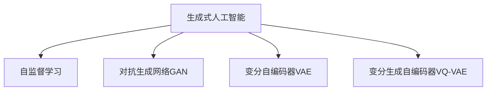

                 

# 生成式人工智能的优势：创造性内容

## 1. 背景介绍

### 1.1 问题由来

随着深度学习技术的不断进步，生成式人工智能（Generative AI）以其强大的创造性内容生成能力，逐渐成为科技界和产业界关注的焦点。无论是文本、图像、音频还是视频，生成式AI都在不断突破其生成能力的极限，推动着内容创意产业的变革。

### 1.2 问题核心关键点

生成式AI的核心优势在于其创造性内容生成能力。这种能力源于深度学习模型的泛化能力和自适应性，使其能够在面对各种不同的输入信息时，自主生成符合期望的新内容。与传统的基于规则的生成方式相比，生成式AI的创新性和多样性是其显著的优势。

### 1.3 问题研究意义

研究生成式AI的优势，对于拓展AI应用范围，提升内容创意产业的效率和质量，推动艺术和科技的融合，具有重要意义。生成式AI不仅能够快速生成大量高质量内容，减少人工创作的工作量，还能在特定领域探索新的创意可能性，为内容创意产业带来新的增长点。

## 2. 核心概念与联系

### 2.1 核心概念概述

为了深入理解生成式AI在创造性内容生成中的优势，本节将介绍几个关键概念：

- **生成式人工智能（Generative AI）**：基于深度学习模型，能够从输入数据中学习规律，自主生成新内容的技术。常见的生成模型包括GAN、VQ-VAE、变分自编码器等。
- **自监督学习（Self-Supervised Learning）**：无需标注数据，通过自定义的预训练任务，使模型学习到数据的潜在结构。
- **对抗生成网络（GAN）**：通过生成器和判别器两个神经网络，进行对抗训练，生成逼真度高的新样本。
- **变分自编码器（VAE）**：通过编码器和解码器两个网络，学习数据的概率分布，生成与训练集相似的样本。
- **变分生成自编码器（VQ-VAE）**：结合了自编码器和变分自编码器的优点，生成连续或离散的样本。

这些核心概念之间的逻辑关系可以通过以下Mermaid流程图来展示：



这个流程图展示了大模型微调的各个核心概念及其之间的关系：

1. 生成式AI通过自监督学习等方法进行预训练，学习数据的潜在结构。
2. 利用GAN、VAE、VQ-VAE等生成模型，生成新的内容样本。
3. 这些生成模型都基于深度学习，可以通过微调等方法进一步提升性能。

## 3. 核心算法原理 & 具体操作步骤
### 3.1 算法原理概述

生成式AI的核心算法原理涉及深度学习模型对数据的理解和生成能力。其基本思想是通过大量未标注数据进行预训练，学习数据的潜在结构，然后在特定任务上进行微调，生成符合期望的新内容。

具体来说，生成式AI的预训练过程通常包括以下步骤：

1. **数据预处理**：对输入数据进行标准化、归一化等预处理操作。
2. **自监督学习**：通过自定义的预训练任务，如缺失数据填补、分类任务等，使模型学习到数据的潜在结构。
3. **生成模型训练**：使用对抗生成网络（GAN）、变分自编码器（VAE）、变分生成自编码器（VQ-VAE）等生成模型进行训练，生成逼真度高的新内容。

在预训练完成后，生成式AI可以在特定任务上进行微调，进一步提升生成内容的性能和多样性。微调过程通常包括以下步骤：

1. **任务适配层设计**：根据生成任务的性质，设计合适的输出层和损失函数。
2. **数据准备**：收集生成任务的数据集，划分为训练集、验证集和测试集。
3. **模型初始化**：使用预训练生成的模型权重作为初始化参数。
4. **模型训练**：通过微调优化算法（如Adam、SGD等），最小化损失函数，更新模型参数，生成符合期望的新内容。

### 3.2 算法步骤详解

下面详细介绍生成式AI的算法步骤：

**Step 1: 数据预处理**

1. 收集生成任务所需的数据集，如文本、图像、音频等。
2. 对数据进行标准化、归一化、降噪等预处理操作。
3. 将数据集划分为训练集、验证集和测试集，通常比例为7:1.5:1.5。

**Step 2: 自监督学习**

1. 定义自监督学习任务，如文本的掩码语言模型、图像的旋转预测等。
2. 使用深度学习模型（如Transformer、CNN等）进行自监督学习。
3. 最小化预训练损失函数，更新模型参数，学习数据的潜在结构。

**Step 3: 生成模型训练**

1. 选择生成模型，如GAN、VAE、VQ-VAE等。
2. 设计生成器的架构和损失函数，如GAN的Wasserstein生成对抗网络、VAE的均方误差等。
3. 训练生成器，最小化生成样本与真实样本的差距。
4. 训练判别器（如GAN中的判别器），区分真实样本和生成样本。
5. 交替训练生成器和判别器，直到生成样本与真实样本难以区分。

**Step 4: 微调与任务适配**

1. 根据生成任务的性质，设计任务适配层。如文本生成任务中的解码器、图像生成任务中的卷积层等。
2. 将预训练生成的模型权重作为初始化参数，进行微调。
3. 最小化任务损失函数，如文本生成任务中的交叉熵损失、图像生成任务中的均方误差等。
4. 更新模型参数，生成符合期望的新内容。

### 3.3 算法优缺点

生成式AI的优势在于其强大的创造性内容生成能力，能够在无需标注数据的情况下生成高质量的新样本。然而，其也存在以下缺点：

- **计算资源消耗大**：生成式AI的训练和生成过程需要大量的计算资源，通常需要使用高性能的GPU或TPU。
- **模型复杂度**：生成式AI的模型通常较为复杂，训练和微调过程需要较高的技术门槛。
- **生成质量不稳定**：生成式AI的生成质量可能受到训练数据、生成模型和超参数等因素的影响，存在不稳定的问题。
- **生成内容多样性有限**：生成式AI生成的内容可能受到训练数据的限制，难以产生完全创新的内容。

尽管存在这些局限性，生成式AI的创造性内容生成能力仍然在多个领域展示了其独特的优势。

### 3.4 算法应用领域

生成式AI的创造性内容生成能力已经在多个领域得到了广泛应用，例如：

- **文本生成**：生成新闻报道、故事、诗歌等文本内容。
- **图像生成**：生成艺术品、广告、游戏角色等图像内容。
- **音频生成**：生成音乐、语音、声音效果等音频内容。
- **视频生成**：生成动画、电影、短片等视频内容。
- **交互式内容**：生成虚拟现实（VR）、增强现实（AR）等交互式内容。

除了这些传统领域外，生成式AI还在医疗、教育、娱乐等更多新兴领域展现出其创新潜力。随着技术的发展，生成式AI的应用范围将进一步扩大，为各行各业带来全新的变化和机遇。

## 4. 数学模型和公式 & 详细讲解 & 举例说明

### 4.1 数学模型构建

生成式AI的数学模型通常基于深度学习框架，其核心思想是通过大量未标注数据进行预训练，学习数据的潜在结构，然后在特定任务上进行微调，生成符合期望的新内容。

以下以生成文本为例，介绍其数学模型构建过程：

1. **输入层**：将文本输入转化为向量形式。如使用BERT模型，将文本转换为嵌入向量 $X \in \mathbb{R}^{n \times d}$，其中 $n$ 为序列长度，$d$ 为嵌入维度。
2. **编码器层**：通过Transformer等自注意力机制，对输入向量进行编码，得到语义表示 $H \in \mathbb{R}^{n \times d'}$，其中 $d'$ 为编码器输出维度。
3. **解码器层**：根据生成任务的需求，设计解码器，将语义表示转化为生成向量 $G \in \mathbb{R}^{m \times d'}$，其中 $m$ 为生成序列长度。
4. **损失函数**：设计生成任务对应的损失函数，如交叉熵损失 $L_{ce}(y,\hat{y})$，其中 $y$ 为真实标签，$\hat{y}$ 为模型生成的标签。
5. **优化器**：使用Adam、SGD等优化器，最小化损失函数，更新模型参数。

### 4.2 公式推导过程

以下以生成文本为例，推导交叉熵损失函数的计算公式。

假设输入文本为 $x$，输出为 $y$，生成模型为 $M_{\theta}$。则交叉熵损失函数的计算公式为：

$$
L_{ce}(y,\hat{y}) = -\frac{1}{N}\sum_{i=1}^N [y_i\log M_{\theta}(x_i)+(1-y_i)\log(1-M_{\theta}(x_i))]
$$

其中，$N$ 为样本数量，$M_{\theta}(x_i)$ 为模型对输入 $x_i$ 生成的概率，$y_i$ 为真实标签。

在实际应用中，我们可以将损失函数定义为模型的损失函数 $\mathcal{L}(\theta)$：

$$
\mathcal{L}(\theta) = L_{ce}(y,\hat{y})
$$

通过梯度下降等优化算法，最小化损失函数，更新模型参数 $\theta$，即可生成符合期望的新文本内容。

### 4.3 案例分析与讲解

以生成艺术图像为例，介绍GAN模型的生成过程：

1. **生成器架构**：GAN的生成器通常由多层全连接神经网络组成，用于将随机噪声向量 $z \in \mathbb{R}^{z}$ 转换为生成样本 $x_g \in \mathbb{R}^d$。
2. **判别器架构**：GAN的判别器通常由多层全连接神经网络组成，用于区分真实样本 $x_r \in \mathbb{R}^d$ 和生成样本 $x_g \in \mathbb{R}^d$。
3. **损失函数**：GAN的损失函数由两个部分组成，分别为生成器的损失函数 $L_g$ 和判别器的损失函数 $L_d$。生成器的损失函数 $L_g$ 为：
$$
L_g = E_{z \sim p(z)} [\log D(G(z))]
$$
判别器的损失函数 $L_d$ 为：
$$
L_d = E_{x_r \sim p(x_r)} [\log D(x_r)] + E_{z \sim p(z)} [\log(1 - D(G(z)))]
$$
其中 $p(z)$ 为噪声向量的分布，$D(x)$ 为判别器的输出。
4. **训练过程**：交替训练生成器和判别器，直到生成样本与真实样本难以区分。

## 5. 项目实践：代码实例和详细解释说明

### 5.1 开发环境搭建

在进行生成式AI项目实践前，我们需要准备好开发环境。以下是使用Python进行PyTorch开发的环境配置流程：

1. 安装Anaconda：从官网下载并安装Anaconda，用于创建独立的Python环境。

2. 创建并激活虚拟环境：
```bash
conda create -n pytorch-env python=3.8 
conda activate pytorch-env
```

3. 安装PyTorch：根据CUDA版本，从官网获取对应的安装命令。例如：
```bash
conda install pytorch torchvision torchaudio cudatoolkit=11.1 -c pytorch -c conda-forge
```

4. 安装TensorFlow：
```bash
pip install tensorflow
```

5. 安装各类工具包：
```bash
pip install numpy pandas scikit-learn matplotlib tqdm jupyter notebook ipython
```

完成上述步骤后，即可在`pytorch-env`环境中开始生成式AI项目实践。

### 5.2 源代码详细实现

下面我们以生成式GAN模型为例，给出使用PyTorch进行图像生成任务的完整代码实现。

```python
import torch
import torch.nn as nn
import torch.optim as optim
from torchvision import datasets, transforms

# 定义生成器架构
class Generator(nn.Module):
    def __init__(self):
        super(Generator, self).__init__()
        self.fc1 = nn.Linear(100, 256)
        self.fc2 = nn.Linear(256, 512)
        self.fc3 = nn.Linear(512, 1024)
        self.fc4 = nn.Linear(1024, 784)
        self.fc5 = nn.Linear(784, 3*3*256)
        self.deconv1 = nn.ConvTranspose2d(256, 128, 4, 1, 0, bias=False)
        self.deconv2 = nn.ConvTranspose2d(128, 64, 4, 2, 1, bias=False)
        self.deconv3 = nn.ConvTranspose2d(64, 3, 4, 2, 1, bias=False)
        self.sigmoid = nn.Sigmoid()

    def forward(self, x):
        x = self.fc1(x)
        x = self.fc2(x)
        x = self.fc3(x)
        x = self.fc4(x)
        x = x.view(x.size(0), 1, 7, 7)
        x = self.deconv1(x)
        x = nn.ReLU()(x)
        x = self.deconv2(x)
        x = nn.ReLU()(x)
        x = self.deconv3(x)
        x = self.sigmoid(x)
        return x

# 定义判别器架构
class Discriminator(nn.Module):
    def __init__(self):
        super(Discriminator, self).__init__()
        self.conv1 = nn.Conv2d(3, 64, 4, 2, 1, bias=False)
        self.conv2 = nn.Conv2d(64, 128, 4, 2, 1, bias=False)
        self.conv3 = nn.Conv2d(128, 256, 4, 2, 1, bias=False)
        self.fc1 = nn.Linear(256 * 7 * 7, 1)
        self.sigmoid = nn.Sigmoid()

    def forward(self, x):
        x = self.conv1(x)
        x = nn.LeakyReLU(0.2, inplace=True)(x)
        x = self.conv2(x)
        x = nn.LeakyReLU(0.2, inplace=True)(x)
        x = self.conv3(x)
        x = nn.LeakyReLU(0.2, inplace=True)(x)
        x = x.view(x.size(0), -1)
        x = self.fc1(x)
        x = self.sigmoid(x)
        return x

# 定义模型和优化器
G = Generator()
D = Discriminator()
G_opt = optim.Adam(G.parameters(), lr=0.0002)
D_opt = optim.Adam(D.parameters(), lr=0.0002)

# 数据加载器
train_loader = torch.utils.data.DataLoader(
    datasets.MNIST('./data', train=True, download=True,
                   transform=transforms.ToTensor()),
    batch_size=64, shuffle=True)

# 训练过程
for epoch in range(100):
    for i, (img, _) in enumerate(train_loader):
        # 将图像转换为向量
        img = img.view(img.size(0), 1, 28, 28)
        # 训练生成器
        G_opt.zero_grad()
        gen_img = G(img)
        d_loss_real = D(torch.randn(64, 1, 7, 7))
        d_loss_fake = D(gen_img)
        D_loss = (d_loss_real + d_loss_fake) / 2
        D_loss.backward()
        G_opt.step()
        # 训练判别器
        D_opt.zero_grad()
        d_loss_real = D(img)
        d_loss_fake = D(gen_img.detach())
        D_loss = (d_loss_real + d_loss_fake) / 2
        D_loss.backward()
        D_opt.step()

        # 每100个epoch输出一次图像
        if (i+1) % 100 == 0:
            print('Epoch: {}/{} - Batch: {} - d_loss: {:.4f} - g_loss: {:.4f}'.format(
                epoch+1, 100, i+1, d_loss.item(), -d_loss_fake.item()))
```

### 5.3 代码解读与分析

让我们再详细解读一下关键代码的实现细节：

**Generator类**：
- `__init__`方法：初始化生成器的各个层，包括全连接层和卷积层。
- `forward`方法：实现生成器的前向传播过程，通过多层卷积和全连接操作，将随机噪声向量转化为生成样本。

**Discriminator类**：
- `__init__`方法：初始化判别器的各个层，包括卷积层和全连接层。
- `forward`方法：实现判别器的前向传播过程，通过多层卷积和全连接操作，判断输入样本是真实样本还是生成样本。

**模型和优化器**：
- 定义生成器和判别器的架构和优化器。

**数据加载器**：
- 使用PyTorch的数据加载器，从MNIST数据集中加载训练数据，进行归一化处理。

**训练过程**：
- 使用Adam优化器对生成器和判别器进行交替训练。
- 计算并输出判别器损失和生成器损失，以便于监控训练过程。

可以看到，PyTorch提供了丰富的深度学习框架，使得生成式AI的代码实现变得简洁高效。开发者可以利用这些工具，快速实现各种生成模型，进行实验和调试。

## 6. 实际应用场景

### 6.1 生成式音乐创作

生成式AI在音乐创作领域的应用已经得到了广泛关注。利用GAN等生成模型，可以在短时间内生成大量不同风格的音乐作品。这些音乐作品不仅具有高度的创新性和多样性，还能够在特定条件下生成符合期望的音乐风格。

在技术实现上，可以收集大量的音乐作品，将其转换为数字音频形式，然后进行自监督学习。利用GAN等生成模型，生成逼真度高的音乐样本，再进行微调，优化音乐生成效果。微调后的生成模型能够根据用户指定的风格和情感，生成符合期望的音乐作品。

### 6.2 虚拟角色设计

在虚拟现实和增强现实领域，生成式AI可以用于设计虚拟角色和环境。通过深度学习模型，可以从真实数据中学习虚拟角色的行为和特征，生成逼真度高的虚拟角色模型。这些模型不仅能够自然地与用户进行交互，还能在特定场景下自动适应环境变化。

在技术实现上，可以收集大量的真实视频和图像数据，使用GAN等生成模型，生成逼真的虚拟角色模型。通过对这些模型进行微调，使其适应特定的任务和场景，从而实现高质量的虚拟角色设计。

### 6.3 个性化推荐系统

生成式AI在个性化推荐系统中也有广泛应用。通过生成式模型，可以根据用户的历史行为和偏好，生成个性化的商品或内容推荐。这些推荐不仅具有高度的个性化，还能够根据用户的实时反馈进行调整和优化。

在技术实现上，可以收集用户的历史行为数据，如浏览记录、购买记录等，使用GAN等生成模型，生成个性化的商品或内容推荐。通过对这些推荐进行微调，优化推荐效果，从而提升用户体验。

### 6.4 未来应用展望

随着生成式AI技术的不断发展，其在更多领域的应用前景将更加广阔。除了音乐创作、虚拟角色设计、个性化推荐系统外，生成式AI还可以应用于以下领域：

- **医学影像生成**：生成逼真的医学影像，帮助医生进行诊断和治疗。
- **城市规划设计**：生成逼真的城市模型，辅助城市规划和设计。
- **科学计算模拟**：生成逼真的科学计算模拟数据，辅助科学研究。
- **工业设计**：生成逼真的产品设计模型，辅助工业设计。

随着生成式AI技术的不断突破，其在更多领域的应用将展现出巨大的潜力和价值，为人类社会带来更多的创新和便利。

## 7. 工具和资源推荐

### 7.1 学习资源推荐

为了帮助开发者系统掌握生成式AI的理论基础和实践技巧，这里推荐一些优质的学习资源：

1. **《深度学习》书籍**：Ian Goodfellow等著，全面介绍了深度学习的基本概念和经典模型。
2. **《Generative Adversarial Networks》论文**：Ian Goodfellow等人的GAN经典论文，介绍了GAN的基本思想和算法。
3. **《Autoencoder》论文**：Bengio等人的VAE经典论文，介绍了VAE的基本思想和算法。
4. **《VAE》论文**：Krizhevsky等人的VQ-VAE经典论文，介绍了VQ-VAE的基本思想和算法。
5. **DeepLearning.ai课程**：Andrew Ng等人开设的深度学习课程，系统讲解了深度学习的基本概念和前沿技术。

通过这些资源的学习实践，相信你一定能够快速掌握生成式AI的精髓，并用于解决实际的NLP问题。

### 7.2 开发工具推荐

高效的开发离不开优秀的工具支持。以下是几款用于生成式AI开发的常用工具：

1. PyTorch：基于Python的开源深度学习框架，灵活的计算图，适合快速迭代研究。
2. TensorFlow：由Google主导开发的开源深度学习框架，生产部署方便，适合大规模工程应用。
3. TensorBoard：TensorFlow配套的可视化工具，可实时监测模型训练状态，并提供丰富的图表呈现方式。
4. Weights & Biases：模型训练的实验跟踪工具，可以记录和可视化模型训练过程中的各项指标。
5. NVIDIA DGX-A100：高性能计算平台，支持多GPU加速，适合生成式AI的训练和推理。

合理利用这些工具，可以显著提升生成式AI项目的开发效率，加快创新迭代的步伐。

### 7.3 相关论文推荐

生成式AI的研究源于学界的持续探索。以下是几篇奠基性的相关论文，推荐阅读：

1. Generative Adversarial Nets（GAN）：Ian Goodfellow等人的经典论文，提出GAN的基本思想和算法。
2. Auto-Encoding Variational Bayes（VAE）：Diederik Kingma等人的经典论文，提出VAE的基本思想和算法。
3. Deep Variational Information Bottleneck（VQ-VAE）：Alan Yuille等人的经典论文，提出VQ-VAE的基本思想和算法。
4. pix2pix：Phillip Isola等人的经典论文，提出GAN在图像生成中的应用。
5. GAN DiscoGAN：Takeru Miyato等人的经典论文，提出GAN在图像生成中的改进方法。

这些论文代表了大模型微调技术的发展脉络。通过学习这些前沿成果，可以帮助研究者把握学科前进方向，激发更多的创新灵感。

## 8. 总结：未来发展趋势与挑战

### 8.1 总结

本文对生成式AI的优势进行了全面系统的介绍。首先阐述了生成式AI在创造性内容生成中的独特优势，明确了其强大的生成能力和多领域应用的前景。其次，从原理到实践，详细讲解了生成式AI的数学模型和算法步骤，给出了微调任务开发的完整代码实例。同时，本文还广泛探讨了生成式AI在音乐创作、虚拟角色设计、个性化推荐系统等实际应用场景中的应用前景，展示了其巨大的潜力和价值。

通过本文的系统梳理，可以看到，生成式AI在多领域展现出强大的创造性内容生成能力，成为推动内容创意产业变革的重要力量。随着技术的发展，生成式AI将在更多领域得到应用，为各行各业带来新的变化和机遇。

### 8.2 未来发展趋势

展望未来，生成式AI的发展趋势主要体现在以下几个方面：

1. **生成模型多样性增加**：未来将出现更多类型的生成模型，如基于自注意力机制的模型、基于变分自编码器的模型等，进一步提升生成内容的创意性和多样性。
2. **生成内容质量提升**：随着生成模型的不断优化和训练数据的不断丰富，生成内容的逼真度和创新性将不断提升，生成内容的质量将得到进一步提升。
3. **跨领域应用拓展**：生成式AI将在更多领域得到应用，如医学、城市规划、科学计算等，为这些领域的创新发展带来新的突破。
4. **生成内容定制化增强**：通过引入用户交互和反馈机制，生成式AI将能够根据用户的个性化需求，生成高度定制化的内容，进一步提升用户体验。
5. **生成内容安全性保障**：随着生成式AI在更多领域的广泛应用，其内容的安全性和伦理性将成为关注的重点，生成式AI将需要引入更多的伦理导向和安全性约束。

这些趋势将进一步推动生成式AI在各个领域的应用，为人类社会带来更多的创新和便利。

### 8.3 面临的挑战

尽管生成式AI在创造性内容生成方面展现出巨大的潜力，但在其发展过程中，仍面临诸多挑战：

1. **计算资源消耗大**：生成式AI的训练和生成过程需要大量的计算资源，通常需要使用高性能的GPU或TPU。如何优化生成模型的计算效率，降低资源消耗，是未来的重要研究方向。
2. **模型复杂度较高**：生成式AI的模型通常较为复杂，训练和微调过程需要较高的技术门槛。如何简化模型结构，提升模型的可解释性和可操作性，是未来的重要研究方向。
3. **生成内容多样性有限**：生成式AI生成的内容可能受到训练数据的限制，难以产生完全创新的内容。如何提升生成内容的创意性和多样性，是未来的重要研究方向。
4. **生成内容安全性问题**：生成式AI生成的内容可能存在误导性、歧视性的输出倾向，如何保障生成内容的伦理性和安全可靠性，是未来的重要研究方向。
5. **生成内容一致性问题**：生成式AI生成的内容可能存在前后不一致的问题，如何提高生成内容的连贯性和一致性，是未来的重要研究方向。

这些挑战需要通过技术创新和理论突破，逐步克服和解决，才能让生成式AI在更多领域得到应用，为人类社会带来更多的创新和便利。

### 8.4 研究展望

未来生成式AI的研究方向主要体现在以下几个方面：

1. **参数高效生成模型**：开发更加参数高效的生成模型，如基于自注意力机制的模型、基于变分自编码器的模型等，在固定大部分生成参数的情况下，只更新极少量的任务相关参数，提升生成模型的计算效率和灵活性。
2. **多模态生成模型**：结合视觉、语音、文本等多模态信息，生成更丰富、更逼真的内容，进一步提升生成内容的创意性和多样性。
3. **生成内容定制化模型**：引入用户交互和反馈机制，生成高度定制化的内容，进一步提升用户体验和满意度。
4. **生成内容安全性模型**：引入伦理导向和安全性约束，生成符合人类价值观和伦理道德的内容，保障生成内容的伦理性和安全可靠性。
5. **生成内容一致性模型**：引入一致性约束，提高生成内容的连贯性和一致性，确保生成内容的一致性和可靠性。

这些研究方向将推动生成式AI在更多领域的应用，为人类社会带来更多的创新和便利。

## 9. 附录：常见问题与解答

**Q1：生成式AI是否适用于所有内容生成任务？**

A: 生成式AI在大多数内容生成任务上都能取得不错的效果，特别是对于数据量较小的任务。但对于一些特定领域的任务，如医学、法律等，仅仅依靠通用语料预训练的模型可能难以很好地适应。此时需要在特定领域语料上进一步预训练，再进行微调，才能获得理想效果。

**Q2：如何优化生成式AI的计算效率？**

A: 优化生成式AI的计算效率可以从以下几个方面入手：
1. 使用小尺寸模型，减少参数量，提高训练和生成速度。
2. 引入模型压缩和量化技术，降低存储和计算开销。
3. 采用分布式训练和推理，利用多GPU或多节点加速训练和推理。
4. 优化超参数，选择合适的学习率、批大小等，提升训练和生成的效率。

**Q3：生成式AI生成的内容质量如何提升？**

A: 生成式AI生成的内容质量可以从以下几个方面提升：
1. 使用更多的训练数据，增加模型的泛化能力，提升生成内容的逼真度和多样性。
2. 引入多样化的生成模型，如GAN、VAE、VQ-VAE等，提升生成内容的质量和多样性。
3. 优化生成模型的超参数，选择合适的损失函数、学习率等，提升生成内容的精度和质量。

**Q4：生成式AI在实际应用中需要注意哪些问题？**

A: 生成式AI在实际应用中需要注意以下几个问题：
1. 生成内容的多样性和创新性，避免生成内容的同质化问题。
2. 生成内容的连贯性和一致性，避免生成内容的前后不一致问题。
3. 生成内容的伦理性和安全可靠性，避免生成内容的误导性、歧视性问题。
4. 生成内容的计算效率和计算资源消耗，避免生成内容的高计算资源消耗问题。

**Q5：生成式AI在商业化应用中需要注意哪些问题？**

A: 生成式AI在商业化应用中需要注意以下几个问题：
1. 生成内容的质量和精度，避免生成内容的高误差率。
2. 生成内容的版权和合规性问题，避免生成内容侵犯他人版权。
3. 生成内容的伦理性和安全可靠性，避免生成内容的高伦理性风险。
4. 生成内容的商业价值和经济效益，避免生成内容的高商业价值和经济效益问题。

通过系统了解生成式AI的优势和面临的挑战，相信你能够更好地掌握生成式AI的理论基础和实践技巧，为实际应用提供更加优质的解决方案。

