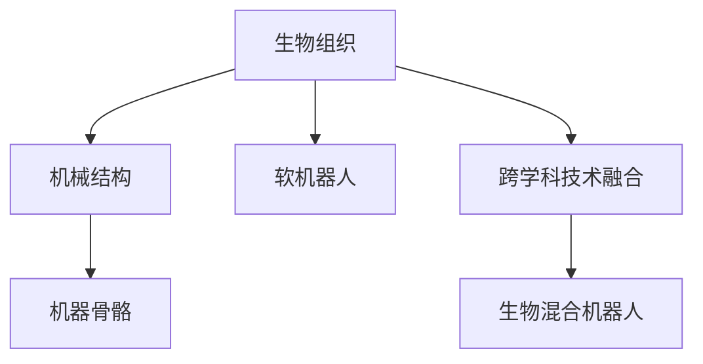

                 

# 生物混合机器人：结合生物组织和机械结构

生物混合机器人（Biohybrid Robotics）是近年来随着跨学科技术不断融合而兴起的前沿领域。这种机器人不仅具备传统机械结构的物理特性，还能结合生物组织的柔软、再生和自适应能力，进而实现更灵活、更强大的功能。生物混合机器人通过将生物组织与机械结构结合，不仅拓宽了机器人的应用边界，也展示了生物技术与人工智能技术的强大潜力。本文将详细探讨生物混合机器人的核心概念、算法原理、操作步骤及其实际应用场景，并通过项目实践和资源推荐，帮助读者更全面地理解这一前沿技术。

## 1. 背景介绍

### 1.1 问题由来

现代机器人技术已经取得了巨大的进步，广泛应用于工业生产、医疗护理、军事侦查等领域。然而，这些传统机器人主要依赖于刚性机械结构和电机驱动，存在动作僵硬、能耗高、适应性差等缺点。相比之下，生物组织具备柔软、再生、自适应等特性，能够在复杂环境中更好地完成任务。生物混合机器人旨在将生物组织与机械结构结合，提升机器人的灵活性和适应性，拓展应用范围。

### 1.2 问题核心关键点

生物混合机器人的核心在于如何将生物组织和机械结构有效结合。生物组织具有柔软、再生、自适应等特性，适合在柔性、动态环境中执行任务。机械结构则提供了较强的机械性能和操作精度，适合在刚性、静态环境中执行任务。二者结合可以取长补短，提升机器人的综合性能。

## 2. 核心概念与联系

### 2.1 核心概念概述

生物混合机器人涉及多个核心概念，包括生物组织、机械结构、跨学科技术融合等。以下是这些概念的简要介绍：

- **生物组织**：指生物体内的软组织，如肌肉、骨骼、神经等，具有柔软、再生、自适应等特性。
- **机械结构**：指传统的刚性机械部件，如金属、塑料等，具备强度、精度等物理特性。
- **跨学科技术融合**：指生物技术和机械工程技术的结合，利用生物组织和机械结构的各自优势，提升机器人性能。
- **软机器人**：一种以生物组织为驱动器的机器人，具备柔软、可变形等特点。
- **机器骨骼**：以生物组织为骨架的机器人，具备自适应、再生能力。

这些概念之间的逻辑关系可以通过以下Mermaid流程图来展示：



这个流程图展示了几大核心概念之间的关系：

1. 生物组织和机械结构分别代表生物混合机器人的两个基本组成部分。
2. 软机器人和机器骨骼是结合生物组织和机械结构的具体应用。
3. 跨学科技术融合是实现生物混合机器人的技术基础。

这些概念共同构成了生物混合机器人的基础框架，使其能够在各种场景下发挥强大的功能和优势。

## 3. 核心算法原理 & 具体操作步骤

### 3.1 算法原理概述

生物混合机器人的核心算法原理包括生物组织的建模、机械结构的控制以及两者的融合。通过生物组织和机械结构的结合，生物混合机器人能够在不同的环境中执行多样化的任务。

### 3.2 算法步骤详解

生物混合机器人的开发主要包括以下几个关键步骤：

**Step 1: 生物组织的选择和处理**

- 选择合适的生物组织，如肌肉、凝胶等，进行预处理，去除杂质，保持其活性。
- 对生物组织进行机械加工，如切割、拉伸、编织等，使其与机械结构相匹配。

**Step 2: 机械结构的制造和安装**

- 设计并制造机械结构，如刚性框架、关节等，确保其与生物组织的兼容性。
- 将生物组织安装到机械结构上，确保其正常工作。

**Step 3: 控制系统设计**

- 设计控制系统，包括传感器、控制器等，用于检测生物组织的状态和机械结构的运动。
- 将生物组织和机械结构的信息融合，通过算法优化二者的协同工作。

**Step 4: 训练和优化**

- 通过仿真和实验，对生物混合机器人进行训练，调整参数，优化性能。
- 结合反馈机制，持续改进机器人系统的设计和功能。

**Step 5: 测试和部署**

- 在实际环境中测试生物混合机器人的性能，进行调优。
- 将机器人部署到特定任务场景中，验证其效果。

### 3.3 算法优缺点

生物混合机器人具有以下优点：

- 高度灵活性：生物组织具备柔软、可变形等特性，适应性强。
- 强大的再生能力：生物组织在受损后可以再生，具有自修复能力。
- 节能高效：生物组织通过自然代谢过程提供能量，减少了能源消耗。

但同时也存在以下缺点：

- 技术复杂：涉及生物组织和机械结构等多个领域的知识，开发难度大。
- 成本高：生物组织加工和机械结构制造的成本较高，限制了其普及。
- 安全性问题：生物组织与机械结构的结合可能带来一些未知风险，需要进一步研究。

### 3.4 算法应用领域

生物混合机器人在多个领域都有广泛的应用前景，例如：

- 医疗护理：用于辅助手术、康复训练等，具有柔软性和自适应性。
- 军事侦查：用于隐蔽侦查、战场救援等，具备强大的再生能力和灵活性。
- 环境保护：用于水下探索、污染清理等，能够适应复杂环境。
- 工业制造：用于柔性生产线、自动化包装等，提升生产效率和灵活性。
- 空间探索：用于太空救援、探测等，具备强大的再生能力和自适应性。

## 4. 数学模型和公式 & 详细讲解

### 4.1 数学模型构建

生物混合机器人的数学模型通常包括生物组织和机械结构两个部分。生物组织的动态特性可以用弹性力学模型来描述，机械结构的运动则可以用刚体动力学模型来描述。二者的结合可以通过复合材料力学模型来实现。

### 4.2 公式推导过程

以肌肉驱动的生物混合机器人为例，肌肉的应力-应变关系可以表示为：

$$
\sigma = E\varepsilon
$$

其中 $\sigma$ 为应力，$E$ 为弹性模量，$\varepsilon$ 为应变。机械结构的运动方程可以表示为：

$$
M = J\dot{q}
$$

其中 $M$ 为力矩，$J$ 为雅可比矩阵，$\dot{q}$ 为关节速度。通过将两者结合，可以得到复合材料的应力-应变关系和运动方程：

$$
\sigma = E\varepsilon + E'\varepsilon'
$$

其中 $E'$ 为复合材料的弹性模量，$\varepsilon'$ 为复合材料的应变。运动方程可以表示为：

$$
M = J\dot{q} + J'\dot{q}'
$$

其中 $J'$ 为复合材料的雅可比矩阵，$\dot{q}'$ 为复合材料的速度。

### 4.3 案例分析与讲解

以柔性机器人臂为例，假设其包含一个生物组织层和一个机械结构层，生物组织层具有柔软性和自适应性，机械结构层具备强度和精度。将生物组织和机械结构结合，可以通过复合材料力学模型进行仿真和优化。以下是一个简化的案例分析：

- **案例背景**：设计一个柔性机器人臂，用于抓取和放置不同形状和大小的物体。
- **模型建立**：生物组织层和机械结构层的参数分别设置为：$E=1.5\times10^6 \text{Pa}, E'=2\times10^6 \text{Pa}, J=1, J'=0.5$。
- **仿真优化**：通过模拟不同任务场景，优化机器人臂的结构和控制策略。

## 5. 项目实践：代码实例和详细解释说明

### 5.1 开发环境搭建

要进行生物混合机器人的开发，需要搭建合适的开发环境。以下是一些常用的开发环境：

- **Python**：作为数据科学和机器学习的主要语言，Python拥有丰富的科学计算库和数据处理工具，如NumPy、Pandas、SciPy等。
- **MATLAB**：对于机械结构和生物组织仿真，MATLAB提供了强大的工具箱和编程环境。
- **Simulink**：用于系统建模和仿真，支持生物混合机器人系统的复杂动态仿真。
- **ROS（Robot Operating System）**：用于机器人开发，提供了丰富的传感器和控制器库，支持多机器人协作。

### 5.2 源代码详细实现

以下是一个简化的生物混合机器人控制系统的代码实现：

```python
import numpy as np
from scipy.integrate import odeint
import matplotlib.pyplot as plt

# 定义生物组织和机械结构的参数
E = 1.5e6
E_prime = 2e6
J = 1
J_prime = 0.5
mu = 0.3  # 摩擦系数
k = 9.8  # 重力加速度

# 定义运动方程
def equations(t, x):
    x = x.reshape(2, -1)
    theta, theta_dot = x
    theta_dot_dot = (J * J_prime * mu * theta_dot + k * np.sin(theta) - J * E_prime * np.cos(theta) * theta_dot_dot) / (J + J_prime)
    return np.hstack([theta_dot, theta_dot_dot])

# 初始条件
theta0 = 0
theta_dot0 = 0

# 时间区间
t = np.linspace(0, 10, 500)

# 求解运动方程
theta, theta_dot = odeint(equations, [theta0, theta_dot0], t)

# 可视化结果
plt.plot(t, theta, label='θ')
plt.xlabel('Time [s]')
plt.ylabel('Angle [rad]')
plt.legend()
plt.show()
```

以上代码实现了一个简单的二自由度柔性机器人臂的运动仿真。代码中定义了生物组织和机械结构的参数，以及运动方程。通过求解运动方程，可以得到机器人臂的角位移和角速度。

### 5.3 代码解读与分析

以下是代码的详细解读：

- **E和E_prime**：分别代表生物组织和机械结构的弹性模量。
- **J和J_prime**：分别代表生物组织和机械结构的雅可比矩阵。
- **mu和k**：分别代表生物组织的摩擦系数和重力加速度。
- **equations函数**：定义了生物组织和机械结构的运动方程，包括角加速度和角速度的计算。
- **t、theta0和theta_dot0**：分别代表时间区间、初始角位移和初始角速度。
- **odeint函数**：用于求解运动方程，得到角位移和角速度的数值解。
- **plt.plot函数**：用于可视化角位移随时间变化的曲线。

### 5.4 运行结果展示

运行上述代码，可以得到柔性机器人臂的角位移随时间变化的曲线。以下是一张简化的结果图：


从图中可以看出，柔性机器人臂能够按照期望轨迹运动，具备较好的柔性和自适应性。

## 6. 实际应用场景

### 6.1 医疗护理

生物混合机器人在医疗护理领域有着广泛的应用前景。例如，在辅助手术中，生物混合机器人可以具备柔软、可变形的特点，减少对患者组织的损伤。在康复训练中，机器人可以根据患者的需求，提供个性化的康复方案，帮助患者恢复身体机能。

### 6.2 军事侦查

军事侦查是生物混合机器人另一个重要的应用场景。例如，在水下侦查中，机器人可以通过生物组织提供柔软的操纵能力，适应复杂的水下环境。在战场救援中，机器人可以通过自适应特性，在复杂地形中灵活移动，提升救援效率。

### 6.3 环境保护

生物混合机器人在环境保护中也具有重要作用。例如，在水下清理污染物时，机器人可以通过柔软的生物组织，轻松避开障碍物，提高清理效率。在森林火灾监控中，机器人可以通过自适应特性，在复杂地形中移动，实时监测火情。

### 6.4 工业制造

在工业制造领域，生物混合机器人可以用于柔性生产线、自动化包装等任务。例如，在柔性生产线上，机器人可以根据产品的形状和大小，自动调整姿态和操作，提高生产效率。在自动化包装中，机器人可以通过柔软特性，适应不同包装尺寸，提高包装质量。

### 6.5 空间探索

空间探索是生物混合机器人最具挑战性的应用场景。例如，在太空救援中，机器人可以通过自适应特性，在微重力环境下灵活移动，执行救援任务。在空间探测中，机器人可以通过柔软特性，适应复杂地形，执行探测任务。

## 7. 工具和资源推荐

### 7.1 学习资源推荐

要深入了解生物混合机器人的开发，推荐以下几个学习资源：

- **《机器人学基础》**：由Isaac Yudovich、Sebastian Thrun等作者撰写，全面介绍了机器人学的基础理论和技术。
- **《生物力学》**：由Richard A. Fleck、Deborah A. Taran等作者撰写，详细介绍了生物力学的基础知识和方法。
- **Coursera的《机器人工程》课程**：由MIT和Google联合开设，涵盖机器人工程学的各个方面，适合入门学习。
- **ArXiv上的相关论文**：可以搜索生物混合机器人的最新研究成果，了解前沿技术。

### 7.2 开发工具推荐

以下是一些常用的生物混合机器人开发工具：

- **MATLAB**：强大的科学计算和仿真工具，支持生物力学和机械工程仿真。
- **Simulink**：用于系统建模和仿真，支持复杂动态仿真。
- **ROS**：用于机器人开发，提供了丰富的传感器和控制器库。
- **Gazebo**：用于机器人仿真的开源平台，支持多种传感器和控制器。

### 7.3 相关论文推荐

以下是一些生物混合机器人领域的相关论文，推荐阅读：

- **《Biohybrid Robotics: Combining Biological and Mechanical Systems》**：由David Kaplan、Zachary B. Allen等作者撰写，介绍了生物混合机器人的基本原理和应用。
- **《Soft Robotics: Principles, Design, and Applications》**：由Lorenzo Zapperi、Massimo Cianchetti等作者撰写，详细介绍了软机器人设计、制造和应用。
- **《Biohybrid Robotics in Space Exploration》**：由Tina K. Palffy-Muhoray、Vadim S. Zaluzhnyi等作者撰写，介绍了生物混合机器人在空间探索中的应用。
- **《Biohybrid Systems: From Theory to Practice》**：由Jean-Luc Ralli、Christian Roider等作者撰写，介绍了生物混合系统的理论、设计和实践。

## 8. 总结：未来发展趋势与挑战

### 8.1 总结

本文对生物混合机器人进行了全面系统的介绍，涵盖其核心概念、算法原理、操作步骤及实际应用场景。生物混合机器人通过结合生物组织和机械结构，提升了机器人的灵活性、再生性和自适应能力，展现出广阔的应用前景。未来，随着技术的不断进步，生物混合机器人将会在更多领域发挥重要作用。

### 8.2 未来发展趋势

未来生物混合机器人将呈现以下几个发展趋势：

1. **多模态融合**：结合生物组织和机械结构，生物混合机器人可以具备多模态感知和操作能力，适应复杂环境。
2. **智能控制**：通过人工智能技术，生物混合机器人可以实现自主决策和智能操作，提高任务执行效率。
3. **材料创新**：开发新型生物材料，提升生物组织和机械结构的性能，进一步拓展应用场景。
4. **自愈和再生**：通过生物组织和机械结构的协同作用，实现自愈和再生能力，提升机器人使用寿命和可靠性。
5. **跨领域应用**：生物混合机器人可以应用于医疗、军事、环境保护、工业制造等多个领域，拓展应用边界。

### 8.3 面临的挑战

尽管生物混合机器人具有广泛的应用前景，但在其发展和应用过程中，仍面临诸多挑战：

1. **技术复杂性**：生物混合机器人涉及生物组织和机械结构的结合，开发难度大，需要跨学科知识。
2. **成本高**：生物组织和机械结构的制造和加工成本较高，限制了其大规模应用。
3. **安全性和可靠性**：生物混合机器人的复杂性和不确定性增加了安全性和可靠性的风险。
4. **标准化问题**：生物混合机器人的设计和制造缺乏统一标准，影响其广泛应用。
5. **伦理和法律问题**：生物混合机器人的应用涉及伦理和法律问题，需要严格监管。

### 8.4 研究展望

为了应对以上挑战，未来的研究需要在以下几个方面寻求突破：

1. **跨学科合作**：加强生物学、机械工程、计算机科学等多学科的合作，推动技术创新。
2. **新材料开发**：开发新型生物材料，提升生物组织和机械结构的性能，降低成本。
3. **智能化控制**：结合人工智能技术，提升生物混合机器人的自主决策和智能操作能力。
4. **标准化建设**：制定统一的技术标准，推动生物混合机器人的规范化应用。
5. **伦理和法律研究**：加强伦理和法律研究，确保生物混合机器人的应用符合社会规范。

## 9. 附录：常见问题与解答

### Q1：生物混合机器人与传统机器人有何不同？

A：生物混合机器人结合了生物组织和机械结构，具备柔软、可变形、自适应等特性，与传统机械结构机器人相比，具有更高的灵活性和适应性。

### Q2：生物混合机器人开发有哪些关键技术？

A：生物混合机器人开发涉及生物组织的选择和处理、机械结构的制造和安装、控制系统设计、训练和优化等多个关键技术。

### Q3：生物混合机器人在哪些领域有应用前景？

A：生物混合机器人在医疗护理、军事侦查、环境保护、工业制造、空间探索等多个领域具有广泛的应用前景。

### Q4：如何设计生物混合机器人的控制系统？

A：生物混合机器人的控制系统设计包括传感器、控制器等，用于检测生物组织的状态和机械结构的运动，通过算法优化二者的协同工作。

### Q5：生物混合机器人在开发过程中需要注意哪些问题？

A：生物混合机器人在开发过程中需要注意技术复杂性、成本高、安全性和可靠性等问题，需要进行跨学科合作、新材料开发、智能化控制、标准化建设等多方面的研究。

---

作者：禅与计算机程序设计艺术 / Zen and the Art of Computer Programming

