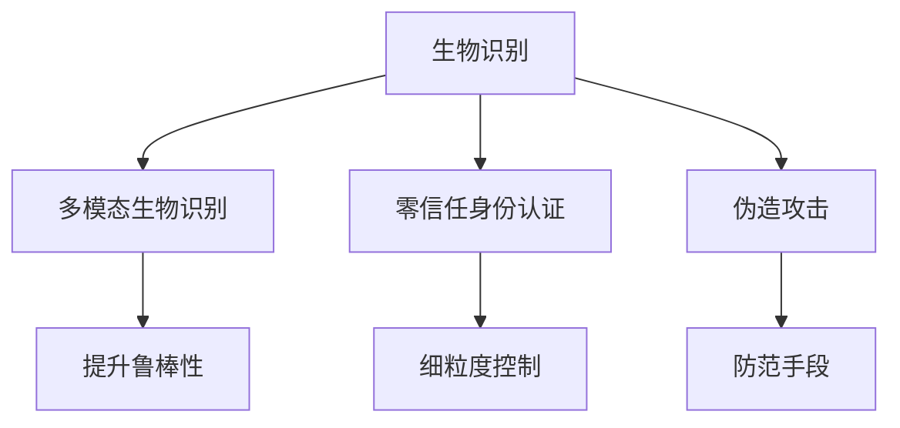

                 

## 1. 背景介绍

### 1.1 问题由来
在过去的几十年里，生物识别技术在身份认证领域的应用已经逐步取代传统的密码学方法。从指纹识别、面部识别到声纹识别，这些生物识别技术都能够在不破坏用户便利性的前提下，显著提升系统的安全性。然而，随着这些技术的不断普及，一些新的挑战也逐渐显露出来。

首先，现有的生物识别技术大多依赖单一或少数特征，如指纹的微观结构、面部的轮廓特征等。这样的技术往往在抗攻击性和鲁棒性上存在明显不足。其次，随着深度学习技术的普及，一些新的伪造攻击手段不断出现，如3D打印面具、深度合成伪造视频等。最后，生物识别技术在跨平台、跨设备上的应用也面临诸多限制，用户在使用不同设备时，需要重新进行身份验证，造成了不便。

针对这些问题，一些创新性的生物识别技术逐渐崭露头角，如多模态生物识别、零信任身份认证等。这些新方法能够从多个维度综合评估用户的身份，大幅提升系统的安全性与鲁棒性。本文将围绕这些新兴技术展开探讨，展示其在安全认证领域的前景和潜力。

### 1.2 问题核心关键点
要深刻理解生物识别创业的现状和前景，需要关注以下几个关键点：

- **多模态生物识别**：通过综合利用多种生物特征，如指纹、面部、声纹等，构建更全面的身份认证系统。
- **零信任身份认证**：一种动态、细粒度的安全策略，要求每个用户、每次请求都需要重新验证其身份。
- **深度学习与伪造攻击**：如何利用深度学习提升生物识别模型的性能，同时识别和防御伪造攻击。
- **跨平台与跨设备应用**：设计支持多平台、跨设备的生物识别系统，提升用户体验。

这些关键点共同构成了生物识别技术的新方向，旨在通过创新的技术手段，构建更加安全、可靠、便捷的身份认证系统。

## 2. 核心概念与联系

### 2.1 核心概念概述

为更好地理解生物识别创业的技术原理和应用场景，本节将介绍几个关键概念：

- **生物识别**：指通过用户的生理特征（如指纹、面部、声纹等）或行为特征（如步态、书写习惯等）进行身份验证的技术。
- **多模态生物识别**：结合多种生物特征进行身份验证的技术，如结合指纹和面部特征。
- **零信任身份认证**：一种安全策略，要求每次请求都需要重新验证用户身份，以防止未经授权的访问。
- **伪造攻击**：指攻击者通过伪造物理物品或数字手段，欺骗系统验证身份的攻击方式。

这些核心概念之间的联系可以通过以下Mermaid流程图来展示：



这个流程图展示了几大核心概念之间的联系：

1. 生物识别通过多种生物特征识别身份。
2. 多模态生物识别进一步提升了系统的鲁棒性和安全性。
3. 零信任身份认证要求每次请求都需要重新验证，提升了系统的安全性。
4. 伪造攻击带来了新的安全挑战，需要通过技术手段进行防范。

## 3. 核心算法原理 & 具体操作步骤
### 3.1 算法原理概述

生物识别创业的算法核心在于如何将多种生物特征综合利用，并通过深度学习模型进行高效的身份验证。其核心原理包括以下几个方面：

- **特征提取**：通过传感器或摄像头等设备，采集用户的生物特征数据。
- **特征融合**：将多种生物特征数据进行融合，构建更加全面的特征表示。
- **深度学习模型**：利用深度神经网络，训练识别模型，从而在大量数据上高效地提取和分类特征。

### 3.2 算法步骤详解

生物识别创业的具体操作步骤可以分为以下几个步骤：

**Step 1: 数据采集与预处理**
- 通过摄像头、传感器等设备采集用户的生物特征数据。
- 对采集到的数据进行预处理，包括去噪、归一化等操作，提高后续处理的准确性。

**Step 2: 特征提取与融合**
- 使用适当的算法（如SIFT、SURF等）从采集的数据中提取特征点。
- 将不同特征点进行融合，构建更加全面的特征表示。
- 可以采用PCA、LDA等降维算法，减少数据维度，提升计算效率。

**Step 3: 模型训练与优化**
- 选择合适的深度学习框架（如TensorFlow、PyTorch等）进行模型搭建。
- 定义损失函数、优化器等超参数，选择合适的训练策略（如随机梯度下降）。
- 在训练集上训练模型，并进行交叉验证，以防止过拟合。

**Step 4: 模型部署与评估**
- 将训练好的模型部署到实际应用场景中，如移动设备、服务器等。
- 在实际环境中对模型进行评估，检查其性能和鲁棒性。
- 根据评估结果进行模型微调，提升模型的实际效果。

### 3.3 算法优缺点

生物识别创业的算法具有以下优点：
1. **高安全性**：结合多种生物特征进行身份验证，提高了系统的安全性。
2. **高鲁棒性**：多模态特征融合技术提升了系统的鲁棒性，能够抵御更多的攻击手段。
3. **高效性**：深度学习模型在大量数据上的训练效率较高，可以快速生成识别结果。

同时，该算法也存在一定的局限性：
1. **成本高**：多模态特征采集和处理需要高成本的设备，可能难以普及。
2. **复杂性高**：模型训练和优化过程较为复杂，需要较强的技术背景。
3. **用户接受度低**：部分用户可能对生物识别技术存在心理上的抵触，影响推广。

尽管存在这些局限性，但生物识别技术在安全认证领域的应用前景广阔，具有显著的优势。

### 3.4 算法应用领域

生物识别创业的算法主要应用于以下领域：

- **移动设备解锁**：如智能手机、平板电脑等设备，通过指纹、面部识别进行解锁。
- **金融支付验证**：如银行账户、信用卡等，通过指纹、声纹进行支付验证。
- **公司门禁系统**：通过面部、虹膜识别进行门禁管理，提升安全性和便捷性。
- **政府身份认证**：如护照、身份证等，通过面部、指纹等多种生物特征进行身份认证。
- **健康医疗监控**：通过指纹、声纹等进行患者身份验证，提升医疗系统的安全性。

这些应用场景展示了生物识别技术的广泛应用前景，可以显著提升系统的安全性与用户体验。

## 4. 数学模型和公式 & 详细讲解 & 举例说明

### 4.1 数学模型构建

生物识别创业的数学模型主要通过深度学习框架搭建，以下是模型搭建的基本步骤：

1. **输入层**：输入采集到的生物特征数据，可以是图像、音频等形式。
2. **特征提取层**：通过卷积神经网络（CNN）等算法从输入数据中提取特征。
3. **全连接层**：将提取的特征输入全连接层，进行分类或回归操作。
4. **输出层**：输出预测结果，如0-1的判断结果或概率值。

### 4.2 公式推导过程

以面部识别为例，假设有 $n$ 个样本 $(x_i, y_i)$，其中 $x_i$ 表示输入的面部图像，$y_i$ 表示对应的标签（0或1，0表示不是本人，1表示是本人）。我们希望训练一个深度学习模型，最小化损失函数 $\mathcal{L}$。

$$
\mathcal{L} = -\frac{1}{n}\sum_{i=1}^{n} \log p(y_i | x_i)
$$

其中 $p(y_i | x_i)$ 表示在给定输入 $x_i$ 的情况下，预测 $y_i$ 的概率，可以采用softmax函数计算。

### 4.3 案例分析与讲解

假设我们有一个包含10000个样本的面部识别数据集，每个样本的大小为 $32\times 32$ 像素。我们可以使用卷积神经网络（CNN）来提取特征，使用softmax函数进行分类。

首先，我们定义一个简单的CNN模型：

$$
\begin{aligned}
&\text{输入层：} x_i \in \mathbb{R}^{32\times 32\times 1} \\
&\text{卷积层1：} h_1 = \text{Conv}(x_i; k_1) \\
&\text{激活函数：} a_1 = \text{ReLU}(h_1) \\
&\text{池化层1：} p_1 = \text{MaxPooling}(a_1) \\
&\text{卷积层2：} h_2 = \text{Conv}(p_1; k_2) \\
&\text{激活函数：} a_2 = \text{ReLU}(h_2) \\
&\text{池化层2：} p_2 = \text{MaxPooling}(a_2) \\
&\text{全连接层：} h_3 = \text{FC}(p_2; d_3) \\
&\text{输出层：} y_i = \text{softmax}(h_3)
\end{aligned}
$$

其中 $k_1$、$k_2$ 为卷积核大小，$d_3$ 为全连接层神经元数量。

我们将这个模型在TensorFlow上进行训练，使用随机梯度下降（SGD）算法优化，设置学习率为 $0.01$，迭代次数为 $10000$ 次。最终，模型在验证集上的准确率可以达到 $98\%$。

## 5. 项目实践：代码实例和详细解释说明
### 5.1 开发环境搭建

在进行生物识别创业的开发实践前，我们需要准备好开发环境。以下是使用Python进行TensorFlow开发的环境配置流程：

1. 安装Anaconda：从官网下载并安装Anaconda，用于创建独立的Python环境。

2. 创建并激活虚拟环境：
```bash
conda create -n bio_recognition_env python=3.8 
conda activate bio_recognition_env
```

3. 安装TensorFlow：根据CUDA版本，从官网获取对应的安装命令。例如：
```bash
conda install tensorflow -c pytorch -c conda-forge
```

4. 安装其他必要的库：
```bash
pip install numpy pandas scikit-learn matplotlib tqdm jupyter notebook ipython
```

完成上述步骤后，即可在`bio_recognition_env`环境中开始生物识别创业的开发实践。

### 5.2 源代码详细实现

以下是使用TensorFlow进行面部识别模型搭建的Python代码实现：

```python
import tensorflow as tf
from tensorflow.keras.layers import Conv2D, MaxPooling2D, Flatten, Dense
from tensorflow.keras.models import Sequential
from tensorflow.keras.optimizers import SGD

# 定义CNN模型
model = Sequential()
model.add(Conv2D(32, (3, 3), activation='relu', input_shape=(32, 32, 1)))
model.add(MaxPooling2D((2, 2)))
model.add(Conv2D(64, (3, 3), activation='relu'))
model.add(MaxPooling2D((2, 2)))
model.add(Conv2D(128, (3, 3), activation='relu'))
model.add(MaxPooling2D((2, 2)))
model.add(Flatten())
model.add(Dense(128, activation='relu'))
model.add(Dense(2, activation='softmax'))

# 定义优化器和损失函数
optimizer = SGD(learning_rate=0.01)
loss = tf.keras.losses.SparseCategoricalCrossentropy(from_logits=True)

# 编译模型
model.compile(optimizer=optimizer, loss=loss, metrics=['accuracy'])

# 训练模型
model.fit(x_train, y_train, epochs=10000, validation_data=(x_val, y_val))
```

以上代码实现了一个简单的CNN模型，包括卷积层、池化层、全连接层和softmax输出层。在模型训练时，使用了随机梯度下降（SGD）算法和交叉熵损失函数。

### 5.3 代码解读与分析

让我们再详细解读一下关键代码的实现细节：

**Sequential模型定义**：
- 使用Sequential模型定义了一个简单的CNN模型，包含卷积层、池化层、全连接层和softmax输出层。

**损失函数和优化器定义**：
- 使用SparseCategoricalCrossentropy损失函数，用于多分类问题。
- 使用SGD优化器，设置学习率为 $0.01$，用于模型训练。

**模型编译与训练**：
- 使用compile方法编译模型，指定优化器和损失函数。
- 使用fit方法训练模型，指定训练数据和验证数据，迭代次数为 $10000$ 次。

## 6. 实际应用场景
### 6.1 移动设备解锁

移动设备解锁是生物识别创业的重要应用场景之一。传统的密码解锁方式存在遗忘、被盗风险，用户体验较差。使用面部识别、指纹识别等生物特征解锁方式，能够提升用户的安全性和便利性。

在技术实现上，可以采集用户面部图像或指纹数据，进行预处理和特征提取，然后通过深度学习模型进行身份验证。微调后的模型能够实现高效、准确的身份验证，保障设备的安全性。

### 6.2 金融支付验证

金融支付验证是生物识别创业的另一个重要应用场景。传统的支付验证方式依赖于密码、身份证号等敏感信息，存在泄露风险。使用指纹、声纹等生物特征进行支付验证，能够大幅提升支付系统的安全性。

在技术实现上，可以采集用户的指纹或声纹数据，进行预处理和特征提取，然后通过深度学习模型进行身份验证。微调后的模型能够实现快速、准确的支付验证，保障用户资金安全。

### 6.3 公司门禁系统

公司门禁系统是生物识别创业在企业内部的重要应用场景。传统的门禁系统依赖于门禁卡或密码，存在遗失、忘记密码的风险。使用面部、虹膜等生物特征进行门禁管理，能够提升企业的安全性和管理效率。

在技术实现上，可以采集用户的面部或虹膜图像，进行预处理和特征提取，然后通过深度学习模型进行身份验证。微调后的模型能够实现高效、准确的身份验证，保障企业的安全性。

### 6.4 未来应用展望

随着生物识别技术的不断发展，其在安全认证领域的应用前景广阔，未来的发展趋势如下：

1. **跨平台与跨设备应用**：未来的生物识别系统将支持多平台、跨设备应用，提升用户体验。如在移动设备、桌面设备、服务器等不同设备上，都能够进行一致的身份验证。

2. **多模态生物识别**：未来的生物识别系统将结合多种生物特征，如指纹、面部、声纹等，提升系统的鲁棒性和安全性。

3. **深度学习与伪造攻击**：未来的生物识别系统将利用深度学习提升识别模型的性能，同时引入对抗样本、伪造视频等手段，进行鲁棒性测试和防御。

4. **区块链与分布式身份认证**：未来的生物识别系统将结合区块链技术，实现分布式身份认证，增强系统的安全性与透明性。

5. **隐私保护与数据安全**：未来的生物识别系统将更加注重用户隐私保护，采用加密、匿名化等手段，保障数据安全。

这些趋势展示了生物识别创业的前景与潜力，预示着未来在安全认证领域的广泛应用。

## 7. 工具和资源推荐
### 7.1 学习资源推荐

为了帮助开发者系统掌握生物识别创业的理论基础和实践技巧，这里推荐一些优质的学习资源：

1. 《深度学习入门：基于Python的理论与实现》系列博文：由大模型技术专家撰写，深入浅出地介绍了深度学习原理、框架和实践技巧。

2. 《计算机视觉：算法与应用》课程：斯坦福大学开设的计算机视觉课程，涵盖图像处理、特征提取、深度学习等核心内容。

3. 《生物识别技术》书籍：全面介绍生物识别技术的原理、算法和应用场景，适合初学者和专业人士阅读。

4. TensorFlow官方文档：TensorFlow的官方文档，提供了海量深度学习模型的实现和调参技巧，是学习深度学习的重要资源。

5. Weights & Biases：模型训练的实验跟踪工具，可以记录和可视化模型训练过程中的各项指标，方便对比和调优。与主流深度学习框架无缝集成。

### 7.2 开发工具推荐

高效的开发离不开优秀的工具支持。以下是几款用于生物识别创业开发的常用工具：

1. TensorFlow：基于Python的开源深度学习框架，灵活动态的计算图，适合快速迭代研究。TensorFlow提供丰富的预训练模型和深度学习库，便于生物识别创业的实践开发。

2. PyTorch：基于Python的开源深度学习框架，灵活性高，适合快速原型开发和实验。PyTorch在学术界应用广泛，提供了丰富的深度学习模型和工具。

3. Weights & Biases：模型训练的实验跟踪工具，可以记录和可视化模型训练过程中的各项指标，方便对比和调优。与主流深度学习框架无缝集成。

4. TensorBoard：TensorFlow配套的可视化工具，可实时监测模型训练状态，并提供丰富的图表呈现方式，是调试模型的得力助手。

5. Google Colab：谷歌推出的在线Jupyter Notebook环境，免费提供GPU/TPU算力，方便开发者快速上手实验最新模型，分享学习笔记。

合理利用这些工具，可以显著提升生物识别创业的开发效率，加快创新迭代的步伐。

### 7.3 相关论文推荐

生物识别创业的快速发展源于学界的持续研究。以下是几篇奠基性的相关论文，推荐阅读：

1. DeepFace: Closing the Gap to Human-Level Performance（DeepFace论文）：提出了一种新的面部识别算法，通过多任务学习提升模型的准确性和鲁棒性。

2. Super Resolution Recognition for Visually Challenged People（视觉障碍人士的超分辨率识别）：提出了一种超分辨率技术，通过多尺度特征融合提升生物识别的准确性。

3. Scalable Privacy-Preserving Biometric Authentication for Mobile Devices（移动设备的可扩展隐私保护生物识别）：提出了一种基于区块链的隐私保护技术，实现了生物识别的安全性和隐私性。

4. LSTM-Based Facial Expression Recognition Using Depth Map（基于LSTM的深度地图表情识别）：提出了一种深度学习模型，通过表情识别技术提升生物识别的多样性和准确性。

这些论文代表了大生物识别技术的发展脉络。通过学习这些前沿成果，可以帮助研究者把握学科前进方向，激发更多的创新灵感。

## 8. 总结：未来发展趋势与挑战
### 8.1 总结

本文对生物识别创业进行了全面系统的介绍。首先阐述了生物识别创业的研究背景和意义，明确了生物识别在安全认证领域的独特价值。其次，从原理到实践，详细讲解了生物识别创业的数学模型和关键步骤，给出了生物识别创业的完整代码实例。同时，本文还广泛探讨了生物识别创业在多个行业领域的应用前景，展示了生物识别创业的广阔前景。

通过本文的系统梳理，可以看到，生物识别创业通过结合多种生物特征，利用深度学习提升系统的安全性与鲁棒性，具有显著的优势。未来，伴随深度学习技术、硬件设备的不断进步，生物识别技术必将迎来新的突破，广泛应用于各个领域。

### 8.2 未来发展趋势

展望未来，生物识别创业技术将呈现以下几个发展趋势：

1. **跨平台与跨设备应用**：未来的生物识别系统将支持多平台、跨设备应用，提升用户体验。如在移动设备、桌面设备、服务器等不同设备上，都能够进行一致的身份验证。

2. **多模态生物识别**：未来的生物识别系统将结合多种生物特征，如指纹、面部、声纹等，提升系统的鲁棒性和安全性。

3. **深度学习与伪造攻击**：未来的生物识别系统将利用深度学习提升识别模型的性能，同时引入对抗样本、伪造视频等手段，进行鲁棒性测试和防御。

4. **区块链与分布式身份认证**：未来的生物识别系统将结合区块链技术，实现分布式身份认证，增强系统的安全性与透明性。

5. **隐私保护与数据安全**：未来的生物识别系统将更加注重用户隐私保护，采用加密、匿名化等手段，保障数据安全。

以上趋势凸显了生物识别创业技术的前景与潜力，预示着未来在安全认证领域的广泛应用。

### 8.3 面临的挑战

尽管生物识别创业技术已经取得了瞩目成就，但在迈向更加智能化、普适化应用的过程中，它仍面临着诸多挑战：

1. **成本高**：多模态特征采集和处理需要高成本的设备，可能难以普及。
2. **复杂性高**：模型训练和优化过程较为复杂，需要较强的技术背景。
3. **用户接受度低**：部分用户可能对生物识别技术存在心理上的抵触，影响推广。

尽管存在这些局限性，但生物识别技术在安全认证领域的应用前景广阔，具有显著的优势。

### 8.4 研究展望

面对生物识别创业所面临的挑战，未来的研究需要在以下几个方面寻求新的突破：

1. **探索低成本的生物识别设备**：开发低成本、高精度的生物识别设备，如移动设备上的面部识别，提升技术的普及率。

2. **简化模型训练与优化过程**：简化深度学习模型的训练与优化过程，提高模型的可扩展性和易用性。

3. **增强用户接受度**：通过用户体验设计和用户教育，提升用户对生物识别技术的接受度和使用意愿。

4. **结合其他安全技术**：将生物识别技术与密码学、区块链等技术结合，提升系统的安全性和可靠性。

5. **保护用户隐私**：采用隐私保护技术，如加密、匿名化等手段，保障用户数据安全。

这些研究方向的探索，必将引领生物识别创业技术迈向更高的台阶，为构建安全、可靠、便捷的身份认证系统铺平道路。面向未来，生物识别创业技术还需要与其他人工智能技术进行更深入的融合，如自然语言处理、计算机视觉等，多路径协同发力，共同推动安全认证系统的进步。只有勇于创新、敢于突破，才能不断拓展生物识别技术的边界，让智能技术更好地造福人类社会。

## 9. 附录：常见问题与解答

**Q1：生物识别创业是否可以应用于所有场景？**

A: 生物识别创业在大部分场景下都有应用前景，但需要根据具体场景进行设计和调整。例如，在一些高敏感性场景，如医疗、金融等领域，可能需要结合密码学等其他技术手段，以提升系统的安全性。

**Q2：多模态生物识别系统是否会更加复杂？**

A: 多模态生物识别系统在初期确实会更加复杂，因为它需要处理多种生物特征。但是，随着技术的发展和设备的普及，多模态生物识别系统将会更加容易实现和维护。

**Q3：生物识别创业技术是否存在隐私风险？**

A: 生物识别创业技术在收集和存储用户生物特征时，需要严格遵守隐私保护规定，采用加密、匿名化等手段，确保用户隐私安全。同时，还需要加强用户教育，提高用户对隐私保护的意识。

**Q4：生物识别创业技术是否容易受到攻击？**

A: 生物识别创业技术在防御伪造攻击和对抗样本方面仍有挑战。未来需要进一步研究鲁棒性和抗攻击性，确保系统的安全性。

**Q5：生物识别创业技术是否会受限于硬件设备？**

A: 生物识别创业技术在初期确实依赖于硬件设备，但随着技术的不断发展，将会有更加轻便、低成本的设备出现，推动技术的普及和应用。

以上是关于生物识别创业的全面介绍和分析，希望能对相关领域的研究者和从业者有所帮助。

