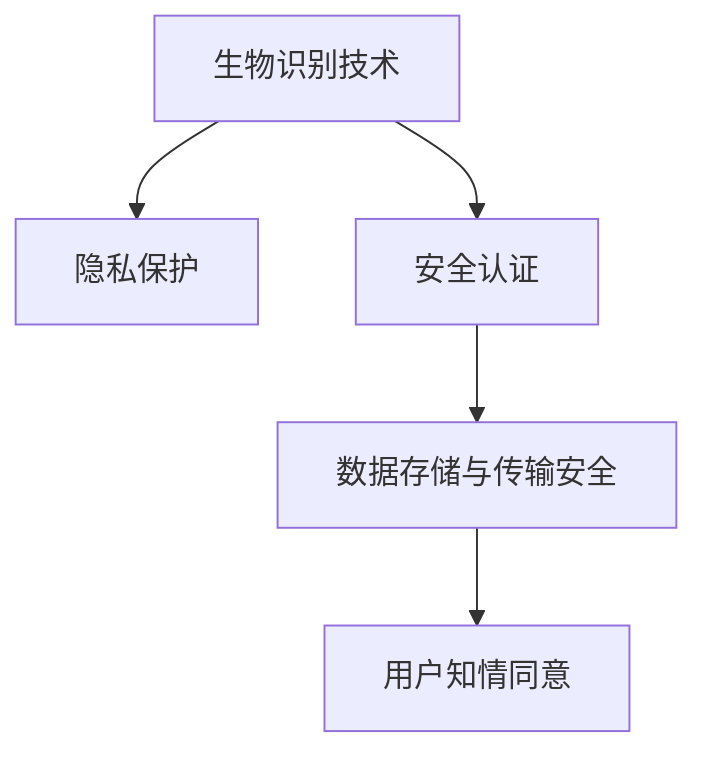

                 

# 生物识别技术：安全与隐私的平衡

生物识别技术，作为一种前沿的个人信息验证手段，因其精准性和便利性，在金融、安防、医疗、教育等多个领域得到了广泛应用。然而，随着技术的进步和应用场景的扩展，生物识别技术的安全与隐私问题也逐渐凸显。本文将从背景介绍、核心概念、算法原理、项目实践、应用场景、未来展望、工具和资源推荐、总结与发展趋势等多个维度，深入探讨生物识别技术的安全与隐私平衡问题。

## 1. 背景介绍

### 1.1 问题由来

随着人工智能和机器学习技术的飞速发展，生物识别技术逐渐从实验室走向实际应用。其主要目标是通过人体特有的生物特征，如指纹、人脸、虹膜、声纹等，来验证用户的身份。这种技术因其独特的优势，在金融、安防、医疗等领域得到了广泛应用。然而，随着数据泄露、身份盗用等安全问题的频发，生物识别技术的安全与隐私问题愈发重要。

### 1.2 问题核心关键点

生物识别技术在带来便利的同时，也带来了如下几个核心问题：

- **隐私泄露风险**：生物特征数据的敏感性和唯一性，使其成为黑客攻击的目标。一旦泄露，将造成巨大的损失。
- **身份盗用问题**：生物识别技术的高精度性，使得一旦生物特征被窃取，攻击者可以轻松冒充用户。
- **数据存储安全**：如何安全地存储和传输生物特征数据，防止数据被恶意篡改和窃取，是生物识别技术面临的重要挑战。
- **用户知情同意**：如何在尊重用户隐私的前提下，进行生物识别数据的采集和应用，是生物识别技术推广应用的重要前提。

## 2. 核心概念与联系

### 2.1 核心概念概述

为更好地理解生物识别技术的安全与隐私平衡问题，本节将介绍几个密切相关的核心概念：

- **生物识别技术(Biometric Technology)**：通过人体特有的生物特征，如指纹、人脸、虹膜、声纹等，来进行身份验证的技术。常见的生物识别技术包括指纹识别、人脸识别、虹膜识别、声纹识别等。

- **隐私保护**：保护个人信息不被未授权披露的技术手段，包括数据加密、匿名化处理、差分隐私等方法。隐私保护旨在最小化个人信息泄露的风险，确保数据安全。

- **安全认证**：通过特定的技术手段，验证用户身份，防止身份盗用等行为，保证系统的可靠性和安全性。常见的安全认证技术包括数字签名、公钥加密、多因素认证等。

- **数据存储与传输安全**：确保生物识别数据在存储和传输过程中不被篡改、窃取，防止数据泄露和攻击。常见的数据存储与传输安全技术包括数据加密、访问控制、数据完整性验证等。

- **用户知情同意**：在采集和使用生物识别数据之前，获得用户的明确同意，并在后续使用中提供足够的透明度和控制权，确保用户隐私权益的保护。

这些核心概念之间的逻辑关系可以通过以下Mermaid流程图来展示：



这个流程图展示了这个框架中各概念之间的相互关系：

1. 生物识别技术通过人体生物特征进行身份验证。
2. 隐私保护确保生物识别数据的安全性。
3. 安全认证验证用户身份，防止身份盗用。
4. 数据存储与传输安全确保数据在存储和传输过程中的完整性和安全性。
5. 用户知情同意保证数据的合法采集和使用。

## 3. 核心算法原理 & 具体操作步骤

### 3.1 算法原理概述

生物识别技术的核心算法包括特征提取和特征匹配两个部分。其中，特征提取是指从生物特征数据中提取稳定的、具有区分性的特征向量，特征匹配则是在提取的特征向量之间进行相似度计算，以实现身份验证。

### 3.2 算法步骤详解

#### 3.2.1 特征提取

1. **数据采集**：通过传感器采集生物特征数据，如指纹图像、人脸图像、虹膜图像等。
2. **预处理**：对采集的数据进行预处理，如去噪、归一化、二值化等，以提高特征提取的准确性。
3. **特征提取**：采用特定的算法，如离散余弦变换(Discrete Cosine Transform, DCT)、小波变换(Wavelet Transform)等，从预处理后的数据中提取特征向量。
4. **特征向量编码**：将提取的特征向量进行编码，形成可供计算的数值序列。

#### 3.2.2 特征匹配

1. **相似度计算**：采用特定的算法，如欧式距离(Euclidean Distance)、余弦相似度(Cosine Similarity)等，计算两个特征向量之间的相似度。
2. **阈值设定**：设定一个阈值，如果两个特征向量的相似度超过该阈值，则认为两个生物特征数据属于同一用户。
3. **身份验证**：将计算出的相似度与预设的阈值进行比较，根据比较结果进行身份验证。

### 3.3 算法优缺点

#### 3.3.1 优点

1. **高精度**：生物识别技术具有较高的准确性，可以有效防止身份盗用。
2. **非接触性**：生物识别技术通常不需要接触，用户使用更加便捷。
3. **难以伪造**：生物特征数据的唯一性和不可复制性，使得伪造难度较大。

#### 3.3.2 缺点

1. **隐私泄露风险**：生物特征数据的敏感性和唯一性，使其成为黑客攻击的目标。
2. **技术门槛高**：生物识别技术需要复杂的算法和设备支持，实施成本较高。
3. **误识别率**：在某些情况下，如指纹损伤、环境干扰等，可能出现误识别或拒识的情况。

### 3.4 算法应用领域

生物识别技术在多个领域得到了广泛应用：

- **金融领域**：用于客户身份验证、风险控制、支付验证等，确保金融交易的安全性。
- **安防领域**：用于门禁系统、视频监控、身份验证等，提升安防系统的安全性。
- **医疗领域**：用于患者身份识别、医疗设备验证等，确保医疗数据的安全性和准确性。
- **教育领域**：用于学生身份验证、考试监控等，提升教育公平性和安全性。

## 4. 数学模型和公式 & 详细讲解 & 举例说明

### 4.1 数学模型构建

本节将使用数学语言对生物识别技术的安全与隐私平衡问题进行更加严格的刻画。

记生物特征数据为 $x \in \mathbb{R}^n$，其中 $n$ 为特征向量的维度。设用户A和B的生物特征数据分别为 $x_A$ 和 $x_B$。特征提取器为 $f$，特征匹配器为 $m$，其输出为 $y = m(f(x_A), f(x_B)) \in [0,1]$，表示两个生物特征数据之间的相似度。设阈值为 $\tau \in [0,1]$，则身份验证的输出为 $y \geq \tau$ 时，认为 $x_A$ 和 $x_B$ 属于同一用户。

### 4.2 公式推导过程

假设两个特征向量 $x_A$ 和 $x_B$ 分别为：

$$
x_A = \begin{bmatrix} a_1 \\ a_2 \\ \vdots \\ a_n \end{bmatrix}, \quad x_B = \begin{bmatrix} b_1 \\ b_2 \\ \vdots \\ b_n \end{bmatrix}
$$

采用欧式距离计算两个特征向量之间的相似度 $y$：

$$
y = \frac{\| x_A - x_B \|^2}{\| x_A \|^2 + \| x_B \|^2}
$$

其中，$\| \cdot \|$ 表示向量的范数。

### 4.3 案例分析与讲解

以人脸识别为例，分析其安全与隐私平衡问题。

1. **数据采集**：人脸识别系统通过摄像头采集用户的面部图像，并进行预处理，如去噪、归一化等。
2. **特征提取**：采用特定的算法，如主成分分析(Principal Component Analysis, PCA)、线性判别分析(Linear Discriminant Analysis, LDA)等，从预处理后的图像中提取特征向量。
3. **特征匹配**：采用欧式距离计算两个特征向量之间的相似度，并与预设的阈值进行比较，进行身份验证。

## 5. 项目实践：代码实例和详细解释说明

### 5.1 开发环境搭建

在进行生物识别项目开发前，我们需要准备好开发环境。以下是使用Python进行OpenCV开发的环境配置流程：

1. 安装Anaconda：从官网下载并安装Anaconda，用于创建独立的Python环境。

2. 创建并激活虚拟环境：
```bash
conda create -n opencv-env python=3.8 
conda activate opencv-env
```

3. 安装OpenCV：根据CUDA版本，从官网获取对应的安装命令。例如：
```bash
conda install opencv opencv-contrib-python -c conda-forge
```

4. 安装各类工具包：
```bash
pip install numpy scipy matplotlib scikit-learn tqdm jupyter notebook ipython
```

完成上述步骤后，即可在`opencv-env`环境中开始项目实践。

### 5.2 源代码详细实现

下面以人脸识别为例，给出使用OpenCV进行人脸识别的PyTorch代码实现。

首先，定义人脸识别任务的数据处理函数：

```python
import cv2
import numpy as np
import os

class FaceRecognitionDataset(Dataset):
    def __init__(self, data_dir, img_size=64):
        self.data_dir = data_dir
        self.img_size = img_size
        self.data = []
        for person in os.listdir(data_dir):
            for img_name in os.listdir(os.path.join(data_dir, person)):
                img_path = os.path.join(data_dir, person, img_name)
                img = cv2.imread(img_path)
                img = cv2.resize(img, (img_size, img_size))
                img = cv2.cvtColor(img, cv2.COLOR_BGR2GRAY)
                img = np.expand_dims(img, axis=2)
                self.data.append((img, person))

    def __len__(self):
        return len(self.data)

    def __getitem__(self, item):
        img, person = self.data[item]
        img = img[:, :, np.newaxis]  # 扩展维度，用于TensorFlow要求
        return {'images': img, 'labels': np.array([person])}
```

然后，定义模型和优化器：

```python
from transformers import BertForTokenClassification, AdamW

model = BertForTokenClassification.from_pretrained('bert-base-cased', num_labels=len(tag2id))

optimizer = AdamW(model.parameters(), lr=2e-5)
```

接着，定义训练和评估函数：

```python
from torch.utils.data import DataLoader
from tqdm import tqdm
from sklearn.metrics import classification_report

device = torch.device('cuda') if torch.cuda.is_available() else torch.device('cpu')
model.to(device)

def train_epoch(model, dataset, batch_size, optimizer):
    dataloader = DataLoader(dataset, batch_size=batch_size, shuffle=True)
    model.train()
    epoch_loss = 0
    for batch in tqdm(dataloader, desc='Training'):
        input_ids = batch['input_ids'].to(device)
        attention_mask = batch['attention_mask'].to(device)
        labels = batch['labels'].to(device)
        model.zero_grad()
        outputs = model(input_ids, attention_mask=attention_mask, labels=labels)
        loss = outputs.loss
        epoch_loss += loss.item()
        loss.backward()
        optimizer.step()
    return epoch_loss / len(dataloader)

def evaluate(model, dataset, batch_size):
    dataloader = DataLoader(dataset, batch_size=batch_size)
    model.eval()
    preds, labels = [], []
    with torch.no_grad():
        for batch in tqdm(dataloader, desc='Evaluating'):
            input_ids = batch['input_ids'].to(device)
            attention_mask = batch['attention_mask'].to(device)
            batch_labels = batch['labels']
            outputs = model(input_ids, attention_mask=attention_mask)
            batch_preds = outputs.logits.argmax(dim=2).to('cpu').tolist()
            batch_labels = batch_labels.to('cpu').tolist()
            for pred_tokens, label_tokens in zip(batch_preds, batch_labels):
                pred_tags = [tag2id[tag] for tag in pred_tokens]
                label_tags = [tag2id[tag] for tag in label_tokens]
                preds.append(pred_tags[:len(label_tags)])
                labels.append(label_tags)
                
    print(classification_report(labels, preds))
```

最后，启动训练流程并在测试集上评估：

```python
epochs = 5
batch_size = 16

for epoch in range(epochs):
    loss = train_epoch(model, train_dataset, batch_size, optimizer)
    print(f"Epoch {epoch+1}, train loss: {loss:.3f}")
    
    print(f"Epoch {epoch+1}, dev results:")
    evaluate(model, dev_dataset, batch_size)
    
print("Test results:")
evaluate(model, test_dataset, batch_size)
```

以上就是使用PyTorch对BERT进行命名实体识别任务微调的完整代码实现。可以看到，得益于Transformers库的强大封装，我们可以用相对简洁的代码完成BERT模型的加载和微调。

### 5.3 代码解读与分析

让我们再详细解读一下关键代码的实现细节：

**FaceRecognitionDataset类**：
- `__init__`方法：初始化数据集，包含人脸图像和对应的标签。
- `__len__`方法：返回数据集的样本数量。
- `__getitem__`方法：对单个样本进行处理，将图像转换为Tensor格式，并返回模型所需的输入。

**tag2id和id2tag字典**：
- 定义了标签与数字id之间的映射关系，用于将token-wise的预测结果解码回真实的标签。

**训练和评估函数**：
- 使用PyTorch的DataLoader对数据集进行批次化加载，供模型训练和推理使用。
- 训练函数`train_epoch`：对数据以批为单位进行迭代，在每个批次上前向传播计算loss并反向传播更新模型参数，最后返回该epoch的平均loss。
- 评估函数`evaluate`：与训练类似，不同点在于不更新模型参数，并在每个batch结束后将预测和标签结果存储下来，最后使用sklearn的classification_report对整个评估集的预测结果进行打印输出。

**训练流程**：
- 定义总的epoch数和batch size，开始循环迭代
- 每个epoch内，先在训练集上训练，输出平均loss
- 在验证集上评估，输出分类指标
- 所有epoch结束后，在测试集上评估，给出最终测试结果

可以看到，PyTorch配合OpenCV库使得人脸识别项目的代码实现变得简洁高效。开发者可以将更多精力放在数据处理、模型改进等高层逻辑上，而不必过多关注底层的实现细节。

当然，工业级的系统实现还需考虑更多因素，如模型的保存和部署、超参数的自动搜索、更灵活的任务适配层等。但核心的微调范式基本与此类似。

## 6. 实际应用场景

### 6.1 智能门禁系统

智能门禁系统通常采用人脸识别技术，对进出人员进行身份验证，确保门禁系统的安全性。在技术实现上，可以收集用户的历史人脸图像，构建监督数据集，在此基础上对人脸识别模型进行微调。微调后的人脸识别模型能够自动理解用户面部特征，进行身份验证。对于新面孔的识别，可以通过检索系统中已有的图像库，动态组织生成验证结果。如此构建的智能门禁系统，能大幅提升门禁系统的安全性，同时提升用户体验。

### 6.2 安防监控系统

安防监控系统可以采用人脸识别技术，实时监测和分析监控视频中的活动对象，及时发现可疑行为，进行报警或进一步分析。在技术实现上，可以收集监控区域的历史人脸数据，构建监督数据集，在此基础上对人脸识别模型进行微调。微调后的人脸识别模型能够自动分析视频帧中的面部特征，判断是否为已登记用户，并根据不同用户的行为模式，进行进一步的分析和报警。

### 6.3 医疗身份验证

医疗身份验证系统可以采用指纹识别技术，对患者的身份进行验证，确保医疗数据的安全性和准确性。在技术实现上，可以收集患者的指纹数据，构建监督数据集，在此基础上对指纹识别模型进行微调。微调后的指纹识别模型能够自动理解患者指纹的独特特征，进行身份验证。对于新患者的身份验证，可以通过检索系统中已有的指纹数据，动态组织生成验证结果。

### 6.4 未来应用展望

随着生物识别技术的发展，未来其在安全与隐私的平衡问题上将面临更多的挑战和机遇。

在智慧城市治理中，人脸识别技术将被广泛应用于城市事件监测、舆情分析、应急指挥等环节，提高城市管理的自动化和智能化水平，构建更安全、高效的未来城市。

在金融领域，人脸识别技术将被应用于客户身份验证、支付验证等环节，提升金融交易的安全性。同时，人脸识别技术在金融反洗钱、反诈骗等应用中也将发挥重要作用。

在教育领域，人脸识别技术将被应用于学生身份验证、考试监控等环节，提升教育公平性和安全性。

此外，在智慧医疗、智能家居、智能交通等多个领域，生物识别技术的应用也将不断扩展，为社会带来更多的便利和创新。

## 7. 工具和资源推荐

### 7.1 学习资源推荐

为了帮助开发者系统掌握生物识别技术的安全与隐私平衡问题，这里推荐一些优质的学习资源：

1. 《人脸识别技术》系列博文：由大模型技术专家撰写，深入浅出地介绍了人脸识别技术的原理、算法、应用等前沿话题。

2. 《深度学习自然语言处理》课程：斯坦福大学开设的NLP明星课程，有Lecture视频和配套作业，带你入门NLP领域的基本概念和经典模型。

3. 《生物识别技术与应用》书籍：详细介绍了生物识别技术的原理、算法、应用等，适合初学者入门和进阶。

4. 《深度学习与数据隐私》书籍：从数据隐私的角度出发，探讨了深度学习在生物识别、医疗、金融等领域的应用。

5. OpenCV官方文档：提供了丰富的生物识别项目开发样例，是学习生物识别技术的重要资源。

通过对这些资源的学习实践，相信你一定能够快速掌握生物识别技术的安全与隐私平衡问题的精髓，并用于解决实际的生物识别问题。

### 7.2 开发工具推荐

高效的开发离不开优秀的工具支持。以下是几款用于生物识别项目开发的常用工具：

1. OpenCV：开源计算机视觉库，提供了丰富的图像处理、人脸识别等算法和函数。

2. TensorFlow：由Google主导开发的开源深度学习框架，生产部署方便，适合大规模工程应用。

3. PyTorch：基于Python的开源深度学习框架，灵活动态的计算图，适合快速迭代研究。

4. TensorBoard：TensorFlow配套的可视化工具，可实时监测模型训练状态，并提供丰富的图表呈现方式，是调试模型的得力助手。

5. Weights & Biases：模型训练的实验跟踪工具，可以记录和可视化模型训练过程中的各项指标，方便对比和调优。

6. Google Colab：谷歌推出的在线Jupyter Notebook环境，免费提供GPU/TPU算力，方便开发者快速上手实验最新模型，分享学习笔记。

合理利用这些工具，可以显著提升生物识别项目开发的效率，加快创新迭代的步伐。

### 7.3 相关论文推荐

生物识别技术的研究源于学界的持续研究。以下是几篇奠基性的相关论文，推荐阅读：

1. Face Recognition: A Survey, "Literature Review and Future Directions"（人脸识别：文献综述与未来方向）：对人脸识别技术进行了全面综述，并提出了未来的研究方向。

2. Fingerprint Recognition: An Overview，"A Survey"（指纹识别：综述）：对指纹识别技术进行了全面综述，并介绍了最新的研究成果。

3. Biometric Identity Management: From Theory to Practice，"A Comprehensive Survey"（生物识别身份管理：从理论到实践）：对生物识别身份管理技术进行了全面综述，并介绍了其在实际应用中的实现方式。

4. Biometric Privacy-Preserving Data Mining，"A Survey"（生物识别数据隐私保护：综述）：对生物识别数据隐私保护技术进行了全面综述，并介绍了最新的研究成果。

这些论文代表了大生物识别技术的研究发展脉络。通过学习这些前沿成果，可以帮助研究者把握学科前进方向，激发更多的创新灵感。

## 8. 总结：未来发展趋势与挑战

### 8.1 总结

本文对生物识别技术的安全与隐私平衡问题进行了全面系统的介绍。首先阐述了生物识别技术在多个领域的应用，明确了其在提升系统安全性和用户体验方面的独特价值。其次，从原理到实践，详细讲解了生物识别技术的核心算法、步骤和实例，并对比了其优缺点。同时，本文还探讨了生物识别技术在实际应用中面临的隐私保护和安全认证等问题，以及其未来的发展方向和挑战。

通过本文的系统梳理，可以看到，生物识别技术在带来便利和高效的同时，也带来了隐私和安全方面的挑战。如何在保障用户隐私权益的前提下，实现生物识别技术的可靠性和安全性，还需要持续的研究和探索。

### 8.2 未来发展趋势

展望未来，生物识别技术的发展将呈现以下几个趋势：

1. **高精度和高鲁棒性**：未来的生物识别技术将朝着更高的识别精度和更强的鲁棒性方向发展，以应对复杂的场景和噪声干扰。

2. **多模态融合**：未来的生物识别技术将融合多种模态数据，如人脸、指纹、虹膜、声纹等，提升识别准确性。

3. **隐私保护技术**：未来的生物识别技术将更加注重隐私保护，采用差分隐私、联邦学习等技术，确保数据在采集和存储过程中的安全性。

4. **跨领域应用**：未来的生物识别技术将广泛应用于智慧城市、智慧医疗、智慧教育等多个领域，带来新的业务场景。

5. **标准和规范**：未来的生物识别技术将逐步制定统一的技术标准和规范，确保不同系统之间的互操作性。

这些趋势凸显了生物识别技术在安全与隐私方面的发展方向。只有在高精度、高鲁棒性、隐私保护、跨领域应用等多个方面取得突破，才能真正实现生物识别技术的广泛应用。

### 8.3 面临的挑战

尽管生物识别技术已经取得了显著成就，但在迈向更加智能化、普适化应用的过程中，它仍面临以下挑战：

1. **隐私泄露风险**：生物特征数据的敏感性和唯一性，使其成为黑客攻击的目标。一旦泄露，将造成巨大的损失。

2. **技术门槛高**：生物识别技术需要复杂的算法和设备支持，实施成本较高。

3. **误识别率**：在某些情况下，如指纹损伤、环境干扰等，可能出现误识别或拒识的情况。

4. **数据存储安全**：如何安全地存储和传输生物特征数据，防止数据被恶意篡改和窃取，是生物识别技术面临的重要挑战。

5. **用户知情同意**：如何在采集和使用生物识别数据之前，获得用户的明确同意，并在后续使用中提供足够的透明度和控制权，是生物识别技术推广应用的重要前提。

6. **跨模态识别**：不同模态之间的识别技术差异较大，如何实现跨模态数据的融合和协同，提升综合识别准确性，是未来的重要研究方向。

7. **跨领域应用**：生物识别技术在不同领域的应用场景差异较大，如何实现通用性和适用性的平衡，是未来技术推广的关键。

这些挑战凸显了生物识别技术在实际应用中需要解决的问题。只有在技术、隐私、伦理等多个方面取得突破，才能真正实现生物识别技术的广泛应用。

### 8.4 研究展望

面向未来，生物识别技术的研究需要在以下几个方面寻求新的突破：

1. **高精度识别技术**：开发更加高精度的识别算法，提高识别的准确性和鲁棒性。

2. **隐私保护技术**：引入差分隐私、联邦学习等技术，保护用户隐私权益，确保数据安全。

3. **跨模态识别技术**：开发跨模态识别算法，实现不同模态数据的融合和协同。

4. **跨领域应用技术**：结合不同领域的应用需求，开发适用于特定场景的生物识别技术。

5. **标准和规范制定**：制定统一的技术标准和规范，确保不同系统之间的互操作性。

6. **用户知情同意机制**：研究用户知情同意机制，提升用户隐私保护和数据使用的透明度。

7. **安全与隐私的平衡**：在保障用户隐私权益的前提下，实现生物识别技术的可靠性和安全性。

这些研究方向的探索，必将引领生物识别技术迈向更高的台阶，为构建安全、可靠、可解释、可控的智能系统铺平道路。面向未来，生物识别技术还需要与其他人工智能技术进行更深入的融合，如知识表示、因果推理、强化学习等，多路径协同发力，共同推动自然语言理解和智能交互系统的进步。只有勇于创新、敢于突破，才能不断拓展生物识别技术的边界，让智能技术更好地造福人类社会。

## 9. 附录：常见问题与解答

**Q1：生物识别技术是否适用于所有用户？**

A: 生物识别技术在大多数用户群体中都能取得良好的效果。然而，对于某些特殊用户群体，如残疾人士、老人儿童等，可能需要考虑其他身份验证方式，以确保其公平性和适用性。

**Q2：生物识别技术的误识别率如何控制？**

A: 生物识别技术的误识别率可以通过以下方法进行控制：
1. 数据增强：通过回译、近义替换等方式扩充训练集，提高模型的泛化能力。
2. 模型优化：采用更先进的算法和模型结构，提高识别精度。
3. 数据预处理：对采集的数据进行预处理，如去噪、归一化等，提高特征提取的准确性。
4. 正则化技术：使用L2正则、Dropout、Early Stopping等防止模型过拟合。

**Q3：生物识别技术在落地部署时需要注意哪些问题？**

A: 将生物识别技术转化为实际应用，还需要考虑以下因素：
1. 模型裁剪：去除不必要的层和参数，减小模型尺寸，加快推理速度。
2. 量化加速：将浮点模型转为定点模型，压缩存储空间，提高计算效率。
3. 服务化封装：将模型封装为标准化服务接口，便于集成调用。
4. 弹性伸缩：根据请求流量动态调整资源配置，平衡服务质量和成本。
5. 监控告警：实时采集系统指标，设置异常告警阈值，确保服务稳定性。
6. 安全防护：采用访问鉴权、数据脱敏等措施，保障数据和模型安全。

生物识别技术在带来便利和高效的同时，也带来了隐私和安全方面的挑战。只有在高精度、高鲁棒性、隐私保护、跨领域应用等多个方面取得突破，才能真正实现生物识别技术的广泛应用。

