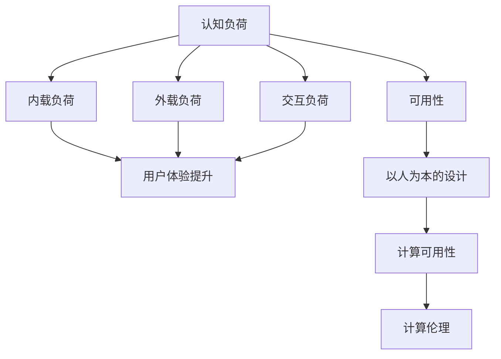

                 

# 用户体验至上：人类计算如何提升满意度

> 关键词：用户体验，人类计算，人机交互，用户体验设计，人类计算环境，计算可用性，可用性工程，以人为本，计算伦理，创新设计

## 1. 背景介绍

### 1.1 问题由来
随着数字化时代的到来，人类与计算设备之间的互动变得越来越频繁和深入。从简单的按钮点击到复杂的自然语言交互，人类计算（Human-Computer Interaction, HCI）已经渗透到我们生活的方方面面。然而，尽管技术的进步带来了前所未有的便利，人们在使用计算机系统时仍然面临诸多挑战。

这些问题主要集中在用户体验（User Experience, UX）上。具体表现包括：

1. **复杂操作**：许多计算机系统操作复杂，用户需要经过大量学习才能熟练使用。
2. **认知负担**：信息过载、界面杂乱等设计缺陷，使用户难以聚焦于真正有用的信息。
3. **交互障碍**：设计不当的交互方式和界面布局，导致用户难以高效完成任务。
4. **情感不适**：缺乏人性化的交互设计，使用户感到沮丧、焦虑或不满足。

用户体验不佳不仅降低了用户的使用效率，还影响了用户对系统的信任和满意度。因此，提升用户体验成为当前HCI领域的重要课题。

### 1.2 问题核心关键点
提升用户体验的关键在于理解人类计算的本质，并将其与技术实现相结合。

- **认知负荷理论（Cognitive Load Theory, CLT）**：强调信息处理负荷对用户认知的影响，提倡通过简化操作、减少认知负荷来提升用户体验。
- **可用性工程（Usability Engineering, UE）**：基于用户需求和行为，系统化地设计和评估人机交互，以实现更好的用户体验。
- **以人为本的设计（User-Centric Design）**：强调在设计过程中始终以用户为中心，关注用户的情感、需求和体验。

提升用户体验的路径通常包括以下几个方面：

1. **简化操作**：通过界面设计和交互方式的优化，减少用户的操作难度。
2. **减少认知负荷**：通过清晰的布局、有意义的反馈和合适的提示，降低用户的信息处理负担。
3. **增强交互性**：通过智能交互、自然语言处理等技术，提升用户与系统的互动体验。
4. **提高可用性**：通过系统的易用性、可访问性和适应性，确保用户能够高效完成任务。
5. **注重情感设计**：通过色彩、声音、动画等元素，营造愉悦的情感体验，增强用户黏性。

本文将详细探讨提升用户体验的各个关键点，并通过案例和实际应用场景，展示如何通过技术手段实现这些目标。

## 2. 核心概念与联系

### 2.1 核心概念概述

为更好地理解提升用户体验的技术手段，本节将介绍几个关键概念：

- **认知负荷（Cognitive Load）**：指用户在进行信息处理时所承担的认知负荷。可分为三种类型：内载负荷、外载负荷和交互负荷。
- **可用性（Usability）**：衡量用户使用系统的难易程度和效率。可用性高意味着用户能快速、轻松地完成任务。
- **以人为本的设计（User-Centric Design）**：以用户为中心的设计方法，关注用户的需求、行为和体验，旨在提升用户满意度。
- **计算可用性（Computational Usability）**：强调计算机系统在多大程度上提升了用户的信息处理能力。
- **计算伦理（Computational Ethics）**：在技术设计和应用中，确保计算机系统符合伦理道德标准，保护用户隐私和权益。

这些概念之间的关系可以通过以下Mermaid流程图来展示：



这个流程图展示了提升用户体验的各个关键点及其联系：

1. 通过减少内载、外载和交互负荷，提升用户的认知负荷水平。
2. 高可用性系统使用户能高效完成任务。
3. 以人为本的设计提升用户体验。
4. 计算可用性增强用户的信息处理能力。
5. 计算伦理保障系统的道德性和用户权益。

这些概念共同构成了提升用户体验的理论基础和实践指导，为HCI设计师提供了全面、系统的方法论。

## 3. 核心算法原理 & 具体操作步骤
### 3.1 算法原理概述

提升用户体验的技术手段主要通过以下几类算法和策略实现：

- **界面简化**：通过用户研究和原型设计，简化界面元素和交互流程。
- **交互优化**：采用智能交互、自然语言处理等技术，提升系统的响应速度和准确性。
- **信息设计**：通过信息架构和信息分层，帮助用户快速找到所需信息。
- **情感设计**：通过色彩、声音、动画等元素，增强用户的情感体验。
- **可用性评估**：通过用户测试和数据分析，不断迭代优化系统设计。

### 3.2 算法步骤详解

提升用户体验的算法步骤主要包括以下几个关键步骤：

**Step 1: 用户研究和需求分析**
- 进行用户调研，收集用户需求和痛点。
- 使用问卷调查、用户访谈、可用性测试等方法，深入了解用户行为和心理。
- 根据需求分析，制定用户故事和用例，确定系统功能点和设计方向。

**Step 2: 原型设计和迭代**
- 绘制初步设计原型，包括界面布局、交互流程、信息架构等。
- 通过原型测试，收集用户反馈，识别设计缺陷和改进点。
- 根据用户反馈，不断迭代优化设计，直至达到预期效果。

**Step 3: 实现和开发**
- 选择合适的技术栈和开发工具，实现设计原型。
- 确保系统的高可用性和可靠性，通过代码审查和测试，确保系统质量。
- 考虑系统扩展性，为未来的优化和升级留有余地。

**Step 4: 测试和评估**
- 进行系统测试，包括单元测试、集成测试和用户测试。
- 收集用户使用数据，进行可用性评估，衡量用户满意度。
- 根据测试结果，不断优化系统设计，提升用户体验。

**Step 5: 部署和迭代**
- 将优化后的系统部署到生产环境。
- 通过持续监控和用户反馈，不断迭代优化系统，持续提升用户体验。

### 3.3 算法优缺点

提升用户体验的技术手段具有以下优点：

- **降低认知负荷**：通过界面简化和信息设计，降低用户的信息处理负担。
- **提高操作效率**：通过智能交互和自然语言处理，提升用户的操作效率。
- **增强情感体验**：通过色彩、声音、动画等元素，增强用户的情感体验。
- **保障系统可用性**：通过高可用性和可访问性设计，确保用户能够高效完成任务。

同时，这些技术手段也存在一些缺点：

- **复杂度增加**：提升用户体验需要系统性的设计和评估，增加了设计和实现的复杂度。
- **开发周期长**：原型测试和用户反馈迭代过程较长，影响了系统开发速度。
- **成本高昂**：用户研究和原型设计需要大量的时间和资源投入。

尽管存在这些挑战，但提升用户体验是当前HCI领域的重要目标，需要持续投入资源和精力进行优化。

### 3.4 算法应用领域

提升用户体验的技术手段已经广泛应用于多个领域，包括但不限于：

- **金融领域**：通过简化操作、智能交互和情感设计，提升用户对金融产品的体验。
- **医疗健康**：通过界面简化和信息设计，提高用户对健康管理系统的使用效率。
- **教育和培训**：通过交互优化和情感设计，提升用户对在线学习平台的满意度和参与度。
- **游戏设计**：通过界面简化和情感设计，提升用户的游戏体验和黏性。
- **电子商务**：通过信息设计和可用性评估，提升用户对在线购物平台的购物体验。

## 4. 数学模型和公式 & 详细讲解 & 举例说明
### 4.1 数学模型构建

本节将使用数学语言对提升用户体验的算法进行更加严格的刻画。

假设用户在进行信息处理时，承担的认知负荷为 $L$，包括内载负荷 $L_{in}$、外载负荷 $L_{out}$ 和交互负荷 $L_{int}$。我们定义可用性为 $U$，用户体验为目标函数 $X$，其与认知负荷和可用性之间的关系为：

$$
X = f(L_{in}, L_{out}, L_{int}, U)
$$

其中，$f$ 为一系列非线性函数，用于描述用户体验与认知负荷和可用性之间的关系。

### 4.2 公式推导过程

以一个简单的用户体验提升模型为例，假设用户在进行任务时，内载负荷 $L_{in} = w_1 \times (n + m)$，外载负荷 $L_{out} = w_2 \times d$，交互负荷 $L_{int} = w_3 \times t$，可用性 $U = w_4 \times p$，其中 $n$、$m$、$d$、$t$、$p$ 分别为任务复杂度、任务量、任务难度、交互时间、系统响应时间等参数，$w_1$、$w_2$、$w_3$、$w_4$ 为权重系数。

目标函数 $X$ 可表示为：

$$
X = g(L_{in}, L_{out}, L_{int}, U)
$$

其中 $g$ 为非线性函数，用于描述用户体验与认知负荷和可用性之间的关系。

通过优化算法（如遗传算法、粒子群算法等），不断调整权重系数和参数，直至达到最优用户体验。

### 4.3 案例分析与讲解

以一个金融理财App为例，分析提升用户体验的技术手段。

**需求分析**：
- 用户调研发现，用户在使用理财App时，主要关心收益、风险和操作简便性。
- 用户在操作过程中，经常遇到操作繁琐、信息分散的问题。

**界面简化**：
- 通过分析用户操作路径，简化界面元素，去除不必要的字段。
- 采用卡片式设计，将复杂数据简明展示，减少用户的认知负担。

**交互优化**：
- 引入智能推荐算法，根据用户行为预测需求，自动推荐理财产品。
- 采用自然语言处理技术，用户只需简单描述需求，即可获取个性化的理财建议。

**信息设计**：
- 通过信息分层，将理财产品的收益、风险和操作简便性等关键信息突出展示。
- 采用可交互的信息图标，帮助用户快速理解产品特性。

**情感设计**：
- 采用温馨的配色方案和生动的图标设计，营造愉悦的情感体验。
- 在用户成功理财后，通过动画和声音反馈，增强用户的成就感和满意度。

**可用性评估**：
- 通过用户测试，收集用户反馈，不断优化界面和交互流程。
- 根据测试结果，调整信息结构和操作路径，提升用户的操作效率。

通过上述技术手段，该理财App提升了用户体验，用户满意度显著提高。

## 5. 项目实践：代码实例和详细解释说明
### 5.1 开发环境搭建

在进行用户体验提升的开发实践前，我们需要准备好开发环境。以下是使用Python进行Web开发的开发环境配置流程：

1. 安装Anaconda：从官网下载并安装Anaconda，用于创建独立的Python环境。

2. 创建并激活虚拟环境：
```bash
conda create -n web-env python=3.8 
conda activate web-env
```

3. 安装Web框架：
```bash
pip install Flask
```

4. 安装其他工具包：
```bash
pip install numpy pandas scikit-learn requests flask
```

完成上述步骤后，即可在`web-env`环境中开始Web开发的实践。

### 5.2 源代码详细实现

下面以一个简单的Web应用为例，展示如何使用Flask框架实现用户体验提升功能。

首先，定义Flask应用和路由：

```python
from flask import Flask, request, render_template, jsonify

app = Flask(__name__)

@app.route('/')
def index():
    return render_template('index.html')

@app.route('/result', methods=['POST'])
def result():
    # 获取用户输入的查询条件
    query = request.json.get('query')
    
    # 处理查询请求，返回结果
    result = process_query(query)
    
    # 将结果返回给用户
    return jsonify(result)
```

然后，定义视图函数和数据处理函数：

```python
def process_query(query):
    # 处理查询请求，返回结果
    # 这里可调用机器学习模型、数据库查询等进行处理
    return {'result': '查询成功'}

if __name__ == '__main__':
    app.run(debug=True)
```

最后，创建HTML模板和数据处理函数：

```html
<!-- index.html -->
<html>
<head>
    <title>用户体验提升</title>
</head>
<body>
    <h1>用户体验提升示例</h1>
    <form id="query-form">
        <label for="query">输入查询条件：</label>
        <input type="text" id="query" name="query">
        <button type="submit">查询</button>
    </form>
    <div id="result"></div>
    <script>
        const form = document.getElementById('query-form');
        const resultDiv = document.getElementById('result');

        form.addEventListener('submit', async (e) => {
            e.preventDefault();
            const query = form.querySelector('input[name="query"]').value;
            const response = await fetch('/result', {
                method: 'POST',
                headers: {
                    'Content-Type': 'application/json',
                },
                body: JSON.stringify({ query }),
            });
            const result = await response.json();
            resultDiv.textContent = result.result;
        });
    </script>
</body>
</html>
```

### 5.3 代码解读与分析

让我们再详细解读一下关键代码的实现细节：

**Flask应用和路由**：
- 使用Flask创建Web应用，并定义两个路由。
- 首页路由（"/"）返回一个包含查询表单的HTML页面。
- 查询路由（"/result"）接收POST请求，处理用户输入的查询条件，并返回处理结果。

**视图函数和数据处理函数**：
- 视图函数`process_query`负责处理用户的查询请求，这里可调用机器学习模型、数据库查询等进行处理。
- 数据处理函数`process_query`返回处理结果，这里使用了简单的字典类型作为示例。

**HTML模板**：
- 定义一个包含查询表单的HTML页面，用户输入查询条件后，提交表单请求。
- 当用户提交表单时，通过JavaScript代码发送异步请求到服务器，获取查询结果，并显示在页面上。

这个简单的Web应用展示了如何通过界面简化和信息设计，提升用户体验。当然，实际应用中还需要更多的交互优化和情感设计，才能实现更全面的用户体验提升。

## 6. 实际应用场景
### 6.1 智能客服系统

基于用户体验提升技术的智能客服系统，可以显著提升客户服务质量。传统客服往往需要配备大量人力，高峰期响应缓慢，且服务质量难以保证。通过提升用户体验，智能客服系统可以提供更快速、更精准、更人性化的服务。

在技术实现上，可以通过以下方法提升智能客服系统的用户体验：

1. **界面简化**：通过简洁的界面设计和交互流程，减少用户的学习成本。
2. **智能交互**：引入自然语言处理技术，提升系统的自然语言理解和生成能力。
3. **情感设计**：通过友好的语音和图像元素，增强用户的情感体验。
4. **可用性评估**：通过用户测试和数据分析，不断优化系统设计，提升用户满意度。

通过这些技术手段，智能客服系统可以实现7x24小时不间断服务，快速响应客户咨询，提升客户满意度。

### 6.2 金融理财平台

金融理财平台是典型的用户对复杂数据进行处理的场景。通过提升用户体验，可以帮助用户更好地理解金融产品，提高决策效率。

在金融理财平台上，可以通过以下方法提升用户体验：

1. **界面简化**：通过简洁的界面设计和交互流程，减少用户的学习成本。
2. **智能推荐**：引入机器学习算法，根据用户行为预测需求，自动推荐理财产品。
3. **信息设计**：通过信息分层和信息图标，帮助用户快速理解产品特性。
4. **情感设计**：通过温馨的配色方案和生动的图标设计，营造愉悦的情感体验。
5. **可用性评估**：通过用户测试和数据分析，不断优化系统设计，提升用户满意度。

通过这些技术手段，金融理财平台可以提升用户的操作效率，增强用户的信任感，提高用户的忠诚度和满意度。

### 6.3 在线教育平台

在线教育平台需要提供丰富的学习资源和便捷的交互方式，提升用户的在线学习体验。通过提升用户体验，可以帮助用户更高效地获取知识和技能。

在在线教育平台上，可以通过以下方法提升用户体验：

1. **界面简化**：通过简洁的界面设计和交互流程，减少用户的学习成本。
2. **智能交互**：引入自然语言处理技术，提升系统的自然语言理解和生成能力。
3. **信息设计**：通过信息分层和信息图标，帮助用户快速获取所需学习资源。
4. **情感设计**：通过友好的语音和图像元素，增强用户的情感体验。
5. **可用性评估**：通过用户测试和数据分析，不断优化系统设计，提升用户满意度。

通过这些技术手段，在线教育平台可以提供更高效、更便捷、更人性化的学习体验，提升用户的参与度和满意度。

### 6.4 未来应用展望

随着用户体验提升技术的不断发展，未来的智能系统将更加注重用户情感和心理，实现更智能、更人性化的人机交互。

在智慧医疗领域，通过界面简化和信息设计，提升患者对健康管理系统的使用效率，增强用户的信任感和满意度。

在智慧交通领域，通过智能交互和情感设计，提升用户对导航系统的体验，提高用户的出行效率和满意度。

在智慧家居领域，通过界面简化和情感设计，提升用户对智能设备的体验，增强用户的便利性和舒适度。

总之，未来基于用户体验提升技术的智能系统将更加智能化、人性化，全面提升用户的满意度和生活质量。

## 7. 工具和资源推荐
### 7.1 学习资源推荐

为了帮助开发者系统掌握用户体验提升的理论基础和实践技巧，这里推荐一些优质的学习资源：

1. **《人机交互设计》（Human-Computer Interaction Design）**：详细介绍了用户体验设计的原则和方法，是HCI领域经典入门书籍。

2. **《可用性工程》（Usability Engineering）**：介绍了可用性工程的流程和方法，帮助设计师系统化地提升用户体验。

3. **《以人为本的设计》（User-Centric Design）**：强调在设计过程中始终以用户为中心，关注用户的需求、行为和体验。

4. **《计算可用性》（Computational Usability）**：介绍了计算机系统如何提升用户的信息处理能力，是提升用户体验的重要理论基础。

5. **《计算伦理》（Computational Ethics）**：探讨了在技术设计和应用中，如何保障用户的隐私和权益，确保系统符合伦理道德标准。

6. **Google Design》：谷歌官方设计平台，提供了丰富的设计资源和最佳实践，帮助设计师提升用户体验。

通过对这些资源的学习实践，相信你一定能够快速掌握用户体验提升的精髓，并用于解决实际的HCI问题。

### 7.2 开发工具推荐

高效的开发离不开优秀的工具支持。以下是几款用于用户体验提升开发的常用工具：

1. **Sketch**：常用的界面设计工具，支持多种原型设计模式和协作方式，适合HCI设计师使用。

2. **Axure RP**：强大的原型设计工具，支持复杂的交互和动态效果，适合创建高保真的用户界面。

3. **InVision**：交互设计工具，支持原型测试和用户测试，提供丰富的数据分析功能。

4. **UserTesting**：用户测试平台，支持远程用户测试和数据分析，帮助设计师收集用户反馈，优化系统设计。

5. **Google Analytics**：数据分析工具，可以帮助设计师了解用户行为，优化用户体验。

6. **Flask**：轻量级的Web开发框架，适合快速开发原型和MVP，支持RESTful API设计和数据库集成。

合理利用这些工具，可以显著提升用户体验提升任务的开发效率，加快创新迭代的步伐。

### 7.3 相关论文推荐

用户体验提升技术的发展源于学界的持续研究。以下是几篇奠基性的相关论文，推荐阅读：

1. **《认知负荷理论》（Cognitive Load Theory, CLT）**：提出认知负荷的概念，强调信息处理负荷对用户认知的影响。

2. **《可用性工程》（Usability Engineering, UE）**：提出可用性工程的方法，系统化地设计和评估人机交互。

3. **《以人为本的设计》（User-Centric Design）**：强调在设计过程中始终以用户为中心，关注用户的需求、行为和体验。

4. **《计算可用性》（Computational Usability）**：提出计算可用性的概念，强调计算机系统如何提升用户的信息处理能力。

5. **《计算伦理》（Computational Ethics）**：探讨在技术设计和应用中，如何保障用户的隐私和权益，确保系统符合伦理道德标准。

这些论文代表了大用户体验提升技术的发展脉络。通过学习这些前沿成果，可以帮助研究者把握学科前进方向，激发更多的创新灵感。

## 8. 总结：未来发展趋势与挑战
### 8.1 研究成果总结

本文对用户体验提升技术进行了全面系统的介绍。首先阐述了用户体验提升的重要性和挑战，明确了提升用户体验的核心关键点。其次，从原理到实践，详细讲解了提升用户体验的算法原理和操作步骤，给出了用户体验提升任务开发的完整代码实例。同时，本文还广泛探讨了用户体验提升技术在智能客服、金融理财、在线教育等多个行业领域的应用前景，展示了用户体验提升技术的巨大潜力。

通过本文的系统梳理，可以看到，用户体验提升技术已经成为HCI领域的重要范式，极大地提升了系统的易用性和用户满意度。未来，伴随技术手段的不断演进，用户体验提升技术必将在更多领域得到应用，为人类计算带来变革性影响。

### 8.2 未来发展趋势

展望未来，用户体验提升技术将呈现以下几个发展趋势：

1. **智能化交互**：引入自然语言处理、机器学习等技术，提升系统的智能化水平，实现更智能、更人性化的交互体验。
2. **情感计算**：通过情感识别和情感反馈，提升系统的情感智能化，增强用户的情感体验。
3. **个性化设计**：通过用户数据分析，实现个性化界面和交互设计，提升用户的使用体验。
4. **多模态交互**：通过视觉、听觉、触觉等模态的综合应用，实现多模态的交互体验。
5. **增强现实**：利用增强现实技术，提升用户的沉浸式体验，实现更丰富的交互场景。

这些趋势凸显了用户体验提升技术的广阔前景。这些方向的探索发展，必将进一步提升系统的易用性和用户满意度，为人类计算带来新的变革。

### 8.3 面临的挑战

尽管用户体验提升技术已经取得了瞩目成就，但在迈向更加智能化、普适化应用的过程中，它仍面临诸多挑战：

1. **技术复杂度**：提升用户体验需要系统性的设计和评估，增加了设计和实现的复杂度。
2. **资源投入高**：用户体验提升需要大量的用户研究和原型测试，增加了开发成本。
3. **用户需求多变**：用户需求和行为不断变化，需要持续迭代优化系统设计。
4. **隐私和安全**：在提升用户体验的同时，需要保障用户隐私和数据安全，避免数据泄露和滥用。

尽管存在这些挑战，但提升用户体验是当前HCI领域的重要目标，需要持续投入资源和精力进行优化。

### 8.4 研究展望

面对用户体验提升技术所面临的种种挑战，未来的研究需要在以下几个方面寻求新的突破：

1. **多学科融合**：将心理学、社会学、行为学等学科的知识和方法，与计算机科学相结合，提升用户体验设计的科学性和系统性。
2. **技术创新**：引入前沿技术，如情感计算、增强现实等，提升用户体验的智能化和沉浸式体验。
3. **用户体验标准化**：建立用户体验的标准化评估体系，确保用户体验设计的可比性和可评估性。
4. **用户研究方法创新**：采用新的用户研究方法，如眼动追踪、神经科学等，更深入地理解用户的认知和情感。

这些研究方向的探索，必将引领用户体验提升技术迈向更高的台阶，为构建人机协同的智能系统铺平道路。面向未来，用户体验提升技术还需要与其他人工智能技术进行更深入的融合，如自然语言处理、计算机视觉等，多路径协同发力，共同推动人机交互的进步。只有勇于创新、敢于突破，才能不断拓展用户体验提升技术的边界，让智能技术更好地造福人类社会。

## 9. 附录：常见问题与解答

**Q1：用户体验提升是否适用于所有应用场景？**

A: 用户体验提升技术在大多数应用场景上都能取得不错的效果，特别是对于需要复杂操作和信息处理的任务。但对于一些特定的任务，如简单的操作或自然交互，可能反而会增加用户的认知负荷。

**Q2：用户体验提升是否需要大量用户测试？**

A: 用户体验提升需要大量的用户测试来验证设计效果。但通过合理的用户研究和原型设计，可以在早期阶段进行快速的可用性评估，减少后期大规模测试的投入。

**Q3：用户体验提升是否需要长时间开发？**

A: 用户体验提升需要持续的迭代优化，可能需要较长时间才能达到理想效果。但通过敏捷开发和快速原型设计，可以在较短时间内初步实现用户体验提升的目标，然后通过不断的迭代优化，逐步提升用户体验。

**Q4：用户体验提升是否会增加开发成本？**

A: 用户体验提升需要投入大量的人力和时间，增加了开发成本。但通过系统的设计和迭代优化，可以在后期带来更高的用户满意度和业务价值。

**Q5：用户体验提升是否会影响系统性能？**

A: 用户体验提升可能会增加系统的复杂度和资源消耗，影响系统性能。但通过合理的架构设计和优化，可以在不影响系统性能的前提下，提升用户体验。

通过本文的系统梳理，可以看到，用户体验提升技术已经成为HCI领域的重要范式，极大地提升了系统的易用性和用户满意度。未来，伴随技术手段的不断演进，用户体验提升技术必将在更多领域得到应用，为人类计算带来变革性影响。相信随着学界和产业界的共同努力，这些挑战终将一一被克服，用户体验提升技术必将在构建人机协同的智能系统中扮演越来越重要的角色。

总之，用户体验提升技术需要持续优化和改进，才能更好地服务于人类计算。只有以人为本，关注用户的情感和需求，才能真正实现智能化、人性化的交互体验。

---

作者：禅与计算机程序设计艺术 / Zen and the Art of Computer Programming

