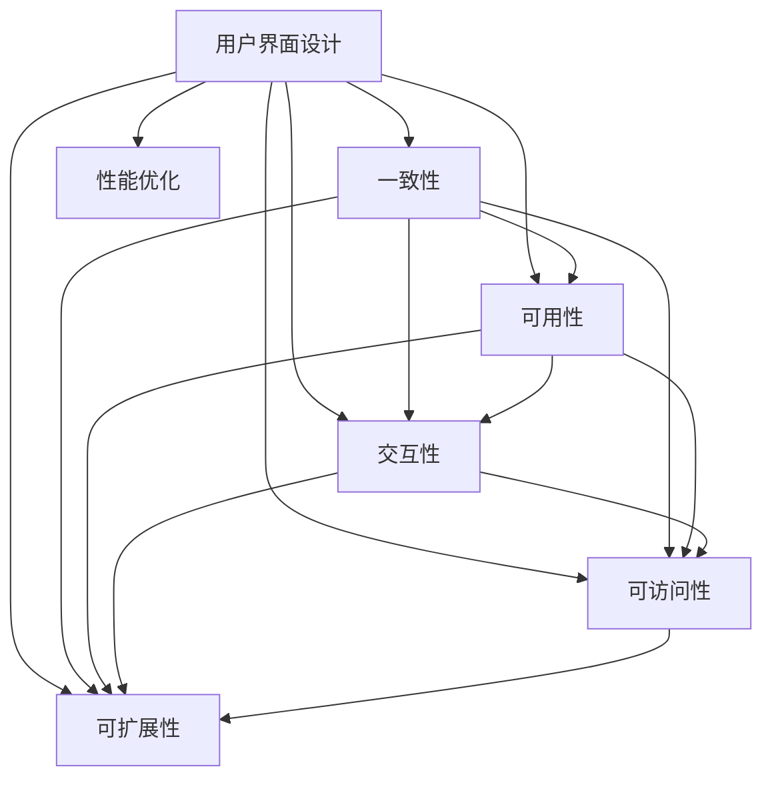

                 

## 1. 背景介绍

随着科技的快速发展，用户界面（User Interface，UI）设计已成为人们日常生活中不可或缺的一部分。无论是在手机应用、网站、还是桌面软件等各类电子设备中，良好的UI设计都能提高用户的体验感，并显著提升产品的竞争力和用户粘性。

### 1.1 问题由来
随着移动设备和互联网应用的普及，用户界面设计的重要性日益凸显。但一些产品的UI设计并不尽如人意，存在交互复杂、界面混乱、操作繁琐等问题。这些问题不仅影响用户的体验，甚至会导致用户流失。因此，如何设计出直观、易用、高效的用户界面，成为了众多设计师和开发者亟需解决的问题。

### 1.2 问题核心关键点
优秀的用户界面设计需要考虑以下几个关键点：
- **一致性**：用户界面应与品牌的视觉风格和用户期望保持一致。
- **可用性**：界面应符合用户的操作习惯，易于理解和使用。
- **交互性**：界面应提供丰富的交互方式，以提高用户的操作效率和体验。
- **可访问性**：界面应考虑到不同用户的需求，包括视障人士、老年用户等。
- **可扩展性**：界面设计应能够适应未来的业务变化和技术更新。
- **性能优化**：界面应尽可能优化资源使用，保证流畅的用户体验。

本文将从核心概念与联系、核心算法原理与操作步骤、数学模型与详细讲解、项目实践与代码实现、实际应用场景、工具与资源推荐、未来发展趋势与挑战、常见问题与解答等多个方面深入探讨UI设计的重要问题，并结合具体实例进行分析。

## 2. 核心概念与联系

### 2.1 核心概念概述

为了更好地理解用户界面设计，我们先介绍几个核心概念：

- **用户界面（UI）**：是指用户与产品互动的界面部分，包括视觉、交互、反馈等元素。
- **用户界面设计（UI Design）**：是指通过合理布局和设计，提升产品的可操作性、可用性和美观性。
- **用户体验（UX）**：是指用户在使用产品时产生的情感、心理和行为反应，包括易用性、效率、满意度等。
- **一致性**：指产品在视觉、交互、功能等方面保持一致性，使用户更容易理解和操作。
- **可用性**：指用户能够轻松、高效地完成操作，减少误解和错误。
- **交互性**：指界面提供多样化的交互方式，增强用户的操作体验。
- **可访问性**：指界面设计考虑到不同用户的需求，使产品对所有人友好。
- **可扩展性**：指界面设计应适应未来的业务和技术变化，避免频繁更改。
- **性能优化**：指通过合理的技术手段，提升界面的响应速度和稳定性。

这些概念之间的联系可以通过以下Mermaid流程图来展示：



这个流程图展示了用户界面设计的各个核心概念及其之间的联系：

1. **用户界面设计**是整个体系的基础，包含了视觉、交互、可用性等多个方面。
2. **一致性**是用户界面设计的核心，所有元素都应保持一致性。
3. **可用性**和**交互性**是提升用户操作效率的关键。
4. **可访问性**和**可扩展性**保障了产品对所有用户的友好性。
5. **性能优化**则保证了用户界面的流畅和稳定。

## 3. 核心算法原理 & 具体操作步骤

### 3.1 算法原理概述

用户界面设计的算法原理主要基于人机交互学的基本原则，通过合理布局、交互设计、视觉设计等手段，提升用户的交互体验。核心算法包括：

- **布局算法**：通过合理分布界面元素，确保用户可以轻松找到所需功能。
- **交互设计算法**：通过设计易于理解的交互流程，减少用户的操作误差。
- **视觉设计算法**：通过颜色、字体、图标等视觉元素，增强界面的可读性和美观性。

### 3.2 算法步骤详解

用户界面设计的具体步骤如下：

**Step 1: 确定设计目标**
- 明确产品的功能需求和用户群体。
- 定义产品的核心价值和使用场景。
- 制定界面设计的标准和规范。

**Step 2: 用户研究**
- 进行用户调查、访谈和数据分析，了解用户需求和行为。
- 通过竞品分析，找出同类产品的优缺点。
- 制定用户画像，明确目标用户群体的特征和行为模式。

**Step 3: 原型设计**
- 根据用户研究结果，设计初步的界面原型。
- 使用线框图、交互原型工具（如Sketch、Figma等）进行视觉和交互设计。
- 根据用户反馈，不断迭代和优化原型设计。

**Step 4: 视觉设计**
- 选择适合的颜色方案、字体和图标风格。
- 设计界面元素的视觉风格，确保整体一致性。
- 进行图标设计、按钮样式等细节处理。

**Step 5: 交互设计**
- 设计用户的操作流程和交互方式，如表单填写、导航、搜索等。
- 设计反馈机制，如加载动画、错误提示等。
- 进行用户测试，收集反馈并优化交互设计。

**Step 6: 界面实现**
- 使用前端框架（如React、Vue等）实现界面设计。
- 进行代码优化，提升界面的性能和响应速度。
- 进行测试，确保界面的稳定性和兼容性。

**Step 7: 迭代优化**
- 根据用户反馈和使用数据，进行持续的优化和改进。
- 更新界面设计，适应业务和技术的变化。
- 持续收集用户反馈，不断提升产品体验。

### 3.3 算法优缺点

用户界面设计算法具有以下优点：
- **提升用户体验**：通过合理布局和设计，减少用户的操作难度，提升用户满意度。
- **优化操作效率**：通过设计直观的交互方式，使用户能够快速完成操作，减少误解和错误。
- **增强美观性**：通过合理的视觉设计，提升界面的美观性和品牌一致性。

但同时也存在一些缺点：
- **成本高**：需要大量的用户研究、原型设计和测试，成本较高。
- **周期长**：设计过程涉及多个环节，周期较长。
- **技术复杂**：需要具备一定的设计和技术能力，入门门槛较高。

### 3.4 算法应用领域

用户界面设计在多个领域中都有广泛应用，包括：

- **移动应用**：如微信、支付宝等，提供良好的移动用户体验。
- **网站设计**：如京东、亚马逊等，提升网站的用户粘性和转化率。
- **桌面软件**：如Adobe Creative Suite、Visual Studio等，提升操作效率和用户体验。
- **物联网设备**：如智能音箱、智能家居等，提升用户与设备的交互体验。
- **游戏设计**：如《王者荣耀》《绝地求生》等，提升游戏的操作流畅性和美观性。

## 4. 数学模型和公式 & 详细讲解

### 4.1 数学模型构建

用户界面设计的数学模型主要集中在用户体验（UX）和可用性（Usability）的计算上。其中，可用性可以通过一系列指标来量化，包括任务完成时间、错误率、用户满意度等。

我们定义用户完成任务的时间为 $T$，错误率为 $E$，用户满意度为 $S$，则可用性 $U$ 可以表示为：

$$ U = \frac{1}{1/T + E + 1/S} $$

其中 $T$ 越短，$E$ 越低，$S$ 越高，可用性 $U$ 越好。

### 4.2 公式推导过程

以任务完成时间为例，推导可用性的计算公式。假设有 $n$ 个用户完成同一任务，完成时间分别为 $T_1, T_2, ..., T_n$，则平均完成时间 $T$ 可以表示为：

$$ T = \frac{T_1 + T_2 + ... + T_n}{n} $$

用户完成任务的效率与完成时间 $T$ 成反比，即效率 $E$ 为：

$$ E = \frac{1}{T} $$

用户满意度 $S$ 通常采用5分制或10分制打分，即 $S = \frac{5}{10}$。

将 $T$、$E$、$S$ 代入可用性公式，得到：

$$ U = \frac{1}{1/T + E + 1/S} $$

这个公式展示了用户界面设计对可用性的影响，通过优化界面设计，可以显著提升用户体验和可用性。

### 4.3 案例分析与讲解

以《王者荣耀》为例，分析其用户界面设计。《王者荣耀》采用直观的UI设计，简洁的布局和易用的交互方式，使得用户可以轻松完成游戏操作。具体措施包括：

1. **布局设计**：界面元素简洁明了，所有操作都在屏幕内可见，用户能够快速找到所需功能。
2. **交互设计**：通过触摸和滑动操作，提升了用户的操作效率，减少了误操作。
3. **视觉设计**：采用明亮的色调和清晰的字体，提升了界面的可读性。
4. **性能优化**：游戏运行流畅，界面元素加载迅速，提升了用户的体验感。

这些设计措施使得《王者荣耀》成为一款深受用户喜爱的游戏，其UI设计也成为行业内外的典范。

## 5. 项目实践：代码实例和详细解释说明

### 5.1 开发环境搭建

用户界面设计的开发环境搭建主要包括以下步骤：

1. **选择开发工具**：如Sketch、Figma、Adobe XD等。
2. **安装开发工具**：从官网下载安装文件，并安装到本地计算机。
3. **配置开发环境**：安装必要的插件和扩展，设置开发模式。

### 5.2 源代码详细实现

以下是一个简单的界面设计代码示例，用于创建一个基本的界面原型：

```python
import tkinter as tk

class MyUI(tk.Tk):
    def __init__(self):
        super().__init__()
        self.title("My UI")
        self.geometry("400x300")

        self.create_widgets()

    def create_widgets(self):
        self.label = tk.Label(self, text="Hello, UI!")
        self.label.pack()

        self.button = tk.Button(self, text="Click Me!")
        self.button.pack()

if __name__ == "__main__":
    ui = MyUI()
    ui.mainloop()
```

这段代码创建了一个基本的窗口，包含一个标签和一个按钮。通过修改代码，可以实现更多复杂的交互和布局。

### 5.3 代码解读与分析

这段代码的核心在于创建窗口和布局元素。具体步骤如下：

1. **创建窗口**：通过 `tk.Tk()` 创建了一个基本的窗口对象。
2. **设置窗口标题和大小**：通过 `self.title()` 和 `self.geometry()` 设置了窗口的标题和大小。
3. **创建标签**：通过 `tk.Label()` 创建了一个标签对象，并设置了文本。
4. **创建按钮**：通过 `tk.Button()` 创建了一个按钮对象，并设置了文本。
5. **布局元素**：通过 `self.label.pack()` 和 `self.button.pack()` 将标签和按钮添加到窗口中。
6. **主循环**：通过 `ui.mainloop()` 启动了窗口的主循环，使其保持运行状态。

通过这个简单的示例，可以看出使用 tkinter 进行界面设计的基本流程。进一步修改和扩展，可以创建更加复杂和丰富的界面原型。

### 5.4 运行结果展示

运行这段代码后，将会展示一个包含标签和按钮的窗口。用户可以通过点击按钮进行操作，这展示了基本的界面交互。

## 6. 实际应用场景

### 6.1 移动应用

移动应用的用户界面设计直接关系到用户的体验感和使用效率。例如，微信的设计简洁直观，用户可以轻松完成消息发送、朋友圈浏览、微信支付等操作。

### 6.2 网站设计

网站的设计需要考虑用户的操作习惯和浏览器的兼容性。例如，京东的购物网站采用了易用的交互设计，用户可以快速浏览商品、进行下单操作，同时具备良好的视觉设计和性能优化。

### 6.3 桌面软件

桌面软件的界面设计需要考虑多任务处理和操作效率。例如，Visual Studio 提供丰富的工具和插件，通过合理布局和交互设计，提升了开发效率。

### 6.4 物联网设备

物联网设备的界面设计需要考虑用户对设备的交互方式。例如，智能音箱通过语音识别和自然语言处理技术，提升了用户的交互体验。

### 6.5 游戏设计

游戏界面设计需要考虑操作的流畅性和视觉的美观性。例如，《王者荣耀》通过合理的布局和交互设计，提升了用户的操作效率和游戏体验。

## 7. 工具和资源推荐

### 7.1 学习资源推荐

- **《UI设计基础》课程**：推荐学习UI设计的基础知识和技能。
- **《用户体验设计》书籍**：深入理解用户体验设计的理论和方法。
- **《交互设计模式》书籍**：了解交互设计的基本模式和最佳实践。
- **《Sketch官方文档》**：Sketch的官方文档，提供了详细的教程和资源。
- **《Figma社区》**：Figma的社区，包含大量的设计资源和案例分析。

### 7.2 开发工具推荐

- **Sketch**：功能强大的原型设计工具，支持高保真设计。
- **Figma**：云端协作的原型设计工具，支持实时修改和反馈。
- **Adobe XD**：专业的UI/UX设计工具，支持跨平台设计。
- **Adobe Photoshop**：强大的图像处理工具，用于视觉设计。
- **Adobe Illustrator**：专业的矢量图形设计工具，用于图标设计。

### 7.3 相关论文推荐

- **《界面设计：理论与实践》**：系统介绍了用户界面设计的理论和方法。
- **《交互设计：模式与工具》**：介绍了交互设计的基本模式和工具。
- **《用户体验设计：实践与案例》**：提供了用户体验设计的实际案例和最佳实践。

## 8. 总结：未来发展趋势与挑战

### 8.1 研究成果总结

本文详细介绍了用户界面设计的基本概念、核心算法和具体操作步骤。通过合理布局、交互设计和视觉设计，提升了产品的用户体验和可用性。

### 8.2 未来发展趋势

未来用户界面设计将呈现以下趋势：

- **个性化设计**：根据用户行为和偏好，提供个性化的界面设计。
- **虚拟现实和增强现实**：通过VR和AR技术，提升界面的交互性和沉浸感。
- **物联网和智能设备**：设计适合物联网设备的交互方式，提升设备的易用性和用户体验。
- **自然语言处理**：通过自然语言处理技术，提升界面设计的智能性和交互性。

### 8.3 面临的挑战

尽管用户界面设计取得了许多进展，但未来仍面临以下挑战：

- **技术更新迅速**：需要持续学习和更新设计技能，跟上技术的快速发展。
- **用户需求多样**：需要设计适合不同用户群体的界面，满足多样化的需求。
- **设计复杂度高**：需要设计复杂的交互流程，提升用户的操作效率。
- **数据隐私问题**：需要设计隐私保护机制，保护用户的数据安全和隐私。

### 8.4 研究展望

未来的用户界面设计需要更多关注以下方向：

- **人机协同设计**：结合人工智能技术，设计更加智能和自适应的界面。
- **多模态交互设计**：设计适合多模态交互的界面，提升用户体验。
- **可扩展和可复用设计**：设计可扩展和可复用的界面元素，提升设计效率和灵活性。
- **可访问性设计**：设计更符合残障用户需求的界面，提升产品的普适性。

## 9. 附录：常见问题与解答

**Q1: 用户界面设计的目的是什么？**

A: 用户界面设计的目的是通过合理布局、交互设计和视觉设计，提升产品的用户体验和可用性，让用户能够轻松、高效地使用产品，并从中获得愉悦的体验。

**Q2: 用户界面设计包括哪些方面？**

A: 用户界面设计主要包括布局设计、交互设计、视觉设计等。其中，布局设计决定了用户如何组织和使用界面元素；交互设计决定了用户如何与产品进行交互；视觉设计决定了界面元素的视觉风格和美观性。

**Q3: 用户界面设计的流程是什么？**

A: 用户界面设计的流程包括确定设计目标、用户研究、原型设计、视觉设计、交互设计、界面实现、迭代优化等步骤。通过不断迭代和优化，最终实现良好的用户界面设计。

**Q4: 用户界面设计的挑战是什么？**

A: 用户界面设计的挑战包括技术更新迅速、用户需求多样、设计复杂度高、数据隐私问题等。设计师需要不断学习和更新设计技能，设计适合不同用户群体的界面，并考虑隐私保护等问题。

**Q5: 用户界面设计的未来趋势是什么？**

A: 用户界面设计的未来趋势包括个性化设计、虚拟现实和增强现实、物联网和智能设备、自然语言处理等。通过结合这些前沿技术，用户界面设计将更加智能、自适应和沉浸式，提升用户的使用体验。

---

作者：禅与计算机程序设计艺术 / Zen and the Art of Computer Programming

