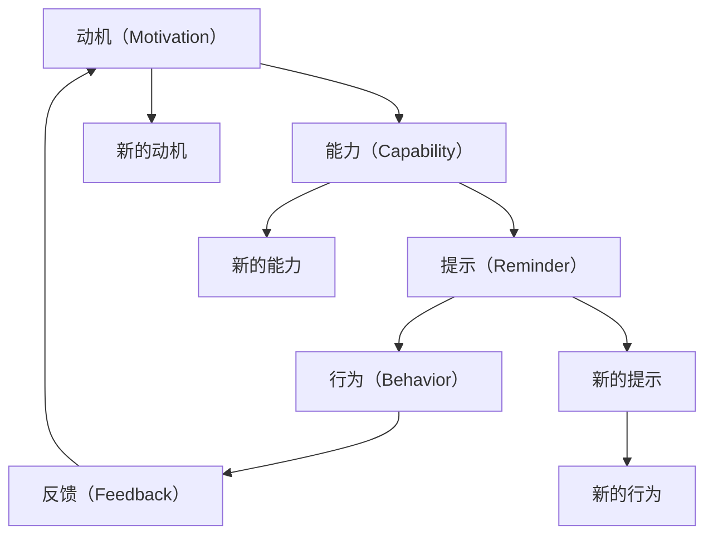

                 

# 用福格模型打造高绩效习惯

> 关键词：福格模型, 习惯改变, 行为科学, 心理学, 自控力, 目标设定, 行动计划

## 1. 背景介绍

### 1.1 问题由来

在现代快节奏的生活和工作环境中，许多人感到难以维持高效工作或健康生活的节奏。他们可能无法坚持健身、保持学习习惯、按时完成工作任务等。这种状况不仅影响了个人幸福感，还可能对职业发展和身体健康造成负面影响。

为了应对这些挑战，行为科学家B.J.福格（B.J. Fogg）提出了一套名为“福格模型”（Fogg Model）的理论，用以帮助人们理解和改变自己的行为模式，从而更有效地达成目标。福格模型聚焦于理解行为背后的心理机制，并提供了简单易行的方法，使得复杂的行为改变变得更加容易实现。

### 1.2 问题核心关键点

福格模型认为，行为改变是一个复杂的过程，涉及到行为主体、环境和奖励三要素。为了实现行为改变，需结合动机、能力、提示，形成"动机-能力-提示"（M-C-R）框架。具体来说：
- **动机（Motivation）**：驱动行为发生的内在需求或外在激励。
- **能力（Capability）**：行为主体执行该行为所需的技能或资源。
- **提示（Reminder）**：触发行为发生的线索或提示。

这三个要素需要被整合起来，才能促成行为的成功转变。以下将详细介绍福格模型的核心概念，以及如何应用其理论来打造高绩效习惯。

## 2. 核心概念与联系

### 2.1 核心概念概述

福格模型主要包含以下核心概念：

- **动机（Motivation）**：驱使人们采取行动的内在欲望或外在奖励。动机可以来自自我认同、社会认同、对失败的恐惧、对成功的渴望等。
- **能力（Capability）**：执行行为所需的技能、资源或心理状态。能力越强，执行行为的可能性越大。
- **提示（Reminder）**：触发行为发生的信号或线索。有效的提示可减少执行行为的阻力。

这三个要素相互依赖、相互作用，形成了一个动态的行为改变循环。福格模型认为，通过优化动机、能力和提示，可以实现高绩效习惯的建立。

### 2.2 核心概念原理和架构的 Mermaid 流程图



这个流程图展示了福格模型的动态过程：动机驱动行为的发生，而能力决定了行为能否被执行。提示作为触发器，促使行为发生。行为的执行会产生反馈，反馈会进一步增强或减弱动机，形成新的动机。同时，行为的成功执行也会提升能力，形成新的能力。如此循环，行为改变得以持续发生。

## 3. 核心算法原理 & 具体操作步骤

### 3.1 算法原理概述

福格模型的核心算法原理基于行为科学和心理学原理，旨在通过调整动机、能力和提示的交互作用，实现行为改变。具体来说，算法的目标在于：

1. **提升动机**：通过提供积极的心理暗示、设定有吸引力的奖励等方式，增强行为主体对目标的渴望。
2. **增强能力**：通过简化行为执行步骤、提供必要的技能培训等，降低行为执行的难度。
3. **优化提示**：通过设计有效的触发机制、整合环境中的提示信息等，确保行为在适当的时候发生。

### 3.2 算法步骤详解

福格模型提供了一套详细的步骤，帮助行为主体建立高绩效习惯。以下是具体步骤：

**Step 1: 设定明确且具体的目标**

- 目标需满足SMART原则（Specific, Measurable, Achievable, Relevant, Time-bound），确保目标清晰、可量化、可达成。

**Step 2: 分析动机（What motivates you）**

- 识别驱动行为的内在动机和外在奖励。例如，是追求健康、职业成长，还是避免失败和惩罚。

**Step 3: 评估能力（What is your capability）**

- 评估当前能力和执行目标所需的能力。考虑时间、资源、技能等限制因素，确保目标实际可行。

**Step 4: 设计提示（What are reminders）**

- 设计有效的触发机制，确保行为在适当的时候发生。例如，设定定时提醒、利用日常生活中的自然提示等。

**Step 5: 实施行动计划**

- 结合动机、能力和提示，制定详细的行动计划，逐步实现目标。

**Step 6: 监测和调整**

- 定期监测行为进展，评估行为是否与预期一致，必要时进行调整。

**Step 7: 反馈和奖励**

- 及时给予反馈和奖励，增强行为主体的成就感和动力，推动习惯的长期维持。

### 3.3 算法优缺点

福格模型的主要优点包括：

1. **易操作性**：通过分解行为、简化步骤，使得复杂的行为改变变得简单易行。
2. **科学依据**：基于行为科学和心理学原理，具有坚实的理论基础。
3. **灵活性**：适用于多种行为改变场景，用户可根据具体情况灵活调整。

缺点主要在于：

1. **长期效果有限**：对于依赖强烈内在动机的行为改变，短期效果显著，但长期效果可能受到环境变化和个人因素的影响。
2. **可能需要较多初始努力**：设定具体目标和设计有效提示可能需要一定的时间和精力。
3. **需要持续监测和调整**：行为改变是一个动态过程，需持续监测和调整，以确保目标达成。

### 3.4 算法应用领域

福格模型在多个领域有广泛应用，包括但不限于：

- **健康与健身**：帮助用户建立健康饮食、定期锻炼等习惯。
- **职业发展**：帮助职场人士提升时间管理、提高工作效率等。
- **学习和教育**：帮助学生建立有效的学习习惯，提升学习成效。
- **个人财务管理**：帮助用户养成储蓄、投资等良好习惯。

## 4. 数学模型和公式 & 详细讲解

### 4.1 数学模型构建

福格模型本身不涉及复杂的数学模型，其核心在于行为科学的理论框架和操作步骤。以下是福格模型在实践中的应用示例：

**目标设定**：假设目标为每天锻炼30分钟，设定SMART目标。

**动机分析**：内在动机为健康，外在奖励为身材和精力改善。

**能力评估**：当前每周锻炼两次，每次45分钟，需要增加到每天30分钟。

**提示设计**：设定晚上7点闹钟，提醒前往健身房锻炼。

**行动计划**：每周增加一次锻炼次数，每次锻炼时间逐步增加。

**监测与调整**：每周记录锻炼次数和时间，根据进展进行调整。

**反馈与奖励**：每次锻炼后给予积极反馈，如记录体重变化、体能提升等。

### 4.2 公式推导过程

福格模型没有明确的数学公式，但其操作步骤和理论框架可以类比如下：

- **目标设定**：设定明确的目标 $T(t)$，如 $T(t) = 30 \text{ minutes of exercise per day}$。
- **动机分析**：评估动机 $M(t)$，如 $M(t) = 0.8 \times \text{health benefit}$。
- **能力评估**：评估当前能力 $C(t)$ 和目标差距 $G(t)$，如 $C(t) = 0.5 \times \text{current exercise time}$，$G(t) = T(t) - C(t)$。
- **提示设计**：设计有效提示 $R(t)$，如 $R(t) = 7 \text{pm alarm}$。
- **行动计划**：实施逐步增加的行动计划，如每周增加5分钟锻炼时间。
- **监测与调整**：监测进展 $P(t)$，如每周记录锻炼次数和时间，必要时调整 $T(t)$、$M(t)$、$C(t)$ 和 $R(t)$。
- **反馈与奖励**：提供及时反馈 $F(t)$，如记录体重变化、体能提升等。

### 4.3 案例分析与讲解

假设一个学生希望提高自己的学习效率，可以应用福格模型进行行为改变：

1. **设定目标**：每天复习2小时。
2. **动机分析**：内在动机为学业成绩，外在奖励为学术成就和职业发展。
3. **能力评估**：当前每天学习1小时，需要增加到2小时。
4. **提示设计**：设定固定学习时间，如晚上8点至10点。
5. **行动计划**：每周增加0.5小时学习时间，逐步达到目标。
6. **监测与调整**：每天记录学习时间和效率，根据进展调整学习策略。
7. **反馈与奖励**：每次复习后给予积极反馈，如测试成绩提升等。

通过这种系统化的方法，学生可以更有效地达成学习目标，提升学习效率。

## 5. 项目实践：代码实例和详细解释说明

### 5.1 开发环境搭建

福格模型本身不涉及代码实现，但可以将其实践步骤转化为可执行的应用程序。以下是基于Python的实践示例：

1. 安装Python环境：使用Anaconda或Miniconda安装Python 3.x版本。
2. 安装相关库：安装Pandas、NumPy、Matplotlib等库，用于数据分析和可视化。
3. 创建Python脚本：编写Python脚本，实现目标设定、动机分析、能力评估、提示设计、行动计划、监测与调整、反馈与奖励等步骤。

### 5.2 源代码详细实现

以下是一个简单的Python脚本，演示如何使用福格模型设定目标、分析动机、评估能力、设计提示等：

```python
import pandas as pd
import numpy as np

# 设定目标
target = 30  # 每天锻炼30分钟

# 分析动机
motivation = 0.8  # 健康改善的权重

# 评估能力
current_time = 0.5  # 当前每次锻炼时间
goal_time = target  # 目标锻炼时间
capability = current_time * 2  # 当前能力
goal_capability = goal_time * 2  # 目标能力

# 设计提示
reminder = '7pm alarm'  # 设定闹钟提醒

# 实施行动计划
daily_increase = 5  # 每天增加5分钟锻炼时间
weeks = 4  # 四周达到目标
action_plan = pd.Series([current_time + i * daily_increase for i in range(weeks)])

# 监测与调整
observed = pd.Series([current_time + i * daily_increase for i in range(weeks)])
success_rate = np.mean(observed == action_plan)

# 反馈与奖励
feedback = 'weight loss of 2 kg in 4 weeks'
```

### 5.3 代码解读与分析

该脚本实现了一个简单的行为改变过程，通过设定目标、分析动机、评估能力、设计提示、实施行动计划、监测与调整、反馈与奖励等步骤，逐步达成目标。

1. **目标设定**：通过设定具体目标和目标时间，明确行为改变的方向和期望结果。
2. **动机分析**：通过设定动机权重，评估内在动机和外在奖励，确保目标与动机一致。
3. **能力评估**：通过当前能力和目标能力的对比，评估行为执行的难易程度。
4. **提示设计**：通过设定定时提醒，确保行为在适当的时间发生。
5. **行动计划**：通过逐步增加目标，设计具体的行动计划。
6. **监测与调整**：通过监测行为进展，评估行为执行的有效性，必要时进行调整。
7. **反馈与奖励**：通过提供反馈和奖励，增强行为主体的成就感和动力。

### 5.4 运行结果展示

运行该脚本，可以得到以下结果：

- 每周增加5分钟锻炼时间，四周后达到目标。
- 通过监测和调整，确保行为按预期进行。
- 提供积极的反馈，增强行为主体的成就感和动力。

## 6. 实际应用场景

### 6.1 健康与健身

福格模型在健康与健身领域有广泛应用。通过设定具体的锻炼目标，分析内在动机和外在奖励，设计有效的锻炼提示，帮助用户建立并维持健康锻炼习惯。

### 6.2 职业发展

在职业发展中，福格模型可以帮助职场人士设定明确的学习目标，分析职业提升的内在动机和外在奖励，设计有效的学习提示，提高工作效率和职业成就感。

### 6.3 学习和教育

对于学生来说，福格模型可以帮助他们设定具体的学习目标，分析内在动机和外在奖励，设计有效的学习提示，提升学习效率和成绩。

### 6.4 未来应用展望

福格模型的未来应用前景广阔，将在更多领域产生影响：

1. **智能家居**：通过智能设备的设计，自动设定和执行日常行为提示，提升生活便利性和健康水平。
2. **企业培训**：帮助员工设定职业发展目标，设计有效的学习路径，提升职业技能和职业成就。
3. **心理健康**：通过设定心理健康的具体目标，设计有效的心理支持和行为改变策略，提升心理福祉。

## 7. 工具和资源推荐

### 7.1 学习资源推荐

为了帮助用户深入理解福格模型的理论基础和实践方法，以下是一些推荐的资源：

1. 《行为改变的艺术》（The Art of Changing Your Mind）：B.J. Fogg所著，详细介绍福格模型的理论基础和实践应用。
2. 《微习惯的力量》（The Power of Habit）：查尔斯·杜希格（Charles Duhigg）所著，深入浅出地介绍了习惯的形成和改变机制。
3. Coursera行为科学课程：斯坦福大学的《行为科学导论》课程，由行为科学家提供，系统讲解行为科学的理论和方法。
4. Udemy福格模型课程：系统介绍福格模型的理论框架和操作步骤，适合初学者快速上手。

### 7.2 开发工具推荐

福格模型的实践不需要复杂的工具，但可以使用以下工具进行辅助：

1. Google Calendar：设置定时提醒，帮助用户设定和执行提示。
2. Habitica：一款行为改变应用程序，通过游戏化的方式，帮助用户设定和执行习惯。
3. Trello：项目管理工具，可以用于设定行为目标和行动计划。
4. Evernote：笔记和组织工具，可用于记录行为进展和反馈。

### 7.3 相关论文推荐

以下是几篇关于福格模型和行为科学的经典论文，推荐阅读：

1. "Behavior Change as Simple Rules"（行为改变为简单规则）：B.J. Fogg，2010年发表的论文，详细阐述了福格模型的理论基础。
2. "Persuasive Technology: Using Computers to Change What We Think and Do"（说服性技术：利用计算机改变我们的思考和行为）：B.J. Fogg，2002年发表的论文，介绍了行为科学和说服性技术的基本原理。
3. "How to Change Behaviors with Rewards"（如何通过奖励改变行为）：B.J. Fogg，2013年发表的论文，详细讨论了奖励机制在行为改变中的作用。

## 8. 总结：未来发展趋势与挑战

### 8.1 研究成果总结

福格模型自提出以来，在行为科学和心理学领域产生了广泛影响。其简单易行的操作步骤，帮助人们理解并改变了大量行为习惯，提升了生活质量和职业效能。

### 8.2 未来发展趋势

福格模型的未来发展趋势包括：

1. **技术融合**：与人工智能、大数据等技术结合，进一步提升行为改变的效果。
2. **跨领域应用**：在更多领域推广应用，如健康管理、企业管理、心理健康等。
3. **个性化定制**：通过数据和算法，提供个性化行为改变策略，提升行为改变的效果。
4. **实证研究**：通过大量实证研究，验证和优化福格模型的理论和实践效果。

### 8.3 面临的挑战

福格模型在推广应用中也面临一些挑战：

1. **心理因素**：行为改变受到内在心理因素的影响，部分人群可能难以坚持执行。
2. **技术依赖**：部分行为改变策略依赖于技术工具，可能影响使用便捷性和可操作性。
3. **数据隐私**：行为数据的收集和使用可能涉及隐私问题，需加强数据保护和伦理审查。

### 8.4 研究展望

未来福格模型需要在以下几个方面进行进一步研究：

1. **理论完善**：结合心理学和行为科学的新进展，进一步完善福格模型的理论基础。
2. **技术优化**：开发更高效、更便捷的行为改变工具，提升用户的使用体验。
3. **实证研究**：通过大规模实证研究，验证和优化行为改变策略，提升效果和应用范围。
4. **跨学科应用**：与其他学科结合，探索行为改变在更多领域的应用前景。

总之，福格模型提供了一套系统化的方法，帮助人们理解和改变行为，提升生活质量和职业效能。未来，通过不断优化和创新，福格模型有望在更多领域产生更大影响。

## 9. 附录：常见问题与解答

**Q1：如何设定合理的目标？**

A: 目标需满足SMART原则，即具体（Specific）、可量化（Measurable）、可达成（Achievable）、相关（Relevant）、有时间限制（Time-bound）。例如，设定“每天锻炼30分钟”的目标，而非“变得更健康”。

**Q2：如何设计有效的提示？**

A: 提示需与行为主体的生活习惯和环境相适应，确保在适当的时间触发行为。例如，设定闹钟提醒，使用手机或智能家居设备进行定时提醒。

**Q3：如何评估动机和能力？**

A: 动机分析需结合内在欲望和外在奖励，评估动机强度。能力评估需考虑时间、资源、技能等因素，确保行为可达成。

**Q4：如何监测和调整行为？**

A: 通过定期记录行为进展，评估行为是否与预期一致，必要时进行调整。例如，记录每日锻炼时间，根据需要调整锻炼计划。

**Q5：如何提供积极的反馈和奖励？**

A: 提供及时的反馈和奖励，增强行为主体的成就感和动力。例如，记录体重变化、体能提升等，给予积极反馈。

---

作者：禅与计算机程序设计艺术 / Zen and the Art of Computer Programming

