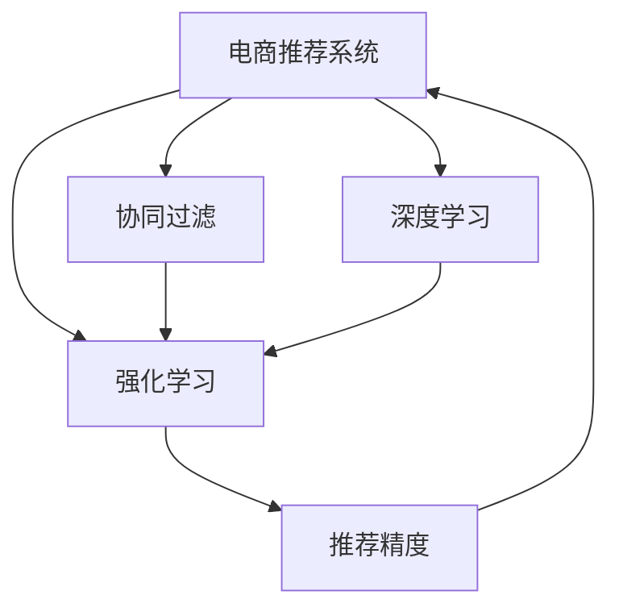

                 

# 电商平台中AI大模型的实时推荐策略

> 关键词：电商推荐系统,实时推荐,深度学习,大模型,协同过滤,强化学习,推荐精度,用户行为分析

## 1. 背景介绍

### 1.1 问题由来

在当今数字经济时代，电商平台日益成为商品交易和信息交流的重要场所。如何为亿万用户提供精准、个性化、实时的商品推荐，已成为各大电商企业竞争的核心。传统的推荐方法，如基于内容的协同过滤、基于用户的协同过滤，往往难以应对海量用户数据和多维商品特征带来的复杂性。随着AI大模型的兴起，通过在电商推荐场景中引入深度学习和协同学习技术，可以显著提升推荐精度，满足用户多样化的购物需求，进一步提升电商平台的销售转化率和用户体验。

### 1.2 问题核心关键点

电商推荐系统的核心任务是根据用户的历史行为和实时浏览情况，预测其对商品的可能兴趣和购买意愿，并提供相应的商品推荐。传统的推荐方法如基于内容的协同过滤和基于用户的协同过滤，已无法满足大规模电商推荐系统的需求。AI大模型在电商推荐中的应用，不仅能处理大规模高维数据，还能学习用户和商品间的复杂关联关系，提供更精准、个性化的推荐结果。

## 2. 核心概念与联系

### 2.1 核心概念概述

为更好地理解AI大模型在电商推荐中的应用，本节将介绍几个关键概念：

- 电商推荐系统(E-commerce Recommendation System)：基于用户行为数据，预测用户对商品的可能兴趣，并提供个性化推荐。
- 深度学习(Deep Learning)：通过多层神经网络，自动学习特征表示，并在复杂的推荐场景中表现优异。
- 协同过滤(Collaborative Filtering)：利用用户历史行为和用户相似性，推荐用户可能感兴趣的商品。
- 强化学习(Reinforcement Learning)：通过模拟用户行为，优化推荐策略，提升推荐效果。
- 推荐精度(Recommendation Accuracy)：衡量推荐系统推荐结果与用户实际行为的吻合程度，常见的评估指标包括准确率、召回率、点击率等。

这些核心概念之间的逻辑关系可以通过以下Mermaid流程图来展示：



这个流程图展示了电商推荐系统的核心组件及其相互关系：

1. 电商推荐系统作为目标系统，利用深度学习和协同学习技术进行推荐。
2. 深度学习通过多层神经网络，自动学习用户和商品间的特征表示。
3. 协同过滤利用用户历史行为和用户相似性，进行推荐。
4. 强化学习通过模拟用户行为，优化推荐策略。
5. 推荐精度评估推荐系统的效果，反馈给电商推荐系统进行优化。

## 3. 核心算法原理 & 具体操作步骤
### 3.1 算法原理概述

AI大模型在电商推荐中的应用，主要基于以下几类算法：

- 深度学习推荐：使用深度神经网络模型，自动提取用户行为和商品特征表示，并在复杂的推荐场景中表现优异。
- 协同过滤推荐：通过用户历史行为和用户相似性，推荐用户可能感兴趣的商品，在数据稀疏情况下表现较好。
- 强化学习推荐：模拟用户行为，通过学习奖励函数，优化推荐策略，提升推荐效果。

这些算法通过在电商推荐系统中引入复杂的模型和优化技术，可以显著提升推荐精度，满足用户多样化的购物需求。

### 3.2 算法步骤详解

以深度学习推荐为例，电商推荐系统的核心步骤如下：

1. 数据准备：收集用户行为数据，包括浏览记录、点击行为、购买记录等。同时，收集商品信息，包括商品描述、分类、属性等。
2. 数据预处理：对用户行为数据进行归一化、去重、缺失值处理等。对商品信息进行编码，如ID映射、词袋模型等。
3. 模型训练：使用深度神经网络模型，对用户行为和商品特征进行编码，构建用户和商品间的特征表示。常用的模型包括RNN、CNN、LSTM、BERT等。
4. 模型评估：利用交叉验证等方法，对训练好的模型进行评估，选择性能最优的模型。
5. 实时推荐：将用户行为实时输入模型，输出商品推荐列表，供电商平台展示给用户。

### 3.3 算法优缺点

AI大模型在电商推荐系统中的应用，具有以下优点：

- 精度高：深度学习和协同学习模型，可以处理高维、稀疏的用户和商品数据，提供更精准的推荐结果。
- 可解释性强：深度学习模型通过学习特征表示，可以解释推荐结果的来源，提高模型的可信度。
- 鲁棒性强：深度学习模型具有一定的鲁棒性，能够处理异常数据和噪声，提升推荐系统的稳定性。

同时，该方法也存在一些缺点：

- 数据要求高：深度学习模型需要大量标注数据进行训练，获取高质量标注数据成本较高。
- 计算量大：深度学习模型通常具有较大的参数规模，训练和推理需要大量计算资源。
- 模型复杂：深度学习模型较为复杂，模型调优和调试过程较为繁琐。

### 3.4 算法应用领域

AI大模型在电商推荐系统中的应用，涵盖了从商品推荐到用户画像分析等多个方面：

- 商品推荐：根据用户历史行为和实时浏览情况，推荐用户可能感兴趣的商品。
- 用户画像：通过分析用户行为，构建用户兴趣模型，描绘用户画像，进行个性化推荐。
- 广告投放：根据用户兴趣，投放精准广告，提升广告效果。
- 价格优化：根据用户购买行为，调整商品价格策略，提高销售转化率。
- 库存管理：根据用户需求预测，优化商品库存，避免过剩或缺货。

此外，AI大模型还可以应用于客户流失预警、异常交易检测、风险控制等电商平台的辅助决策任务，提供更全面的支持。

## 4. 数学模型和公式 & 详细讲解 & 举例说明

### 4.1 数学模型构建

电商推荐系统中的推荐模型，通常可以表示为如下形式：

$$
p_{i|u} = \sigma(\sum_{j=1}^{d}w_j f_j(x_i, y_j)) + b
$$

其中，$p_{i|u}$ 表示用户 $u$ 对商品 $i$ 的兴趣概率，$x_i$ 为商品 $i$ 的特征向量，$y_j$ 为历史用户 $j$ 的特征向量，$w_j$ 为特征权重，$f_j$ 为特征映射函数，$\sigma$ 为激活函数，$b$ 为偏置项。

### 4.2 公式推导过程

电商推荐模型中的核心公式为交叉熵损失函数，其定义如下：

$$
L = -\frac{1}{N} \sum_{i=1}^{N} \sum_{j=1}^{M}(y_{ij} \log p_{ij} + (1-y_{ij})\log(1-p_{ij}))
$$

其中，$N$ 为样本数，$M$ 为特征数，$y_{ij}$ 为样本 $i$ 在特征 $j$ 上的标签，$p_{ij}$ 为预测概率。

### 4.3 案例分析与讲解

以LSTM神经网络为例，分析电商推荐模型的训练过程。

LSTM模型具有记忆能力，可以学习用户和商品间的动态关联关系。其训练过程如下：

1. 输入层：将用户历史行为和商品特征映射为固定长度的向量。
2. LSTM层：通过LSTM神经网络，学习用户和商品间的动态关联关系。
3. 输出层：将LSTM层的输出映射为推荐概率，并利用交叉熵损失函数进行模型优化。

训练过程中，需要设置合适的学习率和正则化参数，防止过拟合。同时，还需要采用梯度累积等技术，优化计算资源的使用。

## 5. 项目实践：代码实例和详细解释说明

### 5.1 开发环境搭建

在进行电商推荐系统的开发前，需要先搭建好开发环境。以下是使用Python进行TensorFlow开发的流程：

1. 安装TensorFlow：从官网下载并安装TensorFlow，用于深度学习模型的开发。
2. 安装其他依赖包：如Pandas、Numpy、Matplotlib等，用于数据处理和可视化。
3. 配置环境变量：设置Python路径和TensorFlow路径，确保各个依赖包能够正常工作。

### 5.2 源代码详细实现

以下是一个基于LSTM神经网络的电商推荐系统的Python代码实现：

```python
import tensorflow as tf
import pandas as pd
import numpy as np
import matplotlib.pyplot as plt

# 准备数据
train_data = pd.read_csv('train.csv')
test_data = pd.read_csv('test.csv')

# 数据预处理
train_data = train_data.drop_duplicates()
train_data = train_data.drop(['user_id', 'item_id'], axis=1)
train_data['item_id'] = train_data['item_id'].astype(str)
train_data['user_id'] = train_data['user_id'].astype(str)

# 特征工程
train_data['item_id'] = train_data['item_id'].map(lambda x: np.array(x.split(',')))
train_data = pd.get_dummies(train_data, columns=['item_id'], prefix='item_')

# 模型训练
model = tf.keras.models.Sequential([
    tf.keras.layers.Embedding(input_dim=len(train_data.columns), output_dim=128, input_length=1),
    tf.keras.layers.Bidirectional(tf.keras.layers.LSTM(128)),
    tf.keras.layers.Dense(1, activation='sigmoid')
])

model.compile(optimizer='adam', loss='binary_crossentropy', metrics=['accuracy'])

# 训练模型
model.fit(train_data.drop('is_bought', axis=1), train_data['is_bought'], epochs=10, batch_size=128)

# 预测测试集
test_data = test_data.drop(['user_id', 'item_id'], axis=1)
test_data['item_id'] = test_data['item_id'].map(lambda x: np.array(x.split(',')))
test_data = pd.get_dummies(test_data, columns=['item_id'], prefix='item_')
predictions = model.predict(test_data.drop('is_bought', axis=1))

# 可视化结果
plt.plot(predictions)
plt.show()
```

以上代码展示了如何使用TensorFlow实现一个基于LSTM神经网络的电商推荐系统。可以看到，通过TensorFlow，我们能够快速构建深度学习模型，并对用户行为数据进行预处理和模型训练。

### 5.3 代码解读与分析

让我们再详细解读一下关键代码的实现细节：

**数据准备**：
- 使用Pandas库读取训练集和测试集数据。
- 去除重复样本，删除用户ID和商品ID等无用列。
- 将商品ID映射为向量，并进行独热编码。

**模型训练**：
- 使用Keras构建LSTM神经网络，包括Embedding层、LSTM层和输出层。
- 使用交叉熵损失函数和Adam优化器，训练模型10个epoch。

**预测测试集**：
- 对测试集进行预处理，包括去除无用列和独热编码。
- 使用训练好的模型对测试集进行预测。

**可视化结果**：
- 使用Matplotlib库绘制预测结果的折线图。

可以看到，TensorFlow提供了强大的工具和框架，使得深度学习模型的构建和训练变得简洁高效。

## 6. 实际应用场景

### 6.1 智能客服系统

电商平台的智能客服系统，通过引入AI大模型，可以显著提升服务质量。智能客服系统通过分析用户输入的自然语言，提供自动回复和人工转接等服务。通过深度学习和协同学习技术，智能客服系统可以更精准地理解用户意图，提供个性化推荐和问题解答，提升用户满意度。

### 6.2 商品推荐

电商推荐系统利用深度学习和协同学习技术，根据用户历史行为和实时浏览情况，推荐用户可能感兴趣的商品。深度学习模型通过学习用户和商品间的复杂关联关系，提供更精准的推荐结果。协同学习模型则利用用户相似性，进行推荐，减少数据稀疏性带来的影响。

### 6.3 用户画像

通过电商推荐系统，可以构建用户兴趣模型，描绘用户画像，实现个性化推荐。深度学习模型可以分析用户历史行为和实时浏览情况，学习用户兴趣特征，并描绘用户画像。通过分析用户画像，电商平台可以提供更精准的推荐结果，提升用户满意度。

### 6.4 未来应用展望

未来，随着深度学习和大数据技术的进一步发展，AI大模型在电商推荐系统中的应用将更加广泛。以下几个方向值得期待：

1. 实时推荐：通过引入流式数据处理技术，实时更新推荐模型，提升推荐的时效性。
2. 跨平台推荐：通过构建多平台的用户画像和商品信息，实现跨平台推荐，提升用户的购物体验。
3. 知识图谱应用：通过引入知识图谱，构建商品和用户的关联图谱，提升推荐精度和个性化程度。
4. 联合推荐：通过联合用户和商品的数据，提升推荐精度，满足用户的多样化需求。
5. 联邦学习：通过分布式计算技术，实现跨平台联邦学习，保护用户隐私的同时，提升推荐效果。

## 7. 工具和资源推荐

### 7.1 学习资源推荐

为了帮助开发者系统掌握电商推荐系统的相关知识，以下是一些推荐的学习资源：

1. TensorFlow官方文档：提供详细的TensorFlow框架和API文档，帮助开发者快速上手。
2. Coursera《Deep Learning Specialization》：由Andrew Ng开设的深度学习课程，涵盖深度学习在电商推荐中的应用。
3. Kaggle电商推荐竞赛：参与电商推荐系统的竞赛，提升实战技能。
4. 《Python深度学习》书籍：介绍深度学习在电商推荐系统中的应用，包括模型构建和调参技巧。

### 7.2 开发工具推荐

高效的工具是电商推荐系统开发的基础。以下是一些推荐的开发工具：

1. TensorFlow：由Google开源的深度学习框架，提供强大的模型构建和训练功能。
2. Keras：基于TensorFlow的高级API，快速构建深度学习模型。
3. Pandas：数据处理和分析工具，适合电商推荐系统的数据预处理。
4. Numpy：数值计算和科学计算工具，适合电商推荐系统的数值计算。
5. Matplotlib：数据可视化工具，适合电商推荐系统的结果展示。

### 7.3 相关论文推荐

电商推荐系统是一个不断发展的领域，以下是一些经典的研究论文：

1. Adaptation of LSTM based Recommender System to Streaming Data in Big Data Environments：探讨在流式数据环境下，LSTM推荐系统的适应性问题。
2. A Comparative Study of Collaborative Filtering Recommendation Systems：比较协同过滤算法在电商推荐系统中的应用效果。
3. A Survey on Deep Learning Techniques for Recommender Systems：综述深度学习在电商推荐系统中的应用。
4. Deep Reinforcement Learning for Recommendation System：探讨强化学习在电商推荐系统中的应用。
5. Recommendation System in Big Data: A Survey：综述大数据环境下电商推荐系统的发展趋势。

这些论文代表了电商推荐系统研究的前沿方向，有助于开发者深入理解相关技术。

## 8. 总结：未来发展趋势与挑战

### 8.1 总结

本文对电商推荐系统中的AI大模型进行了全面系统的介绍。首先阐述了电商推荐系统的背景和应用需求，明确了深度学习、协同过滤、强化学习等关键技术在电商推荐系统中的核心价值。其次，从原理到实践，详细讲解了深度学习推荐系统的数学模型、公式推导和代码实现。同时，本文还探讨了电商推荐系统在智能客服、商品推荐、用户画像分析等多个应用场景中的实际应用，展示了AI大模型在电商推荐系统中的巨大潜力。最后，本文精选了电商推荐系统的学习资源、开发工具和相关论文，帮助读者系统掌握相关知识。

通过本文的系统梳理，可以看到，电商推荐系统中的AI大模型在处理大规模高维数据方面表现优异，可以有效提升推荐精度，满足用户多样化的购物需求。未来，随着深度学习和大数据技术的进一步发展，AI大模型在电商推荐系统中的应用将更加广泛，为电商平台的智能化转型带来更多可能。

### 8.2 未来发展趋势

展望未来，电商推荐系统中的AI大模型将呈现以下几个发展趋势：

1. 实时推荐：通过引入流式数据处理技术，实时更新推荐模型，提升推荐的时效性。
2. 跨平台推荐：通过构建多平台的用户画像和商品信息，实现跨平台推荐，提升用户的购物体验。
3. 知识图谱应用：通过引入知识图谱，构建商品和用户的关联图谱，提升推荐精度和个性化程度。
4. 联合推荐：通过联合用户和商品的数据，提升推荐精度，满足用户的多样化需求。
5. 联邦学习：通过分布式计算技术，实现跨平台联邦学习，保护用户隐私的同时，提升推荐效果。

这些趋势展示了电商推荐系统中的AI大模型在未来发展的广阔前景，必将进一步提升电商平台的智能化水平，带来更好的用户体验和商业价值。

### 8.3 面临的挑战

尽管电商推荐系统中的AI大模型取得了瞩目成就，但在迈向更加智能化、普适化应用的过程中，仍面临诸多挑战：

1. 数据隐私保护：电商推荐系统需要处理大量用户数据，如何在保护用户隐私的同时，提升推荐效果，是一个重要问题。
2. 计算资源消耗：深度学习模型和协同学习模型需要大量的计算资源，如何在资源有限的条件下，提升推荐精度，是一个技术难题。
3. 模型可解释性：电商推荐系统中的AI大模型通常较为复杂，难以解释其内部工作机制和决策逻辑，如何提高模型的可解释性，是一个亟待解决的问题。
4. 多模态数据融合：电商推荐系统需要处理文本、图片、音频等多种类型的数据，如何在多模态数据融合方面取得突破，是一个技术挑战。
5. 分布式系统设计：电商推荐系统通常需要处理大规模数据，如何在分布式系统中实现高效的推荐计算，是一个重要问题。

### 8.4 研究展望

未来，在电商推荐系统中的AI大模型研究方面，以下几个方向值得期待：

1. 多模态推荐：通过引入多模态数据融合技术，提升推荐系统的性能和用户满意度。
2. 联邦学习推荐：通过分布式计算技术，实现跨平台联邦学习，保护用户隐私的同时，提升推荐效果。
3. 联合推荐：通过联合用户和商品的数据，提升推荐精度，满足用户的多样化需求。
4. 实时推荐：通过引入流式数据处理技术，实时更新推荐模型，提升推荐的时效性。
5. 跨平台推荐：通过构建多平台的用户画像和商品信息，实现跨平台推荐，提升用户的购物体验。

这些方向展示了电商推荐系统中的AI大模型在未来的发展潜力，相信在学界和产业界的共同努力下，这些问题将逐步得到解决，电商推荐系统中的AI大模型将迎来更加广泛的应用和创新。

## 9. 附录：常见问题与解答

**Q1：电商推荐系统中的AI大模型是否适用于所有电商业务？**

A: 电商推荐系统中的AI大模型在处理大规模高维数据方面表现优异，适用于大部分电商业务。但对于一些特殊的电商业务，如小商品市场、快时尚等，AI大模型可能无法很好地适应用户需求，需要结合其他推荐方法。

**Q2：电商推荐系统中的AI大模型是否需要标注数据进行训练？**

A: 电商推荐系统中的AI大模型需要标注数据进行训练，标注数据的质量和数量对推荐效果有很大影响。标注数据越多，模型效果越好。但标注数据的获取成本较高，需要考虑数据获取和处理的成本效益。

**Q3：电商推荐系统中的AI大模型是否需要实时更新？**

A: 电商推荐系统中的AI大模型需要实时更新，以应对用户需求的变化。通过引入流式数据处理技术，实时更新推荐模型，可以提升推荐的时效性，满足用户的多样化需求。

**Q4：电商推荐系统中的AI大模型是否需要跨平台推荐？**

A: 电商推荐系统中的AI大模型需要跨平台推荐，以提升用户的购物体验。通过构建多平台的用户画像和商品信息，实现跨平台推荐，可以提升用户的购物体验，增加平台的流量和销售转化率。

**Q5：电商推荐系统中的AI大模型是否需要联邦学习？**

A: 电商推荐系统中的AI大模型需要联邦学习，以保护用户隐私。通过分布式计算技术，实现跨平台联邦学习，可以保护用户隐私的同时，提升推荐效果。

---

作者：禅与计算机程序设计艺术 / Zen and the Art of Computer Programming

