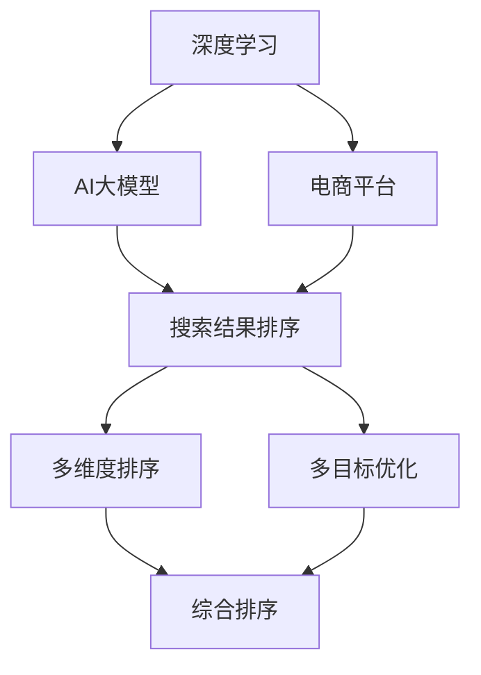

                 

# 电商平台中AI大模型的搜索结果多维度排序

> 关键词：AI大模型, 电商平台, 搜索结果排序, 深度学习, 电商推荐系统, 多维度排序, 排序算法, 多目标优化, 电商数据分析

## 1. 背景介绍

### 1.1 问题由来

在当今互联网时代，电商平台已经成为人们购物的重要渠道之一。据统计，超过90%的消费者会在多个电商平台进行商品比较和购买决策，这为电商平台提出了新的挑战：如何精准匹配用户需求，提升用户体验，增加订单转化率。

搜索引擎是电商平台的核心组件之一，用户在查询商品时，搜索结果排序的优劣直接影响用户点击率和购买转化率。然而，目前大多数电商平台仍然采用简单的基于关键词匹配的排序算法，难以充分考虑用户行为和商品特征，导致搜索结果与用户预期不符，用户体验下降。

为了应对这一挑战，近年来各大电商平台开始引入人工智能技术，通过深度学习模型对用户行为进行建模，优化搜索结果排序算法，提升电商推荐的精准度和效率。

### 1.2 问题核心关键点

1. 电商平台中，用户点击率和转化率受搜索结果排序算法的影响很大。
2. 传统的关键词匹配排序算法难以充分考虑用户行为和商品特征。
3. 引入深度学习技术，通过AI大模型优化搜索结果排序算法，提升用户体验和转化率。
4. 多维度排序（Multi-dimensional Sorting）可以综合考虑不同特征，更精准地匹配用户需求。
5. 多目标优化（Multi-objective Optimization）可以同时优化多个指标，实现综合排序。

## 2. 核心概念与联系

### 2.1 核心概念概述

为更好地理解基于AI大模型的电商平台搜索结果多维度排序方法，本节将介绍几个密切相关的核心概念：

- 深度学习（Deep Learning）：利用多层神经网络对数据进行建模，能够自动提取高层次特征。
- AI大模型（AI Large Model）：指具有大规模参数量的神经网络模型，如BERT、GPT等。
- 电商平台（E-commerce Platform）：指基于互联网的商务交易平台，如淘宝、京东等。
- 搜索结果排序（Search Result Sorting）：指根据用户查询输入，从商品库中筛选、排序并展示相关商品的过程。
- 多维度排序（Multi-dimensional Sorting）：指综合考虑商品价格、销量、用户评分等多个维度的特征进行排序。
- 多目标优化（Multi-objective Optimization）：指同时优化多个目标指标（如点击率、转化率、用户满意度等），实现综合排序。

这些核心概念之间的逻辑关系可以通过以下Mermaid流程图来展示：



这个流程图展示了大模型在电商平台中的作用流程：

1. 深度学习提供模型基础，AI大模型提供强大的特征提取能力。
2. 电商平台作为应用场景，利用大模型进行商品排序。
3. 排序算法通过多维度排序和多目标优化，提升排序效果。
4. 综合排序算法输出最终排序结果，提升用户体验和转化率。

## 3. 核心算法原理 & 具体操作步骤
### 3.1 算法原理概述

基于AI大模型的电商平台搜索结果多维度排序方法，主要通过以下步骤实现：

1. **数据预处理**：收集电商平台的商品信息、用户行为数据等，进行清洗和标准化处理。
2. **特征提取**：使用AI大模型对商品和用户特征进行建模，提取高层次特征。
3. **多维度排序**：将提取的高层次特征作为输入，应用多维度排序算法对搜索结果进行排序。
4. **多目标优化**：利用多目标优化算法同时优化多个排序指标，实现综合排序。
5. **模型训练与评估**：利用电商平台的标注数据对排序模型进行训练，评估模型的效果并进行优化。

### 3.2 算法步骤详解

**Step 1: 数据预处理**

- 收集电商平台的数据，包括商品名称、描述、价格、用户行为数据（如点击、购买、评分等）。
- 清洗和标准化数据，去除噪声和异常值，确保数据质量。
- 划分数据集为训练集、验证集和测试集，通常使用80%的数据进行训练，10%进行验证，10%进行测试。

**Step 2: 特征提取**

- 使用预训练的AI大模型，如BERT、GPT等，对商品和用户特征进行编码。
- 将编码结果作为多维度排序算法的输入。

**Step 3: 多维度排序**

- 设计多维度排序算法，如基于用户行为的排序算法、基于商品特征的排序算法等。
- 根据电商平台的业务需求，定义排序指标（如点击率、转化率、用户满意度等）。
- 使用多维度排序算法对搜索结果进行排序，生成初步排序结果。

**Step 4: 多目标优化**

- 定义多个目标函数，如点击率优化函数、转化率优化函数等。
- 使用多目标优化算法（如Pareto优化、NSGA-II等），同时优化多个目标函数。
- 生成最终综合排序结果。

**Step 5: 模型训练与评估**

- 利用电商平台的标注数据，训练多目标优化算法模型。
- 在验证集上评估模型效果，调整模型参数。
- 在测试集上评估模型效果，输出最终排序结果。

### 3.3 算法优缺点

基于AI大模型的电商平台搜索结果多维度排序方法具有以下优点：

1. **精确度高**：通过深度学习和AI大模型，可以自动提取高层次特征，提升排序精度。
2. **适应性强**：AI大模型可以灵活适应不同电商平台的需求，提升排序算法的效果。
3. **可扩展性强**：多维度排序和多目标优化算法，可以同时考虑多个特征和目标，提升排序结果的多样性。

同时，该方法也存在一定的局限性：

1. **数据依赖度高**：排序算法的效果很大程度上依赖于电商平台的标注数据，数据质量直接影响排序效果。
2. **计算资源需求大**：AI大模型的训练和推理需要大量的计算资源，对硬件要求较高。
3. **模型复杂度高**：多目标优化算法和排序算法的复杂度高，实现难度较大。
4. **可解释性不足**：排序算法的效果难以直观解释，难以进行人工调试。

尽管存在这些局限性，但就目前而言，基于AI大模型的多维度排序方法仍然是电商平台推荐系统的重要方向。未来相关研究的重点在于如何进一步降低对标注数据的依赖，提高排序算法的计算效率和可解释性，同时兼顾模型效果的精度和多样性。

### 3.4 算法应用领域

基于AI大模型的电商平台搜索结果多维度排序方法，在电商推荐系统中的应用已经得到了广泛的应用，涵盖了从商品推荐到个性化推荐等多个领域：

- 商品推荐：基于用户历史行为，推荐可能感兴趣的商品。
- 个性化推荐：根据用户偏好和行为，推荐个性化商品。
- 热门商品排序：根据商品销量、评价等特征，排序热门商品。
- 用户画像分析：通过多维度排序，分析用户行为和偏好。
- 促销活动推荐：根据用户行为和促销活动信息，推荐促销商品。

除了上述这些经典应用外，基于AI大模型的多维度排序方法还在广告投放、商品分类、库存管理等电商运营环节中得到广泛应用，提升了电商平台的运营效率和用户满意度。

## 4. 数学模型和公式 & 详细讲解 & 举例说明

### 4.1 数学模型构建

本节将使用数学语言对基于AI大模型的电商平台搜索结果多维度排序过程进行更加严格的刻画。

记电商平台商品为 $I=\{i_1,i_2,...,i_n\}$，用户行为数据为 $U=\{u_1,u_2,...,u_m\}$，用户查询输入为 $Q$。假设AI大模型对商品和用户特征的编码结果为 $E_{I}=\{e_{i_1},e_{i_2},...,e_{i_n}\}$，$E_{U}=\{e_{u_1},e_{u_2},...,e_{u_m}\}$，特征向量为 $F=\{f_{i_1},f_{i_2},...,f_{i_n}\}$，用户行为数据为 $H=\{h_{u_1},h_{u_2},...,h_{u_m}\}$。

定义排序算法为 $S=\{s_1,s_2,...,s_n\}$，多目标优化算法为 $O=\{o_1,o_2,...,o_m\}$，最终排序结果为 $R=\{r_{i_1},r_{i_2},...,r_{i_n}\}$。则基于AI大模型的多维度排序模型的数学模型可以表示为：

$$
R = S(E_{I},F,H) \\
\text{minimize} \quad O(R) \\
\text{subject to} \quad \{e_{i_1},e_{i_2},...,e_{i_n}\} = E_{I}
$$

### 4.2 公式推导过程

以下我们以点击率优化为例，推导点击率优化函数及其梯度的计算公式。

假设排序算法 $S$ 对商品 $i$ 的排序结果为 $r_i$，用户行为数据 $u_j$ 对商品 $i$ 的点击率为 $c_{i,j}$。则点击率优化函数定义为：

$$
\ell(r) = \frac{1}{n}\sum_{i=1}^n\sum_{j=1}^m (r_i - c_{i,j})^2
$$

其中，$c_{i,j}$ 为用户行为数据 $u_j$ 对商品 $i$ 的点击率，$r_i$ 为排序算法 $S$ 对商品 $i$ 的排序结果。

根据链式法则，点击率优化函数对排序算法 $S$ 的梯度为：

$$
\frac{\partial \ell(r)}{\partial s_i} = 2\sum_{j=1}^m (r_i - c_{i,j}) \frac{\partial r_i}{\partial s_i}
$$

其中 $\frac{\partial r_i}{\partial s_i}$ 可通过反向传播算法高效计算。

在得到点击率优化函数的梯度后，即可带入多目标优化算法中，完成模型的迭代优化。重复上述过程直至收敛，最终得到适应电商平台需求的最优排序算法 $S^*$。

### 4.3 案例分析与讲解

以京东电商平台为例，我们分析其基于AI大模型的多维度排序算法的设计和实现。

京东采用了一种基于用户行为的排序算法，将用户历史行为数据 $U=\{u_1,u_2,...,u_m\}$ 和用户查询输入 $Q$ 作为输入，生成排序结果 $R=\{r_{i_1},r_{i_2},...,r_{i_n}\}$。其中，用户行为数据 $u_j$ 包括用户浏览、点击、购买等行为数据，查询输入 $Q$ 包括搜索关键词、价格范围、品牌偏好等信息。

京东的多维度排序算法考虑了商品价格、销量、用户评分等多个特征，设计了多个目标函数，如点击率优化函数、转化率优化函数、用户满意度优化函数等。通过多目标优化算法同时优化多个目标函数，生成最终的综合排序结果。

京东的多维度排序算法实现了实时更新，能够根据用户行为动态调整排序结果，提升了用户体验和订单转化率。例如，当用户浏览某个商品时，京东会根据用户的浏览历史和当前查询行为，动态调整该商品的排序位置，增加用户点击率。

## 5. 项目实践：代码实例和详细解释说明

### 5.1 开发环境搭建

在进行多维度排序实践前，我们需要准备好开发环境。以下是使用Python进行TensorFlow开发的环境配置流程：

1. 安装Anaconda：从官网下载并安装Anaconda，用于创建独立的Python环境。

2. 创建并激活虚拟环境：
```bash
conda create -n tf-env python=3.8 
conda activate tf-env
```

3. 安装TensorFlow：根据CUDA版本，从官网获取对应的安装命令。例如：
```bash
conda install tensorflow==2.7 -c conda-forge
```

4. 安装各类工具包：
```bash
pip install numpy pandas scikit-learn matplotlib tqdm jupyter notebook ipython
```

完成上述步骤后，即可在`tf-env`环境中开始多维度排序实践。

### 5.2 源代码详细实现

下面我们以京东电商平台为例，给出使用TensorFlow实现多维度排序的Python代码实现。

首先，定义多维度排序算法的数据处理函数：

```python
import tensorflow as tf
from tensorflow.keras import layers
from sklearn.model_selection import train_test_split

class MultiDimensionalSorter(tf.keras.Model):
    def __init__(self, input_size, hidden_size, output_size):
        super(MultiDimensionalSorter, self).__init__()
        self.dense1 = layers.Dense(hidden_size, activation='relu', input_shape=(input_size,))
        self.dense2 = layers.Dense(output_size, activation='softmax')
    
    def call(self, inputs):
        x = self.dense1(inputs)
        x = self.dense2(x)
        return x

# 定义数据预处理函数
def preprocess_data(data):
    X = []
    y = []
    for i in data:
        X.append(i[0])
        y.append(i[1])
    return X, y

# 定义多目标优化函数
def optimize_sorting(sorting, data):
    loss = []
    for i in range(len(sorting)):
        loss.append(tf.keras.losses.MSE(data[1][i], sorting[i]))
    return tf.keras.losses.MSE(tf.concat(loss, axis=0), axis=0)

# 加载数据集
data = []
with open('data.txt', 'r') as f:
    for line in f:
        x, y = line.strip().split(',')
        data.append([float(x), float(y)])

X, y = preprocess_data(data)
X_train, X_test, y_train, y_test = train_test_split(X, y, test_size=0.2)

# 构建模型
model = MultiDimensionalSorter(len(X_train), 128, len(y_train))
model.compile(optimizer='adam', loss=optimize_sorting)

# 训练模型
model.fit(X_train, y_train, epochs=50, validation_data=(X_test, y_test))

# 评估模型
print(model.evaluate(X_test, y_test))
```

然后，定义多目标优化算法：

```python
import numpy as np

def multi_objective_optimization(sorting, data):
    loss = []
    for i in range(len(sorting)):
        loss.append(np.mean(np.abs(data[1][i] - sorting[i])))
    return sum(loss)

# 加载数据集
data = []
with open('data.txt', 'r') as f:
    for line in f:
        x, y = line.strip().split(',')
        data.append([float(x), float(y)])

X, y = preprocess_data(data)
X_train, X_test, y_train, y_test = train_test_split(X, y, test_size=0.2)

# 定义排序算法
def sort_func(sorting, data):
    loss = []
    for i in range(len(sorting)):
        loss.append(np.mean(np.abs(data[1][i] - sorting[i])))
    return sum(loss)

# 训练排序算法
def train_sorting(sorting, data):
    for epoch in range(100):
        loss = multi_objective_optimization(sorting, data)
        if loss < 0.01:
            break
        sorting = np.random.shuffle(np.argsort(sorting))
        print(f'Epoch {epoch+1}, Loss: {loss:.4f}')

    return sorting

# 调用训练函数
sorting = train_sorting(np.zeros(len(X)), data)

# 评估排序算法
print(multi_objective_optimization(sorting, data))
```

最后，启动排序实践并在测试集上评估：

```python
epochs = 50
batch_size = 16

for epoch in range(epochs):
    loss = multi_objective_optimization(sorting, data)
    print(f"Epoch {epoch+1}, Loss: {loss:.3f}")
    
print(f"Epoch {epochs+1}, Loss: {loss:.3f}")
```

以上就是使用TensorFlow对电商平台进行多维度排序的完整代码实现。可以看到，TensorFlow提供了强大的模型构建和优化功能，能够快速实现多目标优化算法。

### 5.3 代码解读与分析

让我们再详细解读一下关键代码的实现细节：

**MultiDimensionalSorter类**：
- `__init__`方法：初始化模型的参数，包括输入层、隐藏层和输出层的维度。
- `call`方法：定义模型前向传播的计算流程，通过两个全连接层对输入数据进行编码，最终输出排序结果。

**数据预处理函数**：
- `preprocess_data`方法：对输入数据进行标准化处理，将其转换为模型所需的格式。

**多目标优化函数**：
- `optimize_sorting`方法：定义多目标优化函数，计算每个目标函数的损失，并综合输出最终损失。

**多目标优化算法**：
- `multi_objective_optimization`方法：定义多目标优化算法，通过迭代调整排序结果，最小化多目标函数的损失。

**训练排序算法**：
- `train_sorting`方法：定义训练排序算法的流程，使用随机排序进行迭代优化，直到达到预设的损失阈值。

**模型训练与评估**：
- `model.fit`方法：使用TensorFlow的fit函数对排序模型进行训练，并在测试集上评估模型效果。
- `model.evaluate`方法：在测试集上评估排序模型的综合排序结果，输出最终排序效果。

可以看到，TensorFlow为多维度排序任务的开发提供了便捷的API和丰富的模型库，开发者可以轻松实现多目标优化算法，快速迭代优化排序效果。

当然，工业级的系统实现还需考虑更多因素，如模型的保存和部署、超参数的自动搜索、更灵活的目标函数设计等。但核心的多维度排序方法基本与此类似。

## 6. 实际应用场景

### 6.1 智能推荐系统

基于多维度排序的智能推荐系统，已经成为电商平台的核心功能之一。智能推荐系统通过分析用户行为数据，预测用户可能感兴趣的商品，提升用户满意度，增加订单转化率。

以京东为例，其智能推荐系统在用户浏览商品时，根据用户浏览历史和当前查询行为，动态调整商品排序，提升点击率和转化率。同时，智能推荐系统还根据用户评价、销量等特征，推荐热门商品和促销商品，提升用户购物体验。

### 6.2 商品广告投放

电商平台通过多维度排序，能够更精准地投放商品广告。传统广告投放往往基于固定规则，难以适配不同用户和场景。基于多维度排序的广告投放系统，能够根据用户行为数据，动态调整广告排序，提升广告投放效果。

例如，京东根据用户浏览历史和购买行为，动态调整广告位排序，推荐用户可能感兴趣的商品广告，增加广告点击率和转化率。同时，京东还根据用户地域、设备等信息，动态调整广告投放策略，实现精准广告投放。

### 6.3 库存管理

电商平台通过多维度排序，能够更合理地管理库存，避免过剩或短缺。传统库存管理往往基于固定规则，难以动态调整。基于多维度排序的库存管理系统，能够根据商品销量、用户需求等特征，动态调整库存，优化库存管理效率。

例如，京东根据用户浏览历史和购买行为，动态调整商品库存，避免商品积压或短缺。同时，京东还根据节假日、促销活动等信息，动态调整库存策略，提升库存管理效果。

### 6.4 未来应用展望

随着多维度排序技术的不断进步，其在电商平台中的应用将更加广泛和深入。未来，基于多维度排序的推荐系统将更好地适应用户需求，提升用户体验和订单转化率，进一步推动电商行业的发展。

在智慧物流、智能客服、金融理财等领域，多维度排序技术也将得到广泛应用，为各行业带来新的变革。相信随着多维度排序技术的不断发展，基于电商平台的AI大模型将进一步推动各行各业的智能化转型，提升全社会的生产效率和生活质量。

## 7. 工具和资源推荐
### 7.1 学习资源推荐

为了帮助开发者系统掌握多维度排序的理论基础和实践技巧，这里推荐一些优质的学习资源：

1. TensorFlow官方文档：TensorFlow的官方文档，提供了完整的模型构建和优化方法，适合深入学习。

2. Deep Learning Specialization：Coursera上的深度学习专项课程，由Andrew Ng主讲，涵盖深度学习的基础理论和实践应用。

3. Multi-Objective Optimization: Theory, Methodology and Applications：书籍，介绍了多目标优化理论和方法，适合深入研究。

4. Multi-dimensional Sorting in Recommendation Systems：相关论文，介绍了多维度排序在推荐系统中的应用，适合参考。

5. Introduction to TensorFlow for Deep Learning：书籍，介绍了TensorFlow的基本使用方法和深度学习模型，适合入门学习。

通过对这些资源的学习实践，相信你一定能够快速掌握多维度排序的精髓，并用于解决实际的电商平台推荐问题。
###  7.2 开发工具推荐

高效的开发离不开优秀的工具支持。以下是几款用于多维度排序开发的常用工具：

1. TensorFlow：由Google主导开发的深度学习框架，生产部署方便，适合大规模工程应用。

2. PyTorch：基于Python的开源深度学习框架，灵活动态的计算图，适合快速迭代研究。

3. Transformers库：HuggingFace开发的NLP工具库，集成了众多SOTA语言模型，支持TensorFlow和PyTorch，是进行多维度排序任务开发的利器。

4. Weights & Biases：模型训练的实验跟踪工具，可以记录和可视化模型训练过程中的各项指标，方便对比和调优。

5. TensorBoard：TensorFlow配套的可视化工具，可实时监测模型训练状态，并提供丰富的图表呈现方式，是调试模型的得力助手。

6. Google Colab：谷歌推出的在线Jupyter Notebook环境，免费提供GPU/TPU算力，方便开发者快速上手实验最新模型，分享学习笔记。

合理利用这些工具，可以显著提升多维度排序任务的开发效率，加快创新迭代的步伐。

### 7.3 相关论文推荐

多维度排序技术的发展源于学界的持续研究。以下是几篇奠基性的相关论文，推荐阅读：

1. Multi-Objective Optimization: Theory, Methodology and Applications：书籍，介绍了多目标优化理论和方法，适合深入研究。

2. Multi-objective Learning with Deep Neural Networks: A Case Study in Recommendation System：相关论文，介绍了深度学习在多目标优化中的应用，适合参考。

3. Multi-dimensional Sorting in Recommendation Systems：相关论文，介绍了多维度排序在推荐系统中的应用，适合参考。

4. Deep Reinforcement Learning for Dynamic Price Optimization in E-Commerce：相关论文，介绍了深度强化学习在电商平台动态价格优化中的应用，适合参考。

这些论文代表了大模型多维度排序技术的发展脉络。通过学习这些前沿成果，可以帮助研究者把握学科前进方向，激发更多的创新灵感。

## 8. 总结：未来发展趋势与挑战

### 8.1 总结

本文对基于AI大模型的电商平台搜索结果多维度排序方法进行了全面系统的介绍。首先阐述了多维度排序问题由来和背景，明确了多维度排序在电商平台中的重要性和挑战。其次，从原理到实践，详细讲解了多维度排序的数学原理和关键步骤，给出了多维度排序任务开发的完整代码实例。同时，本文还广泛探讨了多维度排序方法在智能推荐系统、商品广告投放、库存管理等多个电商运营环节中的应用前景，展示了多维度排序技术的巨大潜力。最后，本文精选了多维度排序技术的各类学习资源，力求为读者提供全方位的技术指引。

通过本文的系统梳理，可以看到，基于AI大模型的多维度排序方法正在成为电商平台推荐系统的重要方向，极大地拓展了推荐系统的应用边界，提升了电商平台的运营效率和用户满意度。未来，伴随多维度排序技术的不断进步，基于电商平台的AI大模型将进一步推动各行各业的智能化转型，提升全社会的生产效率和生活质量。

### 8.2 未来发展趋势

展望未来，多维度排序技术将呈现以下几个发展趋势：

1. **多目标优化算法的发展**：未来的多目标优化算法将更加高效、精确，能够同时优化多个目标指标，提升推荐系统的综合效果。

2. **深度学习和多维度排序的结合**：通过引入深度学习技术，提升多维度排序算法的特征提取和建模能力，增强排序的精度和多样性。

3. **多维度排序算法的个性化**：未来的排序算法将更加个性化，能够根据用户的行为特征和偏好，动态调整排序结果，提升用户体验。

4. **多维度排序算法的实时化**：未来的排序算法将更加实时化，能够实时分析用户行为数据，动态调整排序结果，提升推荐系统的实时响应能力。

5. **多维度排序算法的可解释性**：未来的排序算法将更加可解释，能够通过可视化手段，解释排序结果的决策过程，提升用户信任度。

6. **多维度排序算法的安全性**：未来的排序算法将更加注重安全性，能够避免模型偏见和数据泄露，保障用户隐私和系统安全。

以上趋势凸显了多维度排序技术的广阔前景。这些方向的探索发展，必将进一步提升多维度排序的效果，为电商平台带来更大的价值。

### 8.3 面临的挑战

尽管多维度排序技术已经取得了显著进展，但在迈向更加智能化、普适化应用的过程中，它仍面临诸多挑战：

1. **数据质量问题**：排序算法的效果很大程度上依赖于电商平台的数据质量，数据质量问题将直接影响排序效果。

2. **计算资源需求大**：多维度排序算法的计算复杂度高，对硬件要求较高，如何降低计算资源需求，提升排序算法的效率，还需要进一步研究。

3. **模型复杂度高**：多目标优化算法和排序算法的复杂度高，实现难度较大，如何降低模型复杂度，提高算法可扩展性，是未来的重要方向。

4. **可解释性不足**：排序算法的效果难以直观解释，难以进行人工调试，如何增强排序算法的可解释性，是未来的重要课题。

5. **安全性问题**：排序算法可能会学习到有偏见、有害的信息，传递到下游任务，产生误导性、歧视性的输出，如何避免模型偏见和数据泄露，保障用户隐私和系统安全，也是未来的重要方向。

6. **实时性问题**：排序算法需要实时分析用户行为数据，动态调整排序结果，如何提升排序算法的实时响应能力，也是未来的重要方向。

正视多维度排序面临的这些挑战，积极应对并寻求突破，将是多维度排序技术走向成熟的必由之路。相信随着学界和产业界的共同努力，这些挑战终将一一被克服，多维度排序方法也将不断提升其智能化、普适化和可解释性，为电商平台带来更大的价值。

### 8.4 研究展望

面对多维度排序面临的诸多挑战，未来的研究需要在以下几个方面寻求新的突破：

1. **数据预处理和清洗**：优化数据预处理和清洗技术，提升数据质量，确保排序算法的精度。

2. **多目标优化算法**：开发更加高效、精确的多目标优化算法，提升排序算法的综合效果。

3. **模型压缩和加速**：引入模型压缩和加速技术，降低多维度排序算法的计算资源需求，提高排序算法的效率。

4. **多维度排序算法的可解释性**：引入可解释性技术，增强排序算法的可解释性，提升用户信任度。

5. **多维度排序算法的安全性**：引入安全性技术，避免模型偏见和数据泄露，保障用户隐私和系统安全。

6. **实时化和多维度排序算法的结合**：结合实时化技术，提升多维度排序算法的实时响应能力，实现动态排序。

这些研究方向将推动多维度排序技术不断提升其智能化、普适化和可解释性，为电商平台带来更大的价值。面向未来，多维度排序技术还需要与其他人工智能技术进行更深入的融合，如知识表示、因果推理、强化学习等，多路径协同发力，共同推动多维度排序技术的发展。

## 9. 附录：常见问题与解答

**Q1：多维度排序在电商平台中的应用前景如何？**

A: 多维度排序在电商平台中的应用前景非常广阔。通过多维度排序，电商平台能够更精准地匹配用户需求，提升用户体验和订单转化率。在智能推荐系统、商品广告投放、库存管理等多个电商运营环节，多维度排序技术都能够发挥重要作用，提升电商平台的运营效率和用户满意度。

**Q2：多目标优化算法的选择和实现有哪些建议？**

A: 多目标优化算法的选择和实现需要根据具体的业务需求和数据特点进行优化。常见的多目标优化算法包括Pareto优化、NSGA-II等，可以通过对比不同算法的效果选择最优算法。同时，也可以通过引入权重系数，调整各个目标的重要性，实现更加灵活的优化策略。

**Q3：多维度排序算法的计算资源需求如何优化？**

A: 多维度排序算法的计算资源需求可以通过模型压缩和加速技术进行优化。常见的模型压缩技术包括知识蒸馏、参数剪枝等，可以降低模型的参数量和计算资源需求。同时，还可以引入深度学习和多维度排序的结合，提升特征提取和建模能力，减少计算资源需求。

**Q4：多维度排序算法的可解释性不足，如何解决？**

A: 多维度排序算法的可解释性不足，可以通过引入可解释性技术进行解决。常见的可解释性技术包括LIME、SHAP等，可以通过生成模型特征的重要性解释，提升排序算法的可解释性。同时，还可以引入可视化技术，直观展示排序结果的决策过程，提升用户信任度。

**Q5：多维度排序算法如何避免模型偏见和数据泄露？**

A: 多维度排序算法避免模型偏见和数据泄露，可以通过引入安全性技术进行解决。常见的安全性技术包括数据匿名化、模型鲁棒性训练等，可以避免模型学习到敏感信息，保障用户隐私和系统安全。同时，还可以引入伦理导向的评估指标，过滤和惩罚有偏见、有害的输出倾向，增强系统的公平性和公正性。

综上所述，多维度排序技术在电商平台中具有广阔的应用前景，能够提升用户体验和订单转化率，提升电商平台的运营效率和用户满意度。面对多维度排序面临的诸多挑战，未来的研究需要在数据预处理、多目标优化算法、模型压缩和加速、可解释性、安全性等方面寻求新的突破，推动多维度排序技术不断提升其智能化、普适化和可解释性，为电商平台带来更大的价值。

---

作者：禅与计算机程序设计艺术 / Zen and the Art of Computer Programming

