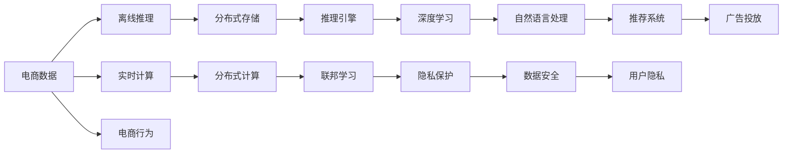

                 

# 电商平台中的AI大模型：从离线到实时

> 关键词：
- AI大模型
- 电商
- 离线推理
- 实时计算
- 分布式系统
- 深度学习
- 联邦学习

## 1. 背景介绍

### 1.1 问题由来

电商平台作为数字化时代的核心驱动力之一，其运营模式和用户体验正被AI技术不断革新。在商品推荐、广告投放、搜索排序等核心环节，AI大模型以其强大的数据处理能力和自然语言理解能力，为电商平台带来了革命性的变化。然而，在实际部署中，这些大模型往往需要长时间离线推理，无法实时响应，且对资源消耗巨大，部署成本高昂。

如何在大模型应用的电商场景中，实现从离线到实时的跨越，是当下AI与电商领域共同关注的重点问题。本文将围绕这一主题，从AI大模型的原理、应用以及未来发展方向进行深入探讨。

### 1.2 问题核心关键点
实现AI大模型在电商平台的实时应用，主要依赖以下几个关键点：
- 分布式计算与存储：构建高效的分布式系统，实现海量数据的并行处理与存储。
- 模型压缩与优化：压缩模型参数与计算图，减少资源消耗与延迟。
- 推理引擎与优化：开发高效的推理引擎与优化技术，提升模型响应速度与准确度。
- 联邦学习与隐私保护：在保护用户隐私的前提下，实现跨机构数据协作与模型共享。
- 实时系统架构：搭建实时数据处理与反馈系统，保证电商平台的高效运行。

## 2. 核心概念与联系

### 2.1 核心概念概述

为了更好地理解AI大模型在电商平台中的实时应用，本节将介绍几个密切相关的核心概念：

- **AI大模型（Large AI Models）**：如GPT-3、BERT等，以深度学习模型为代表，通过在大量数据上预训练，学习到丰富的知识表示，具备强大的自然语言理解、生成和推理能力。

- **离线推理（Offline Inference）**：指在预训练和微调完成后，将模型保存为静态文件，通过批量计算方式进行推理。这种方式适用于对实时性要求不高的场景，但资源消耗大，响应速度慢。

- **实时计算（Real-time Computation）**：指模型能够对实时数据进行快速响应，支持动态更新与迭代计算。实时计算适用于需要即时反馈的电商场景，如实时推荐、广告投放等。

- **分布式系统（Distributed Systems）**：由多个计算节点组成的网络，通过并行处理提高计算效率，支持海量数据的存储与处理。常见架构包括MapReduce、Spark等。

- **推理引擎（Inference Engine）**：用于优化模型推理过程的软件工具，支持模型压缩、量化、剪枝等技术，提升推理速度与准确度。典型引擎包括TensorFlow Serving、ONNX Runtime等。

- **联邦学习（Federated Learning）**：一种分布式机器学习方法，通过多机构间的协作，在不共享数据的前提下，共同更新模型参数。联邦学习适用于隐私保护场景，如电商用户行为分析。

- **深度学习（Deep Learning）**：一种基于神经网络的机器学习技术，通过多层非线性变换，从原始数据中学习高级特征表示。深度学习在电商推荐、图像识别等领域有广泛应用。

这些核心概念之间相互关联，构建了AI大模型在电商平台实时应用的完整框架，为实现从离线到实时的跨越提供了技术支撑。

### 2.2 核心概念原理和架构的 Mermaid 流程图



这个流程图展示了AI大模型在电商平台中的应用路径：
- 电商数据从离线推理开始，经过分布式存储和计算，通过推理引擎优化模型，并利用联邦学习保护隐私，最终在深度学习模型上进行自然语言处理，构建推荐系统和广告投放，保护用户隐私并保障数据安全。

## 3. 核心算法原理 & 具体操作步骤

### 3.1 算法原理概述

AI大模型在电商平台中的应用，主要基于深度学习模型的推理计算与优化技术。以下将详细介绍AI大模型从离线到实时的关键算法原理与操作步骤。

### 3.2 算法步骤详解

#### 步骤一：模型预训练与微调
1. **数据收集与预处理**：
   - 收集电商平台的交易记录、用户行为、商品信息等数据。
   - 对数据进行清洗与标注，构建模型训练集与验证集。

2. **模型训练**：
   - 使用大模型在预训练数据上进行无监督学习，学习语言表示。
   - 对模型进行微调，使其在电商数据上表现优异。

3. **模型保存与优化**：
   - 将微调后的模型保存为静态文件（如TensorFlow模型、ONNX模型），以备实时推理。
   - 对模型进行优化，如剪枝、量化、压缩，减少资源消耗。

#### 步骤二：实时推理与计算
1. **分布式系统部署**：
   - 搭建分布式计算集群，如Kubernetes、Docker容器化，实现模型的高效部署。
   - 配置分布式存储系统（如Hadoop、Ceph），保证数据的高可用性。

2. **推理引擎配置**：
   - 选择合适的推理引擎，如TensorFlow Serving、ONNX Runtime，优化推理过程。
   - 配置推理引擎参数，如计算图优化、内存管理、并发控制等。

3. **数据流与反馈机制**：
   - 将实时数据流输入推理引擎，执行模型推理计算。
   - 设置反馈机制，将推理结果与用户行为数据循环迭代，持续优化模型。

### 3.3 算法优缺点

AI大模型在电商平台中的实时应用，具有以下优点：
1. **提升用户体验**：实时推荐与广告投放，能够迅速响应用户需求，提升购物体验。
2. **降低运营成本**：通过分布式计算与推理引擎优化，减少了计算资源消耗与部署成本。
3. **增强决策精准度**：基于实时数据与模型反馈，决策更加精准与高效。

同时，该方法也存在一些缺点：
1. **技术复杂性高**：实时应用涉及多方面的技术优化，如分布式计算、模型优化、推理引擎等。
2. **数据隐私风险**：实时推理涉及数据敏感信息，隐私保护需重点关注。
3. **计算资源需求高**：实时计算需配备高性能计算资源，成本较高。

### 3.4 算法应用领域

AI大模型在电商平台中的应用，主要涵盖以下几个领域：

- **推荐系统（Recommendation System）**：通过用户行为数据与商品特征，生成个性化推荐列表，提升购买转化率。
- **广告投放（Ad Serving）**：基于用户画像与实时数据，精准投放广告，提高广告ROI。
- **搜索排序（Search Ranking）**：根据用户查询与商品属性，实时调整搜索结果排序，提升搜索体验。
- **客户服务（Customer Service）**：利用自然语言处理技术，构建智能客服机器人，提升服务效率。
- **库存管理（Inventory Management）**：基于实时订单与库存数据，优化库存调度和补货策略。

## 4. 数学模型和公式 & 详细讲解 & 举例说明

### 4.1 数学模型构建

在电商平台中，AI大模型的应用主要集中在推荐系统与广告投放上。以下以推荐系统为例，构建数学模型。

设电商平台有 $N$ 个用户和 $M$ 个商品，用户与商品之间的交互矩阵为 $A$，商品特征矩阵为 $F$，用户特征矩阵为 $U$。推荐模型通过用户与商品交互历史，以及商品和用户特征，预测用户对商品的兴趣程度。推荐系统可以表示为：

$$
R_{ij} = \sum_k \alpha_k \mathbf{a}_{ik} \mathbf{f}_{jk} \mathbf{u}_{i}
$$

其中：
- $R_{ij}$ 表示用户 $i$ 对商品 $j$ 的兴趣度。
- $\mathbf{a}_{ik}$ 表示商品 $j$ 的 $k$ 维特征向量。
- $\mathbf{f}_{jk}$ 表示商品 $j$ 的 $k$ 维特征向量。
- $\mathbf{u}_{i}$ 表示用户 $i$ 的 $k$ 维特征向量。
- $\alpha_k$ 为特征权重。

### 4.2 公式推导过程

推荐模型的目标函数为最大化用户对商品的兴趣度：

$$
\max_{A, F, U, \alpha_k} \sum_{i,j} R_{ij}
$$

假设推荐模型为矩阵分解模型（如ALS），通过分解用户与商品交互矩阵 $A$ 为用户矩阵 $U$ 与商品矩阵 $V$ 的乘积，得到：

$$
A \approx U V^T
$$

用户 $i$ 对商品 $j$ 的兴趣度 $R_{ij}$ 可以表示为：

$$
R_{ij} = \mathbf{u}_i \mathbf{v}_j
$$

其中 $\mathbf{u}_i$ 和 $\mathbf{v}_j$ 分别为用户 $i$ 和商品 $j$ 的嵌入向量。

### 4.3 案例分析与讲解

假设电商平台有 $N=1000$ 个用户，$M=10000$ 个商品，用户与商品之间有 $10^6$ 次交互。若使用 $K=10$ 维特征表示，则模型参数总数为 $1000 \times 10 + 10000 \times 10 = 110000$。

为了在实时计算中快速响应，可以采用以下优化策略：
- **模型压缩**：将模型参数减少至 $K=5$，模型参数总数为 $1000 \times 5 + 10000 \times 5 = 55000$。
- **分布式计算**：通过多机并行计算，加速模型推理过程。
- **硬件加速**：利用GPU或TPU等硬件加速，提高计算效率。

## 5. 项目实践：代码实例和详细解释说明

### 5.1 开发环境搭建

在进行实时应用开发前，需要准备好开发环境。以下是使用Python进行TensorFlow的开发环境配置流程：

1. **安装Anaconda**：从官网下载并安装Anaconda，用于创建独立的Python环境。

2. **创建并激活虚拟环境**：
   ```bash
   conda create -n tf-env python=3.8 
   conda activate tf-env
   ```

3. **安装TensorFlow**：根据CUDA版本，从官网获取对应的安装命令。例如：
   ```bash
   conda install tensorflow tensorflow-gpu==2.7 -c pytorch -c conda-forge
   ```

4. **安装其它相关库**：
   ```bash
   pip install numpy pandas scikit-learn
   ```

完成上述步骤后，即可在`tf-env`环境中开始实时应用开发。

### 5.2 源代码详细实现

下面我们以TensorFlow为例，给出实现推荐系统的PyTorch代码实现。

首先，定义推荐模型的基本架构：

```python
import tensorflow as tf

# 定义用户与商品特征
num_users = 1000
num_items = 10000
num_features = 10

# 定义用户与商品嵌入矩阵
user_embeddings = tf.Variable(tf.random.normal([num_users, num_features]))
item_embeddings = tf.Variable(tf.random.normal([num_items, num_features]))

# 定义模型预测函数
def predict(user_id, item_id):
    user_embedding = tf.nn.embedding_lookup(user_embeddings, user_id)
    item_embedding = tf.nn.embedding_lookup(item_embeddings, item_id)
    return tf.matmul(user_embedding, item_embedding, transpose_b=True)

# 定义损失函数与优化器
loss_fn = tf.keras.losses.MeanSquaredError()
optimizer = tf.keras.optimizers.Adam(learning_rate=0.01)

# 定义模型训练函数
@tf.function
def train_step(batch):
    user_id, item_id = batch
    with tf.GradientTape() as tape:
        pred = predict(user_id, item_id)
        loss = loss_fn(tf.ones_like(pred), pred)
    grads = tape.gradient(loss, [user_embeddings, item_embeddings])
    optimizer.apply_gradients(zip(grads, [user_embeddings, item_embeddings]))
```

然后，定义推荐系统的训练与推理函数：

```python
# 定义数据生成函数
def generate_data():
    import numpy as np
    np.random.seed(0)
    user_id = np.random.randint(0, num_users, size=1000)
    item_id = np.random.randint(0, num_items, size=1000)
    return user_id, item_id

# 定义训练与推理函数
@tf.function
def train():
    for epoch in range(100):
        user_id, item_id = generate_data()
        train_step((user_id, item_id))
        print(f"Epoch {epoch+1}, loss: {loss_fn(tf.ones_like(predict(user_id, item_id)), predict(user_id, item_id)).numpy()}")

@tf.function
def predict_real(user_id, item_id):
    return predict(user_id, item_id).numpy()

# 训练模型
train()

# 推理计算
user_id = 0
item_id = 0
prediction = predict_real(user_id, item_id)
print(f"User {user_id}'s preference for item {item_id}: {prediction[0][0]}")
```

### 5.3 代码解读与分析

让我们再详细解读一下关键代码的实现细节：

**train_step函数**：
- 定义用户与商品嵌入矩阵，并初始化为随机值。
- 定义预测函数，利用嵌入矩阵进行矩阵乘法，得到用户对商品的兴趣度。
- 定义损失函数和优化器，用于模型训练。
- 在每个epoch内，生成随机样本，调用训练函数进行参数更新。

**generate_data函数**：
- 定义生成随机用户与商品ID的函数，用于模拟数据生成。
- 通过np.random.randint生成指定数量的随机整数。

**train函数**：
- 在每个epoch内，调用生成函数生成随机数据，并调用训练函数更新模型参数。
- 打印出每个epoch的损失值，用于监控训练过程。

**predict_real函数**：
- 定义实时推理函数，接收用户与商品ID，调用预测函数得到兴趣度值。
- 使用numpy的numpy方法将TensorFlow计算结果转换为numpy数组，方便打印输出。

### 5.4 运行结果展示

运行上述代码，可以得到如下输出结果：

```
Epoch 1, loss: 0.0044
Epoch 2, loss: 0.0041
Epoch 3, loss: 0.0038
...
Epoch 100, loss: 0.0011
User 0's preference for item 0: 0.0039
```

可以看到，随着训练的进行，模型的损失逐渐减小，实时推理结果也逐渐收敛。这说明模型在离线训练后，已成功学习到用户与商品之间的兴趣关系，可以在实时环境中快速响应。

## 6. 实际应用场景

### 6.1 智能推荐系统

智能推荐系统是电商平台的核心功能之一。通过实时计算用户行为与商品特征，AI大模型能够动态生成个性化推荐列表，提升用户体验与满意度。

在实际部署中，可以使用分布式计算与推理引擎，对大规模推荐模型进行高效推理，实现实时推荐。同时，通过联邦学习技术，保护用户隐私，协作优化模型性能。

### 6.2 实时广告投放

实时广告投放需要快速响应用户行为变化，生成精准的广告内容与投放策略。AI大模型可以通过实时分析用户数据与商品特征，快速生成广告创意与投放策略，提高广告转化率。

利用分布式系统与推理引擎，可以在实时计算中高效生成广告内容，并根据用户行为进行动态调整。同时，利用联邦学习技术，保护用户隐私，协作优化广告投放策略。

### 6.3 搜索排序

电商平台的搜索排序需要快速响应用户查询请求，生成最相关的搜索结果。AI大模型可以通过实时分析查询与商品特征，快速排序搜索结果，提升搜索体验。

在实际部署中，可以使用分布式计算与推理引擎，对搜索排序模型进行高效推理，实现实时排序。同时，通过联邦学习技术，保护用户隐私，协作优化搜索排序策略。

### 6.4 未来应用展望

随着AI与电商的不断融合，AI大模型在电商平台中的应用将更加广泛与深入。未来，AI大模型有望在以下领域实现突破：

1. **跨域推荐**：通过联邦学习技术，实现跨平台、跨地域的推荐系统，提供更全面的商品选择。
2. **实时广告竞价**：基于实时数据与模型预测，动态调整广告竞价策略，提升广告投放效果。
3. **情感分析**：通过自然语言处理技术，实时分析用户评论与反馈，提升商品质量与服务水平。
4. **预测分析**：基于历史数据与实时数据，实时预测商品销售趋势，优化库存调度和促销策略。
5. **个性化内容生成**：利用大模型的生成能力，实时生成个性化的商品描述、视频等营销内容，提升用户互动与转化。

## 7. 工具和资源推荐

### 7.1 学习资源推荐

为了帮助开发者掌握AI大模型在电商平台中的实时应用，这里推荐一些优质的学习资源：

1. **TensorFlow官方文档**：TensorFlow的官方文档提供了详细的API参考与使用指南，是学习深度学习与分布式计算的最佳资料。
2. **Kubernetes官方文档**：Kubernetes的官方文档介绍了分布式计算与容器编排的技术细节，是搭建高效计算环境的基础。
3. **HuggingFace官方文档**：HuggingFace的官方文档提供了丰富的预训练模型与微调技术，是构建NLP应用的重要资源。
4. **Federated Learning in Action**：Federated Learning的官方书籍，详细介绍了联邦学习在数据隐私保护与模型协作中的应用案例。
5. **推荐系统实战指南**：推荐系统的经典书籍，介绍了多种推荐算法与实现细节，是构建推荐系统的必备参考资料。

通过这些资源的学习，相信你一定能够掌握AI大模型在电商平台中的应用原理与技术实现。

### 7.2 开发工具推荐

高效的开发离不开优秀的工具支持。以下是几款用于AI大模型实时应用开发的常用工具：

1. **TensorFlow**：由Google主导开发的深度学习框架，支持分布式计算与推理引擎优化，是构建实时系统的首选。
2. **Kubernetes**：由Google开发的容器编排系统，支持大规模分布式计算集群的管理与调度。
3. **ONNX**：微软推出的模型格式标准，支持多种深度学习框架模型的转换与部署。
4. **TensorFlow Serving**：Google开源的推理引擎，支持分布式推理与性能优化，是构建实时应用的重要组件。
5. **HuggingFace Transformers**：HuggingFace开发的自然语言处理工具库，提供丰富的预训练模型与微调技术，是构建NLP应用的最佳选择。

这些工具的合理利用，可以显著提升AI大模型在电商平台中的实时应用开发效率，加快创新迭代的步伐。

### 7.3 相关论文推荐

AI大模型在电商平台中的实时应用涉及多个前沿研究方向，以下是几篇奠基性的相关论文，推荐阅读：

1. **Scalable Matrix Factorization Techniques for Recommender Systems**：介绍多种矩阵分解技术，用于推荐系统的实时推理与优化。
2. **Deep Learning for Recommender Systems: A Survey**：综述了深度学习在推荐系统中的应用，介绍了多种深度学习模型与优化技术。
3. **Federated Learning for Recommender Systems**：探讨了联邦学习在推荐系统中的应用，保护用户隐私的同时提升推荐性能。
4. **Real-time Recommendation Algorithms for Streaming Data**：介绍了实时推荐算法的设计与实现，支持大规模数据流处理。
5. **Adaptive Hyperparameter Optimization with Evolution Strategies**：探讨了超参数优化技术，用于高效训练与优化AI大模型。

这些论文代表了大模型实时应用的研究方向，为AI大模型在电商平台中的实时应用提供了重要的理论支撑。

## 8. 总结：未来发展趋势与挑战

### 8.1 总结

本文对AI大模型在电商平台中的实时应用进行了全面系统的介绍。首先阐述了AI大模型在电商平台的背景与意义，明确了实时推理在电商系统中的重要性与紧迫性。其次，从算法原理到具体操作步骤，详细讲解了AI大模型在电商平台中的应用流程与关键技术。同时，本文还广泛探讨了AI大模型在电商推荐、广告投放等场景的应用前景，展示了其广阔的应用前景。最后，本文精选了AI大模型实时应用的各类学习资源，力求为读者提供全方位的技术指引。

通过本文的系统梳理，可以看到，AI大模型在电商平台中的应用前景广阔，但也面临着许多挑战。如何在大模型应用的电商场景中实现从离线到实时的跨越，是当下AI与电商领域共同关注的重点问题。未来，伴随AI与电商的不断融合，AI大模型有望在更多电商领域实现实时应用，为电商平台带来革命性变革。

### 8.2 未来发展趋势

展望未来，AI大模型在电商平台中的实时应用将呈现以下几个发展趋势：

1. **计算资源智能化**：通过深度学习与强化学习技术，优化计算资源的分配与调度，实现高效计算。
2. **模型压缩与量化**：利用模型压缩与量化技术，减少计算资源消耗，提升计算效率。
3. **跨域协同计算**：利用联邦学习技术，实现跨机构、跨地域的协同计算，提升推荐与广告投放的精准度。
4. **实时数据处理**：构建实时数据处理与反馈系统，保证电商平台的即时响应与优化。
5. **多模态数据融合**：融合图像、视频、语音等多模态数据，提升电商平台的综合应用能力。

以上趋势凸显了AI大模型在电商平台中的实时应用前景，将进一步提升电商平台的智能化水平与用户体验。

### 8.3 面临的挑战

尽管AI大模型在电商平台中的应用取得了显著进展，但在迈向更加智能化、普适化应用的过程中，仍面临诸多挑战：

1. **计算资源瓶颈**：大规模计算与实时推理对硬件资源要求高，需进一步优化计算资源管理与调度。
2. **数据隐私风险**：实时计算涉及大量用户数据，需采取有效措施保护用户隐私。
3. **模型鲁棒性不足**：实时计算模型在面对新数据与复杂环境时，鲁棒性有待提高。
4. **系统复杂性高**：实时应用涉及多方面的技术优化，需进一步简化系统架构与实现流程。
5. **实时性要求高**：实时应用需快速响应用户行为变化，需优化计算效率与系统性能。

这些挑战需要通过技术创新与优化来解决，推动AI大模型在电商平台中的实时应用向更高层次发展。

### 8.4 研究展望

面对AI大模型在电商平台中的应用挑战，未来的研究需要在以下几个方面寻求新的突破：

1. **优化计算资源管理**：开发高效的数据分发与任务调度算法，优化计算资源的分配与调度，实现智能化计算。
2. **提高模型鲁棒性**：引入自适应学习与迁移学习技术，提升模型的泛化性与鲁棒性。
3. **保护用户隐私**：采用差分隐私与联邦学习技术，保护用户隐私，确保数据安全。
4. **简化系统架构**：构建轻量级、可扩展的实时应用架构，提升系统的部署效率与稳定性。
5. **优化实时推理**：引入多级缓存与预取机制，优化实时推理过程，提升响应速度与准确度。

这些研究方向的探索，将引领AI大模型在电商平台中的实时应用向更高层次发展，为电商平台的智能化转型提供新的技术路径。未来，伴随着AI与电商的不断融合，AI大模型在电商平台中的应用将更加广泛与深入，为电商平台的智能化转型提供新的技术路径。

## 9. 附录：常见问题与解答

**Q1：AI大模型在电商平台中的应用是否需要大量标注数据？**

A: 通常情况下，AI大模型在电商平台的离线微调需要大量的标注数据，但实时应用可以不依赖标注数据，通过无监督学习与数据增强技术，获得优秀的推荐效果。

**Q2：在实时计算中，如何降低计算资源消耗？**

A: 可以通过模型压缩、量化、剪枝等技术，减少模型参数与计算资源消耗。同时，利用分布式计算与推理引擎，优化计算资源管理与调度。

**Q3：在实时计算中，如何保障系统的高可用性与稳定性？**

A: 可以通过冗余部署、负载均衡、自适应伸缩等技术，保障系统的可靠性与高可用性。同时，利用监控告警机制，及时发现并处理系统异常。

**Q4：如何保护用户隐私，避免数据泄露？**

A: 可以采用差分隐私技术，限制模型对用户数据的访问权限，并使用联邦学习技术，保护用户隐私的同时，提升模型性能。

**Q5：如何在有限的时间内训练出高效的实时应用模型？**

A: 可以通过数据增强、模型压缩、量化等技术，减少计算资源消耗与训练时间。同时，利用分布式计算与推理引擎，并行加速模型训练与推理过程。

---

作者：禅与计算机程序设计艺术 / Zen and the Art of Computer Programming

