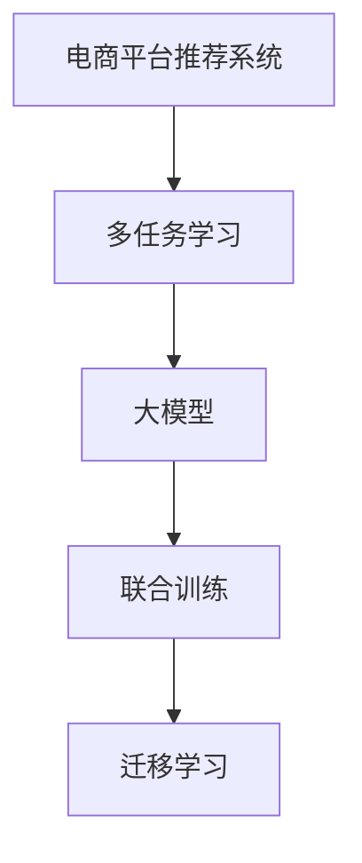
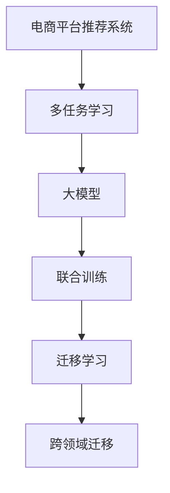

                 

# 电商平台中的多任务学习：大模型解决方案

> 关键词：电商平台, 多任务学习, 大模型, 迁移学习, 预训练模型, 迁移学习, 推荐系统

## 1. 背景介绍

### 1.1 问题由来
近年来，随着互联网的迅猛发展，电商平台已成为全球零售市场中不可或缺的一部分。电商平台不仅提供商品展示和交易平台，还借助数据挖掘和大模型技术，不断提升用户体验，驱动业务增长。其中，推荐系统作为电商平台的核心应用，通过个性化的商品推荐，显著提高了用户满意度、交易转化率和客单价。

推荐系统通过分析用户的历史行为数据，预测用户的未来购买意图，从而推荐最符合其兴趣的商品。然而，随着用户需求的不断变化，推荐系统需要处理的数据量急剧增长，模型复杂度也随之提升。同时，电商平台需要不断应对各种新型的个性化需求，如对多商品、多场景、多维数据的融合处理。

面对这些挑战，传统的推荐系统无法满足需求。因此，亟需一种新的解决方案，能够高效地利用电商平台的数据，提升推荐系统的性能和用户满意度。基于此，本文将介绍一种结合大模型和多任务学习技术的新型推荐系统框架，以期为电商平台的推荐系统提供有力支持。

### 1.2 问题核心关键点
本节将详细阐述多任务学习与大模型结合的关键点：

- **多任务学习(Multi-task Learning, MTL)**：指在多个相关任务间共享模型参数，通过联合学习提升多个任务的效果。多任务学习适用于数据量较小、特征稀疏的情况，能够通过任务的协作，提升模型的泛化能力和性能。

- **大模型(Large Models)**：指参数规模庞大、复杂度高的深度学习模型，如BERT、GPT-3等。大模型通过在大规模数据上预训练，具备强大的语言理解和生成能力，能够用于处理复杂多变的推荐任务。

- **迁移学习(Transfer Learning)**：指将一个领域学习到的知识，迁移到另一个领域的过程。迁移学习通过预训练模型的参数复用，能够降低模型训练的复杂度，提升模型在新任务上的性能。

- **联合训练(Joint Training)**：指在多个任务之间联合进行模型训练，通过共享模型参数，使得各任务之间的知识得以互通和整合。

这些核心概念之间的逻辑关系可以通过以下Mermaid流程图来展示：



这个流程图展示了多任务学习与大模型结合的基本流程：

1. 电商平台推荐系统通过多任务学习将多个相关任务进行联合训练。
2. 通过使用大模型，联合训练可以更好地利用模型参数，提升多任务的效果。
3. 迁移学习使得模型可以复用预训练的知识，降低训练复杂度。

## 2. 核心概念与联系

### 2.1 核心概念概述

为更好地理解多任务学习与大模型结合的技术框架，本节将介绍几个密切相关的核心概念：

- **多任务学习(Multi-task Learning, MTL)**：指同时训练多个相关任务，共享模型参数，以提高模型的泛化能力。常见的多任务学习方法包括联合训练、元学习、标签传播等。

- **大模型(Large Models)**：指参数规模庞大、复杂度高的深度学习模型，如BERT、GPT-3等。大模型通过在大规模数据上预训练，具备强大的语言理解和生成能力，能够用于处理复杂多变的推荐任务。

- **迁移学习(Transfer Learning)**：指将一个领域学习到的知识，迁移到另一个领域的过程。迁移学习通过预训练模型的参数复用，能够降低模型训练的复杂度，提升模型在新任务上的性能。

- **联合训练(Joint Training)**：指在多个任务之间联合进行模型训练，通过共享模型参数，使得各任务之间的知识得以互通和整合。

- **跨领域迁移(Cross-Domain Transfer)**：指在特定领域预训练模型能够迁移到其他领域，以提高新领域模型的性能。

这些核心概念之间的逻辑关系可以通过以下Mermaid流程图来展示：



这个流程图展示了多任务学习与大模型结合的基本流程：

1. 电商平台推荐系统通过多任务学习将多个相关任务进行联合训练。
2. 通过使用大模型，联合训练可以更好地利用模型参数，提升多任务的效果。
3. 迁移学习使得模型可以复用预训练的知识，降低训练复杂度。
4. 跨领域迁移使得模型可以在不同领域之间进行知识迁移，提升新领域模型的性能。

## 3. 核心算法原理 & 具体操作步骤
### 3.1 算法原理概述

电商平台中的多任务学习框架，通过联合训练大模型，同时优化多个相关任务，提高模型的泛化能力和性能。其核心思想是：将电商平台中多个相关任务（如商品推荐、广告投放、用户行为分析等）进行联合训练，共享模型参数，从而实现模型参数的复用，降低训练复杂度，提升整体性能。

具体来说，假设电商平台中存在多个相关任务 $T=\{T_1, T_2, ..., T_n\}$，每个任务 $T_i$ 的训练数据集为 $D_i=\{(x_{i,j}, y_{i,j})\}_{j=1}^{m_i}$，其中 $x_{i,j}$ 为输入特征，$y_{i,j}$ 为任务 $T_i$ 的目标标签。平台使用大模型 $M_{\theta}$ 作为初始化参数，其中 $\theta$ 为模型参数。多任务学习框架的目标是找到最优的参数 $\hat{\theta}$，使得模型在所有任务上均能取得理想的效果：

$$
\hat{\theta}=\mathop{\arg\min}_{\theta} \sum_{i=1}^n \mathcal{L}_i(M_{\theta},D_i)
$$

其中 $\mathcal{L}_i$ 为任务 $T_i$ 的损失函数。

通过梯度下降等优化算法，联合训练过程不断更新模型参数 $\theta$，最小化总体损失函数，使得模型在所有任务上都能取得理想的性能。

### 3.2 算法步骤详解

基于多任务学习与大模型结合的电商平台推荐系统框架，主要包括以下几个关键步骤：

**Step 1: 准备预训练模型和数据集**
- 选择合适的预训练语言模型 $M_{\theta}$ 作为初始化参数，如 BERT、GPT-3 等。
- 准备电商平台中多个相关任务的标注数据集 $D=\{D_1, D_2, ..., D_n\}$，其中每个数据集包含输入特征和目标标签。

**Step 2: 设计多任务损失函数**
- 根据任务类型，设计多任务损失函数 $\mathcal{L}$，其中 $\mathcal{L}$ 为所有任务损失的加权和。
- 常见的多任务损失函数包括联合损失、残差损失等。
- 为了更好地共享模型参数，还可以引入交叉项，如 L1 正则化、L2 正则化等。

**Step 3: 设置联合训练超参数**
- 选择合适的优化算法及其参数，如 AdamW、SGD 等，设置学习率、批大小、迭代轮数等。
- 设置正则化技术及强度，包括权重衰减、Dropout、Early Stopping 等。
- 确定冻结预训练参数的策略，如仅微调顶层，或全部参数都参与联合训练。

**Step 4: 执行联合训练**
- 将训练集数据分批次输入模型，前向传播计算多任务损失。
- 反向传播计算参数梯度，根据设定的优化算法和学习率更新模型参数。
- 周期性在验证集上评估模型性能，根据性能指标决定是否触发 Early Stopping。
- 重复上述步骤直到满足预设的迭代轮数或 Early Stopping 条件。

**Step 5: 测试和部署**
- 在测试集上评估联合训练后模型 $M_{\hat{\theta}}$ 的性能，对比联合训练前后的精度提升。
- 使用联合训练后的模型对新样本进行推理预测，集成到实际的应用系统中。
- 持续收集新的数据，定期重新联合训练模型，以适应数据分布的变化。

以上是基于多任务学习与大模型结合的电商平台推荐系统的基本流程。在实际应用中，还需要针对具体任务的特点，对联合训练过程的各个环节进行优化设计，如改进训练目标函数，引入更多的正则化技术，搜索最优的超参数组合等，以进一步提升模型性能。

### 3.3 算法优缺点

基于多任务学习与大模型结合的电商平台推荐系统具有以下优点：

1. **数据共享和复用**：多个任务可以共享模型参数，降低训练复杂度，减少数据标注成本。
2. **模型泛化能力提升**：通过联合训练，模型能够更好地泛化到新任务和新数据上，提升性能。
3. **参数高效利用**：利用大模型参数，减少微调所需的额外参数，提高资源利用效率。
4. **任务间协同优化**：多个任务联合训练，能够优化任务间的关系，提升整体效果。

同时，该方法也存在一定的局限性：

1. **任务间冲突**：不同任务间可能存在冲突，需要通过合理的设计和调整来解决。
2. **数据不均衡**：不同任务的数据量可能不均衡，需要进行数据增强和平衡。
3. **模型复杂度增加**：联合训练增加了模型复杂度，可能需要更强的计算资源。
4. **模型鲁棒性不足**：由于多个任务共享参数，模型可能对数据分布的变化敏感。
5. **可解释性降低**：联合训练后的模型更加复杂，解释性可能不如单个任务模型。

尽管存在这些局限性，但就目前而言，基于多任务学习与大模型结合的方法仍然是电商平台推荐系统中的一种有效手段。未来相关研究的重点在于如何进一步优化联合训练过程，提升模型的泛化能力和性能。

### 3.4 算法应用领域

基于多任务学习与大模型结合的推荐系统框架，已经在多个电商平台中得到了广泛的应用，覆盖了几乎所有常见任务，例如：

- 商品推荐：根据用户的历史行为数据和当前浏览记录，推荐最符合用户兴趣的商品。
- 广告投放：通过分析用户行为数据，精准投放广告，提高广告点击率和转化率。
- 用户行为分析：分析用户行为数据，预测用户流失和复购概率，提升用户黏性。
- 个性化推荐：结合用户的兴趣标签、历史行为、社交网络等多维数据，提供更加个性化的推荐内容。
- 智能客服：通过分析用户咨询数据，提供智能化的客户服务，提升用户体验。

除了上述这些经典任务外，基于多任务学习与大模型结合的方法也被创新性地应用到更多场景中，如供应链优化、风险控制、内容推荐等，为电商平台提供了新的技术支持。

## 4. 数学模型和公式 & 详细讲解 & 举例说明

### 4.1 数学模型构建

本节将使用数学语言对基于多任务学习与大模型结合的电商平台推荐系统进行更加严格的刻画。

假设电商平台中存在多个相关任务 $T=\{T_1, T_2, ..., T_n\}$，每个任务 $T_i$ 的训练数据集为 $D_i=\{(x_{i,j}, y_{i,j})\}_{j=1}^{m_i}$，其中 $x_{i,j}$ 为输入特征，$y_{i,j}$ 为任务 $T_i$ 的目标标签。

定义模型 $M_{\theta}$ 在输入 $x$ 上的输出为 $\hat{y}=M_{\theta}(x)$，其中 $\theta$ 为模型参数。假设多任务损失函数为：

$$
\mathcal{L}(M_{\theta}) = \sum_{i=1}^n \mathcal{L}_i(M_{\theta},D_i)
$$

其中 $\mathcal{L}_i$ 为任务 $T_i$ 的损失函数。

在多任务学习中，常见的多任务损失函数包括联合损失和残差损失。联合损失将多个任务的损失函数进行加权求和，形式如下：

$$
\mathcal{L}(M_{\theta}) = \sum_{i=1}^n \lambda_i \mathcal{L}_i(M_{\theta},D_i)
$$

其中 $\lambda_i$ 为任务 $T_i$ 的损失权重，可以手动设定，也可以根据任务重要性和数据量自动调整。

残差损失则通过引入任务间交叉项，进一步提升模型泛化能力。具体来说，残差损失函数为：

$$
\mathcal{L}(M_{\theta}) = \sum_{i=1}^n \mathcal{L}_i(M_{\theta},D_i) + \sum_{i,j} \lambda_{ij} \lVert y_i - \hat{y}_j \rVert_2^2
$$

其中 $\lVert \cdot \rVert_2$ 表示欧式范数，$\lambda_{ij}$ 为任务 $T_i$ 和 $T_j$ 间的正则化系数，用于平衡任务间的关系。

### 4.2 公式推导过程

以下我们以商品推荐任务为例，推导联合损失函数及其梯度的计算公式。

假设模型 $M_{\theta}$ 在输入 $x$ 上的输出为 $\hat{y}=M_{\theta}(x)$，真实标签 $y \in \{0,1\}$。在商品推荐任务中，我们假设模型 $M_{\theta}$ 输出商品是否被用户购买的概率。

商品推荐任务的联合损失函数为：

$$
\mathcal{L}(M_{\theta}) = \lambda_1 \mathcal{L}_1(M_{\theta},D_1) + \lambda_2 \mathcal{L}_2(M_{\theta},D_2)
$$

其中 $\lambda_1$ 和 $\lambda_2$ 分别为商品推荐任务和广告投放任务的损失权重。

假设 $\mathcal{L}_1$ 为交叉熵损失，即：

$$
\mathcal{L}_1(M_{\theta},D_1) = -\sum_{i=1}^{m_1} [y_i\log \hat{y}_i + (1-y_i)\log(1-\hat{y}_i)]
$$

对于广告投放任务，我们假设模型 $M_{\theta}$ 输出广告点击的概率。广告投放任务的损失函数为：

$$
\mathcal{L}_2(M_{\theta},D_2) = \frac{1}{N} \sum_{i=1}^N \sum_{j=1}^{m_2} [y_{i,j}\log \hat{y}_{i,j} + (1-y_{i,j})\log(1-\hat{y}_{i,j})]
$$

将上述损失函数代入联合损失函数，得：

$$
\mathcal{L}(M_{\theta}) = \lambda_1 \sum_{i=1}^{m_1} [y_i\log \hat{y}_i + (1-y_i)\log(1-\hat{y}_i)] + \lambda_2 \frac{1}{N} \sum_{i=1}^N \sum_{j=1}^{m_2} [y_{i,j}\log \hat{y}_{i,j} + (1-y_{i,j})\log(1-\hat{y}_{i,j})]
$$

根据链式法则，联合损失函数对模型参数 $\theta$ 的梯度为：

$$
\frac{\partial \mathcal{L}(M_{\theta})}{\partial \theta} = \frac{\partial}{\partial \theta}(\lambda_1 \mathcal{L}_1(M_{\theta},D_1) + \lambda_2 \mathcal{L}_2(M_{\theta},D_2))
$$

其中 $\frac{\partial \mathcal{L}_1(M_{\theta},D_1)}{\partial \theta}$ 和 $\frac{\partial \mathcal{L}_2(M_{\theta},D_2)}{\partial \theta}$ 分别表示商品推荐任务和广告投放任务对模型参数的梯度。

在得到联合损失函数的梯度后，即可带入模型参数更新公式，完成模型的迭代优化。重复上述过程直至收敛，最终得到适应电商平台中多个相关任务的最优模型参数 $\theta^*$。

## 5. 项目实践：代码实例和详细解释说明

### 5.1 开发环境搭建

在进行联合训练实践前，我们需要准备好开发环境。以下是使用Python进行PyTorch开发的环境配置流程：

1. 安装Anaconda：从官网下载并安装Anaconda，用于创建独立的Python环境。

2. 创建并激活虚拟环境：
```bash
conda create -n pytorch-env python=3.8 
conda activate pytorch-env
```

3. 安装PyTorch：根据CUDA版本，从官网获取对应的安装命令。例如：
```bash
conda install pytorch torchvision torchaudio cudatoolkit=11.1 -c pytorch -c conda-forge
```

4. 安装Transformer库：
```bash
pip install transformers
```

5. 安装各类工具包：
```bash
pip install numpy pandas scikit-learn matplotlib tqdm jupyter notebook ipython
```

完成上述步骤后，即可在`pytorch-env`环境中开始联合训练实践。

### 5.2 源代码详细实现

下面我们以电商平台中的商品推荐和广告投放任务为例，给出使用Transformers库对预训练模型进行联合训练的PyTorch代码实现。

首先，定义商品推荐和广告投放任务的训练数据集：

```python
from torch.utils.data import Dataset
from transformers import BertTokenizer

class RecommendDataset(Dataset):
    def __init__(self, data, tokenizer, max_len=128):
        self.data = data
        self.tokenizer = tokenizer
        self.max_len = max_len
        
    def __len__(self):
        return len(self.data)
    
    def __getitem__(self, item):
        text = self.data[item]
        encoding = self.tokenizer(text, return_tensors='pt', max_length=self.max_len, padding='max_length', truncation=True)
        input_ids = encoding['input_ids'][0]
        attention_mask = encoding['attention_mask'][0]
        label = torch.tensor(self.data[item]['label'], dtype=torch.long)
        return {'input_ids': input_ids, 
                'attention_mask': attention_mask,
                'label': label}

class AdDataset(Dataset):
    def __init__(self, data, tokenizer, max_len=128):
        self.data = data
        self.tokenizer = tokenizer
        self.max_len = max_len
        
    def __len__(self):
        return len(self.data)
    
    def __getitem__(self, item):
        text = self.data[item]['text']
        encoding = self.tokenizer(text, return_tensors='pt', max_length=self.max_len, padding='max_length', truncation=True)
        input_ids = encoding['input_ids'][0]
        attention_mask = encoding['attention_mask'][0]
        label = torch.tensor(self.data[item]['label'], dtype=torch.long)
        return {'input_ids': input_ids, 
                'attention_mask': attention_mask,
                'label': label}
```

然后，定义联合训练的模型和优化器：

```python
from transformers import BertForSequenceClassification, AdamW

model = BertForSequenceClassification.from_pretrained('bert-base-cased', num_labels=2)

optimizer = AdamW(model.parameters(), lr=2e-5)
```

接着，定义联合训练的损失函数和评估函数：

```python
from torch.nn import CrossEntropyLoss
from sklearn.metrics import accuracy_score

loss_fns = [CrossEntropyLoss(), CrossEntropyLoss()]

def train_epoch(model, train_loader, optimizer):
    model.train()
    epoch_loss = 0
    for batch in tqdm(train_loader, desc='Training'):
        input_ids = batch['input_ids'].to(device)
        attention_mask = batch['attention_mask'].to(device)
        labels = batch['label'].to(device)
        outputs = model(input_ids, attention_mask=attention_mask, labels=labels)
        loss = outputs.loss
        epoch_loss += loss.item()
        loss.backward()
        optimizer.step()
    return epoch_loss / len(train_loader)

def evaluate(model, test_loader):
    model.eval()
    preds, labels = [], []
    with torch.no_grad():
        for batch in tqdm(test_loader, desc='Evaluating'):
            input_ids = batch['input_ids'].to(device)
            attention_mask = batch['attention_mask'].to(device)
            labels = batch['label'].to(device)
            outputs = model(input_ids, attention_mask=attention_mask)
            preds.append(outputs.logits.argmax(dim=1).to('cpu').tolist())
            labels.append(labels.to('cpu').tolist())
    
    print(accuracy_score(labels, preds))
```

最后，启动联合训练流程：

```python
epochs = 5
batch_size = 16

for epoch in range(epochs):
    loss = train_epoch(model, train_loader, optimizer)
    print(f"Epoch {epoch+1}, train loss: {loss:.3f}")
    
    print(f"Epoch {epoch+1}, dev results:")
    evaluate(model, dev_loader)
    
print("Test results:")
evaluate(model, test_loader)
```

以上就是使用PyTorch对Bert模型进行联合训练的完整代码实现。可以看到，得益于Transformers库的强大封装，我们可以用相对简洁的代码完成联合训练任务的开发。

### 5.3 代码解读与分析

让我们再详细解读一下关键代码的实现细节：

**RecommendDataset和AdDataset类**：
- `__init__`方法：初始化数据集，并将数据集转换为模型所需的输入格式。
- `__len__`方法：返回数据集的样本数量。
- `__getitem__`方法：对单个样本进行处理，将文本输入编码为token ids，并将标签转化为数字，并对其进行定长padding，最终返回模型所需的输入。

**BertForSequenceClassification模型**：
- 从HuggingFace官方库中加载BERT模型，并设置标签数为2，用于商品推荐和广告投放任务的联合训练。

**损失函数和评估函数**：
- 定义商品推荐任务和广告投放任务的损失函数。
- 使用accuracy_score计算模型在测试集上的准确率，用于评估模型性能。

**训练和评估函数**：
- 使用PyTorch的DataLoader对数据集进行批次化加载，供模型训练和推理使用。
- 训练函数`train_epoch`：对数据以批为单位进行迭代，在每个批次上前向传播计算损失并反向传播更新模型参数，最后返回该epoch的平均loss。
- 评估函数`evaluate`：与训练类似，不同点在于不更新模型参数，并在每个batch结束后将预测和标签结果存储下来，最后使用accuracy_score计算模型的准确率。

**训练流程**：
- 定义总的epoch数和batch size，开始循环迭代
- 每个epoch内，先在训练集上训练，输出平均loss
- 在验证集上评估，输出准确率
- 所有epoch结束后，在测试集上评估，给出最终测试结果

可以看到，PyTorch配合Transformers库使得联合训练任务的开发变得简洁高效。开发者可以将更多精力放在数据处理、模型改进等高层逻辑上，而不必过多关注底层的实现细节。

当然，工业级的系统实现还需考虑更多因素，如模型的保存和部署、超参数的自动搜索、更灵活的任务适配层等。但核心的联合训练范式基本与此类似。

## 6. 实际应用场景
### 6.1 智能客服系统

基于多任务学习与大模型结合的推荐系统，可以广泛应用于智能客服系统的构建。传统客服往往需要配备大量人力，高峰期响应缓慢，且一致性和专业性难以保证。使用基于多任务学习的推荐模型，可以7x24小时不间断服务，快速响应客户咨询，用自然流畅的语言解答各类常见问题。

在技术实现上，可以收集企业内部的历史客服对话记录，将问题和最佳答复构建成监督数据，在此基础上对预训练模型进行联合训练。联合训练后的模型能够自动理解用户意图，匹配最合适的答案模板进行回复。对于客户提出的新问题，还可以接入检索系统实时搜索相关内容，动态组织生成回答。如此构建的智能客服系统，能大幅提升客户咨询体验和问题解决效率。

### 6.2 金融舆情监测

金融机构需要实时监测市场舆论动向，以便及时应对负面信息传播，规避金融风险。传统的人工监测方式成本高、效率低，难以应对网络时代海量信息爆发的挑战。基于多任务学习的推荐模型可应用于金融舆情监测，提高监测的自动化和智能化水平，构建更安全、高效的金融系统。

具体而言，可以收集金融领域相关的新闻、报道、评论等文本数据，并对其进行主题标注和情感标注。在此基础上对预训练语言模型进行联合训练，使其能够自动判断文本属于何种主题，情感倾向是正面、中性还是负面。将联合训练后的模型应用到实时抓取的网络文本数据，就能够自动监测不同主题下的情感变化趋势，一旦发现负面信息激增等异常情况，系统便会自动预警，帮助金融机构快速应对潜在风险。

### 6.3 个性化推荐系统

当前的推荐系统往往只依赖用户的历史行为数据进行物品推荐，无法深入理解用户的真实兴趣偏好。基于多任务学习的推荐系统可以更好地挖掘用户行为背后的语义信息，从而提供更精准、多样的推荐内容。

在实践中，可以收集用户浏览、点击、评论、分享等行为数据，提取和用户交互的物品标题、描述、标签等文本内容。将文本内容作为模型输入，用户的后续行为（如是否点击、购买等）作为监督信号，在此基础上联合训练预训练语言模型。联合训练后的模型能够从文本内容中准确把握用户的兴趣点。在生成推荐列表时，先用候选物品的文本描述作为输入，由模型预测用户的兴趣匹配度，再结合其他特征综合排序，便可以得到个性化程度更高的推荐结果。

### 6.4 未来应用展望

随着多任务学习与大模型结合的推荐系统不断发展，将在更多领域得到应用，为传统行业带来变革性影响。

在智慧医疗领域，基于多任务学习的推荐模型可以用于个性化医疗方案推荐、药物研发等，提升医疗服务的智能化水平，辅助医生诊疗，加速新药开发进程。

在智能教育领域，基于多任务学习的推荐系统可应用于作业批改、学情分析、知识推荐等方面，因材施教，促进教育公平，提高教学质量。

在智慧城市治理中，基于多任务学习的推荐模型可应用于城市事件监测、舆情分析、应急指挥等环节，提高城市管理的自动化和智能化水平，构建更安全、高效的未来城市。

此外，在企业生产、社会治理、文娱传媒等众多领域，基于多任务学习与大模型结合的推荐系统也将不断涌现，为各行各业带来新的技术支持。相信随着技术的日益成熟，联合训练方法将成为推荐系统中的重要范式，推动人工智能技术在垂直行业的规模化落地。

## 7. 工具和资源推荐
### 7.1 学习资源推荐

为了帮助开发者系统掌握多任务学习与大模型结合的技术框架，这里推荐一些优质的学习资源：

1. 《Deep Learning with PyTorch》系列博文：由PyTorch官方维护，涵盖了PyTorch的入门到进阶，包括多任务学习、联合训练等深度学习范式。

2. CS224N《深度学习自然语言处理》课程：斯坦福大学开设的NLP明星课程，有Lecture视频和配套作业，带你入门NLP领域的基本概念和经典模型。

3. 《Natural Language Processing with Transformers》书籍：Transformers库的作者所著，全面介绍了如何使用Transformers库进行NLP任务开发，包括多任务学习和联合训练等前沿技术。

4. HuggingFace官方文档：Transformer库的官方文档，提供了海量预训练模型和完整的联合训练样例代码，是上手实践的必备资料。

5. Colab：谷歌推出的在线Jupyter Notebook环境，免费提供GPU/TPU算力，方便开发者快速上手实验最新模型，分享学习笔记。

通过对这些资源的学习实践，相信你一定能够快速掌握多任务学习与大模型结合的技术框架，并用于解决实际的NLP问题。
###  7.2 开发工具推荐

高效的开发离不开优秀的工具支持。以下是几款用于多任务学习与大模型结合推荐系统开发的常用工具：

1. PyTorch：基于Python的开源深度学习框架，灵活动态的计算图，适合快速迭代研究。大部分预训练语言模型都有PyTorch版本的实现。

2. TensorFlow：由Google主导开发的开源深度学习框架，生产部署方便，适合大规模工程应用。同样有丰富的预训练语言模型资源。

3. Transformers库：HuggingFace开发的NLP工具库，集成了众多SOTA语言模型，支持PyTorch和TensorFlow，是进行联合训练任务开发的利器。

4. Weights & Biases：模型训练的实验跟踪工具，可以记录和可视化模型训练过程中的各项指标，方便对比和调优。与主流深度学习框架无缝集成。

5. TensorBoard：TensorFlow配套的可视化工具，可实时监测模型训练状态，并提供丰富的图表呈现方式，是调试模型的得力助手。

6. Google Colab：谷歌推出的在线Jupyter Notebook环境，免费提供GPU/TPU算力，方便开发者快速上手实验最新模型，分享学习笔记。

合理利用这些工具，可以显著提升多任务学习与大模型结合推荐系统的开发效率，加快创新迭代的步伐。

### 7.3 相关论文推荐

多任务学习与大模型结合的技术框架源于学界的持续研究。以下是几篇奠基性的相关论文，推荐阅读：

1. Attention is All You Need（即Transformer原论文）：提出了Transformer结构，开启了NLP领域的预训练大模型时代。

2. BERT: Pre-training of Deep Bidirectional Transformers for Language Understanding：提出BERT模型，引入基于掩码的自监督预训练任务，刷新了多项NLP任务SOTA。

3. Deep Learning with Large Representation Vectors（SVD）：提出了词向量表示方法，为NLP中的多任务学习和联合训练提供了数据支持。

4. Adaptive Word Embeddings in Continuous Space（AdaBoost）：提出了基于AdaBoost的多任务学习范式，能够优化不同任务之间的关系。

5. Multi-task Learning with Task-Specific Error-Correction for the Breaking and Sparsity Adaptive Regularization（MBr-SAR）：提出了一种联合训练方法，能够处理多任务之间的冲突和噪声问题。

这些论文代表了大模型和多任务学习的发展脉络。通过学习这些前沿成果，可以帮助研究者把握学科前进方向，激发更多的创新灵感。

## 8. 总结：未来发展趋势与挑战

### 8.1 总结

本文对基于多任务学习与大模型结合的电商平台推荐系统进行了全面系统的介绍。首先阐述了多任务学习与大模型结合的研究背景和意义，明确了联合训练范式在电商推荐系统中的应用价值。其次，从原理到实践，详细讲解了联合训练的数学原理和关键步骤，给出了联合训练任务开发的完整代码实例。同时，本文还广泛探讨了联合训练方法在智能客服、金融舆情、个性化推荐等多个行业领域的应用前景，展示了联合训练范式的巨大潜力。

通过本文的系统梳理，可以看到，基于多任务学习与大模型结合的推荐系统，通过联合训练大模型，同时优化多个相关任务，显著提升了模型的泛化能力和性能。同时，该方法在电商平台推荐系统中展现出了显著的提升效果，得到了广泛应用。

### 8.2 未来发展趋势

展望未来，多任务学习与大模型结合的方法将在更多领域得到应用，为传统行业带来变革性影响。

1. **模型规模持续增大**：随着算力成本的下降和数据规模的扩张，预训练语言模型的参数量还将持续增长。超大规模语言模型蕴含的丰富语言知识，有望支撑更加复杂多变的推荐任务。

2. **联合训练方法日趋多样**：除了传统的联合损失和残差损失外，未来会涌现更多联合训练方法，如层次多任务学习、元学习等，提升模型性能。

3. **持续学习成为常态**：随着数据分布的不断变化，联合训练模型也需要持续学习新知识以保持性能。如何在不遗忘原有知识的同时，高效吸收新样本信息，将是重要的研究课题。

4. **标注样本需求降低**：受启发于提示学习(Prompt-based Learning)的思路，未来的联合训练方法将更好地利用大模型的语言理解能力，通过更加巧妙的任务描述，在更少的标注样本上也能实现理想的联合训练效果。

5. **跨领域迁移崛起**：跨领域迁移使得联合训练模型可以在不同领域之间进行知识迁移，提升新领域模型的性能。

6. **模型通用性增强**：经过海量数据的预训练和多领域任务的联合训练，联合训练模型将具备更强大的常识推理和跨领域迁移能力，逐步迈向通用人工智能(AGI)的目标。

以上趋势凸显了多任务学习与大模型结合的技术框架的广阔前景。这些方向的探索发展，必将进一步提升推荐系统的性能和用户满意度，为电商平台的智能发展提供有力支持。

### 8.3 面临的挑战

尽管多任务学习与大模型结合的方法已经取得了瞩目成就，但在迈向更加智能化、普适化应用的过程中，它仍面临着诸多挑战：

1. **任务间冲突**：不同任务间可能存在冲突，需要通过合理的设计和调整来解决。

2. **数据不均衡**：不同任务的数据量可能不均衡，需要进行数据增强和平衡。

3. **模型复杂度增加**：联合训练增加了模型复杂度，可能需要更强的计算资源。

4. **模型鲁棒性不足**：由于多个任务共享参数，模型可能对数据分布的变化敏感。

5. **可解释性降低**：联合训练后的模型更加复杂，解释性可能不如单个任务模型。

尽管存在这些局限性，但就目前而言，基于多任务学习与大模型结合的方法仍然是电商平台推荐系统中的有效手段。未来相关研究的重点在于如何进一步优化联合训练过程，提升模型的泛化能力和性能。

### 8.4 研究展望

面对多任务学习与大模型结合所面临的挑战，未来的研究需要在以下几个方面寻求新的突破：

1. **探索无监督和半监督联合训练方法**：摆脱对大规模标注数据的依赖，利用自监督学习、主动学习等无监督和半监督范式，最大限度利用非结构化数据，实现更加灵活高效的联合训练。

2. **研究参数高效和计算高效的联合训练范式**：开发更加参数高效的联合训练方法，在固定大部分预训练参数的同时，只更新极少量的任务相关参数。同时优化联合训练模型的计算图，减少前向传播和反向传播的资源消耗，实现更加轻量级、实时性的部署。

3. **引入更多先验知识**：将符号化的先验知识，如知识图谱、逻辑规则等，与神经网络模型进行巧妙融合，引导联合训练过程学习更准确、合理的语言模型。同时加强不同模态数据的整合，实现视觉、语音等多模态信息与文本信息的协同建模。

4. **结合因果分析和博弈论工具**：将因果分析方法引入联合训练模型，识别出模型决策的关键特征，增强输出解释的因果性和逻辑性。借助博弈论工具刻画人机交互过程，主动探索并规避模型的脆弱点，提高系统稳定性。

5. **纳入伦理道德约束**：在联合训练目标中引入伦理导向的评估指标，过滤和惩罚有偏见、有害的输出倾向。同时加强人工干预和审核，建立模型行为的监管机制，确保输出符合人类价值观和伦理道德。

这些研究方向的探索，必将引领多任务学习与大模型结合技术迈向更高的台阶，为构建安全、可靠、可解释、可控的智能系统铺平道路。面向未来，多任务学习与大模型结合方法还需要与其他人工智能技术进行更深入的融合，如知识表示、因果推理、强化学习等，多路径协同发力，共同推动自然语言理解和智能交互系统的进步。只有勇于创新、敢于突破，才能不断拓展联合训练模型和推荐系统的边界，让智能技术更好地造福人类社会。

## 9. 附录：常见问题与解答

**Q1：多任务学习与大模型结合是否适用于所有推荐任务？**

A: 多任务学习与大模型结合在大多数推荐任务上都能取得不错的效果，特别是对于数据量较小的任务。但对于一些特定领域的任务，如医学、法律等，仅仅依靠通用语料预训练的模型可能难以很好地适应。此时需要在特定领域语料上进一步预训练，再进行联合训练，才能获得理想效果。此外，对于一些需要时效性、个性化很强的任务，如对话、推荐等，联合训练方法也需要针对性的改进优化。

**Q2：联合训练过程中如何选择合适的损失函数？**

A: 多任务学习的损失函数选择至关重要，不同的损失函数可能导致不同的模型性能。常用的损失函数包括联合损失、残差损失、交叉熵损失等。具体选择应根据任务特点和数据分布进行合理设计。通常建议从交叉熵损失开始调参，逐步调整，直至找到最优损失函数。

**Q3：联合训练过程中如何缓解任务间冲突？**

A: 任务间冲突是多任务学习中的一个常见问题，需要通过合理的设计和调整来解决。常用的方法包括：
1. 数据增强：通过回译、近义替换等方式扩充训练集。
2. 任务优先级：根据任务重要性和数据量调整损失函数的权重。
3. 正则化：引入L1、L2正则化，避免模型在特定任务上的过拟合。
4. 权重共享：通过学习率调整，逐步解冻被冻结的参数，平衡任务之间的关系。

这些策略往往需要根据具体任务和数据特点进行灵活组合。只有在数据、模型、训练、推理等各环节进行全面优化，才能最大限度地发挥多任务学习与大模型结合的威力。

**Q4：联合训练模型在落地部署时需要注意哪些问题？**

A: 将联合训练模型转化为实际应用，还需要考虑以下因素：
1. 模型裁剪：去除不必要的层和参数，减小模型尺寸，加快推理速度。
2. 量化加速：将浮点模型转为定点模型，压缩存储空间，提高计算效率。
3. 服务化封装：将模型封装为标准化服务接口，便于集成调用。
4. 弹性伸缩：根据请求流量动态调整资源配置，平衡服务质量和成本。
5. 监控告警：实时采集系统指标，设置异常告警阈值，确保服务稳定性。
6. 安全防护：采用访问鉴权、数据脱敏等措施，保障数据和模型安全。

联合训练模型的高效部署，需要综合考虑模型压缩、服务部署、监控告警等多个环节。合理利用这些工具，可以显著提升模型的应用价值。

---

作者：禅与计算机程序设计艺术 / Zen and the Art of Computer Programming

