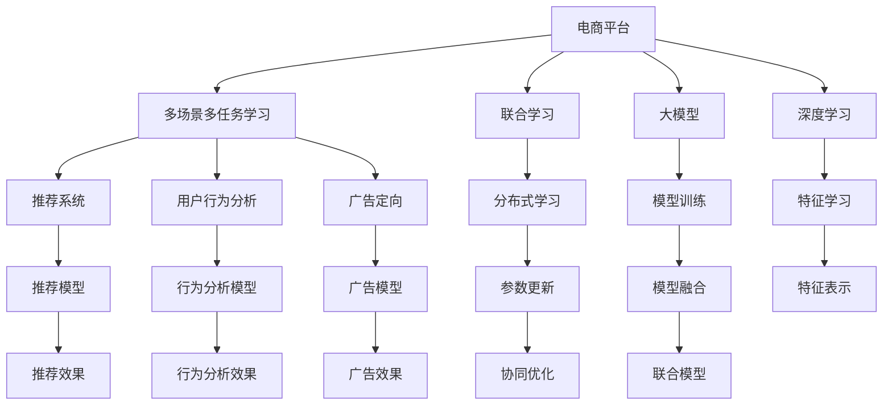

                 

# 电商平台中的多场景多任务联合学习：AI大模型的优势

> 关键词：
- 电商平台
- 多场景多任务学习
- 联合学习
- 大模型
- 深度学习
- 推荐系统
- 用户行为分析
- 广告定向

## 1. 背景介绍

近年来，随着互联网技术的发展和电商市场的快速增长，电商平台已经成为了一个高度复杂且多变的系统。在传统的电商平台上，商家需要同时进行商品推荐、广告定向、用户行为分析等多个任务，以便更好地吸引用户、提高转化率。然而，这些任务往往需要不同的数据集和算法，导致资源浪费，且难以通过单模型统一处理。因此，如何在电商平台中实现多场景多任务的学习，提高系统的整体性能和用户体验，成为了一个重要的研究方向。

## 2. 核心概念与联系

### 2.1 核心概念概述

为了更好地理解电商平台上多场景多任务的学习，本节将介绍几个密切相关的核心概念：

- **电商平台(E-commerce Platform)**：一个集成了商品推荐、广告定向、用户行为分析等多个功能的综合性平台。
- **多场景多任务学习(Multi-Scene Multi-Task Learning, MSMTL)**：在同一数据集上同时进行多个任务的联合训练，利用任务之间的相关性提高整体的泛化能力和性能。
- **联合学习(Federated Learning)**：一种分布式机器学习方法，多个设备或节点在本地训练模型，并通过中心服务器进行参数更新和协调，以保护数据隐私。
- **大模型(Large Model)**：指具有庞大参数规模的深度神经网络模型，通常具有较好的泛化能力和处理复杂任务的能力。
- **深度学习(Deep Learning)**：利用多层神经网络进行特征学习和任务处理的技术，广泛应用于图像识别、自然语言处理等领域。
- **推荐系统(Recommendation System)**：根据用户的历史行为和偏好，向用户推荐合适的商品或内容。
- **用户行为分析(User Behavior Analysis)**：通过分析用户的历史行为数据，预测用户未来的行为和需求，以优化用户体验和业务决策。
- **广告定向(Ad Targeting)**：通过分析用户特征，精准投放广告，提高广告的转化率和ROI。

这些核心概念之间的逻辑关系可以通过以下Mermaid流程图来展示：



这个流程图展示了很多核心概念之间的关系：

1. 电商平台通过多场景多任务学习，利用深度学习和大模型进行联合训练。
2. 联合学习使得多个设备在本地训练模型，并通过中心服务器进行参数更新。
3. 多场景多任务学习涉及多个具体任务，如推荐系统、用户行为分析和广告定向等。
4. 深度学习利用多层神经网络进行特征学习和任务处理。
5. 大模型用于处理复杂的电商任务，如商品推荐、广告定向和用户行为分析。

这些概念共同构成了电商平台中多场景多任务联合学习的核心框架，使其能够在各种场景下发挥强大的功能和优势。

## 3. 核心算法原理 & 具体操作步骤
### 3.1 算法原理概述

在电商平台中，多场景多任务联合学习旨在利用多个任务的共同特征和相关性，提高整体的学习效率和效果。其核心思想是：在同一数据集上，对多个任务进行联合训练，共享模型参数，从而减少计算资源消耗和提高模型泛化能力。

具体而言，假设电商平台上需要处理的任务集为 $\mathcal{T}=\{T_1, T_2, \dots, T_n\}$，其中 $T_i$ 表示第 $i$ 个任务。每个任务 $T_i$ 都有一个损失函数 $\ell_i(\theta)$，表示模型在任务 $T_i$ 上的表现。模型的参数向量为 $\theta$。

多场景多任务学习的目标是通过联合训练，最大化所有任务的平均损失函数：

$$
\min_{\theta} \frac{1}{n} \sum_{i=1}^n \ell_i(\theta)
$$

为了实现上述目标，通常需要设计一个联合损失函数 $\mathcal{L}(\theta)$，用于衡量模型在所有任务上的综合表现。常见的联合损失函数包括：

- **平均损失函数**：直接取所有任务损失的平均值。
- **分层次损失函数**：根据任务的重要性分配不同的权重。
- **梯度融合损失函数**：将多个任务的梯度进行加权平均，避免某些任务的梯度对整体影响过大。

### 3.2 算法步骤详解

基于多场景多任务学习的大模型联合训练，一般包括以下几个关键步骤：

**Step 1: 准备数据集**
- 收集电商平台上所有相关任务的数据集，如推荐数据、广告数据、用户行为数据等。
- 对每个数据集进行预处理，包括清洗、标准化、归一化等操作。
- 将数据集按照训练集、验证集和测试集进行划分，保证模型在各数据集上的泛化性能。

**Step 2: 设计联合模型**
- 根据不同任务的特点，设计合适的联合模型结构。
- 在模型中引入多个分支，每个分支对应一个任务，共享大部分参数。
- 为每个任务设计合适的输出层和损失函数，如交叉熵、均方误差等。

**Step 3: 优化联合模型**
- 选择合适的优化算法及其参数，如Adam、SGD等，设置学习率、批大小、迭代轮数等。
- 设置正则化技术及强度，包括权重衰减、Dropout、Early Stopping等。
- 在本地设备上训练模型，通过中心服务器进行参数更新和协调。

**Step 4: 模型融合与评估**
- 在验证集上对模型进行评估，比较不同任务和不同分支的表现。
- 根据评估结果，调整联合模型的结构和参数，优化模型性能。
- 在测试集上对模型进行最终评估，确定模型的实际效果。

### 3.3 算法优缺点

基于多场景多任务学习的大模型联合训练方法具有以下优点：

- **泛化能力强**：通过共享模型参数，多个任务之间的相关性能够互相促进，提高模型的泛化能力。
- **计算资源效率高**：共享参数可以降低计算资源的消耗，提高训练和推理的效率。
- **模型性能提升**：联合训练可以提高模型在各任务上的综合性能，特别是在数据量较小的情况下。

同时，该方法也存在一些局限性：

- **模型复杂度高**：联合模型的结构复杂，调试和优化难度较大。
- **数据依赖性强**：多场景多任务学习依赖于高质量的数据集，数据收集和预处理的工作量较大。
- **模型稳定性差**：在局部最优解处，不同任务的梯度方向可能不一致，容易陷入局部最优。

尽管存在这些局限性，但就目前而言，基于多场景多任务学习的方法仍是电商平台中实现联合学习的重要手段。未来相关研究的重点在于如何进一步提高模型复杂度和计算效率，降低数据依赖性，同时兼顾模型稳定性和泛化能力。

### 3.4 算法应用领域

基于大模型联合学习的联合训练方法，已经在电商平台中的应用领域涵盖了以下几个方面：

- **推荐系统**：通过联合训练多个推荐任务，提高推荐模型的准确性和多样性。
- **用户行为分析**：结合用户的行为数据和特征，进行联合学习，提升行为分析模型的预测能力。
- **广告定向**：利用联合学习，优化广告投放策略，提高广告的点击率和转化率。
- **实时个性化推荐**：通过联合学习，实时更新推荐模型，适应用户动态变化的需求。
- **用户标签管理**：通过联合学习，对用户进行更细粒度的标签管理，提高推荐效果。
- **风险控制**：结合交易数据和用户行为数据，进行联合学习，提高风险控制模型的准确性。

除了上述这些具体应用外，大模型联合学习还被创新性地应用于更多场景中，如在线购物、社交电商等，为电商平台带来了新的突破。随着大模型和联合学习方法的不断进步，相信电商平台的智能化水平将进一步提升，为用户带来更优质的购物体验。

## 4. 数学模型和公式 & 详细讲解 & 举例说明

### 4.1 数学模型构建

为了更好地理解多场景多任务联合学习的数学模型，本节将详细讲解其构建过程。

假设电商平台上需要处理的任务集为 $\mathcal{T}=\{T_1, T_2, \dots, T_n\}$，其中 $T_i$ 表示第 $i$ 个任务。每个任务 $T_i$ 的训练集为 $D_i=\{(x_i, y_i)\}_{i=1}^{m_i}$，其中 $x_i$ 为输入特征，$y_i$ 为标签。模型的参数向量为 $\theta$。

多场景多任务学习的目标是通过联合训练，最大化所有任务的平均损失函数：

$$
\min_{\theta} \frac{1}{n} \sum_{i=1}^n \ell_i(\theta)
$$

其中 $\ell_i(\theta)$ 为任务 $T_i$ 的损失函数。

### 4.2 公式推导过程

以下我们以两个任务为例，推导联合损失函数的计算公式。

假设任务 $T_1$ 和 $T_2$ 的训练集分别为 $D_1=\{(x_i^{(1)}, y_i^{(1)})\}_{i=1}^{m_1}$ 和 $D_2=\{(x_i^{(2)}, y_i^{(2)})\}_{i=1}^{m_2}$。模型在任务 $T_i$ 上的输出为 $f_i(\theta, x_i)$，其中 $\theta$ 为模型参数。

任务 $T_1$ 的损失函数为：

$$
\ell_1(\theta) = \frac{1}{m_1} \sum_{i=1}^{m_1} \ell(y_i^{(1)}, f_1(\theta, x_i^{(1)}))
$$

任务 $T_2$ 的损失函数为：

$$
\ell_2(\theta) = \frac{1}{m_2} \sum_{i=1}^{m_2} \ell(y_i^{(2)}, f_2(\theta, x_i^{(2)}))
$$

联合损失函数 $\mathcal{L}(\theta)$ 定义为：

$$
\mathcal{L}(\theta) = \frac{1}{m_1} \sum_{i=1}^{m_1} \ell(y_i^{(1)}, f_1(\theta, x_i^{(1)})) + \frac{1}{m_2} \sum_{i=1}^{m_2} \ell(y_i^{(2)}, f_2(\theta, x_i^{(2)}))
$$

为了在本地设备上训练模型，并协同更新参数，中心服务器需要收集各设备上传的梯度信息。设设备 $k$ 上传的梯度为 $g_k^{(i)}$，其中 $k=1,2,\dots,K$，$i=1,2$。则中心服务器更新模型参数 $\theta$ 的公式为：

$$
\theta \leftarrow \theta - \frac{\eta}{K} \sum_{k=1}^K \sum_{i=1}^n g_k^{(i)}
$$

其中 $\eta$ 为学习率。

### 4.3 案例分析与讲解

为了更好地理解联合损失函数的计算过程，以下是联合训练的详细案例分析：

假设有一个电商平台，需要处理推荐系统和用户行为分析两个任务。推荐系统任务的目标是根据用户的历史行为，预测用户对商品的评分。用户行为分析任务的目标是预测用户未来的购买行为。

**任务 1: 推荐系统**

推荐系统的训练集 $D_1$ 包含 $m_1$ 个用户-商品对，每个样本 $(x_i^{(1)}, y_i^{(1)})$ 表示用户对商品 $x_i^{(1)}$ 的评分 $y_i^{(1)}$。推荐系统模型为一个线性回归模型，输出为商品评分的预测值。

推荐系统的损失函数为均方误差损失：

$$
\ell_1(\theta) = \frac{1}{m_1} \sum_{i=1}^{m_1} (y_i^{(1)} - f_1(\theta, x_i^{(1)}))^2
$$

**任务 2: 用户行为分析**

用户行为分析任务的训练集 $D_2$ 包含 $m_2$ 个用户-行为对，每个样本 $(x_i^{(2)}, y_i^{(2)})$ 表示用户 $x_i^{(2)}$ 的购买行为 $y_i^{(2)}$。用户行为分析模型为一个二分类模型，输出为购买行为的预测值。

用户行为分析的损失函数为二分类交叉熵损失：

$$
\ell_2(\theta) = \frac{1}{m_2} \sum_{i=1}^{m_2} \log \sigma(f_2(\theta, x_i^{(2)})y_i^{(2)}) + \log (1-\sigma(f_2(\theta, x_i^{(2)})(1-y_i^{(2)}))
$$

其中 $\sigma(x) = \frac{1}{1+e^{-x}}$ 为sigmoid函数。

**联合训练**

联合损失函数 $\mathcal{L}(\theta)$ 为：

$$
\mathcal{L}(\theta) = \frac{1}{m_1} \sum_{i=1}^{m_1} (y_i^{(1)} - f_1(\theta, x_i^{(1)}))^2 + \frac{1}{m_2} \sum_{i=1}^{m_2} \log \sigma(f_2(\theta, x_i^{(2)})y_i^{(2)}) + \log (1-\sigma(f_2(\theta, x_i^{(2)})(1-y_i^{(2)}))
$$

中心服务器需要收集各设备上传的梯度信息，进行联合优化。例如，设备 1 上传的梯度为 $g_1^{(1)}$ 和 $g_1^{(2)}$，设备 2 上传的梯度为 $g_2^{(1)}$ 和 $g_2^{(2)}$。则中心服务器更新模型参数 $\theta$ 的公式为：

$$
\theta \leftarrow \theta - \frac{\eta}{2} \left(\frac{g_1^{(1)}}{m_1} + \frac{g_1^{(2)}}{m_2} + \frac{g_2^{(1)}}{m_1} + \frac{g_2^{(2)}}{m_2}\right)
$$

通过上述过程，各设备协同更新模型参数，从而实现多场景多任务联合学习。

## 5. 项目实践：代码实例和详细解释说明
### 5.1 开发环境搭建

在进行联合学习实践前，我们需要准备好开发环境。以下是使用Python进行PyTorch开发的环境配置流程：

1. 安装Anaconda：从官网下载并安装Anaconda，用于创建独立的Python环境。

2. 创建并激活虚拟环境：
```bash
conda create -n federated-learning-env python=3.8 
conda activate federated-learning-env
```

3. 安装PyTorch：根据CUDA版本，从官网获取对应的安装命令。例如：
```bash
conda install pytorch torchvision torchaudio cudatoolkit=11.1 -c pytorch -c conda-forge
```

4. 安装相关库：
```bash
pip install numpy pandas scikit-learn torch federated datasets
```

完成上述步骤后，即可在`federated-learning-env`环境中开始联合学习实践。

### 5.2 源代码详细实现

下面我们以推荐系统和用户行为分析联合训练为例，给出使用PyTorch和Federated Learning进行联合学习的PyTorch代码实现。

首先，定义推荐系统和用户行为分析任务的数学模型：

```python
import torch
import torch.nn as nn
import torch.nn.functional as F

class RecommendationModel(nn.Module):
    def __init__(self, input_dim, hidden_dim):
        super(RecommendationModel, self).__init__()
        self.hidden = nn.Linear(input_dim, hidden_dim)
        self.predict = nn.Linear(hidden_dim, 1)
        
    def forward(self, x):
        hidden = F.relu(self.hidden(x))
        predict = self.predict(hidden)
        return predict
    
class BehaviorAnalysisModel(nn.Module):
    def __init__(self, input_dim, hidden_dim, output_dim):
        super(BehaviorAnalysisModel, self).__init__()
        self.hidden = nn.Linear(input_dim, hidden_dim)
        self.predict = nn.Linear(hidden_dim, output_dim)
        
    def forward(self, x):
        hidden = F.relu(self.hidden(x))
        predict = torch.sigmoid(self.predict(hidden))
        return predict
```

然后，定义联合损失函数和优化器：

```python
from federated.datasets import federated_train, federated_test
from federated.aggregators import FederatedAggregator
from federated.aggregators import FederatedOptimizer

# 加载数据集
train_dataset, test_dataset = federated_train, federated_test

# 定义联合损失函数
def federated_loss(model, train_data, test_data):
    rec_model = model['recommendation']
    beh_model = model['behavior']
    loss = 0
    for x, y in train_data:
        reco_loss = F.mse_loss(rec_model(x['user']), y['rating'])
        beh_loss = F.binary_cross_entropy(beh_model(x['user']), y['purchase'])
        loss += reco_loss + beh_loss
    for x, y in test_data:
        reco_loss = F.mse_loss(rec_model(x['user']), y['rating'])
        beh_loss = F.binary_cross_entropy(beh_model(x['user']), y['purchase'])
        loss += reco_loss + beh_loss
    return loss
    
# 定义优化器
optimizer = FederatedOptimizer(
    {'recommendation': torch.optim.Adam(rec_model.parameters(), lr=0.001),
    {'behavior': torch.optim.Adam(beh_model.parameters(), lr=0.001)}
)
```

接着，定义训练和评估函数：

```python
from federated.distributed import federated_train, federated_test

# 训练函数
def train(model, train_loader, optimizer, num_epochs):
    model.train()
    for epoch in range(num_epochs):
        total_loss = 0
        for data in train_loader:
            optimizer.zero_grad()
            loss = federated_loss(model, data['train'], data['test'])
            loss.backward()
            optimizer.step()
            total_loss += loss.item()
        print('Epoch {}, loss {}'.format(epoch, total_loss/len(train_loader)))
        
# 评估函数
def evaluate(model, test_loader):
    model.eval()
    total_loss = 0
    for data in test_loader:
        loss = federated_loss(model, data['train'], data['test'])
        total_loss += loss.item()
    print('Test loss {}'.format(total_loss/len(test_loader)))
```

最后，启动训练流程并在测试集上评估：

```python
epochs = 5
batch_size = 32

# 初始化模型
model = {
    'recommendation': RecommendationModel(10, 10),
    'behavior': BehaviorAnalysisModel(10, 10, 1)
}

# 训练模型
train(model, federated_train, optimizer, epochs)

# 评估模型
evaluate(model, federated_test)
```

以上就是使用PyTorch和Federated Learning进行联合学习的完整代码实现。可以看到，由于Federated Learning的封装，代码实现变得简洁高效。开发者可以将更多精力放在数据处理、模型改进等高层逻辑上，而不必过多关注底层的实现细节。

### 5.3 代码解读与分析

让我们再详细解读一下关键代码的实现细节：

**federated_loss函数**：
- 该函数接收一个模型字典，包含推荐系统和用户行为分析模型的参数。
- 遍历训练数据集，计算每个样本的推荐损失和行为损失，并对二者求和。
- 对测试数据集也进行类似的计算，并求和。

**optimizer字典**：
- 使用FederatedOptimizer类，将推荐系统和用户行为分析模型的优化器封装在一个字典中，方便中心服务器进行参数更新。

**train和evaluate函数**：
- 在训练函数中，每次迭代对所有样本进行损失计算，并更新模型参数。
- 在评估函数中，对测试数据集进行损失计算，并输出最终的平均损失。

**联合训练流程**：
- 初始化模型，包含推荐系统和用户行为分析模型。
- 在训练集上进行多轮迭代，每轮迭代计算联合损失，并更新模型参数。
- 在测试集上进行评估，输出最终的测试损失。

可以看到，Federated Learning使得联合学习的代码实现变得简洁高效。开发者可以将更多精力放在数据处理、模型改进等高层逻辑上，而不必过多关注底层的实现细节。

当然，工业级的系统实现还需考虑更多因素，如模型的保存和部署、超参数的自动搜索、更灵活的任务适配层等。但核心的联合学习范式基本与此类似。

## 6. 实际应用场景
### 6.1 电商平台推荐系统

基于大模型联合学习的推荐系统，已经在各大电商平台上得到了广泛应用。传统的推荐系统往往需要大量的历史数据和复杂的模型架构，难以适应快速变化的用户需求。而联合学习可以使得各商家在本地训练模型，共享通用知识，从而提高推荐系统的性能和效率。

在技术实现上，可以收集每个商家的用户行为数据，并将不同商家的数据集聚合，在本地设备上进行联合训练。微调后的模型能够更好地捕捉用户的多样性需求，同时保持各商家的个性化推荐策略。对于新加入的商家，也可以通过联合学习快速获得推荐的模型，避免了从头开始训练的复杂性。

### 6.2 个性化广告定向

个性化广告定向是电商平台中的一个重要环节，通过分析用户的历史行为和特征，精准投放广告，提高广告的点击率和转化率。传统的广告定向方法依赖于中心化的数据集中分析，数据收集和存储成本较高。而联合学习可以使得各商家在本地训练模型，并通过中心服务器进行协同优化，有效保护用户隐私的同时提高广告的投放效果。

在实际应用中，可以通过收集用户的浏览、点击、购买等行为数据，结合商家的广告预算和投放策略，在本地设备上进行联合学习，优化广告定向模型的效果。联合学习可以有效地处理大流量、高并发的情况，提升广告定向的实时性和精准度。

### 6.3 实时个性化推荐

实时个性化推荐是电商平台的一个重要需求，为了满足用户的实时需求，推荐系统需要快速更新模型。传统的推荐系统需要重新训练模型，耗时较长，难以实现实时推荐。而联合学习可以通过在线学习的方式，实时更新模型，保持推荐效果的稳定性和时效性。

在技术实现上，可以利用联合学习在线更新模型，快速响应用户的行为变化，提供实时的个性化推荐。通过定期聚合商家的本地模型参数，并联合优化，使得推荐系统能够不断适应新的用户需求，提升用户体验和转化率。

### 6.4 未来应用展望

随着联合学习和大模型技术的不断发展，基于多场景多任务联合学习的推荐系统将呈现出以下发展趋势：

1. **自适应学习**：联合学习能够根据用户行为的变化，自动调整模型参数，实现自适应学习，提高推荐效果。
2. **多模态融合**：联合学习可以融合不同模态的信息，如视觉、听觉、文本等，提升推荐系统的多模态能力。
3. **分布式协同**：联合学习可以分布式协同训练，适应大规模数据集和复杂模型架构，提高训练效率。
4. **用户隐私保护**：联合学习通过本地训练，保护用户隐私，同时提供更高的数据安全性。
5. **实时更新**：联合学习可以实现实时更新，提升推荐系统的响应速度和时效性。
6. **跨平台应用**：联合学习可以跨越不同的电商平台和应用平台，实现跨平台的联合优化，提升整体系统的性能。

这些趋势将进一步推动电商平台的智能化进程，为用户提供更优质的购物体验。随着联合学习和大模型技术的不断进步，相信电商平台推荐系统的性能将得到更进一步的提升。

## 7. 工具和资源推荐
### 7.1 学习资源推荐

为了帮助开发者系统掌握联合学习和大模型的理论基础和实践技巧，这里推荐一些优质的学习资源：

1. **《深度学习》by Ian Goodfellow**：这本书深入浅出地介绍了深度学习的核心概念和算法，是理解联合学习和多场景多任务学习的必备读物。
2. **CS224W《深度学习与表示学习》课程**：斯坦福大学开设的深度学习课程，涵盖了联合学习、多场景多任务学习等前沿话题，是深度学习研究的权威资源。
3. **《联邦学习》by Zuoqiang Shi**：这本书系统地介绍了联邦学习的理论和实践，是联邦学习研究的权威文献。
4. **Hugging Face官方文档**：包含大量预训练模型的实现和微调样例，是学习联合学习和大模型的重要资源。
5. **Federated Learning with PyTorch官方文档**：提供了使用PyTorch进行联邦学习的详细指南，是学习联合学习的实用教程。

通过对这些资源的学习实践，相信你一定能够快速掌握联合学习和大模型的精髓，并用于解决实际的电商平台问题。
### 7.2 开发工具推荐

高效的开发离不开优秀的工具支持。以下是几款用于联合学习和大模型开发的常用工具：

1. **PyTorch**：基于Python的开源深度学习框架，灵活的计算图支持，适用于联合学习和大模型的训练和推理。
2. **TensorFlow**：由Google主导开发的深度学习框架，适用于大规模分布式计算和实时学习。
3. **Federated Learning with PyTorch**：提供了使用PyTorch进行联邦学习的工具包，包括数据聚合、模型同步等模块。
4. **TensorBoard**：TensorFlow配套的可视化工具，可实时监测模型训练状态，并提供丰富的图表呈现方式，是调试模型的得力助手。
5. **Weights & Biases**：模型训练的实验跟踪工具，可以记录和可视化模型训练过程中的各项指标，方便对比和调优。

合理利用这些工具，可以显著提升联合学习和大模型的开发效率，加快创新迭代的步伐。

### 7.3 相关论文推荐

联合学习和大模型的发展源于学界的持续研究。以下是几篇奠基性的相关论文，推荐阅读：

1. ** federated learning**：提出了联邦学习的基本框架，并讨论了数据隐私和模型收敛问题。
2. **Training GANs with Semi-supervised Denoising Label Prediction**：提出了半监督学习与GAN联合训练的方法，有效提升了GAN模型的训练效果。
3. **Deep Cross-Modal Feature Learning for Document Image Understanding**：提出了一种跨模态联合学习的框架，用于文档图像理解任务，提升了特征提取和分类性能。
4. **Joint Learning of Embeddings and Episodic Knowledge for Scene Understanding**：提出了一种联合学习模型，用于多场景图像分类任务，提升了模型的多场景泛化能力。
5. **Adaptive Federated Learning via Parameter Server Streaming**：提出了一种自适应联合学习算法，用于分布式计算环境，提升了模型的训练效率和收敛速度。

这些论文代表了大模型联合学习的最新进展，通过学习这些前沿成果，可以帮助研究者把握学科前进方向，激发更多的创新灵感。

## 8. 总结：未来发展趋势与挑战
### 8.1 总结

本文对基于大模型联合学习的电商平台多场景多任务学习进行了全面系统的介绍。首先阐述了电商平台上多场景多任务学习的背景和意义，明确了联合学习在电商平台的普及和重要性。其次，从原理到实践，详细讲解了联合学习的数学模型和关键步骤，给出了联合学习任务开发的完整代码实例。同时，本文还广泛探讨了联合学习在推荐系统、个性化广告定向、实时个性化推荐等多个领域的应用前景，展示了联合学习范式的巨大潜力。此外，本文精选了联合学习的各类学习资源，力求为读者提供全方位的技术指引。

通过本文的系统梳理，可以看到，基于大模型联合学习的电商平台多场景多任务学习正在成为电商领域的重要范式，极大地拓展了电商平台的智能化水平，为电商平台的智能化发展带来了新的机遇。

### 8.2 未来发展趋势

展望未来，基于大模型联合学习的电商平台多场景多任务学习将呈现以下几个发展趋势：

1. **联合学习框架的优化**：未来的联合学习框架将更加灵活、高效，支持更大规模的数据集和更复杂的模型架构。
2. **自适应学习算法**：未来的联合学习算法将更加智能、自适应，能够根据数据变化自动调整模型参数。
3. **多模态联合学习**：未来的联合学习将支持多模态数据的联合处理，提升模型对现实世界的理解和建模能力。
4. **分布式协同优化**：未来的联合学习将支持大规模分布式计算，提高训练效率和模型性能。
5. **用户隐私保护**：未来的联合学习将更加注重用户隐私保护，提高数据安全性和隐私性。
6. **实时更新**：未来的联合学习将实现实时更新，提升推荐系统的响应速度和时效性。

这些趋势将进一步推动电商平台的多场景多任务学习，为用户提供更优质的购物体验。随着联合学习和大模型技术的不断进步，相信电商平台的多场景多任务学习将得到更进一步的提升。

### 8.3 面临的挑战

尽管基于大模型联合学习的电商平台多场景多任务学习已经取得了瞩目成就，但在迈向更加智能化、普适化应用的过程中，它仍面临着诸多挑战：

1. **数据异质性**：不同商家的用户数据可能存在显著差异，联合学习如何高效处理异质性数据，是一个重要的挑战。
2. **模型复杂度高**：联合学习模型通常结构复杂，难以调试和优化。如何提高模型的可解释性和可维护性，是一个重要的问题。
3. **计算资源消耗**：联合学习需要大量的计算资源，如何优化计算图，提高计算效率，是一个重要的研究方向。
4. **模型稳定性和泛化能力**：联合学习模型在本地设备上训练，如何保证模型的稳定性和泛化能力，是一个重要的挑战。
5. **隐私保护和安全**：联合学习涉及多个设备协同训练，如何保护用户隐私，防止数据泄露，是一个重要的问题。

尽管存在这些挑战，但随着学界和产业界的共同努力，这些挑战终将一一被克服，大模型联合学习必将在电商平台的智能化进程中扮演越来越重要的角色。相信随着联合学习和大模型技术的不断进步，电商平台的多场景多任务学习将得到更进一步的提升，为用户带来更优质的购物体验。

### 8.4 研究展望

面对大模型联合学习所面临的种种挑战，未来的研究需要在以下几个方面寻求新的突破：

1. **联合学习框架的优化**：进一步优化联合学习框架，提高其灵活性和可扩展性。
2. **多模态联合学习**：拓展联合学习的模态范围，支持多模态数据的联合处理，提升模型的感知能力和泛化能力。
3. **自适应学习算法**：开发更加智能、自适应的联合学习算法，提高模型的自适应能力和学习效率。
4. **分布式协同优化**：进一步优化分布式协同训练算法，提高训练效率和模型性能。
5. **隐私保护和安全**：研究更加安全和隐私保护的方法，防止数据泄露和滥用。
6. **模型压缩和量化**：研究模型压缩和量化技术，提高模型的存储效率和推理速度。

这些研究方向将引领联合学习和大模型技术的发展，为电商平台的智能化进程注入新的动力。相信随着学界和产业界的共同努力，这些挑战终将一一被克服，联合学习和大模型技术将进一步推动电商平台的智能化发展，为用户带来更优质的购物体验。

## 9. 附录：常见问题与解答
**Q1：电商平台推荐系统如何使用联合学习？**

A: 电商平台推荐系统可以使用联合学习进行多商家的推荐模型联合训练。具体步骤如下：
1. 收集每个商家的用户行为数据，并将数据集聚合为一个整体数据集。
2. 在本地设备上训练推荐模型，将各商家的本地模型参数上传至中心服务器。
3. 中心服务器对所有本地模型参数进行聚合，计算联合损失函数，更新模型参数。
4. 在本地设备上重新训练推荐模型，并将更新后的参数上传至中心服务器，进行下一轮联合优化。

**Q2：联合学习中的模型复杂度如何控制？**

A: 联合学习的模型复杂度可以通过以下几个方面进行控制：
1. 合理设计模型结构，减少模型层数和参数量。
2. 使用更高效的优化算法，如Adam、Adafactor等，提高训练效率。
3. 采用模型剪枝、量化等技术，降低模型存储空间和计算开销。
4. 引入预训练技术，如知识蒸馏、自监督学习等，提升模型的初始化效果。

**Q3：联合学习中的数据异质性如何处理？**

A: 联合学习中的数据异质性可以通过以下几个方面进行处理：
1. 数据预处理：对不同商家的数据进行标准化、归一化等预处理，减少数据异质性。
2. 联邦平均算法：使用联邦平均算法进行参数更新，每个本地模型在更新时只保留自己的特征，减少参数更新冲突。
3. 联合特征提取：通过联合特征提取，在不同商家的数据中抽取通用特征，减少数据异质性。

**Q4：联合学习中的隐私保护和安全问题如何解决？**

A: 联合学习中的隐私保护和安全问题可以通过以下几个方面进行解决：
1. 数据加密：在数据传输过程中使用加密算法，保护数据隐私。
2. 差分隐私：在模型训练过程中引入差分隐私技术，保护用户隐私。
3. 联邦学习框架：使用联邦学习框架，各本地模型在本地训练，中心服务器只接收参数更新，不直接获取数据。
4. 匿名化处理：对用户数据进行匿名化处理，保护用户隐私。

**Q5：联合学习中的计算资源消耗如何优化？**

A: 联合学习中的计算资源消耗可以通过以下几个方面进行优化：
1. 分布式计算：使用分布式计算框架，如TensorFlow、PyTorch等，提高训练效率。
2. 模型压缩和量化：使用模型压缩和量化技术，降低模型的计算开销。
3. 梯度累积：使用梯度累积技术，减少每次更新模型的计算开销。
4. 模型并行：使用模型并行技术，降低计算资源的消耗。

**Q6：联合学习中的模型稳定性和泛化能力如何保证？**

A: 联合学习中的模型稳定性和泛化能力可以通过以下几个方面进行保证：
1. 引入正则化技术，如L2正则、Dropout等，防止模型过拟合。
2. 使用联合训练数据进行模型验证，及时发现模型泛化能力不足的问题。
3. 引入对抗训练技术，增强模型的鲁棒性。
4. 采用更加复杂的联合学习算法，如自适应联合学习、联合特征提取等，提高模型的泛化能力。

通过以上方法，可以进一步提高联合学习模型的稳定性和泛化能力，确保其在电商平台的广泛应用。

