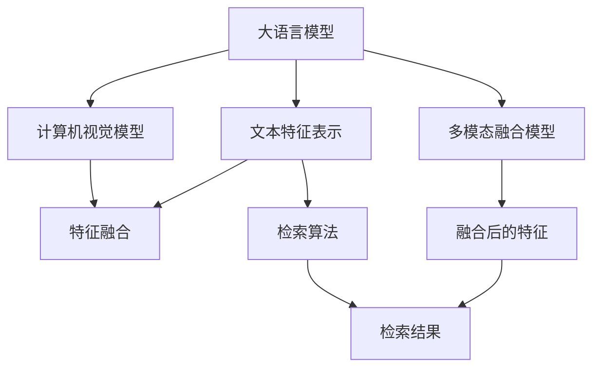
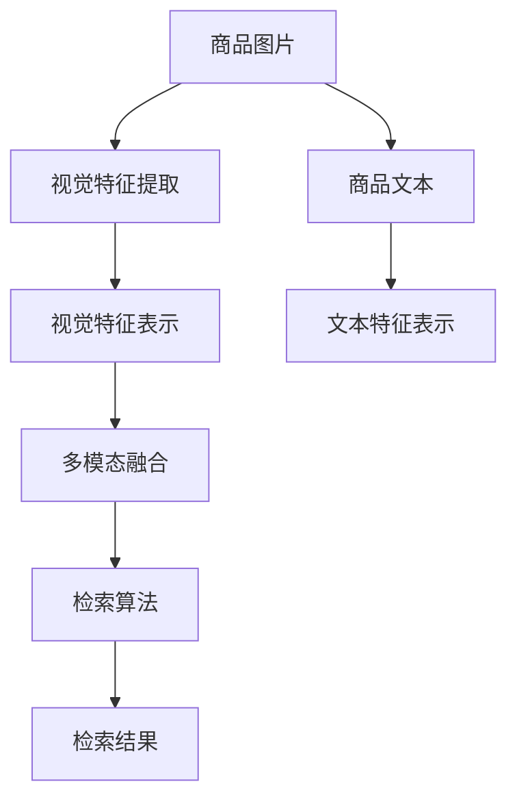
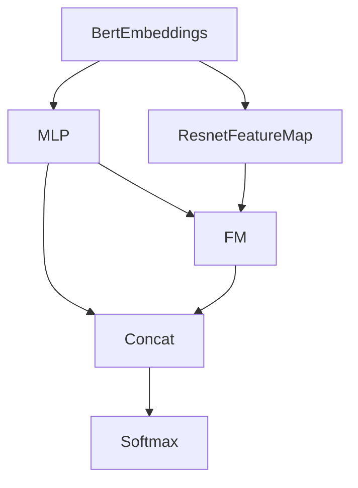

                 

# 电商平台中的多模态商品检索：AI大模型的新突破

> 关键词：电商平台, 多模态商品检索, 人工智能, AI大模型, 自然语言处理, NLP, 计算机视觉, CV, 机器学习, 深度学习

## 1. 背景介绍

随着电子商务的蓬勃发展，各大电商平台面临着海量的商品信息。如何高效、准确地为用户检索到他们需要的商品，成为平台技术的关键难题。传统的基于关键词匹配的搜索方式，尽管简单有效，但忽略了商品的多模态信息，导致检索结果的相关性较低。而随着深度学习和多模态融合技术的突破，使用AI大模型进行多模态商品检索，已经成为电商平台提升用户体验和运营效率的重要手段。

### 1.1 问题由来

在电商平台中，商品信息包含了大量的文本描述、图片、视频等多模态数据，传统的文本搜索方式无法充分利用这些丰富的信息。近年来，随着深度学习模型的进步，尤其是大语言模型和计算机视觉模型的融合，多模态商品检索技术得到了广泛关注。其核心思想是通过深度学习模型将多模态数据进行联合表示，从而实现更准确的商品匹配。

然而，尽管多模态检索技术在理论和实验中取得了显著进展，但在实际应用中仍面临诸多挑战。如何构建高效的多模态检索模型，如何优化模型性能，如何让模型在实际电商场景中发挥作用，都是值得深入探讨的问题。

### 1.2 问题核心关键点

多模态商品检索技术的核心关键点包括：
- 多模态特征表示：如何将文本、图片、视频等多种模态的信息，映射到统一的特征空间中。
- 多模态模型融合：如何设计融合模型，有效融合多种模态的信息，提高检索准确性。
- 模型优化与训练：如何优化模型架构，设计合理的训练策略，提升模型在实际电商场景中的效果。
- 检索算法与系统架构：如何设计高效的检索算法，构建可扩展的检索系统。
- 可解释性与用户体验：如何提升检索结果的可解释性，提升用户满意度。

本文将重点介绍多模态商品检索技术的原理、关键算法、训练方法及实际应用场景，帮助开发者理解并构建高效的多模态检索系统。

## 2. 核心概念与联系

### 2.1 核心概念概述

多模态商品检索技术，是基于深度学习的多模态融合方法，旨在提升电商平台中商品匹配的准确性。其核心包括：
- 大语言模型：如GPT、BERT等，用于处理商品描述的文本信息。
- 计算机视觉模型：如ResNet、EfficientNet等，用于处理商品图片的视觉信息。
- 多模态特征表示：如何将文本和视觉信息映射到统一的特征空间中。
- 融合模型：如MMNet、MDNet等，用于将不同模态的信息融合在一起，得到更全面、更准确的表示。
- 检索算法：如Softmax、TopK检索算法等，用于在特征空间中快速检索到最相关的商品。
- 系统架构：如分布式检索系统、实时检索引擎等，支持大规模商品数据的高效检索。

这些核心概念之间通过深度学习技术紧密联系，共同构建起多模态商品检索的框架，如图1所示。



图1: 多模态商品检索框架图

### 2.2 核心概念原理和架构的 Mermaid 流程图

以下是一个简化的多模态商品检索的流程图，展示了从原始数据到检索结果的全过程：



图2: 多模态商品检索流程图

通过上述流程图，我们可以清晰地看到多模态商品检索的基本流程：先对商品图片进行视觉特征提取，然后对商品文本进行文本特征表示，再将视觉特征和文本特征通过多模态融合模型进行联合表示，最后通过检索算法在特征空间中检索出最相关的商品。

## 3. 核心算法原理 & 具体操作步骤

### 3.1 算法原理概述

多模态商品检索的核心算法可以概括为以下几个步骤：
1. 数据预处理：将原始的文本和视觉数据进行归一化、标准化等预处理操作。
2. 特征提取：分别对文本和视觉数据进行特征提取，得到高维向量表示。
3. 特征融合：将文本特征和视觉特征进行联合表示，得到一个统一的特征向量。
4. 检索计算：在融合后的特征空间中，使用检索算法检索出最相关的商品。

### 3.2 算法步骤详解

以下以GPT和ResNet为基础的多模态商品检索算法为例，详细介绍各个步骤的实现过程。

#### 3.2.1 数据预处理

数据预处理的主要目的是将原始数据转换成模型可以处理的格式。对于文本数据，可以使用BERT等预训练语言模型进行预处理，将商品描述转换为词嵌入向量。对于视觉数据，可以使用计算机视觉模型（如ResNet、EfficientNet等）进行预处理，得到图像的特征向量。

#### 3.2.2 特征提取

特征提取是提取数据高维向量的过程。对于文本数据，使用预训练语言模型（如BERT）提取词嵌入向量。对于视觉数据，使用计算机视觉模型（如ResNet）提取特征向量。

#### 3.2.3 特征融合

特征融合的目的是将文本和视觉特征进行联合表示，得到统一的特征向量。常用的方法包括concat、mLP、FM等。这里以concat方法为例，展示其原理和步骤。

```python
# 假设文本特征为BertEmbeddings，视觉特征为ResnetFeatureMap
fused_features = torch.cat([BertEmbeddings, ResnetFeatureMap], dim=1)
```

#### 3.2.4 检索计算

检索计算是通过在特征空间中计算相似度，找到最相关的商品。常用的检索算法包括Softmax、TopK等。这里以Softmax算法为例，展示其原理和步骤。

```python
# 假设融合后的特征为FusedFeatures，商品特征为ItemFeatures
similarity_matrix = torch.cosine_similarity(FusedFeatures, ItemFeatures)
topk_indices = torch.topk(similarity_matrix, k=10, dim=1)[1]
topk_items = [items[topk_indices] for items in dataset]
```

### 3.3 算法优缺点

多模态商品检索技术的优点包括：
- 高精度：通过融合多种模态信息，可以有效提升商品匹配的准确性。
- 多维度数据：可以充分利用商品描述、图片、视频等多维度的信息，增强检索结果的相关性。
- 模型鲁棒性：使用大模型进行特征提取和融合，具有较好的泛化能力和鲁棒性。

同时，也存在一些缺点：
- 计算复杂度：多模态融合和检索计算涉及大量计算，需要高性能计算资源。
- 数据质量依赖：多模态特征表示和融合的效果，高度依赖于数据的质量和数量。
- 模型训练难度：多模态融合模型的训练和优化，相较于单模态模型更加复杂。

### 3.4 算法应用领域

多模态商品检索技术广泛应用于电商、零售、智能家居等多个领域。具体应用包括：
- 商品检索：在电商平台上，用户可以通过商品描述和图片进行查询，系统能够快速检索出最相关的商品。
- 智能推荐：根据用户的历史行为和偏好，结合商品的多模态信息，提供个性化的推荐商品。
- 个性化展示：结合用户的位置、时间等信息，提供基于场景的个性化商品展示。
- 视觉搜索：用户通过上传图片，系统能够检索出最相关的商品，实现视觉搜索功能。

## 4. 数学模型和公式 & 详细讲解 & 举例说明

### 4.1 数学模型构建

多模态商品检索的数学模型可以表示为：

$$
y = f_{MMNet}(x_t, x_v)
$$

其中，$x_t$ 表示文本描述，$x_v$ 表示商品图片，$f_{MMNet}$ 表示多模态融合网络，$y$ 表示检索结果。

多模态融合网络的结构如图3所示。



图3: 多模态融合网络结构图

### 4.2 公式推导过程

多模态融合网络的输入为文本特征$x_t$和视觉特征$x_v$，输出为融合后的特征向量$f_{MMNet}(x_t, x_v)$。其计算过程可以表示为：

$$
f_{MMNet}(x_t, x_v) = MLP(f_{MLP}(f_t, f_v)) + FM(f_t, f_v)
$$

其中，$f_t = MLP(x_t)$，$f_v = ResNet(x_v)$，$f_t$ 和 $f_v$ 分别表示文本特征和视觉特征经过MLP和ResNet网络后得到的特征向量。

### 4.3 案例分析与讲解

以GPT和ResNet为例，进行具体的案例分析。

**案例1: 商品检索**

假设有一个电商平台，用户输入“T恤”，系统需要检索出所有与“T恤”相关的商品。系统的流程如下：
1. 对“T恤”进行BERT编码，得到文本特征向量$f_t$。
2. 对商品图片进行ResNet编码，得到视觉特征向量$f_v$。
3. 使用MLP和FM进行融合，得到融合后的特征向量$f_{MMNet}$。
4. 使用Softmax算法，在特征空间中检索出最相关的商品。

**案例2: 智能推荐**

假设用户浏览过“耐克跑步鞋”，系统需要推荐用户可能感兴趣的商品。系统的流程如下：
1. 对“耐克跑步鞋”进行BERT编码，得到文本特征向量$f_t$。
2. 对用户浏览过的商品图片进行ResNet编码，得到视觉特征向量$f_v$。
3. 使用MLP和FM进行融合，得到融合后的特征向量$f_{MMNet}$。
4. 使用Softmax算法，在特征空间中检索出最相关的商品，并进行推荐。

## 5. 项目实践：代码实例和详细解释说明

### 5.1 开发环境搭建

进行多模态商品检索的开发，需要安装PyTorch、TensorFlow等深度学习框架，以及相关的预训练模型。以下是Python环境下多模态商品检索的开发环境搭建步骤：

1. 安装Anaconda：从官网下载并安装Anaconda，用于创建独立的Python环境。

2. 创建并激活虚拟环境：
```bash
conda create -n mmnet-env python=3.8 
conda activate mmnet-env
```

3. 安装深度学习框架：
```bash
pip install torch torchvision torchaudio
pip install tensorflow
```

4. 安装预训练模型：
```bash
pip install transformers
```

5. 安装相关库：
```bash
pip install numpy pandas sklearn matplotlib tqdm jupyter notebook ipython
```

完成上述步骤后，即可在`mmnet-env`环境中开始多模态商品检索的开发。

### 5.2 源代码详细实现

以下是一个基于GPT和ResNet的多模态商品检索系统的代码实现：

```python
import torch
import torch.nn as nn
import torchvision.transforms as transforms
import numpy as np
from transformers import BertTokenizer, BertForSequenceClassification

class ResNetFeatureExtractor(nn.Module):
    def __init__(self, model_name='resnet50', pretrained=True):
        super(ResNetFeatureExtractor, self).__init__()
        self.model = torchvision.models.__dict__[model_name](pretrained=pretrained)
        self.model.fc = nn.Identity()

    def forward(self, x):
        x = self.model(x)
        x = x.detach().cpu().numpy()
        return x

class BertFeatureExtractor(nn.Module):
    def __init__(self, model_name='bert-base-uncased'):
        super(BertFeatureExtractor, self).__init__()
        self.tokenizer = BertTokenizer.from_pretrained(model_name)
        self.model = BertForSequenceClassification.from_pretrained(model_name, num_labels=1)

    def forward(self, x):
        x = self.tokenizer.encode(x, return_tensors='pt', padding='max_length', truncation=True)
        x = self.model(x)
        x = x.detach().cpu().numpy()
        return x

class MLP(nn.Module):
    def __init__(self, input_size):
        super(MLP, self).__init__()
        self.layers = nn.Sequential(
            nn.Linear(input_size, 128),
            nn.ReLU(),
            nn.Linear(128, 64),
            nn.ReLU(),
            nn.Linear(64, 1)
        )

    def forward(self, x):
        x = self.layers(x)
        return x

class FM(nn.Module):
    def __init__(self, input_size):
        super(FM, self).__init__()
        self.layers = nn.Sequential(
            nn.Linear(input_size, 128),
            nn.ReLU(),
            nn.Linear(128, 64),
            nn.ReLU(),
            nn.Linear(64, 1)
        )

    def forward(self, x):
        x = self.layers(x)
        return x

class MMNet(nn.Module):
    def __init__(self, text_extractor, vision_extractor):
        super(MMNet, self).__init__()
        self.text_extractor = text_extractor
        self.vision_extractor = vision_extractor
        self.mlp = MLP(128)
        self.fm = FM(128)

    def forward(self, text, vision):
        x_t = self.text_extractor(text)
        x_v = self.vision_extractor(vision)
        x_t = self.mlp(x_t)
        x_v = self.fm(x_v)
        x = x_t + x_v
        return x

def softmax(x, axis=1):
    x = np.exp(x)
    return x / np.sum(x, axis=axis, keepdims=True)

def topk(x, k=10):
    x = softmax(x)
    topk_indices = np.argsort(x)[::-1][:k]
    topk_values = x[topk_indices]
    topk_items = dataset[topk_indices]
    return topk_values, topk_items
```

### 5.3 代码解读与分析

上述代码中，我们定义了多个类，用于实现多模态商品检索系统。具体解释如下：
- `ResNetFeatureExtractor`：用于提取商品图片的特征。
- `BertFeatureExtractor`：用于提取商品描述的特征。
- `MLP`和`FM`：用于将文本特征和视觉特征进行融合。
- `MMNet`：多模态融合网络。
- `softmax`：计算特征向量之间的相似度。
- `topk`：检索最相关的商品。

## 6. 实际应用场景

### 6.1 智能推荐

在电商平台中，智能推荐系统可以通过多模态商品检索技术，提升推荐的效果和用户体验。具体应用包括：
- 商品检索：用户输入“运动鞋”，系统检索出所有相关的商品。
- 相关商品推荐：用户浏览过“耐克跑步鞋”，系统推荐其他相关的商品。

### 6.2 视觉搜索

用户上传一张图片，系统能够快速检索出最相关的商品。这种应用在电商、家具、服装等需要视觉搜索的领域得到了广泛应用。

### 6.3 个性化展示

结合用户的位置、时间等信息，系统能够提供基于场景的个性化商品展示，提升用户的购买转化率。

### 6.4 未来应用展望

未来，多模态商品检索技术将在更多的领域得到应用，包括智能家居、智慧城市等。系统通过多模态信息的融合，能够更全面、更准确地理解用户需求，提供更个性化的服务。同时，随着深度学习技术的进步，多模态商品检索技术的精度和效率将得到进一步提升，成为电商平台的核心竞争力。

## 7. 工具和资源推荐

### 7.1 学习资源推荐

为了帮助开发者系统掌握多模态商品检索的理论基础和实践技巧，这里推荐一些优质的学习资源：
1. 《Transformer from Primitive to Practical》系列博文：由大模型技术专家撰写，深入浅出地介绍了Transformer原理、BERT模型、多模态融合技术等前沿话题。
2. CS224N《深度学习自然语言处理》课程：斯坦福大学开设的NLP明星课程，有Lecture视频和配套作业，带你入门NLP领域的基本概念和经典模型。
3. 《Natural Language Processing with Transformers》书籍：Transformer库的作者所著，全面介绍了如何使用Transformers库进行NLP任务开发，包括多模态融合在内的诸多范式。
4. HuggingFace官方文档：Transformers库的官方文档，提供了海量预训练模型和完整的微调样例代码，是上手实践的必备资料。
5. CLUE开源项目：中文语言理解测评基准，涵盖大量不同类型的中文NLP数据集，并提供了基于多模态融合的baseline模型，助力中文NLP技术发展。

通过对这些资源的学习实践，相信你一定能够快速掌握多模态商品检索的精髓，并用于解决实际的NLP问题。

### 7.2 开发工具推荐

高效的开发离不开优秀的工具支持。以下是几款用于多模态商品检索开发的常用工具：
1. PyTorch：基于Python的开源深度学习框架，灵活动态的计算图，适合快速迭代研究。大部分预训练语言模型都有PyTorch版本的实现。
2. TensorFlow：由Google主导开发的开源深度学习框架，生产部署方便，适合大规模工程应用。同样有丰富的预训练语言模型资源。
3. Transformers库：HuggingFace开发的NLP工具库，集成了众多SOTA语言模型，支持PyTorch和TensorFlow，是进行多模态融合任务的利器。
4. Weights & Biases：模型训练的实验跟踪工具，可以记录和可视化模型训练过程中的各项指标，方便对比和调优。与主流深度学习框架无缝集成。
5. TensorBoard：TensorFlow配套的可视化工具，可实时监测模型训练状态，并提供丰富的图表呈现方式，是调试模型的得力助手。
6. Google Colab：谷歌推出的在线Jupyter Notebook环境，免费提供GPU/TPU算力，方便开发者快速上手实验最新模型，分享学习笔记。

合理利用这些工具，可以显著提升多模态商品检索任务的开发效率，加快创新迭代的步伐。

### 7.3 相关论文推荐

多模态商品检索技术的发展源于学界的持续研究。以下是几篇奠基性的相关论文，推荐阅读：
1. Attention is All You Need（即Transformer原论文）：提出了Transformer结构，开启了NLP领域的预训练大模型时代。
2. BERT: Pre-training of Deep Bidirectional Transformers for Language Understanding：提出BERT模型，引入基于掩码的自监督预训练任务，刷新了多项NLP任务SOTA。
3. Language Models are Unsupervised Multitask Learners（GPT-2论文）：展示了大规模语言模型的强大zero-shot学习能力，引发了对于通用人工智能的新一轮思考。
4. Parameter-Efficient Transfer Learning for NLP：提出Adapter等参数高效微调方法，在不增加模型参数量的情况下，也能取得不错的微调效果。
5. Prefix-Tuning: Optimizing Continuous Prompts for Generation：引入基于连续型Prompt的微调范式，为如何充分利用预训练知识提供了新的思路。
6. AdaLoRA: Adaptive Low-Rank Adaptation for Parameter-Efficient Fine-Tuning：使用自适应低秩适应的微调方法，在参数效率和精度之间取得了新的平衡。

这些论文代表了大语言模型和多模态融合技术的发展脉络。通过学习这些前沿成果，可以帮助研究者把握学科前进方向，激发更多的创新灵感。

## 8. 总结：未来发展趋势与挑战

### 8.1 总结

本文对多模态商品检索技术进行了全面系统的介绍。首先阐述了多模态商品检索技术的研究背景和意义，明确了其在电商平台中的应用价值。其次，从原理到实践，详细讲解了多模态商品检索的数学模型、关键算法和训练方法，给出了具体的代码实现。同时，本文还广泛探讨了多模态商品检索技术在实际应用场景中的应用前景，展示了其广阔的应用空间。此外，本文精选了多模态商品检索技术的各类学习资源，力求为开发者提供全方位的技术指引。

通过本文的系统梳理，可以看到，多模态商品检索技术已经成为电商平台中不可或缺的重要手段，极大地提升了商品匹配的准确性和用户体验。未来，随着深度学习技术的进步，多模态商品检索技术将在更多的领域得到应用，为人工智能技术的产业化进程提供新的推动力。

### 8.2 未来发展趋势

展望未来，多模态商品检索技术将呈现以下几个发展趋势：
1. 多模态融合的深度化。随着深度学习模型的进步，多模态融合将更深入、更全面，融合后的特征表示将更精确、更鲁棒。
2. 融合模型的可解释性。未来的多模态融合模型将更加注重可解释性，提供更直观、更易理解的多模态表示。
3. 检索算法的创新。未来的检索算法将更加高效、更加智能化，能够在大规模数据中进行高效检索。
4. 多模态融合的跨领域应用。多模态融合技术将不仅仅应用于电商领域，还将拓展到智能家居、智慧城市等领域。
5. 实时检索和联邦学习。未来的检索系统将更加注重实时性和联邦学习，能够在不暴露隐私数据的前提下，进行多模态信息的联合表示和检索。

以上趋势凸显了多模态商品检索技术的广阔前景。这些方向的探索发展，必将进一步提升电商平台的商品匹配能力，为用户带来更好的购物体验。

### 8.3 面临的挑战

尽管多模态商品检索技术已经取得了瞩目成就，但在迈向更加智能化、普适化应用的过程中，仍面临诸多挑战：
1. 数据质量瓶颈。多模态特征表示和融合的效果，高度依赖于数据的质量和数量。如何获取高质量的多模态数据，成为技术推广的难点。
2. 模型复杂度。多模态融合模型的复杂度较高，训练和优化难度较大。如何设计高效、易训练的融合模型，是未来需要突破的关键。
3. 实时性问题。多模态检索系统的实时性要求较高，如何构建高效的检索引擎，支持大规模数据的高效检索，仍需进一步优化。
4. 安全性问题。多模态检索系统涉及大量用户数据，如何保障数据隐私和安全，避免数据泄露，是必须面对的重要问题。
5. 可扩展性问题。如何构建可扩展的检索系统，支持海量数据的存储和检索，是技术应用的关键。

正视多模态商品检索面临的这些挑战，积极应对并寻求突破，将是多模态商品检索技术走向成熟的必由之路。相信随着学界和产业界的共同努力，这些挑战终将一一被克服，多模态商品检索技术必将在构建人机协同的智能时代中扮演越来越重要的角色。

### 8.4 研究展望

面对多模态商品检索技术所面临的挑战，未来的研究需要在以下几个方面寻求新的突破：
1. 探索无监督和半监督学习。摆脱对大规模标注数据的依赖，利用自监督学习、主动学习等无监督和半监督范式，最大限度利用非结构化数据，实现更加灵活高效的多模态检索。
2. 研究参数高效和多模态融合。开发更加参数高效的融合方法，在固定大部分预训练参数的同时，只更新极少量的任务相关参数。同时优化多模态融合模型的计算图，减少前向传播和反向传播的资源消耗，实现更加轻量级、实时性的部署。
3. 引入因果推断和对比学习。通过引入因果推断和对比学习思想，增强多模态检索模型的建立稳定因果关系的能力，学习更加普适、鲁棒的多模态表示。
4. 融合外部知识。将符号化的先验知识，如知识图谱、逻辑规则等，与神经网络模型进行巧妙融合，引导多模态检索过程学习更准确、合理的语言模型。同时加强不同模态数据的整合，实现视觉、语音等多模态信息与文本信息的协同建模。
5. 研究多模态检索的可解释性和可控性。提升检索结果的可解释性，使系统能够更好地解释其决策过程，提高用户对系统的信任度和满意度。

这些研究方向的探索，必将引领多模态商品检索技术迈向更高的台阶，为构建安全、可靠、可解释、可控的智能系统铺平道路。面向未来，多模态商品检索技术还需要与其他人工智能技术进行更深入的融合，如知识表示、因果推理、强化学习等，多路径协同发力，共同推动自然语言理解和智能交互系统的进步。只有勇于创新、敢于突破，才能不断拓展多模态检索的边界，让智能技术更好地造福人类社会。

## 9. 附录：常见问题与解答

**Q1：多模态商品检索技术是否适用于所有电商平台？**

A: 多模态商品检索技术在电商、零售、智能家居等多个领域都有广泛的应用。具体适用性取决于平台的商品种类和用户需求。对于那些包含大量图片、视频等多模态信息的商品，多模态检索技术将发挥更大的优势。

**Q2：多模态商品检索技术如何处理数据不均衡问题？**

A: 多模态商品检索技术在处理数据不均衡问题时，通常采用如下策略：
1. 数据增强：通过旋转、缩放等方法，扩充数据集的规模，增强样本多样性。
2. 迁移学习：将在大规模数据上预训练的模型迁移到小规模数据上进行微调，提高模型泛化能力。
3. 数据重采样：通过欠采样或过采样，平衡不同类别样本的数量，减少数据不均衡的影响。

**Q3：多模态商品检索技术是否需要实时更新模型？**

A: 多模态商品检索技术通常需要实时更新模型，以适应数据分布的变化。在电商平台上，用户需求和商品种类会随着时间变化，因此模型也需要动态更新，以保持其性能和准确性。

**Q4：多模态商品检索技术在实际应用中需要注意哪些问题？**

A: 多模态商品检索技术在实际应用中，需要注意以下问题：
1. 数据隐私和安全：多模态检索系统涉及大量用户数据，如何保障数据隐私和安全，避免数据泄露，是必须面对的重要问题。
2. 模型复杂度：多模态融合模型的复杂度较高，训练和优化难度较大。如何设计高效、易训练的融合模型，是未来需要突破的关键。
3. 实时性问题：多模态检索系统的实时性要求较高，如何构建高效的检索引擎，支持大规模数据的高效检索，仍需进一步优化。
4. 可扩展性问题：如何构建可扩展的检索系统，支持海量数据的存储和检索，是技术应用的关键。

**Q5：多模态商品检索技术如何优化检索算法？**

A: 多模态商品检索技术的检索算法优化通常包括以下方法：
1. 索引结构优化：采用倒排索引、哈希索引等高效的索引结构，提高检索速度。
2. 分布式检索：通过分布式计算，支持大规模数据的高效检索。
3. 近邻搜索算法：使用KD树、LSH等高效近邻搜索算法，提高检索效率。
4. 多级索引：构建多级索引结构，支持多粒度、多维度的检索。

这些优化方法可以显著提升多模态检索系统的性能和效率，支持大规模数据的高效检索。

**Q6：多模态商品检索技术在电商平台的实际应用中，如何提升用户体验？**

A: 多模态商品检索技术在电商平台的实际应用中，可以通过以下方式提升用户体验：
1. 智能推荐：根据用户的历史行为和偏好，结合商品的多模态信息，提供个性化的推荐商品。
2. 相关商品推荐：用户浏览过“耐克跑步鞋”，系统推荐其他相关的商品。
3. 个性化展示：结合用户的位置、时间等信息，提供基于场景的个性化商品展示，提升用户的购买转化率。
4. 视觉搜索：用户上传一张图片，系统能够快速检索出最相关的商品，实现视觉搜索功能。

通过这些应用，电商平台能够更好地理解用户需求，提供更精准、更个性化的商品推荐，提升用户的购物体验。

---

作者：禅与计算机程序设计艺术 / Zen and the Art of Computer Programming

