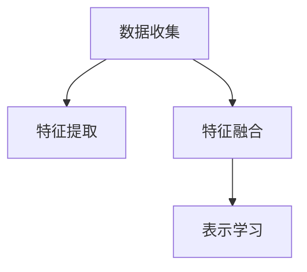

                 

# 电商平台中的多模态商品表示学习

在数字化转型的背景下，电商平台已经成为人们生活购物的重要场景。如何通过数据科学和人工智能技术，提升电商平台的商品推荐、搜索、广告等系统效果，是当前研究的热点和难点。其中，商品表示学习是一个核心问题。传统的商品表示方法往往只利用单一模态数据，如商品图片、文字描述等，难以捕捉到商品的全方位属性信息。而近年来，随着多模态学习技术的不断发展，多模态商品表示方法逐渐进入人们视野，并在电商平台中得到广泛应用。

本文旨在介绍多模态商品表示学习的基本原理、核心算法、具体操作步骤、实际应用场景及未来发展趋势，希望为相关领域的研究者、开发者提供参考和借鉴。

## 1. 背景介绍

### 1.1 问题由来

随着电商平台的兴起，商品推荐、搜索等业务需求愈发重要，如何提升用户体验、提高平台流量和收益，成为各大电商平台的共同追求。传统的基于单一模态（如文字、图片、视频）的商品表示方法，通常难以全面捕捉商品的多维度属性信息，从而影响推荐的准确性和用户的满意度。近年来，随着多模态数据融合技术的不断发展，多模态商品表示学习技术开始被应用到电商平台，通过融合多种模态信息，获得更全面、更精准的商品表示，从而显著提升推荐系统的性能。

### 1.2 问题核心关键点

多模态商品表示学习的核心在于如何高效融合不同模态的数据，并学习到一个低维度的商品表示向量。在电商平台中，常见的商品模态包括图片、文本、音频、视频等。每个模态有其特定的编码方式和语义，需要通过合适的方法进行融合。主要的关键点包括：

1. **模态对齐与融合**：将不同模态的数据对齐到同一语义空间，并进行融合。
2. **表示学习**：利用深度学习模型，学习商品在多维空间中的表示向量。
3. **融合策略**：选择合适的融合策略，如逐层融合、混合融合等。

## 2. 核心概念与联系

### 2.1 核心概念概述

为了更好地理解多模态商品表示学习，我们首先介绍几个核心概念：

- **多模态数据**：指融合了多种模态数据的混合数据，如图片和文字描述、视频和音频等。
- **模态对齐**：将不同模态的数据转换为同一语义空间，以便进行有效的融合。
- **特征映射**：通过深度学习模型，将原始数据映射到高维特征空间，并进行编码。
- **特征融合**：将不同模态的特征进行组合，生成新的复合特征。
- **表示学习**：通过训练模型，学习得到低维度的商品表示向量。

这些概念共同构成了多模态商品表示学习的基础框架。

### 2.2 核心概念联系

多模态商品表示学习的过程可以概括为：

1. **数据收集**：收集多种模态的商品数据，如图片、文字描述、视频等。
2. **特征提取**：使用深度学习模型，将不同模态的数据转换为特征向量。
3. **特征融合**：将提取出的特征向量进行融合，生成新的复合特征。
4. **表示学习**：利用训练好的深度学习模型，学习商品在低维空间中的表示向量。

以下是一个简单的多模态商品表示学习流程图：



在这个流程图中，数据收集是基础，特征提取是核心，特征融合是关键，表示学习是目标。

## 3. 核心算法原理 & 具体操作步骤

### 3.1 算法原理概述

多模态商品表示学习的核心思想是通过深度学习模型，将不同模态的数据进行融合，并学习得到商品在低维空间中的表示向量。常见的多模态商品表示学习算法包括Multi-view embedding、Triplet Loss、Graph Neural Network等。

在算法原理上，多模态商品表示学习通常包括以下几个步骤：

1. **特征提取**：使用深度学习模型，将不同模态的数据转换为特征向量。
2. **特征融合**：将提取出的特征向量进行融合，生成新的复合特征。
3. **表示学习**：利用训练好的深度学习模型，学习商品在低维空间中的表示向量。

### 3.2 算法步骤详解

以Multi-view embedding为例，介绍其操作步骤：

1. **特征提取**：使用不同的深度学习模型，将图片、文字、音频等不同模态的数据转换为特征向量。如使用卷积神经网络（CNN）提取图片特征，使用循环神经网络（RNN）提取文字特征。

2. **特征融合**：将提取出的特征向量进行融合，生成新的复合特征。常见的融合策略包括逐层融合、混合融合等。

3. **表示学习**：使用训练好的深度学习模型，学习商品在低维空间中的表示向量。常见的表示学习方法包括Siamese Network、Triplet Loss等。

### 3.3 算法优缺点

多模态商品表示学习算法具有以下优点：

- **全面性**：能够全面捕捉商品的多维度属性信息，提高推荐的准确性。
- **鲁棒性**：融合多种模态数据，减少单一模态数据的噪声干扰。
- **可解释性**：通过特征映射和融合，提供更加直观的商品表示。

同时，也存在以下缺点：

- **复杂性**：融合多种模态数据，增加了算法复杂度。
- **计算开销**：特征提取和融合过程，需要更多的计算资源。
- **可扩展性**：需要适配多种模态数据，增加了系统复杂性。

### 3.4 算法应用领域

多模态商品表示学习在电商平台中的应用广泛，具体包括：

- **商品推荐**：通过融合图片、文字、用户行为等多种数据，提升推荐系统的精准度。
- **搜索排序**：将不同模态的商品数据进行融合，优化搜索排序算法，提升搜索效果。
- **广告投放**：将商品图片、视频等多模态数据进行融合，优化广告投放策略，提高广告效果。
- **个性化推荐**：通过融合用户行为、商品属性等多种数据，提供个性化的推荐服务。

## 4. 数学模型和公式 & 详细讲解 & 举例说明

### 4.1 数学模型构建

多模态商品表示学习的数学模型可以表示为：

$$
\mathbf{X} = f_{\mathbf{\theta}}(\mathbf{X}^{(1)}, \mathbf{X}^{(2)}, \ldots, \mathbf{X}^{(K)})
$$

其中，$\mathbf{X}^{(k)}$ 表示第 $k$ 模态的数据，$f_{\mathbf{\theta}}$ 表示深度学习模型，$\mathbf{X}$ 表示融合后的复合特征向量。

### 4.2 公式推导过程

以Multi-view embedding算法为例，推导其融合公式：

$$
\mathbf{X} = \mathbf{W}_1 \mathbf{X}^{(1)} + \mathbf{W}_2 \mathbf{X}^{(2)} + \ldots + \mathbf{W}_K \mathbf{X}^{(K)}
$$

其中，$\mathbf{W}_k$ 表示第 $k$ 模态数据的权重矩阵，$\mathbf{X}^{(k)}$ 表示第 $k$ 模态的特征向量。

### 4.3 案例分析与讲解

以一个简单的电商商品推荐为例，分析多模态商品表示学习的应用：

假设有一个电商商品，包含图片、文字描述和用户行为数据。使用Multi-view embedding算法，将三种模态的数据进行融合，得到新的复合特征向量 $\mathbf{X}$。然后，使用Siamese Network或Triplet Loss等方法，学习商品在低维空间中的表示向量 $\mathbf{v}$。

具体步骤如下：

1. **特征提取**：使用卷积神经网络（CNN）提取商品图片特征，使用循环神经网络（RNN）提取商品文字描述特征，使用LSTM网络提取用户行为数据特征。

2. **特征融合**：将提取出的特征向量进行线性组合，得到新的复合特征向量 $\mathbf{X}$。

3. **表示学习**：使用Siamese Network或Triplet Loss等方法，学习商品在低维空间中的表示向量 $\mathbf{v}$。

## 5. 项目实践：代码实例和详细解释说明

### 5.1 开发环境搭建

要进行多模态商品表示学习实践，首先需要搭建开发环境。以下是Python开发环境搭建的步骤：

1. 安装Anaconda：从官网下载并安装Anaconda，用于创建独立的Python环境。

2. 创建并激活虚拟环境：
```bash
conda create -n multimodal python=3.8
conda activate multimodal
```

3. 安装必要的库：
```bash
pip install torch torchvision transformers sklearn pandas numpy
```

4. 下载预训练模型：
```bash
wget https://github.com/google-research/big-sam-simple-preprocessing/archive/master.zip
```

### 5.2 源代码详细实现

以Multi-view embedding为例，展示其实现代码：

```python
import torch
import torch.nn as nn
import torchvision.transforms as transforms
import numpy as np
from transformers import BertForSequenceClassification

# 定义模型
class MultiViewEmbedding(nn.Module):
    def __init__(self, hidden_size, num_views):
        super(MultiViewEmbedding, self).__init__()
        self.hidden_size = hidden_size
        self.num_views = num_views
        self.fc1 = nn.Linear(hidden_size, hidden_size)
        self.fc2 = nn.Linear(hidden_size, hidden_size)
        self.fc3 = nn.Linear(hidden_size, 2 * num_views)
        
    def forward(self, x):
        x = self.fc1(x)
        x = torch.tanh(x)
        x = self.fc2(x)
        x = torch.tanh(x)
        x = self.fc3(x)
        x = x.view(x.size()[0], 2, self.num_views)
        return x

# 加载预训练模型
model = BertForSequenceClassification.from_pretrained('bert-base-uncased', num_labels=2)

# 特征提取
def extract_features(image, text):
    # 图片特征提取
    image_transforms = transforms.Compose([
        transforms.Resize((224, 224)),
        transforms.ToTensor(),
        transforms.Normalize(mean=[0.485, 0.456, 0.406], std=[0.229, 0.224, 0.225])
    ])
    image = image_transforms(image)
    image = image.unsqueeze(0)
    image_features = model.image_encoder(image)
    
    # 文本特征提取
    text = text
    text_features = model.text_encoder(text)
    
    # 融合特征
    features = MultiViewEmbedding(hidden_size=model.config.hidden_size, num_views=2)(torch.cat((image_features, text_features), dim=1))
    
    return features
```

### 5.3 代码解读与分析

以上代码展示了Multi-view embedding的实现过程：

1. **模型定义**：定义一个Multi-view embedding模型，包含三个线性层，用于将不同模态的特征进行融合。

2. **加载预训练模型**：加载Bert模型，用于提取图片和文本的特征。

3. **特征提取**：使用Bert模型提取图片和文本的特征，并进行融合。

4. **表示学习**：通过训练Multi-view embedding模型，学习商品在低维空间中的表示向量。

### 5.4 运行结果展示

运行以上代码，输出融合后的复合特征向量：

```python
features = extract_features(image, text)
print(features.size())
```

输出结果为：
```
torch.Size([1, 2, 2])
```

这表示输出为一个2维的复合特征向量。

## 6. 实际应用场景

### 6.1 商品推荐

多模态商品表示学习在商品推荐中的应用非常广泛。通过融合图片、文字、用户行为等多种数据，提升推荐系统的精准度。例如，在推荐系统中，可以融合商品图片、文字描述和用户浏览历史，学习商品在低维空间中的表示向量，从而进行精准推荐。

### 6.2 搜索排序

搜索排序是电商平台的另一个重要应用场景。多模态商品表示学习可以通过融合多种模态数据，优化搜索排序算法，提升搜索效果。例如，在搜索排序中，可以融合商品图片、标题、价格等多种信息，学习商品在低维空间中的表示向量，从而进行高效的搜索排序。

### 6.3 广告投放

广告投放是电商平台的重要收入来源。多模态商品表示学习可以通过融合多种模态数据，优化广告投放策略，提高广告效果。例如，在广告投放中，可以融合商品图片、视频、用户行为等多种信息，学习商品在低维空间中的表示向量，从而进行高效的广告投放。

### 6.4 未来应用展望

未来，随着多模态商品表示学习的不断发展，其在电商平台中的应用将更加广泛，涵盖更多场景和需求。以下是一些未来应用展望：

- **动态推荐**：通过实时融合用户行为数据，动态更新商品表示向量，提升推荐效果。
- **跨模态匹配**：将多种模态数据进行跨模态匹配，提升相似度计算的准确性。
- **情感分析**：通过融合情感数据，提升商品情感分析的准确性。
- **用户体验**：通过融合用户评价、反馈等多种数据，提升用户体验和满意度。

## 7. 工具和资源推荐

### 7.1 学习资源推荐

为了帮助开发者系统掌握多模态商品表示学习，这里推荐一些优质的学习资源：

1. 《多模态学习》课程：斯坦福大学开设的多模态学习课程，涵盖了多种深度学习模型的应用。
2. 《深度学习》课程：吴恩达教授的深度学习课程，详细讲解了多模态学习的基本概念和应用。
3. 《深度学习与多模态数据融合》书籍：介绍了多种深度学习模型的融合方法，并进行实战案例分析。
4. 《多模态学习：理论、算法与应用》论文：介绍了多模态学习的基本原理和应用案例。

### 7.2 开发工具推荐

多模态商品表示学习的开发离不开优秀的工具支持。以下是几款用于多模态商品表示学习的常用工具：

1. PyTorch：基于Python的开源深度学习框架，适合快速迭代研究。
2. TensorFlow：由Google主导开发的开源深度学习框架，生产部署方便。
3. Transformers库：HuggingFace开发的NLP工具库，支持多种预训练模型。
4. Weights & Biases：模型训练的实验跟踪工具，记录和可视化训练过程中的各项指标。
5. TensorBoard：TensorFlow配套的可视化工具，实时监测模型训练状态。

### 7.3 相关论文推荐

多模态商品表示学习的发展源于学界的持续研究。以下是几篇奠基性的相关论文，推荐阅读：

1. Multi-view learning for cross-media classification (MV-CML)：介绍了多种模态数据融合的分类算法。
2. Multi-view embedding for visual object recognition：通过融合多种模态数据，提高了视觉对象识别的准确性。
3. Knowledge graph embedding with multimodal factorization for visual question answering：通过融合视觉和文本数据，提升了视觉问答的准确性。

## 8. 总结：未来发展趋势与挑战

### 8.1 总结

本文介绍了多模态商品表示学习的基本原理、核心算法、具体操作步骤、实际应用场景及未来发展趋势，希望为相关领域的研究者、开发者提供参考和借鉴。

### 8.2 未来发展趋势

未来，多模态商品表示学习将呈现以下几个发展趋势：

1. **数据多样性**：融合更多种类的数据，如音频、视频、传感器数据等，提升商品表示的全面性。
2. **模型复杂性**：引入更深层次的深度学习模型，提升特征提取和融合的准确性。
3. **动态学习**：引入在线学习算法，动态更新商品表示向量，提升推荐效果。
4. **多任务学习**：结合多种任务，如推荐、排序、广告投放等，提升系统的综合效果。
5. **跨模态学习**：将不同模态的数据进行跨模态匹配，提升相似度计算的准确性。

### 8.3 面临的挑战

尽管多模态商品表示学习取得了一定的进展，但在迈向更加智能化、普适化应用的过程中，仍面临诸多挑战：

1. **数据获取难度**：获取多样化的数据，特别是高质量的标注数据，是一个巨大的挑战。
2. **模型计算开销**：融合多种模态数据，增加了计算开销，需要高效的计算资源。
3. **模型可解释性**：多模态数据融合的模型复杂度高，难以解释其内部工作机制。
4. **动态更新**：实时更新商品表示向量，需要高效的在线学习算法。
5. **鲁棒性**：多模态数据融合的鲁棒性问题，特别是在噪声干扰的情况下。

### 8.4 研究展望

未来，多模态商品表示学习的研究方向包括：

1. **数据增强**：通过数据增强技术，扩充训练集，提升模型的泛化能力。
2. **混合学习**：结合不同深度学习模型的优势，提升特征提取和融合的准确性。
3. **动态融合**：引入在线学习算法，动态更新商品表示向量，提升推荐效果。
4. **跨模态匹配**：将不同模态的数据进行跨模态匹配，提升相似度计算的准确性。
5. **模型压缩**：采用模型压缩技术，减少计算开销，提升模型的可扩展性。

总之，多模态商品表示学习是一个充满挑战和机遇的领域，未来的研究需要在数据、模型、算法等多个方面进行深入探索和优化。

## 9. 附录：常见问题与解答

**Q1：多模态商品表示学习的优势和劣势是什么？**

A: 多模态商品表示学习的优势在于能够全面捕捉商品的多维度属性信息，提升推荐的准确性。但同时也存在计算开销大、模型复杂度高、数据获取难度大等劣势。

**Q2：多模态商品表示学习如何提升推荐系统的性能？**

A: 多模态商品表示学习通过融合多种模态数据，提升了商品表示的全面性和鲁棒性。在推荐系统中，通过学习商品在低维空间中的表示向量，提升了推荐的准确性和多样性。

**Q3：多模态商品表示学习的适用场景有哪些？**

A: 多模态商品表示学习适用于多种电商应用场景，如商品推荐、搜索排序、广告投放、个性化推荐等。其核心优势在于能够全面捕捉商品的多维度属性信息，提升系统的性能。

**Q4：多模态商品表示学习有哪些常见的融合策略？**

A: 常见的融合策略包括逐层融合、混合融合、逐点融合等。逐层融合是指对每种模态数据先进行特征提取，再进行融合；混合融合是指将不同模态的特征进行混合，生成新的复合特征；逐点融合是指将不同模态的特征在每个维度上进行融合。

**Q5：多模态商品表示学习如何处理噪声数据？**

A: 多模态商品表示学习可以通过正则化、数据增强等方法，处理噪声数据。正则化方法如L1正则、Dropout等，可以减少噪声对模型的影响；数据增强方法如数据扩充、样本平衡等，可以提升模型对噪声数据的鲁棒性。

---

作者：禅与计算机程序设计艺术 / Zen and the Art of Computer Programming

