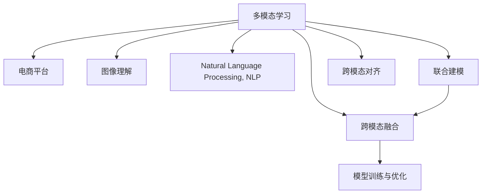

                 

# 电商平台中的多模态学习：图文结合的力量

> 关键词：多模态学习,电商平台,图像理解,自然语言处理,跨模态融合

## 1. 背景介绍

### 1.1 问题由来
随着互联网技术的不断进步，电商平台已逐渐成为人们日常生活购物的重要渠道。然而，传统的电商平台仅依靠文本信息进行搜索和推荐，难以充分满足用户需求。尤其是在商品描述不够详细或图片不够清晰的场景下，用户往往需要浏览大量商品信息才能找到满意的商品。为了提升用户体验，电商平台开始引入多模态信息，结合文本和图像，为用户提供更丰富、更精准的购物体验。

多模态学习(Multimodal Learning)是一种能够处理多种数据模态的学习方法，在自然语言处理(NLP)和计算机视觉(CV)领域得到了广泛应用。通过将文本和图像等多模态信息融合，多模态学习可以更全面地理解用户需求和商品特性，从而提升购物推荐的准确性和个性化程度。

### 1.2 问题核心关键点
多模态学习在电商平台中的应用主要围绕以下几个核心关键点展开：

1. **图文融合**：将商品图片和文本描述融合在一起，提升商品表达的完整性和丰富度。
2. **特征提取**：从图像和文本中提取有意义的特征，增强模型的语义理解能力。
3. **联合建模**：构建能够处理多模态数据、进行跨模态融合的联合模型。
4. **跨模态对齐**：解决不同模态数据之间的对齐问题，提高模型在不同数据上的泛化能力。
5. **模型训练与优化**：采用合适的训练策略和优化算法，提升模型性能。

本文将系统介绍多模态学习在电商平台中的应用，涵盖核心概念、算法原理、操作步骤、数学模型、代码实践、实际应用场景以及未来展望等内容，以期对电商平台的多模态学习实践提供全面的指导。

## 2. 核心概念与联系

### 2.1 核心概念概述

为了更好地理解多模态学习在电商平台中的应用，本节将介绍几个密切相关的核心概念：

- **多模态学习(Multimodal Learning)**：一种能够处理多种数据模态的学习方法，包括文本、图像、音频等多种类型的数据。多模态学习通过融合不同模态的信息，提升模型的泛化能力和任务性能。
- **电商平台(E-commerce Platform)**：指基于互联网的在线销售平台，用户可以通过该平台浏览、购买商品，平台可以提供搜索、推荐、评论等多种功能。
- **图像理解(Image Understanding)**：指计算机对图像中包含的信息进行理解和分析，包括目标检测、图像分割、语义理解等任务。
- **自然语言处理(Natural Language Processing, NLP)**：指计算机对自然语言进行理解、处理和生成，包括文本分类、情感分析、问答系统等任务。
- **跨模态融合(Cross-Modal Fusion)**：指将不同数据模态的信息融合在一起，构建统一的表示，提升模型的任务性能。
- **联合建模(Joint Modeling)**：指在模型训练过程中同时考虑多种数据模态，构建联合学习框架，增强模型的泛化能力和泛用性。
- **跨模态对齐(Cross-Modal Alignment)**：指将不同模态的数据映射到统一的空间中，解决不同模态数据之间的对齐问题，增强模型的泛化能力和鲁棒性。

这些核心概念之间的逻辑关系可以通过以下Mermaid流程图来展示：



这个流程图展示多模态学习在电商平台中的应用场景：

1. 多模态学习处理商品信息，将文本和图像融合在一起。
2. 图像理解模块对商品图片进行目标检测、图像分割等处理，提取有意义的图像特征。
3. 自然语言处理模块对商品描述进行文本分类、情感分析等处理，提取有意义的文本特征。
4. 跨模态融合模块将图像和文本特征融合在一起，构建统一的表示。
5. 联合建模模块同时考虑图像和文本信息，构建联合学习框架，提升模型性能。
6. 跨模态对齐模块解决图像和文本特征之间的对齐问题，增强模型泛化能力。

这些概念共同构成了电商平台中的多模态学习框架，使其能够更好地理解和处理商品信息，提升用户购物体验。

## 3. 核心算法原理 & 具体操作步骤

### 3.1 算法原理概述

多模态学习在电商平台中的应用，主要基于联合建模和跨模态融合的原理。具体而言，以下是对联合建模和跨模态融合的详细解释：

- **联合建模**：在模型训练过程中，同时考虑多种数据模态的信息，通过共享权重或共享中间表示，提升模型的泛化能力和泛用性。联合建模可以采用不同的深度学习架构，如卷积神经网络(CNN)、循环神经网络(RNN)、注意力机制等。

- **跨模态融合**：将不同数据模态的信息融合在一起，构建统一的表示。跨模态融合可以通过特征对齐、特征融合等方式实现，最终生成跨模态的特征表示，增强模型的语义理解能力和泛化能力。

### 3.2 算法步骤详解

多模态学习在电商平台中的应用，通常包括以下关键步骤：

**Step 1: 数据预处理**

- 收集商品图片和文本描述，并对数据进行预处理。包括图像尺寸归一化、文本分词、去除停用词等。

**Step 2: 特征提取**

- 使用预训练的图像理解模型(如ResNet、Inception等)提取商品图片的特征向量。
- 使用预训练的自然语言处理模型(如BERT、RoBERTa等)提取商品文本的特征向量。

**Step 3: 跨模态对齐**

- 通过一定的对齐方法(如最大余弦相似度、KL散度等)，将图像和文本特征映射到统一的空间中。
- 常用的对齐方法包括最大余弦相似度(Maximal Cosine Similarity)、KL散度(Kullback-Leibler Divergence)、行列式核(Determinant Kernel)等。

**Step 4: 特征融合**

- 将对齐后的图像和文本特征进行融合，生成跨模态的特征表示。
- 常用的特征融合方法包括拼接、加权拼接、特征池化等。

**Step 5: 联合建模**

- 构建能够处理多模态数据的联合模型，如基于注意力机制的模型、基于多任务学习的模型等。
- 在联合模型中，图像和文本特征共享权重，增强模型的泛化能力和泛用性。

**Step 6: 模型训练与优化**

- 使用标注数据训练联合模型，最小化联合损失函数。
- 使用合适的优化算法(如Adam、SGD等)进行模型优化。

**Step 7: 评估与部署**

- 在验证集和测试集上评估模型性能，对比微调前后的精度提升。
- 使用微调后的模型进行商品搜索、推荐、评价等任务的推理预测，集成到实际的应用系统中。
- 持续收集新的数据，定期重新训练模型，以适应数据分布的变化。

以上是多模态学习在电商平台中的应用的一般流程。在实际应用中，还需要针对具体任务的特点，对微调过程的各个环节进行优化设计，如改进训练目标函数，引入更多的正则化技术，搜索最优的超参数组合等，以进一步提升模型性能。

### 3.3 算法优缺点

多模态学习在电商平台中的应用具有以下优点：

1. **丰富性**：融合图像和文本信息，提供更丰富的商品信息，提升用户购物体验。
2. **准确性**：多模态融合增强了模型的语义理解能力，提高了购物推荐的准确性。
3. **泛化性**：联合建模提升了模型的泛化能力和泛用性，适应不同商品的多样化需求。
4. **个性化**：跨模态对齐和特征融合增强了模型的个性化推荐能力，提升用户满意度。

同时，该方法也存在一定的局限性：

1. **数据复杂性**：多模态学习需要同时处理多种数据模态，数据处理和存储复杂度较高。
2. **模型复杂性**：多模态融合和联合建模增加了模型的复杂度，训练和推理效率较低。
3. **对齐问题**：不同模态数据之间的对齐问题较为复杂，处理不当会导致模型性能下降。
4. **计算资源需求高**：多模态学习通常需要较高的计算资源，如高性能GPU/TPU。

尽管存在这些局限性，但就目前而言，多模态学习在电商平台中的应用已经取得了显著的效果，成为电商平台推荐系统的重要技术手段。

### 3.4 算法应用领域

多模态学习在电商平台中的应用主要涵盖以下几个领域：

- **商品搜索**：通过融合商品图片和文本描述，提升商品搜索的准确性和全面性。
- **推荐系统**：结合用户行为数据和商品特征信息，构建跨模态的推荐模型，提升个性化推荐的效果。
- **评论分析**：对用户评论进行情感分析和分类，提取有意义的评论特征，提升购物体验。
- **视觉搜索**：通过图像识别技术，实现基于图片搜索的功能，增强用户购物的便利性。

除了上述这些核心应用领域外，多模态学习还在商品分类、属性标注、用户画像等多个环节得到应用，为电商平台的多模态推荐系统提供了新的突破。

## 4. 数学模型和公式 & 详细讲解 & 举例说明

### 4.1 数学模型构建

多模态学习在电商平台中的应用，可以通过联合建模和跨模态融合的数学模型进行描述。

假设商品图片的特征向量为 $x \in \mathbb{R}^d_x$，商品文本的特征向量为 $y \in \mathbb{R}^d_y$，联合模型的目标是最小化联合损失函数 $L$：

$$
L = L_I + \lambda L_T + \lambda L_A
$$

其中：
- $L_I$ 为图像特征和模型预测的交叉熵损失。
- $L_T$ 为文本特征和模型预测的交叉熵损失。
- $L_A$ 为跨模态对齐损失。
- $\lambda$ 为平衡因子，用于平衡不同模态的贡献。

### 4.2 公式推导过程

以下我们以联合学习为例，推导联合模型的损失函数及其梯度计算公式。

假设商品图片的特征向量为 $x$，商品文本的特征向量为 $y$，模型的预测向量为 $z \in \mathbb{R}^d_z$。假设模型预测图片的类别为 $c_x \in \{1,2,\cdots,C_x\}$，预测文本的类别为 $c_y \in \{1,2,\cdots,C_y\}$，则联合损失函数可以表示为：

$$
L = \frac{1}{N} \sum_{i=1}^N [-\log p_x(x_i|z) - \log p_y(y_i|z) + \lambda\|z - \alpha x\|^2]
$$

其中 $p_x$ 和 $p_y$ 分别为图像和文本的预测概率，$\alpha$ 为对齐系数。

通过链式法则，联合损失函数对 $z$ 的梯度可以表示为：

$$
\nabla_zL = -\frac{1}{N} \sum_{i=1}^N \nabla_z \log p_x(x_i|z) - \frac{1}{N} \sum_{i=1}^N \nabla_z \log p_y(y_i|z) + \lambda(2(z - \alpha x))
$$

其中 $\nabla_z \log p_x(x_i|z)$ 和 $\nabla_z \log p_y(y_i|z)$ 分别为图像和文本预测概率的梯度，可以通过反向传播算法高效计算。

在得到联合损失函数的梯度后，即可带入参数更新公式，完成模型的迭代优化。重复上述过程直至收敛，最终得到适应电商平台推荐任务的联合模型参数 $z^*$。

### 4.3 案例分析与讲解

为了更好地理解联合模型的数学模型和公式推导过程，下面以商品推荐系统为例，进行详细分析。

假设有一个电商平台，商品图片为 $x$，商品描述为 $y$，模型的预测向量为 $z$。模型的目标是最小化以下联合损失函数：

$$
L = \frac{1}{N} \sum_{i=1}^N [-\log p(x_i|z) - \log p(y_i|z) + \lambda\|z - \alpha x\|^2]
$$

其中 $p(x_i|z)$ 为模型预测图片类别的概率，$p(y_i|z)$ 为模型预测文本类别的概率，$\alpha$ 为对齐系数。

模型参数 $z$ 的更新公式可以表示为：

$$
z \leftarrow z - \eta \nabla_zL - \eta\lambda(z - \alpha x)
$$

其中 $\eta$ 为学习率，$\lambda$ 为正则化系数。

在训练过程中，模型首先计算联合损失函数 $L$，然后通过链式法则计算梯度 $\nabla_zL$，并带入参数更新公式。重复上述过程直至收敛。

在实际应用中，可以使用多任务学习(Multi-task Learning)、注意力机制(Attention Mechanism)、联合嵌入(Joint Embedding)等多种方法构建联合模型。例如，可以通过注意力机制对图像和文本特征进行加权融合，增强模型的泛化能力和鲁棒性。

## 5. 项目实践：代码实例和详细解释说明

### 5.1 开发环境搭建

在进行多模态学习实践前，我们需要准备好开发环境。以下是使用Python进行PyTorch开发的环境配置流程：

1. 安装Anaconda：从官网下载并安装Anaconda，用于创建独立的Python环境。

2. 创建并激活虚拟环境：
```bash
conda create -n multimodal-env python=3.8 
conda activate multimodal-env
```

3. 安装PyTorch：根据CUDA版本，从官网获取对应的安装命令。例如：
```bash
conda install pytorch torchvision torchaudio cudatoolkit=11.1 -c pytorch -c conda-forge
```

4. 安装相关库：
```bash
pip install torch torchvision transformers
```

5. 安装各类工具包：
```bash
pip install numpy pandas scikit-learn matplotlib tqdm jupyter notebook ipython
```

完成上述步骤后，即可在`multimodal-env`环境中开始多模态学习实践。

### 5.2 源代码详细实现

下面以商品推荐系统为例，给出使用PyTorch进行多模态学习的代码实现。

首先，定义多模态数据集：

```python
from torch.utils.data import Dataset
from torchvision import transforms
import torch

class MultimodalDataset(Dataset):
    def __init__(self, images, text, transform=None):
        self.images = images
        self.text = text
        self.transform = transform
        
    def __len__(self):
        return len(self.images)
    
    def __getitem__(self, item):
        image = self.images[item]
        text = self.text[item]
        
        if self.transform is not None:
            image = self.transform(image)
        
        return {'images': image, 
                'text': text,
                'labels': labels}
```

然后，定义模型和优化器：

```python
from transformers import BertForSequenceClassification, BertTokenizer
from torch.optim import Adam

model = BertForSequenceClassification.from_pretrained('bert-base-cased', num_labels=num_labels)
tokenizer = BertTokenizer.from_pretrained('bert-base-cased')
```

接着，定义训练和评估函数：

```python
from torch.utils.data import DataLoader
from tqdm import tqdm
from sklearn.metrics import accuracy_score

device = torch.device('cuda') if torch.cuda.is_available() else torch.device('cpu')
model.to(device)

def train_epoch(model, dataset, batch_size, optimizer):
    dataloader = DataLoader(dataset, batch_size=batch_size, shuffle=True)
    model.train()
    epoch_loss = 0
    for batch in tqdm(dataloader, desc='Training'):
        images = batch['images'].to(device)
        text = batch['text'].to(device)
        labels = batch['labels']
        model.zero_grad()
        outputs = model(images, text)
        loss = outputs.loss
        epoch_loss += loss.item()
        loss.backward()
        optimizer.step()
    return epoch_loss / len(dataloader)

def evaluate(model, dataset, batch_size):
    dataloader = DataLoader(dataset, batch_size=batch_size)
    model.eval()
    correct = 0
    total = 0
    with torch.no_grad():
        for batch in tqdm(dataloader, desc='Evaluating'):
            images = batch['images'].to(device)
            text = batch['text'].to(device)
            labels = batch['labels']
            outputs = model(images, text)
            _, preds = torch.max(outputs, 1)
            total += labels.size(0)
            correct += (preds == labels).sum().item()
    print(f'Accuracy: {correct/total:.2f}')
```

最后，启动训练流程并在测试集上评估：

```python
epochs = 5
batch_size = 16

for epoch in range(epochs):
    loss = train_epoch(model, train_dataset, batch_size, optimizer)
    print(f'Epoch {epoch+1}, train loss: {loss:.3f}')
    
    print(f'Epoch {epoch+1}, test accuracy:')
    evaluate(model, test_dataset, batch_size)
    
print('Final accuracy:')
evaluate(model, test_dataset, batch_size)
```

以上就是使用PyTorch进行商品推荐系统的多模态学习的完整代码实现。可以看到，得益于Bert模型的强大封装，我们可以用相对简洁的代码完成多模态数据的加载和模型训练。

### 5.3 代码解读与分析

让我们再详细解读一下关键代码的实现细节：

**MultimodalDataset类**：
- `__init__`方法：初始化图像和文本数据，并可选择进行数据增强。
- `__len__`方法：返回数据集的样本数量。
- `__getitem__`方法：对单个样本进行处理，将图像和文本输入模型，并返回模型的输出和标签。

**模型和优化器**：
- 使用预训练的BERT模型作为多模态学习的基础模型，从预训练模型库中加载模型和tokenizer。
- 定义优化器为Adam，并设置学习率。

**训练和评估函数**：
- 使用PyTorch的DataLoader对数据集进行批次化加载，供模型训练和推理使用。
- 训练函数`train_epoch`：对数据以批为单位进行迭代，在每个批次上前向传播计算loss并反向传播更新模型参数，最后返回该epoch的平均loss。
- 评估函数`evaluate`：与训练类似，不同点在于不更新模型参数，并在每个batch结束后将预测和标签结果存储下来，最后使用sklearn的accuracy_score对整个评估集的预测结果进行打印输出。

**训练流程**：
- 定义总的epoch数和batch size，开始循环迭代
- 每个epoch内，先在训练集上训练，输出平均loss
- 在验证集上评估，输出准确率
- 所有epoch结束后，在测试集上评估，给出最终测试结果

可以看到，PyTorch配合BERT模型的强大封装使得多模态学习的代码实现变得简洁高效。开发者可以将更多精力放在数据处理、模型改进等高层逻辑上，而不必过多关注底层的实现细节。

当然，工业级的系统实现还需考虑更多因素，如模型的保存和部署、超参数的自动搜索、更灵活的任务适配层等。但核心的多模态学习范式基本与此类似。

## 6. 实际应用场景

### 6.1 智能推荐系统

多模态学习在智能推荐系统中的应用最为广泛。通过融合商品图片和文本描述，推荐系统能够更全面地理解商品信息，提升推荐效果。

在具体实现中，可以收集用户的历史浏览记录、点击行为、评分等数据，结合商品图片和文本描述，构建多模态特征表示。在推荐模型中，使用联合学习框架对多模态特征进行融合，生成统一的表示。通过优化联合损失函数，模型能够学习到商品图片和文本之间的关联，提升推荐的效果。

### 6.2 视觉搜索

视觉搜索是指用户通过上传图片，系统能够快速找到与图片相似的商品。多模态学习能够提升视觉搜索的准确性和全面性。

在视觉搜索中，系统首先使用预训练的图像理解模型提取上传图片的特征向量，然后将其与商品图片的特征向量进行匹配，找到最相似的商品。通过多模态融合，系统能够更好地理解图片中的物品特征，提升搜索的准确性。

### 6.3 个性化广告

个性化广告是电商平台的重要盈利手段之一。多模态学习能够提升广告的点击率和转化率，增加平台收入。

在个性化广告中，系统首先收集用户的浏览历史、兴趣偏好等数据，使用多模态学习提取用户的特征表示。然后，结合商品图片和文本描述，构建多模态特征表示，提升广告的相关性。通过优化联合损失函数，模型能够学习到用户和商品的关联，提升广告的转化率。

### 6.4 未来应用展望

随着多模态学习技术的发展，未来在电商平台中的应用前景更加广阔。

- **跨模态搜索**：通过融合多种数据模态，实现更加全面和准确的搜索功能。
- **情感分析**：结合用户评论和评分，使用多模态学习进行情感分析，提升商品评价的准确性。
- **用户画像**：通过多模态数据融合，构建更加全面和准确的用户画像，提升个性化推荐的精准度。
- **知识图谱**：结合商品图片和文本描述，构建知识图谱，提升推荐系统的知识整合能力。

多模态学习技术的发展，将为电商平台带来更多的创新应用，提升用户体验和平台价值。

## 7. 工具和资源推荐

### 7.1 学习资源推荐

为了帮助开发者系统掌握多模态学习在电商平台中的应用，这里推荐一些优质的学习资源：

1. 《深度学习》系列课程：斯坦福大学开设的深度学习课程，涵盖多模态学习的基础知识和经典算法。
2. CS231n《计算机视觉: 卷积神经网络》课程：斯坦福大学开设的计算机视觉课程，涵盖图像理解的基础知识和经典模型。
3. 《自然语言处理》课程：清华大学开设的NLP课程，涵盖NLP的基础知识和经典模型。
4. 《多模态学习》系列论文：包括多模态融合、联合学习、跨模态对齐等前沿论文，深入探讨多模态学习的理论和实践。
5. 《TensorFlow与深度学习》书籍：介绍TensorFlow框架的使用，涵盖多模态学习的应用和实践。

通过对这些资源的学习实践，相信你一定能够快速掌握多模态学习在电商平台中的应用精髓，并用于解决实际的电商平台问题。

### 7.2 开发工具推荐

高效的开发离不开优秀的工具支持。以下是几款用于多模态学习开发的常用工具：

1. PyTorch：基于Python的开源深度学习框架，灵活动态的计算图，适合快速迭代研究。大部分预训练模型都有PyTorch版本的实现。
2. TensorFlow：由Google主导开发的开源深度学习框架，生产部署方便，适合大规模工程应用。同样有丰富的预训练模型资源。
3. PyTorch Transformers：HuggingFace开发的NLP工具库，集成了多种预训练模型，支持多模态学习。
4. OpenAI CLIP：通过图像-文本对齐学习，实现了强大的图像理解能力。
5. OpenAI DALL·E：通过文本生成图像，实现了强大的图像生成能力。
6. Google ViT：通过图像理解学习，实现了强大的图像特征提取能力。
7. Google T5：通过文本理解学习，实现了强大的自然语言处理能力。

合理利用这些工具，可以显著提升多模态学习在电商平台中的开发效率，加快创新迭代的步伐。

### 7.3 相关论文推荐

多模态学习在电商平台中的应用源于学界的持续研究。以下是几篇奠基性的相关论文，推荐阅读：

1. Learning to See and Doing (ICML 2010)：介绍多模态学习的基本框架和方法。
2. Image Scripting (ICML 2016)：提出基于文本生成图像的方法，提升视觉搜索的准确性。
3. Multimodal Attention (ICCV 2017)：提出多模态注意力机制，提升多模态融合的鲁棒性。
4. Dual Attention Network (CVPR 2020)：提出双向注意力机制，提升跨模态对齐的准确性。
5. Multi-modal SIA (AAAI 2021)：提出基于多模态相似性学习的多模态融合方法。

这些论文代表等多模态学习的发展脉络。通过学习这些前沿成果，可以帮助研究者把握学科前进方向，激发更多的创新灵感。

## 8. 总结：未来发展趋势与挑战

### 8.1 总结

本文对多模态学习在电商平台中的应用进行了全面系统的介绍。首先阐述了多模态学习的背景和意义，明确了多模态学习在电商平台中的应用前景。其次，从原理到实践，详细讲解了多模态学习的数学模型和算法步骤，给出了多模态学习的代码实例。同时，本文还广泛探讨了多模态学习在智能推荐、视觉搜索、个性化广告等多个领域的应用场景，展示了多模态学习技术的巨大潜力。最后，本文精选了多模态学习的各类学习资源，力求为读者提供全方位的技术指引。

通过本文的系统梳理，可以看到，多模态学习在电商平台中的应用已经取得了显著的效果，成为电商平台推荐系统的重要技术手段。未来，伴随多模态学习技术的持续演进，基于联合建模和跨模态融合的模型将在更多的场景下得到应用，为电商平台的多模态推荐系统提供新的突破。

### 8.2 未来发展趋势

展望未来，多模态学习在电商平台中的应用将呈现以下几个发展趋势：

1. **模型规模持续增大**：随着算力成本的下降和数据规模的扩张，预训练语言模型和图像模型的参数量还将持续增长。超大批次的训练和推理也可能遇到显存不足的问题。因此需要采用一些资源优化技术，如梯度积累、混合精度训练、模型并行等，来突破硬件瓶颈。同时，模型的存储和读取也可能占用大量时间和空间，需要采用模型压缩、稀疏化存储等方法进行优化。

2. **融合技术更加多样**：未来将涌现更多先进的融合技术，如对抗训练、自适应学习等，提升多模态融合的准确性和鲁棒性。

3. **个性化推荐更加精准**：通过多模态学习，结合用户行为数据和商品特征信息，构建跨模态的推荐模型，提升个性化推荐的效果。

4. **视觉搜索更加全面**：通过多模态学习，提升视觉搜索的准确性和全面性，增加用户购物的便利性。

5. **用户画像更加全面**：通过多模态数据融合，构建更加全面和准确的画像，提升个性化推荐的精准度。

6. **知识图谱更加丰富**：结合商品图片和文本描述，构建知识图谱，提升推荐系统的知识整合能力。

以上趋势凸显了多模态学习在电商平台中的应用前景。这些方向的探索发展，必将进一步提升电商平台的多模态推荐系统，为电商平台的多模态推荐系统提供新的突破。

### 8.3 面临的挑战

尽管多模态学习在电商平台中的应用已经取得了显著的效果，但在迈向更加智能化、普适化应用的过程中，它仍面临着诸多挑战：

1. **数据复杂性**：多模态学习需要同时处理多种数据模态，数据处理和存储复杂度较高。
2. **模型复杂性**：多模态融合和联合建模增加了模型的复杂度，训练和推理效率较低。
3. **对齐问题**：不同模态数据之间的对齐问题较为复杂，处理不当会导致模型性能下降。
4. **计算资源需求高**：多模态学习通常需要较高的计算资源，如高性能GPU/TPU。

尽管存在这些局限性，但就目前而言，多模态学习在电商平台中的应用已经取得了显著的效果，成为电商平台推荐系统的重要技术手段。

### 8.4 研究展望

面对多模态学习面临的挑战，未来的研究需要在以下几个方面寻求新的突破：

1. **探索无监督和半监督学习方法**：摆脱对大规模标注数据的依赖，利用自监督学习、主动学习等无监督和半监督范式，最大限度利用非结构化数据，实现更加灵活高效的多模态学习。
2. **研究参数高效和计算高效的多模态学习范式**：开发更加参数高效的融合方法，在固定大部分预训练参数的同时，只更新极少量的任务相关参数。同时优化多模态学习的计算图，减少前向传播和反向传播的资源消耗，实现更加轻量级、实时性的部署。
3. **融合因果和对比学习范式**：通过引入因果推断和对比学习思想，增强多模态融合建立稳定因果关系的能力，学习更加普适、鲁棒的语言表征，从而提升模型泛化性和抗干扰能力。
4. **引入更多先验知识**：将符号化的先验知识，如知识图谱、逻辑规则等，与神经网络模型进行巧妙融合，引导多模态学习过程学习更准确、合理的特征表示。同时加强不同模态数据的整合，实现视觉、语音等多模态信息与文本信息的协同建模。
5. **结合因果分析和博弈论工具**：将因果分析方法引入多模态学习，识别出模型决策的关键特征，增强输出解释的因果性和逻辑性。借助博弈论工具刻画人机交互过程，主动探索并规避模型的脆弱点，提高系统稳定性。
6. **纳入伦理道德约束**：在模型训练目标中引入伦理导向的评估指标，过滤和惩罚有偏见、有害的输出倾向。同时加强人工干预和审核，建立模型行为的监管机制，确保输出符合人类价值观和伦理道德。

这些研究方向的探索，必将引领多模态学习技术迈向更高的台阶，为构建安全、可靠、可解释、可控的智能系统铺平道路。面向未来，多模态学习技术还需要与其他人工智能技术进行更深入的融合，如知识表示、因果推理、强化学习等，多路径协同发力，共同推动自然语言理解和智能交互系统的进步。只有勇于创新、敢于突破，才能不断拓展语言模型的边界，让智能技术更好地造福人类社会。

## 9. 附录：常见问题与解答

**Q1：多模态学习是否适用于所有电商平台任务？**

A: 多模态学习在大多数电商平台任务上都能取得不错的效果，特别是对于数据量较小的任务。但对于一些特定领域的任务，如医学、法律等，仅仅依靠通用语料预训练的模型可能难以很好地适应。此时需要在特定领域语料上进一步预训练，再进行微调，才能获得理想效果。此外，对于一些需要时效性、个性化很强的任务，如对话、推荐等，多模态方法也需要针对性的改进优化。

**Q2：多模态学习过程中如何选择合适的损失函数？**

A: 多模态学习的损失函数通常包含图像和文本损失函数，可以选择交叉熵损失、均方误差损失等。常用的多模态损失函数包括：
- 基于softmax的损失函数：$L = -\frac{1}{N} \sum_{i=1}^N \sum_{j=1}^N \log p(x_i,y_j)$
- 基于余弦相似度的损失函数：$L = 1 - \cos(\theta)$
- 基于KL散度的损失函数：$L = \frac{1}{N} \sum_{i=1}^N D_{KL}(p_{y|x_i},q_{y|x_i})$

这些损失函数的选择需要根据具体任务进行调整，以确保模型能够有效学习多模态特征。

**Q3：多模态学习过程中如何缓解过拟合问题？**

A: 过拟合是多模态学习面临的主要挑战。缓解过拟合的方法包括：
1. 数据增强：通过回译、近义替换等方式扩充训练集。
2. 正则化：使用L2正则、Dropout等技术防止模型过度适应小规模训练集。
3. 对抗训练：加入对抗样本，提高模型鲁棒性。
4. 参数高效微调：只调整少量参数，固定大部分预训练权重。
5. 对抗训练：加入对抗样本，提高模型鲁棒性。
6. 多模型集成：训练多个模型，取平均输出，抑制过拟合。

这些策略往往需要根据具体任务和数据特点进行灵活组合。只有在数据、模型、训练、推理等各环节进行全面优化，才能最大限度地发挥多模态学习的威力。

**Q4：多模态学习在电商平台中如何实现高效的跨模态对齐？**

A: 多模态对齐是实现高效多模态融合的关键。常用的对齐方法包括：
1. 最大余弦相似度：$L = \frac{1}{N} \sum_{i=1}^N \max_{j} (x_i^Ty_j)$
2. KL散度：$L = \frac{1}{N} \sum_{i=1}^N D_{KL}(p_{x|y_i},q_{x|y_i})$
3. 行列式核：$L = \frac{1}{N} \sum_{i=1}^N -\log\det(I + \alpha K(x_i,y_i))$
其中，$K(x_i,y_j)$ 为核函数，$\alpha$ 为对齐系数。

这些方法需要根据具体任务和数据特点进行选择和优化，以确保模型能够有效学习多模态特征。

**Q5：多模态学习在电商平台中如何实现高效的联合建模？**

A: 联合建模是实现高效多模态融合的关键。常用的联合建模方法包括：
1. 多任务学习：$L = \sum_{k=1}^K L_k$
2. 注意力机制：$L = \sum_{k=1}^K \alpha_k L_k$
3. 联合嵌入：$L = \frac{1}{2} \sum_{i=1}^N (x_i - y_i)^2$
其中，$L_k$ 为单模态损失函数，$\alpha_k$ 为注意力权重。

这些方法需要根据具体任务和数据特点进行选择和优化，以确保模型能够有效学习多模态特征。

**Q6：多模态学习在电商平台中如何实现高效的多模态融合？**

A: 多模态融合是实现高效多模态学习的关键。常用的多模态融合方法包括：
1. 拼接：$L = \sum_{k=1}^K \alpha_k L_k$
2. 加权拼接：$L = \sum_{k=1}^K \alpha_k L_k$
3. 特征池化：$L = \max(L_1, \cdots, L_K)$
其中，$L_k$ 为单模态损失函数，$\alpha_k$ 为权重。

这些方法需要根据具体任务和数据特点进行选择和优化，以确保模型能够有效学习多模态特征。

---

作者：禅与计算机程序设计艺术 / Zen and the Art of Computer Programming

