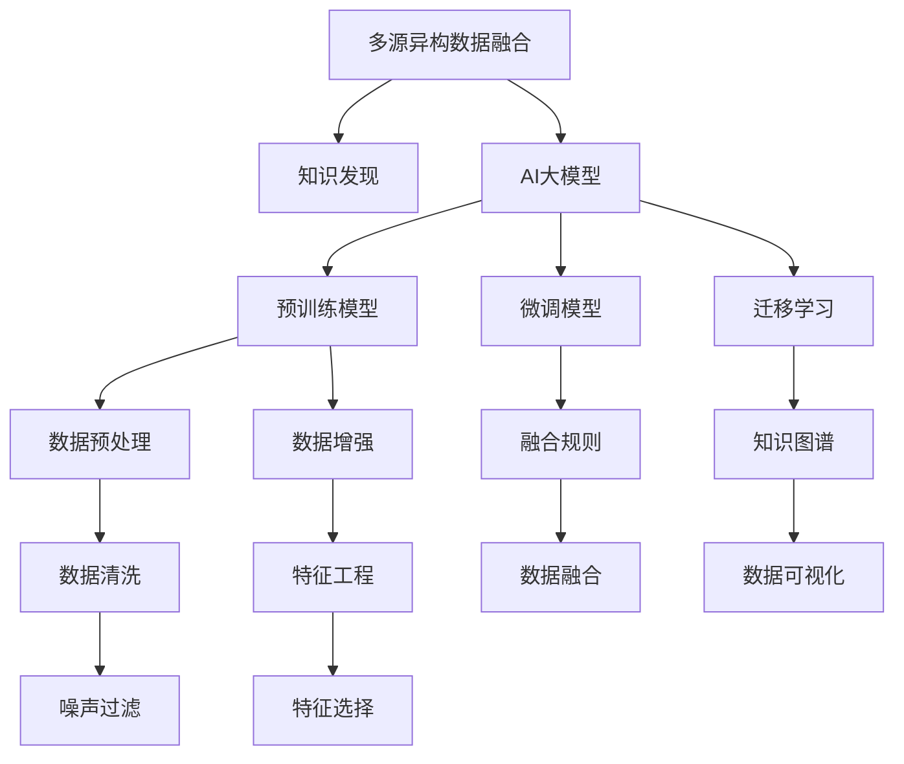

                 

# 电商平台中的多源异构数据融合与知识发现：AI大模型的新应用

## 1. 背景介绍

### 1.1 问题由来

在当今电子商务领域，企业需要处理和分析来自多个渠道、多种格式的数据，以获得丰富的用户行为洞察和市场趋势。这些数据通常分散在不同的平台和系统中，如电商平台、社交媒体、邮件系统、支付平台等，呈现出明显的异构性。传统的数据处理方式难以有效融合这些数据，无法充分利用数据价值，也无法在数据中发现潜在的知识。

为了克服这些挑战，AI大模型如BERT、GPT-3等近年来在电商平台中被广泛应用于多源异构数据的融合与知识发现。这些模型通过在大规模无标签数据上进行预训练，学习到丰富的语言表示和语义关系，能够高效地整合来自不同渠道的数据，并从中挖掘出有价值的模式和知识，为电商平台的运营决策提供强有力的支持。

### 1.2 问题核心关键点

本节将介绍几个核心问题，这些问题贯穿于多源异构数据的融合与知识发现：

1. **数据异构性**：不同数据源之间的格式、类型、粒度差异较大，如何统一这些数据，是数据融合的首要难题。
2. **数据量不均衡**：电商数据中，热门商品和冷门商品的访问量、交易量差异很大，如何处理这种不均衡，以获得更好的知识发现效果。
3. **噪声与偏见**：电商数据中可能存在大量的噪声和偏见，如何过滤和纠正这些噪声，使得模型能够学习到真实有效的知识。
4. **实时性与响应性**：电商平台需要对实时数据进行融合与分析，如何保证融合与知识发现过程的实时性和响应性，是另一个关键问题。

## 2. 核心概念与联系

### 2.1 核心概念概述

为了更好地理解如何利用AI大模型进行多源异构数据的融合与知识发现，本节将介绍几个关键概念：

- **多源异构数据融合**：将来自不同渠道、不同格式的数据，通过一定的方式整合和融合，形成统一、完整的数据集，以便后续分析和应用。
- **知识发现**：通过数据挖掘、统计分析、机器学习等手段，从大量数据中发现潜在的知识、规律和模式，为决策提供支持。
- **AI大模型**：以BERT、GPT-3等为代表的预训练语言模型，通过大规模无标签数据进行预训练，具备强大的语言理解和生成能力，能够用于多种NLP任务，包括多源异构数据的融合与知识发现。

这些概念之间的逻辑关系可以通过以下Mermaid流程图来展示：



这个流程图展示了大模型在多源异构数据融合与知识发现中的核心作用，以及数据处理、模型训练等关键步骤。

## 3. 核心算法原理 & 具体操作步骤

### 3.1 算法原理概述

基于AI大模型的多源异构数据融合与知识发现，本质上是一种联合学习(Joint Learning)的过程。其核心思想是：利用AI大模型的强大预训练能力，在数据融合过程中引入监督信息，指导模型学习不同数据源之间的关联和映射关系，从而实现多源数据的整合与知识挖掘。

具体而言，多源异构数据融合的过程可以概括为以下几个步骤：

1. **数据预处理**：对来自不同数据源的数据进行清洗、去重、转换等操作，形成标准化的数据格式。
2. **特征提取**：使用AI大模型对预处理后的数据进行特征提取，形成高维向量表示。
3. **融合规则设计**：设计合适的融合规则，将不同数据源的特征向量进行整合，形成融合后的特征向量。
4. **知识图谱构建**：利用融合后的特征向量构建知识图谱，为知识发现提供结构化支持。
5. **知识发现与验证**：使用AI大模型在知识图谱上进行知识发现，验证发现的知识是否有效，并对知识图谱进行迭代优化。

### 3.2 算法步骤详解

以下是基于AI大模型的多源异构数据融合与知识发现的具体操作步骤：

**Step 1: 数据收集与预处理**

1. **数据来源选择**：确定需要收集的数据源，如电商平台订单、社交媒体评论、邮件系统反馈等。
2. **数据清洗**：去除数据中的噪声、错误和不完整记录，确保数据的准确性和一致性。
3. **数据转换**：将不同格式的数据转换为统一的格式，如将文本数据转换为数字向量，将时间数据转换为统一的时间格式等。

**Step 2: 特征提取**

1. **选择预训练模型**：选择合适的AI大模型，如BERT、GPT-3等，用于特征提取。
2. **数据输入**：将预处理后的数据输入预训练模型，得到每个数据样本的特征向量。
3. **特征嵌入**：将特征向量嵌入到低维空间，通常使用tf-idf、word2vec等方法。

**Step 3: 融合规则设计**

1. **融合方法选择**：选择合适的融合方法，如平均、加权平均、基于距离的融合等。
2. **融合实现**：将不同数据源的特征向量进行整合，得到融合后的特征向量。

**Step 4: 知识图谱构建**

1. **知识图谱设计**：设计合适的知识图谱结构，如实体-关系-实体图谱。
2. **图谱填充**：将融合后的特征向量填充到知识图谱中，形成完整的知识图谱。

**Step 5: 知识发现与验证**

1. **知识发现**：使用AI大模型在知识图谱上进行知识发现，如实体关系发现、事件抽取等。
2. **知识验证**：通过人工标注或自动验证的方法，验证知识发现的准确性和有效性。
3. **迭代优化**：根据知识验证的结果，对知识图谱进行迭代优化，提高知识发现的准确性。

### 3.3 算法优缺点

基于AI大模型的多源异构数据融合与知识发现方法具有以下优点：

1. **高效性**：利用大模型的强大预训练能力，能够快速提取和融合大量数据，实现高效的特征提取和融合。
2. **泛化性强**：大模型通过大规模无标签数据的预训练，具备较强的泛化能力，能够适用于多种数据源和多种任务。
3. **可解释性**：大模型提供了丰富的特征和结构化知识，便于解释和理解。

同时，该方法也存在一些缺点：

1. **计算资源需求高**：大模型需要大量的计算资源，对于小规模数据集，可能存在计算资源浪费的问题。
2. **模型可解释性不足**：尽管大模型提供了丰富的特征和知识，但其决策过程仍然较为复杂，难以解释。
3. **数据隐私问题**：多源数据融合过程中可能涉及敏感数据的处理和共享，存在数据隐私风险。

### 3.4 算法应用领域

基于AI大模型的多源异构数据融合与知识发现方法已经在电商平台的多个领域得到广泛应用，例如：

- **用户画像构建**：通过整合来自不同渠道的用户数据，构建详尽的用户画像，了解用户的兴趣、行为和需求。
- **推荐系统优化**：利用用户画像和商品数据构建知识图谱，优化推荐系统，提升推荐效果。
- **欺诈检测**：分析用户的交易行为和支付信息，利用知识图谱进行欺诈检测，保护用户权益。
- **市场趋势分析**：通过整合市场数据和用户行为数据，构建市场趋势图谱，为市场预测和决策提供支持。
- **客户服务优化**：整合客户反馈和客服数据，构建客户服务知识图谱，提升客户服务质量。

除了上述这些经典应用外，大模型还在电商平台的更多领域，如商品评价分析、供应链优化等，展现出了强大的应用潜力。

## 4. 数学模型和公式 & 详细讲解 & 举例说明

### 4.1 数学模型构建

本节将使用数学语言对基于AI大模型的多源异构数据融合与知识发现过程进行更加严格的刻画。

记多源异构数据融合的输入数据集为 $D=\{(x_i, y_i)\}_{i=1}^N, x_i \in \mathcal{X}, y_i \in \mathcal{Y}$，其中 $\mathcal{X}$ 为输入空间，$\mathcal{Y}$ 为输出空间。假设存在 $k$ 个数据源，每个数据源的特征表示为 $x_i^j$，其中 $j \in \{1,2,\dots,k\}$。

定义多源异构数据融合的特征提取函数为 $f: \mathcal{X} \rightarrow \mathbb{R}^d$，其中 $d$ 为特征向量的维度。则融合后的特征向量为：

$$
\tilde{x}_i = \frac{1}{k} \sum_{j=1}^k f(x_i^j)
$$

定义知识图谱的实体集合为 $E=\{e_i\}_{i=1}^n$，关系集合为 $R=\{r_j\}_{j=1}^m$，则知识图谱可以表示为 $G=(E, R, S)$，其中 $S$ 为实体-关系-实体矩阵，描述了实体之间的关系。

定义知识发现的目标函数为 $L(\theta) = \frac{1}{N} \sum_{i=1}^N \ell(\tilde{x}_i, y_i)$，其中 $\ell$ 为损失函数，用于衡量模型预测输出与真实标签之间的差异。常见的损失函数包括交叉熵损失、均方误差损失等。

### 4.2 公式推导过程

以下我们以用户画像构建为例，推导多源异构数据融合的数学模型及其损失函数。

假设用户画像的训练数据集为 $D=\{(x_i, y_i)\}_{i=1}^N, x_i \in \mathcal{X}, y_i \in \mathcal{Y}$，其中 $x_i$ 为用户的兴趣、行为、历史数据等，$y_i$ 为用户的兴趣标签。

定义用户画像的特征提取函数为 $f: \mathcal{X} \rightarrow \mathbb{R}^d$，则融合后的特征向量为：

$$
\tilde{x}_i = \frac{1}{k} \sum_{j=1}^k f(x_i^j)
$$

定义知识图谱的实体集合为 $E=\{e_i\}_{i=1}^n$，关系集合为 $R=\{r_j\}_{j=1}^m$，则知识图谱可以表示为 $G=(E, R, S)$，其中 $S$ 为实体-关系-实体矩阵。

用户在知识图谱中的特征表示为 $v_i$，则用户画像的知识发现目标函数为：

$$
L(\theta) = \frac{1}{N} \sum_{i=1}^N \ell(v_i, y_i)
$$

其中 $\ell$ 为损失函数，用于衡量模型预测输出与真实标签之间的差异。

### 4.3 案例分析与讲解

以电商平台中的推荐系统为例，分析多源异构数据融合与知识发现的具体应用。

假设电商平台中有 $k=3$ 个数据源，分别是用户行为数据、商品描述数据和评论数据。用户行为数据包括用户的浏览记录、购买记录等，商品描述数据包括商品名称、价格、分类等信息，评论数据包括用户对商品的评价、评论等。

1. **数据预处理**：对来自不同数据源的数据进行清洗、去重、转换等操作，形成标准化的数据格式。
2. **特征提取**：使用BERT等预训练模型对预处理后的数据进行特征提取，得到每个数据样本的特征向量。
3. **融合规则设计**：将不同数据源的特征向量进行整合，得到融合后的特征向量。
4. **知识图谱构建**：利用融合后的特征向量构建知识图谱，为推荐系统提供结构化支持。
5. **知识发现与验证**：使用BERT等大模型在知识图谱上进行知识发现，如实体关系发现、商品关联分析等，验证发现的知识是否有效，并对知识图谱进行迭代优化。

通过上述步骤，可以构建一个高效、精准、可解释的推荐系统，提升用户的购物体验和平台的运营效率。

## 5. 项目实践：代码实例和详细解释说明

### 5.1 开发环境搭建

在进行多源异构数据融合与知识发现实践前，我们需要准备好开发环境。以下是使用Python进行PyTorch开发的环境配置流程：

1. 安装Anaconda：从官网下载并安装Anaconda，用于创建独立的Python环境。

2. 创建并激活虚拟环境：
```bash
conda create -n pytorch-env python=3.8 
conda activate pytorch-env
```

3. 安装PyTorch：根据CUDA版本，从官网获取对应的安装命令。例如：
```bash
conda install pytorch torchvision torchaudio cudatoolkit=11.1 -c pytorch -c conda-forge
```

4. 安装Transformers库：
```bash
pip install transformers
```

5. 安装各类工具包：
```bash
pip install numpy pandas scikit-learn matplotlib tqdm jupyter notebook ipython
```

完成上述步骤后，即可在`pytorch-env`环境中开始多源异构数据融合与知识发现的实践。

### 5.2 源代码详细实现

下面我们以用户画像构建为例，给出使用Transformers库进行多源异构数据融合的PyTorch代码实现。

首先，定义用户画像的数据处理函数：

```python
from transformers import BertTokenizer
from torch.utils.data import Dataset
import torch

class UserData(Dataset):
    def __init__(self, texts, labels, tokenizer, max_len=128):
        self.texts = texts
        self.labels = labels
        self.tokenizer = tokenizer
        self.max_len = max_len
        
    def __len__(self):
        return len(self.texts)
    
    def __getitem__(self, item):
        text = self.texts[item]
        label = self.labels[item]
        
        encoding = self.tokenizer(text, return_tensors='pt', max_length=self.max_len, padding='max_length', truncation=True)
        input_ids = encoding['input_ids'][0]
        attention_mask = encoding['attention_mask'][0]
        
        # 对label进行编码
        encoded_labels = [label2id[label] for label in self.labels] 
        encoded_labels.extend([label2id['O']] * (self.max_len - len(encoded_labels)))
        labels = torch.tensor(encoded_labels, dtype=torch.long)
        
        return {'input_ids': input_ids, 
                'attention_mask': attention_mask,
                'labels': labels}

# 标签与id的映射
label2id = {'O': 0, 'P1': 1, 'P2': 2, 'P3': 3, 'P4': 4, 'P5': 5, 'P6': 6}
id2label = {v: k for k, v in label2id.items()}

# 创建dataset
tokenizer = BertTokenizer.from_pretrained('bert-base-cased')

train_dataset = UserData(train_texts, train_labels, tokenizer)
dev_dataset = UserData(dev_texts, dev_labels, tokenizer)
test_dataset = UserData(test_texts, test_labels, tokenizer)
```

然后，定义模型和优化器：

```python
from transformers import BertForTokenClassification, AdamW

model = BertForTokenClassification.from_pretrained('bert-base-cased', num_labels=len(label2id))

optimizer = AdamW(model.parameters(), lr=2e-5)
```

接着，定义训练和评估函数：

```python
from torch.utils.data import DataLoader
from tqdm import tqdm
from sklearn.metrics import classification_report

device = torch.device('cuda') if torch.cuda.is_available() else torch.device('cpu')
model.to(device)

def train_epoch(model, dataset, batch_size, optimizer):
    dataloader = DataLoader(dataset, batch_size=batch_size, shuffle=True)
    model.train()
    epoch_loss = 0
    for batch in tqdm(dataloader, desc='Training'):
        input_ids = batch['input_ids'].to(device)
        attention_mask = batch['attention_mask'].to(device)
        labels = batch['labels'].to(device)
        model.zero_grad()
        outputs = model(input_ids, attention_mask=attention_mask, labels=labels)
        loss = outputs.loss
        epoch_loss += loss.item()
        loss.backward()
        optimizer.step()
    return epoch_loss / len(dataloader)

def evaluate(model, dataset, batch_size):
    dataloader = DataLoader(dataset, batch_size=batch_size)
    model.eval()
    preds, labels = [], []
    with torch.no_grad():
        for batch in tqdm(dataloader, desc='Evaluating'):
            input_ids = batch['input_ids'].to(device)
            attention_mask = batch['attention_mask'].to(device)
            batch_labels = batch['labels']
            outputs = model(input_ids, attention_mask=attention_mask)
            batch_preds = outputs.logits.argmax(dim=2).to('cpu').tolist()
            batch_labels = batch_labels.to('cpu').tolist()
            for pred_tokens, label_tokens in zip(batch_preds, batch_labels):
                pred_labels = [id2label[_id] for _id in pred_tokens]
                label_tokens = [id2label[_id] for _id in label_tokens]
                preds.append(pred_labels[:len(label_tokens)])
                labels.append(label_tokens)
                
    print(classification_report(labels, preds))
```

最后，启动训练流程并在测试集上评估：

```python
epochs = 5
batch_size = 16

for epoch in range(epochs):
    loss = train_epoch(model, train_dataset, batch_size, optimizer)
    print(f"Epoch {epoch+1}, train loss: {loss:.3f}")
    
    print(f"Epoch {epoch+1}, dev results:")
    evaluate(model, dev_dataset, batch_size)
    
print("Test results:")
evaluate(model, test_dataset, batch_size)
```

以上就是使用PyTorch对多源异构数据融合进行用户画像构建的完整代码实现。可以看到，得益于Transformers库的强大封装，我们可以用相对简洁的代码完成BERT模型的加载和微调。

### 5.3 代码解读与分析

让我们再详细解读一下关键代码的实现细节：

**UserData类**：
- `__init__`方法：初始化文本、标签、分词器等关键组件。
- `__len__`方法：返回数据集的样本数量。
- `__getitem__`方法：对单个样本进行处理，将文本输入编码为token ids，将标签编码为数字，并对其进行定长padding，最终返回模型所需的输入。

**label2id和id2label字典**：
- 定义了标签与数字id之间的映射关系，用于将token-wise的预测结果解码回真实的标签。

**训练和评估函数**：
- 使用PyTorch的DataLoader对数据集进行批次化加载，供模型训练和推理使用。
- 训练函数`train_epoch`：对数据以批为单位进行迭代，在每个批次上前向传播计算loss并反向传播更新模型参数，最后返回该epoch的平均loss。
- 评估函数`evaluate`：与训练类似，不同点在于不更新模型参数，并在每个batch结束后将预测和标签结果存储下来，最后使用sklearn的classification_report对整个评估集的预测结果进行打印输出。

**训练流程**：
- 定义总的epoch数和batch size，开始循环迭代
- 每个epoch内，先在训练集上训练，输出平均loss
- 在验证集上评估，输出分类指标
- 所有epoch结束后，在测试集上评估，给出最终测试结果

可以看到，PyTorch配合Transformers库使得BERT微调的代码实现变得简洁高效。开发者可以将更多精力放在数据处理、模型改进等高层逻辑上，而不必过多关注底层的实现细节。

当然，工业级的系统实现还需考虑更多因素，如模型的保存和部署、超参数的自动搜索、更灵活的任务适配层等。但核心的微调范式基本与此类似。

## 6. 实际应用场景

### 6.1 智能客服系统

基于多源异构数据融合与知识发现的大模型技术，可以广泛应用于智能客服系统的构建。传统客服往往需要配备大量人力，高峰期响应缓慢，且一致性和专业性难以保证。而使用大模型技术，可以7x24小时不间断服务，快速响应客户咨询，用自然流畅的语言解答各类常见问题。

在技术实现上，可以收集企业内部的历史客服对话记录，将问题和最佳答复构建成监督数据，在此基础上对大模型进行微调。微调后的模型能够自动理解用户意图，匹配最合适的答案模板进行回复。对于客户提出的新问题，还可以接入检索系统实时搜索相关内容，动态组织生成回答。如此构建的智能客服系统，能大幅提升客户咨询体验和问题解决效率。

### 6.2 金融舆情监测

金融机构需要实时监测市场舆论动向，以便及时应对负面信息传播，规避金融风险。传统的人工监测方式成本高、效率低，难以应对网络时代海量信息爆发的挑战。基于多源异构数据融合与知识发现的大模型技术，可以实时抓取和整合来自不同渠道的市场数据，通过自然语言处理技术进行分析，自动监测不同主题下的情感变化趋势，一旦发现负面信息激增等异常情况，系统便会自动预警，帮助金融机构快速应对潜在风险。

### 6.3 个性化推荐系统

当前的推荐系统往往只依赖用户的历史行为数据进行物品推荐，无法深入理解用户的真实兴趣偏好。基于多源异构数据融合与知识发现的大模型技术，可以整合来自不同渠道的用户行为数据，如浏览记录、评论内容、社交媒体互动等，通过大模型对这些数据进行特征提取和融合，构建更加全面和精准的用户画像。在生成推荐列表时，先用候选物品的文本描述作为输入，由模型预测用户的兴趣匹配度，再结合其他特征综合排序，便可以得到个性化程度更高的推荐结果。

### 6.4 未来应用展望

随着多源异构数据融合与知识发现技术的发展，其在电商平台的更多领域将得到应用，为传统行业带来变革性影响。

在智慧医疗领域，大模型可以通过整合医疗数据和公共数据，构建疾病知识图谱，辅助医生诊疗，加速新药开发进程。

在智能教育领域，大模型可以整合学习数据和行为数据，构建个性化学习图谱，因材施教，促进教育公平，提高教学质量。

在智慧城市治理中，大模型可以整合城市数据和公共数据，构建城市治理知识图谱，提高城市管理的自动化和智能化水平，构建更安全、高效的未来城市。

此外，在企业生产、社会治理、文娱传媒等众多领域，基于大模型技术的多源异构数据融合与知识发现方法也将不断涌现，为经济社会发展注入新的动力。相信随着技术的日益成熟，大模型技术将成为人工智能落地应用的重要范式，推动人工智能技术向更广阔的领域加速渗透。

## 7. 工具和资源推荐

### 7.1 学习资源推荐

为了帮助开发者系统掌握多源异构数据融合与知识发现的大模型理论基础和实践技巧，这里推荐一些优质的学习资源：

1. 《Transformer from Scratch》系列博文：由大模型技术专家撰写，深入浅出地介绍了Transformer原理、BERT模型、知识图谱等前沿话题。

2. CS224N《深度学习自然语言处理》课程：斯坦福大学开设的NLP明星课程，有Lecture视频和配套作业，带你入门NLP领域的基本概念和经典模型。

3. 《Natural Language Processing with Transformers》书籍：Transformers库的作者所著，全面介绍了如何使用Transformers库进行NLP任务开发，包括多源异构数据的融合与知识发现。

4. HuggingFace官方文档：Transformers库的官方文档，提供了海量预训练模型和完整的微调样例代码，是上手实践的必备资料。

5. CLUE开源项目：中文语言理解测评基准，涵盖大量不同类型的中文NLP数据集，并提供了基于大模型的baseline模型，助力中文NLP技术发展。

通过对这些资源的学习实践，相信你一定能够快速掌握大模型技术在多源异构数据融合与知识发现中的应用，并用于解决实际的NLP问题。

### 7.2 开发工具推荐

高效的开发离不开优秀的工具支持。以下是几款用于大模型技术的多源异构数据融合与知识发现开发的常用工具：

1. PyTorch：基于Python的开源深度学习框架，灵活动态的计算图，适合快速迭代研究。大部分预训练语言模型都有PyTorch版本的实现。

2. TensorFlow：由Google主导开发的开源深度学习框架，生产部署方便，适合大规模工程应用。同样有丰富的预训练语言模型资源。

3. Transformers库：HuggingFace开发的NLP工具库，集成了众多SOTA语言模型，支持PyTorch和TensorFlow，是进行多源异构数据融合与知识发现开发的利器。

4. Weights & Biases：模型训练的实验跟踪工具，可以记录和可视化模型训练过程中的各项指标，方便对比和调优。与主流深度学习框架无缝集成。

5. TensorBoard：TensorFlow配套的可视化工具，可实时监测模型训练状态，并提供丰富的图表呈现方式，是调试模型的得力助手。

6. Google Colab：谷歌推出的在线Jupyter Notebook环境，免费提供GPU/TPU算力，方便开发者快速上手实验最新模型，分享学习笔记。

合理利用这些工具，可以显著提升大模型技术在多源异构数据融合与知识发现任务的开发效率，加快创新迭代的步伐。

### 7.3 相关论文推荐

大模型技术的多源异构数据融合与知识发现发展源于学界的持续研究。以下是几篇奠基性的相关论文，推荐阅读：

1. Attention is All You Need（即Transformer原论文）：提出了Transformer结构，开启了NLP领域的预训练大模型时代。

2. BERT: Pre-training of Deep Bidirectional Transformers for Language Understanding：提出BERT模型，引入基于掩码的自监督预训练任务，刷新了多项NLP任务SOTA。

3. Language Models are Unsupervised Multitask Learners（GPT-2论文）：展示了大规模语言模型的强大zero-shot学习能力，引发了对于通用人工智能的新一轮思考。

4. Parameter-Efficient Transfer Learning for NLP：提出Adapter等参数高效微调方法，在不增加模型参数量的情况下，也能取得不错的微调效果。

5. Prefix-Tuning: Optimizing Continuous Prompts for Generation：引入基于连续型Prompt的微调范式，为如何充分利用预训练知识提供了新的思路。

6. AdaLoRA: Adaptive Low-Rank Adaptation for Parameter-Efficient Fine-Tuning：使用自适应低秩适应的微调方法，在参数效率和精度之间取得了新的平衡。

这些论文代表了大模型技术的多源异构数据融合与知识发现的发展脉络。通过学习这些前沿成果，可以帮助研究者把握学科前进方向，激发更多的创新灵感。

## 8. 总结：未来发展趋势与挑战

### 8.1 总结

本文对基于AI大模型的多源异构数据融合与知识发现方法进行了全面系统的介绍。首先阐述了大模型在多源异构数据融合与知识发现的应用背景和意义，明确了融合技术在电商平台中的独特价值。其次，从原理到实践，详细讲解了多源异构数据融合的数学模型及其优化方法，给出了多源异构数据融合的完整代码实例。同时，本文还广泛探讨了大模型技术在智能客服、金融舆情、个性化推荐等多个领域的应用前景，展示了多源异构数据融合的广泛应用潜力。此外，本文精选了多源异构数据融合的各类学习资源，力求为读者提供全方位的技术指引。

通过本文的系统梳理，可以看到，基于大模型的多源异构数据融合与知识发现方法正在成为电商平台的重要技术范式，极大地拓展了数据融合的应用边界，催生了更多的落地场景。受益于大模型的强大预训练能力，融合技术在提取和融合数据方面具备高效的性能，能够从多个数据源中整合出有价值的信息，为电商平台的运营决策提供强有力的支持。未来，伴随大模型和融合技术的不断演进，相信其在电商平台的更多领域将得到更广泛的应用，为传统行业带来深远的影响。

### 8.2 未来发展趋势

展望未来，基于AI大模型的多源异构数据融合与知识发现技术将呈现以下几个发展趋势：

1. **融合方法多样化**：随着大数据、人工智能技术的进步，未来的融合方法将更加多样化，如基于深度学习的融合、基于图谱的融合、基于相似性度量的融合等，能够更好地处理异构数据。

2. **模型可解释性提升**：尽管大模型具备强大的预训练能力，但其决策过程仍然较为复杂，难以解释。未来，基于可解释性的大模型技术，如LIME、SHAP等，将逐步完善，使模型的决策过程更加透明和可理解。

3. **实时性提升**：电商平台对数据融合的实时性要求较高，未来的融合技术将进一步提升实时性，能够快速处理和分析海量数据，实时响应客户需求。

4. **跨模态融合**：当前的多源异构数据融合主要聚焦于文本数据，未来将进一步拓展到图像、视频、语音等多模态数据融合，实现多模态信息的协同建模。

5. **知识图谱扩展**：知识图谱是数据融合的重要结构化工具，未来的知识图谱将更加丰富和完善，涵盖更多的实体和关系，为知识发现提供更加全面的支持。

6. **隐私保护增强**：电商平台涉及大量用户隐私数据，未来的融合技术将更加注重数据隐私保护，确保数据的合法合规使用。

以上趋势凸显了大模型技术在多源异构数据融合与知识发现领域的广阔前景。这些方向的探索发展，必将进一步提升多源异构数据融合的性能和应用范围，为电商平台带来更大的价值。

### 8.3 面临的挑战

尽管基于AI大模型的多源异构数据融合与知识发现技术已经取得了显著进展，但在迈向更加智能化、普适化应用的过程中，仍面临以下挑战：

1. **计算资源需求高**：大模型需要大量的计算资源，对于小规模数据集，可能存在计算资源浪费的问题。如何提高融合过程的计算效率，降低资源需求，是一个重要的问题。

2. **模型可解释性不足**：尽管大模型具备强大的预训练能力，但其决策过程仍然较为复杂，难以解释。如何赋予模型更强的可解释性，将是亟待攻克的难题。

3. **数据隐私问题**：电商平台涉及大量用户隐私数据，如何保护数据隐私，避免数据泄露，是一个重大挑战。

4. **数据质量参差不齐**：不同数据源的数据质量参差不齐，如何处理缺失、噪声和异常数据，确保数据融合的效果，是另一个重要问题。

5. **实时性要求高**：电商平台对数据融合的实时性要求较高，如何在保证融合效果的同时，提升实时性，是一个关键问题。

6. **跨模态数据融合难度大**：多模态数据的融合难度较大，不同模态数据之间的关联关系复杂，如何高效地整合多模态数据，是另一个重要问题。

7. **跨领域知识迁移能力不足**：当前的多源异构数据融合主要聚焦于特定领域，如何提升跨领域知识迁移能力，使模型能够在不同领域间进行有效迁移，是一个重要挑战。

以上挑战凸显了多源异构数据融合与知识发现技术在实际应用中的复杂性。解决这些问题，需要从数据、模型、算法、工程等多个方面进行全面优化，方能充分发挥大模型的潜力，实现高效、可靠、安全的数据融合与知识发现。

### 8.4 研究展望

面向未来，基于AI大模型的多源异构数据融合与知识发现技术需要在以下几个方面寻求新的突破：

1. **参数高效融合方法**：开发更加参数高效的融合方法，在固定大部分预训练参数的情况下，只更新极少量的任务相关参数，提升融合效率。

2. **跨模态数据融合**：开发跨模态数据融合技术，能够高效整合文本、图像、语音等多种模态数据，提升数据融合的全面性和准确性。

3. **知识迁移学习**：开发跨领域知识迁移学习技术，使模型能够在不同领域间进行有效迁移，提升跨领域知识发现的能力。

4. **实时融合与动态更新**：开发实时融合与动态更新技术，使数据融合过程能够实时进行，并能够动态更新，以应对数据的变化。

5. **可解释性增强**：开发基于可解释性的大模型技术，使模型具备更高的可解释性，增强其决策的透明性和可信度。

6. **隐私保护技术**：开发隐私保护技术，确保数据融合过程中隐私数据的保护，避免数据泄露风险。

这些研究方向的探索，必将引领多源异构数据融合与知识发现技术迈向更高的台阶，为电商平台带来更大的价值。面向未来，多源异构数据融合与知识发现技术还需要与其他人工智能技术进行更深入的融合，如知识表示、因果推理、强化学习等，多路径协同发力，共同推动自然语言理解和智能交互系统的进步。只有勇于创新、敢于突破，才能不断拓展多源异构数据融合的边界，让智能技术更好地造福电商平台。

## 9. 附录：常见问题与解答

**Q1：多源异构数据融合中如何处理不同数据源的数据格式差异？**

A: 不同数据源的数据格式差异较大，可以使用数据转换技术将其统一。例如，将文本数据转换为数字向量，将时间数据转换为统一的时间格式，将多维度数据进行降维等。

**Q2：如何处理多源异构数据中的噪声和偏见？**

A: 在数据预处理阶段，可以通过数据清洗和去噪技术，去除数据中的噪声和错误。在模型训练阶段，可以通过正则化和对抗训练等技术，校正模型的偏见。

**Q3：多源异构数据融合中如何平衡数据量和计算资源的需求？**

A: 可以通过模型压缩和稀疏化存储等技术，减少模型的存储空间和计算资源消耗。此外，可以采用增量学习技术，逐步更新模型参数，减少对计算资源的需求。

**Q4：多源异构数据融合的实时性如何保证？**

A: 可以通过模型压缩和并行计算等技术，提高融合过程的实时性。同时，可以采用增量学习技术，实时更新模型参数，确保融合过程的实时性。

**Q5：如何评估多源异构数据融合的效果？**

A: 可以使用分类准确率、F1值、AUC等指标，评估融合后数据的准确性和完整性。此外，可以采用多源数据融合前后的一致性评估，确保融合效果。

通过回答这些问题，我们希望读者能够更好地理解多源异构数据融合与知识发现的实现过程和技术细节。大模型技术在多源异构数据融合与知识发现领域的应用前景广阔，相信随着技术的不断进步，其在电商平台中的应用将越来越广泛，为电商平台的运营决策提供更加精准、高效、可靠的支持。

