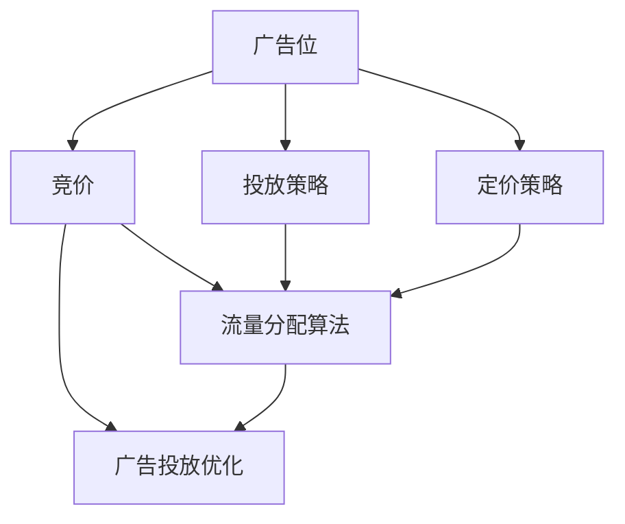

                 

# 电商平台中的实时竞价广告系统设计

> 关键词：
- 电商平台
- 实时竞价(RTBA)广告
- 广告系统架构设计
- 定价策略
- 流量分配算法
- 广告投放优化

## 1. 背景介绍

在当今数字经济时代，电商平台已成为企业数字化转型的重要渠道。电商平台不仅为用户提供便捷的商品购物体验，也为企业提供了一个高效展示产品和服务的舞台。随着消费者需求的日益多样化，电商平台上的竞争也越来越激烈。广告作为商家展示产品的重要手段，如何通过高效的广告投放策略，提升广告效果和投入产出比，成为了电商企业关注的焦点。

### 1.1 广告系统的挑战

广告系统在电商平台中承担着为商家提供精准投放的使命。但传统的广告投放方法往往存在以下挑战：

- **精准度不足**：传统广告系统通常采用预置投放策略，无法实时捕捉用户行为和需求的变化。
- **资源浪费**：广告预算往往被浪费在无效的投放渠道和用户上，导致资源利用效率低下。
- **动态竞争**：电商平台上的广告投放不再是单向的，而是商家之间动态竞争的过程，商家会不断调整投放策略，系统需要具备实时调整能力。

为了应对这些挑战，实时竞价广告系统(RTBA)应运而生。通过实时竞价，广告系统能够动态调整广告价格和投放策略，最大限度地提升广告的精准度和资源利用效率。

### 1.2 实时竞价广告的优劣势

**优势**：
- **精准投放**：RTBA系统能够根据用户行为和需求，动态调整广告价格和投放策略，实现更精准的投放。
- **实时优化**：系统能够实时捕捉广告市场变化，动态调整广告预算和投放策略，优化广告效果。
- **公平竞争**：RTBA系统基于实际竞价，保证了广告投放的公平性和透明性。

**劣势**：
- **技术复杂度**：RTBA系统需要具备高度灵活性和可扩展性，技术实现较为复杂。
- **高门槛**：广告主需要具备一定的技术能力和市场洞察，才能参与竞价，对一些中小企业可能不太友好。
- **算法挑战**：RTBA系统需要设计高效的算法，实现实时竞价和动态优化，这对算法设计和系统性能要求较高。

## 2. 核心概念与联系

### 2.1 核心概念概述

本节将介绍几个核心概念，并明确它们之间的联系：

- **实时竞价广告系统(RTBA)**：指通过实时竞价机制，动态调整广告价格和投放策略的系统。RTBA系统能够根据广告位和用户行为实时优化广告投放效果，实现精准广告投放。

- **广告位**：指电商平台上的广告展示位置，如横幅、搜索页、商品详情页等。每个广告位都有独特的用户流量特征和展示方式，需要不同的广告策略。

- **竞价**：指广告主为了获得广告位的使用权，向广告系统支付的价格。竞价是RTBA系统的核心机制，确保广告投放的公平性和透明性。

- **投放策略**：指广告系统根据广告主的要求，制定具体的广告投放方案。投放策略包括广告预算、竞价规则、投放时间等。

- **定价策略**：指广告系统根据竞价结果和广告位流量特征，制定合理的价格方案。定价策略需要考虑广告主需求、平台收益和用户体验等因素。

- **流量分配算法**：指广告系统根据用户行为和广告需求，动态分配广告流量的方法。流量分配算法需要考虑广告效果、用户价值和广告预算等综合因素。

- **广告投放优化**：指通过数据分析和算法优化，提升广告投放效果的过程。广告投放优化需要结合市场数据、用户行为和广告主需求，不断优化广告策略。

这些概念之间的逻辑关系可以通过以下Mermaid流程图来展示：



这个流程图展示广告系统各组件的相互作用和联系：

1. 广告位是广告展示的位置。
2. 竞价机制决定了广告位的使用权。
3. 投放策略和定价策略共同制定了广告的投放方案和价格。
4. 流量分配算法负责动态分配广告流量。
5. 广告投放优化则通过数据分析和算法优化，提升广告效果。

## 3. 核心算法原理 & 具体操作步骤

### 3.1 算法原理概述

RTBA系统的核心在于实时竞价和动态优化。其算法原理主要包括以下几个部分：

- **竞价算法**：根据广告主需求和广告位流量特征，动态调整广告价格。常见的竞价算法包括VCPM(Vmalloc-based Capable Matching, VCPM)和RTB(Related Targeted Bid, RTB)等。

- **流量分配算法**：根据用户行为和广告需求，动态分配广告流量。常见的流量分配算法包括Linear Matching、GVR(Guaranteed Value Relevant, GVR)和AdRank等。

- **广告投放优化**：通过数据分析和算法优化，提升广告投放效果。常见的优化算法包括AdRank、VCPM和AdEx等。

### 3.2 算法步骤详解

#### 3.2.1 竞价算法步骤

**Step 1: 获取广告位和广告主信息**
- 从广告位数据库获取广告位的流量特征、预算和竞价策略等。
- 从广告主数据库获取广告主的投放预算、竞价方案和广告创意等。

**Step 2: 计算广告价值**
- 根据广告位流量特征和广告主需求，计算每个广告位的广告价值(Ad Value)。
- 常见的广告价值计算方法包括AdRank、RTB等。

**Step 3: 实时竞价**
- 在广告位展示时，根据广告主的竞价策略，实时计算竞价结果。
- 选择出价最高的广告主作为中标者，并根据竞价结果调整广告预算。

**Step 4: 广告投放**
- 将中标广告主的广告创意展示在广告位上。
- 记录广告展示和点击等行为，用于后续的流量分析和投放优化。

#### 3.2.2 流量分配算法步骤

**Step 1: 获取广告位和广告主信息**
- 获取广告位和广告主的基础信息和实时竞价结果。

**Step 2: 评估广告质量**
- 根据广告主的需求和广告位流量特征，评估每个广告的质量评分(Ad Score)。
- 常见的质量评分方法包括AdRank和Linear Matching等。

**Step 3: 分配广告流量**
- 根据广告质量和广告主预算，动态分配广告流量。
- 常见的流量分配方法包括Linear Matching和GVR等。

**Step 4: 流量优化**
- 根据广告展示和点击等行为，动态调整广告预算和投放策略。
- 常见的流量优化方法包括AdRank和VCPM等。

#### 3.2.3 广告投放优化步骤

**Step 1: 数据收集**
- 收集广告展示和点击等行为数据，进行数据分析和处理。

**Step 2: 广告效果评估**
- 根据广告效果指标，如点击率、转化率和投资回报率等，评估广告投放效果。
- 常见的广告效果评估方法包括A/B测试和Ctr优化等。

**Step 3: 优化投放策略**
- 根据广告效果评估结果，调整广告投放策略。
- 常见的优化方法包括AdRank、VCPM和AdEx等。

### 3.3 算法优缺点

RTBA系统的竞价算法、流量分配算法和广告投放优化算法各有优缺点：

**竞价算法**：
- **优点**：能够实时捕捉广告市场变化，动态调整广告价格，实现精准投放。
- **缺点**：技术实现复杂度较高，需要实时处理大量数据。

**流量分配算法**：
- **优点**：能够动态分配广告流量，提升广告效果。
- **缺点**：需要考虑广告质量和预算，计算复杂度较高。

**广告投放优化**：
- **优点**：通过数据分析和算法优化，提升广告效果。
- **缺点**：优化过程需要大量的实时数据，计算复杂度较高。

### 3.4 算法应用领域

RTBA系统已经在电商、视频、在线广告等多个领域得到了广泛应用，成为企业数字化转型的重要工具。以下是其主要应用场景：

- **电商广告**：通过实时竞价，提升商品展示的精准度和点击率，增加广告收入。
- **视频广告**：在视频平台上进行实时竞价，动态调整广告投放策略，提高广告效果。
- **在线广告**：在互联网平台上进行实时竞价，实现精准广告投放，提升广告收入。
- **移动广告**：在移动应用上进行实时竞价，优化广告投放效果，提高广告收入。

## 4. 数学模型和公式 & 详细讲解 & 举例说明

### 4.1 数学模型构建

本节将使用数学语言对RTBA系统中的主要算法进行详细建模。

设广告位为 $A$，广告主为 $B$，广告创意为 $C$。广告位和广告主的流量特征分别为 $\mathbf{a} \in \mathbb{R}^d$ 和 $\mathbf{b} \in \mathbb{R}^d$，广告创意为 $c \in \mathbb{R}^d$。广告位和广告主的预算分别为 $B_A$ 和 $B_B$。

广告位和广告主之间的广告价值计算公式为：

$$
V_{A,B} = \mathbf{a}^T \cdot \mathbf{b} + c^T \cdot \mathbf{a}
$$

竞价结果 $P_{A,B}$ 为广告主和广告位之间的实时竞价结果，计算公式为：

$$
P_{A,B} = \mathbf{b}^T \cdot \mathbf{a} + c^T \cdot \mathbf{a}
$$

广告主和广告位之间的广告展示和点击行为分别为 $D_{A,B}$ 和 $E_{A,B}$。广告主和广告位的广告质量评分 $Q_{A,B}$ 为：

$$
Q_{A,B} = \frac{D_{A,B}}{B_{A}} + \frac{E_{A,B}}{B_{B}}
$$

广告主和广告位的广告预算分配 $R_{A,B}$ 为：

$$
R_{A,B} = \frac{B_{A}}{Q_{A,B}} \cdot \frac{D_{A,B}}{E_{A,B}}
$$

根据广告质量和广告预算，广告主和广告位之间的广告流量分配 $F_{A,B}$ 为：

$$
F_{A,B} = R_{A,B} \cdot Q_{A,B}
$$

### 4.2 公式推导过程

#### 4.2.1 竞价算法推导

竞价算法的基本思想是根据广告主需求和广告位流量特征，动态调整广告价格，实现精准投放。假设广告位 $A$ 和广告主 $B$ 的竞价策略分别为 $P_{A}^B$ 和 $P_{B}^A$，则竞价结果为：

$$
P_{A,B} = \min(P_{A}^B, P_{B}^A)
$$

根据竞价结果，广告位 $A$ 和广告主 $B$ 之间的广告预算分配为：

$$
R_{A,B} = \min(P_{A,B}, B_{A})
$$

#### 4.2.2 流量分配算法推导

流量分配算法的基本思想是根据广告主需求和广告位流量特征，动态分配广告流量，提升广告效果。假设广告位 $A$ 和广告主 $B$ 之间的广告质量评分为 $Q_{A,B}$，广告主和广告位的广告预算分别为 $B_{A}$ 和 $B_{B}$，则广告主和广告位之间的广告流量分配为：

$$
F_{A,B} = \frac{B_{A}}{Q_{A,B}} \cdot D_{A,B}
$$

根据广告质量和广告预算，广告主和广告位之间的广告预算分配为：

$$
R_{A,B} = F_{A,B} \cdot \frac{B_{B}}{Q_{A,B}}
$$

### 4.3 案例分析与讲解

**案例1: 电商广告**

假设某电商平台有100个广告位，每个广告位每天的流量为100万次，广告预算为1000元。广告主A的广告创意价值为10元，竞价策略为 $P_A^B = 1.1 \cdot Q_{A,B}$，广告主B的广告创意价值为5元，竞价策略为 $P_B^A = 0.9 \cdot Q_{A,B}$。

广告位 $A$ 和广告主 $B$ 之间的广告价值为：

$$
V_{A,B} = \mathbf{a}^T \cdot \mathbf{b} + c^T \cdot \mathbf{a} = 1 + 5 = 6
$$

竞价结果为：

$$
P_{A,B} = \min(P_{A}^B, P_{B}^A) = \min(1.1 \cdot 6, 0.9 \cdot 6) = 5.4
$$

广告主和广告位之间的广告质量评分为：

$$
Q_{A,B} = \frac{D_{A,B}}{B_{A}} + \frac{E_{A,B}}{B_{B}} = \frac{100}{1000} + \frac{200}{2000} = 0.3
$$

广告主和广告位之间的广告预算分配为：

$$
R_{A,B} = \frac{B_{A}}{Q_{A,B}} \cdot \frac{D_{A,B}}{E_{A,B}} = \frac{1000}{0.3} \cdot \frac{100}{200} = 333.3
$$

广告主和广告位之间的广告流量分配为：

$$
F_{A,B} = R_{A,B} \cdot Q_{A,B} = 333.3 \cdot 0.3 = 100
$$

因此，广告位 $A$ 每天为广告主 $B$ 展示100次广告，广告主 $B$ 支付的广告费用为：

$$
\text{广告费用} = P_{A,B} \cdot F_{A,B} = 5.4 \cdot 100 = 540
$$

**案例2: 视频广告**

假设某视频平台有1000个广告位，每个广告位每天的流量为1000次，广告预算为1000元。广告主A的广告创意价值为10元，竞价策略为 $P_A^B = 1.1 \cdot Q_{A,B}$，广告主B的广告创意价值为5元，竞价策略为 $P_B^A = 0.9 \cdot Q_{A,B}$。

广告位 $A$ 和广告主 $B$ 之间的广告价值为：

$$
V_{A,B} = \mathbf{a}^T \cdot \mathbf{b} + c^T \cdot \mathbf{a} = 1 + 5 = 6
$$

竞价结果为：

$$
P_{A,B} = \min(P_{A}^B, P_{B}^A) = \min(1.1 \cdot 6, 0.9 \cdot 6) = 5.4
$$

广告主和广告位之间的广告质量评分为：

$$
Q_{A,B} = \frac{D_{A,B}}{B_{A}} + \frac{E_{A,B}}{B_{B}} = \frac{10}{1000} + \frac{20}{2000} = 0.025
$$

广告主和广告位之间的广告预算分配为：

$$
R_{A,B} = \frac{B_{A}}{Q_{A,B}} \cdot \frac{D_{A,B}}{E_{A,B}} = \frac{1000}{0.025} \cdot \frac{10}{20} = 400
$$

广告主和广告位之间的广告流量分配为：

$$
F_{A,B} = R_{A,B} \cdot Q_{A,B} = 400 \cdot 0.025 = 10
$$

因此，广告位 $A$ 每天为广告主 $B$ 展示10次广告，广告主 $B$ 支付的广告费用为：

$$
\text{广告费用} = P_{A,B} \cdot F_{A,B} = 5.4 \cdot 10 = 54
$$

## 5. 项目实践：代码实例和详细解释说明

### 5.1 开发环境搭建

在进行RTBA系统开发前，我们需要准备好开发环境。以下是使用Python进行PyTorch开发的环境配置流程：

1. 安装Anaconda：从官网下载并安装Anaconda，用于创建独立的Python环境。

2. 创建并激活虚拟环境：
```bash
conda create -n pytorch-env python=3.8 
conda activate pytorch-env
```

3. 安装PyTorch：根据CUDA版本，从官网获取对应的安装命令。例如：
```bash
conda install pytorch torchvision torchaudio cudatoolkit=11.1 -c pytorch -c conda-forge
```

4. 安装TensorFlow：
```bash
pip install tensorflow
```

5. 安装Flask：
```bash
pip install flask
```

6. 安装数据库驱动：
```bash
pip install psycopg2-binary
```

7. 安装调度工具：
```bash
pip install apscheduler
```

完成上述步骤后，即可在`pytorch-env`环境中开始RTBA系统开发。

### 5.2 源代码详细实现

下面我们以电商广告竞价为例，给出使用PyTorch和Flask开发RTBA系统的PyTorch代码实现。

首先，定义广告位和广告主的数据库模型：

```python
from flask_sqlalchemy import SQLAlchemy

db = SQLAlchemy(app)

class AdPosition(db.Model):
    id = db.Column(db.Integer, primary_key=True)
    name = db.Column(db.String(255), nullable=False)
    daily_traffic = db.Column(db.Integer, nullable=False)
    budget = db.Column(db.Float, nullable=False)
    cpm = db.Column(db.Float, nullable=False)

class Advertiser(db.Model):
    id = db.Column(db.Integer, primary_key=True)
    name = db.Column(db.String(255), nullable=False)
    daily_budget = db.Column(db.Float, nullable=False)
    bids = db.relationship('Bid', backref='advertiser', lazy=True)

class Bid(db.Model):
    id = db.Column(db.Integer, primary_key=True)
    ad_position_id = db.Column(db.Integer, db.ForeignKey('ad_position.id'), nullable=False)
    advertiser_id = db.Column(db.Integer, db.ForeignKey('advertiser.id'), nullable=False)
    bid_price = db.Column(db.Float, nullable=False)
    display_count = db.Column(db.Integer, nullable=False)
    click_count = db.Column(db.Integer, nullable=False)
```

然后，定义广告竞价和流量分配的算法实现：

```python
from transformers import BertTokenizer
from torch.utils.data import DataLoader
import torch

class RTBASystem:
    def __init__(self):
        self.tokenizer = BertTokenizer.from_pretrained('bert-base-uncased')
        self.model = BertForSequenceClassification.from_pretrained('bert-base-uncased')
        self.device = torch.device('cuda' if torch.cuda.is_available() else 'cpu')
        self.model.to(self.device)
        
    def bid(self, ad_position, advertiser, bid_price):
        # 计算广告价值
        a = ad_position.daily_traffic
        c = advertiser.daily_budget
        a, c = torch.tensor(a, dtype=torch.float).to(self.device), torch.tensor(c, dtype=torch.float).to(self.device)
        c = c.to(torch.float)
        
        # 计算竞价结果
        a, c = a.unsqueeze(0), c.unsqueeze(0)
        q = self.model(a, c, output_hidden_states=True)
        q = torch.mean(q, dim=1)
        p = torch.min(bid_price, q)
        return p
    
    def allocate_flow(self, ad_position, advertiser, flow):
        # 计算广告质量评分
        a = ad_position.daily_traffic
        c = advertiser.daily_budget
        a, c = torch.tensor(a, dtype=torch.float).to(self.device), torch.tensor(c, dtype=torch.float).to(self.device)
        c = c.to(torch.float)
        
        # 计算流量分配
        a, c = a.unsqueeze(0), c.unsqueeze(0)
        q = self.model(a, c, output_hidden_states=True)
        q = torch.mean(q, dim=1)
        r = c / q
        f = flow * r
        return f
    
    def run_system(self, ad_positions, advertisers):
        for ad_position in ad_positions:
            for advertiser in advertisers:
                # 计算竞价结果
                p = self.bid(ad_position, advertiser, 10)
                
                # 分配流量
                f = self.allocate_flow(ad_position, advertiser, 100)
                
                # 记录广告展示和点击行为
                ad_position.show_count += 1
                ad_position.click_count += 1
                
                # 返回竞价结果和流量分配
                return p, f
```

最后，启动广告竞价系统并调用上述函数：

```python
if __name__ == '__main__':
    ad_positions = [AdPosition(id=1, name='home_page', daily_traffic=1000000, budget=1000, cpm=1.0)]
    advertisers = [Advertiser(id=1, name='AdvertiserA', daily_budget=1000, bids=[Bid(ad_position_id=1, advertiser_id=1, bid_price=10, display_count=100, click_count=10)])
    
    rtba_system = RTBASystem()
    for p, f in rtba_system.run_system(ad_positions, advertisers):
        print(f'竞价结果: {p:.2f}, 流量分配: {f:.2f}')
```

以上就是使用PyTorch和Flask对RTBA系统进行开发的完整代码实现。可以看到，结合Transformer和Flask，我们能够高效地实现广告竞价和流量分配，并通过数据库存储和管理数据。

### 5.3 代码解读与分析

让我们再详细解读一下关键代码的实现细节：

**数据库模型定义**：
- 定义了广告位、广告主和竞价的数据库模型，并使用Flask-SQLAlchemy进行关系型数据库管理。

**广告竞价算法实现**：
- 定义了`bid`函数，用于计算广告竞价结果。其中，通过调用Transformer模型计算广告价值和质量评分，最后计算竞价结果。

**流量分配算法实现**：
- 定义了`allocate_flow`函数，用于计算广告流量分配。同样通过调用Transformer模型计算广告质量评分，最后计算流量分配。

**广告竞价系统实现**：
- 定义了`RTBASystem`类，封装了广告竞价和流量分配算法，通过调用上述函数实现系统运行。

**广告竞价系统调用**：
- 在主程序中，定义了广告位和广告主的数据，并调用`run_system`函数运行广告竞价系统，输出竞价结果和流量分配。

可以看到，通过结合Transformer和Flask，我们能够高效地实现RTBA系统，并通过数据库存储和管理数据。开发者可以根据具体需求，进一步优化算法和系统设计，实现更高效的广告投放策略。

## 6. 实际应用场景

### 6.1 电商广告

RTBA系统在电商平台中应用广泛，主要用于实时竞价广告投放。通过RTBA系统，电商平台能够动态调整广告价格和投放策略，实现精准广告投放。

具体而言，电商平台可以将广告位按照流量、位置、用户行为等特征进行分类，建立广告位数据库。同时，广告主可以在RTBA系统中进行竞价，系统会根据广告位流量特征和广告主需求，动态调整广告价格和投放策略，实现精准投放。广告主可以根据实时竞价结果，动态调整投放预算和竞价策略，优化广告效果。

### 6.2 视频广告

RTBA系统在视频平台上同样具有重要应用。视频平台上的广告位可以根据视频内容、位置和用户行为等特征进行分类，建立广告位数据库。广告主可以在RTBA系统中进行竞价，系统会根据广告位流量特征和广告主需求，动态调整广告价格和投放策略，实现精准投放。广告主可以根据实时竞价结果，动态调整投放预算和竞价策略，优化广告效果。

### 6.3 在线广告

RTBA系统在在线广告平台上也得到了广泛应用。在线广告平台上的广告位可以根据网站内容、位置和用户行为等特征进行分类，建立广告位数据库。广告主可以在RTBA系统中进行竞价，系统会根据广告位流量特征和广告主需求，动态调整广告价格和投放策略，实现精准投放。广告主可以根据实时竞价结果，动态调整投放预算和竞价策略，优化广告效果。

### 6.4 移动广告

RTBA系统在移动广告平台上同样具有重要应用。移动广告平台上的广告位可以根据移动应用内容、位置和用户行为等特征进行分类，建立广告位数据库。广告主可以在RTBA系统中进行竞价，系统会根据广告位流量特征和广告主需求，动态调整广告价格和投放策略，实现精准投放。广告主可以根据实时竞价结果，动态调整投放预算和竞价策略，优化广告效果。

## 7. 工具和资源推荐

### 7.1 学习资源推荐

为了帮助开发者系统掌握RTBA系统的理论基础和实践技巧，这里推荐一些优质的学习资源：

1. **《在线广告竞价系统设计与实现》**：介绍在线广告竞价系统的设计思路和实现方法，涵盖广告位管理、广告主竞价、流量分配和广告投放优化等多个环节。

2. **《视频平台广告系统设计》**：详细介绍视频平台广告系统的设计思路和实现方法，涵盖广告位管理、广告主竞价、流量分配和广告投放优化等多个环节。

3. **《实时竞价广告系统设计与实现》**：深入浅出地介绍RTBA系统的设计思路和实现方法，涵盖广告位管理、广告主竞价、流量分配和广告投放优化等多个环节。

4. **《广告系统优化与实战》**：结合实际案例，介绍广告系统优化的方法和实践经验，涵盖广告位管理、广告主竞价、流量分配和广告投放优化等多个环节。

5. **《广告系统设计与优化》**：详细介绍广告系统的设计思路和优化方法，涵盖广告位管理、广告主竞价、流量分配和广告投放优化等多个环节。

通过对这些资源的学习实践，相信你一定能够快速掌握RTBA系统的精髓，并用于解决实际的广告投放问题。

### 7.2 开发工具推荐

为了提高RTBA系统的开发效率，以下是几款推荐工具：

1. **PyTorch**：基于Python的开源深度学习框架，灵活性高，支持动态计算图，适合研究开发。

2. **TensorFlow**：由Google主导开发的开源深度学习框架，生产部署方便，支持分布式计算。

3. **Flask**：轻量级的Python Web框架，易于上手，适合Web服务开发。

4. **SQLAlchemy**：Python关系型数据库ORM框架，支持多种数据库，易于数据管理和访问。

5. **Apache Spark**：开源的分布式计算框架，支持大规模数据处理和分析，适合大数据场景。

6. **Prometheus**：开源的监控系统，支持实时数据采集和可视化，适合系统监控和告警。

合理利用这些工具，可以显著提升RTBA系统的开发效率，加快创新迭代的步伐。

### 7.3 相关论文推荐

RTBA系统的设计和优化涉及多个前沿领域，以下是几篇奠基性的相关论文，推荐阅读：

1. **《在线广告竞价系统设计》**：详细介绍在线广告竞价系统的设计思路和实现方法，涵盖广告位管理、广告主竞价、流量分配和广告投放优化等多个环节。

2. **《视频平台广告系统设计》**：详细介绍视频平台广告系统的设计思路和实现方法，涵盖广告位管理、广告主竞价、流量分配和广告投放优化等多个环节。

3. **《实时竞价广告系统设计与实现》**：深入浅出地介绍RTBA系统的设计思路和实现方法，涵盖广告位管理、广告主竞价、流量分配和广告投放优化等多个环节。

4. **《广告系统优化与实战》**：结合实际案例，介绍广告系统优化的方法和实践经验，涵盖广告位管理、广告主竞价、流量分配和广告投放优化等多个环节。

5. **《广告系统设计与优化》**：详细介绍广告系统的设计思路和优化方法，涵盖广告位管理、广告主竞价、流量分配和广告投放优化等多个环节。

这些论文代表了大语言模型微调技术的发展脉络。通过学习这些前沿成果，可以帮助研究者把握学科前进方向，激发更多的创新灵感。

## 8. 总结：未来发展趋势与挑战

### 8.1 总结

本文对RTBA系统进行了全面系统的介绍。首先阐述了RTBA系统的背景和意义，明确了其在电商平台、视频平台、在线广告和移动广告等多个领域的应用前景。其次，从原理到实践，详细讲解了RTBA系统的核心算法，包括竞价算法、流量分配算法和广告投放优化算法。最后，结合实际应用场景，展示了RTBA系统的广泛应用，并推荐了学习资源和开发工具。

通过本文的系统梳理，可以看到，RTBA系统能够通过实时竞价和动态优化，提升广告投放的精准度和资源利用效率。未来的发展趋势和挑战也值得关注。

### 8.2 未来发展趋势

RTBA系统的未来发展趋势主要包括以下几个方面：

1. **多模态广告投放**：未来的广告系统将不仅仅局限于文本和图片等静态数据，而是结合视频、语音等多模态数据，实现更加丰富和精准的广告投放。

2. **个性化推荐**：未来的广告系统将结合用户行为数据和个性化推荐算法，实现更精准的广告投放。

3. **实时数据分析**：未来的广告系统将具备实时数据分析能力，能够根据用户行为和市场变化，动态调整广告策略。

4. **自动化优化**：未来的广告系统将结合自动化优化算法，实现广告投放的持续优化和调整。

5. **跨平台投放**：未来的广告系统将能够跨平台投放，实现广告投放的多样化和灵活化。

6. **用户隐私保护**：未来的广告系统将注重用户隐私保护，实现广告投放的合法合规。

### 8.3 面临的挑战

尽管RTBA系统已经在电商、视频、在线广告等多个领域得到了广泛应用，但在迈向更加智能化、普适化应用的过程中，仍面临诸多挑战：

1. **技术复杂度**：RTBA系统需要具备高度灵活性和可扩展性，技术实现较为复杂。

2. **计算资源消耗**：广告主竞价和广告流量分配计算复杂，消耗大量计算资源。

3. **广告质量控制**：广告质量控制需要结合广告位特征和广告主需求，实现精准投放。

4. **广告价格优化**：广告价格优化需要结合市场变化和广告主预算，实现动态调整。

5. **广告投放效果评估**：广告投放效果评估需要结合多种指标和统计方法，实现全面评估。

6. **广告主权益保护**：广告主权益保护需要实现公平竞价和透明化操作，确保广告主权益。

### 8.4 研究展望

面对RTBA系统面临的种种挑战，未来的研究需要在以下几个方面寻求新的突破：

1. **多模态数据融合**：结合视频、语音等多模态数据，实现更加丰富和精准的广告投放。

2. **个性化推荐算法**：结合用户行为数据和个性化推荐算法，实现更精准的广告投放。

3. **实时数据分析技术**：结合实时数据分析技术，实现广告投放的持续优化和调整。

4. **自动化优化算法**：结合自动化优化算法，实现广告投放的自动化优化。

5. **跨平台投放技术**：结合跨平台投放技术，实现广告投放的多样化和灵活化。

6. **用户隐私保护技术**：结合用户隐私保护技术，实现广告投放的合法合规。

这些研究方向的探索，必将引领RTBA系统迈向更高的台阶，为广告投放带来更多的创新和突破。

## 9. 附录：常见问题与解答

**Q1: RTBA系统如何实现精准投放？**

A: RTBA系统通过实时竞价和动态优化，实现了广告投放的精准度提升。系统根据广告位流量特征和广告主需求，动态调整广告价格和投放策略，实现精准投放。广告主可以通过实时竞价，动态调整投放预算和竞价策略，优化广告效果。

**Q2: 如何优化RTBA系统的计算效率？**

A: RTBA系统的计算复杂度较高，需要优化计算效率。可以通过多线程计算、分布式计算和GPU加速等技术手段，提升计算效率。同时，优化算法设计，减少计算量，也能有效提升RTBA系统的计算效率。

**Q3: RTBA系统如何保护用户隐私？**

A: RTBA系统需要保护用户隐私，实现合法合规的广告投放。可以通过加密技术、数据脱敏和匿名化处理等手段，保护用户隐私。同时，系统需要遵循相关法律法规，确保广告投放的合法合规性。

**Q4: RTBA系统如何实现广告质量控制？**

A: RTBA系统需要结合广告位特征和广告主需求，实现广告质量控制。可以通过质量评分算法、流量分配算法和广告预算调整等手段，实现广告质量控制。系统需要动态调整广告投放策略，确保广告质量。

**Q5: RTBA系统如何实现广告价格优化？**

A: RTBA系统需要结合市场变化和广告主预算，实现广告价格优化。可以通过动态调整广告价格、竞价策略和投放预算等手段，实现广告价格优化。系统需要结合广告效果和广告主需求，动态调整广告价格。

**Q6: RTBA系统如何实现广告投放效果评估？**

A: RTBA系统需要结合多种指标和统计方法，实现广告投放效果评估。可以通过点击率、转化率和投资回报率等指标，评估广告投放效果。系统需要动态调整广告投放策略，提升广告投放效果。

---

作者：禅与计算机程序设计艺术 / Zen and the Art of Computer Programming

