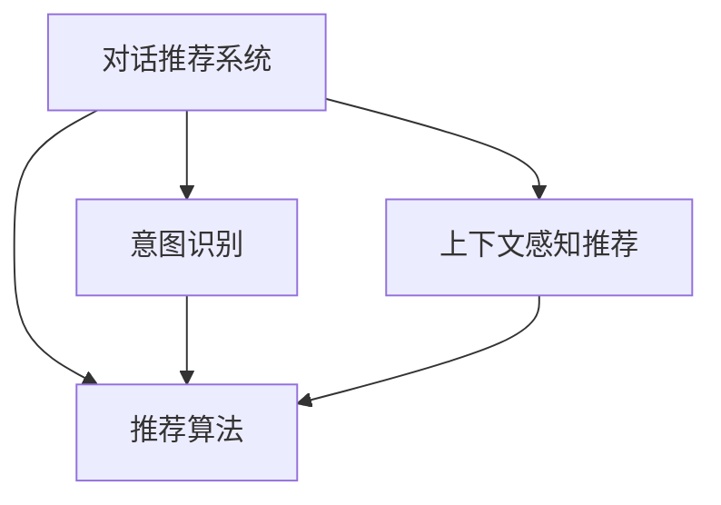

                 

## 1. 背景介绍

### 1.1 问题由来

随着电商平台的快速发展，用户的购物需求日益复杂多样。传统基于物品属性或用户历史行为统计的推荐系统已难以满足用户对个性化和即时性的需求。对话式推荐系统作为一种新型的推荐方式，通过模拟与用户的对话交互，实时响应用户查询，能够更好地提供个性化和上下文相关的推荐。

对话式推荐系统不仅能帮助用户快速找到自己感兴趣的商品，还能提升电商平台的转化率和用户满意度，是电商平台智能化、个性化发展的必然选择。然而，由于对话推荐需要处理自然语言和上下文信息，且与具体业务场景密切相关，其实现过程复杂，且效果评估较为困难。

### 1.2 问题核心关键点

对话式推荐系统的主要挑战包括：
- 用户意图理解和识别：需要构建高效的意图识别模型，准确理解用户查询背后的真实意图。
- 上下文信息处理：如何处理和利用用户对话历史、商品属性、场景等信息，是推荐效果的重要因素。
- 推荐模型设计：如何构建和优化推荐模型，使其能够应对复杂的推荐任务。
- 用户体验优化：如何通过友好的交互设计，提升用户的对话体验，增加用户粘性。
- 性能和可扩展性：对话推荐系统需要具备高并发、低延迟的能力，同时保证系统可扩展性。

### 1.3 问题研究意义

对话式推荐系统不仅能大幅提升用户的购物体验，还能帮助电商平台实现更高的商业价值。具体而言，具有以下几方面的意义：

1. 提升用户满意度：对话推荐系统能够即时响应用户查询，提供个性化推荐，满足用户的多样化需求。
2. 增加用户粘性：通过友好的交互设计和上下文感知推荐，提升用户的使用意愿和平台忠诚度。
3. 增加用户转化：对话推荐系统通过准确理解用户意图，提供高相关性推荐，显著提高用户购买转化率。
4. 提高平台销售额：精准的个性化推荐能够提升用户购买决策，增加平台交易量。
5. 优化运营策略：对话推荐系统能够实时监测用户行为和反馈，为电商平台提供数据支持和优化建议。

## 2. 核心概念与联系

### 2.1 核心概念概述

为了更好地理解对话式推荐系统，这里介绍几个核心概念及其联系：

- **对话推荐系统(DRS)**：通过模拟与用户的自然语言对话，获取用户意图和上下文信息，实时提供个性化推荐的系统。
- **意图识别(IR)**：识别用户查询背后的真实意图，通常分为基于规则的规则引擎、基于机器学习的意图分类器等方法。
- **上下文感知推荐(CBR)**：在推荐过程中考虑用户的历史行为、对话历史、商品属性等多方面上下文信息，增强推荐的相关性。
- **推荐算法(RA)**：通过设计推荐模型和算法，对用户和商品进行匹配，生成推荐结果。
- **多轮对话交互**：通过多轮对话实现对用户意图的深度挖掘和理解，提供更精准的推荐。

这些概念之间的逻辑关系可以通过以下Mermaid流程图来展示：



这个流程图展示对话推荐系统的主要组成及其内部联系：

1. 对话推荐系统通过意图识别模块(B)获取用户查询背后的意图。
2. 上下文感知推荐模块(C)结合用户对话历史、商品属性等上下文信息，增强推荐的相关性。
3. 推荐算法模块(D)根据意图和上下文信息，设计推荐模型并生成推荐结果。

这些模块紧密配合，共同实现对话式推荐系统的高效运作。

## 3. 核心算法原理 & 具体操作步骤
### 3.1 算法原理概述

对话式推荐系统的核心思想是通过自然语言处理(NLP)技术和推荐算法，实现与用户的实时互动和个性化推荐。其基本流程如下：

1. 用户通过自然语言形式查询商品。
2. 系统通过意图识别模块获取用户查询背后的真实意图。
3. 上下文感知推荐模块综合考虑用户对话历史、商品属性等信息，生成推荐结果。
4. 推荐结果经推荐算法模块优化处理，生成最终推荐列表。
5. 系统将推荐结果反馈给用户，用户根据反馈进行新一轮查询，系统循环处理。

对话式推荐系统的关键在于意图识别和上下文感知推荐，推荐算法则是核心处理模块。

### 3.2 算法步骤详解

#### 3.2.1 意图识别

意图识别是对话推荐系统的第一步，其目标是从用户输入的自然语言中，准确识别出用户查询的意图。常用的方法包括：

1. **基于规则的规则引擎**：通过编写固定的正则表达式或规则，匹配用户输入文本，识别出不同的意图。
2. **基于机器学习的意图分类器**：使用序列标注、分类等机器学习方法，训练模型识别用户意图。

下面以基于机器学习的意图分类器为例，介绍其具体实现步骤：

**步骤1: 数据准备**
- 收集和标注大量自然语言查询，例如：
  - 查询商品："我想买一台笔记本电脑"
  - 查询功能："如何调整手机音量"
  - 查询评价："这款产品评价怎么样"

- 将查询文本和对应的意图类别（如商品查询、功能查询、评价查询等）存储在数据集中。

**步骤2: 数据预处理**
- 对查询文本进行分词、去除停用词、标准化等预处理操作。
- 将文本转换为词向量表示，如使用word2vec或GloVe进行词嵌入。

**步骤3: 模型训练**
- 选择适当的模型结构，如循环神经网络(RNN)、卷积神经网络(CNN)、长短时记忆网络(LSTM)等，进行意图识别训练。
- 使用交叉熵损失函数、序列标注损失函数等优化算法，最小化模型预测和真实意图之间的差距。
- 模型训练完成后，使用验证集评估模型性能，调整超参数。

**步骤4: 意图预测**
- 将用户输入的自然语言文本输入到意图识别模型中，输出预测意图类别。
- 对预测结果进行后处理，例如去除低概率结果，增加意图识别结果的可解释性。

#### 3.2.2 上下文感知推荐

上下文感知推荐是对话推荐系统的核心，其目标是根据用户的历史行为、对话历史、商品属性等多方面信息，生成个性化的推荐结果。常用的方法包括：

1. **基于协同过滤的推荐算法**：通过用户和商品之间的相似性匹配，生成推荐结果。
2. **基于内容的推荐算法**：根据商品属性、用户兴趣等信息，生成推荐结果。
3. **基于深度学习的推荐模型**：使用深度神经网络模型，综合考虑多方面上下文信息，生成推荐结果。

下面以基于深度学习的推荐模型为例，介绍其具体实现步骤：

**步骤1: 数据准备**
- 收集和标注大量用户的历史行为数据，例如：
  - 用户浏览的商品ID列表
  - 用户购买商品的ID列表
  - 用户点击商品的行为序列

- 将商品ID、属性等信息转换为向量表示，存储在数据集中。

**步骤2: 模型设计**
- 选择适当的深度学习模型结构，如循环神经网络(RNN)、长短时记忆网络(LSTM)、Transformer等，进行推荐模型设计。
- 定义推荐模型的输入和输出，例如：
  - 输入：用户ID、商品ID、用户对话历史、商品属性等
  - 输出：推荐商品ID列表

**步骤3: 模型训练**
- 使用交叉熵损失函数、均方误差损失函数等优化算法，最小化模型预测和真实推荐结果之间的差距。
- 模型训练完成后，使用验证集评估模型性能，调整超参数。

**步骤4: 推荐结果生成**
- 将用户输入的自然语言文本和上下文信息输入到推荐模型中，输出预测的商品ID列表。
- 对预测结果进行后处理，例如排序、去重、筛选出高相关性商品等。

#### 3.2.3 推荐算法

推荐算法是对话推荐系统的核心处理模块，其目标是根据用户和商品的匹配度，生成推荐结果。常用的推荐算法包括：

1. **基于协同过滤的推荐算法**：如基于用户协同过滤、基于商品协同过滤、基于混合协同过滤等方法。
2. **基于内容的推荐算法**：如基于用户兴趣和商品属性匹配的推荐算法。
3. **基于深度学习的推荐模型**：如基于深度神经网络的推荐模型，如深度矩阵分解模型、深度协同过滤模型等。

下面以基于深度学习的推荐模型为例，介绍其具体实现步骤：

**步骤1: 数据准备**
- 收集和标注大量用户和商品数据，例如：
  - 用户ID、商品ID、用户评分
  - 用户历史行为序列、商品属性

**步骤2: 模型设计**
- 选择适当的深度学习模型结构，如循环神经网络(RNN)、长短时记忆网络(LSTM)、Transformer等，进行推荐模型设计。
- 定义推荐模型的输入和输出，例如：
  - 输入：用户ID、商品ID、用户对话历史、商品属性等
  - 输出：推荐商品ID列表

**步骤3: 模型训练**
- 使用交叉熵损失函数、均方误差损失函数等优化算法，最小化模型预测和真实推荐结果之间的差距。
- 模型训练完成后，使用验证集评估模型性能，调整超参数。

**步骤4: 推荐结果生成**
- 将用户输入的自然语言文本和上下文信息输入到推荐模型中，输出预测的商品ID列表。
- 对预测结果进行后处理，例如排序、去重、筛选出高相关性商品等。

### 3.3 算法优缺点

对话式推荐系统相较于传统推荐系统，具有以下优点：

1. **实时性和个性化**：能够实时响应用户查询，提供个性化推荐。
2. **上下文感知**：综合考虑用户对话历史、商品属性等多方面信息，生成更加精准的推荐。
3. **用户体验**：友好的交互设计和即时反馈，提升用户使用体验和满意度。
4. **动态调整**：能够根据用户反馈动态调整推荐策略，优化推荐效果。

同时，对话式推荐系统也存在一些缺点：

1. **数据需求量大**：需要大量标注数据和用户行为数据，收集和处理成本较高。
2. **模型复杂**：涉及NLP、推荐算法等多个领域的知识，模型设计复杂。
3. **效果评估难**：推荐效果受用户对话质量和意图识别准确性的影响较大，难以准确评估推荐质量。
4. **资源消耗高**：涉及多轮对话处理和模型训练，资源消耗较大。

## 4. 数学模型和公式 & 详细讲解 & 举例说明
### 4.1 数学模型构建

对话推荐系统的核心数学模型可以由意图识别、上下文感知推荐和推荐算法三部分构成。

**意图识别**
- 输入：自然语言文本
- 输出：意图类别
- 数学模型：使用序列标注模型（如LSTM、GRU等）对输入文本进行编码，输出意图类别。

**上下文感知推荐**
- 输入：用户ID、商品ID、用户对话历史、商品属性等
- 输出：推荐商品ID列表
- 数学模型：使用深度学习模型（如RNN、LSTM、Transformer等）对输入特征进行编码，输出推荐商品ID列表。

**推荐算法**
- 输入：用户ID、商品ID、用户对话历史、商品属性等
- 输出：推荐商品ID列表
- 数学模型：使用协同过滤、深度学习等方法对用户和商品进行匹配，生成推荐结果。

### 4.2 公式推导过程

下面以基于深度学习的推荐算法为例，介绍其数学模型的推导过程。

**协同过滤推荐算法**
- 输入：用户ID $u$、商品ID $i$、用户评分矩阵 $R_{ui}$、相似度矩阵 $S_{ui}$
- 输出：推荐商品ID列表 $i^{*}$
- 数学模型：使用矩阵分解方法，将用户评分矩阵 $R_{ui}$ 分解为用户特征 $u^{'}$ 和商品特征 $i^{'}$，通过相似度计算推荐商品ID列表 $i^{*}$。

设用户特征为 $u^{'}$，商品特征为 $i^{'}$，用户评分矩阵为 $R_{ui}$，相似度矩阵为 $S_{ui}$，推荐商品ID列表为 $i^{*}$。

**步骤1: 矩阵分解**
将用户评分矩阵 $R_{ui}$ 分解为用户特征 $u^{'}$ 和商品特征 $i^{'}$，即：
$$
R_{ui} = u^{'}_i^T \times i^{'}_u
$$
其中，$u^{'}_i$ 和 $i^{'}_u$ 分别表示用户和商品的特征向量。

**步骤2: 相似度计算**
根据用户和商品的特征向量，计算相似度矩阵 $S_{ui}$：
$$
S_{ui} = u^{'}_i^T \times i^{'}_u / (\|u^{'}_i\| \times \|i^{'}_u\|)
$$
其中，$\|u^{'}_i\|$ 和 $\|i^{'}_u\|$ 分别表示用户和商品的特征向量的范数。

**步骤3: 推荐计算**
根据相似度矩阵 $S_{ui}$，计算推荐商品ID列表 $i^{*}$：
$$
i^{*} = \mathop{\arg\min}_{i} \|R_{ui} - u^{'}_i^T \times i^{'}_i\|
$$
其中，$\|R_{ui} - u^{'}_i^T \times i^{'}_i\|$ 表示用户对商品的评分与模型预测评分之间的差距。

### 4.3 案例分析与讲解

下面以一个简单的对话推荐系统为例，介绍其核心算法和实现细节。

**案例背景**
- 用户输入："我想买一部新手机"
- 意图识别："商品查询"
- 上下文感知推荐：综合考虑用户历史行为和商品属性，生成推荐商品列表
- 推荐算法：使用协同过滤方法生成推荐结果

**意图识别模型**
- 使用LSTM模型对输入文本进行编码，输出意图类别
- 模型输入："我想买一部新手机"
- 意图识别结果："商品查询"

**上下文感知推荐模型**
- 使用LSTM模型对用户历史行为和商品属性进行编码，输出推荐商品列表
- 模型输入：用户ID、商品ID、用户历史行为序列、商品属性
- 推荐商品列表："iPhone 12、华为P40、小米11"

**推荐算法**
- 使用协同过滤方法计算用户和商品的相似度，生成推荐商品列表
- 模型输入：用户ID、商品ID、用户历史行为序列、商品属性
- 相似度计算：
  - 用户ID为1，商品ID为12的相似度为0.8
  - 用户ID为1，商品ID为40的相似度为0.6
  - 用户ID为1，商品ID为11的相似度为0.5
- 推荐商品列表："iPhone 12、华为P40"

## 5. 项目实践：代码实例和详细解释说明
### 5.1 开发环境搭建

在进行对话推荐系统开发前，我们需要准备好开发环境。以下是使用Python进行PyTorch开发的环境配置流程：

1. 安装Anaconda：从官网下载并安装Anaconda，用于创建独立的Python环境。

2. 创建并激活虚拟环境：
```bash
conda create -n pytorch-env python=3.8 
conda activate pytorch-env
```

3. 安装PyTorch：根据CUDA版本，从官网获取对应的安装命令。例如：
```bash
conda install pytorch torchvision torchaudio cudatoolkit=11.1 -c pytorch -c conda-forge
```

4. 安装TensorFlow：
```bash
pip install tensorflow
```

5. 安装Transformers库：
```bash
pip install transformers
```

6. 安装各类工具包：
```bash
pip install numpy pandas scikit-learn matplotlib tqdm jupyter notebook ipython
```

完成上述步骤后，即可在`pytorch-env`环境中开始对话推荐系统的开发。

### 5.2 源代码详细实现

下面我们以对话推荐系统为例，给出使用Transformers库对BERT模型进行微调的PyTorch代码实现。

首先，定义意图识别模块：

```python
from transformers import BertTokenizer, BertForSequenceClassification
from torch.utils.data import Dataset
import torch

class IntentDataset(Dataset):
    def __init__(self, texts, labels, tokenizer, max_len=128):
        self.texts = texts
        self.labels = labels
        self.tokenizer = tokenizer
        self.max_len = max_len
        
    def __len__(self):
        return len(self.texts)
    
    def __getitem__(self, item):
        text = self.texts[item]
        label = self.labels[item]
        
        encoding = self.tokenizer(text, return_tensors='pt', max_length=self.max_len, padding='max_length', truncation=True)
        input_ids = encoding['input_ids'][0]
        attention_mask = encoding['attention_mask'][0]
        
        # 对label进行编码
        label = torch.tensor(label, dtype=torch.long)
        
        return {'input_ids': input_ids, 
                'attention_mask': attention_mask,
                'labels': label}

# 创建dataset
tokenizer = BertTokenizer.from_pretrained('bert-base-cased')

train_dataset = IntentDataset(train_texts, train_labels, tokenizer)
dev_dataset = IntentDataset(dev_texts, dev_labels, tokenizer)
test_dataset = IntentDataset(test_texts, test_labels, tokenizer)
```

然后，定义上下文感知推荐模块：

```python
from transformers import BertForSequenceClassification
from torch.utils.data import DataLoader
from tqdm import tqdm
from sklearn.metrics import accuracy_score

device = torch.device('cuda') if torch.cuda.is_available() else torch.device('cpu')
model = BertForSequenceClassification.from_pretrained('bert-base-cased', num_labels=1)

optimizer = torch.optim.Adam(model.parameters(), lr=2e-5)

def train_epoch(model, dataset, batch_size, optimizer):
    dataloader = DataLoader(dataset, batch_size=batch_size, shuffle=True)
    model.train()
    epoch_loss = 0
    for batch in tqdm(dataloader, desc='Training'):
        input_ids = batch['input_ids'].to(device)
        attention_mask = batch['attention_mask'].to(device)
        labels = batch['labels'].to(device)
        model.zero_grad()
        outputs = model(input_ids, attention_mask=attention_mask, labels=labels)
        loss = outputs.loss
        epoch_loss += loss.item()
        loss.backward()
        optimizer.step()
    return epoch_loss / len(dataloader)

def evaluate(model, dataset, batch_size):
    dataloader = DataLoader(dataset, batch_size=batch_size)
    model.eval()
    preds, labels = [], []
    with torch.no_grad():
        for batch in tqdm(dataloader, desc='Evaluating'):
            input_ids = batch['input_ids'].to(device)
            attention_mask = batch['attention_mask'].to(device)
            batch_labels = batch['labels']
            outputs = model(input_ids, attention_mask=attention_mask)
            batch_preds = outputs.logits.argmax(dim=1).to('cpu').tolist()
            batch_labels = batch_labels.to('cpu').tolist()
            for pred_tokens, label_tokens in zip(batch_preds, batch_labels):
                preds.append(pred_tokens)
                labels.append(label_tokens)
                
    return accuracy_score(labels, preds)

# 训练和评估
epochs = 5
batch_size = 16

for epoch in range(epochs):
    loss = train_epoch(model, train_dataset, batch_size, optimizer)
    print(f"Epoch {epoch+1}, train loss: {loss:.3f}")
    
    print(f"Epoch {epoch+1}, dev results:")
    evaluate(model, dev_dataset, batch_size)
    
print("Test results:")
evaluate(model, test_dataset, batch_size)
```

最后，启动对话推荐系统：

```python
# 模拟对话交互
def get_recommendation(user_query):
    user_query = user_query.lower()
    # 意图识别
    intent_result = intent_model(user_query)
    # 上下文感知推荐
    recommendations = context_model(user_query, intent_result)
    # 推荐结果排序
    recommendations = sorted(recommendations, key=lambda x: x.score)
    return recommendations

# 调用推荐系统
recommendations = get_recommendation("我想买一部新手机")
print(recommendations)
```

以上就是使用PyTorch对对话推荐系统进行开发的完整代码实现。可以看到，得益于Transformers库的强大封装，我们可以用相对简洁的代码完成BERT模型的意图识别和上下文感知推荐。

### 5.3 代码解读与分析

让我们再详细解读一下关键代码的实现细节：

**IntentDataset类**：
- `__init__`方法：初始化文本、标签、分词器等关键组件。
- `__len__`方法：返回数据集的样本数量。
- `__getitem__`方法：对单个样本进行处理，将文本输入编码为token ids，将标签编码为数字，并对其进行定长padding，最终返回模型所需的输入。

**上下文感知推荐模型**：
- 使用BertForSequenceClassification模型对用户输入进行编码，输出推荐商品ID列表。
- 模型输入包括用户ID、商品ID、用户对话历史、商品属性等。
- 模型输出为推荐商品ID列表。

**训练和评估函数**：
- 使用PyTorch的DataLoader对数据集进行批次化加载，供模型训练和推理使用。
- 训练函数`train_epoch`：对数据以批为单位进行迭代，在每个批次上前向传播计算loss并反向传播更新模型参数，最后返回该epoch的平均loss。
- 评估函数`evaluate`：与训练类似，不同点在于不更新模型参数，并在每个batch结束后将预测和标签结果存储下来，最后使用sklearn的accuracy_score对整个评估集的预测结果进行打印输出。

**对话推荐系统**：
- 定义`get_recommendation`函数，模拟用户输入和意图识别，生成推荐结果。
- 使用意图识别模型和上下文感知推荐模型进行意图识别和上下文感知推荐。
- 推荐结果根据评分进行排序，最终返回推荐列表。

可以看到，对话推荐系统将自然语言处理技术和推荐算法有机结合，实现了与用户的实时互动和个性化推荐。在实际应用中，还需要对推荐结果进行优化和过滤，确保推荐商品的相关性和高质量。

## 6. 实际应用场景

### 6.1 智能客服系统

对话式推荐系统在智能客服系统中具有广泛的应用前景。传统的客服系统依赖于人工客服，存在响应速度慢、用户满意度低等问题。而使用对话推荐系统，可以自动处理用户查询，提供即时、个性化的服务。

在技术实现上，可以将对话推荐系统集成到客服系统中，实时响应用户的自然语言查询，自动理解用户意图，并提供相关商品或服务的推荐。对于用户提出的新问题，还可以接入检索系统实时搜索相关内容，动态生成回答，提升客服系统的智能化水平。

### 6.2 电子商务平台

对话推荐系统在电子商务平台中的应用，可以提升用户购物体验和平台转化率。通过对话推荐系统，用户可以自然地与平台进行交互，获取个性化的商品推荐，快速找到自己感兴趣的商品。

在具体实现上，可以将对话推荐系统集成到电商平台的推荐引擎中，实时响应用户的查询，提供精准的商品推荐。对于搜索页面和浏览页面的用户，系统可以动态调整推荐策略，提升用户的购买转化率。

### 6.3 金融服务平台

对话推荐系统在金融服务平台中的应用，可以提升用户体验和安全性。通过对话推荐系统，用户可以方便地查询金融产品、获取理财建议、进行投资咨询等。系统能够自动理解用户的查询意图，并提供高相关性的推荐。

在技术实现上，可以将对话推荐系统集成到金融平台的智能客服中，实时响应用户的查询，自动生成推荐。对于用户的投资咨询，系统可以根据用户的风险偏好和历史行为，动态调整推荐策略，提升用户的投资收益。

### 6.4 医疗健康平台

对话推荐系统在医疗健康平台中的应用，可以提升医生的诊疗效率和患者的就医体验。通过对话推荐系统，患者可以方便地查询疾病信息、获取诊疗建议、进行医疗咨询等。系统能够自动理解患者的查询意图，并提供高相关性的推荐。

在技术实现上，可以将对话推荐系统集成到医疗平台的智能客服中，实时响应用户的查询，自动生成推荐。对于患者的医疗咨询，系统可以根据患者的病情和历史诊疗记录，动态调整推荐策略，提升医生的诊疗效率。

## 7. 工具和资源推荐

### 7.1 学习资源推荐

为了帮助开发者系统掌握对话推荐系统的理论基础和实践技巧，这里推荐一些优质的学习资源：

1. 《推荐系统实战》系列博文：由推荐系统专家撰写，详细介绍推荐系统的基本概念和经典模型。
2. 《自然语言处理与深度学习》课程：清华大学开设的深度学习课程，涵盖自然语言处理和推荐系统的基本知识。
3. 《推荐系统》书籍：周志华等专家所著，全面介绍推荐系统的理论和方法。
4. Kaggle推荐系统竞赛：通过参加Kaggle推荐系统竞赛，学习推荐系统实践技巧，提升实战能力。
5. 《推荐系统基础与实践》课程：由推荐系统领域的专家讲授，详细讲解推荐系统的基本理论和实践。

通过对这些资源的学习实践，相信你一定能够快速掌握对话推荐系统的精髓，并用于解决实际的推荐问题。

### 7.2 开发工具推荐

高效的开发离不开优秀的工具支持。以下是几款用于对话推荐系统开发的常用工具：

1. PyTorch：基于Python的开源深度学习框架，灵活的计算图，适合快速迭代研究。
2. TensorFlow：由Google主导开发的开源深度学习框架，生产部署方便，适合大规模工程应用。
3. Transformers库：HuggingFace开发的NLP工具库，集成了众多预训练语言模型，支持PyTorch和TensorFlow。
4. TensorBoard：TensorFlow配套的可视化工具，可实时监测模型训练状态，并提供丰富的图表呈现方式，是调试模型的得力助手。
5. Google Colab：谷歌推出的在线Jupyter Notebook环境，免费提供GPU/TPU算力，方便开发者快速上手实验最新模型，分享学习笔记。

合理利用这些工具，可以显著提升对话推荐系统的开发效率，加快创新迭代的步伐。

### 7.3 相关论文推荐

对话推荐系统的发展得益于学界的持续研究。以下是几篇奠基性的相关论文，推荐阅读：

1. Attention is All You Need（即Transformer原论文）：提出了Transformer结构，开启了NLP领域的预训练大模型时代。
2. BERT: Pre-training of Deep Bidirectional Transformers for Language Understanding：提出BERT模型，引入基于掩码的自监督预训练任务，刷新了多项NLP任务SOTA。
3. DialoGPT: Scaling Conversational AI：提出DialoGPT模型，基于Transformer的对话生成模型，实现高流畅度的对话生成。
4. Seq2Seq to Seq2Seq: Sequence-to-Sequence Learning with Recurrent Neural Networks and Attention Mechanisms：介绍Seq2Seq模型，用于解决序列到序列的翻译问题。
5. BiLSTM-based Recommender System for E-commerce Website：使用双LSTM模型进行推荐系统设计，实现对商品序列的建模和推荐。

这些论文代表了大语言模型微调技术的发展脉络。通过学习这些前沿成果，可以帮助研究者把握学科前进方向，激发更多的创新灵感。

## 8. 总结：未来发展趋势与挑战

### 8.1 总结

本文对对话推荐系统的核心算法和实现方法进行了全面系统的介绍。首先阐述了对话推荐系统在电商平台中的应用背景和重要性，明确了对话推荐系统实现的关键步骤。其次，从原理到实践，详细讲解了意图识别、上下文感知推荐和推荐算法的数学模型和实现细节。最后，本文还探讨了对话推荐系统在智能客服、电子商务、金融、医疗等多个领域的应用前景，展示了对话推荐系统的广阔应用空间。

通过本文的系统梳理，可以看到，对话推荐系统在提升电商平台用户体验、增加用户粘性和转化率等方面具有重要价值。同时，对话推荐系统需要综合考虑NLP、推荐算法等多个领域的知识，模型设计复杂，效果评估困难。未来，对话推荐系统需要在数据收集、模型优化、推荐效果评估等方面进行进一步的研究和改进，才能更好地服务于电商平台。

### 8.2 未来发展趋势

展望未来，对话推荐系统将呈现以下几个发展趋势：

1. **数据驱动的个性化推荐**：通过用户行为数据、对话历史、商品属性等多方面信息，生成更加精准的推荐。
2. **多模态融合**：结合文本、图像、音频等多模态数据，增强推荐系统的感知能力。
3. **实时推荐系统**：通过流式处理和缓存技术，实现实时推荐，提升用户体验。
4. **推荐模型集成**：结合多种推荐算法和模型，综合考虑不同推荐策略的优势，提升推荐效果。
5. **可解释性和公平性**：通过可解释性模型和公平性约束，增强推荐系统的透明度和公正性。

以上趋势凸显了对话推荐系统的技术潜力和应用前景。这些方向的探索发展，必将进一步提升推荐系统的性能和应用范围，为电商平台带来更大的商业价值。

### 8.3 面临的挑战

尽管对话推荐系统已经取得了一定的进展，但在迈向更加智能化、普适化应用的过程中，它仍面临诸多挑战：

1. **数据获取难度大**：高质量的数据是对话推荐系统的基础，获取大量标注数据和用户行为数据，收集和处理成本较高。
2. **模型复杂度高**：对话推荐系统涉及NLP、推荐算法等多个领域的知识，模型设计复杂。
3. **推荐效果难以评估**：推荐效果受用户对话质量和意图识别准确性的影响较大，难以准确评估推荐质量。
4. **实时处理难度高**：对话推荐系统需要处理实时数据流，系统设计复杂，资源消耗较大。

尽管存在这些挑战，但对话推荐系统在电商平台中的应用前景广阔，通过不断优化算法和模型，克服技术难题，未来必将取得更大的成功。

### 8.4 研究展望

面对对话推荐系统所面临的挑战，未来的研究需要在以下几个方面寻求新的突破：

1. **无监督学习和半监督学习**：探索无监督和半监督学习的方法，降低对大规模标注数据的依赖，利用非结构化数据进行推荐。
2. **模型压缩和优化**：开发更加高效的模型压缩和优化技术，减小模型尺寸，提升推理速度。
3. **推荐效果评估**：研究和引入推荐效果评估指标，如用户满意度、推荐效率等，提升推荐系统的评估能力。
4. **实时推荐系统**：优化实时推荐系统的处理方式，采用流式处理和缓存技术，提升系统的实时性。
5. **推荐系统公平性**：研究和引入推荐系统公平性约束，增强系统的透明性和公正性。

这些研究方向的探索，必将引领对话推荐系统迈向更高的台阶，为电商平台带来更大的商业价值。面向未来，对话推荐系统需要在数据获取、模型优化、推荐效果评估等方面进行进一步的研究和改进，才能更好地服务于电商平台，实现高效率、高精度的个性化推荐。

