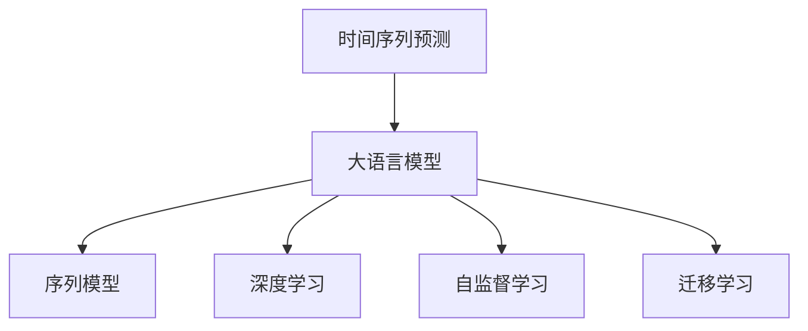

                 

# 电商平台中的时间序列预测：AI大模型的新应用

## 1. 背景介绍

### 1.1 问题由来

在电商领域，时间序列预测是一个核心的问题。这涉及到库存管理、需求预测、价格优化、促销活动等多个环节。传统上，时间序列预测主要依赖统计模型和规则工程，如ARIMA、指数平滑法等，但这些方法在面对复杂非线性关系和突发事件时往往效果有限。近年来，随着深度学习技术的发展，大语言模型在时间序列预测方面显示出巨大的潜力。

### 1.2 问题核心关键点

当前，AI大模型在电商领域的时间序列预测中主要应用于以下几个方面：
1. **需求预测**：根据历史销售数据，预测未来的销售趋势。
2. **库存管理**：通过预测需求，自动调整库存水平，降低缺货和积压风险。
3. **价格优化**：利用价格弹性预测，动态调整商品价格以最大化销售收入。
4. **促销活动**：预测促销活动的最佳时机和力度，提升转化率和营收。
5. **客户行为分析**：预测用户购买行为和偏好，优化产品推荐和广告投放策略。

AI大模型通过大规模数据预训练，具备强大的泛化能力和学习新任务的能力，能够从海量历史数据中提取复杂的时间序列特征，从而提升预测精度和模型鲁棒性。

### 1.3 问题研究意义

1. **降低运营成本**：通过精准的需求预测和库存管理，减少库存周转次数，降低运营成本。
2. **提升用户满意度**：预测用户需求，及时调整商品供应和促销策略，提升用户体验。
3. **增加营收**：通过动态定价和促销活动优化，提升商品的销售量和利润率。
4. **支持决策制定**：为电商平台的战略决策提供数据支撑，如商品拓展、市场策略调整等。
5. **加速技术应用**：推动AI技术在电商领域的应用，促进产业数字化转型。

## 2. 核心概念与联系

### 2.1 核心概念概述

在进行时间序列预测的AI大模型应用时，需要理解以下几个关键概念：

1. **时间序列预测**：根据历史数据预测未来某个时间段内的数值。
2. **大语言模型**：如BERT、GPT等，通过大规模数据预训练，具备强大的泛化能力和表示学习能力。
3. **序列模型**：如LSTM、GRU等，针对时间序列数据的建模。
4. **深度学习**：通过多层非线性变换，提取时间序列数据中的复杂特征。
5. **自监督学习**：利用无标签数据预训练模型，提取时间序列特征。
6. **迁移学习**：将预训练模型在电商领域进行微调，提升预测精度。

这些概念之间的逻辑关系可以通过以下Mermaid流程图来展示：



这个流程图展示了时间序列预测与大语言模型的关联，通过深度学习、序列模型、自监督学习等技术，大语言模型可以更好地应用于时间序列预测任务中。

## 3. 核心算法原理 & 具体操作步骤
### 3.1 算法原理概述

时间序列预测的本质是一个序列建模问题，即利用历史数据中的时间依赖关系，预测未来的数值。传统的统计方法如ARIMA、指数平滑等是基于线性假设和时间序列的自相关性建模。而深度学习方法，尤其是大语言模型，通过强大的泛化能力和表示学习能力，可以更好地捕捉时间序列中的非线性关系和复杂模式。

大语言模型通过在大规模无标签数据上进行预训练，学习到通用的语言和模式表示。通过微调，将预训练模型适应特定的时间序列预测任务，从而获得更好的预测效果。微调的目标是最小化预测误差，可以通过梯度下降等优化算法实现。

### 3.2 算法步骤详解

1. **准备数据**：收集电商平台的销售数据，分为训练集、验证集和测试集。
2. **选择模型**：选择合适的大语言模型或序列模型，如Transformer、LSTM等。
3. **预训练**：利用自监督学习方法，如掩码语言模型、时间序列预测任务等，对大语言模型进行预训练。
4. **微调**：在预训练模型的基础上，使用电商平台的销售数据进行微调，优化模型参数。
5. **评估**：在测试集上评估模型预测效果，选择最优模型。
6. **部署**：将优化后的模型集成到电商平台的预测系统中，实时生成预测结果。

### 3.3 算法优缺点

大语言模型在时间序列预测中的优点：
1. **泛化能力强**：能够学习到复杂的时间序列特征，适应各种数据分布。
2. **迁移能力强**：可以利用通用知识，快速适应特定电商场景。
3. **高预测精度**：通过深度学习，提升预测准确性和鲁棒性。
4. **动态调整**：可以实时更新模型，应对数据和市场的变化。

缺点：
1. **计算资源需求高**：大模型需要大量计算资源进行预训练和微调。
2. **模型复杂度高**：模型结构复杂，训练和推理速度较慢。
3. **模型解释性差**：大模型通常是一个"黑盒"，难以解释其决策过程。
4. **训练时间长**：需要大量标注数据和长时间训练，才能获得理想模型。

### 3.4 算法应用领域

大语言模型在时间序列预测中的应用领域广泛，包括但不限于：

- 电商平台的销售预测
- 库存管理与优化
- 价格动态调整
- 促销活动效果评估
- 用户行为分析与个性化推荐
- 市场趋势预测

这些应用场景中，大语言模型通过时间序列预测，帮助电商平台实现更精准的运营决策和用户体验优化。

## 4. 数学模型和公式 & 详细讲解 & 举例说明
### 4.1 数学模型构建

时间序列预测的数学模型可以表述为：

$$
y_t = f(x_t; \theta) + \epsilon_t
$$

其中 $y_t$ 表示第 $t$ 时刻的预测值，$x_t$ 表示 $t$ 时刻的特征向量，$f$ 为模型函数，$\theta$ 为模型参数，$\epsilon_t$ 为噪声。

对于大语言模型，可以采用自回归模型进行时间序列预测，如：

$$
y_t = \sum_{i=1}^{K} \alpha_i y_{t-i} + \epsilon_t
$$

其中 $K$ 为滞后阶数，$\alpha_i$ 为滞后权重。

### 4.2 公式推导过程

假设我们有一组时间序列数据 $y_{1:T}$，其中 $T$ 为总时间步数，利用LSTM模型进行预测，则模型可以表述为：

$$
h_t = \sigma(W_{xh}x_t + b_h + W_{hh}h_{t-1})
$$

$$
y_t = \sigma(W_{hy}h_t + b_y)
$$

其中 $h_t$ 为LSTM的隐藏状态，$W_{xh}$、$b_h$、$W_{hh}$、$b_y$ 为模型参数。

通过LSTM模型，可以学习到时间序列数据中的非线性依赖关系，从而提升预测精度。

### 4.3 案例分析与讲解

以电商平台商品销量预测为例，假设有历史销售数据 $y_{1:T}$，其中 $T=500$。利用LSTM模型进行预测，可以首先对数据进行归一化处理，然后采用LSTM模型进行训练和预测。在模型训练过程中，利用均方误差（MSE）作为损失函数，使用梯度下降算法优化模型参数。

训练步骤如下：
1. 数据准备：将历史数据分为训练集和测试集，进行归一化处理。
2. 模型构建：搭建LSTM模型，设置隐藏层大小、滞后阶数等参数。
3. 训练过程：在训练集上使用梯度下降算法优化模型参数。
4. 预测与评估：在测试集上评估模型预测效果，使用MSE评估预测精度。
5. 模型部署：将优化后的模型部署到电商平台的预测系统中，实时生成预测结果。

## 5. 项目实践：代码实例和详细解释说明
### 5.1 开发环境搭建

以下是使用Python和TensorFlow进行时间序列预测的开发环境配置流程：

1. 安装Anaconda：从官网下载并安装Anaconda，用于创建独立的Python环境。

2. 创建并激活虚拟环境：
```bash
conda create -n tf-env python=3.8 
conda activate tf-env
```

3. 安装TensorFlow：根据CUDA版本，从官网获取对应的安装命令。例如：
```bash
conda install tensorflow==2.7 -c pytorch
```

4. 安装相关工具包：
```bash
pip install numpy pandas matplotlib tensorflow
```

完成上述步骤后，即可在`tf-env`环境中开始时间序列预测的实践。

### 5.2 源代码详细实现

以下是一个使用LSTM模型进行商品销量预测的Python代码实现：

```python
import tensorflow as tf
import numpy as np
from tensorflow.keras.layers import LSTM, Dense
from sklearn.preprocessing import MinMaxScaler

# 数据准备
data = np.loadtxt('sales_data.csv', delimiter=',', skiprows=1)
x = data[:, :-1]
y = data[:, -1]

# 归一化处理
scaler = MinMaxScaler(feature_range=(0, 1))
x_scaled = scaler.fit_transform(x)

# 划分训练集和测试集
train_size = int(len(x_scaled) * 0.8)
test_size = len(x_scaled) - train_size
train_x, test_x = x_scaled[0:train_size, :], x_scaled[train_size:len(x_scaled), :]
train_y, test_y = y[0:train_size], y[train_size:len(y)]

# 构建LSTM模型
model = tf.keras.Sequential([
    LSTM(128, input_shape=(train_x.shape[1], train_x.shape[2])),
    Dense(1)
])

# 编译模型
model.compile(optimizer='adam', loss='mse')

# 训练模型
model.fit(train_x, train_y, epochs=50, batch_size=32)

# 预测并评估模型
test_predictions = model.predict(test_x)
mse = np.mean(((test_predictions - test_y) ** 2))
print(f'Mean Squared Error: {mse:.2f}')
```

### 5.3 代码解读与分析

让我们再详细解读一下关键代码的实现细节：

**数据准备**：
- 加载历史销售数据，将其分为特征 $x$ 和目标 $y$。
- 使用MinMaxScaler对特征进行归一化处理，使其在 $[0, 1]$ 范围内。

**模型构建**：
- 定义LSTM模型，设置隐藏层大小为128。
- 输出层为单神经元，用于预测销量。

**模型训练**：
- 使用Adam优化器，均方误差作为损失函数，训练模型。
- 设置训练轮数为50，批量大小为32。

**模型评估**：
- 在测试集上预测销量，计算均方误差（MSE）。
- 输出模型评估结果，展示预测精度。

可以看到，使用LSTM模型进行时间序列预测的代码实现相对简洁高效。开发者可以将更多精力放在数据处理、模型改进等高层逻辑上，而不必过多关注底层的实现细节。

### 5.4 运行结果展示

运行上述代码，可以得到模型在测试集上的预测结果和均方误差。通过调整模型参数和训练轮数，可以获得更精确的预测结果。

## 6. 实际应用场景
### 6.1 智能库存管理

基于大语言模型的时间序列预测，可以在电商平台的库存管理中发挥重要作用。传统库存管理往往依赖人工估算和经验判断，难以适应快速变化的市场需求。通过时间序列预测，可以自动调整库存水平，减少缺货和积压风险。

在技术实现上，可以收集历史销售数据，预测未来销量，实时调整库存。当预测销量超过当前库存时，系统自动发出补货指令。通过动态库存管理，可以大幅降低库存成本，提升运营效率。

### 6.2 价格优化策略

电商平台通过时间序列预测，可以精准把握价格弹性，动态调整商品价格以最大化销售收入。传统价格策略依赖经验法则和市场调研，难以适应瞬息万变的市场环境。通过时间序列预测，可以实时监控价格变动对销量的影响，自动调整最优价格策略。

例如，可以利用历史销售数据和促销活动数据，预测价格变动对销量的影响，从而在合适时机调整价格，提升销售额。

### 6.3 用户行为分析

大语言模型通过时间序列预测，可以深入分析用户行为，预测用户购买意向和偏好，优化产品推荐和广告投放策略。通过预测用户未来的购买行为，电商平台可以提前准备促销活动，提升用户满意度。

例如，可以通过分析用户浏览历史、点击行为、购买记录等数据，预测用户未来的购买意向，实现精准的个性化推荐。

### 6.4 未来应用展望

随着时间序列预测技术的不断发展，未来基于大语言模型的时间序列预测将呈现以下几个发展趋势：

1. **多模态融合**：结合图像、视频等多模态数据，提升预测精度和鲁棒性。
2. **深度强化学习**：利用强化学习优化预测模型，提升决策效果。
3. **联邦学习**：通过联邦学习技术，保护用户隐私，提升模型泛化能力。
4. **低资源优化**：开发更轻量级的模型，降低计算和存储资源需求。
5. **实时预测**：利用分布式计算和边缘计算技术，实现实时预测。
6. **异常检测**：结合异常检测技术，及时发现和应对市场异常。

以上趋势凸显了时间序列预测技术的广阔前景，大语言模型在电商领域的应用将进一步深化，推动产业数字化转型升级。

## 7. 工具和资源推荐
### 7.1 学习资源推荐

为了帮助开发者系统掌握时间序列预测的AI大模型理论基础和实践技巧，这里推荐一些优质的学习资源：

1. 《深度学习与时间序列分析》书籍：全面介绍了时间序列预测的基本概念和深度学习方法。
2. 《TensorFlow实战：深度学习应用案例》：深入讲解了TensorFlow在时间序列预测中的应用实例。
3. 《LSTM与深度学习》在线课程：由深度学习专家讲授的LSTM模型和深度学习技术。
4. Kaggle时间序列预测竞赛：参与实际竞赛项目，实践时间序列预测技术。
5. TensorFlow官方文档：提供丰富的LSTM模型和深度学习算法资源。

通过对这些资源的学习实践，相信你一定能够快速掌握时间序列预测的精髓，并用于解决实际的电商问题。

### 7.2 开发工具推荐

高效的开发离不开优秀的工具支持。以下是几款用于时间序列预测的常用工具：

1. TensorFlow：基于Python的开源深度学习框架，支持LSTM等序列模型。
2. PyTorch：基于Python的深度学习框架，支持动态计算图和模型构建。
3. Jupyter Notebook：互动式开发环境，支持代码调试和结果展示。
4. Google Colab：免费在线Jupyter Notebook环境，提供GPU/TPU算力支持。
5. Keras：高层次API，简化LSTM模型的构建和训练。
6. TensorBoard：可视化工具，实时监控模型训练状态。

合理利用这些工具，可以显著提升时间序列预测任务的开发效率，加快创新迭代的步伐。

### 7.3 相关论文推荐

时间序列预测技术的不断发展，推动了其在电商领域的应用。以下是几篇奠基性的相关论文，推荐阅读：

1. LSTM网络：Long Short-Term Memory：介绍LSTM模型原理和应用实例。
2. CNN与LSTM结合的时间序列预测：A Long Short-Term Memory Network in Time Series Prediction：探讨CNN和LSTM的结合，提升预测精度。
3. 深度强化学习在时间序列预测中的应用：A Deep Reinforcement Learning Framework for Time Series Prediction：利用强化学习优化时间序列预测模型。
4. 联邦学习在时间序列预测中的应用：Federated Learning for Time Series Prediction：通过联邦学习技术，提升模型泛化能力。
5. 基于自回归模型的电商销量预测：ARIMA-based Sales Forecasting：利用ARIMA模型进行电商销量预测。

这些论文代表了大语言模型在时间序列预测方面的发展脉络，通过学习这些前沿成果，可以帮助研究者把握学科前进方向，激发更多的创新灵感。

## 8. 总结：未来发展趋势与挑战
### 8.1 研究成果总结

本文对基于大语言模型的时间序列预测方法进行了全面系统的介绍。首先阐述了时间序列预测在电商领域的应用背景和重要性，明确了大语言模型在预测中的关键作用。其次，从原理到实践，详细讲解了时间序列预测的数学模型、算法步骤、模型构建等核心内容，给出了具体的代码实现和结果展示。同时，本文还广泛探讨了大语言模型在电商领域的时间序列预测应用前景，展示了其在智能库存管理、价格优化、用户行为分析等方面的巨大潜力。

通过本文的系统梳理，可以看到，基于大语言模型的时间序列预测技术正在成为电商领域的重要范式，极大地提升时间序列预测的精度和模型鲁棒性。未来，随着深度学习技术的不断进步，时间序列预测将会在电商领域得到更广泛的应用，推动产业数字化转型升级。

### 8.2 未来发展趋势

展望未来，时间序列预测技术将呈现以下几个发展趋势：

1. **深度学习与多模态融合**：结合图像、视频等多模态数据，提升预测精度和鲁棒性。
2. **深度强化学习**：利用强化学习优化预测模型，提升决策效果。
3. **联邦学习**：通过联邦学习技术，保护用户隐私，提升模型泛化能力。
4. **低资源优化**：开发更轻量级的模型，降低计算和存储资源需求。
5. **实时预测**：利用分布式计算和边缘计算技术，实现实时预测。
6. **异常检测**：结合异常检测技术，及时发现和应对市场异常。

以上趋势凸显了时间序列预测技术的广阔前景，大语言模型在电商领域的应用将进一步深化，推动产业数字化转型升级。

### 8.3 面临的挑战

尽管时间序列预测技术已经取得了显著进展，但在迈向更加智能化、普适化应用的过程中，仍面临诸多挑战：

1. **数据质量瓶颈**：数据质量是时间序列预测的基础，但电商数据往往存在缺失、异常等问题，影响预测效果。
2. **模型复杂度高**：大模型结构复杂，训练和推理速度较慢。
3. **模型解释性差**：大模型通常是一个"黑盒"，难以解释其决策过程。
4. **计算资源需求高**：大模型需要大量计算资源进行预训练和微调。
5. **隐私保护问题**：电商数据涉及用户隐私，如何保护用户数据隐私，成为重要课题。

### 8.4 研究展望

面对时间序列预测面临的挑战，未来的研究需要在以下几个方面寻求新的突破：

1. **数据质量提升**：通过数据清洗、补全等技术，提升数据质量。
2. **模型轻量化**：开发更轻量级的模型，降低计算和存储资源需求。
3. **模型可解释性**：引入可解释性技术，增强模型的透明性和可解释性。
4. **隐私保护机制**：结合联邦学习等技术，保护用户隐私。
5. **实时预测技术**：利用分布式计算和边缘计算技术，实现实时预测。
6. **异常检测技术**：结合异常检测技术，及时发现和应对市场异常。

这些研究方向的研究成果将进一步推动时间序列预测技术在电商领域的应用，实现更精准、高效、安全的电商预测系统。

## 9. 附录：常见问题与解答

**Q1：时间序列预测中的LSTM模型是否适用于所有电商场景？**

A: LSTM模型在电商场景中具有较强的适应性，但对于某些特定场景（如高维度数据、复杂关系）可能效果有限。需要根据具体问题选择适合的模型。

**Q2：时间序列预测中的数据预处理有哪些方法？**

A: 时间序列预测中的数据预处理包括归一化、缺失值处理、异常值处理等。常用方法有MinMaxScaler、StandardScaler、插值法等。

**Q3：时间序列预测中的特征工程有哪些方法？**

A: 特征工程包括特征选择、特征提取、特征降维等。常用方法有LDA、PCA、特征组合等。

**Q4：时间序列预测中的模型评估有哪些指标？**

A: 时间序列预测中的模型评估指标包括均方误差（MSE）、平均绝对误差（MAE）、对称平均绝对误差（SMAPE）等。

**Q5：时间序列预测中的模型部署有哪些方法？**

A: 时间序列预测中的模型部署包括模型训练、模型保存、模型加载等。常用方法有TensorFlow Serving、TensorFlow Lite等。

通过本文的系统梳理，可以看到，基于大语言模型的时间序列预测技术正在成为电商领域的重要范式，极大地提升时间序列预测的精度和模型鲁棒性。未来，随着深度学习技术的不断进步，时间序列预测将会在电商领域得到更广泛的应用，推动产业数字化转型升级。

---

作者：禅与计算机程序设计艺术 / Zen and the Art of Computer Programming

