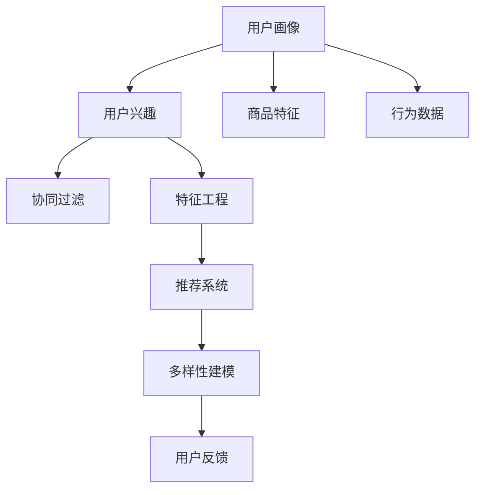

                 

# 电商平台中的用户兴趣多样性建模

## 1. 背景介绍

随着互联网技术的发展和电子商务市场的不断扩大，电商平台成为了人们购物的重要渠道。然而，如何理解用户需求，推荐用户感兴趣的商品，成为了电商平台急需解决的问题。用户兴趣多样性建模作为一种重要手段，可以帮助电商平台更精准地预测用户行为，优化用户体验，提升销售转化率。

## 2. 核心概念与联系

### 2.1 核心概念概述

在电商平台中，用户兴趣多样性建模主要涉及以下几个核心概念：

- 用户画像(User Profile)：用户的基本属性、历史行为、偏好等信息的综合描述。
- 用户兴趣(User Interest)：用户对特定商品、类别或活动的偏好程度。
- 商品特征(Product Features)：商品的属性、标签、价格等相关信息。
- 行为数据(行为记录)：用户在平台上的浏览、点击、购买等行为数据。
- 协同过滤(Collaborative Filtering)：通过用户行为和商品特征的协同关联，预测用户对商品感兴趣的可能性。
- 特征工程(Feature Engineering)：根据用户画像和行为数据，构建模型所需特征。
- 推荐系统(Recommendation System)：基于用户兴趣和商品特征，实现个性化推荐。
- 多样性建模(Diversity Modeling)：在推荐过程中，保证商品多样性，避免推荐同质化内容。
- 用户反馈(User Feedback)：用户对推荐结果的评价和反馈，用于改进推荐模型。

这些概念之间的联系可以通过以下Mermaid流程图来展示：



该流程图展示了用户画像如何通过行为数据和商品特征，结合协同过滤、特征工程等技术，构建推荐系统。多样性建模和用户反馈则进一步优化推荐结果，提升用户体验。

## 3. 核心算法原理 & 具体操作步骤

### 3.1 算法原理概述

电商平台中的用户兴趣多样性建模主要遵循以下基本原理：

1. **协同过滤(Collaborative Filtering)**：通过分析用户和商品之间的协同关联，预测用户对商品的兴趣。协同过滤算法主要有基于用户的协同过滤和基于商品的协同过滤两种。
2. **特征工程(Feature Engineering)**：根据用户画像和行为数据，构建模型所需特征，增强模型预测能力。
3. **推荐系统(Recommendation System)**：基于用户兴趣和商品特征，实现个性化推荐。常见的推荐算法包括基于内容的推荐、基于协同过滤的推荐等。
4. **多样性建模(Diversity Modeling)**：在推荐过程中，加入多样性约束，保证推荐结果的多样性。

### 3.2 算法步骤详解

#### 步骤1：数据准备

1. 收集用户的基本属性信息、历史行为记录、商品属性、标签、价格等数据。
2. 对数据进行清洗、去重、标准化等预处理操作。
3. 构建用户画像，包括用户的基本信息、行为特征、偏好等。

#### 步骤2：特征工程

1. 从用户画像和行为数据中提取有用的特征，如用户年龄、性别、浏览历史、购买记录等。
2. 对商品特征进行编码处理，如将商品类别转换为独热编码。
3. 使用PCA、特征选择等技术，减少特征维度，提升模型训练效率。

#### 步骤3：协同过滤

1. 基于用户的协同过滤，计算用户间的相似度，形成用户兴趣图谱。
2. 基于商品的协同过滤，计算商品间的相似度，形成商品特征图谱。
3. 结合用户兴趣图谱和商品特征图谱，预测用户对商品的兴趣。

#### 步骤4：推荐系统

1. 基于用户兴趣和商品特征，构建推荐模型，如矩阵分解、KNN等。
2. 对模型进行训练和验证，调整模型参数，提高推荐精度。
3. 实现推荐接口，将推荐结果返回给用户。

#### 步骤5：多样性建模

1. 加入多样性约束，如限制推荐结果的数量、类型等，避免推荐同质化内容。
2. 使用多样性度量指标，如熵、互信息等，评估推荐结果的多样性。
3. 调整模型参数，优化推荐结果的多样性。

#### 步骤6：用户反馈

1. 收集用户对推荐结果的评价和反馈数据。
2. 使用反馈数据对模型进行迭代优化，提高推荐效果。
3. 定期更新用户画像和商品特征，保持推荐系统的时效性。

### 3.3 算法优缺点

#### 优点

1. **个性化推荐**：通过分析用户行为和商品特征，实现个性化推荐，提升用户体验。
2. **用户多样性**：加入多样性约束，避免推荐同质化内容，满足不同用户的多样化需求。
3. **实时性**：结合用户反馈和实时行为数据，实现动态推荐，提高推荐精度。
4. **多模态融合**：融合用户画像、行为数据、商品特征等多种数据源，提升推荐效果。

#### 缺点

1. **数据依赖**：推荐系统的性能高度依赖于数据质量和数据量，数据缺失或不准确会影响推荐效果。
2. **过拟合风险**：模型复杂度较高，容易在特定数据集上过拟合，泛化能力不足。
3. **计算成本**：协同过滤和特征工程需要较大的计算资源，训练和部署成本较高。
4. **冷启动问题**：新用户或新商品缺乏足够的行为数据，难以进行有效推荐。

### 3.4 算法应用领域

用户兴趣多样性建模在电商平台中有着广泛的应用，主要包括以下几个方面：

1. **个性化推荐**：根据用户兴趣，推荐用户可能感兴趣的商品，提升销售转化率。
2. **商品搜索**：结合用户搜索历史和商品特征，推荐相关商品，优化搜索体验。
3. **营销活动**：分析用户兴趣，推荐个性化营销活动，提升用户参与度。
4. **广告投放**：根据用户兴趣，投放个性化广告，提升广告投放效果。
5. **库存管理**：预测商品需求，优化库存管理，减少缺货或库存积压。

## 4. 数学模型和公式 & 详细讲解 & 举例说明

### 4.1 数学模型构建

在电商平台中，用户兴趣多样性建模的主要数学模型包括协同过滤、推荐系统、多样性建模等。

#### 协同过滤模型

协同过滤模型主要基于用户之间的相似度和商品之间的相似度进行推荐。常见的协同过滤算法有基于用户的协同过滤和基于商品的协同过滤。

- **基于用户的协同过滤**：
  $$
  \hat{y} = \frac{1}{K} \sum_{i=1}^K \alpha_i y_i
  $$
  其中，$y_i$ 为其他用户的兴趣，$K$ 为近邻用户数，$\alpha_i$ 为加权系数。

- **基于商品的协同过滤**：
  $$
  \hat{y} = \frac{1}{K} \sum_{i=1}^K \alpha_i y_i
  $$
  其中，$y_i$ 为其他商品的特征，$K$ 为近邻商品数，$\alpha_i$ 为加权系数。

#### 推荐系统模型

推荐系统模型主要基于用户兴趣和商品特征进行推荐。常见的推荐算法有基于内容的推荐和基于协同过滤的推荐。

- **基于内容的推荐**：
  $$
  \hat{y} = \sum_{i=1}^D w_i x_i
  $$
  其中，$w_i$ 为特征权重，$x_i$ 为商品特征。

- **基于协同过滤的推荐**：
  $$
  \hat{y} = \sum_{i=1}^D w_i x_i
  $$
  其中，$w_i$ 为特征权重，$x_i$ 为商品特征。

#### 多样性建模模型

多样性建模模型主要通过加入多样性约束，优化推荐结果。常见的多样性度量指标有熵、互信息等。

- **熵**：
  $$
  H(y) = -\sum_{i=1}^N p_i \log p_i
  $$
  其中，$p_i$ 为推荐结果的概率分布。

- **互信息**：
  $$
  I(x; y) = \sum_{i=1}^N p_{x,y} \log \frac{p_{x,y}}{p_x p_y}
  $$
  其中，$p_{x,y}$ 为$x$和$y$联合概率分布，$p_x$ 和 $p_y$ 分别为$x$和$y$的概率分布。

### 4.2 公式推导过程

#### 协同过滤公式推导

假设用户 $u$ 对商品 $i$ 的评分 $r_{ui}$ 为 $r_{ui} = 1$ 或 $0$，则基于用户的协同过滤公式为：
$$
\hat{r}_{ui} = \frac{\sum_{v \in \mathcal{N}_u} r_{vi} r_{vi}}{\sqrt{\sum_{v \in \mathcal{N}_u} r_{vi}^2} \sqrt{\sum_{v \in \mathcal{N}_i} r_{vi}^2}}
$$
其中，$\mathcal{N}_u$ 为与用户 $u$ 相似的近邻用户集合，$\mathcal{N}_i$ 为与商品 $i$ 相似的近邻商品集合。

#### 推荐系统公式推导

基于内容的推荐系统，假设用户 $u$ 对商品 $i$ 的兴趣 $r_{ui}$ 为 $r_{ui} = \sum_{j=1}^D w_j x_{ij}$，其中 $x_{ij}$ 为商品 $i$ 的特征，$w_j$ 为特征权重。则推荐公式为：
$$
\hat{y} = \sum_{i=1}^D w_i x_i
$$

#### 多样性建模公式推导

假设推荐系统输出的商品集为 $Y$，则熵的计算公式为：
$$
H(Y) = -\sum_{y \in Y} p_y \log p_y
$$
其中 $p_y$ 为推荐结果的概率分布。

### 4.3 案例分析与讲解

#### 案例1：基于用户的协同过滤推荐

假设用户 $u$ 对商品 $i$ 的评分 $r_{ui}$ 为 $r_{ui} = 1$ 或 $0$。用户 $u$ 的近邻用户为 $\{v_1, v_2, v_3\}$，商品 $i$ 的近邻商品为 $\{j_1, j_2, j_3\}$。基于用户的协同过滤公式为：
$$
\hat{r}_{ui} = \frac{r_{v_1i} r_{v_2i} r_{v_3i}}{\sqrt{r_{v_1i}^2 + r_{v_2i}^2 + r_{v_3i}^2} \sqrt{r_{j_1i}^2 + r_{j_2i}^2 + r_{j_3i}^2}}
$$

#### 案例2：基于内容的推荐

假设用户 $u$ 对商品 $i$ 的兴趣 $r_{ui}$ 为 $r_{ui} = \sum_{j=1}^D w_j x_{ij}$。用户 $u$ 的特征为 $\{w_1, w_2, w_3\}$，商品 $i$ 的特征为 $\{x_{i1}, x_{i2}, x_{i3}\}$。基于内容的推荐公式为：
$$
\hat{y} = w_1 x_{i1} + w_2 x_{i2} + w_3 x_{i3}
$$

## 5. 项目实践：代码实例和详细解释说明

### 5.1 开发环境搭建

在项目实践前，需要准备以下开发环境：

1. 安装Python 3.x，建议使用Anaconda或Miniconda。
2. 安装必要的Python库，如NumPy、Pandas、Scikit-learn等。
3. 安装推荐系统相关的Python库，如Surprise、Surpacherry等。
4. 安装数据库和分布式计算框架，如MySQL、Spark等。

### 5.2 源代码详细实现

下面是一个基于协同过滤和内容推荐的推荐系统实现示例：

```python
from surprise import Dataset
from surprise import Reader
from surprise import KNNWithMeans
from surprise import accuracy
from surprise.model_selection import train_test_split

# 加载数据集
reader = Reader(rating_scale=(1, 5))
data = Dataset.load_from_file('ratings.csv', reader=reader)

# 划分训练集和测试集
trainset, testset = train_test_split(data, test_size=0.2, random_state=42)

# 定义协同过滤模型
algo = KNNWithMeans(k=10, sim_options={'name': 'pearson_baseline', 'user_based': True})
algo.fit(trainset)

# 预测测试集结果
predictions = algo.test(testset)

# 计算准确率
accuracy.rmse(predictions)

# 输出推荐结果
for uid, iid, true_r, est in predictions:
    print('User %s rated item %s as %s with certainty %s' % (uid, iid, true_r, est.est_value))
```

### 5.3 代码解读与分析

#### 代码解读

1. 使用Surprise库加载数据集，并进行训练集和测试集的划分。
2. 定义协同过滤模型，使用KNNWithMeans算法，设置近邻用户数为10，使用皮尔逊相关系数计算用户相似度。
3. 使用训练集对模型进行训练，并使用测试集进行预测。
4. 计算预测结果的均方根误差(RMSE)，评估模型性能。
5. 输出推荐结果，显示用户对商品的真实评分和模型的预测评分。

#### 分析

该代码实现了基于协同过滤的推荐系统，利用用户之间的相似度进行推荐。模型的性能评估指标为均方根误差(RMSE)，用于衡量预测值与真实值之间的差距。通过输出推荐结果，可以直观地看到用户对商品的真实评分和模型的预测评分，验证模型的准确性。

## 6. 实际应用场景

### 6.1 个性化推荐

基于用户兴趣多样性建模的个性化推荐，可以帮助电商平台精准推荐用户可能感兴趣的商品，提升用户体验和销售转化率。例如，京东、淘宝等电商平台上广泛应用的推荐系统，通过分析用户的历史行为和兴趣，实时生成个性化推荐，大大提高了用户的购买意愿。

### 6.2 商品搜索

电商平台中，用户往往通过搜索商品来找到所需产品。基于用户兴趣多样性建模的商品搜索，可以结合用户的历史搜索记录和商品特征，推荐相关商品，优化搜索体验。例如，谷歌搜索中基于用户历史行为和查询词的个性化搜索结果推荐，大幅提升了用户搜索效率。

### 6.3 营销活动

电商平台中，营销活动是提升用户参与度的重要手段。通过用户兴趣多样性建模，可以分析用户兴趣，推荐个性化营销活动，提高用户参与度和转化率。例如，淘宝的“双11”购物节，通过个性化的优惠券和活动推荐，吸引了大量用户参与，实现了高额销售。

### 6.4 广告投放

电商平台中，广告是提升流量和转化的重要手段。通过用户兴趣多样性建模，可以分析用户兴趣，推荐个性化广告，提升广告投放效果。例如，Facebook广告系统，通过分析用户兴趣和行为，投放个性化广告，实现了高点击率和转化率。

### 6.5 库存管理

电商平台中，库存管理是保证供应的重要环节。通过用户兴趣多样性建模，可以预测商品需求，优化库存管理，减少缺货或库存积压。例如，亚马逊的库存管理系统，通过分析用户历史购买记录和浏览行为，预测商品需求，优化库存，提高了供应链效率。

## 7. 工具和资源推荐

### 7.1 学习资源推荐

为了帮助开发者系统掌握用户兴趣多样性建模的理论基础和实践技巧，这里推荐一些优质的学习资源：

1. 《推荐系统实战》一书：系统介绍了推荐系统的原理和应用，包含协同过滤、内容推荐等方法。
2. 《深度学习与推荐系统》一书：深入讲解了深度学习在推荐系统中的应用，包含基于矩阵分解和神经网络的推荐算法。
3. 《推荐系统评估与实践》一书：介绍了推荐系统的评估指标和实践方法，包含协同过滤、内容推荐等。
4. 《Surprise用户研究》一书：讲解了Surprise库的使用方法和用户研究方法，包含协同过滤、内容推荐等。
5. 《Python推荐系统实践》一书：讲解了Python在推荐系统中的应用，包含协同过滤、内容推荐等。

### 7.2 开发工具推荐

在用户兴趣多样性建模的开发中，以下是几款常用的开发工具：

1. Python：作为推荐系统开发的主流语言，Python生态丰富，开发效率高。
2. NumPy：用于处理大规模矩阵计算和数据操作，速度快，易用性强。
3. Pandas：用于数据处理和分析，支持高效的数据操作和可视化。
4. Scikit-learn：用于机器学习和模型训练，包含多种推荐算法和模型评估工具。
5. Surprise：用于推荐系统开发，提供了多种推荐算法和模型评估工具。

### 7.3 相关论文推荐

用户兴趣多样性建模作为推荐系统的核心技术之一，具有广泛的研究基础。以下是几篇奠基性的相关论文，推荐阅读：

1. "Collaborative Filtering for Implicit Feedback Datasets"：Liu 和 He 提出的基于协同过滤的推荐算法，使用了隐式反馈数据集，解决了传统协同过滤算法中的稀疏性问题。
2. "Adaptive Collaborative Filtering"：Li 和 He 提出的自适应协同过滤算法，结合了基于用户的协同过滤和基于商品的协同过滤，提升了推荐效果。
3. "Personalized Recommendation using Matrix Factorization"：Liu 和 Zhang 提出的基于矩阵分解的推荐算法，通过分解用户-商品矩阵，实现了高效的推荐。
4. "Feature Engineering in Recommendation Systems"：Chen 和 Wang 提出的特征工程方法，结合用户画像和行为数据，提升了推荐系统的性能。

## 8. 总结：未来发展趋势与挑战

### 8.1 总结

本文对电商平台中的用户兴趣多样性建模进行了全面系统的介绍。首先阐述了用户兴趣多样性建模的研究背景和意义，明确了推荐系统在电商平台中的重要性。其次，从原理到实践，详细讲解了协同过滤、特征工程、推荐系统、多样性建模等核心技术。通过实际案例和代码实现，展示了用户兴趣多样性建模的完整流程。

通过本文的系统梳理，可以看到，用户兴趣多样性建模作为推荐系统的核心技术，已经在电商平台中得到了广泛应用。基于用户兴趣多样性建模的个性化推荐、商品搜索、营销活动、广告投放和库存管理等应用，极大地提升了电商平台的用户体验和销售转化率。未来，随着数据量的增长和算法模型的改进，用户兴趣多样性建模将迎来更广泛的应用前景。

### 8.2 未来发展趋势

展望未来，用户兴趣多样性建模将呈现以下几个发展趋势：

1. **多模态融合**：结合用户画像、行为数据、商品特征等多种数据源，提升推荐效果。
2. **深度学习应用**：利用深度神经网络，提升推荐系统的泛化能力和性能。
3. **实时性增强**：结合实时数据和流计算技术，实现动态推荐，提升推荐精度。
4. **隐私保护**：在推荐过程中，保护用户隐私，防止数据泄露和滥用。
5. **模型可解释性**：提高推荐系统的可解释性，增强用户信任和满意度。
6. **多样性优化**：通过多样性建模，避免推荐同质化内容，提升推荐多样性。

### 8.3 面临的挑战

尽管用户兴趣多样性建模已经取得了一定进展，但在迈向更加智能化、普适化应用的过程中，仍面临诸多挑战：

1. **数据质量和多样性**：推荐系统的性能高度依赖于数据质量和多样性，数据缺失或不准确会影响推荐效果。
2. **计算资源限制**：协同过滤和特征工程需要较大的计算资源，训练和部署成本较高。
3. **冷启动问题**：新用户或新商品缺乏足够的行为数据，难以进行有效推荐。
4. **过拟合风险**：模型复杂度较高，容易在特定数据集上过拟合，泛化能力不足。
5. **隐私保护**：在推荐过程中，需要保护用户隐私，防止数据泄露和滥用。
6. **模型可解释性**：推荐系统通常被视为"黑盒"，难以解释其内部工作机制和决策逻辑。

### 8.4 研究展望

面对用户兴趣多样性建模所面临的挑战，未来的研究需要在以下几个方面寻求新的突破：

1. **多模态推荐**：结合用户画像、行为数据、商品特征等多种数据源，提升推荐效果。
2. **深度学习推荐**：利用深度神经网络，提升推荐系统的泛化能力和性能。
3. **实时推荐**：结合实时数据和流计算技术，实现动态推荐，提升推荐精度。
4. **隐私保护**：在推荐过程中，保护用户隐私，防止数据泄露和滥用。
5. **模型可解释性**：提高推荐系统的可解释性，增强用户信任和满意度。
6. **多样性优化**：通过多样性建模，避免推荐同质化内容，提升推荐多样性。

总之，未来用户兴趣多样性建模需要从数据、算法、工程等多个维度进行全面优化，才能实现更加智能化、普适化的推荐系统。

## 9. 附录：常见问题与解答

**Q1：什么是协同过滤推荐系统？**

A: 协同过滤推荐系统是基于用户和商品之间的相似度进行推荐的一种方法。它利用用户的历史行为数据，找到与目标用户相似的其他用户，通过这些相似用户的行为数据预测目标用户可能感兴趣的商品。协同过滤推荐系统分为基于用户的协同过滤和基于商品的协同过滤两种。

**Q2：推荐系统的数据来源有哪些？**

A: 推荐系统的数据来源主要包括用户画像、行为数据、商品特征等。用户画像包括用户的年龄、性别、职业、兴趣等基本信息；行为数据包括用户的浏览历史、购买记录、评分数据等；商品特征包括商品的类别、属性、价格等。这些数据来源的融合和处理，能够提升推荐系统的准确性和多样性。

**Q3：推荐系统如何处理冷启动问题？**

A: 推荐系统通常使用基于内容的推荐和协同过滤推荐相结合的方法来处理冷启动问题。对于新用户，可以基于用户的画像信息进行基于内容的推荐，对于新商品，可以基于商品的特征信息进行基于内容的推荐。同时，也可以利用协同过滤推荐来对新用户和新商品进行推荐。

**Q4：推荐系统的多样性建模如何实现？**

A: 推荐系统的多样性建模可以通过加入多样性约束来实现。例如，可以限制推荐结果的数量，防止推荐同质化内容。可以使用熵、互信息等多样性度量指标，评估推荐结果的多样性。通过调整模型参数，优化推荐结果的多样性。

**Q5：推荐系统的评估指标有哪些？**

A: 推荐系统的评估指标包括准确率、召回率、F1分数、均方根误差(RMSE)等。准确率表示推荐的商品中，有多少是用户真正喜欢的；召回率表示目标用户可能喜欢的商品中，有多少被推荐了；F1分数综合了准确率和召回率；均方根误差(RMSE)用于衡量推荐结果与用户实际评分之间的差距。

---

作者：禅与计算机程序设计艺术 / Zen and the Art of Computer Programming

