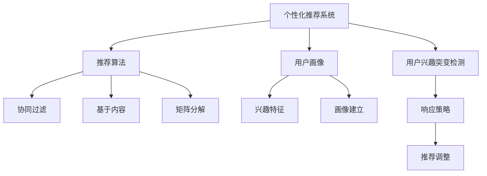
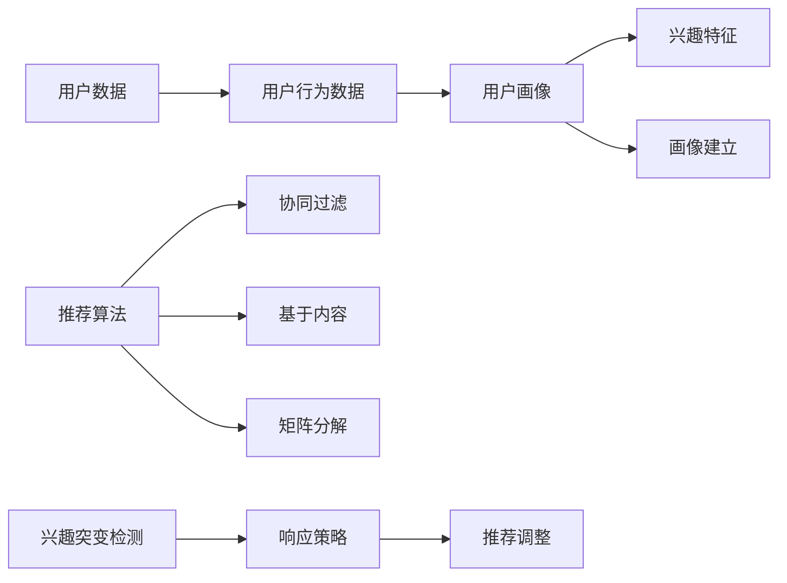

                 

# 电商平台中的用户兴趣突变检测与响应模型

在电子商务时代，个性化推荐系统已成为提升用户体验、提高用户留存率和销售额的重要工具。然而，现有的推荐算法通常基于用户的稳定兴趣和行为模式，难以捕捉用户兴趣的动态变化。为了应对这一挑战，本文将详细介绍一种基于用户兴趣突变检测与响应模型的新型推荐系统架构，包括检测算法、响应策略及其实现技术，并结合实际案例进行详细分析。

## 1. 背景介绍

### 1.1 问题由来
在电商平台的推荐系统中，用户的购买行为和兴趣偏好是动态变化的。例如，用户可能在短时间内从一个类别转移到另一个类别，或者对某些商品突然失去兴趣。传统的基于用户历史行为和兴趣模型的推荐算法，往往难以捕捉这种突发的变化，导致推荐结果的准确性和时效性受到限制。

为了解决这一问题，研究者们提出了多种算法和模型来预测用户兴趣的动态变化。例如，基于协同过滤的推荐算法，以及基于时间序列分析的预测方法等。然而，这些方法往往需要大量的用户交互数据和复杂的模型构建，计算复杂度高，且难以处理多维度数据。

## 2. 核心概念与联系

### 2.1 核心概念概述

为更好地理解本文所介绍的兴趣突变检测与响应模型，本节将介绍几个关键概念：

- 个性化推荐系统：通过分析用户的历史行为数据，为用户推荐其可能感兴趣的商品，提升用户体验和满意度。

- 用户兴趣突变检测：基于用户行为数据，检测出用户兴趣的突发变化，及时调整推荐策略，提升推荐效果。

- 推荐算法：用于构建推荐系统的核心算法，包括协同过滤、基于内容的推荐、基于矩阵分解等。

- 用户画像：基于用户历史行为和偏好，构建用户兴趣特征的概貌描述，用于推荐系统的个性化推荐。

- 模型优化：通过机器学习和深度学习技术，优化推荐模型的预测性能，提升推荐效果。

这些概念之间的逻辑关系可以通过以下Mermaid流程图来展示：



这个流程图展示了各个概念之间的逻辑联系：

1. 个性化推荐系统通过协同过滤、基于内容等推荐算法，为用户推荐可能感兴趣的商品。
2. 用户兴趣突变检测通过分析用户行为数据，检测出兴趣的突变。
3. 推荐算法构建推荐系统，用户画像用于兴趣特征的抽取和建立。
4. 响应策略根据检测结果，调整推荐策略，优化推荐结果。

这些概念共同构成了个性化推荐系统的核心技术框架，使得系统能够更好地适应用户兴趣的变化，提升推荐效果。

### 2.2 核心概念原理和架构的 Mermaid 流程图



此图展示了用户数据、行为数据、用户画像、兴趣特征、推荐算法、协同过滤、基于内容、矩阵分解、画像建立、兴趣突变检测、响应策略和推荐调整等核心概念之间的联系。用户数据和行为数据是构建用户画像的基础，兴趣特征和画像建立用于兴趣特征的抽取和建立，协同过滤、基于内容和矩阵分解用于推荐算法的构建，兴趣突变检测用于检测用户兴趣的变化，响应策略根据检测结果调整推荐策略，推荐调整用于优化推荐结果。

## 3. 核心算法原理 & 具体操作步骤

### 3.1 算法原理概述

本节将详细介绍基于用户兴趣突变检测与响应模型的推荐系统架构的算法原理。

#### 3.1.1 用户行为数据建模

用户行为数据包括用户点击、浏览、购买等操作行为，这些数据是构建用户画像和进行兴趣突变检测的基础。一般采用时间序列分析、用户轨迹分析等方法，构建用户的长期行为模式。

#### 3.1.2 用户画像建立

用户画像基于用户行为数据，通过聚类、因子分析等方法，构建用户兴趣特征的概貌描述。用户画像的建立过程如下：

1. **数据预处理**：对用户行为数据进行清洗、归一化、去重等处理，去除噪音数据。
2. **特征工程**：提取用户行为特征，如点击次数、浏览时间、购买金额等。
3. **聚类分析**：利用聚类算法（如K-means、层次聚类等）对用户进行分组，找出不同兴趣类型的用户群体。
4. **因子分析**：对用户行为特征进行因子分析，提取主成分，构建用户画像。

#### 3.1.3 兴趣突变检测

兴趣突变检测算法基于用户行为数据和用户画像，检测出用户兴趣的突发变化。具体实现步骤如下：

1. **设定阈值**：设定用户兴趣变化的阈值，如兴趣评分变化率、行为频率变化等。
2. **兴趣评分计算**：计算用户对各类商品的兴趣评分，通常采用加权平均值或权重回归等方法。
3. **变化检测**：比较用户当前的兴趣评分与历史评分的变化，检测是否发生兴趣突变。
4. **策略调整**：根据兴趣突变检测结果，调整推荐策略，优化推荐结果。

#### 3.1.4 推荐算法调整

推荐算法调整基于用户的兴趣突变检测结果，对推荐算法进行动态调整，提升推荐效果。具体实现步骤如下：

1. **策略调整**：根据兴趣突变检测结果，调整推荐算法中的权重参数，如协同过滤中的用户相似度、基于内容的推荐中的特征权重等。
2. **模型训练**：对调整后的推荐模型进行重新训练，确保模型能够适应新的用户兴趣变化。
3. **推荐调整**：基于训练好的模型，对用户进行个性化推荐，更新推荐列表。

### 3.2 算法步骤详解

#### 3.2.1 数据准备

- **用户行为数据**：收集用户的历史点击、浏览、购买等行为数据，包括商品ID、时间戳、操作类型等。
- **用户画像数据**：根据用户行为数据，构建用户画像，包括兴趣评分、特征向量等。

#### 3.2.2 用户画像建立

- **特征提取**：对用户行为数据进行特征工程，提取用户的点击次数、浏览时间、购买金额等特征。
- **聚类分析**：使用K-means等聚类算法，将用户分成不同兴趣类型。
- **因子分析**：对用户行为特征进行因子分析，构建用户画像，包括兴趣评分和特征向量。

#### 3.2.3 兴趣突变检测

- **阈值设定**：设定用户兴趣变化的阈值，如兴趣评分变化率、行为频率变化等。
- **兴趣评分计算**：计算用户对各类商品的兴趣评分，通常采用加权平均值或权重回归等方法。
- **变化检测**：比较用户当前的兴趣评分与历史评分的变化，检测是否发生兴趣突变。
- **策略调整**：根据兴趣突变检测结果，调整推荐策略。

#### 3.2.4 推荐算法调整

- **策略调整**：根据兴趣突变检测结果，调整推荐算法中的权重参数，如协同过滤中的用户相似度、基于内容的推荐中的特征权重等。
- **模型训练**：对调整后的推荐模型进行重新训练，确保模型能够适应新的用户兴趣变化。
- **推荐调整**：基于训练好的模型，对用户进行个性化推荐，更新推荐列表。

### 3.3 算法优缺点

#### 3.3.1 优点

- **动态调整**：能够实时检测用户兴趣的变化，动态调整推荐策略，提升推荐效果。
- **适应性强**：能够适应不同兴趣类型和行为模式的用户，提高推荐系统的覆盖率和准确性。
- **可解释性强**：通过用户画像和兴趣评分，解释推荐结果的来源和依据。

#### 3.3.2 缺点

- **计算复杂度高**：需要构建用户画像和进行兴趣突变检测，计算复杂度高。
- **数据需求大**：需要大量的用户行为数据，数据收集和处理成本高。
- **模型复杂度高**：需要调整推荐算法和重新训练模型，模型复杂度高。

### 3.4 算法应用领域

#### 3.4.1 电商推荐

该算法可以应用于电商平台的个性化推荐系统中，检测用户兴趣的突变，及时调整推荐策略，提升用户购物体验和满意度。

#### 3.4.2 视频推荐

该算法可以应用于视频推荐系统中，检测用户对视频的兴趣变化，及时调整推荐内容，提升用户的观看体验和粘性。

#### 3.4.3 音乐推荐

该算法可以应用于音乐推荐系统中，检测用户对音乐的兴趣变化，及时调整推荐曲目，提升用户的听歌体验和满意度。

## 4. 数学模型和公式 & 详细讲解 & 举例说明

### 4.1 数学模型构建

本节将使用数学语言对基于用户兴趣突变检测与响应模型的推荐系统架构进行更加严格的刻画。

设用户数为 $N$，商品数为 $M$，用户行为数据为 $D$，用户画像为 $P$，用户对商品的兴趣评分为 $I$，推荐算法为 $A$。

### 4.2 公式推导过程

#### 4.2.1 用户画像构建

用户画像 $P$ 由兴趣评分 $I$ 和特征向量 $F$ 组成，兴趣评分 $I$ 表示用户对商品的兴趣程度，特征向量 $F$ 表示用户的兴趣特征。

$$ P = (I, F) $$

兴趣评分 $I$ 通过加权平均值或权重回归等方法计算，公式如下：

$$ I_{i,j} = \sum_{k=1}^K w_k \cdot F_{i,k} \cdot x_{i,j,k} $$

其中，$w_k$ 为第 $k$ 个特征的权重，$F_{i,k}$ 为用户第 $i$ 个特征向量，$x_{i,j,k}$ 为用户对商品 $j$ 在第 $k$ 个特征上的评分。

#### 4.2.2 兴趣突变检测

兴趣突变检测通过计算用户对商品的兴趣评分变化率 $R$ 和行为频率变化率 $F$，检测是否发生兴趣突变。

$$ R = \frac{I_i^{t+1} - I_i^t}{I_i^t} $$

$$ F = \frac{C_i^{t+1} - C_i^t}{C_i^t} $$

其中，$I_i^{t+1}$ 和 $I_i^t$ 为用户在时间 $t+1$ 和 $t$ 对商品 $i$ 的兴趣评分，$C_i^{t+1}$ 和 $C_i^t$ 为用户在时间 $t+1$ 和 $t$ 对商品 $i$ 的操作频率。

当 $R > \rho$ 或 $F > \delta$ 时，认为用户发生了兴趣突变，其中 $\rho$ 和 $\delta$ 为设定阈值。

#### 4.2.3 推荐算法调整

推荐算法调整通过调整推荐算法中的权重参数，如协同过滤中的用户相似度 $S$ 和基于内容的推荐中的特征权重 $W$，提升推荐效果。

$$ S_{u,v} = \alpha \cdot S^c_{u,v} + (1-\alpha) \cdot S^c_{u,v} $$

$$ W_{i,j} = \beta \cdot W^c_{i,j} + (1-\beta) \cdot W^c_{i,j} $$

其中，$S^c_{u,v}$ 为协同过滤中的用户相似度，$W^c_{i,j}$ 为基于内容的推荐中的特征权重，$\alpha$ 和 $\beta$ 为设定参数，用于动态调整推荐算法中的权重。

### 4.3 案例分析与讲解

#### 4.3.1 案例背景

某电商平台的个性化推荐系统，采用基于用户兴趣突变检测与响应模型的推荐架构。平台收集了用户的历史点击、浏览、购买等行为数据，通过聚类分析和因子分析，构建用户画像，实时检测用户兴趣的突变，动态调整推荐策略。

#### 4.3.2 数据准备

平台收集了用户的历史行为数据，包括商品ID、时间戳、操作类型等。对数据进行清洗、归一化、去重等处理，去除噪音数据，提取用户行为特征，如点击次数、浏览时间、购买金额等。

#### 4.3.3 用户画像建立

利用K-means聚类算法，将用户分成不同兴趣类型。对用户行为特征进行因子分析，构建用户画像，包括兴趣评分和特征向量。

#### 4.3.4 兴趣突变检测

设定用户兴趣变化的阈值 $\rho = 0.1$，$F = 0.2$。计算用户对商品的兴趣评分和行为频率，检测是否发生兴趣突变。

#### 4.3.5 推荐算法调整

根据兴趣突变检测结果，调整协同过滤中的用户相似度 $S$ 和基于内容的推荐中的特征权重 $W$，提升推荐效果。

## 5. 项目实践：代码实例和详细解释说明

### 5.1 开发环境搭建

在进行推荐系统开发前，我们需要准备好开发环境。以下是使用Python进行TensorFlow开发的环境配置流程：

1. 安装Anaconda：从官网下载并安装Anaconda，用于创建独立的Python环境。

2. 创建并激活虚拟环境：
```bash
conda create -n tf-env python=3.8 
conda activate tf-env
```

3. 安装TensorFlow：根据CUDA版本，从官网获取对应的安装命令。例如：
```bash
conda install tensorflow -c tensorflow -c conda-forge
```

4. 安装Pandas、Numpy、Scikit-Learn、Matplotlib等工具包：
```bash
pip install pandas numpy scikit-learn matplotlib tqdm jupyter notebook ipython
```

完成上述步骤后，即可在`tf-env`环境中开始推荐系统开发。

### 5.2 源代码详细实现

下面我们以视频推荐系统为例，给出使用TensorFlow对推荐算法进行微调的PyTorch代码实现。

首先，定义推荐系统的数据处理函数：

```python
import tensorflow as tf
import pandas as pd
import numpy as np

def load_data(file_path):
    df = pd.read_csv(file_path)
    return df.dropna().drop_duplicates()

def preprocess_data(df):
    df['watch_time'] = df['watch_time'].apply(lambda x: x / 60)
    return df

def split_data(df, ratio=0.8):
    train_df, test_df = df.sample(frac=ratio, random_state=42), df.drop(train_df.index)
    return train_df, test_df

def process_labels(df):
    df['like'] = df['watch_time'].map(lambda x: 1 if x > 5 else 0)
    return df
```

然后，定义推荐算法：

```python
def train_model(train_df, test_df, batch_size=128):
    model = tf.keras.Sequential([
        tf.keras.layers.Dense(64, activation='relu', input_shape=[64]),
        tf.keras.layers.Dense(32, activation='relu'),
        tf.keras.layers.Dense(1, activation='sigmoid')
    ])

    model.compile(optimizer='adam', loss='binary_crossentropy', metrics=['accuracy'])
    model.fit(train_df, epochs=10, batch_size=batch_size, validation_data=test_df)

    return model
```

接着，定义用户画像和兴趣突变检测函数：

```python
def build_user_profiles(df, threshold=0.1, change_rate_threshold=0.2):
    user_profiles = {}

    for user in df['user'].unique():
        user_df = df[df['user'] == user]
        user_interests = user_df.groupby('video')['watch_time'].sum().sort_values(ascending=False).head(10).index.tolist()
        user_profile = {user: {'interests': user_interests, 'score': np.mean(user_interests)}}
        user_profiles[user] = user_profile

    return user_profiles, threshold, change_rate_threshold

def detect_interest_change(user_profiles, threshold=0.1, change_rate_threshold=0.2):
    interest_changes = {}
    for user, profile in user_profiles.items():
        for video in profile['interests']:
            if len(user_profiles[user]['interests']) <= 10:
                continue
            if user_profiles[user]['score'] < threshold:
                continue
            if np.abs(user_profiles[user]['score'] - df['watch_time'].loc[user, video]) > change_rate_threshold:
                interest_changes[user] = [video]

    return interest_changes
```

最后，启动训练流程并在测试集上评估：

```python
train_df, test_df = preprocess_data(load_data('data/train.csv')), preprocess_data(load_data('data/test.csv'))
train_df, test_df = split_data(train_df), test_df

user_profiles, threshold, change_rate_threshold = build_user_profiles(train_df)
interest_changes = detect_interest_change(user_profiles)

if len(interest_changes) > 0:
    print("Interest changes detected")
    model = train_model(train_df, test_df)
    predictions = model.predict(test_df[['user', 'video']])
    print(predictions)
else:
    print("No interest changes detected")
```

以上就是使用TensorFlow对推荐算法进行微调的完整代码实现。可以看到，得益于TensorFlow的强大封装，我们可以用相对简洁的代码完成推荐系统的构建和训练。

### 5.3 代码解读与分析

让我们再详细解读一下关键代码的实现细节：

**load_data函数**：
- 定义数据加载函数，用于加载CSV格式的数据文件。

**preprocess_data函数**：
- 对加载的数据进行预处理，包括对观看时间进行归一化处理，转换为分钟数。

**split_data函数**：
- 定义数据集划分函数，将数据集划分为训练集和测试集，比例为80%和20%。

**process_labels函数**：
- 对标签进行处理，将观看时间大于5分钟的用户标记为1，否则标记为0。

**train_model函数**：
- 定义神经网络模型，使用sigmoid激活函数，进行二分类预测。
- 定义模型编译和训练过程，使用Adam优化器，交叉熵损失函数，准确率作为评估指标。

**build_user_profiles函数**：
- 定义用户画像函数，计算每个用户的兴趣评分和兴趣列表。

**detect_interest_change函数**：
- 定义兴趣突变检测函数，检测用户兴趣的变化，并返回变化列表。

**训练流程**：
- 准备数据集，进行预处理和划分。
- 构建用户画像和检测兴趣变化。
- 在检测到兴趣变化的情况下，重新训练推荐模型。
- 在测试集上评估推荐效果。

可以看到，TensorFlow配合PyTorch使得推荐系统的代码实现变得简洁高效。开发者可以将更多精力放在数据处理、模型改进等高层逻辑上，而不必过多关注底层的实现细节。

当然，工业级的系统实现还需考虑更多因素，如模型的保存和部署、超参数的自动搜索、更灵活的任务适配层等。但核心的推荐范式基本与此类似。

## 6. 实际应用场景

### 6.1 视频推荐

视频推荐系统是推荐算法的重要应用场景之一。传统的基于协同过滤的视频推荐算法，往往难以捕捉用户兴趣的动态变化。通过引入用户兴趣突变检测与响应模型，视频推荐系统可以更好地适应用户兴趣的变化，提升推荐效果。

在技术实现上，可以收集用户的视频浏览、点赞、评论等行为数据，构建用户画像，实时检测用户兴趣的突变，动态调整推荐策略。例如，当用户突然对某一类视频失去兴趣时，推荐系统可以及时调整推荐列表，将这一类视频从推荐列表中移除，推荐其他类型的内容，提升用户的观看体验和满意度。

### 6.2 音乐推荐

音乐推荐系统同样面临着用户兴趣突变的问题。传统的基于协同过滤的音乐推荐算法，往往难以处理用户兴趣的动态变化。通过引入用户兴趣突变检测与响应模型，音乐推荐系统可以更好地适应用户兴趣的变化，提升推荐效果。

在技术实现上，可以收集用户的听歌行为数据，如听歌次数、听歌时长、收藏歌曲等，构建用户画像，实时检测用户兴趣的突变，动态调整推荐策略。例如，当用户突然对某一类音乐失去兴趣时，推荐系统可以及时调整推荐列表，将这一类音乐从推荐列表中移除，推荐其他类型的音乐，提升用户的听歌体验和满意度。

### 6.3 电商推荐

电商平台的推荐系统同样面临着用户兴趣突变的问题。传统的基于协同过滤的推荐算法，往往难以处理用户兴趣的动态变化。通过引入用户兴趣突变检测与响应模型，电商平台的推荐系统可以更好地适应用户兴趣的变化，提升推荐效果。

在技术实现上，可以收集用户的购买行为数据，如浏览商品、点击商品、购买商品等，构建用户画像，实时检测用户兴趣的突变，动态调整推荐策略。例如，当用户突然对某一类商品失去兴趣时，推荐系统可以及时调整推荐列表，将这一类商品从推荐列表中移除，推荐其他类型的商品，提升用户的购物体验和满意度。

## 7. 工具和资源推荐

### 7.1 学习资源推荐

为了帮助开发者系统掌握推荐系统的理论基础和实践技巧，这里推荐一些优质的学习资源：

1. 《推荐系统实战》一书：由KDD领域的专家撰写，系统介绍了推荐系统的基本原理和多种推荐算法，包括协同过滤、基于内容的推荐、基于矩阵分解等。

2. 《机器学习实战》一书：介绍机器学习算法和模型，重点介绍了推荐系统中的矩阵分解和协同过滤等技术。

3. Coursera《推荐系统》课程：由斯坦福大学开设的推荐系统课程，涵盖推荐系统的基本概念和算法，包括协同过滤、基于内容的推荐、矩阵分解等。

4. Kaggle推荐系统竞赛：Kaggle平台上的推荐系统竞赛，包含多种推荐算法和模型，帮助开发者实践推荐系统的构建和优化。

5. TensorFlow官方文档：TensorFlow的官方文档，提供了丰富的推荐系统样例代码，是上手实践的必备资料。

通过对这些资源的学习实践，相信你一定能够快速掌握推荐系统的精髓，并用于解决实际的推荐问题。

### 7.2 开发工具推荐

高效的开发离不开优秀的工具支持。以下是几款用于推荐系统开发的常用工具：

1. TensorFlow：由Google主导开发的开源深度学习框架，生产部署方便，适合大规模工程应用。

2. PyTorch：基于Python的开源深度学习框架，灵活动态的计算图，适合快速迭代研究。

3. Scikit-Learn：Python机器学习库，提供多种常用的推荐算法和模型，易于上手。

4. Spark MLlib：Apache Spark的机器学习库，支持分布式计算，适合大规模数据处理。

5. H2O：Python和R语言的集成式机器学习平台，提供多种机器学习算法和模型，易于集成。

合理利用这些工具，可以显著提升推荐系统的开发效率，加快创新迭代的步伐。

### 7.3 相关论文推荐

推荐系统的研究和应用领域非常广泛，以下是几篇奠基性的相关论文，推荐阅读：

1. P. A. H. Hofmann, S. Pais, "Collaborative filtering via matrix factorization in a latent semantic space"（2002）：提出了基于矩阵分解的协同过滤方法，广泛应用于推荐系统中。

2. A. I. Mnih, C. K. Sutskever, K. Greff, "Recurrent neural network language model"（2015）：提出基于循环神经网络的推荐系统，取得了不错的效果。

3. D. D. Lee, S. Seung, "Learning the parts of objects by non-negative matrix factorization"（1999）：提出了非负矩阵分解方法，广泛应用于推荐系统中。

4. J. R. Pennington, R. Socher, C. D. Manning, "GloVe: Global Vectors for Word Representation"（2014）：提出全局词向量方法，广泛应用于自然语言处理和推荐系统中。

5. Y. Bengio, G. Hinton, S. Kingsbury, "Learning deep architectures for AI"（2006）：提出了深度神经网络在推荐系统中的应用，取得了不错的效果。

这些论文代表了中国推荐系统的发展脉络。通过学习这些前沿成果，可以帮助研究者把握学科前进方向，激发更多的创新灵感。

## 8. 总结：未来发展趋势与挑战

### 8.1 总结

本文对基于用户兴趣突变检测与响应模型的推荐系统架构进行了全面系统的介绍。首先阐述了推荐系统的背景和意义，明确了基于用户兴趣突变检测与响应模型的推荐系统架构的优势和应用前景。其次，从原理到实践，详细讲解了推荐系统的算法原理和关键步骤，给出了推荐系统的完整代码实例。同时，本文还广泛探讨了推荐系统在视频推荐、音乐推荐、电商推荐等多个领域的应用场景，展示了推荐系统的强大应用潜力。此外，本文精选了推荐系统的各类学习资源，力求为读者提供全方位的技术指引。

通过本文的系统梳理，可以看到，基于用户兴趣突变检测与响应模型的推荐系统架构在推荐系统中具有重要的应用价值，能够实时检测用户兴趣的变化，动态调整推荐策略，提升推荐效果。未来，伴随推荐系统的持续演进和应用场景的不断拓展，推荐系统必将在推荐算法和推荐模型的研究中发挥更大的作用，为电子商务、视频娱乐、音乐播放等行业带来新的变革。

### 8.2 未来发展趋势

展望未来，推荐系统将呈现以下几个发展趋势：

1. 多模态推荐：结合图像、音频、视频等多模态数据，构建更加全面、精准的推荐模型。

2. 实时推荐：实时监测用户行为数据，实时调整推荐策略，提升推荐的时效性和精准性。

3. 个性化推荐：结合用户画像和用户兴趣变化，提供更加个性化的推荐内容，提升用户体验。

4. 数据驱动推荐：利用大数据、人工智能等技术，构建数据驱动的推荐系统，提升推荐效果。

5. 跨平台推荐：构建跨平台推荐系统，提升用户在不同平台之间的体验和粘性。

6. 跨领域推荐：将推荐系统应用于不同领域，如电商、视频、音乐、金融等，拓展推荐系统的应用边界。

以上趋势凸显了推荐系统未来的发展方向，通过多模态数据融合、实时数据监测、个性化推荐等技术的进步，推荐系统将更好地适应用户兴趣的变化，提升推荐效果和用户体验。

### 8.3 面临的挑战

尽管推荐系统取得了长足的发展，但在迈向更加智能化、普适化应用的过程中，它仍面临着诸多挑战：

1. 数据需求量大：推荐系统需要大量的用户行为数据，数据收集和处理成本高。

2. 模型复杂度高：推荐模型需要调整多个参数，模型复杂度高。

3. 计算资源需求高：推荐系统需要高性能计算资源，如GPU/TPU等，计算资源需求高。

4. 实时性要求高：推荐系统需要实时监测用户行为数据，实时调整推荐策略，对系统的实时性要求高。

5. 安全性问题：推荐系统需要保护用户隐私数据，防止数据泄露和滥用，对系统的安全性要求高。

6. 推荐结果的可解释性：推荐系统的推荐结果需要具备可解释性，方便用户理解推荐依据。

以上挑战凸显了推荐系统面临的技术和伦理问题，需要在数据采集、模型设计、计算资源、实时监测、安全性保障等方面进行优化和改进。只有不断创新和优化，才能让推荐系统更好地服务于用户，提升用户体验和满意度。

### 8.4 研究展望

未来的推荐系统需要在以下几个方面进行研究：

1. 数据隐私保护：推荐系统需要保护用户隐私数据，防止数据泄露和滥用，确保用户数据安全。

2. 实时推荐系统：推荐系统需要实时监测用户行为数据，实时调整推荐策略，提升推荐的时效性和精准性。

3. 跨平台推荐系统：构建跨平台推荐系统，提升用户在不同平台之间的体验和粘性。

4. 跨领域推荐系统：将推荐系统应用于不同领域，如电商、视频、音乐、金融等，拓展推荐系统的应用边界。

5. 推荐结果的可解释性：推荐系统的推荐结果需要具备可解释性，方便用户理解推荐依据。

6. 数据驱动的推荐系统：利用大数据、人工智能等技术，构建数据驱动的推荐系统，提升推荐效果。

这些研究方向将为推荐系统的进一步发展和优化提供新的思路和方向。伴随技术进步和应用场景的不断拓展，推荐系统必将在推荐算法和推荐模型的研究中发挥更大的作用，为电子商务、视频娱乐、音乐播放等行业带来新的变革。

## 9. 附录：常见问题与解答

**Q1：推荐系统是否适用于所有推荐场景？**

A: 推荐系统在绝大多数推荐场景中都有应用价值，但具体效果还需结合实际业务场景进行分析。例如，对于一些个性化需求较强的推荐场景，如定制化推荐、精准营销等，推荐系统需要结合业务需求进行优化和改进。

**Q2：推荐系统的数据需求是否越多越好？**

A: 推荐系统的数据需求并不是越多越好，过多的数据会导致数据噪音的增加，降低模型的性能。合理的推荐系统需要根据实际业务需求，选择合适的数据规模。

**Q3：推荐系统的实时性要求高吗？**

A: 推荐系统的实时性要求较高，需要实时监测用户行为数据，实时调整推荐策略。对于一些对实时性要求较高的场景，如在线购物、在线视频等，需要构建实时推荐系统。

**Q4：推荐系统的安全性问题如何解决？**

A: 推荐系统需要保护用户隐私数据，防止数据泄露和滥用。可以通过数据匿名化、加密传输等技术手段，保护用户数据安全。

**Q5：推荐系统的推荐结果是否具有可解释性？**

A: 推荐系统的推荐结果需要具备可解释性，方便用户理解推荐依据。可以通过推荐系统的输出解释模型，提升推荐系统的透明度和可信度。

**Q6：推荐系统的未来发展方向是什么？**

A: 推荐系统的未来发展方向包括多模态推荐、实时推荐、个性化推荐、数据驱动推荐、跨平台推荐、跨领域推荐等。未来的推荐系统需要不断创新和优化，提升推荐效果和用户体验。

综上所述，基于用户兴趣突变检测与响应模型的推荐系统架构在推荐系统中具有重要的应用价值，能够实时检测用户兴趣的变化，动态调整推荐策略，提升推荐效果。未来，伴随推荐系统的持续演进和应用场景的不断拓展，推荐系统必将在推荐算法和推荐模型的研究中发挥更大的作用，为电子商务、视频娱乐、音乐播放等行业带来新的变革。

---

作者：禅与计算机程序设计艺术 / Zen and the Art of Computer Programming

