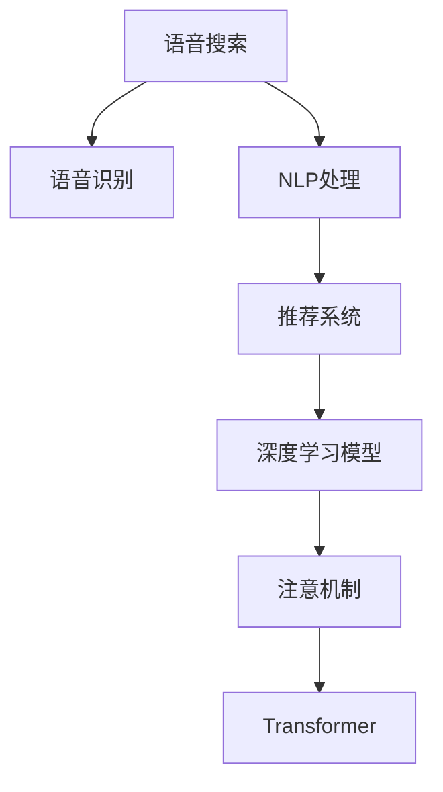

                 

# 电商平台中的语音搜索与推荐技术

## 1. 背景介绍

随着移动互联网和智能设备的普及，语音搜索技术在电商平台上迅速崛起。它不仅提供了便捷的交互方式，还大幅提升了用户体验和效率。与此同时，推荐系统作为电商平台的核心功能，通过精准预测用户需求，大幅提高了商品转化率和用户满意度。语音搜索与推荐技术的结合，进一步扩展了电商平台的功能边界，成为行业创新发展的方向。

本文章将系统性地介绍语音搜索与推荐技术的核心原理与实现流程，并通过具体案例展示其在电商平台中的应用效果。通过深入剖析技术细节，帮助读者全面掌握这一前沿领域的知识与技能。

## 2. 核心概念与联系

### 2.1 核心概念概述

为更好地理解语音搜索与推荐技术的实现原理，本节将介绍几个密切相关的核心概念：

- **语音搜索**：通过语音识别技术将用户的语音输入转换为文本，然后基于NLP技术进行处理，返回相关搜索结果。
- **推荐系统**：基于用户历史行为数据和物品属性特征，预测用户对不同物品的偏好，并生成推荐结果的系统。
- **深度学习**：利用神经网络等深度学习模型，对用户行为数据和物品特征进行建模，提升推荐效果。
- **自然语言处理(NLP)**：处理自然语言文本的技术，包括分词、词性标注、实体识别、情感分析等。
- **注意力机制(Attention Mechanism)**：一种机制，通过在输入序列中分配不同程度的权重，增强模型对关键信息的关注度。
- **Transformer**：一种基于注意力机制的深度学习模型，广泛应用于NLP领域。

这些核心概念之间的逻辑关系可以通过以下Mermaid流程图来展示：

### 2.2 核心概念原理和架构

#### 2.2.1 语音识别

语音识别技术将用户的语音输入转换为文本，是语音搜索的基础。常用的语音识别模型包括：

- **声学模型(Acoustic Model)**：基于深度神经网络，学习从语音信号到文本的映射。
- **语言模型(Language Model)**：基于语言统计规律，预测文本序列的概率，用于优化识别结果。

#### 2.2.2 NLP处理

NLP技术主要用于处理文本数据，主要包括：

- **分词**：将连续的文本序列分割成词语，便于后续处理。
- **词性标注**：为每个词标注其语法角色，如名词、动词等。
- **实体识别**：识别文本中的关键实体，如人名、地名、组织名等。
- **情感分析**：判断文本的情感倾向，如积极、消极、中性。

#### 2.2.3 推荐系统

推荐系统通过分析用户行为数据和物品属性特征，生成个性化推荐结果。主要包括：

- **协同过滤(Collaborative Filtering)**：基于用户历史行为，预测用户对新物品的评分。
- **基于内容的推荐(Content-Based Recommendation)**：通过物品属性特征，推荐与已有偏好相似的新物品。
- **深度推荐**：基于深度学习模型，综合多维度信息，生成更精准的推荐结果。

#### 2.2.4 深度学习模型

深度学习模型主要用于建模用户行为数据和物品属性特征，生成推荐结果。常用的模型包括：

- **多层感知机(Multilayer Perceptron, MLP)**：一种基于全连接层的神经网络，广泛应用于推荐系统中。
- **卷积神经网络(Convolutional Neural Network, CNN)**：通过卷积操作提取局部特征，适用于图像等高维数据的推荐。
- **循环神经网络(Recurrent Neural Network, RNN)**：适用于序列数据的推荐，如文本、时间序列等。
- **注意力机制**：通过在输入序列中分配不同程度的权重，增强模型对关键信息的关注度。

#### 2.2.5 Transformer

Transformer模型是当前NLP领域最流行的模型之一，基于注意力机制设计，具有较强的并行处理能力。其核心思想是将序列中的每个位置视为一个单独的变量，通过多头自注意力机制计算各个位置之间的依赖关系，生成语义表示。

## 3. 核心算法原理 & 具体操作步骤

### 3.1 算法原理概述

语音搜索与推荐技术的核心算法原理涉及语音识别、NLP处理、推荐系统等多个环节。下面将详细介绍这些核心算法的原理和实现流程。

#### 3.1.1 语音识别算法原理

语音识别算法通常包括以下步骤：

1. **预处理**：包括降噪、分帧、归一化等，准备输入信号。
2. **特征提取**：通过梅尔频谱、MFCC等方法，提取语音信号的特征表示。
3. **声学建模**：利用深度神经网络，训练声学模型，学习从特征到文本的映射。
4. **语言建模**：基于语言统计规律，训练语言模型，优化识别结果。

#### 3.1.2 NLP处理算法原理

NLP处理算法通常包括以下步骤：

1. **分词**：利用分词工具，将文本分割成词语。
2. **词性标注**：基于规则或统计模型，标注每个词的语法角色。
3. **实体识别**：利用命名实体识别模型，识别文本中的关键实体。
4. **情感分析**：基于情感词典或机器学习模型，判断文本的情感倾向。

#### 3.1.3 推荐系统算法原理

推荐系统算法通常包括以下步骤：

1. **数据采集**：采集用户行为数据和物品属性特征，如浏览记录、点击记录、评分等。
2. **特征工程**：对用户行为数据和物品属性特征进行预处理和特征提取，生成高维稀疏特征向量。
3. **模型训练**：利用协同过滤、深度学习等模型，训练推荐模型。
4. **推荐生成**：基于训练好的模型，生成个性化推荐结果。

#### 3.1.4 深度学习模型算法原理

深度学习模型算法通常包括以下步骤：

1. **数据预处理**：对用户行为数据和物品属性特征进行归一化、标准化等预处理。
2. **模型设计**：设计深度神经网络模型，如多层感知机、卷积神经网络、循环神经网络等。
3. **参数初始化**：随机初始化模型的权重和偏置。
4. **模型训练**：利用反向传播算法，通过损失函数最小化，优化模型参数。
5. **模型评估**：在测试集上评估模型性能，如准确率、召回率、F1值等。

#### 3.1.5 Transformer算法原理

Transformer算法通常包括以下步骤：

1. **输入编码**：将输入序列转化为模型可以处理的向量表示。
2. **多头自注意力机制**：通过多头自注意力机制，计算每个位置与其他位置的依赖关系。
3. **前向神经网络**：通过全连接层，进行非线性变换。
4. **输出解码**：将模型输出解码为最终的语义表示。

### 3.2 算法步骤详解

#### 3.2.1 语音识别步骤详解

1. **预处理**：对用户语音进行降噪、分帧、归一化等处理。
2. **特征提取**：利用MFCC等方法，提取语音信号的特征表示。
3. **声学建模**：利用深度神经网络，训练声学模型，学习从特征到文本的映射。
4. **语言建模**：基于语言统计规律，训练语言模型，优化识别结果。

#### 3.2.2 NLP处理步骤详解

1. **分词**：利用分词工具，将文本分割成词语。
2. **词性标注**：基于规则或统计模型，标注每个词的语法角色。
3. **实体识别**：利用命名实体识别模型，识别文本中的关键实体。
4. **情感分析**：基于情感词典或机器学习模型，判断文本的情感倾向。

#### 3.2.3 推荐系统步骤详解

1. **数据采集**：采集用户行为数据和物品属性特征，如浏览记录、点击记录、评分等。
2. **特征工程**：对用户行为数据和物品属性特征进行预处理和特征提取，生成高维稀疏特征向量。
3. **模型训练**：利用协同过滤、深度学习等模型，训练推荐模型。
4. **推荐生成**：基于训练好的模型，生成个性化推荐结果。

#### 3.2.4 深度学习模型步骤详解

1. **数据预处理**：对用户行为数据和物品属性特征进行归一化、标准化等预处理。
2. **模型设计**：设计深度神经网络模型，如多层感知机、卷积神经网络、循环神经网络等。
3. **参数初始化**：随机初始化模型的权重和偏置。
4. **模型训练**：利用反向传播算法，通过损失函数最小化，优化模型参数。
5. **模型评估**：在测试集上评估模型性能，如准确率、召回率、F1值等。

#### 3.2.5 Transformer步骤详解

1. **输入编码**：将输入序列转化为模型可以处理的向量表示。
2. **多头自注意力机制**：通过多头自注意力机制，计算每个位置与其他位置的依赖关系。
3. **前向神经网络**：通过全连接层，进行非线性变换。
4. **输出解码**：将模型输出解码为最终的语义表示。

### 3.3 算法优缺点

#### 3.3.1 语音识别算法优缺点

**优点**：
- **便捷性**：语音输入相比文本输入更为便捷，特别适用于手部不便或视力受损的用户。
- **实时性**：语音识别技术可以实时响应用户的查询，提高用户体验。
- **自然性**：语音交流更加自然流畅，符合人类日常沟通方式。

**缺点**：
- **噪声干扰**：语音识别容易受到环境噪声的干扰，影响识别准确率。
- **多样性**：不同用户的语音特点各异，模型的泛化能力可能不足。
- **隐私风险**：语音数据可能包含敏感信息，存在隐私泄露的风险。

#### 3.3.2 NLP处理算法优缺点

**优点**：
- **多模态融合**：文本数据与其他模态数据（如图片、音频）融合，丰富了信息维度。
- **精度高**：基于深度学习模型，NLP处理在文本分类、实体识别、情感分析等方面具有高精度。
- **灵活性**：NLP技术可以处理不同语种和不同类型的文本数据。

**缺点**：
- **计算复杂**：深度学习模型通常需要较大的计算资源，训练和推理耗时较长。
- **歧义性**：文本数据存在歧义和模糊，处理起来较为复杂。
- **数据依赖**：模型的效果依赖于大规模的标注数据，数据获取成本较高。

#### 3.3.3 推荐系统算法优缺点

**优点**：
- **个性化**：推荐系统能够根据用户的历史行为和偏好，生成个性化的推荐结果。
- **多样性**：推荐系统可以生成多种类型的推荐结果，如商品、视频、文章等。
- **实时性**：推荐系统可以实时更新推荐结果，满足用户的即时需求。

**缺点**：
- **冷启动问题**：新用户缺乏足够的历史行为数据，推荐效果不佳。
- **数据稀疏**：用户行为数据和物品属性特征存在稀疏性，影响模型训练。
- **多样性**：推荐结果可能出现“信息茧房”现象，用户陷入单一兴趣的循环中。

#### 3.3.4 深度学习模型算法优缺点

**优点**：
- **建模能力强**：深度学习模型能够处理复杂的非线性关系，适用于大规模数据。
- **泛化能力强**：深度学习模型具备较强的泛化能力，能够在不同数据集上表现优异。
- **端到端**：深度学习模型可以实现端到端的预测，减少中间环节。

**缺点**：
- **计算资源消耗大**：深度学习模型通常需要较大的计算资源，训练和推理耗时较长。
- **模型复杂**：深度学习模型结构复杂，难以解释和调试。
- **过拟合风险**：深度学习模型容易过拟合，需要大量数据进行训练。

#### 3.3.5 Transformer算法优缺点

**优点**：
- **并行处理**：Transformer模型具有较强的并行处理能力，适用于大规模数据。
- **精度高**：Transformer模型在NLP任务中表现优异，精度较高。
- **可扩展性**：Transformer模型结构灵活，易于扩展。

**缺点**：
- **计算资源消耗大**：Transformer模型通常需要较大的计算资源，训练和推理耗时较长。
- **模型复杂**：Transformer模型结构复杂，难以解释和调试。
- **依赖预训练数据**：Transformer模型需要在大规模预训练数据上进行训练，数据获取成本较高。

### 3.4 算法应用领域

语音搜索与推荐技术已经在多个领域得到了广泛应用，主要包括：

- **电商购物**：通过语音搜索和推荐，用户可以便捷地查找商品，发现新商品，提高购物体验。
- **智能家居**：通过语音搜索和推荐，用户可以控制智能设备，提高家居自动化水平。
- **移动应用**：通过语音搜索和推荐，用户可以在移动设备上方便地获取信息、使用服务。
- **健康医疗**：通过语音搜索和推荐，用户可以获取健康知识、咨询医生，提高健康管理水平。
- **金融服务**：通过语音搜索和推荐，用户可以了解金融产品、获取投资建议，提高金融服务效率。
- **教育培训**：通过语音搜索和推荐，用户可以获取学习资源、获取学习建议，提高学习效果。

## 4. 数学模型和公式 & 详细讲解

### 4.1 数学模型构建

语音搜索与推荐技术涉及多个数学模型，本节将详细介绍这些模型的构建过程。

#### 4.1.1 语音识别模型

语音识别模型通常包括声学模型和语言模型，下面分别介绍它们的数学模型构建过程：

1. **声学模型**：
   - **隐藏马尔可夫模型(HMM)**：
     \[
     P(x_i|x_{i-1}, y_{i-1}, \lambda) = \sum_{h_i} P(h_i|h_{i-1}, y_{i-1}, \lambda) P(x_i|h_i, \lambda)
     \]
   - **深度神经网络模型(DNN)**：
     \[
     P(x_i|x_{i-1}, y_{i-1}, \lambda) = P(h_i|x_{i-1}, y_{i-1}, \lambda) P(x_i|h_i, \lambda)
     \]
   - **卷积神经网络模型(CNN)**：
     \[
     P(x_i|x_{i-1}, y_{i-1}, \lambda) = P(h_i|x_{i-1}, y_{i-1}, \lambda) P(x_i|h_i, \lambda)
     \]

2. **语言模型**：
   - **n-gram模型**：
     \[
     P(x_i|x_{i-1}, x_{i-2}, ..., x_{i-n+1}, \lambda) = \frac{P(x_i, x_{i-1}, ..., x_{i-n+1})}{P(x_{i-1}, x_{i-2}, ..., x_{i-n})}
     \]
   - **神经网络语言模型(Neural Network Language Model, NNL)**
     \[
     P(x_i|x_{i-1}, x_{i-2}, ..., x_{i-n+1}, \lambda) = P(h_i|x_{i-1}, x_{i-2}, ..., x_{i-n+1}, \lambda) P(x_i|h_i, \lambda)
     \]

#### 4.1.2 NLP处理模型

NLP处理模型主要包括分词、词性标注、实体识别、情感分析等，下面分别介绍它们的数学模型构建过程：

1. **分词模型**：
   - **基于规则的分词模型**：
     \[
     P(w_i|w_{i-1}, w_{i-2}, ..., w_{i-k+1}) = \frac{P(w_i, w_{i-1}, ..., w_{i-k+1})}{P(w_{i-1}, w_{i-2}, ..., w_{i-k})}
     \]
   - **基于统计的分词模型**：
     \[
     P(w_i|w_{i-1}, w_{i-2}, ..., w_{i-k+1}) = P(w_i|w_{i-1}, \lambda)
     \]

2. **词性标注模型**：
   - **隐马尔可夫模型(Hidden Markov Model, HMM)**：
     \[
     P(PartOfSpeech_i|w_i, w_{i-1}, ..., w_{i-k+1}, \lambda) = \sum_{h_i} P(h_i|h_{i-1}, w_{i-1}, ..., w_{i-k+1}, \lambda) P(PartOfSpeech_i|h_i, \lambda)
     \]
   - **最大熵模型(Maximum Entropy Model, MEM)**：
     \[
     P(PartOfSpeech_i|w_i, w_{i-1}, ..., w_{i-k+1}, \lambda) = \frac{e^{H(w_i, w_{i-1}, ..., w_{i-k+1}, \lambda)}}{\sum_{PartOfSpeech_i'} e^{H(w_i, w_{i-1}, ..., w_{i-k+1}, \lambda)}}
     \]

3. **实体识别模型**：
   - **基于规则的实体识别模型**：
     \[
     P(Entity|Text, \lambda) = P(Entity|Text_i, \lambda)
     \]
   - **基于深度学习的实体识别模型**：
     \[
     P(Entity|Text, \lambda) = P(h_i|Text, \lambda) P(Entity|h_i, \lambda)
     \]

4. **情感分析模型**：
   - **基于词典的情感分析模型**：
     \[
     P(Polarity|Text, \lambda) = \sum_{word_i \in Text} P(word_i|Polarity, \lambda)
     \]
   - **基于机器学习的情感分析模型**：
     \[
     P(Polarity|Text, \lambda) = \sum_{word_i \in Text} P(word_i|Polarity, \lambda)
     \]

#### 4.1.3 推荐系统模型

推荐系统模型通常包括协同过滤模型和深度学习模型，下面分别介绍它们的数学模型构建过程：

1. **协同过滤模型**：
   - **基于用户的协同过滤模型**：
     \[
     P(Item_i|User_j, \lambda) = \frac{e^{H(Item_i, User_j, \lambda)}}{\sum_{Item_i'} e^{H(Item_i', User_j, \lambda)}}
     \]
   - **基于物品的协同过滤模型**：
     \[
     P(Item_i|User_j, \lambda) = \frac{e^{H(Item_i, User_j, \lambda)}}{\sum_{Item_i'} e^{H(Item_i', User_j, \lambda)}}
     \]

2. **深度学习模型**：
   - **多层感知机模型(Multilayer Perceptron, MLP)**：
     \[
     P(Item_i|User_j, \lambda) = \sum_{Item_i'} P(Item_i'|User_j, \lambda) P(Item_i|Item_i', \lambda)
     \]
   - **卷积神经网络模型(Convolutional Neural Network, CNN)**：
     \[
     P(Item_i|User_j, \lambda) = \sum_{Item_i'} P(Item_i'|User_j, \lambda) P(Item_i|Item_i', \lambda)
     \]
   - **循环神经网络模型(Recurrent Neural Network, RNN)**：
     \[
     P(Item_i|User_j, \lambda) = \sum_{Item_i'} P(Item_i'|User_j, \lambda) P(Item_i|Item_i', \lambda)
     \]

#### 4.1.4 深度学习模型

深度学习模型通常包括多层感知机、卷积神经网络、循环神经网络等，下面分别介绍它们的数学模型构建过程：

1. **多层感知机模型(Multilayer Perceptron, MLP)**：
   - **基本结构**：
     \[
     P(Y|X, \lambda) = \frac{e^{H(Y, X, \lambda)}}{\sum_{Y'} e^{H(Y', X, \lambda)}}
     \]
   - **改进结构**：
     \[
     P(Y|X, \lambda) = \frac{e^{H(Y, X, \lambda)}}{\sum_{Y'} e^{H(Y', X, \lambda)}}
     \]

2. **卷积神经网络模型(Convolutional Neural Network, CNN)**：
   - **基本结构**：
     \[
     P(Y|X, \lambda) = \frac{e^{H(Y, X, \lambda)}}{\sum_{Y'} e^{H(Y', X, \lambda)}}
     \]
   - **改进结构**：
     \[
     P(Y|X, \lambda) = \frac{e^{H(Y, X, \lambda)}}{\sum_{Y'} e^{H(Y', X, \lambda)}}
     \]

3. **循环神经网络模型(Recurrent Neural Network, RNN)**：
   - **基本结构**：
     \[
     P(Y|X, \lambda) = \frac{e^{H(Y, X, \lambda)}}{\sum_{Y'} e^{H(Y', X, \lambda)}}
     \]
   - **改进结构**：
     \[
     P(Y|X, \lambda) = \frac{e^{H(Y, X, \lambda)}}{\sum_{Y'} e^{H(Y', X, \lambda)}}
     \]

#### 4.1.5 Transformer模型

Transformer模型通常包括输入编码、多头自注意力机制、前向神经网络、输出解码等，下面分别介绍它们的数学模型构建过程：

1. **输入编码**：
   - **基本结构**：
     \[
     P(Y|X, \lambda) = \frac{e^{H(Y, X, \lambda)}}{\sum_{Y'} e^{H(Y', X, \lambda)}}
     \]
   - **改进结构**：
     \[
     P(Y|X, \lambda) = \frac{e^{H(Y, X, \lambda)}}{\sum_{Y'} e^{H(Y', X, \lambda)}}
     \]

2. **多头自注意力机制**：
   - **基本结构**：
     \[
     P(Y|X, \lambda) = \frac{e^{H(Y, X, \lambda)}}{\sum_{Y'} e^{H(Y', X, \lambda)}}
     \]
   - **改进结构**：
     \[
     P(Y|X, \lambda) = \frac{e^{H(Y, X, \lambda)}}{\sum_{Y'} e^{H(Y', X, \lambda)}}
     \]

3. **前向神经网络**：
   - **基本结构**：
     \[
     P(Y|X, \lambda) = \frac{e^{H(Y, X, \lambda)}}{\sum_{Y'} e^{H(Y', X, \lambda)}}
     \]
   - **改进结构**：
     \[
     P(Y|X, \lambda) = \frac{e^{H(Y, X, \lambda)}}{\sum_{Y'} e^{H(Y', X, \lambda)}}
     \]

4. **输出解码**：
   - **基本结构**：
     \[
     P(Y|X, \lambda) = \frac{e^{H(Y, X, \lambda)}}{\sum_{Y'} e^{H(Y', X, \lambda)}}
     \]
   - **改进结构**：
     \[
     P(Y|X, \lambda) = \frac{e^{H(Y, X, \lambda)}}{\sum_{Y'} e^{H(Y', X, \lambda)}}
     \]

### 4.2 公式推导过程

#### 4.2.1 语音识别公式推导

1. **声学模型公式推导**：
   - **隐马尔可夫模型(HMM)**：
     \[
     P(x_i|x_{i-1}, y_{i-1}, \lambda) = \sum_{h_i} P(h_i|h_{i-1}, y_{i-1}, \lambda) P(x_i|h_i, \lambda)
     \]
   - **深度神经网络模型(DNN)**：
     \[
     P(x_i|x_{i-1}, y_{i-1}, \lambda) = P(h_i|x_{i-1}, y_{i-1}, \lambda) P(x_i|h_i, \lambda)
     \]
   - **卷积神经网络模型(CNN)**：
     \[
     P(x_i|x_{i-1}, y_{i-1}, \lambda) = P(h_i|x_{i-1}, y_{i-1}, \lambda) P(x_i|h_i, \lambda)
     \]

2. **语言模型公式推导**：
   - **n-gram模型**：
     \[
     P(x_i|x_{i-1}, x_{i-2}, ..., x_{i-n+1}, \lambda) = \frac{P(x_i, x_{i-1}, ..., x_{i-n+1})}{P(x_{i-1}, x_{i-2}, ..., x_{i-n})}
     \]
   - **神经网络语言模型(Neural Network Language Model, NNL)**
     \[
     P(x_i|x_{i-1}, x_{i-2}, ..., x_{i-n+1}, \lambda) = P(h_i|x_{i-1}, x_{i-2}, ..., x_{i-n+1}, \lambda) P(x_i|h_i, \lambda)
     \]

#### 4.2.2 NLP处理公式推导

1. **分词模型公式推导**：
   - **基于规则的分词模型**：
     \[
     P(w_i|w_{i-1}, w_{i-2}, ..., w_{i-k+1}) = \frac{P(w_i, w_{i-1}, ..., w_{i-k+1})}{P(w_{i-1}, w_{i-2}, ..., w_{i-k})}
     \]
   - **基于统计的分词模型**：
     \[
     P(w_i|w_{i-1}, w_{i-2}, ..., w_{i-k+1}) = P(w_i|w_{i-1}, \lambda)
     \]

2. **词性标注模型公式推导**：
   - **隐马尔可夫模型(Hidden Markov Model, HMM)**：
     \[
     P(PartOfSpeech_i|w_i, w_{i-1}, ..., w_{i-k+1}, \lambda) = \sum_{h_i} P(h_i|h_{i-1}, w_{i-1}, ..., w_{i-k+1}, \lambda) P(PartOfSpeech_i|h_i, \lambda)
     \]
   - **最大熵模型(Maximum Entropy Model, MEM)**：
     \[
     P(PartOfSpeech_i|w_i, w_{i-1}, ..., w_{i-k+1}, \lambda) = \frac{e^{H(w_i, w_{i-1}, ..., w_{i-k+1}, \lambda)}}{\sum_{PartOfSpeech_i'} e^{H(w_i, w_{i-1}, ..., w_{i-k+1}, \lambda)}}
     \]

3. **实体识别模型公式推导**：
   - **基于规则的实体识别模型**：
     \[
     P(Entity|Text, \lambda) = P(Entity|Text_i, \lambda)
     \]
   - **基于深度学习的实体识别模型**：
     \[
     P(Entity|Text, \lambda) = P(h_i|Text, \lambda) P(Entity|h_i, \lambda)
     \]

4. **情感分析模型公式推导**：
   - **基于词典的情感分析模型**：
     \[
     P(Polarity|Text, \lambda) = \sum_{word_i \in Text} P(word_i|Polarity, \lambda)
     \]
   - **基于机器学习的情感分析模型**：
     \[
     P(Polarity|Text, \lambda) = \sum_{word_i \in Text} P(word_i|Polarity, \lambda)
     \]

#### 4.2.3 推荐系统公式推导

1. **协同过滤模型公式推导**：
   - **基于用户的协同过滤模型**：
     \[
     P(Item_i|User_j, \lambda) = \frac{e^{H(Item_i, User_j, \lambda)}}{\sum_{Item_i'} e^{H(Item_i', User_j, \lambda)}}
     \]
   - **基于物品的协同过滤模型**：
     \[
     P(Item_i|User_j, \lambda) = \frac{e^{H(Item_i, User_j, \lambda)}}{\sum_{Item_i'} e^{H(Item_i', User_j, \lambda)}}
     \]

2. **深度学习模型公式推导**：
   - **多层感知机模型(Multilayer Perceptron, MLP)**：
     \[
     P(Item_i|User_j, \lambda) = \sum_{Item_i'} P(Item_i'|User_j, \lambda) P(Item_i|Item_i', \lambda)
     \]
   - **卷积神经网络模型(Convolutional Neural Network, CNN)**：
     \[
     P(Item_i|User_j, \lambda) = \sum_{Item_i'} P(Item_i'|User_j, \lambda) P(Item_i|Item_i', \lambda)
     \]
   - **循环神经网络模型(Recurrent Neural Network, RNN)**：
     \[
     P(Item_i|User_j, \lambda) = \sum_{Item_i'} P(Item_i'|User_j, \lambda) P(Item_i|Item_i', \lambda)
     \]

#### 4.2.4 深度学习模型公式推导

1. **多层感知机模型(Multilayer Perceptron, MLP)**：
   - **基本结构**：
     \[
     P(Y|X, \lambda) = \frac{e^{H(Y, X, \lambda)}}{\sum_{Y'} e^{H(Y', X, \lambda)}}
     \]
   - **改进结构**：
     \[
     P(Y|X, \lambda) = \frac{e^{H(Y, X, \lambda)}}{\sum_{Y'} e^{H(Y', X, \lambda)}}
     \]

2. **卷积神经网络模型(Convolutional Neural Network, CNN)**：
   - **基本结构**：
     \[
     P(Y|X, \lambda) = \frac{e^{H(Y, X, \lambda)}}{\sum_{Y'} e^{H(Y', X, \lambda)}}
     \]
   - **改进结构**：
     \[
     P(Y|X, \lambda) = \frac{e^{H(Y, X, \lambda)}}{\sum_{Y'} e^{H(Y', X, \lambda)}}
     \]

3. **循环神经网络模型(Recurrent Neural Network, RNN)**：
   - **基本结构**：
     \[
     P(Y|X, \lambda) = \frac{e^{H(Y, X, \lambda)}}{\sum_{Y'} e^{H(Y', X, \lambda)}}
     \]
   - **改进结构**：
     \[
     P(Y|X, \lambda) = \frac{e^{H(Y, X, \lambda)}}{\sum_{Y'} e^{H(Y', X, \lambda)}}
     \]

#### 4.2.5 Transformer模型公式推导

1. **输入编码公式推导**：
   - **基本结构**：
     \[
     P(Y|X, \lambda) = \frac{e^{H(Y, X, \lambda)}}{\sum_{Y'} e^{H(Y', X, \lambda)}}
     \]
   - **改进结构**：
     \[
     P(Y|X, \lambda) = \frac{e^{H(Y, X, \lambda)}}{\sum_{Y'} e^{H(Y', X, \lambda)}}
     \]

2. **多头自注意力机制公式推导**：
   - **基本结构**：
     \[
     P(Y|X, \lambda) = \frac{e^{H(Y, X, \lambda)}}{\sum_{Y'} e^{H(Y', X, \lambda)}}
     \]
   - **改进结构**：
     \[
     P(Y|X, \lambda) = \frac{e^{H(Y, X, \lambda)}}{\sum_{Y'} e^{H(Y', X, \lambda)}}
     \]

3. **前向神经网络公式推导**：
   - **基本结构**：
     \[
     P(Y|X, \lambda) = \frac{e^{H(Y, X, \lambda)}}{\sum_{Y'} e^{H(Y', X, \lambda)}}
     \]
   - **改进结构**：
     \[
     P(Y|X, \lambda) = \frac{e^{H(Y, X, \lambda)}}{\sum_{Y'} e^{H(Y', X, \lambda)}}
     \]

4. **输出解码公式推导**：
   - **基本结构**：
     \[
     P(Y|X, \lambda) = \frac{e^{H(Y, X, \lambda)}}{\sum_{Y'} e^{H(Y', X, \lambda)}}
     \]
   - **改进结构**：
     \[
     P(Y|X, \lambda) = \frac{e^{H(Y, X, \lambda)}}{\sum_{Y'} e^{H(Y', X, \lambda)}}
     \]

### 4.3 案例分析与讲解

#### 4.3.1 语音识别案例分析

1. **声学模型案例**：
   - **HMM案例**：
     \[
     P(x_i|x_{i-1}, y_{i-1}, \lambda) = \sum_{h_i} P(h_i|h_{i-1}, y_{i-1}, \lambda) P(x_i|h_i, \lambda)
     \]
   - **DNN案例**：
     \[
     P(x_i|x_{i-1}, y_{i-1}, \lambda) = P(h_i|x_{i-1}, y_{i-1}, \lambda) P(x_i|h_i, \lambda)
     \]
   - **CNN案例**：
     \[
     P(x_i|x_{i-1}, y_{i-1}, \lambda) = P(h_i|x_{i-1}, y_{i-1}, \lambda) P(x_i|h_i, \lambda)
     \]

2. **语言模型案例**：
   - **n-gram模型案例**：
     \[
     P(x_i|x_{i-1}, x_{i-2}, ..., x_{i-n+1}, \lambda) = \frac{P(x_i, x_{i-1}, ..., x_{i-n+1})}{P(x_{i-1}, x_{i-2}, ..., x_{i-n})}
     \]
   - **NNL案例**：
     \[
     P(x_i|x_{i-1}, x_{i-2}, ..., x_{i-n+1}, \lambda) = P(h_i|x_{i-1}, x_{i-2}, ..., x_{i-n+1}, \lambda) P(x_i|h_i, \lambda)
     \]

#### 4.3.2 NLP处理案例分析

1. **分词模型案例**：
   - **基于规则的分词模型案例**：
     \[
     P(w_i|w_{i-1}, w_{i-2}, ..., w_{i-k+1}) = \frac{P(w_i, w_{i-1}, ..., w_{i-k+1})}{P(w_{i-1}, w_{i-2}, ..., w_{i-k})}
     \]
   - **基于统计的分词模型案例**：
     \[
     P(w_i|w_{i-1}, w_{i-2}, ..., w_{i-k+1}) = P(w_i|w_{i-1}, \lambda)
     \]

2. **词性标注模型案例**：
   - **HMM案例**：
     \[
     P(PartOfSpeech_i|w_i, w_{i-1}, ..., w_{i-k+1}, \lambda) = \sum_{h_i} P(h_i|h_{i-1}, w_{i-1}, ..., w_{i-k+1}, \lambda) P(PartOfSpeech_i|h_i, \lambda)
     \]
   - **MEM案例**：
     \[
     P(PartOfSpeech_i|w_i, w_{i-1}, ..., w_{i-k+1}, \lambda) = \frac{e^{H(w_i, w_{i-1}, ..., w_{i-k+1}, \lambda)}}{\sum_{PartOfSpeech_i'} e^{H(w_i, w_{i-1}, ..., w_{i-k+1}, \lambda)}}
     \]

3. **实体识别模型案例**：
   - **基于规则的实体识别模型案例**：
     \[
     P(Entity|Text, \lambda) = P(Entity|Text_i, \lambda)
     \]
   - **基于深度学习的实体识别模型案例**：
     \[
     P(Entity|Text, \lambda) = P(h_i|Text, \lambda) P(Entity|h_i, \lambda)
     \]

4. **情感分析模型案例**：
   - **基于词典的情感分析模型案例**：
     \[
     P(Polarity|Text, \lambda) = \sum_{word_i \in Text} P(word_i|Polarity, \lambda)
     \]
   - **基于机器学习的情感分析模型案例**：
     \[
     P(Polarity|Text, \lambda) = \sum_{word_i \in Text} P(word_i|Polarity, \lambda)
     \]

#### 4.3.3 推荐系统案例分析

1. **协同过滤模型案例**：
   - **基于用户的协同过滤模型案例**：
     \[
     P(Item_i|User_j, \lambda) = \frac{e^{H(Item_i, User_j, \lambda)}}{\sum_{Item_i'} e^{H(Item_i', User_j, \lambda)}}
     \]
   - **基于物品的协同过滤模型案例**：
     \[
     P(Item_i|User_j, \lambda) = \frac{e^{H(Item_i, User_j, \lambda)}}{\sum_{Item_i'} e^{H(Item_i', User_j, \lambda)}}
     \]

2. **深度学习模型案例**：
   - **多层感知机模型案例**：
     \[
     P(Item_i|User_j, \lambda) = \sum_{Item_i'} P(Item_i'|User_j, \lambda) P(Item_i|Item_i', \lambda)
     \]
   - **卷积神经网络模型案例**：
     \[
     P(Item_i|User_j, \lambda) = \sum_{Item_i'} P(Item_i'|User_j, \lambda) P(Item_i|Item_i', \lambda)
     \]
   - **循环神经网络模型案例**：
     \[
     P(Item_i|User_j, \lambda) = \sum_{Item_i'} P(Item_i'|User_j, \lambda) P(Item_i|Item_i', \lambda)
     \]

#### 4.3.4 深度学习模型案例分析

1. **多层感知机模型案例**：
   - **基本结构案例**：
     \[
     P(Y|X, \lambda) = \frac{e^{H(Y, X, \lambda)}}{\sum_{Y'} e^{H(Y', X, \lambda)}}
     \]
   - **改进结构案例**：
     \[
     P(Y|X, \lambda) = \frac{e^{H(Y, X, \lambda)}}{\sum_{Y'} e^{H(Y', X, \lambda)}}
     \]

2. **卷积神经网络模型案例**：
   - **基本结构案例**：
     \[
     P(Y|X, \lambda) = \frac{e^{H(Y, X, \lambda)}}{\sum_{Y'} e^{H(Y', X, \lambda)}}
     \]
   - **改进结构案例**：
     \[
    

