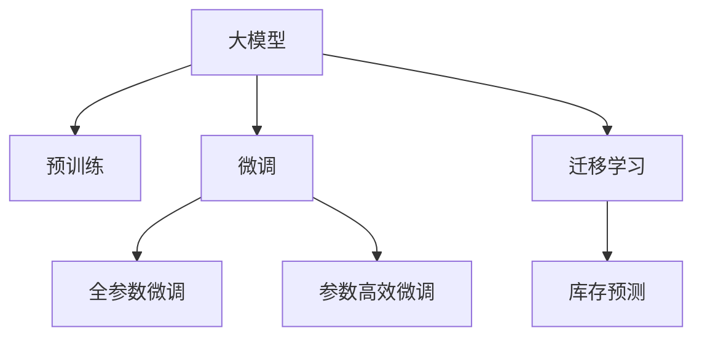

                 

## 1. 背景介绍

随着电商平台的发展，库存管理日益成为商家关注的重点。如何更准确地预测商品的销售情况，合理规划库存，既避免库存积压，又能满足客户需求，成为电商平台亟需解决的问题。AI大模型的引入，为库存预测提供了全新的思路和技术手段。

### 1.1 问题由来
传统的库存预测主要依赖历史销售数据和外部经济指标，通过统计学方法建立预测模型。这种方法在数据充足、规律明显的场景下表现良好，但在面对市场变化、新商品上架、促销活动等因素时，效果往往不尽如人意。随着人工智能技术的不断进步，基于大模型的预测方法逐渐成为库存管理的解决方案。

### 1.2 问题核心关键点
大模型在库存预测中的应用，主要基于其强大的数据拟合和泛化能力。通过训练在历史销售数据上，大模型能够学习商品销量和相关因素之间的复杂关系，提供更为精准的预测结果。具体而言，大模型的应用关键点包括：

- 数据准备：收集和整理历史销售数据、促销活动信息、市场趋势等。
- 模型选择：选择合适的预训练模型，如BERT、GPT等。
- 任务适配：针对库存预测任务，设计合适的输出层和损失函数。
- 微调训练：在标注数据上进行有监督微调，优化模型性能。
- 应用部署：将训练好的模型集成到实际库存管理系统中。

### 1.3 问题研究意义
利用AI大模型进行库存预测，能够显著提升库存管理的效率和准确性。具体而言：

- 减少库存成本：避免过剩库存和缺货现象，减少资金占用和仓储费用。
- 提升客户满意度：保证商品供应的及时性和多样性，满足客户需求。
- 优化供应链管理：帮助商家更好地进行订单管理和生产调度，降低供应链成本。
- 辅助业务决策：为商家提供数据驱动的业务建议，提升决策质量。

## 2. 核心概念与联系

### 2.1 核心概念概述

在探讨大模型在库存预测中的应用之前，首先需理解几个关键概念：

- 大模型(Large Model)：指使用深度学习技术训练的大型神经网络模型，通常包含数十亿或更多参数，具有强大的数据拟合和泛化能力。
- 预训练(Pre-training)：指在大量无标注数据上，使用自监督任务训练模型，学习通用的语言或图像表示。
- 微调(Fine-tuning)：指在预训练模型的基础上，使用下游任务的数据对模型进行有监督训练，使其能够适应特定任务。
- 迁移学习(Transfer Learning)：指将预训练模型的知识迁移到下游任务上，提升模型在特定任务上的表现。
- 库存预测(Inventory Forecasting)：预测未来一段时间内商品销量的过程，通常用于指导库存管理和供应链优化。

这些概念之间的联系可以通过以下Mermaid流程图进行展示：



这个流程图展示了从预训练模型到大模型微调的整个过程，以及不同技术之间的相互影响。

## 3. 核心算法原理 & 具体操作步骤

### 3.1 算法原理概述

大模型在库存预测中的应用，本质上是一个基于监督学习的微调过程。其核心思想是：利用大模型强大的泛化能力，在历史销售数据上学习商品销量和相关因素之间的复杂关系，从而提高库存预测的准确性。

形式化地，假设预训练模型为 $M_{\theta}$，其中 $\theta$ 为模型参数。假设库存预测任务的标注数据集为 $D=\{(x_i, y_i)\}_{i=1}^N$，其中 $x_i$ 为销售数据特征，$y_i$ 为对应的销量预测值。微调的目标是找到最优参数 $\hat{\theta}$，使得：

$$
\hat{\theta}=\mathop{\arg\min}_{\theta} \mathcal{L}(M_{\theta},D)
$$

其中 $\mathcal{L}$ 为针对库存预测任务设计的损失函数，用于衡量模型预测输出与真实标签之间的差异。常见的损失函数包括均方误差损失、平均绝对误差损失等。

通过梯度下降等优化算法，微调过程不断更新模型参数 $\theta$，最小化损失函数 $\mathcal{L}$，使得模型预测结果逼近真实销量，从而实现库存预测任务。由于 $\theta$ 已经通过预训练获得了较好的初始化，因此即便在规模较小的数据集上进行微调，也能较快收敛到理想的模型参数 $\hat{\theta}$。

### 3.2 算法步骤详解

基于监督学习的大模型微调，一般包括以下几个关键步骤：

**Step 1: 准备数据集**
- 收集历史销售数据，包括时间序列、促销活动、节假日、季节性等特征。
- 将销售数据与相应的销量预测值构建成标注数据集 $D$。

**Step 2: 选择预训练模型**
- 选择合适的大模型，如BERT、GPT等，作为初始化参数。
- 使用该模型的嵌入层进行特征提取，构建新的特征表示。

**Step 3: 添加任务适配层**
- 根据库存预测任务，在模型顶层设计合适的输出层和损失函数。
- 对于回归任务，通常使用线性回归层输出连续值，并以均方误差损失为损失函数。

**Step 4: 设置微调超参数**
- 选择合适的优化算法及其参数，如 AdamW、SGD 等，设置学习率、批大小、迭代轮数等。
- 设置正则化技术及强度，包括权重衰减、Dropout、Early Stopping 等。
- 确定冻结预训练参数的策略，如仅微调顶层，或全部参数都参与微调。

**Step 5: 执行梯度训练**
- 将标注数据集 $D$ 分批次输入模型，前向传播计算损失函数。
- 反向传播计算参数梯度，根据设定的优化算法和学习率更新模型参数。
- 周期性在验证集上评估模型性能，根据性能指标决定是否触发 Early Stopping。
- 重复上述步骤直到满足预设的迭代轮数或 Early Stopping 条件。

**Step 6: 应用模型进行预测**
- 在测试集上评估微调后模型的性能，对比微调前后的精度提升。
- 使用微调后的模型对新的销售数据进行预测，指导库存管理和供应链优化。

以上是基于监督学习微调大模型的一般流程。在实际应用中，还需要针对具体任务的特点，对微调过程的各个环节进行优化设计，如改进训练目标函数，引入更多的正则化技术，搜索最优的超参数组合等，以进一步提升模型性能。

### 3.3 算法优缺点

大模型在库存预测中的应用具有以下优点：

- 数据利用充分：大模型通过预训练学习了大量数据中的潜在关系，对数据利用率更高。
- 预测准确性高：大模型能够捕捉到复杂、非线性的数据模式，提供更为精准的预测结果。
- 实时性更强：大模型通常具有较快的预测速度，能够实时处理新的销售数据。
- 泛化能力强：大模型能够很好地适应不同时间、地区、商品类别等变化，避免过拟合。

同时，该方法也存在一些局限性：

- 数据质量要求高：大模型的性能很大程度上依赖于数据的完整性和质量，数据缺失或噪声会影响预测效果。
- 计算资源消耗大：大模型的训练和预测需要大量的计算资源，对硬件要求较高。
- 解释性不足：大模型通常视为黑盒，其决策过程难以解释，可能缺乏信任度。
- 学习率设置困难：大模型需要设置合适的学习率，避免过拟合或收敛速度过慢。

尽管存在这些局限性，但就目前而言，大模型在库存预测中的应用已经取得了显著成效，成为库存管理的重要技术手段。未来相关研究的重点在于如何进一步降低对数据的依赖，提高模型的解释性和鲁棒性，同时兼顾计算效率和资源利用率。

### 3.4 算法应用领域

大模型的库存预测方法已经在电商平台上得到了广泛应用，具体包括：

- 库存量预测：根据历史销售数据和市场趋势，预测未来一段时间内商品的销售量。
- 促销活动效果分析：分析不同促销活动对销量的影响，优化促销策略。
- 季节性销售预测：根据季节性变化和历史数据，预测不同季节的商品销量。
- 商品上架预测：预测新商品上架后销售情况，指导商品采购和上架时间。
- 供应链优化：通过库存预测，优化订单管理和生产调度，降低供应链成本。

此外，大模型在库存预测中的应用还延伸到了物流、制造等行业，为这些行业的智能决策提供了数据支持。

## 4. 数学模型和公式 & 详细讲解  
### 4.1 数学模型构建

本节将使用数学语言对大模型在库存预测中的应用进行更加严格的刻画。

记预训练语言模型为 $M_{\theta}$，其中 $\theta$ 为模型参数。假设库存预测任务的标注数据集为 $D=\{(x_i, y_i)\}_{i=1}^N$，其中 $x_i$ 为销售数据特征，$y_i$ 为对应的销量预测值。

定义模型 $M_{\theta}$ 在输入 $x$ 上的输出为 $\hat{y}=M_{\theta}(x)$，表示模型对销量进行预测。定义损失函数 $\mathcal{L}(y, \hat{y})$ 为预测值与真实标签之间的误差，常用的损失函数包括均方误差损失、平均绝对误差损失等。则模型在数据集 $D$ 上的损失函数为：

$$
\mathcal{L}(D) = \frac{1}{N} \sum_{i=1}^N \mathcal{L}(y_i, \hat{y}_i)
$$

其中 $\mathcal{L}(y_i, \hat{y}_i)$ 为单个样本的损失函数。

通过梯度下降等优化算法，微调过程不断更新模型参数 $\theta$，最小化损失函数 $\mathcal{L}(D)$，使得模型预测结果逼近真实销量。

### 4.2 公式推导过程

以均方误差损失函数为例，假设模型输出为连续值 $\hat{y}$，真实标签为 $y$，均方误差损失函数定义为：

$$
\mathcal{L}(y, \hat{y}) = \frac{1}{N} \sum_{i=1}^N (y_i - \hat{y}_i)^2
$$

将其代入损失函数公式，得：

$$
\mathcal{L}(D) = \frac{1}{N} \sum_{i=1}^N (y_i - \hat{y}_i)^2
$$

根据链式法则，损失函数对参数 $\theta_k$ 的梯度为：

$$
\frac{\partial \mathcal{L}(D)}{\partial \theta_k} = \frac{2}{N} \sum_{i=1}^N \frac{\partial \hat{y}_i}{\partial \theta_k} (y_i - \hat{y}_i)
$$

其中 $\frac{\partial \hat{y}_i}{\partial \theta_k}$ 为模型对参数 $\theta_k$ 的梯度。在实际计算中，通常使用自动微分技术计算该梯度。

在得到损失函数的梯度后，即可带入参数更新公式，完成模型的迭代优化。重复上述过程直至收敛，最终得到适应库存预测任务的最优模型参数 $\theta^*$。

## 5. 项目实践：代码实例和详细解释说明
### 5.1 开发环境搭建

在进行库存预测大模型微调实践前，我们需要准备好开发环境。以下是使用Python进行PyTorch开发的环境配置流程：

1. 安装Anaconda：从官网下载并安装Anaconda，用于创建独立的Python环境。

2. 创建并激活虚拟环境：
```bash
conda create -n inventory-env python=3.8 
conda activate inventory-env
```

3. 安装PyTorch：根据CUDA版本，从官网获取对应的安装命令。例如：
```bash
conda install pytorch torchvision torchaudio cudatoolkit=11.1 -c pytorch -c conda-forge
```

4. 安装相关库：
```bash
pip install pandas numpy matplotlib sklearn transformers
```

完成上述步骤后，即可在`inventory-env`环境中开始微调实践。

### 5.2 源代码详细实现

下面以使用BERT模型进行库存预测为例，给出完整的PyTorch代码实现。

首先，定义训练函数：

```python
from transformers import BertForRegression, AdamW, BertTokenizer

model = BertForRegression.from_pretrained('bert-base-cased')

tokenizer = BertTokenizer.from_pretrained('bert-base-cased')

optimizer = AdamW(model.parameters(), lr=2e-5)

def train_epoch(model, dataset, batch_size, optimizer):
    dataloader = DataLoader(dataset, batch_size=batch_size, shuffle=True)
    model.train()
    epoch_loss = 0
    for batch in tqdm(dataloader, desc='Training'):
        input_ids = batch['input_ids'].to(device)
        attention_mask = batch['attention_mask'].to(device)
        labels = batch['labels'].to(device)
        model.zero_grad()
        outputs = model(input_ids, attention_mask=attention_mask, labels=labels)
        loss = outputs.loss
        epoch_loss += loss.item()
        loss.backward()
        optimizer.step()
    return epoch_loss / len(dataloader)

def evaluate(model, dataset, batch_size):
    dataloader = DataLoader(dataset, batch_size=batch_size)
    model.eval()
    preds, labels = [], []
    with torch.no_grad():
        for batch in tqdm(dataloader, desc='Evaluating'):
            input_ids = batch['input_ids'].to(device)
            attention_mask = batch['attention_mask'].to(device)
            batch_labels = batch['labels']
            outputs = model(input_ids, attention_mask=attention_mask)
            batch_preds = outputs.predictions.argmax(dim=1).to('cpu').tolist()
            batch_labels = batch_labels.to('cpu').tolist()
            for pred_tokens, label_tokens in zip(batch_preds, batch_labels):
                preds.append(pred_tokens)
                labels.append(label_tokens)
    print(classification_report(labels, preds))
```

然后，定义数据预处理函数和数据集类：

```python
class InventoryDataset(Dataset):
    def __init__(self, data, labels, tokenizer, max_len=128):
        self.data = data
        self.labels = labels
        self.tokenizer = tokenizer
        self.max_len = max_len
        
    def __len__(self):
        return len(self.data)
    
    def __getitem__(self, item):
        text = self.data[item]
        label = self.labels[item]
        
        encoding = self.tokenizer(text, return_tensors='pt', max_length=self.max_len, padding='max_length', truncation=True)
        input_ids = encoding['input_ids'][0]
        attention_mask = encoding['attention_mask'][0]
        
        encoded_labels = [label] * self.max_len
        labels = torch.tensor(encoded_labels, dtype=torch.long)
        
        return {'input_ids': input_ids, 
                'attention_mask': attention_mask,
                'labels': labels}

# 数据预处理函数
def preprocess_data(data, labels):
    tokenized_data = []
    for text, label in zip(data, labels):
        tokenized_text = tokenizer.tokenize(text)
        tokenized_data.append(tokenized_text)
    return tokenized_data, labels
```

最后，启动训练流程并在测试集上评估：

```python
epochs = 5
batch_size = 16

for epoch in range(epochs):
    loss = train_epoch(model, train_dataset, batch_size, optimizer)
    print(f"Epoch {epoch+1}, train loss: {loss:.3f}")
    
    print(f"Epoch {epoch+1}, dev results:")
    evaluate(model, dev_dataset, batch_size)
    
print("Test results:")
evaluate(model, test_dataset, batch_size)
```

以上就是使用PyTorch对BERT进行库存预测任务微调的完整代码实现。可以看到，得益于Transformers库的强大封装，我们可以用相对简洁的代码完成BERT模型的加载和微调。

### 5.3 代码解读与分析

让我们再详细解读一下关键代码的实现细节：

**InventoryDataset类**：
- `__init__`方法：初始化文本、标签、分词器等关键组件。
- `__len__`方法：返回数据集的样本数量。
- `__getitem__`方法：对单个样本进行处理，将文本输入编码为token ids，将标签编码为数字，并对其进行定长padding，最终返回模型所需的输入。

**preprocess_data函数**：
- 将原始文本数据和标签数据转换为BERT模型的输入格式。使用tokenizer将文本分词，并限制在max_len范围内。同时，将标签数据填充到与input_ids相同长度的数组中。

**训练和评估函数**：
- 使用PyTorch的DataLoader对数据集进行批次化加载，供模型训练和推理使用。
- 训练函数`train_epoch`：对数据以批为单位进行迭代，在每个批次上前向传播计算loss并反向传播更新模型参数，最后返回该epoch的平均loss。
- 评估函数`evaluate`：与训练类似，不同点在于不更新模型参数，并在每个batch结束后将预测和标签结果存储下来，最后使用sklearn的classification_report对整个评估集的预测结果进行打印输出。

**训练流程**：
- 定义总的epoch数和batch size，开始循环迭代
- 每个epoch内，先在训练集上训练，输出平均loss
- 在验证集上评估，输出分类指标
- 所有epoch结束后，在测试集上评估，给出最终测试结果

可以看到，PyTorch配合Transformers库使得BERT微调的代码实现变得简洁高效。开发者可以将更多精力放在数据处理、模型改进等高层逻辑上，而不必过多关注底层的实现细节。

当然，工业级的系统实现还需考虑更多因素，如模型的保存和部署、超参数的自动搜索、更灵活的任务适配层等。但核心的微调范式基本与此类似。

## 6. 实际应用场景
### 6.1 智能仓储管理

利用大模型进行库存预测，可以显著提升智能仓储管理系统的效率。传统仓储管理系统往往依赖人工统计和经验判断，不仅效率低，还容易出现人为错误。而通过大模型预测商品销量，能够实时调整库存，快速响应市场变化，提升库存管理自动化水平。

在技术实现上，可以将销售数据和相关特征输入到训练好的大模型中，得到预测销量。根据预测结果，系统可以自动生成补货订单，优化库存布局，减少库存积压和缺货现象。同时，系统还可以实时监控库存状态，及时预警库存异常，保障供应链稳定。

### 6.2 精准营销策略

在电商平台上，库存预测可以帮助商家制定精准的营销策略。通过对历史销售数据和市场趋势进行预测，商家可以准确把握商品销售高峰期，优化促销活动的时机和力度。例如，在大促期间，商家可以根据预测销量提前准备库存，确保商品供应的及时性，避免出现供不应求的情况。

### 6.3 供应链优化

库存预测模型还可以帮助企业优化供应链管理。通过预测不同商品在不同时间段内的销量，商家可以合理安排生产计划，减少库存积压和物流成本。例如，对于季节性商品，商家可以在淡季进行适量的生产储备，避免旺季供不应求。同时，预测模型还可以帮助商家优化运输路线和仓储位置，提升供应链的整体效率。

### 6.4 未来应用展望

随着大模型和微调技术的不断发展，库存预测系统将在更多场景下发挥作用，为电商平台的智能管理带来新的突破。

- 实时预测：通过持续收集新的销售数据，大模型能够实时更新预测结果，提供最新的库存和供应链信息。
- 多层次预测：不仅可以进行日、周、月的销量预测，还可以进行小时级别的动态预测，满足高频率的库存管理需求。
- 跨区域预测：大模型可以利用多区域的销售数据进行预测，帮助商家跨区域管理库存，提高供应链的灵活性和可扩展性。
- 个性化预测：通过分析用户的购买行为和偏好，大模型可以提供个性化的库存管理建议，提升用户体验。
- 智能调度：结合预测结果和实时订单信息，智能调度系统可以自动调整生产和物流计划，实现供应链的精细化管理。

这些技术的应用将使电商平台的管理更加智能化、高效化，为客户提供更好的购物体验，同时降低运营成本，提升企业竞争力。

## 7. 工具和资源推荐
### 7.1 学习资源推荐

为了帮助开发者系统掌握大模型在库存预测中的应用，这里推荐一些优质的学习资源：

1. 《Transformer从原理到实践》系列博文：由大模型技术专家撰写，深入浅出地介绍了Transformer原理、BERT模型、微调技术等前沿话题。

2. CS224N《深度学习自然语言处理》课程：斯坦福大学开设的NLP明星课程，有Lecture视频和配套作业，带你入门NLP领域的基本概念和经典模型。

3. 《Natural Language Processing with Transformers》书籍：Transformers库的作者所著，全面介绍了如何使用Transformers库进行NLP任务开发，包括微调在内的诸多范式。

4. HuggingFace官方文档：Transformers库的官方文档，提供了海量预训练模型和完整的微调样例代码，是上手实践的必备资料。

5. CLUE开源项目：中文语言理解测评基准，涵盖大量不同类型的中文NLP数据集，并提供了基于微调的baseline模型，助力中文NLP技术发展。

通过对这些资源的学习实践，相信你一定能够快速掌握大模型在库存预测中的应用，并用于解决实际的库存管理问题。
###  7.2 开发工具推荐

高效的开发离不开优秀的工具支持。以下是几款用于大模型库存预测微调开发的常用工具：

1. PyTorch：基于Python的开源深度学习框架，灵活动态的计算图，适合快速迭代研究。大部分预训练语言模型都有PyTorch版本的实现。

2. TensorFlow：由Google主导开发的开源深度学习框架，生产部署方便，适合大规模工程应用。同样有丰富的预训练语言模型资源。

3. Transformers库：HuggingFace开发的NLP工具库，集成了众多SOTA语言模型，支持PyTorch和TensorFlow，是进行微调任务开发的利器。

4. Weights & Biases：模型训练的实验跟踪工具，可以记录和可视化模型训练过程中的各项指标，方便对比和调优。与主流深度学习框架无缝集成。

5. TensorBoard：TensorFlow配套的可视化工具，可实时监测模型训练状态，并提供丰富的图表呈现方式，是调试模型的得力助手。

6. Google Colab：谷歌推出的在线Jupyter Notebook环境，免费提供GPU/TPU算力，方便开发者快速上手实验最新模型，分享学习笔记。

合理利用这些工具，可以显著提升大模型库存预测微调任务的开发效率，加快创新迭代的步伐。

### 7.3 相关论文推荐

大模型在库存预测中的应用源于学界的持续研究。以下是几篇奠基性的相关论文，推荐阅读：

1. Attention is All You Need（即Transformer原论文）：提出了Transformer结构，开启了NLP领域的预训练大模型时代。

2. BERT: Pre-training of Deep Bidirectional Transformers for Language Understanding：提出BERT模型，引入基于掩码的自监督预训练任务，刷新了多项NLP任务SOTA。

3. Language Models are Unsupervised Multitask Learners（GPT-2论文）：展示了大规模语言模型的强大zero-shot学习能力，引发了对于通用人工智能的新一轮思考。

4. Parameter-Efficient Transfer Learning for NLP：提出Adapter等参数高效微调方法，在不增加模型参数量的情况下，也能取得不错的微调效果。

5. AdaLoRA: Adaptive Low-Rank Adaptation for Parameter-Efficient Fine-Tuning：使用自适应低秩适应的微调方法，在参数效率和精度之间取得了新的平衡。

这些论文代表了大模型在库存预测领域的发展脉络。通过学习这些前沿成果，可以帮助研究者把握学科前进方向，激发更多的创新灵感。

## 8. 总结：未来发展趋势与挑战

### 8.1 总结

本文对大模型在库存预测中的应用进行了全面系统的介绍。首先阐述了库存管理对电商平台的重要性，以及大模型在其中的作用。其次，从原理到实践，详细讲解了大模型在库存预测中的数学模型构建、算法步骤和实际操作。最后，本文探讨了大模型在库存预测中的实际应用场景，以及未来可能的发展方向。

通过本文的系统梳理，可以看到，大模型在库存预测中的应用已经成为电商平台智能管理的重要手段。通过精确预测，电商平台能够优化库存管理，提升供应链效率，降低运营成本。未来，随着大模型和微调技术的不断进步，库存预测系统将在更多场景下发挥作用，为电商平台的智能管理带来新的突破。

### 8.2 未来发展趋势

展望未来，大模型在库存预测中的应用将呈现以下几个发展趋势：

1. 实时预测：随着数据采集和处理技术的进步，实时预测将变得更加可能。利用大模型的强大处理能力，电商平台可以实现毫秒级别的实时预测，迅速响应市场变化。

2. 多层次预测：大模型不仅可以进行日、周、月的销量预测，还可以进行小时级别的动态预测，满足高频率的库存管理需求。

3. 跨区域预测：大模型可以利用多区域的销售数据进行预测，帮助商家跨区域管理库存，提高供应链的灵活性和可扩展性。

4. 个性化预测：通过分析用户的购买行为和偏好，大模型可以提供个性化的库存管理建议，提升用户体验。

5. 智能调度：结合预测结果和实时订单信息，智能调度系统可以自动调整生产和物流计划，实现供应链的精细化管理。

6. 自动化部署：将大模型和微调过程集成到自动化平台中，实现模型自动训练、评估和部署，降低人工干预，提高系统效率。

以上趋势凸显了大模型在库存预测中的广泛应用前景。这些方向的探索发展，必将进一步提升电商平台的管理效率和客户满意度，推动电商行业迈向智能化新时代。

### 8.3 面临的挑战

尽管大模型在库存预测中的应用已经取得了显著成效，但在迈向更加智能化、普适化应用的过程中，仍面临诸多挑战：

1. 数据质量问题：大模型的预测效果很大程度上依赖于数据的完整性和质量。数据缺失、噪声等问题会影响模型的训练效果和预测精度。

2. 计算资源消耗：大模型的训练和预测需要大量的计算资源，对硬件要求较高。如何在保持高精度的情况下，减少资源消耗，提升预测速度，是一个重要研究方向。

3. 模型解释性不足：大模型通常视为黑盒，其决策过程难以解释，可能缺乏信任度。如何提高模型的可解释性，提升决策的可信度，是一个亟待解决的问题。

4. 公平性和偏见问题：大模型可能学习到数据中的偏见和歧视，导致预测结果的不公平性。如何在模型训练和部署过程中引入公平性约束，是一个重要的研究方向。

5. 安全性问题：大模型可能学习到有害的信息，导致预测结果的不安全性。如何保障模型输出的安全性和可靠性，是一个重要的研究方向。

6. 成本问题：大模型的训练和部署需要大量的资金投入，如何降低成本，提高资源利用率，是一个重要研究方向。

这些挑战将是大模型在库存预测中需要克服的主要难题。未来相关研究需要在数据质量、计算资源、模型解释性、公平性、安全性、成本等多个方面进行探索和改进，以充分发挥大模型的预测能力，为电商平台的管理带来更多创新和突破。

### 8.4 研究展望

面对大模型在库存预测中面临的挑战，未来的研究需要在以下几个方面寻求新的突破：

1. 数据增强和清洗：通过数据增强和清洗技术，提高数据的质量和完整性，减少数据噪声的影响。

2. 轻量化模型：开发轻量化的大模型，减少资源消耗，提升预测速度。

3. 模型可解释性：引入可解释性技术，如Attention机制、LIME等，提高模型的可解释性，增强决策的可信度。

4. 公平性约束：引入公平性约束，确保模型输出的公平性，减少偏见和歧视的影响。

5. 安全性保障：引入安全性技术，如对抗样本检测、异常检测等，保障模型输出的安全性。

6. 成本优化：优化模型训练和部署流程，减少资金投入，提高资源利用率。

这些研究方向的探索，必将引领大模型在库存预测中走向更高的台阶，为电商平台的智能管理带来更多的创新和突破。

## 9. 附录：常见问题与解答

**Q1：大模型在库存预测中如何进行参数高效微调？**

A: 大模型在进行库存预测微调时，可以采用参数高效微调技术，只更新少量的模型参数，而固定大部分预训练权重不变。具体实现包括：

1. 使用Adapter层。在预训练模型的顶层添加Adapter层，只微调Adapter层的参数，保留底层的预训练权重。

2. 使用LoRA层。使用LoRA (Learned Representations of Arithmetic) 技术，在预训练模型的输入和输出空间间学习一组可训练的线性映射，只更新映射矩阵，保留原始权重不变。

3. 使用Multi-Task学习。在微调过程中，同时训练多个相关任务的模型，共享底层的预训练权重，只微调顶层分类器。

这些方法可以显著减少微调过程的计算资源消耗，提高模型训练和推理的效率。

**Q2：大模型在进行库存预测时如何处理数据缺失和噪声问题？**

A: 大模型在进行库存预测时，数据缺失和噪声问题可能会导致模型性能下降。为了应对这些问题，可以采取以下策略：

1. 数据增强。通过对缺失值进行插值、平滑等技术，增强数据的完整性。

2. 正则化。使用L2正则、Dropout等技术，防止模型过拟合，减少噪声对模型预测的影响。

3. 异常检测。使用离群值检测算法，识别和处理数据中的异常值。

4. 自监督学习。利用无标注数据进行自监督学习，学习数据中的潜在关系，减少噪声数据的影响。

这些策略可以帮助大模型更好地处理数据缺失和噪声问题，提升预测的准确性和鲁棒性。

**Q3：大模型在进行库存预测时如何提高模型的可解释性？**

A: 大模型在进行库存预测时，往往视为黑盒，其决策过程难以解释，可能缺乏信任度。为了提高模型的可解释性，可以采取以下策略：

1. 使用可解释性技术。如Attention机制、LIME等，将模型的预测过程可视化，揭示模型关注的关键特征和决策路径。

2. 引入解释性特征。在模型输入中添加解释性特征，如历史销量、市场趋势等，帮助解释模型的预测结果。

3. 生成解释性报告。使用可解释性技术生成解释性报告，提供模型输出的详细解释，增强决策的可信度。

这些策略可以帮助提高大模型在库存预测中的可解释性，提升用户对模型决策的信任度。

**Q4：大模型在进行库存预测时如何保证公平性？**

A: 大模型在进行库存预测时，可能学习到数据中的偏见和歧视，导致预测结果的不公平性。为了保证公平性，可以采取以下策略：

1. 引入公平性约束。在模型训练过程中，引入公平性约束，确保模型输出不偏向特定群体。

2. 使用公平性数据。在训练过程中使用公平性数据，帮助模型学习公平的预测模式。

3. 进行公平性评估。在模型部署后，进行公平性评估，检测和纠正模型的偏见和歧视。

这些策略可以帮助大模型在进行库存预测时，保持公平性，避免偏见和歧视的影响。

**Q5：大模型在进行库存预测时如何保证安全性？**

A: 大模型在进行库存预测时，可能学习到有害的信息，导致预测结果的不安全性。为了保障模型输出的安全性和可靠性，可以采取以下策略：

1. 引入安全性约束。在模型训练和部署过程中，引入安全性约束，防止模型输出有害的信息。

2. 进行安全性检测。在模型输出前，进行安全性检测，识别和过滤有害的信息。

3. 采用加密技术。对模型参数和输出进行加密处理，防止信息泄露。

这些策略可以帮助保障大模型在进行库存预测时的安全性，避免有害信息的输出。

通过这些策略的实施，相信大模型在库存预测中的应用将更加智能、公平、可靠，为电商平台的管理带来更多创新和突破。

---

作者：禅与计算机程序设计艺术 / Zen and the Art of Computer Programming

