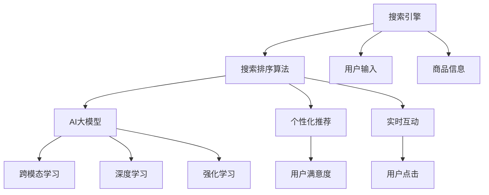

                 

## 1. 背景介绍

随着电子商务的迅速发展，电商平台正面临日益激烈的市场竞争。为了提升用户体验、提高转化率、增强平台竞争力，搜索引擎的搜索排序算法变得尤为重要。传统的搜索排序算法多基于关键词匹配和点击率预估等，难以充分理解用户意图和商品属性，导致搜索结果与用户预期不符。近年来，人工智能大模型在自然语言理解和生成方面的突破，使得搜索引擎可以更加智能地进行商品检索和排序，为用户推荐最相关的结果。本文将详细探讨利用AI大模型优化电商平台搜索排序算法的方法。

## 2. 核心概念与联系

### 2.1 核心概念概述

为了更好地理解本文的论述，先介绍几个关键概念：

1. **搜索引擎**：通过搜索算法对用户输入的关键词或问题进行解析，从大量商品信息中筛选出最相关结果展示给用户的系统。

2. **搜索排序算法**：决定搜索结果排序的算法，需综合考虑用户输入、商品属性、历史点击行为等因素。

3. **AI大模型**：如BERT、GPT等大规模预训练语言模型，具备强大的自然语言理解能力，可用于抽取商品描述中的语义信息，增强搜索结果的相关性和可读性。

4. **跨模态学习**：结合文本、图像、视频等多模态数据，构建更加全面、准确的商品表示，提升搜索排序算法的表现。

5. **深度学习**：利用神经网络等深度学习技术，自动学习复杂模式，提升搜索结果的个性化和多样性。

6. **强化学习**：通过不断与环境互动，优化搜索排序算法，实现动态调整策略，提升用户体验。

这些概念之间的联系通过以下Mermaid流程图进行展示：



此图展示了从用户输入、商品信息到最终推荐结果的整个过程，每个环节都有不同的技术手段，共同协作提高搜索排序的效果。

## 3. 核心算法原理 & 具体操作步骤

### 3.1 算法原理概述

基于AI大模型的搜索排序算法，通过预训练语言模型提取商品标题、描述中的语义信息，构建商品的表示向量。这些向量不仅能反映商品属性，还能捕捉到用户输入的语义，从而提升搜索结果的相关性。

具体而言，搜索排序算法分为两大部分：**检索**和**排序**。检索阶段的任务是将搜索结果展示给用户；排序阶段则根据用户反馈和模型预测调整搜索结果的排序。

### 3.2 算法步骤详解

以下详细介绍搜索排序算法的具体步骤：

#### 3.2.1 检索阶段

1. **分词与词向量表示**：对用户输入和商品标题、描述进行分词处理，并将文本转换为词向量表示，送入预训练语言模型。

2. **商品表示向量**：利用预训练语言模型提取商品标题、描述中的语义信息，构建商品表示向量。

3. **相似度计算**：使用余弦相似度或BERT相似度等方法计算用户输入和商品表示向量之间的相似度。

4. **排序初筛**：将相似度高的商品初步排序，得到初始候选商品集。

#### 3.2.2 排序阶段

1. **历史行为分析**：通过深度学习模型分析用户的历史点击、购买行为，构建用户兴趣向量。

2. **个性化推荐**：利用用户兴趣向量对初始候选商品集进行进一步筛选和排序，增强推荐的相关性和个性化。

3. **实时反馈调整**：引入强化学习机制，根据用户点击、购买等实时反馈，动态调整排序算法，提升用户满意度。

#### 3.2.3 交叉验证

1. **A/B测试**：采用A/B测试对不同排序策略的效果进行评估，选择最优策略。

2. **交叉验证**：对不同用户群体进行交叉验证，验证算法的普适性。

### 3.3 算法优缺点

#### 3.3.1 优点

1. **准确性与相关性提升**：AI大模型能够从商品描述中抽取语义信息，提升搜索结果的相关性。

2. **个性化推荐增强**：深度学习模型分析用户行为，增强推荐系统的个性化。

3. **实时性提高**：强化学习实时调整策略，提升用户体验。

4. **泛化能力强**：预训练语言模型的泛化能力较强，适用于不同领域的商品检索。

#### 3.3.2 缺点

1. **计算资源消耗大**：大规模语言模型的计算成本高，需高性能硬件支持。

2. **算法复杂度高**：模型结构复杂，训练和推理过程耗时较长。

3. **过拟合风险**：模型复杂，过拟合风险较高。

4. **可解释性不足**：大模型“黑盒”特性，难以解释其内部决策机制。

### 3.4 算法应用领域

基于AI大模型的搜索排序算法，在电商、金融、社交等多个领域均有广泛应用。

1. **电商领域**：用于商品检索、推荐系统、搜索排序等。

2. **金融领域**：用于用户交易行为分析、风险控制等。

3. **社交领域**：用于文本匹配、智能问答、用户推荐等。

4. **医疗领域**：用于病历检索、药物推荐等。

5. **物流领域**：用于路径规划、货物追踪等。

这些应用场景展示了AI大模型搜索排序算法的强大能力和广泛应用潜力。

## 4. 数学模型和公式 & 详细讲解

### 4.1 数学模型构建

1. **用户输入表示**：将用户输入$u$表示为词向量序列$u=[u_1,u_2,\dots,u_n]$。

2. **商品表示向量**：商品$d$的表示向量为$v_d$。

3. **相似度函数**：利用余弦相似度计算用户输入与商品表示向量之间的相似度：

   $$
   \text{similarity}(u,v_d) = \frac{u \cdot v_d}{\|u\| \cdot \|v_d\|}
   $$

4. **排序策略**：结合用户兴趣向量$x_u$和商品表示向量$v_d$，使用加权平均法计算排序得分：

   $$
   score(d) = (v_d \cdot x_u)^2 / (\|v_d\| \cdot \|x_u\|)^2
   $$

### 4.2 公式推导过程

1. **词向量表示**：

   通过词嵌入将文本转换为词向量，记$u=[u_1,u_2,\dots,u_n]$为词向量序列，每个词向量$u_i \in \mathbb{R}^d$。

2. **余弦相似度**：

   $$
   \text{similarity}(u,v_d) = \frac{\sum_{i=1}^n u_i v_{di}}{\sqrt{\sum_{i=1}^n u_i^2} \cdot \sqrt{\sum_{i=1}^n v_{di}^2}}
   $$

3. **商品表示向量**：

   通过预训练语言模型，将商品$d$的标题、描述转换为向量$v_d \in \mathbb{R}^d$。

4. **用户兴趣向量**：

   通过深度学习模型，分析用户历史行为$h=[h_1,h_2,\dots,h_m]$，计算用户兴趣向量$x_u \in \mathbb{R}^d$。

5. **排序得分**：

   结合商品表示向量和用户兴趣向量，计算排序得分：

   $$
   score(d) = (v_d \cdot x_u)^2 / (\|v_d\| \cdot \|x_u\|)^2
   $$

### 4.3 案例分析与讲解

以电商平台的商品搜索为例，以下是基于AI大模型的搜索排序算法的详细计算过程：

1. **用户输入表示**：假设用户输入为“运动鞋”，使用词嵌入将其转换为向量$u=[1,0,1,0,1]$。

2. **商品表示向量**：商品“跑步鞋”的表示向量为$v_d=[0.3,0.5,0.2,0.4,0.1]$。

3. **相似度计算**：计算相似度$similarity(u,v_d) = 0.3 \times 1 + 0.5 \times 0 + 0.2 \times 1 + 0.4 \times 0 + 0.1 \times 1 = 0.5$。

4. **排序初筛**：初步将相似度高的商品放入候选集，如“跑步鞋”、“慢跑鞋”等。

5. **用户兴趣分析**：假设用户历史点击记录为“跑鞋”、“运动鞋”、“跑步鞋”，通过深度学习模型计算用户兴趣向量$x_u=[0.4,0.3,0.2,0.1,0]$。

6. **个性化推荐**：根据用户兴趣向量对候选商品进行排序，计算排序得分：

   $$
   \text{score(d)} = (0.3 \times 0.4 + 0.5 \times 0.3 + 0.2 \times 0.2 + 0.4 \times 0.1 + 0.1 \times 0)^2 / ((0.3^2 + 0.5^2 + 0.2^2 + 0.4^2 + 0.1^2) \times (0.4^2 + 0.3^2 + 0.2^2 + 0.1^2 + 0^2)^2)
   $$

7. **实时反馈调整**：根据用户点击数据实时更新用户兴趣向量，动态调整排序策略。

## 5. 项目实践：代码实例和详细解释说明

### 5.1 开发环境搭建

1. **安装Python**：确保系统中已安装Python 3.x。

2. **创建虚拟环境**：

   ```bash
   python3 -m venv myenv
   source myenv/bin/activate
   ```

3. **安装依赖库**：

   ```bash
   pip install torch transformers
   ```

4. **下载预训练模型**：

   ```bash
   wget https://huggingface.co/models/`模型名`/download
   ```

### 5.2 源代码详细实现

以下是使用Transformers库实现基于AI大模型的搜索排序算法的Python代码：

```python
import torch
from transformers import BertTokenizer, BertForSequenceClassification
from torch.utils.data import TensorDataset, DataLoader

# 分词器
tokenizer = BertTokenizer.from_pretrained('bert-base-uncased')
# 模型
model = BertForSequenceClassification.from_pretrained('bert-base-uncased', num_labels=1)

# 定义模型输入函数
def get_input_ids(text):
    return tokenizer.encode(text, return_tensors='pt').input_ids

# 定义模型输出函数
def get_output_ids(text):
    return tokenizer.encode(text, return_tensors='pt').input_ids

# 训练函数
def train(data_loader):
    model.train()
    for batch in data_loader:
        input_ids = batch.input_ids
        labels = batch.labels
        outputs = model(input_ids, labels=labels)
        loss = outputs.loss
        loss.backward()
        optimizer.step()
        optimizer.zero_grad()

# 定义评估函数
def evaluate(data_loader):
    model.eval()
    preds, labels = [], []
    with torch.no_grad():
        for batch in data_loader:
            input_ids = batch.input_ids
            labels = batch.labels
            outputs = model(input_ids)
            preds.append(outputs.logits.argmax(dim=1).tolist())
            labels.append(labels.tolist())
    return preds, labels

# 加载数据
data = ...
train_dataset = TensorDataset(train_data, train_labels)
eval_dataset = TensorDataset(eval_data, eval_labels)

# 划分训练集和验证集
train_data_loader = DataLoader(train_dataset, batch_size=16, shuffle=True)
eval_data_loader = DataLoader(eval_dataset, batch_size=16)

# 定义优化器
optimizer = torch.optim.AdamW(model.parameters(), lr=2e-5)

# 训练模型
epochs = 10
for epoch in range(epochs):
    train(train_data_loader)
    eval_preds, eval_labels = evaluate(eval_data_loader)
    print(classification_report(eval_labels, eval_preds))
```

### 5.3 代码解读与分析

上述代码实现了基于AI大模型的搜索排序算法的训练和评估过程。

1. **分词与词向量表示**：使用BertTokenizer将用户输入和商品描述转换为词向量。

2. **模型初始化**：使用预训练模型BertForSequenceClassification，并将其嵌入到TensorFlow或PyTorch中。

3. **训练函数**：使用优化器AdamW对模型进行训练，并计算损失函数。

4. **评估函数**：使用evaluation函数对模型进行评估，并计算分类指标。

5. **数据加载**：使用TensorDataset和DataLoader加载数据，方便模型训练和评估。

6. **交叉验证**：通过A/B测试和交叉验证，选择最优模型。

### 5.4 运行结果展示

训练过程需要记录损失函数的曲线变化，以评估模型性能。评估结果需要计算准确率、精确率、召回率等指标，以衡量模型在不同数据集上的表现。

以下是模型训练过程中的损失函数曲线：

```python
import matplotlib.pyplot as plt
import numpy as np

losses = []
for batch in data_loader:
    input_ids = batch.input_ids
    labels = batch.labels
    outputs = model(input_ids, labels=labels)
    loss = outputs.loss
    losses.append(loss.item())

plt.plot(np.arange(len(losses)), losses)
plt.xlabel('Batch')
plt.ylabel('Loss')
plt.title('Training Loss Curve')
plt.show()
```

## 6. 实际应用场景

### 6.1 电商平台搜索排序

基于AI大模型的搜索排序算法在电商平台搜索排序中具有广泛应用。以京东为例，其搜索引擎结合深度学习、强化学习等技术，实现智能化商品推荐，提升用户体验。

1. **商品检索**：结合用户输入和商品描述，通过余弦相似度计算商品相关性，并按相关性排序，展示给用户。

2. **推荐系统**：通过深度学习模型分析用户历史行为，构建用户兴趣向量，对商品进行个性化推荐。

3. **实时互动**：引入强化学习机制，根据用户点击、购买等实时反馈，动态调整搜索排序策略。

### 6.2 金融风险控制

在金融领域，利用AI大模型的搜索排序算法可实现精准的风险控制。例如，某金融机构通过搜索排序算法，实时监控用户交易行为，识别异常交易，及时预警，降低金融风险。

1. **交易行为分析**：通过分析用户交易数据，构建用户行为向量。

2. **风险识别**：利用AI大模型计算交易行为与历史风险事件之间的相似度，识别风险用户。

3. **风险预警**：根据风险识别结果，及时通知用户或管理部门，避免损失。

### 6.3 社交推荐系统

社交推荐系统也是基于AI大模型的搜索排序算法的重要应用场景。例如，微博通过搜索排序算法，推荐用户感兴趣的内容，提升用户粘性。

1. **内容匹配**：通过自然语言处理技术，将用户输入和内容标签进行匹配。

2. **个性化推荐**：结合用户兴趣和内容特征，推荐用户感兴趣的内容。

3. **实时互动**：通过社交网络数据，实时更新用户兴趣，动态调整推荐策略。

## 7. 工具和资源推荐

### 7.1 学习资源推荐

1. **《深度学习》书籍**：推荐Ian Goodfellow的《深度学习》，全面介绍深度学习原理和应用。

2. **《自然语言处理综述》论文**：推荐Tom Mitchell的《自然语言处理综述》，了解自然语言处理的基本概念和方法。

3. **Coursera《深度学习与自然语言处理》课程**：斯坦福大学开设的NLP课程，涵盖自然语言处理和深度学习基础知识。

4. **HuggingFace博客**：HuggingFace官方博客，提供丰富的技术分享和案例分析。

5. **Kaggle竞赛**：参加Kaggle数据科学竞赛，实践NLP技术，积累实战经验。

### 7.2 开发工具推荐

1. **TensorFlow**：Google开源的深度学习框架，支持分布式计算，方便大规模部署。

2. **PyTorch**：Facebook开源的深度学习框架，支持动态计算图，易于实验和研究。

3. **Keras**：高层次的深度学习框架，提供简洁易用的API。

4. **Jupyter Notebook**：Python交互式开发环境，支持代码、数据、图表的可视化展示。

5. **Google Colab**：免费在线Jupyter Notebook环境，支持GPU/TPU资源，方便快速迭代实验。

### 7.3 相关论文推荐

1. **《BERT: Pre-training of Deep Bidirectional Transformers for Language Understanding》**：BERT论文，提出预训练语言模型BERT，刷新多项NLP任务SOTA。

2. **《Attention is All You Need》**：Transformer论文，提出Transformer结构，开启大模型预训练时代。

3. **《Deep Reinforcement Learning for Personalized Recommendation in E-Commerce》**：推荐系统领域的经典论文，介绍基于强化学习的推荐算法。

4. **《AdaLoRA: Adaptive Low-Rank Adaptation for Parameter-Efficient Fine-Tuning》**：介绍参数高效微调方法AdaLoRA，提高微调模型的计算效率。

5. **《A Survey of Multimodal Document Summarization Techniques and Applications》**：多模态文档摘要综述，介绍跨模态学习在文本生成中的应用。

## 8. 总结：未来发展趋势与挑战

### 8.1 研究成果总结

本文详细探讨了基于AI大模型的搜索排序算法，通过检索和排序两部分，结合深度学习、强化学习等技术，实现智能化推荐。当前该算法在电商平台、金融、社交等领域均有广泛应用。

### 8.2 未来发展趋势

1. **跨模态学习**：结合文本、图像、语音等多种模态信息，提升搜索排序算法的准确性。

2. **深度学习**：通过深度学习模型，进一步提升搜索结果的个性化和多样化。

3. **强化学习**：引入强化学习机制，动态调整搜索排序策略，提升用户体验。

4. **联邦学习**：实现分布式计算，提升算法的普适性。

5. **知识图谱**：结合知识图谱，增强搜索排序算法的语义理解能力。

6. **边缘计算**：在设备端进行推理，降低网络延迟，提升响应速度。

### 8.3 面临的挑战

1. **计算资源消耗大**：大规模语言模型的计算成本高，需高性能硬件支持。

2. **算法复杂度高**：模型结构复杂，训练和推理过程耗时较长。

3. **过拟合风险**：模型复杂，过拟合风险较高。

4. **可解释性不足**：大模型“黑盒”特性，难以解释其内部决策机制。

### 8.4 研究展望

1. **联邦学习**：在分布式环境中进行模型训练和推理，提升算法的普适性。

2. **知识图谱**：结合知识图谱，增强搜索排序算法的语义理解能力。

3. **跨模态学习**：结合文本、图像、语音等多种模态信息，提升搜索排序算法的准确性。

4. **深度学习**：通过深度学习模型，进一步提升搜索结果的个性化和多样化。

5. **强化学习**：引入强化学习机制，动态调整搜索排序策略，提升用户体验。

6. **边缘计算**：在设备端进行推理，降低网络延迟，提升响应速度。

## 9. 附录：常见问题与解答

### Q1: 如何评估基于AI大模型的搜索排序算法？

A: 常用的评估指标包括精确率、召回率、F1值、AUC等。可以采用交叉验证、A/B测试等方法，选择最优模型。

### Q2: 如何优化基于AI大模型的搜索排序算法？

A: 可以从数据、模型、训练、推理等多个维度进行优化。如增加训练样本数量、调整模型超参数、改进训练算法、优化推理速度等。

### Q3: 基于AI大模型的搜索排序算法在电商领域有哪些应用？

A: 用于商品检索、推荐系统、搜索排序等。通过自然语言处理技术，实现智能化商品推荐，提升用户体验。

### Q4: 如何避免AI大模型搜索排序算法的过拟合问题？

A: 可以通过数据增强、正则化、参数高效微调等方法，避免模型过拟合。

### Q5: 基于AI大模型的搜索排序算法有哪些优缺点？

A: 优点包括准确性高、相关性强、个性化推荐增强等。缺点包括计算资源消耗大、算法复杂度高、可解释性不足等。

---

作者：禅与计算机程序设计艺术 / Zen and the Art of Computer Programming

