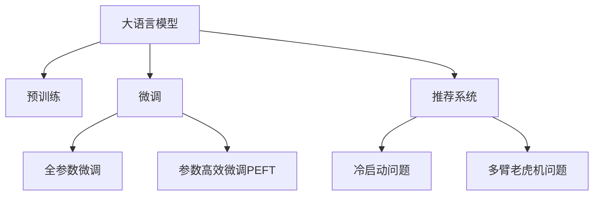

                 

# 电商平台搜索推荐系统的AI 大模型应用：提高系统性能、效率与转化率

## 1. 背景介绍

### 1.1 问题由来

在当今数字化零售时代，电商平台的用户体验和推荐系统至关重要。通过个性化推荐，电商平台能够显著提升用户的购物体验，增加用户留存率和转化率。然而，传统的推荐系统往往依赖于复杂的特征工程和算法模型，难以实时、高效地生成个性化推荐，且容易过拟合，难以适应不断变化的消费者需求。

为了应对这些挑战，基于大模型的推荐系统应运而生。通过在预训练语言模型的基础上进行微调，可以有效提升推荐系统的效果和效率。大模型不仅具有强大的语言理解和生成能力，还能够利用其广泛的通用知识，进行灵活的推荐决策。

### 1.2 问题核心关键点

当前大模型在电商推荐系统的应用中主要关注以下几个核心关键点：

1. **个性化推荐**：基于用户历史行为和偏好，生成个性化的商品推荐。
2. **实时性**：能够实时响应用户查询，动态生成推荐结果。
3. **效率**：在满足推荐质量的同时，尽量减少计算和存储资源消耗。
4. **可解释性**：推荐结果应当具有可解释性，帮助用户理解推荐依据。
5. **可扩展性**：能够在电商平台的规模化应用中保持稳定性和高可靠性。

本文将围绕这些关键点，介绍如何在大模型基础上实现高性能、高效率、高转化率的电商推荐系统。

## 2. 核心概念与联系

### 2.1 核心概念概述

为更好地理解大模型在电商推荐系统中的应用，本节将介绍几个密切相关的核心概念：

- **大语言模型(Large Language Model, LLM)**：以自回归(如GPT)或自编码(如BERT)模型为代表的大规模预训练语言模型。通过在大规模无标签文本语料上进行预训练，学习通用的语言表示，具备强大的语言理解和生成能力。

- **预训练(Pre-training)**：指在大规模无标签文本语料上，通过自监督学习任务训练通用语言模型的过程。常见的预训练任务包括言语建模、遮挡语言模型等。

- **微调(Fine-tuning)**：指在预训练模型的基础上，使用下游任务的少量标注数据，通过有监督学习优化模型在特定任务上的性能。通常只需要调整顶层分类器或解码器，并以较小的学习率更新全部或部分的模型参数。

- **推荐系统(Recommendation System)**：基于用户行为数据和商品属性数据，为用户生成个性化推荐系统的技术。

- **冷启动问题(Cold-start Problem)**：新用户或新商品缺乏历史数据，推荐系统难以提供高质量推荐的挑战。

- **多臂老虎机问题(Multi-Armed Bandit Problem)**：推荐系统中涉及多条商品（臂）的探索与利用（选择与推荐）问题，目标是在有限资源下最大化奖励（用户点击与购买）。

这些核心概念之间的逻辑关系可以通过以下Mermaid流程图来展示：



这个流程图展示了大语言模型的核心概念及其之间的关系：

1. 大语言模型通过预训练获得基础能力。
2. 微调是对预训练模型进行任务特定的优化，可以分为全参数微调和参数高效微调（PEFT）。
3. 推荐系统利用微调后的模型生成推荐结果，并面临冷启动问题和多臂老虎机问题。
4. 冷启动问题和多臂老虎机问题是大模型推荐系统中需要重点解决的问题。

这些概念共同构成了大模型在电商推荐系统中的应用框架，使其能够在推荐决策中发挥强大的语言理解和生成能力。通过理解这些核心概念，我们可以更好地把握大语言模型在电商推荐系统中的应用方法。

## 3. 核心算法原理 & 具体操作步骤

### 3.1 算法原理概述

基于大模型的电商推荐系统，其核心思想是利用大模型在预训练过程中学习到的广泛知识，通过微调使其针对特定的电商推荐任务进行优化，从而生成更加精准、高效的推荐结果。

形式化地，假设预训练模型为 $M_{\theta}$，其中 $\theta$ 为预训练得到的模型参数。给定电商推荐任务 $T$ 的标注数据集 $D=\{(x_i, y_i)\}_{i=1}^N$，推荐系统的微调目标是最小化损失函数 $\mathcal{L}$，使得模型在推荐任务上的性能提升：

$$
\hat{\theta}=\mathop{\arg\min}_{\theta} \mathcal{L}(M_{\theta},D)
$$

其中 $\mathcal{L}$ 为针对任务 $T$ 设计的损失函数，用于衡量模型推荐结果与真实标签之间的差异。常见的损失函数包括交叉熵损失、均方误差损失等。

通过梯度下降等优化算法，微调过程不断更新模型参数 $\theta$，最小化损失函数 $\mathcal{L}$，使得模型输出逼近真实标签。由于 $\theta$ 已经通过预训练获得了较好的初始化，因此即便在电商推荐系统的少量标注数据上进行微调，也能较快收敛到理想的模型参数 $\hat{\theta}$。

### 3.2 算法步骤详解

基于大模型的电商推荐系统一般包括以下几个关键步骤：

**Step 1: 准备预训练模型和数据集**
- 选择合适的预训练语言模型 $M_{\theta}$ 作为初始化参数，如 BERT、GPT 等。
- 准备电商推荐任务 $T$ 的标注数据集 $D$，划分为训练集、验证集和测试集。一般要求标注数据与预训练数据的分布不要差异过大。

**Step 2: 设计推荐策略**
- 根据电商推荐任务的特性，设计合适的推荐策略。如基于深度学习、协同过滤、内容推荐等。
- 对于深度学习推荐策略，通常需要添加推荐头，即在预训练模型的顶层设计推荐网络。

**Step 3: 设置微调超参数**
- 选择合适的优化算法及其参数，如 AdamW、SGD 等，设置学习率、批大小、迭代轮数等。
- 设置正则化技术及强度，包括权重衰减、Dropout、Early Stopping等。
- 确定冻结预训练参数的策略，如仅微调顶层，或全部参数都参与微调。

**Step 4: 执行梯度训练**
- 将训练集数据分批次输入模型，前向传播计算损失函数。
- 反向传播计算参数梯度，根据设定的优化算法和学习率更新模型参数。
- 周期性在验证集上评估模型性能，根据性能指标决定是否触发 Early Stopping。
- 重复上述步骤直到满足预设的迭代轮数或 Early Stopping 条件。

**Step 5: 测试和部署**
- 在测试集上评估微调后模型 $M_{\hat{\theta}}$ 的性能，对比微调前后的精度提升。
- 使用微调后的模型对新用户或新商品进行推荐，集成到实际的应用系统中。
- 持续收集新的用户行为数据，定期重新微调模型，以适应数据分布的变化。

以上是基于大模型的电商推荐系统的一般流程。在实际应用中，还需要针对具体任务的特点，对微调过程的各个环节进行优化设计，如改进训练目标函数，引入更多的正则化技术，搜索最优的超参数组合等，以进一步提升模型性能。

### 3.3 算法优缺点

基于大模型的电商推荐系统具有以下优点：

1. **通用适用**：预训练大模型具备强大的通用语言理解能力，能够适用于多种电商推荐任务，如商品分类、相似度计算等。
2. **高效性**：微调后的模型能够快速响应用户查询，实时生成推荐结果，满足电商平台的实时性需求。
3. **准确性**：通过微调，大模型能够学习到更加准确的商品和用户关联特征，提升推荐精度。
4. **可扩展性**：大模型具备较好的泛化能力，可以轻松扩展到大规模的电商平台，适应不断增长的用户需求。

同时，该方法也存在一定的局限性：

1. **数据依赖**：微调的效果很大程度上取决于标注数据的质量和数量，获取高质量标注数据的成本较高。
2. **计算资源消耗大**：大模型参数量巨大，微调过程中需要消耗大量的计算和存储资源。
3. **可解释性不足**：微调后的模型难以解释其推荐决策的内部机制，导致用户对推荐结果的信任度降低。
4. **性能提升有限**：当目标任务与预训练数据的分布差异较大时，微调的性能提升有限。

尽管存在这些局限性，但就目前而言，基于大模型的推荐系统仍是大规模电商推荐的主要手段。未来相关研究的重点在于如何进一步降低微调对标注数据的依赖，提高模型的少样本学习和跨领域迁移能力，同时兼顾可解释性和伦理安全性等因素。

### 3.4 算法应用领域

基于大模型的电商推荐系统已经在多种电商平台上得到了广泛应用，覆盖了商品推荐、用户画像、购物助手等诸多场景。具体包括：

- **商品推荐**：根据用户历史浏览、购买行为，生成个性化的商品推荐列表。
- **个性化定制**：根据用户偏好，定制个性化的商品推荐，如推荐个性化主题商品。
- **用户画像**：构建用户画像，分析用户兴趣和行为特征，生成精准的用户画像。
- **购物助手**：通过自然语言对话，解答用户疑问，引导用户进行购物决策。
- **库存优化**：分析用户行为数据，预测商品需求，优化库存管理。

除了这些经典应用外，大模型的推荐系统还被创新性地应用到更多场景中，如营销活动设计、价格优化、跨领域推荐等，为电商平台的业务优化提供了新的技术路径。随着预训练模型和推荐方法的不断进步，相信电商平台推荐系统必将在更广阔的应用领域大放异彩。

## 4. 数学模型和公式 & 详细讲解  
### 4.1 数学模型构建

本节将使用数学语言对基于大模型的电商推荐系统进行更加严格的刻画。

记预训练语言模型为 $M_{\theta}$，其中 $\theta$ 为模型参数。假设电商推荐任务为 $T$，其标注数据集为 $D=\{(x_i,y_i)\}_{i=1}^N, x_i \in \mathcal{X}, y_i \in \mathcal{Y}$。其中 $\mathcal{X}$ 为输入空间，$\mathcal{Y}$ 为输出空间。

定义模型 $M_{\theta}$ 在输入 $x$ 上的损失函数为 $\ell(M_{\theta}(x),y)$，则在数据集 $D$ 上的经验风险为：

$$
\mathcal{L}(\theta) = \frac{1}{N} \sum_{i=1}^N \ell(M_{\theta}(x_i),y_i)
$$

微调的优化目标是最小化经验风险，即找到最优参数：

$$
\theta^* = \mathop{\arg\min}_{\theta} \mathcal{L}(\theta)
$$

在实践中，我们通常使用基于梯度的优化算法（如SGD、Adam等）来近似求解上述最优化问题。设 $\eta$ 为学习率，$\lambda$ 为正则化系数，则参数的更新公式为：

$$
\theta \leftarrow \theta - \eta \nabla_{\theta}\mathcal{L}(\theta) - \eta\lambda\theta
$$

其中 $\nabla_{\theta}\mathcal{L}(\theta)$ 为损失函数对参数 $\theta$ 的梯度，可通过反向传播算法高效计算。

### 4.2 公式推导过程

以下我们以电商推荐中的用户行为预测任务为例，推导交叉熵损失函数及其梯度的计算公式。

假设模型 $M_{\theta}$ 在输入 $x$ 上的输出为 $\hat{y}=M_{\theta}(x) \in [0,1]$，表示用户点击商品的概率。真实标签 $y \in \{0,1\}$。则二分类交叉熵损失函数定义为：

$$
\ell(M_{\theta}(x),y) = -[y\log \hat{y} + (1-y)\log (1-\hat{y})]
$$

将其代入经验风险公式，得：

$$
\mathcal{L}(\theta) = -\frac{1}{N}\sum_{i=1}^N [y_i\log M_{\theta}(x_i)+(1-y_i)\log(1-M_{\theta}(x_i))]
$$

根据链式法则，损失函数对参数 $\theta_k$ 的梯度为：

$$
\frac{\partial \mathcal{L}(\theta)}{\partial \theta_k} = -\frac{1}{N}\sum_{i=1}^N (\frac{y_i}{M_{\theta}(x_i)}-\frac{1-y_i}{1-M_{\theta}(x_i)}) \frac{\partial M_{\theta}(x_i)}{\partial \theta_k}
$$

其中 $\frac{\partial M_{\theta}(x_i)}{\partial \theta_k}$ 可进一步递归展开，利用自动微分技术完成计算。

在得到损失函数的梯度后，即可带入参数更新公式，完成模型的迭代优化。重复上述过程直至收敛，最终得到适应电商推荐任务的最优模型参数 $\theta^*$。

## 5. 项目实践：代码实例和详细解释说明
### 5.1 开发环境搭建

在进行电商推荐系统的大模型微调实践前，我们需要准备好开发环境。以下是使用Python进行PyTorch开发的环境配置流程：

1. 安装Anaconda：从官网下载并安装Anaconda，用于创建独立的Python环境。

2. 创建并激活虚拟环境：
```bash
conda create -n pytorch-env python=3.8 
conda activate pytorch-env
```

3. 安装PyTorch：根据CUDA版本，从官网获取对应的安装命令。例如：
```bash
conda install pytorch torchvision torchaudio cudatoolkit=11.1 -c pytorch -c conda-forge
```

4. 安装Transformers库：
```bash
pip install transformers
```

5. 安装各类工具包：
```bash
pip install numpy pandas scikit-learn matplotlib tqdm jupyter notebook ipython
```

完成上述步骤后，即可在`pytorch-env`环境中开始微调实践。

### 5.2 源代码详细实现

这里我们以电商推荐系统中的用户行为预测任务为例，给出使用Transformers库对BERT模型进行微调的PyTorch代码实现。

首先，定义训练数据集：

```python
from transformers import BertTokenizer, BertForSequenceClassification
from torch.utils.data import TensorDataset, DataLoader, RandomSampler, SequentialSampler
import torch
import numpy as np

# 准备训练数据
tokenizer = BertTokenizer.from_pretrained('bert-base-cased')
train_encodings = tokenizer(train_dataset, return_tensors='pt', padding=True, truncation=True)
train_labels = torch.tensor(train_dataset, dtype=torch.long)
train_dataset = TensorDataset(train_encodings['input_ids'], train_encodings['attention_mask'], train_labels)
train_sampler = RandomSampler(train_dataset)
train_dataloader = DataLoader(train_dataset, sampler=train_sampler, batch_size=16)

# 准备验证数据
val_encodings = tokenizer(val_dataset, return_tensors='pt', padding=True, truncation=True)
val_dataset = TensorDataset(val_encodings['input_ids'], val_encodings['attention_mask'], val_labels)
val_sampler = SequentialSampler(val_dataset)
val_dataloader = DataLoader(val_dataset, sampler=val_sampler, batch_size=16)

# 准备测试数据
test_encodings = tokenizer(test_dataset, return_tensors='pt', padding=True, truncation=True)
test_dataset = TensorDataset(test_encodings['input_ids'], test_encodings['attention_mask'], test_labels)
test_sampler = SequentialSampler(test_dataset)
test_dataloader = DataLoader(test_dataset, sampler=test_sampler, batch_size=16)
```

然后，定义模型和优化器：

```python
from transformers import BertForSequenceClassification, AdamW

model = BertForSequenceClassification.from_pretrained('bert-base-cased', num_labels=2, output_attentions=False)

optimizer = AdamW(model.parameters(), lr=2e-5)

device = torch.device('cuda' if torch.cuda.is_available() else 'cpu')
model.to(device)
```

接着，定义训练和评估函数：

```python
from torch.utils.data import DataLoader
from tqdm import tqdm
from sklearn.metrics import accuracy_score, precision_recall_fscore_support

device = torch.device('cuda' if torch.cuda.is_available() else 'cpu')
model.to(device)

def train_epoch(model, data_loader, optimizer):
    model.train()
    total_loss = 0
    for batch in data_loader:
        input_ids = batch[0].to(device)
        attention_mask = batch[1].to(device)
        labels = batch[2].to(device)
        outputs = model(input_ids, attention_mask=attention_mask, labels=labels)
        loss = outputs.loss
        total_loss += loss.item()
        loss.backward()
        optimizer.step()
    return total_loss / len(data_loader)

def evaluate(model, data_loader):
    model.eval()
    total_correct = 0
    total_sample = 0
    for batch in data_loader:
        input_ids = batch[0].to(device)
        attention_mask = batch[1].to(device)
        labels = batch[2].to(device)
        outputs = model(input_ids, attention_mask=attention_mask, labels=labels)
        logits = outputs.logits
        predicted_labels = torch.argmax(logits, dim=1)
        total_correct += (predicted_labels == labels).sum().item()
        total_sample += labels.shape[0]
    accuracy = total_correct / total_sample
    return accuracy
```

最后，启动训练流程并在测试集上评估：

```python
epochs = 5
batch_size = 16

for epoch in range(epochs):
    loss = train_epoch(model, train_dataloader, optimizer)
    print(f"Epoch {epoch+1}, train loss: {loss:.3f}")
    
    print(f"Epoch {epoch+1}, dev accuracy: {evaluate(model, val_dataloader):.3f}")
    
print(f"Epoch {epochs}, test accuracy: {evaluate(model, test_dataloader):.3f}")
```

以上就是使用PyTorch对BERT进行电商推荐任务微调的完整代码实现。可以看到，得益于Transformers库的强大封装，我们可以用相对简洁的代码完成BERT模型的加载和微调。

### 5.3 代码解读与分析

让我们再详细解读一下关键代码的实现细节：

**训练数据处理函数**：
- `train_encodings` 和 `val_encodings`：使用BertTokenizer将文本转换为模型能够处理的数字向量。
- `train_dataset` 和 `val_dataset`：将数字向量和标签组合为TensorDataset。
- `train_sampler` 和 `val_sampler`：定义随机采样器和顺序采样器，用于划分训练和验证数据集。
- `train_dataloader` 和 `val_dataloader`：根据采样器创建DataLoader，方便模型训练和验证。

**模型和优化器**：
- `BertForSequenceClassification`：在预训练模型上添加一个分类头，用于二分类任务。
- `AdamW`：使用AdamW优化器进行模型参数更新，设置学习率。
- `model.to(device)`：将模型迁移到GPU设备，提高计算速度。

**训练和评估函数**：
- `train_epoch` 函数：对每个epoch进行前向传播、反向传播和参数更新。
- `evaluate` 函数：在验证集和测试集上计算模型的准确率，用于评估模型性能。

**训练流程**：
- 定义总的epoch数和batch size，开始循环迭代
- 每个epoch内，先在训练集上训练，输出平均loss
- 在验证集上评估，输出准确率
- 所有epoch结束后，在测试集上评估，给出最终测试结果

可以看到，PyTorch配合Transformers库使得BERT微调的代码实现变得简洁高效。开发者可以将更多精力放在数据处理、模型改进等高层逻辑上，而不必过多关注底层的实现细节。

当然，工业级的系统实现还需考虑更多因素，如模型的保存和部署、超参数的自动搜索、更灵活的任务适配层等。但核心的微调范式基本与此类似。

## 6. 实际应用场景

### 6.1 智能客服系统

基于大模型的推荐系统可以广泛应用于智能客服系统的构建。传统客服往往需要配备大量人力，高峰期响应缓慢，且一致性和专业性难以保证。而使用基于大模型的推荐系统，可以7x24小时不间断服务，快速响应客户咨询，用自然流畅的语言解答各类常见问题。

在技术实现上，可以收集企业内部的历史客服对话记录，将问题和最佳答复构建成监督数据，在此基础上对预训练推荐模型进行微调。微调后的推荐模型能够自动理解用户意图，匹配最合适的答复模板进行回复。对于客户提出的新问题，还可以接入检索系统实时搜索相关内容，动态组织生成回答。如此构建的智能客服系统，能大幅提升客户咨询体验和问题解决效率。

### 6.2 金融舆情监测

金融机构需要实时监测市场舆论动向，以便及时应对负面信息传播，规避金融风险。传统的人工监测方式成本高、效率低，难以应对网络时代海量信息爆发的挑战。基于大模型的推荐系统，可以用于构建金融舆情监测系统，通过实时抓取的市场舆情数据，自动监测不同情感倾向的舆情变化趋势，一旦发现负面信息激增等异常情况，系统便会自动预警，帮助金融机构快速应对潜在风险。

### 6.3 个性化推荐系统

当前的推荐系统往往只依赖用户的历史行为数据进行物品推荐，无法深入理解用户的真实兴趣偏好。基于大模型的推荐系统可以更好地挖掘用户行为背后的语义信息，从而提供更精准、多样的推荐内容。

在实践中，可以收集用户浏览、点击、评论、分享等行为数据，提取和用户交互的物品标题、描述、标签等文本内容。将文本内容作为模型输入，用户的后续行为（如是否点击、购买等）作为监督信号，在此基础上微调预训练语言模型。微调后的模型能够从文本内容中准确把握用户的兴趣点。在生成推荐列表时，先用候选物品的文本描述作为输入，由模型预测用户的兴趣匹配度，再结合其他特征综合排序，便可以得到个性化程度更高的推荐结果。

### 6.4 未来应用展望

随着大模型和推荐方法的不断发展，基于微调范式将在更多领域得到应用，为传统行业带来变革性影响。

在智慧医疗领域，基于微调的推荐系统可以用于辅助诊断和治疗方案推荐，提升医疗服务的智能化水平。

在智能教育领域，微调技术可应用于作业批改、学情分析、知识推荐等方面，因材施教，促进教育公平，提高教学质量。

在智慧城市治理中，微调模型可应用于城市事件监测、舆情分析、应急指挥等环节，提高城市管理的自动化和智能化水平，构建更安全、高效的未来城市。

此外，在企业生产、社会治理、文娱传媒等众多领域，基于大模型微调的人工智能应用也将不断涌现，为经济社会发展注入新的动力。相信随着技术的日益成熟，微调方法将成为人工智能落地应用的重要范式，推动人工智能技术向更广阔的领域加速渗透。

## 7. 工具和资源推荐
### 7.1 学习资源推荐

为了帮助开发者系统掌握大模型在电商推荐系统中的应用，这里推荐一些优质的学习资源：

1. 《Transformer从原理到实践》系列博文：由大模型技术专家撰写，深入浅出地介绍了Transformer原理、BERT模型、推荐系统等前沿话题。

2. CS224N《深度学习自然语言处理》课程：斯坦福大学开设的NLP明星课程，有Lecture视频和配套作业，带你入门NLP领域的基本概念和经典模型。

3. 《Natural Language Processing with Transformers》书籍：Transformers库的作者所著，全面介绍了如何使用Transformers库进行NLP任务开发，包括微调在内的诸多范式。

4. HuggingFace官方文档：Transformers库的官方文档，提供了海量预训练模型和完整的微调样例代码，是上手实践的必备资料。

5. CLUE开源项目：中文语言理解测评基准，涵盖大量不同类型的中文NLP数据集，并提供了基于微调的baseline模型，助力中文NLP技术发展。

通过对这些资源的学习实践，相信你一定能够快速掌握大模型在电商推荐系统中的应用精髓，并用于解决实际的推荐问题。
###  7.2 开发工具推荐

高效的开发离不开优秀的工具支持。以下是几款用于大模型在电商推荐系统开发的常用工具：

1. PyTorch：基于Python的开源深度学习框架，灵活动态的计算图，适合快速迭代研究。大部分预训练语言模型都有PyTorch版本的实现。

2. TensorFlow：由Google主导开发的开源深度学习框架，生产部署方便，适合大规模工程应用。同样有丰富的预训练语言模型资源。

3. Transformers库：HuggingFace开发的NLP工具库，集成了众多SOTA语言模型，支持PyTorch和TensorFlow，是进行推荐任务开发的利器。

4. Weights & Biases：模型训练的实验跟踪工具，可以记录和可视化模型训练过程中的各项指标，方便对比和调优。与主流深度学习框架无缝集成。

5. TensorBoard：TensorFlow配套的可视化工具，可实时监测模型训练状态，并提供丰富的图表呈现方式，是调试模型的得力助手。

6. Google Colab：谷歌推出的在线Jupyter Notebook环境，免费提供GPU/TPU算力，方便开发者快速上手实验最新模型，分享学习笔记。

合理利用这些工具，可以显著提升大模型在电商推荐系统中的开发效率，加快创新迭代的步伐。

### 7.3 相关论文推荐

大语言模型和推荐系统的发展源于学界的持续研究。以下是几篇奠基性的相关论文，推荐阅读：

1. Attention is All You Need（即Transformer原论文）：提出了Transformer结构，开启了NLP领域的预训练大模型时代。

2. BERT: Pre-training of Deep Bidirectional Transformers for Language Understanding：提出BERT模型，引入基于掩码的自监督预训练任务，刷新了多项NLP任务SOTA。

3. Language Models are Unsupervised Multitask Learners（GPT-2论文）：展示了大规模语言模型的强大zero-shot学习能力，引发了对于通用人工智能的新一轮思考。

4. Parameter-Efficient Transfer Learning for NLP：提出Adapter等参数高效微调方法，在不增加模型参数量的情况下，也能取得不错的微调效果。

5. Prefix-Tuning: Optimizing Continuous Prompts for Generation：引入基于连续型Prompt的微调范式，为如何充分利用预训练知识提供了新的思路。

6. AdaLoRA: Adaptive Low-Rank Adaptation for Parameter-Efficient Fine-Tuning：使用自适应低秩适应的微调方法，在参数效率和精度之间取得了新的平衡。

这些论文代表了大模型和推荐系统的发展脉络。通过学习这些前沿成果，可以帮助研究者把握学科前进方向，激发更多的创新灵感。

## 8. 总结：未来发展趋势与挑战

### 8.1 总结

本文对基于大模型的电商推荐系统进行了全面系统的介绍。首先阐述了电商推荐系统的背景和挑战，明确了大模型微调在提升系统性能、效率与转化率方面的独特价值。其次，从原理到实践，详细讲解了大模型微调的步骤和方法，给出了电商推荐任务的微调代码实例。同时，本文还广泛探讨了大模型在电商推荐系统中的应用场景，展示了其广泛的应用前景。此外，本文精选了微调技术的各类学习资源，力求为读者提供全方位的技术指引。

通过本文的系统梳理，可以看到，基于大模型的推荐系统正在成为电商推荐的主流手段，极大地提升了推荐决策的准确性和实时性。得益于大模型的强大语言理解能力，推荐系统能够处理更加复杂多变的用户需求，为用户带来更加个性化和精准的购物体验。未来，伴随预训练语言模型和推荐方法的持续演进，相信电商推荐系统必将在更广阔的应用领域大放异彩，深刻影响消费者的购物行为。

### 8.2 未来发展趋势

展望未来，基于大模型的电商推荐系统将呈现以下几个发展趋势：

1. **多模态融合**：除了文本数据，推荐系统将越来越多地融合图像、语音、视频等多模态数据，以更全面地理解用户需求和商品特性。
2. **深度学习与强化学习结合**：结合深度学习和强化学习技术，推荐系统将具备更强的探索和利用能力，进一步优化推荐效果。
3. **实时计算优化**：引入分布式计算、模型压缩、量化加速等技术，提升推荐系统的计算效率，支持实时推荐。
4. **数据隐私保护**：随着用户隐私意识的提升，推荐系统将更加注重数据隐私保护，采用差分隐私、联邦学习等技术，保障用户数据安全。
5. **自动化调参**：引入自动调参技术，优化推荐模型超参数，提高推荐系统性能。
6. **跨领域迁移**：通过迁移学习技术，推荐系统将具备更强的泛化能力，适应不同领域的电商推荐任务。

这些趋势凸显了电商推荐系统的广阔前景。这些方向的探索发展，必将进一步提升推荐系统的智能化水平，为电商平台的业务优化提供新的技术路径。

### 8.3 面临的挑战

尽管大模型在电商推荐系统中取得了显著成果，但在迈向更加智能化、普适化应用的过程中，它仍面临诸多挑战：

1. **标注数据获取困难**：推荐系统需要大量标注数据进行微调，而标注数据的获取成本较高。如何通过无监督学习、半监督学习等方式降低对标注数据的依赖，是未来研究的重要方向。
2. **冷启动问题**：新用户或新商品缺乏历史数据，推荐系统难以提供高质量推荐。如何通过预训练语言模型和无监督学习技术，提高推荐系统对冷启动用户的适应性，是亟待解决的问题。
3. **计算资源消耗大**：大模型参数量巨大，微调过程中需要消耗大量的计算和存储资源。如何通过参数裁剪、分布式训练等技术，降低计算资源消耗，是推荐系统工业化的重要课题。
4. **可解释性不足**：推荐系统中的大模型难以解释其推荐决策的内部机制，导致用户对推荐结果的信任度降低。如何提高推荐系统的可解释性，增强用户的信任和接受度，是研究者需要重点解决的问题。
5. **公平性与偏见**：推荐系统中的大模型可能存在偏见和歧视，影响推荐公平性。如何从数据和算法层面消除模型偏见，确保推荐系统的公平性和公正性，也是重要的研究方向。

尽管存在这些挑战，但通过技术创新和算法优化，这些问题有望逐步解决。相信在学界和产业界的共同努力下，基于大模型的推荐系统必将在未来电商领域中发挥更加重要的作用。

### 8.4 研究展望

未来，大模型在电商推荐系统中的应用将进一步深化，推动推荐技术的创新和落地。以下是一些可能的研究方向：

1. **无监督与半监督学习**：探索无监督学习和半监督学习技术，降低推荐系统对标注数据的依赖，提升推荐效果。
2. **多模态融合与跨领域迁移**：通过多模态数据的融合和跨领域迁移技术，提升推荐系统的泛化能力和适应性。
3. **个性化推荐与社交推荐结合**：结合个性化推荐和社交推荐技术，进一步提升推荐系统的精准度和多样性。
4. **推荐系统与知识图谱结合**：引入知识图谱和专家知识，提升推荐系统的信息整合能力和知识推理能力。
5. **推荐系统与因果推断结合**：引入因果推断技术，增强推荐系统的可解释性和鲁棒性。
6. **推荐系统与强化学习结合**：结合强化学习技术，提升推荐系统的探索与利用能力，优化推荐策略。

这些研究方向有望进一步推动大模型在电商推荐系统中的应用，提升推荐系统的智能化水平，为电商平台的业务优化提供新的技术路径。相信通过技术创新和算法优化，这些问题有望逐步解决，大模型必将在未来电商推荐系统中发挥更加重要的作用。

## 9. 附录：常见问题与解答

**Q1：大模型推荐系统是否适用于所有电商推荐任务？**

A: 大模型推荐系统在大多数电商推荐任务上都能取得不错的效果，特别是对于数据量较小的任务。但对于一些特定领域的任务，如医药、法律等，仅仅依靠通用语料预训练的模型可能难以很好地适应。此时需要在特定领域语料上进一步预训练，再进行微调，才能获得理想效果。此外，对于一些需要时效性、个性化很强的任务，如对话、推荐等，微调方法也需要针对性的改进优化。

**Q2：如何选择合适的学习率？**

A: 推荐系统中的大模型通常需要设置较小的学习率，以免破坏预训练权重。一般建议从1e-5开始调参，逐步减小学习率，直至收敛。也可以使用warmup策略，在开始阶段使用较小的学习率，再逐渐过渡到预设值。需要注意的是，不同的优化器(如AdamW、Adafactor等)以及不同的学习率调度策略，可能需要设置不同的学习率阈值。

**Q3：大模型推荐系统如何处理冷启动问题？**

A: 冷启动问题是大模型推荐系统面临的重大挑战之一。为了解决这个问题，可以采用以下策略：
1. 基于预训练语言模型，通过无监督学习、自监督学习等方式，提取用户的兴趣特征。
2. 引入多臂老虎机问题，通过探索与利用策略，逐步提升推荐效果。
3. 结合用户输入的信息（如评分、标签等），进行有监督微调，提升模型对新用户的适应性。

**Q4：大模型推荐系统如何进行参数高效微调？**

A: 参数高效微调是提升推荐系统效率的重要手段之一。常用的参数高效微调方法包括：
1. Adapter：在模型顶层添加或替换部分层，减少微调参数量。
2. Prefix-Tuning：使用连续型Prompt进行微调，减少微调参数量。
3. LoRA：使用低秩近似技术，只更新模型的一部分参数，减少计算资源消耗。
4. Mini-ImageNet：使用小型数据集进行微调，减少计算资源消耗。

这些方法可以在保持模型性能的同时，大幅减少微调参数量和计算资源消耗，提升推荐系统的效率和可扩展性。

**Q5：大模型推荐系统如何处理多臂老虎机问题？**

A: 多臂老虎机问题是推荐系统中的探索与利用问题，常用方法包括：
1. 上下文化探索与利用：将用户历史行为与当前行为结合，进行探索与利用。
2. 线性回归模型：使用线性回归模型，根据模型预测结果，动态调整探索与利用策略。
3. UCB算法：使用上置信界算法，平衡探索与利用的概率，优化推荐效果。

这些方法可以在推荐系统中更好地平衡探索与利用，提升推荐系统的精准度和多样性。

---

作者：禅与计算机程序设计艺术 / Zen and the Art of Computer Programming

