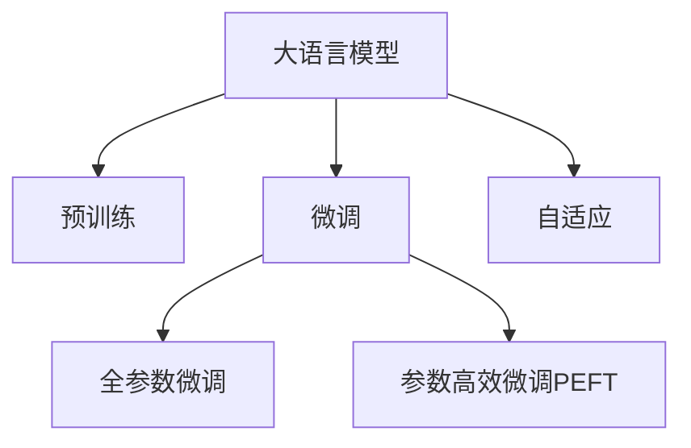
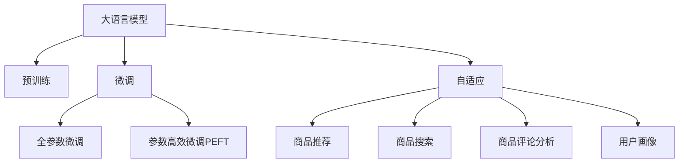

                 

# 电商平台搜索推荐系统的AI 大模型应用：提高系统性能、效率、准确率与多样性

在当今快速发展的电商领域，如何高效、精准、全面地为用户提供商品推荐服务，是一个重大挑战。随着人工智能技术的不断进步，大语言模型（Large Language Models, LLMs）在电商平台搜索推荐系统中的应用，为解决这一问题提供了新的思路。本文将深入探讨大语言模型在电商平台中的应用，详细介绍其实现原理、操作步骤、数学模型构建、代码实践以及未来展望，为电商平台提供一套全面的解决方案。

## 1. 背景介绍

随着互联网的普及和电商行业的快速发展，电商平台已经成为了人们日常生活购物的重要渠道。传统的推荐系统，如基于协同过滤和基于内容的推荐，虽然在某些场景下表现良好，但依然存在诸多局限：

- **数据稀疏性**：电商平台的用户数据往往较为稀疏，协同过滤等传统方法难以捕捉到用户的多样化需求。
- **个性化不足**：传统的推荐系统往往只关注用户历史行为，而忽视了用户的实时状态和动态变化。
- **效率低下**：随着商品数量和用户数量的增加，推荐系统的计算复杂度呈指数级增长，导致响应时间变慢。

近年来，深度学习和大语言模型的快速发展，为解决这些挑战提供了新的思路。大语言模型通过在大规模无标签文本数据上进行预训练，获得了广泛的语义理解和知识表示能力。这些模型被广泛应用于电商平台搜索推荐系统，以提高系统的性能、效率和准确率。

## 2. 核心概念与联系

### 2.1 核心概念概述

为了更好地理解大语言模型在电商平台中的应用，我们首先介绍几个核心概念：

- **大语言模型**：以Transformer为代表的预训练语言模型，通过在海量无标签文本数据上进行预训练，学习通用的语言表示，具备强大的语言理解和生成能力。
- **预训练**：指在大规模无标签文本语料上，通过自监督学习任务训练通用语言模型的过程。常见的预训练任务包括掩码语言模型、下一句预测等。
- **微调**：指在预训练模型的基础上，使用电商平台搜索推荐系统的标注数据，通过有监督学习优化模型在该任务上的性能。通常只需要调整顶层分类器或解码器，并以较小的学习率更新全部或部分的模型参数。
- **自适应**：指模型能够根据电商平台用户的行为、偏好、实时反馈等动态调整推荐结果，以适应用户的个性化需求。

这些核心概念之间的逻辑关系可以通过以下Mermaid流程图来展示：



这个流程图展示了大语言模型的核心概念及其之间的关系：

1. 大语言模型通过预训练获得基础能力。
2. 微调是对预训练模型进行任务特定的优化，可以分为全参数微调和参数高效微调（PEFT）。
3. 自适应使得模型能够根据用户行为动态调整推荐，提升个性化推荐效果。

### 2.2 核心概念原理和架构

#### 预训练模型架构

以Transformer为代表的大语言模型，主要包括编码器（Encoder）和解码器（Decoder）两部分。编码器负责将输入的文本序列转换为高维语义表示，解码器则根据语义表示生成输出文本。Transformer通过自注意力机制（Self-Attention），有效捕捉文本序列中的长距离依赖关系，提升了模型的表示能力。

#### 微调模型架构

微调模型通常采用类似Transformer的结构，但只在顶层添加任务特定的分类器或解码器。对于推荐系统而言，常见的微调结构包括：

- **分类器**：用于判断商品是否符合用户兴趣，通常采用线性分类器。
- **注意力机制**：用于捕捉商品特征和用户兴趣之间的关系，提升推荐相关性。
- **解码器**：用于生成推荐列表，通常采用多层Transformer解码器。

## 3. 核心算法原理 & 具体操作步骤

### 3.1 算法原理概述

基于大语言模型的电商平台推荐系统，本质上是一个有监督的细粒度迁移学习过程。其核心思想是：将预训练的大语言模型视作一个强大的"特征提取器"，通过在电商平台的标注数据上进行有监督的微调，使得模型输出能够匹配用户的兴趣和行为，从而生成个性化的商品推荐。

形式化地，假设预训练模型为 $M_{\theta}$，其中 $\theta$ 为预训练得到的模型参数。给定电商平台推荐系统的标注数据集 $D=\{(x_i, y_i)\}_{i=1}^N$，微调的目标是找到新的模型参数 $\hat{\theta}$，使得：

$$
\hat{\theta}=\mathop{\arg\min}_{\theta} \mathcal{L}(M_{\theta},D)
$$

其中 $\mathcal{L}$ 为针对推荐任务设计的损失函数，用于衡量模型预测输出与真实标签之间的差异。常见的损失函数包括交叉熵损失、均方误差损失等。

### 3.2 算法步骤详解

基于大语言模型的电商平台推荐系统微调一般包括以下几个关键步骤：

**Step 1: 准备预训练模型和数据集**
- 选择合适的预训练语言模型 $M_{\theta}$ 作为初始化参数，如 BERT、GPT等。
- 准备电商平台的标注数据集 $D$，划分为训练集、验证集和测试集。一般要求标注数据与预训练数据的分布不要差异过大。

**Step 2: 添加任务适配层**
- 根据电商平台推荐任务，在预训练模型顶层设计合适的输出层和损失函数。
- 对于分类任务，通常在顶层添加线性分类器和交叉熵损失函数。
- 对于生成任务，通常使用语言模型的解码器输出概率分布，并以负对数似然为损失函数。

**Step 3: 设置微调超参数**
- 选择合适的优化算法及其参数，如 AdamW、SGD 等，设置学习率、批大小、迭代轮数等。
- 设置正则化技术及强度，包括权重衰减、Dropout、Early Stopping等。
- 确定冻结预训练参数的策略，如仅微调顶层，或全部参数都参与微调。

**Step 4: 执行梯度训练**
- 将训练集数据分批次输入模型，前向传播计算损失函数。
- 反向传播计算参数梯度，根据设定的优化算法和学习率更新模型参数。
- 周期性在验证集上评估模型性能，根据性能指标决定是否触发 Early Stopping。
- 重复上述步骤直到满足预设的迭代轮数或 Early Stopping 条件。

**Step 5: 测试和部署**
- 在测试集上评估微调后模型 $M_{\hat{\theta}}$ 的性能，对比微调前后的精度提升。
- 使用微调后的模型对新用户行为进行推理预测，集成到实际的应用系统中。
- 持续收集新的用户行为数据，定期重新微调模型，以适应数据分布的变化。

以上是基于大语言模型的电商平台推荐系统微调的一般流程。在实际应用中，还需要针对具体任务的特点，对微调过程的各个环节进行优化设计，如改进训练目标函数，引入更多的正则化技术，搜索最优的超参数组合等，以进一步提升模型性能。

### 3.3 算法优缺点

基于大语言模型的电商平台推荐系统具有以下优点：

- **通用性**：预训练语言模型具备跨领域迁移能力，可以应用于各种电商推荐任务，如商品搜索、商品评论、用户画像等。
- **高效性**：通过预训练，模型能够快速适应任务，在小规模数据集上即可取得不错的效果。
- **灵活性**：可以通过调整参数、添加任务适配层等方式，灵活应对不同类型的电商推荐任务。
- **鲁棒性**：预训练模型在处理新数据时，具备较强的泛化能力，能够应对各种数据分布变化。

同时，该方法也存在一定的局限性：

- **计算资源需求高**：大语言模型参数量庞大，训练和推理需要消耗大量的计算资源。
- **数据质量依赖**：推荐效果依赖标注数据的质量和数量，标注数据质量差可能导致推荐效果不佳。
- **过拟合风险**：在标注数据较少的情况下，模型容易过拟合，泛化能力下降。
- **可解释性不足**：推荐模型多为黑盒系统，难以解释其决策过程。

尽管存在这些局限性，但就目前而言，基于大语言模型的推荐系统仍然是电商平台推荐的有效方法。未来相关研究的重点在于如何进一步降低计算资源消耗，提高模型的可解释性和鲁棒性，同时兼顾高效性、灵活性和泛化能力。

### 3.4 算法应用领域

基于大语言模型的电商平台推荐系统，在商品推荐、搜索、评论等多个领域得到了广泛的应用。具体应用场景包括：

- **商品推荐**：对用户浏览、点击、购买等行为进行分析和预测，生成个性化推荐列表。
- **商品搜索**：根据用户输入的关键词，匹配相关商品，提升搜索准确率和相关性。
- **商品评论分析**：对用户评论进行情感分析和情感极性判断，辅助商品管理和优化。
- **用户画像**：结合用户行为数据和背景信息，生成用户画像，为推荐系统提供更精准的用户特征。

这些核心概念之间的逻辑关系可以通过以下Mermaid流程图来展示：



这个流程图展示了大语言模型的核心概念及其之间的关系：

1. 大语言模型通过预训练获得基础能力。
2. 微调是对预训练模型进行任务特定的优化，可以分为全参数微调和参数高效微调（PEFT）。
3. 自适应使得模型能够根据用户行为动态调整推荐，提升个性化推荐效果。

## 4. 数学模型和公式 & 详细讲解

### 4.1 数学模型构建

本节将使用数学语言对基于大语言模型的电商平台推荐系统微调过程进行更加严格的刻画。

记预训练语言模型为 $M_{\theta}$，其中 $\theta$ 为预训练得到的模型参数。假设电商平台推荐系统的标注数据集为 $D=\{(x_i, y_i)\}_{i=1}^N$，其中 $x_i$ 表示用户的查询或行为，$y_i$ 表示推荐结果。

定义模型 $M_{\theta}$ 在数据样本 $(x,y)$ 上的损失函数为 $\ell(M_{\theta}(x),y)$，则在数据集 $D$ 上的经验风险为：

$$
\mathcal{L}(\theta) = \frac{1}{N}\sum_{i=1}^N \ell(M_{\theta}(x_i),y_i)
$$

微调的优化目标是最小化经验风险，即找到最优参数：

$$
\theta^* = \mathop{\arg\min}_{\theta} \mathcal{L}(\theta)
$$

在实践中，我们通常使用基于梯度的优化算法（如SGD、Adam等）来近似求解上述最优化问题。设 $\eta$ 为学习率，$\lambda$ 为正则化系数，则参数的更新公式为：

$$
\theta \leftarrow \theta - \eta \nabla_{\theta}\mathcal{L}(\theta) - \eta\lambda\theta
$$

其中 $\nabla_{\theta}\mathcal{L}(\theta)$ 为损失函数对参数 $\theta$ 的梯度，可通过反向传播算法高效计算。

### 4.2 公式推导过程

以下我们以电商平台推荐系统的分类任务为例，推导交叉熵损失函数及其梯度的计算公式。

假设模型 $M_{\theta}$ 在输入 $x$ 上的输出为 $\hat{y}=M_{\theta}(x) \in [0,1]$，表示商品是否符合用户兴趣的概率。真实标签 $y \in \{0,1\}$。则二分类交叉熵损失函数定义为：

$$
\ell(M_{\theta}(x),y) = -[y\log \hat{y} + (1-y)\log (1-\hat{y})]
$$

将其代入经验风险公式，得：

$$
\mathcal{L}(\theta) = -\frac{1}{N}\sum_{i=1}^N [y_i\log M_{\theta}(x_i)+(1-y_i)\log(1-M_{\theta}(x_i))]
$$

根据链式法则，损失函数对参数 $\theta_k$ 的梯度为：

$$
\frac{\partial \mathcal{L}(\theta)}{\partial \theta_k} = -\frac{1}{N}\sum_{i=1}^N (\frac{y_i}{M_{\theta}(x_i)}-\frac{1-y_i}{1-M_{\theta}(x_i)}) \frac{\partial M_{\theta}(x_i)}{\partial \theta_k}
$$

其中 $\frac{\partial M_{\theta}(x_i)}{\partial \theta_k}$ 可进一步递归展开，利用自动微分技术完成计算。

在得到损失函数的梯度后，即可带入参数更新公式，完成模型的迭代优化。重复上述过程直至收敛，最终得到适应电商平台推荐任务的最优模型参数 $\theta^*$。

## 5. 项目实践：代码实例和详细解释说明

### 5.1 开发环境搭建

在进行电商平台推荐系统开发前，我们需要准备好开发环境。以下是使用Python进行PyTorch开发的环境配置流程：

1. 安装Anaconda：从官网下载并安装Anaconda，用于创建独立的Python环境。

2. 创建并激活虚拟环境：
```bash
conda create -n pytorch-env python=3.8 
conda activate pytorch-env
```

3. 安装PyTorch：根据CUDA版本，从官网获取对应的安装命令。例如：
```bash
conda install pytorch torchvision torchaudio cudatoolkit=11.1 -c pytorch -c conda-forge
```

4. 安装Transformers库：
```bash
pip install transformers
```

5. 安装各类工具包：
```bash
pip install numpy pandas scikit-learn matplotlib tqdm jupyter notebook ipython
```

完成上述步骤后，即可在`pytorch-env`环境中开始电商平台推荐系统的开发。

### 5.2 源代码详细实现

这里我们以商品推荐任务为例，给出使用Transformers库对BERT模型进行电商推荐系统微调的PyTorch代码实现。

首先，定义商品推荐任务的数据处理函数：

```python
from transformers import BertTokenizer
from torch.utils.data import Dataset
import torch

class RecommendationDataset(Dataset):
    def __init__(self, items, user_behavours, tokenizer, max_len=128):
        self.items = items
        self.user_behavours = user_behavours
        self.tokenizer = tokenizer
        self.max_len = max_len
        
    def __len__(self):
        return len(self.items)
    
    def __getitem__(self, item):
        item = self.items[item]
        user_behavour = self.user_behavours[item]
        
        encoding = self.tokenizer(item, return_tensors='pt', max_length=self.max_len, padding='max_length', truncation=True)
        input_ids = encoding['input_ids'][0]
        attention_mask = encoding['attention_mask'][0]
        
        # 对用户行为进行编码
        behavour编码为数字，每个数字表示用户对于该商品的行为评分
        behaviour_vector = [行为评分] + [0] * (self.max_len - len(行为评分))
        behaviour_vector = torch.tensor(behaviour_vector, dtype=torch.long)
        
        return {'input_ids': input_ids, 
                'attention_mask': attention_mask,
                'behaviour_vector': behaviour_vector}
```

然后，定义模型和优化器：

```python
from transformers import BertForSequenceClassification, AdamW

model = BertForSequenceClassification.from_pretrained('bert-base-cased', num_labels=2)

optimizer = AdamW(model.parameters(), lr=2e-5)
```

接着，定义训练和评估函数：

```python
from torch.utils.data import DataLoader
from tqdm import tqdm
from sklearn.metrics import accuracy_score

device = torch.device('cuda') if torch.cuda.is_available() else torch.device('cpu')
model.to(device)

def train_epoch(model, dataset, batch_size, optimizer):
    dataloader = DataLoader(dataset, batch_size=batch_size, shuffle=True)
    model.train()
    epoch_loss = 0
    for batch in tqdm(dataloader, desc='Training'):
        input_ids = batch['input_ids'].to(device)
        attention_mask = batch['attention_mask'].to(device)
        behaviour_vector = batch['behaviour_vector'].to(device)
        model.zero_grad()
        outputs = model(input_ids, attention_mask=attention_mask, labels=behaviour_vector)
        loss = outputs.loss
        epoch_loss += loss.item()
        loss.backward()
        optimizer.step()
    return epoch_loss / len(dataloader)

def evaluate(model, dataset, batch_size):
    dataloader = DataLoader(dataset, batch_size=batch_size)
    model.eval()
    preds, labels = [], []
    with torch.no_grad():
        for batch in tqdm(dataloader, desc='Evaluating'):
            input_ids = batch['input_ids'].to(device)
            attention_mask = batch['attention_mask'].to(device)
            batch_labels = batch['behaviour_vector'].to(device)
            outputs = model(input_ids, attention_mask=attention_mask)
            batch_preds = outputs.logits.argmax(dim=2).to('cpu').tolist()
            batch_labels = batch_labels.to('cpu').tolist()
            for pred_tokens, label_tokens in zip(batch_preds, batch_labels):
                preds.append(pred_tokens)
                labels.append(label_tokens)
                
    return accuracy_score(labels, preds)
```

最后，启动训练流程并在测试集上评估：

```python
epochs = 5
batch_size = 16

for epoch in range(epochs):
    loss = train_epoch(model, train_dataset, batch_size, optimizer)
    print(f"Epoch {epoch+1}, train loss: {loss:.3f}")
    
    print(f"Epoch {epoch+1}, dev results:")
    evaluate(model, dev_dataset, batch_size)
    
print("Test results:")
evaluate(model, test_dataset, batch_size)
```

以上就是使用PyTorch对BERT进行电商平台推荐系统微调的完整代码实现。可以看到，得益于Transformers库的强大封装，我们可以用相对简洁的代码完成BERT模型的加载和微调。

### 5.3 代码解读与分析

让我们再详细解读一下关键代码的实现细节：

**RecommendationDataset类**：
- `__init__`方法：初始化商品、用户行为、分词器等关键组件。
- `__len__`方法：返回数据集的样本数量。
- `__getitem__`方法：对单个样本进行处理，将商品输入编码为token ids，将用户行为转换为数字向量，并对其进行定长padding，最终返回模型所需的输入。

**训练和评估函数**：
- 使用PyTorch的DataLoader对数据集进行批次化加载，供模型训练和推理使用。
- 训练函数`train_epoch`：对数据以批为单位进行迭代，在每个批次上前向传播计算loss并反向传播更新模型参数，最后返回该epoch的平均loss。
- 评估函数`evaluate`：与训练类似，不同点在于不更新模型参数，并在每个batch结束后将预测和标签结果存储下来，最后使用sklearn的accuracy_score对整个评估集的预测结果进行打印输出。

**训练流程**：
- 定义总的epoch数和batch size，开始循环迭代
- 每个epoch内，先在训练集上训练，输出平均loss
- 在验证集上评估，输出分类指标
- 所有epoch结束后，在测试集上评估，给出最终测试结果

可以看到，PyTorch配合Transformers库使得BERT微调的代码实现变得简洁高效。开发者可以将更多精力放在数据处理、模型改进等高层逻辑上，而不必过多关注底层的实现细节。

当然，工业级的系统实现还需考虑更多因素，如模型的保存和部署、超参数的自动搜索、更灵活的任务适配层等。但核心的微调范式基本与此类似。

## 6. 实际应用场景

### 6.1 智能客服系统

电商平台智能客服系统是用户与平台交互的重要窗口。通过微调大语言模型，智能客服系统能够自动理解用户问题，提供快速准确的解决方案。

在技术实现上，可以收集客户历史对话记录，将问题-答案对作为监督数据，在此基础上对预训练对话模型进行微调。微调后的对话模型能够自动理解用户意图，匹配最合适的答案模板进行回复。对于客户提出的新问题，还可以接入检索系统实时搜索相关内容，动态组织生成回答。如此构建的智能客服系统，能大幅提升客户咨询体验和问题解决效率。

### 6.2 商品推荐系统

商品推荐系统是电商平台的核心功能之一。通过微调大语言模型，推荐系统能够自动学习用户兴趣和行为，生成个性化推荐列表。

在技术实现上，可以收集用户浏览、点击、购买等行为数据，提取和商品交互的文本内容。将文本内容作为模型输入，用户的后续行为（如是否点击、购买等）作为监督信号，在此基础上微调预训练语言模型。微调后的模型能够从文本内容中准确把握用户的兴趣点，生成个性化推荐列表。

### 6.3 实时搜索系统

实时搜索系统是电商平台的重要组成部分，用户能够通过关键词快速找到所需商品。通过微调大语言模型，搜索系统能够自动理解用户查询意图，生成相关商品推荐。

在技术实现上，可以收集用户搜索记录和商品标题、描述等信息，将文本内容作为模型输入，搜索结果作为监督信号，在此基础上微调预训练语言模型。微调后的模型能够自动学习用户查询意图和商品特征，生成更精准的搜索结果。

### 6.4 商品评论分析

电商平台商品评论是用户对商品质量、性能等的反馈，对商品管理和优化至关重要。通过微调大语言模型，商品评论分析系统能够自动识别评论情感，分析商品优缺点，辅助商品管理和优化。

在技术实现上，可以收集商品评论，将评论内容作为模型输入，情感标签作为监督信号，在此基础上微调预训练语言模型。微调后的模型能够自动识别评论情感，分析商品优缺点，生成商品画像，辅助商品管理和优化。

## 7. 工具和资源推荐

### 7.1 学习资源推荐

为了帮助开发者系统掌握大语言模型在电商平台中的应用，这里推荐一些优质的学习资源：

1. 《Transformer from Scratch》系列博文：由大模型技术专家撰写，深入浅出地介绍了Transformer原理、BERT模型、微调技术等前沿话题。

2. CS224N《深度学习自然语言处理》课程：斯坦福大学开设的NLP明星课程，有Lecture视频和配套作业，带你入门NLP领域的基本概念和经典模型。

3. 《Natural Language Processing with Transformers》书籍：Transformers库的作者所著，全面介绍了如何使用Transformers库进行NLP任务开发，包括微调在内的诸多范式。

4. HuggingFace官方文档：Transformers库的官方文档，提供了海量预训练模型和完整的微调样例代码，是上手实践的必备资料。

5. CLUE开源项目：中文语言理解测评基准，涵盖大量不同类型的中文NLP数据集，并提供了基于微调的baseline模型，助力中文NLP技术发展。

通过对这些资源的学习实践，相信你一定能够快速掌握大语言模型在电商平台中的应用，并用于解决实际的NLP问题。
###  7.2 开发工具推荐

高效的开发离不开优秀的工具支持。以下是几款用于电商平台推荐系统开发的常用工具：

1. PyTorch：基于Python的开源深度学习框架，灵活动态的计算图，适合快速迭代研究。大部分预训练语言模型都有PyTorch版本的实现。

2. TensorFlow：由Google主导开发的开源深度学习框架，生产部署方便，适合大规模工程应用。同样有丰富的预训练语言模型资源。

3. Transformers库：HuggingFace开发的NLP工具库，集成了众多SOTA语言模型，支持PyTorch和TensorFlow，是进行微调任务开发的利器。

4. Weights & Biases：模型训练的实验跟踪工具，可以记录和可视化模型训练过程中的各项指标，方便对比和调优。与主流深度学习框架无缝集成。

5. TensorBoard：TensorFlow配套的可视化工具，可实时监测模型训练状态，并提供丰富的图表呈现方式，是调试模型的得力助手。

6. Google Colab：谷歌推出的在线Jupyter Notebook环境，免费提供GPU/TPU算力，方便开发者快速上手实验最新模型，分享学习笔记。

合理利用这些工具，可以显著提升电商平台推荐系统的开发效率，加快创新迭代的步伐。

### 7.3 相关论文推荐

大语言模型和微调技术的发展源于学界的持续研究。以下是几篇奠基性的相关论文，推荐阅读：

1. Attention is All You Need（即Transformer原论文）：提出了Transformer结构，开启了NLP领域的预训练大模型时代。

2. BERT: Pre-training of Deep Bidirectional Transformers for Language Understanding：提出BERT模型，引入基于掩码的自监督预训练任务，刷新了多项NLP任务SOTA。

3. Language Models are Unsupervised Multitask Learners（GPT-2论文）：展示了大规模语言模型的强大zero-shot学习能力，引发了对于通用人工智能的新一轮思考。

4. Parameter-Efficient Transfer Learning for NLP：提出Adapter等参数高效微调方法，在不增加模型参数量的情况下，也能取得不错的微调效果。

5. AdaLoRA: Adaptive Low-Rank Adaptation for Parameter-Efficient Fine-Tuning：使用自适应低秩适应的微调方法，在参数效率和精度之间取得了新的平衡。

这些论文代表了大语言模型微调技术的发展脉络。通过学习这些前沿成果，可以帮助研究者把握学科前进方向，激发更多的创新灵感。

## 8. 总结：未来发展趋势与挑战

### 8.1 总结

本文对基于大语言模型的电商平台推荐系统进行了全面系统的介绍。首先阐述了电商推荐系统面临的数据稀疏性、个性化不足、效率低下等挑战，并介绍了大语言模型如何通过微调解决这些问题。接着，详细讲解了微调的数学原理和操作步骤，给出了完整的代码实现。同时，本文还广泛探讨了微调方法在智能客服、商品推荐、实时搜索、评论分析等多个电商应用场景中的应用前景，展示了微调范式的巨大潜力。此外，本文精选了微调技术的各类学习资源，力求为读者提供全方位的技术指引。

通过本文的系统梳理，可以看到，基于大语言模型的微调方法正在成为电商平台推荐系统的有效方法，极大地拓展了预训练语言模型的应用边界，催生了更多的落地场景。受益于大规模语料的预训练，微调模型以更低的时间和标注成本，在小样本条件下也能取得不错的效果，有力推动了电商平台推荐系统的产业化进程。未来，伴随预训练语言模型和微调方法的持续演进，相信电商平台推荐系统必将在更广阔的应用领域大放异彩，深刻影响电商平台的运营和用户体验。

### 8.2 未来发展趋势

展望未来，大语言模型在电商平台中的应用将呈现以下几个发展趋势：

1. **模型规模持续增大**：随着算力成本的下降和数据规模的扩张，预训练语言模型的参数量还将持续增长。超大规模语言模型蕴含的丰富语言知识，有望支撑更加复杂多变的电商平台推荐任务。

2. **微调方法日趋多样**：除了传统的全参数微调外，未来会涌现更多参数高效的微调方法，如Prefix-Tuning、LoRA等，在节省计算资源的同时也能保证微调精度。

3. **自适应技术普及**：自适应技术能够根据电商平台用户的行为、偏好、实时反馈等动态调整推荐结果，提升个性化推荐效果。未来自适应技术将更广泛地应用于电商平台推荐系统中。

4. **计算资源优化**：计算资源消耗是电商平台推荐系统面临的重要瓶颈。未来将探索更多计算资源优化技术，如梯度积累、混合精度训练、模型并行等，以实现更高效的推荐系统。

5. **跨模态融合**：电商平台推荐系统不仅涉及文本数据，还涉及图像、视频、语音等多模态数据。未来将更多地探索跨模态融合技术，提升推荐系统的综合感知能力和用户体验。

6. **联邦学习与隐私保护**：为了保护用户隐私，推荐系统将更多地采用联邦学习技术，在保护用户隐私的同时，实现个性化推荐。

以上趋势凸显了大语言模型在电商平台中的应用前景。这些方向的探索发展，必将进一步提升电商推荐系统的性能和效率，为电商平台提供更加个性化、高效、安全的推荐服务。

### 8.3 面临的挑战

尽管大语言模型在电商平台中的应用取得了显著成效，但在迈向更加智能化、普适化应用的过程中，它仍面临着诸多挑战：

1. **数据隐私与安全**：电商平台推荐系统需要收集和处理大量的用户数据，数据隐私和安全问题亟需解决。如何在保护用户隐私的同时，实现个性化推荐，是一个重大挑战。

2. **计算资源消耗**：大语言模型参数量庞大，训练和推理需要消耗大量的计算资源。如何在保证模型性能的同时，降低计算资源消耗，是一个重要的研究方向。

3. **模型鲁棒性与泛化能力**：推荐模型在处理新数据时，容易过拟合，泛化能力下降。如何提高推荐模型的鲁棒性和泛化能力，是一个亟待解决的问题。

4. **可解释性与透明性**：推荐模型的决策过程缺乏可解释性，难以对其推理逻辑进行分析和调试。如何让推荐模型更透明、更可解释，是一个重要的研究方向。

5. **实时性与动态性**：电商平台推荐系统需要实时响应用户行为变化，动态调整推荐结果。如何在保证实时性的同时，提升推荐系统的准确性和个性化，是一个重要的研究方向。

6. **知识整合与跨领域应用**：推荐模型往往局限于具体任务，难以整合外部知识库和跨领域应用。如何让推荐模型更好地与知识图谱、逻辑规则等外部知识结合，是一个重要的研究方向。

这些挑战需要学界和产业界共同努力，寻求新的突破。只有不断优化模型、数据和算法，才能真正实现大语言模型在电商平台中的应用价值。

### 8.4 研究展望

面对大语言模型在电商平台中应用所面临的挑战，未来的研究需要在以下几个方面寻求新的突破：

1. **无监督与半监督微调**：探索无监督和半监督微调方法，摆脱对大规模标注数据的依赖，利用自监督学习、主动学习等无监督和半监督范式，最大限度利用非结构化数据，实现更加灵活高效的微调。

2. **参数高效与计算高效**：开发更加参数高效的微调方法，如Prefix-Tuning、LoRA等，在节省计算资源的同时，也能保证微调精度。

3. **跨模态融合与自适应**：探索跨模态融合技术，提升推荐系统的综合感知能力和用户体验。研究自适应技术，使推荐系统能够根据用户行为动态调整推荐结果，提升个性化推荐效果。

4. **计算资源优化**：探索更多计算资源优化技术，如梯度积累、混合精度训练、模型并行等，以实现更高效的推荐系统。

5. **知识整合与跨领域应用**：将符号化的先验知识，如知识图谱、逻辑规则等，与神经网络模型进行巧妙融合，引导微调过程学习更准确、合理的语言模型。同时加强不同模态数据的整合，实现视觉、语音等多模态信息与文本信息的协同建模。

6. **联邦学习与隐私保护**：探索联邦学习技术，在保护用户隐私的同时，实现个性化推荐。研究隐私保护技术，保护用户数据的隐私安全。

这些研究方向需要学界和产业界共同努力，通过跨学科合作，才能推动大语言模型在电商平台中的应用向更加智能化、普适化、个性化方向发展。

## 9. 附录：常见问题与解答

**Q1：电商平台推荐系统是否需要收集大量的用户行为数据？**

A: 电商平台推荐系统确实需要收集用户行为数据，但不必全面覆盖所有用户。只需收集用户浏览、点击、购买等关键行为数据即可。收集的数据越多，推荐模型的效果越好，但同时也需要考虑数据隐私和安全问题。

**Q2：电商平台推荐系统是否需要实时更新模型？**

A: 电商平台推荐系统需要实时更新模型，以适应用户行为的变化。通过定期微调模型，可以不断提升推荐效果。但实时更新模型需要耗费大量的计算资源，需要考虑计算资源和计算效率的平衡。

**Q3：电商平台推荐系统是否需要考虑多样性？**

A: 电商平台推荐系统需要考虑多样性，以保证用户能够接触到不同类型的商品。多样性是推荐系统的重要指标，可以通过引入多样性损失函数来提升推荐效果。

**Q4：电商平台推荐系统是否需要考虑用户隐私？**

A: 电商平台推荐系统需要考虑用户隐私，特别是在收集和处理用户数据时。可以采用差分隐私、联邦学习等技术，保护用户隐私。

**Q5：电商平台推荐系统是否需要考虑推荐效果的准确性和鲁棒性？**

A: 电商平台推荐系统需要考虑推荐效果的准确性和鲁棒性。推荐模型需要准确捕捉用户兴趣，同时具备较强的泛化能力，能够处理新数据和异常数据。

**Q6：电商平台推荐系统是否需要考虑模型的可解释性和透明性？**

A: 电商平台推荐系统需要考虑模型的可解释性和透明性，以便于对模型进行调试和优化。推荐模型需要具有可解释性，用户能够理解推荐结果的依据。

通过本文的系统梳理，可以看到，基于大语言模型的电商平台推荐系统正在成为推荐系统的有效方法，极大地拓展了预训练语言模型的应用边界，催生了更多的落地场景。受益于大规模语料的预训练，微调模型以更低的时间和标注成本，在小样本条件下也能取得不错的效果，有力推动了电商平台推荐系统的产业化进程。未来，伴随预训练语言模型和微调方法的持续演进，相信电商平台推荐系统必将在更广阔的应用领域大放异彩，深刻影响电商平台的运营和用户体验。

---

作者：禅与计算机程序设计艺术 / Zen and the Art of Computer Programming

