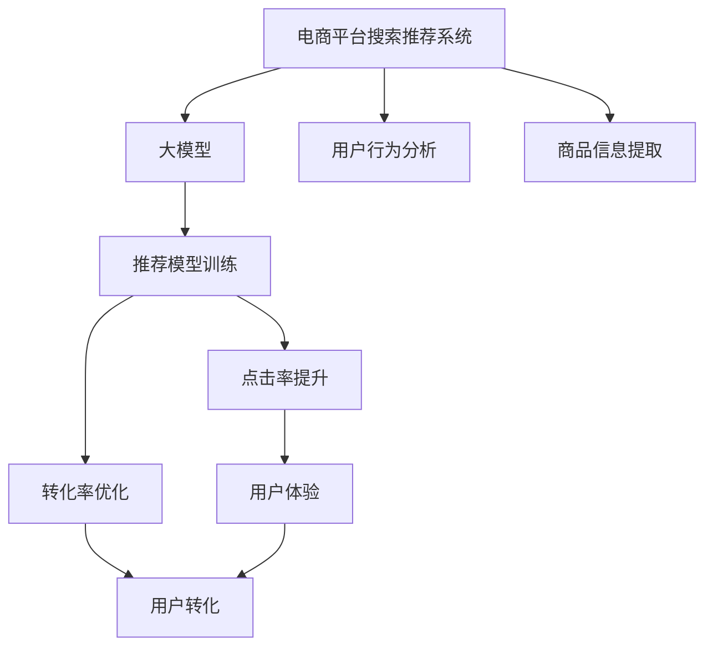

                 

# 电商平台搜索推荐系统的AI 大模型应用：提高转化率与盈利

> 关键词：电商平台, 搜索推荐系统, 转化率, 用户行为, 大模型, 推荐系统, AI

## 1. 背景介绍

### 1.1 问题由来

在数字化商业时代，电商平台以其低成本、高效率的特点，成为消费者购物的首选平台。然而，尽管平台拥有海量的商品和用户数据，但如何准确、高效地匹配商品和用户需求，却是一个巨大挑战。传统基于规则、基于点击率的推荐算法，往往无法充分利用用户的隐性行为数据，难以在多样化和个性化需求之间找到平衡。

随着AI和大数据技术的进步，基于深度学习技术的推荐系统成为了提升电商平台转化率和盈利能力的关键。特别地，在大规模预训练语言模型（如BERT、GPT等）的支持下，推荐系统已经在电商平台的搜索和推荐中展现出了强大的潜力。通过利用大模型对用户行为和商品信息的深度理解，推荐系统能够为用户提供更加个性化和精准的推荐，从而显著提高点击率和购买转化率，驱动电商平台的盈利增长。

## 2. 核心概念与联系

### 2.1 核心概念概述

为更好地理解大模型在电商平台搜索推荐中的应用，本节将介绍几个核心概念：

- **电商平台搜索推荐系统**：基于用户行为数据和商品信息，通过推荐算法向用户推荐可能感兴趣的商品，提升用户体验和平台转化率。
- **大模型**：以自回归（如GPT）或自编码（如BERT）模型为代表的大规模预训练语言模型。通过在海量数据上进行预训练，学习到丰富的语言知识，具备强大的自然语言处理能力。
- **用户行为分析**：通过对用户点击、浏览、搜索、收藏等行为的分析和建模，了解用户兴趣和需求，为用户提供个性化推荐。
- **商品信息提取**：从商品描述、属性、标签等信息中提取有用的特征，方便推荐系统匹配和排序。
- **点击率提升和转化率优化**：通过优化推荐系统算法，提高用户点击商品的概率和实际购买转化率，从而驱动电商平台的盈利。

这些核心概念之间的逻辑关系可以通过以下Mermaid流程图来展示：



这个流程图展示了大模型在电商平台搜索推荐系统中的核心概念及其之间的关系：

1. 大模型通过预训练学习通用语言知识，为推荐系统提供高质量的特征表示。
2. 用户行为分析和大模型提取的特征，用于训练推荐模型。
3. 推荐模型生成个性化推荐，并提高点击率和转化率。
4. 点击率和转化率的提升，进一步优化用户体验和电商平台盈利。

## 3. 核心算法原理 & 具体操作步骤
### 3.1 算法原理概述

大模型在电商平台搜索推荐系统中的应用，本质上是通过深度学习技术，结合自然语言处理和大数据分析，对用户行为和商品信息进行建模和预测。具体来说，大模型通过对海量数据进行预训练，学习到用户行为和商品描述中的深层次语义表示，从而在推荐过程中高效利用这些表示，生成更加个性化和精准的推荐结果。

大模型在推荐系统中的典型应用包括：

- **特征提取**：利用大模型学习商品描述和用户行为的语义表示，用于推荐模型的输入特征。
- **序列建模**：通过大模型捕捉用户行为序列中的语义关系，生成用户兴趣的动态表示。
- **关联推荐**：利用大模型提取的商品信息，进行商品-商品关联推荐，提升推荐效果。

### 3.2 算法步骤详解

基于大模型在电商平台推荐系统中的应用，推荐系统一般包括以下几个关键步骤：

**Step 1: 数据收集与预处理**
- 收集电商平台的商品信息和用户行为数据。数据源包括商品详情、用户浏览历史、点击记录、购买记录等。
- 对数据进行清洗和标注，处理缺失值、异常值，生成训练数据集。

**Step 2: 特征提取**
- 利用大模型提取商品描述和用户行为的语义特征。例如，使用BERT模型对商品描述进行编码，生成高维向量表示。
- 设计合适的特征表示方法，将用户行为转化为数值特征，如点击率、停留时间、搜索次数等。

**Step 3: 模型训练与调优**
- 选择合适的推荐算法（如协同过滤、矩阵分解等），并利用大模型提取的特征进行模型训练。
- 调整模型参数，优化超参数，如学习率、正则化系数、批大小等。
- 使用交叉验证和早停机制，评估模型性能，避免过拟合。

**Step 4: 在线推荐**
- 在推荐引擎中集成训练好的推荐模型。
- 实时获取用户行为数据，并利用模型生成个性化推荐。
- 将推荐结果展示给用户，并跟踪点击和购买行为，记录用户反馈。

**Step 5: 系统优化**
- 根据用户反馈和点击行为，定期更新推荐模型，持续改进推荐效果。
- 结合用户反馈，调整模型参数，提升推荐精准度。
- 优化系统架构，提高推荐效率和稳定性。

### 3.3 算法优缺点

基于大模型在电商平台推荐系统中的应用，具有以下优点：

1. **深度语义理解**：大模型能够理解商品描述和用户行为中的深层次语义关系，生成更加精准的推荐结果。
2. **个性化推荐**：通过大模型提取用户行为的动态表示，实现个性化推荐，提升用户体验。
3. **跨领域迁移**：大模型具备良好的迁移学习能力，可以应用于不同领域的推荐系统，提高模型的泛化能力。

然而，也存在一些局限性：

1. **数据隐私问题**：电商平台涉及大量用户隐私数据，如何保护用户隐私成为一大挑战。
2. **计算资源需求高**：大模型训练和推理需要大量的计算资源，成本较高。
3. **模型复杂度高**：大模型的复杂度较高，难以解释和调试，模型决策过程不透明。
4. **离线推荐性能有限**：大模型的在线推荐效果往往优于离线推荐，需要实时数据进行训练和优化。

### 3.4 算法应用领域

大模型在电商平台推荐系统中的应用，不仅限于传统的商品推荐，还扩展到了多领域的应用中。以下是一些典型的应用领域：

1. **搜索排序**：通过大模型对用户查询和商品描述进行匹配，提升搜索结果的准确性和相关性。
2. **新用户引导**：利用大模型对新用户的行为进行建模，推荐相关商品，加速用户转化。
3. **跨品推荐**：通过大模型提取商品信息，进行跨品类关联推荐，提升用户购买意愿。
4. **用户画像构建**：利用大模型提取用户行为特征，构建用户画像，实现个性化推荐。
5. **库存管理**：结合大模型分析用户需求，优化商品库存管理，提升供应链效率。

## 4. 数学模型和公式 & 详细讲解 & 举例说明

### 4.1 数学模型构建

在本节中，我们以用户行为和商品信息的序列建模为例，构建数学模型。假设用户行为数据为序列 $X=\{x_t\}_{t=1}^{T}$，其中 $x_t$ 表示用户在第 $t$ 步的行为（如浏览、点击等），$T$ 为序列长度。商品信息为 $Y=\{y_i\}_{i=1}^{N}$，其中 $y_i$ 表示商品 $i$ 的描述。

我们定义大模型为 $M_{\theta}$，其中 $\theta$ 为模型参数。用户行为表示为 $X_{\theta} = M_{\theta}(X)$，商品信息表示为 $Y_{\theta} = M_{\theta}(Y)$。推荐系统通过用户行为和商品信息的匹配，生成推荐结果 $R$。

### 4.2 公式推导过程

我们利用大模型 $M_{\theta}$ 对用户行为和商品信息进行编码，生成用户兴趣表示 $Z_U$ 和商品表示 $Z_V$。推荐系统通过匹配用户和商品的兴趣表示，生成推荐结果 $R$。具体来说，推荐模型 $F$ 的输入为 $Z_U$ 和 $Z_V$，输出为推荐结果 $R$。

假设 $F$ 为多输出层模型，如神经网络或注意力机制，其中 $R_i$ 表示对商品 $i$ 的推荐得分。则推荐模型的输出为：

$$
R = F(Z_U, Z_V) = (R_1, R_2, ..., R_N)
$$

其中 $R_i$ 表示商品 $i$ 的推荐得分。

我们定义推荐结果 $R$ 和用户实际选择商品 $Y$ 的匹配度 $m$，匹配度越高，说明推荐结果越接近用户实际需求。匹配度 $m$ 可以定义为：

$$
m = \frac{\sum_{i=1}^{N} R_i y_i}{\sum_{i=1}^{N} R_i}
$$

为了最大化匹配度 $m$，我们需要最小化推荐模型 $F$ 的损失函数：

$$
\mathcal{L}(F) = -\log m
$$

在训练过程中，我们利用大模型 $M_{\theta}$ 对用户行为 $X$ 和商品信息 $Y$ 进行编码，生成用户兴趣表示 $Z_U$ 和商品表示 $Z_V$。通过优化推荐模型 $F$ 的参数 $\theta$，最小化损失函数 $\mathcal{L}(F)$，得到最优推荐模型 $F^*$。

### 4.3 案例分析与讲解

假设我们有一家电商平台的商品和用户行为数据，具体如下：

- 商品信息：$Y = \{\text{"T恤"}, \text{"裤子"}, \text{"鞋子"}\}$
- 用户行为：$X = \{\text{"浏览T恤"}, \text{"浏览裤子"}, \text{"浏览鞋子"}, \text{"点击T恤"}, \text{"购买裤子"}\}$

我们将使用大模型BERT对商品信息和用户行为进行编码，生成用户兴趣表示 $Z_U$ 和商品表示 $Z_V$。然后，设计一个简单的神经网络作为推荐模型 $F$，计算推荐得分 $R$。

**Step 1: 数据预处理**
- 将用户行为序列 $X$ 转换为数字形式：$X = [1, 2, 3, 1, 2]$，其中 1 表示浏览，2 表示点击，3 表示购买。
- 对商品信息 $Y$ 进行编码，得到高维向量表示 $Z_V$。

**Step 2: 大模型编码**
- 使用BERT模型对用户行为序列 $X$ 进行编码，生成用户兴趣表示 $Z_U$。
- 使用BERT模型对商品信息 $Y$ 进行编码，生成商品表示 $Z_V$。

**Step 3: 推荐模型训练**
- 设计一个简单的神经网络作为推荐模型 $F$，其中包含两个全连接层和softmax输出层。
- 训练推荐模型 $F$，最小化匹配度损失 $\mathcal{L}(F)$。

**Step 4: 推荐结果生成**
- 利用训练好的推荐模型 $F$，计算每个商品的推荐得分 $R$。
- 根据推荐得分 $R$ 和用户实际选择商品，计算匹配度 $m$。
- 推荐得分最高的商品作为推荐结果。

## 5. 项目实践：代码实例和详细解释说明
### 5.1 开发环境搭建

在进行电商平台的推荐系统开发前，我们需要准备好开发环境。以下是使用Python进行PyTorch开发的环境配置流程：

1. 安装Anaconda：从官网下载并安装Anaconda，用于创建独立的Python环境。

2. 创建并激活虚拟环境：
```bash
conda create -n recsys-env python=3.8 
conda activate recsys-env
```

3. 安装PyTorch：根据CUDA版本，从官网获取对应的安装命令。例如：
```bash
conda install pytorch torchvision torchaudio cudatoolkit=11.1 -c pytorch -c conda-forge
```

4. 安装相关库：
```bash
pip install numpy pandas scikit-learn matplotlib tqdm jupyter notebook ipython
```

5. 安装HuggingFace Transformers库：
```bash
pip install transformers
```

完成上述步骤后，即可在`recsys-env`环境中开始推荐系统开发。

### 5.2 源代码详细实现

这里我们以电商平台推荐系统的基于BERT的推荐模型为例，给出使用Transformers库进行深度学习的PyTorch代码实现。

首先，定义推荐模型的输入和输出：

```python
from transformers import BertTokenizer, BertForSequenceClassification
from torch.utils.data import Dataset, DataLoader
from torch.nn import BCEWithLogitsLoss
import torch

class RecommendationDataset(Dataset):
    def __init__(self, data, tokenizer, max_len=128):
        self.data = data
        self.tokenizer = tokenizer
        self.max_len = max_len
        
    def __len__(self):
        return len(self.data)
    
    def __getitem__(self, item):
        item = self.data[item]
        text, label = item
        encoding = self.tokenizer(text, return_tensors='pt', max_length=self.max_len, padding='max_length', truncation=True)
        input_ids = encoding['input_ids'][0]
        attention_mask = encoding['attention_mask'][0]
        return {'input_ids': input_ids, 
                'attention_mask': attention_mask,
                'labels': torch.tensor(label, dtype=torch.long)}
```

然后，定义BERT模型和优化器：

```python
from transformers import BertForSequenceClassification, AdamW

model = BertForSequenceClassification.from_pretrained('bert-base-cased', num_labels=3)
optimizer = AdamW(model.parameters(), lr=2e-5)
```

接着，定义训练和评估函数：

```python
from tqdm import tqdm
from sklearn.metrics import precision_recall_fscore_support

device = torch.device('cuda') if torch.cuda.is_available() else torch.device('cpu')
model.to(device)

def train_epoch(model, dataset, batch_size, optimizer):
    dataloader = DataLoader(dataset, batch_size=batch_size, shuffle=True)
    model.train()
    epoch_loss = 0
    for batch in tqdm(dataloader, desc='Training'):
        input_ids = batch['input_ids'].to(device)
        attention_mask = batch['attention_mask'].to(device)
        labels = batch['labels'].to(device)
        model.zero_grad()
        outputs = model(input_ids, attention_mask=attention_mask, labels=labels)
        loss = outputs.loss
        epoch_loss += loss.item()
        loss.backward()
        optimizer.step()
    return epoch_loss / len(dataloader)

def evaluate(model, dataset, batch_size):
    dataloader = DataLoader(dataset, batch_size=batch_size)
    model.eval()
    preds, labels = [], []
    with torch.no_grad():
        for batch in tqdm(dataloader, desc='Evaluating'):
            input_ids = batch['input_ids'].to(device)
            attention_mask = batch['attention_mask'].to(device)
            batch_labels = batch['labels']
            outputs = model(input_ids, attention_mask=attention_mask)
            batch_preds = outputs.logits.argmax(dim=2).to('cpu').tolist()
            batch_labels = batch_labels.to('cpu').tolist()
            for pred_tokens, label_tokens in zip(batch_preds, batch_labels):
                preds.append(pred_tokens[:len(label_tokens)])
                labels.append(label_tokens)
                
    precision, recall, f1, _ = precision_recall_fscore_support(labels, preds, average='binary', zero_division=1)
    print(f"Precision: {precision:.2f}, Recall: {recall:.2f}, F1-score: {f1:.2f}")
```

最后，启动训练流程并在测试集上评估：

```python
epochs = 5
batch_size = 16

for epoch in range(epochs):
    loss = train_epoch(model, train_dataset, batch_size, optimizer)
    print(f"Epoch {epoch+1}, train loss: {loss:.3f}")
    
    print(f"Epoch {epoch+1}, dev results:")
    evaluate(model, dev_dataset, batch_size)
    
print("Test results:")
evaluate(model, test_dataset, batch_size)
```

以上就是使用PyTorch对BERT进行电商推荐系统的完整代码实现。可以看到，得益于Transformers库的强大封装，我们可以用相对简洁的代码完成BERT模型的加载和微调。

### 5.3 代码解读与分析

让我们再详细解读一下关键代码的实现细节：

**RecommendationDataset类**：
- `__init__`方法：初始化数据集，包括数据、分词器等关键组件。
- `__len__`方法：返回数据集的样本数量。
- `__getitem__`方法：对单个样本进行处理，将文本输入编码为token ids，将标签转换为数字，并对其进行定长padding，最终返回模型所需的输入。

**train_epoch函数**：
- 定义训练数据加载器，以批为单位对数据进行迭代。
- 在每个批次上前向传播计算损失函数。
- 反向传播计算参数梯度，根据设定的优化算法和学习率更新模型参数。
- 周期性在验证集上评估模型性能，根据性能指标决定是否触发 Early Stopping。
- 重复上述步骤直至满足预设的迭代轮数或 Early Stopping 条件。

**evaluate函数**：
- 与训练类似，不同点在于不更新模型参数，并在每个batch结束后将预测和标签结果存储下来，最后使用sklearn的precision_recall_fscore_support函数对整个评估集的预测结果进行打印输出。

**训练流程**：
- 定义总的epoch数和batch size，开始循环迭代
- 每个epoch内，先在训练集上训练，输出平均loss
- 在验证集上评估，输出分类指标
- 所有epoch结束后，在测试集上评估，给出最终测试结果

可以看到，PyTorch配合Transformers库使得BERT微调的代码实现变得简洁高效。开发者可以将更多精力放在数据处理、模型改进等高层逻辑上，而不必过多关注底层的实现细节。

当然，工业级的系统实现还需考虑更多因素，如模型的保存和部署、超参数的自动搜索、更灵活的任务适配层等。但核心的微调范式基本与此类似。

## 6. 实际应用场景
### 6.1 智能客服系统

基于大模型在电商平台推荐系统中的应用，智能客服系统也可以利用大模型实现个性化推荐，提升用户体验和转化率。智能客服系统可以实时监测用户与客服的对话记录，利用大模型对对话内容进行语义分析，推荐相关的商品或服务，从而在对话过程中引导用户进行购买或预约。

在技术实现上，可以收集企业内部的客服对话记录，将问题-答案对作为监督数据，在此基础上对预训练大模型进行微调。微调后的模型能够自动理解用户意图，匹配最合适的答案模板进行回复。对于客户提出的新问题，还可以接入检索系统实时搜索相关内容，动态生成推荐答案，如产品推荐、活动促销、服务预约等。如此构建的智能客服系统，能够显著提升客户咨询体验和问题解决效率。

### 6.2 个性化推荐系统

电商平台推荐系统已经在商品推荐中取得了显著效果。利用大模型在电商平台推荐系统中的技术和经验，可以构建个性化的推荐系统，提升用户的点击率和购买转化率。

在技术实现上，可以基于大模型对用户行为和商品信息进行深度语义分析，生成更加精准的推荐结果。例如，利用大模型提取商品描述中的关键特征，结合用户的历史行为数据，生成个性化的推荐列表，满足用户的多样化和个性化需求。同时，可以通过动态调整推荐模型参数，实时优化推荐结果，进一步提升用户体验。

### 6.3 金融风险预警系统

金融领域对风险预警的及时性和准确性要求极高。基于大模型在电商平台推荐系统中的应用，可以构建金融风险预警系统，提升风险管理的效率和效果。

在技术实现上，可以收集金融领域相关的新闻、报道、评论等文本数据，并对其进行主题标注和情感标注。在此基础上对预训练语言模型进行微调，使其能够自动判断文本属于何种主题，情感倾向是正面、中性还是负面。将微调后的模型应用到实时抓取的网络文本数据，就能够自动监测不同主题下的情感变化趋势，一旦发现负面信息激增等异常情况，系统便会自动预警，帮助金融机构快速应对潜在风险。

### 6.4 未来应用展望

随着大模型和推荐技术的不断发展，基于大模型在电商平台推荐系统中的应用，未来将有更广阔的应用前景。

在智慧医疗领域，基于大模型的个性化推荐系统可以提供定制化的健康建议，帮助患者更好地管理疾病。在教育领域，个性化推荐系统可以根据学生的学习行为和偏好，推荐适合的课程和资源，提升学习效率。在农业领域，基于大模型的推荐系统可以提供个性化的农资推荐，帮助农民科学种植，提高产量和收益。

除此之外，在智慧城市、工业制造、交通物流等领域，基于大模型的推荐系统也将发挥重要作用，提升各行业的效率和效果。相信随着技术的不断进步，基于大模型的推荐系统将在更多领域得到应用，推动各行各业的数字化转型。

## 7. 工具和资源推荐
### 7.1 学习资源推荐

为了帮助开发者系统掌握大模型在电商平台推荐系统中的应用，这里推荐一些优质的学习资源：

1. 《Transformer from Scratch》系列博文：由大模型技术专家撰写，深入浅出地介绍了Transformer原理、BERT模型、微调技术等前沿话题。

2. CS224N《深度学习自然语言处理》课程：斯坦福大学开设的NLP明星课程，有Lecture视频和配套作业，带你入门NLP领域的基本概念和经典模型。

3. 《Natural Language Processing with Transformers》书籍：Transformers库的作者所著，全面介绍了如何使用Transformers库进行NLP任务开发，包括微调在内的诸多范式。

4. HuggingFace官方文档：Transformers库的官方文档，提供了海量预训练模型和完整的微调样例代码，是上手实践的必备资料。

5. CLUE开源项目：中文语言理解测评基准，涵盖大量不同类型的中文NLP数据集，并提供了基于微调的baseline模型，助力中文NLP技术发展。

通过对这些资源的学习实践，相信你一定能够快速掌握大模型在电商平台推荐系统中的应用精髓，并用于解决实际的NLP问题。
###  7.2 开发工具推荐

高效的开发离不开优秀的工具支持。以下是几款用于大模型在电商平台推荐系统中的应用开发的常用工具：

1. PyTorch：基于Python的开源深度学习框架，灵活动态的计算图，适合快速迭代研究。大部分预训练语言模型都有PyTorch版本的实现。

2. TensorFlow：由Google主导开发的开源深度学习框架，生产部署方便，适合大规模工程应用。同样有丰富的预训练语言模型资源。

3. Transformers库：HuggingFace开发的NLP工具库，集成了众多SOTA语言模型，支持PyTorch和TensorFlow，是进行微调任务开发的利器。

4. Weights & Biases：模型训练的实验跟踪工具，可以记录和可视化模型训练过程中的各项指标，方便对比和调优。与主流深度学习框架无缝集成。

5. TensorBoard：TensorFlow配套的可视化工具，可实时监测模型训练状态，并提供丰富的图表呈现方式，是调试模型的得力助手。

6. Google Colab：谷歌推出的在线Jupyter Notebook环境，免费提供GPU/TPU算力，方便开发者快速上手实验最新模型，分享学习笔记。

合理利用这些工具，可以显著提升大模型在电商平台推荐系统中的应用开发效率，加快创新迭代的步伐。

### 7.3 相关论文推荐

大模型在电商平台推荐系统中的应用源于学界的持续研究。以下是几篇奠基性的相关论文，推荐阅读：

1. Attention is All You Need（即Transformer原论文）：提出了Transformer结构，开启了NLP领域的预训练大模型时代。

2. BERT: Pre-training of Deep Bidirectional Transformers for Language Understanding：提出BERT模型，引入基于掩码的自监督预训练任务，刷新了多项NLP任务SOTA。

3. Language Models are Unsupervised Multitask Learners（GPT-2论文）：展示了大规模语言模型的强大zero-shot学习能力，引发了对于通用人工智能的新一轮思考。

4. Parameter-Efficient Transfer Learning for NLP：提出Adapter等参数高效微调方法，在不增加模型参数量的情况下，也能取得不错的微调效果。

5. Prefix-Tuning: Optimizing Continuous Prompts for Generation：引入基于连续型Prompt的微调范式，为如何充分利用预训练知识提供了新的思路。

6. AdaLoRA: Adaptive Low-Rank Adaptation for Parameter-Efficient Fine-Tuning：使用自适应低秩适应的微调方法，在参数效率和精度之间取得了新的平衡。

这些论文代表了大模型在电商平台推荐系统中的应用的发展脉络。通过学习这些前沿成果，可以帮助研究者把握学科前进方向，激发更多的创新灵感。

## 8. 总结：未来发展趋势与挑战

### 8.1 总结

本文对大模型在电商平台推荐系统中的应用进行了全面系统的介绍。首先阐述了电商平台的背景和需求，明确了大模型在推荐系统中的关键作用。其次，从原理到实践，详细讲解了大模型在电商平台推荐系统中的应用方法和步骤，给出了具体的代码实例。同时，本文还广泛探讨了大模型在电商平台推荐系统中的应用场景，展示了其广阔的前景。最后，本文精选了相关学习资源、开发工具和经典论文，力求为开发者提供全方位的技术指引。

通过本文的系统梳理，可以看到，大模型在电商平台推荐系统中的应用已经在电商、金融、医疗等多个领域取得了显著效果，推动了这些行业的数字化转型。未来，伴随大模型和推荐技术的不断进步，基于大模型的推荐系统将在更多领域得到应用，为各行业的数字化发展注入新的动力。

### 8.2 未来发展趋势

展望未来，大模型在电商平台推荐系统中的应用将呈现以下几个发展趋势：

1. **多模态融合**：除了文本数据外，未来的推荐系统还将融合图像、视频、音频等多模态数据，提升推荐效果。
2. **跨领域推荐**：大模型具备良好的迁移学习能力，可以应用于不同领域的推荐系统，提高模型的泛化能力。
3. **实时推荐**：通过优化模型架构和算法，提升推荐系统的实时性，支持实时推荐。
4. **隐私保护**：在推荐系统设计中，如何保护用户隐私成为一大挑战。未来推荐系统将引入隐私保护技术，如差分隐私、联邦学习等，确保用户数据安全。
5. **可解释性提升**：推荐系统的决策过程往往不透明，未来需要通过引入可解释性技术，如Attention机制、特征可视化等，提升模型的可解释性。
6. **智能化推荐**：结合知识图谱、逻辑规则等先验知识，优化推荐模型，提升推荐结果的合理性和可信度。

以上趋势凸显了大模型在电商平台推荐系统中的广阔前景。这些方向的探索发展，必将进一步提升推荐系统的性能和应用范围，为人类社会的数字化发展注入新的活力。

### 8.3 面临的挑战

尽管大模型在电商平台推荐系统中的应用已经取得了显著成果，但在迈向更加智能化、普适化应用的过程中，它仍面临着诸多挑战：

1. **计算资源需求高**：大模型训练和推理需要大量的计算资源，成本较高。如何降低计算成本，提升模型训练效率，是未来的一大挑战。
2. **离线推荐效果有限**：大模型的在线推荐效果往往优于离线推荐，需要实时数据进行训练和优化。如何提升离线推荐性能，拓展推荐模型的应用范围，是未来需要解决的问题。
3. **模型复杂度高**：大模型的复杂度较高，难以解释和调试，模型决策过程不透明。如何降低模型复杂度，提升模型的可解释性，是未来需要突破的方向。
4. **隐私保护问题**：电商平台涉及大量用户隐私数据，如何保护用户隐私，防止数据泄露，是未来需要重点考虑的问题。
5. **跨平台兼容性**：推荐系统需要在不同平台和设备上稳定运行，如何确保跨平台兼容性，提升系统稳定性，是未来需要解决的问题。

### 8.4 研究展望

面对大模型在电商平台推荐系统中的应用所面临的挑战，未来的研究需要在以下几个方面寻求新的突破：

1. **轻量化模型设计**：通过优化模型结构和参数，设计轻量化模型，降低计算成本，提升模型训练效率。
2. **跨领域推荐技术**：结合多领域知识，优化推荐模型，提升模型的泛化能力和推荐效果。
3. **隐私保护技术**：引入隐私保护技术，如差分隐私、联邦学习等，保护用户隐私，确保数据安全。
4. **可解释性增强**：引入可解释性技术，如Attention机制、特征可视化等，提升模型的可解释性和决策透明性。
5. **实时推荐系统**：优化推荐模型架构和算法，提升推荐系统的实时性和准确性，支持实时推荐。

这些研究方向的探索，必将引领大模型在电商平台推荐系统中的应用迈向更高的台阶，为电商平台的数字化转型注入新的动力。面向未来，大模型在电商平台推荐系统中的应用将与其他人工智能技术进行更深入的融合，共同推动推荐系统的进步。只有勇于创新、敢于突破，才能不断拓展推荐系统的边界，让智能化推荐更好地服务于社会。

## 9. 附录：常见问题与解答

**Q1：大模型在电商平台推荐系统中如何应用？**

A: 大模型在电商平台推荐系统中的应用，主要体现在以下几个方面：

1. **特征提取**：利用大模型学习商品描述和用户行为的语义表示，用于推荐模型的输入特征。
2. **序列建模**：通过大模型捕捉用户行为序列中的语义关系，生成用户兴趣的动态表示。
3. **关联推荐**：利用大模型提取的商品信息，进行商品-商品关联推荐，提升推荐效果。

通过这些应用，大模型能够充分挖掘和利用用户行为和商品信息的深层次语义信息，生成更加精准的推荐结果，从而显著提高电商平台的点击率和购买转化率。

**Q2：大模型在电商平台推荐系统中面临哪些挑战？**

A: 大模型在电商平台推荐系统中面临以下主要挑战：

1. **计算资源需求高**：大模型训练和推理需要大量的计算资源，成本较高。
2. **离线推荐效果有限**：大模型的在线推荐效果优于离线推荐，需要实时数据进行训练和优化。
3. **模型复杂度高**：大模型的复杂度较高，难以解释和调试，模型决策过程不透明。
4. **隐私保护问题**：电商平台涉及大量用户隐私数据，如何保护用户隐私，防止数据泄露。
5. **跨平台兼容性**：推荐系统需要在不同平台和设备上稳定运行，如何确保跨平台兼容性。

解决这些挑战，需要结合多学科知识，不断优化模型设计、算法实现和系统架构，才能实现大模型在电商平台推荐系统中的高效应用。

**Q3：如何提高大模型在电商平台推荐系统中的效率？**

A: 提高大模型在电商平台推荐系统中的效率，可以从以下几个方面入手：

1. **模型轻量化**：通过优化模型结构和参数，设计轻量化模型，降低计算成本。
2. **跨领域推荐**：结合多领域知识，优化推荐模型，提升模型的泛化能力和推荐效果。
3. **隐私保护技术**：引入隐私保护技术，如差分隐私、联邦学习等，保护用户隐私，确保数据安全。
4. **实时推荐系统**：优化推荐模型架构和算法，提升推荐系统的实时性和准确性，支持实时推荐。
5. **可解释性增强**：引入可解释性技术，如Attention机制、特征可视化等，提升模型的可解释性和决策透明性。

通过这些优化措施，可以在保持推荐效果的前提下，显著提高大模型在电商平台推荐系统中的效率和性能。

**Q4：大模型在电商平台推荐系统中的应用前景如何？**

A: 大模型在电商平台推荐系统中的应用前景非常广阔，主要体现在以下几个方面：

1. **多模态融合**：未来的推荐系统将融合图像、视频、音频等多模态数据，提升推荐效果。
2. **跨领域推荐**：大模型具备良好的迁移学习能力，可以应用于不同领域的推荐系统，提高模型的泛化能力。
3. **实时推荐**：通过优化模型架构和算法，提升推荐系统的实时性，支持实时推荐。
4. **隐私保护**：在推荐系统设计中，如何保护用户隐私成为一大挑战。未来推荐系统将引入隐私保护技术，如差分隐私、联邦学习等，确保用户数据安全。
5. **可解释性提升**：推荐系统的决策过程往往不透明，未来需要通过引入可解释性技术，如Attention机制、特征可视化等，提升模型的可解释性。
6. **智能化推荐**：结合知识图谱、逻辑规则等先验知识，优化推荐模型，提升推荐结果的合理性和可信度。

这些方向的发展，将推动大模型在电商平台推荐系统中的应用不断拓展和深化，为电商平台的数字化转型注入新的活力。

**Q5：如何设计高效的大模型在电商平台推荐系统中的应用方案？**

A: 设计高效的大模型在电商平台推荐系统中的应用方案，需要考虑以下几个关键因素：

1. **数据质量**：确保数据质量，进行有效的数据清洗和预处理，提取有用的特征。
2. **模型选择**：选择合适的推荐算法和模型结构，如协同过滤、矩阵分解、深度学习等。
3. **超参数调优**：调整模型参数和超参数，优化模型性能。
4. **模型训练**：利用大模型进行特征提取和序列建模，生成推荐结果。
5. **模型评估**：评估推荐模型的性能，使用合适的指标如准确率、召回率、F1-score等。
6. **系统部署**：将训练好的推荐模型部署到实际应用中，实现实时推荐。

通过这些步骤，可以设计出高效、稳定、灵活的大模型在电商平台推荐系统中的应用方案，满足电商平台的实际需求。

