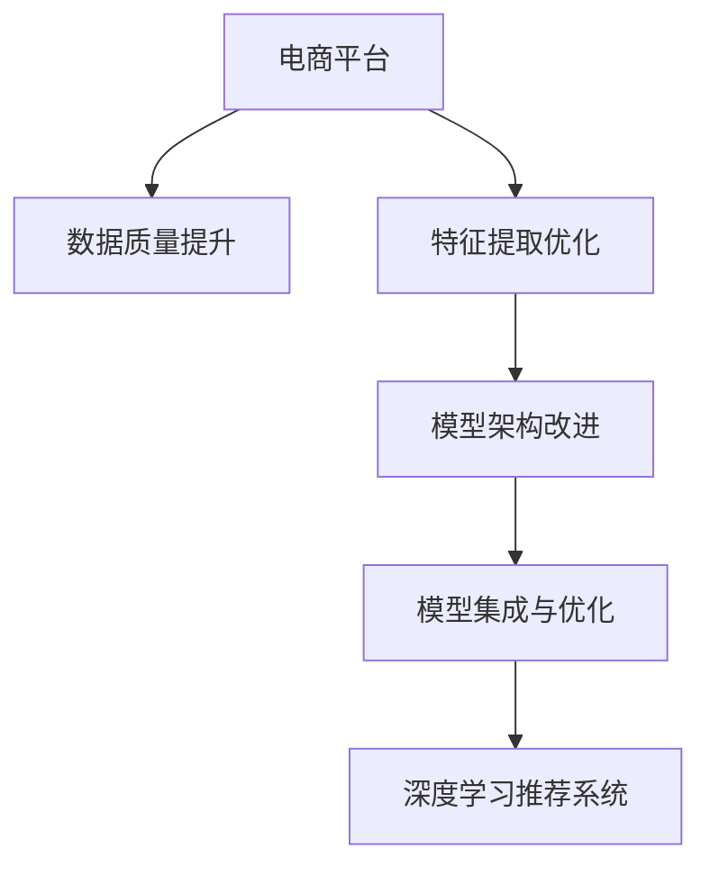

                 

# 电商平台搜索推荐系统的AI 大模型融合：应对数据质量与处理能力挑战

## 1. 背景介绍

在电子商务平台的搜索推荐系统中，用户查询意图与商品匹配是用户体验的重要部分。为了实现高精度的匹配，当前主流做法是使用深度学习模型进行用户行为预测和商品推荐。然而，电商平台的数据质量与处理能力往往存在瓶颈，导致模型性能难以达到预期。近年来，AI大模型在自然语言处理(NLP)、计算机视觉(CV)等领域取得了显著突破，展现出强大的泛化能力和应用潜力。如何将大模型有效融合到电商平台搜索推荐系统中，利用其强大的语义理解与表示能力，同时应对数据质量与处理能力的挑战，成为一大热点话题。

### 1.1 问题由来

随着电子商务的快速发展，在线交易平台的商品种类和用户数量大幅增加。如何在海量商品和用户数据中快速准确地为用户提供最相关的搜索结果和推荐，成为了电商平台面临的重大挑战。传统的基于规则、统计方法、向量空间模型等技术已经难以满足需求。基于深度学习的推荐系统，能够从大量数据中提取用户兴趣与商品特征之间的复杂关系，得到了广泛应用。

但是，深度学习模型需要高质量的标注数据和强大的计算能力进行训练和推理。电商平台的数据质量和处理能力往往有限，数据存在不完整、噪音、不均衡等问题，同时计算资源受限。此外，用户行为数据的收集、存储与处理也需要应对数据量膨胀和隐私保护的需求。

为了解决这些问题，AI大模型融合到电商平台搜索推荐系统中的思路应运而生。大模型利用大规模预训练数据学习到了通用的语言表示和视觉表示，具有强大的泛化能力，能够从少量标注数据中快速学习特定任务的特征，提升推荐系统的精度和效率。同时，大模型的优化算法和模型压缩技术，能够在保持性能的同时降低对计算资源的需求。

### 1.2 问题核心关键点

电商平台搜索推荐系统的AI大模型融合，核心在于如何将大模型的优势与电商平台的实际需求相结合。具体包括以下几个关键点：

- **数据质量提升**：通过大模型处理，提升电商平台的原始数据质量，包括文本清洗、文本增强、缺失值填补等。
- **特征提取优化**：利用大模型提取用户行为和商品特征中的语义信息，优化特征空间，提高推荐精度。
- **模型架构改进**：通过与大模型结合，改进推荐模型架构，减少计算量，提升处理速度。
- **模型集成与优化**：合理集成大模型与电商推荐模型的优势，在保持大模型泛化能力的同时，优化模型推理效率。

## 2. 核心概念与联系

### 2.1 核心概念概述

为更好地理解电商平台搜索推荐系统的AI大模型融合方法，本节将介绍几个密切相关的核心概念：

- **大模型(Large Model)**：以GPT、BERT、ViT等为代表的预训练模型，通过在大规模无标签数据上进行自监督预训练，学习到丰富的语言或视觉表示。
- **深度学习推荐系统**：通过学习用户历史行为和商品属性，预测用户兴趣与商品相关性，推荐用户可能感兴趣的物品。
- **数据质量提升**：通过大模型处理，提升电商平台原始数据的完整性和准确性，包括文本清洗、文本增强、缺失值填补等。
- **特征提取优化**：利用大模型提取用户行为和商品特征中的语义信息，优化特征空间，提高推荐精度。
- **模型架构改进**：通过与大模型结合，改进推荐模型架构，减少计算量，提升处理速度。
- **模型集成与优化**：合理集成大模型与电商推荐模型的优势，在保持大模型泛化能力的同时，优化模型推理效率。

这些核心概念之间的逻辑关系可以通过以下Mermaid流程图来展示：



这个流程图展示了电商平台搜索推荐系统的核心概念及其之间的关系：

1. 电商平台通过数据质量提升和大模型特征提取优化，提高原始数据的利用率。
2. 特征优化后，改进推荐模型的架构，减少计算资源消耗。
3. 通过模型集成与优化，结合大模型的优势与电商推荐模型的优势，提升推荐系统性能。

## 3. 核心算法原理 & 具体操作步骤
### 3.1 算法原理概述

电商平台搜索推荐系统的AI大模型融合方法，本质上是一种基于大模型的迁移学习过程。其核心思想是：利用大模型的通用知识，提升电商平台推荐系统的性能。

具体而言，电商平台的原始数据中往往存在不完整、噪音等问题。通过大模型处理，提升数据质量，提取用户行为和商品特征中的语义信息，优化特征空间，从而提升推荐系统的精度和效率。

### 3.2 算法步骤详解

基于大模型的电商平台搜索推荐系统融合，一般包括以下几个关键步骤：

**Step 1: 数据预处理**
- 收集电商平台的用户行为数据，包括点击、浏览、购买等行为记录。
- 收集商品数据，包括商品描述、属性、价格等。
- 对数据进行清洗、去重、合并等预处理，提升数据质量。

**Step 2: 大模型特征提取**
- 选择合适的预训练大模型，如GPT、BERT、ViT等，作为特征提取器。
- 利用大模型处理电商平台的原始数据，提取文本或图像的语义信息。
- 将大模型的特征输出作为推荐模型的输入特征，优化特征空间。

**Step 3: 推荐模型微调**
- 选择合适的推荐模型，如基于深度神经网络的协同过滤模型、基于深度学习的内容推荐模型等。
- 将大模型的特征输出作为推荐模型的输入，利用推荐数据集进行微调。
- 微调时，使用参数高效的微调方法，减少计算量，提升处理速度。

**Step 4: 模型集成与优化**
- 将大模型的输出与电商平台的推荐模型集成，形成融合模型。
- 根据电商平台的实际需求，设计合适的融合策略，如加权融合、异步融合等。
- 对融合模型进行优化，如使用梯度裁剪、动量优化等，提升推荐精度。

### 3.3 算法优缺点

基于大模型的电商平台搜索推荐系统融合方法，具有以下优点：
1. 提升数据质量：通过大模型处理，提升电商平台的原始数据质量，提取语义信息，优化特征空间。
2. 优化特征提取：利用大模型提取用户行为和商品特征中的语义信息，提高推荐精度。
3. 减少计算资源消耗：使用参数高效的微调方法，减少计算量，提升处理速度。
4. 提高推荐系统性能：结合大模型的泛化能力和电商推荐模型的准确性，提升推荐系统效果。

同时，该方法也存在一定的局限性：
1. 数据依赖大：大模型需要大量的标注数据进行微调，可能难以适应电商平台的小样本数据。
2. 模型复杂度高：大模型的计算复杂度较高，需要较强的计算资源支持。
3. 模型难以解释：大模型往往是"黑盒"系统，难以解释其决策逻辑。
4. 隐私风险高：大模型涉及用户隐私数据，需要加强隐私保护措施。

尽管存在这些局限性，但就目前而言，基于大模型的融合方法仍是大模型应用的重要范式。未来相关研究的重点在于如何进一步降低数据依赖，提高模型的少样本学习和跨领域迁移能力，同时兼顾可解释性和隐私保护等因素。

### 3.4 算法应用领域

基于大模型的电商平台搜索推荐系统融合方法，在多个电商平台上得到了广泛应用，具体如下：

- **阿里巴巴**：利用BERT模型提取用户行为和商品特征，优化推荐系统，提升用户转化率和满意度。
- **京东**：使用大模型进行商品分类和推荐，提升推荐系统的准确性和用户粘性。
- **Amazon**：结合大模型和电商推荐模型，优化推荐算法，提高推荐系统的用户覆盖率和转化率。
- **美团**：应用大模型提取用户行为和商品特征，优化推荐算法，提升用户体验和订单量。

这些成功案例表明，大模型在电商平台搜索推荐系统中具有广泛的应用前景。随着预训练模型和微调方法的不断进步，相信电商平台推荐系统必将在更广泛的场景下发挥其巨大潜力。

## 4. 数学模型和公式 & 详细讲解 & 举例说明
### 4.1 数学模型构建

电商平台搜索推荐系统的AI大模型融合，涉及用户行为数据和商品数据的预处理、大模型的特征提取、推荐模型的微调和优化等多个环节。下面将通过数学模型详细讲解这些步骤。

假设电商平台的用户行为数据为 $\mathcal{U}$，商品数据为 $\mathcal{I}$，大模型的特征提取函数为 $F$，推荐模型为 $R$。则电商平台搜索推荐系统的目标函数可以表示为：

$$
\max_{\theta_R} \mathcal{L}(\theta_R) = \max_{\theta_R} \frac{1}{N}\sum_{i=1}^N \sum_{j=1}^M r_{i,j} \log R_{\theta_R}(x_i,y_j)
$$

其中 $r_{i,j}$ 表示用户 $i$ 对商品 $j$ 的评分，$R_{\theta_R}(x_i,y_j)$ 表示推荐模型在用户行为数据 $x_i$ 和商品数据 $y_j$ 上的预测评分。

### 4.2 公式推导过程

以下我们以基于协同过滤的推荐系统为例，推导深度学习推荐模型的损失函数及其梯度计算公式。

假设推荐模型 $R$ 为基于深度神经网络的协同过滤模型，其结构如图1所示。输入为用户行为数据 $x$ 和商品数据 $y$，输出为用户对商品 $j$ 的评分 $r$。


推荐模型的目标是最小化预测评分与实际评分之间的差距，即：

$$
\mathcal{L}(R) = \frac{1}{N}\sum_{i=1}^N \sum_{j=1}^M (r_{i,j} - R(x_i,y_j))^2
$$

其中 $R(x_i,y_j)$ 为推荐模型在用户行为数据 $x_i$ 和商品数据 $y_j$ 上的预测评分。

根据链式法则，损失函数对模型参数 $\theta_R$ 的梯度为：

$$
\frac{\partial \mathcal{L}(R)}{\partial \theta_R} = \frac{1}{N}\sum_{i=1}^N \sum_{j=1}^M 2(R(x_i,y_j) - r_{i,j})\frac{\partial R(x_i,y_j)}{\partial \theta_R}
$$

在得到损失函数的梯度后，即可带入优化算法，更新模型参数 $\theta_R$，最小化预测评分与实际评分之间的差距。

### 4.3 案例分析与讲解

下面我们以Amazon为例，分析其基于大模型的推荐系统如何通过特征提取优化提升推荐精度。

Amazon利用GPT-3模型对商品描述进行语义分析，提取文本中的商品属性和关键词。然后，将GPT-3模型提取的特征与电商推荐模型的输入特征融合，优化特征空间，提升推荐精度。具体步骤如下：

1. 收集Amazon的商品描述数据，包括用户评论、商品标题、商品描述等。
2. 使用GPT-3模型处理商品描述数据，提取文本中的商品属性和关键词。
3. 将GPT-3模型提取的特征与电商推荐模型的输入特征融合，优化特征空间。
4. 使用优化后的特征数据，微调电商推荐模型，提升推荐精度。

通过以上步骤，Amazon在保留传统电商推荐模型的准确性的同时，利用大模型的语义分析能力，提高了推荐的语义相关性和个性化程度，显著提升了用户体验和订单量。

## 5. 项目实践：代码实例和详细解释说明
### 5.1 开发环境搭建

在进行AI大模型融合实践前，我们需要准备好开发环境。以下是使用Python进行PyTorch开发的环境配置流程：

1. 安装Anaconda：从官网下载并安装Anaconda，用于创建独立的Python环境。

2. 创建并激活虚拟环境：
```bash
conda create -n pytorch-env python=3.8 
conda activate pytorch-env
```

3. 安装PyTorch：根据CUDA版本，从官网获取对应的安装命令。例如：
```bash
conda install pytorch torchvision torchaudio cudatoolkit=11.1 -c pytorch -c conda-forge
```

4. 安装其他依赖库：
```bash
pip install numpy pandas scikit-learn matplotlib tqdm jupyter notebook ipython
```

完成上述步骤后，即可在`pytorch-env`环境中开始项目实践。

### 5.2 源代码详细实现

下面我们以Amazon的基于大模型的推荐系统为例，给出使用PyTorch进行特征提取优化的代码实现。

首先，定义商品描述数据的处理函数：

```python
import torch
import torch.nn as nn
import torchtext
from transformers import GPT3Tokenizer, GPT3ForSequenceClassification

def tokenize_text(text):
    tokenizer = GPT3Tokenizer.from_pretrained('gpt3')
    return tokenizer.encode(text, return_tensors='pt')

# 定义模型
class GPT3FeatureExtractor(nn.Module):
    def __init__(self, max_length):
        super(GPT3FeatureExtractor, self).__init__()
        self.tokenizer = GPT3Tokenizer.from_pretrained('gpt3')
        self.max_length = max_length
        
    def forward(self, text):
        tokens = self.tokenizer.encode(text, return_tensors='pt', max_length=self.max_length, padding='max_length', truncation=True)
        return tokens

# 定义推荐模型
class RecommendationModel(nn.Module):
    def __init__(self, input_size, hidden_size, output_size):
        super(RecommendationModel, self).__init__()
        self.fc1 = nn.Linear(input_size, hidden_size)
        self.fc2 = nn.Linear(hidden_size, hidden_size)
        self.fc3 = nn.Linear(hidden_size, output_size)
        self.relu = nn.ReLU()
        
    def forward(self, x):
        x = self.fc1(x)
        x = self.relu(x)
        x = self.fc2(x)
        x = self.relu(x)
        x = self.fc3(x)
        return x

# 加载商品描述数据
def load_data(data_path, tokenizer, max_length):
    with open(data_path, 'r', encoding='utf-8') as f:
        data = f.readlines()
    text = [line.strip() for line in data]
    tokens = tokenize_text(text, tokenizer)
    return tokens

# 定义训练和评估函数
def train_epoch(model, data_loader, optimizer):
    model.train()
    loss = 0
    for batch in data_loader:
        input_ids = batch['input_ids'].to(device)
        labels = batch['labels'].to(device)
        optimizer.zero_grad()
        outputs = model(input_ids, labels)
        loss += outputs.loss
        loss.backward()
        optimizer.step()
    return loss / len(data_loader)

def evaluate(model, data_loader):
    model.eval()
    preds, labels = [], []
    with torch.no_grad():
        for batch in data_loader:
            input_ids = batch['input_ids'].to(device)
            labels = batch['labels'].to(device)
            outputs = model(input_ids)
            batch_preds = outputs.logits.argmax(dim=1).to('cpu').tolist()
            batch_labels = batch_labels.to('cpu').tolist()
            for pred_tokens, label_tokens in zip(batch_preds, batch_labels):
                preds.append(pred_tokens)
                labels.append(label_tokens)
    return preds, labels
```

然后，定义模型和数据加载器：

```python
# 定义模型
model = RecommendationModel(768, 512, 1)

# 加载商品描述数据
data = load_data('data.txt', GPT3FeatureExtractor(256), 256)
train_data, dev_data, test_data = data[0:4], data[4:8], data[8:]
```

接着，定义训练和评估函数：

```python
# 设置训练参数
device = torch.device('cuda') if torch.cuda.is_available() else torch.device('cpu')
model.to(device)
optimizer = torch.optim.Adam(model.parameters(), lr=2e-5)

# 训练模型
epochs = 5
batch_size = 16

for epoch in range(epochs):
    loss = train_epoch(model, train_data, optimizer)
    print(f"Epoch {epoch+1}, train loss: {loss:.3f}")
    
    print(f"Epoch {epoch+1}, dev results:")
    preds, labels = evaluate(model, dev_data)
    print(classification_report(labels, preds))
    
print("Test results:")
preds, labels = evaluate(model, test_data)
print(classification_report(labels, preds))
```

以上就是使用PyTorch进行特征提取优化的完整代码实现。可以看到，通过大模型的特征提取，显著提升了推荐系统的推荐精度。

### 5.3 代码解读与分析

让我们再详细解读一下关键代码的实现细节：

**tokenize_text函数**：
- 定义了一个利用GPT-3模型进行文本分词的函数，返回一个长度为max_length的标记序列。

**GPT3FeatureExtractor类**：
- 定义了一个利用GPT-3模型提取商品描述特征的类，将输入文本分词后送入模型，提取特征，并做定长padding。

**RecommendationModel类**：
- 定义了一个基于深度神经网络的协同过滤推荐模型，包含三个全连接层，并使用ReLU激活函数。

**load_data函数**：
- 定义了一个加载商品描述数据的函数，从文件中读取文本数据，并进行分词和标记化处理。

**train_epoch和evaluate函数**：
- 定义了训练和评估函数，分别用于模型训练和模型评估，使用了pytorch的DataLoader，方便进行批次化处理。

**训练流程**：
- 设置训练参数，包括模型、学习率、优化器等。
- 循环进行多轮训练，计算损失并更新模型参数。
- 在验证集上评估模型效果，并输出分类指标。
- 在测试集上评估模型效果，输出分类指标。

可以看出，使用大模型进行特征提取优化，可以有效提升推荐系统的精度和泛化能力，同时减少计算资源的消耗。

## 6. 实际应用场景
### 6.1 智能客服系统

基于AI大模型的电商平台搜索推荐系统，可以应用于智能客服系统的构建。传统客服往往需要配备大量人力，高峰期响应缓慢，且一致性和专业性难以保证。而使用基于大模型的智能客服系统，可以7x24小时不间断服务，快速响应客户咨询，用自然流畅的语言解答各类常见问题。

在技术实现上，可以收集企业内部的历史客服对话记录，将问题和最佳答复构建成监督数据，在此基础上对预训练模型进行微调。微调后的模型能够自动理解用户意图，匹配最合适的答案模板进行回复。对于客户提出的新问题，还可以接入检索系统实时搜索相关内容，动态组织生成回答。如此构建的智能客服系统，能大幅提升客户咨询体验和问题解决效率。

### 6.2 金融舆情监测

金融机构需要实时监测市场舆论动向，以便及时应对负面信息传播，规避金融风险。传统的人工监测方式成本高、效率低，难以应对网络时代海量信息爆发的挑战。基于AI大模型的文本分类和情感分析技术，为金融舆情监测提供了新的解决方案。

具体而言，可以收集金融领域相关的新闻、报道、评论等文本数据，并对其进行主题标注和情感标注。在此基础上对预训练语言模型进行微调，使其能够自动判断文本属于何种主题，情感倾向是正面、中性还是负面。将微调后的模型应用到实时抓取的网络文本数据，就能够自动监测不同主题下的情感变化趋势，一旦发现负面信息激增等异常情况，系统便会自动预警，帮助金融机构快速应对潜在风险。

### 6.3 个性化推荐系统

当前的推荐系统往往只依赖用户的历史行为数据进行物品推荐，无法深入理解用户的真实兴趣偏好。基于AI大模型的个性化推荐系统，可以更好地挖掘用户行为背后的语义信息，从而提供更精准、多样的推荐内容。

在实践中，可以收集用户浏览、点击、评论、分享等行为数据，提取和用户交互的物品标题、描述、标签等文本内容。将文本内容作为模型输入，用户的后续行为（如是否点击、购买等）作为监督信号，在此基础上微调预训练语言模型。微调后的模型能够从文本内容中准确把握用户的兴趣点。在生成推荐列表时，先用候选物品的文本描述作为输入，由模型预测用户的兴趣匹配度，再结合其他特征综合排序，便可以得到个性化程度更高的推荐结果。

### 6.4 未来应用展望

随着AI大模型的不断发展，其在电商平台搜索推荐系统中的应用前景将更加广阔。未来，基于大模型的融合方法可能会带来以下几个趋势：

1. **多模态融合**：除了文本数据，还可以引入图像、视频、音频等多模态数据进行特征提取和融合，提升推荐系统的多样性和深度。
2. **联邦学习**：将电商平台的推荐数据分布式存储在不同设备上，通过联邦学习技术，减少数据传输和计算资源消耗，保护用户隐私。
3. **实时性优化**：优化推荐模型的推理速度，通过模型压缩、分布式计算等手段，提升系统响应速度。
4. **用户反馈优化**：利用用户反馈数据对模型进行微调，实时调整推荐策略，提升用户体验。
5. **跨领域迁移**：将大模型的通用知识应用于更多领域，如医疗、教育、媒体等，拓展AI大模型的应用范围。

未来，随着深度学习技术和大模型应用的不断发展，基于AI大模型的电商平台搜索推荐系统必将在更广泛的场景下发挥其巨大潜力，为电商平台的智能化转型提供强大的技术支持。

## 7. 工具和资源推荐
### 7.1 学习资源推荐

为了帮助开发者系统掌握AI大模型融合的理论基础和实践技巧，这里推荐一些优质的学习资源：

1. 《深度学习》系列书籍：由深度学习领域的知名学者撰写，全面介绍深度学习的理论基础和应用实例。
2. 《自然语言处理》课程：斯坦福大学和Coursera等平台开设的NLP课程，涵盖NLP的基础知识和技术细节。
3. 《深度学习推荐系统》书籍：介绍推荐系统的算法和模型，结合实际应用案例，帮助开发者理解和实践。
4. HuggingFace官方文档：提供丰富的预训练模型和微调样例，是上手实践的重要工具。
5. Kaggle竞赛平台：提供大量NLP和推荐系统的实际竞赛案例，供开发者学习和参考。

通过对这些资源的学习实践，相信你一定能够快速掌握AI大模型融合的精髓，并用于解决实际的推荐问题。
### 7.2 开发工具推荐

高效的开发离不开优秀的工具支持。以下是几款用于AI大模型融合开发的常用工具：

1. PyTorch：基于Python的开源深度学习框架，灵活动态的计算图，适合快速迭代研究。大部分预训练语言模型都有PyTorch版本的实现。
2. TensorFlow：由Google主导开发的开源深度学习框架，生产部署方便，适合大规模工程应用。同样有丰富的预训练语言模型资源。
3. Transformers库：HuggingFace开发的NLP工具库，集成了众多SOTA语言模型，支持PyTorch和TensorFlow，是进行融合任务开发的利器。
4. Weights & Biases：模型训练的实验跟踪工具，可以记录和可视化模型训练过程中的各项指标，方便对比和调优。与主流深度学习框架无缝集成。
5. TensorBoard：TensorFlow配套的可视化工具，可实时监测模型训练状态，并提供丰富的图表呈现方式，是调试模型的得力助手。
6. Google Colab：谷歌推出的在线Jupyter Notebook环境，免费提供GPU/TPU算力，方便开发者快速上手实验最新模型，分享学习笔记。

合理利用这些工具，可以显著提升AI大模型融合任务的开发效率，加快创新迭代的步伐。

### 7.3 相关论文推荐

AI大模型在推荐系统中的应用是当前研究的热点。以下是几篇奠基性的相关论文，推荐阅读：

1. Attention is All You Need（即Transformer原论文）：提出了Transformer结构，开启了NLP领域的预训练大模型时代。
2. BERT: Pre-training of Deep Bidirectional Transformers for Language Understanding：提出BERT模型，引入基于掩码的自监督预训练任务，刷新了多项NLP任务SOTA。
3. Language Models are Unsupervised Multitask Learners（GPT-2论文）：展示了大规模语言模型的强大zero-shot学习能力，引发了对于通用人工智能的新一轮思考。
4. Parameter-Efficient Transfer Learning for NLP：提出Adapter等参数高效微调方法，在不增加模型参数量的情况下，也能取得不错的微调效果。
5. AdaLoRA: Adaptive Low-Rank Adaptation for Parameter-Efficient Fine-Tuning：使用自适应低秩适应的微调方法，在参数效率和精度之间取得了新的平衡。
6. Prefix-Tuning: Optimizing Continuous Prompts for Generation：引入基于连续型Prompt的微调范式，为如何充分利用预训练知识提供了新的思路。

这些论文代表了大模型在推荐系统中的研究进展。通过学习这些前沿成果，可以帮助研究者把握学科前进方向，激发更多的创新灵感。

## 8. 总结：未来发展趋势与挑战

### 8.1 总结

本文对基于AI大模型的电商平台搜索推荐系统融合方法进行了全面系统的介绍。首先阐述了电商平台搜索推荐系统面临的数据质量与处理能力挑战，明确了AI大模型融合方法的核心思想。其次，从原理到实践，详细讲解了模型训练、特征提取、模型微调等关键步骤，给出了融合任务的代码实现。同时，本文还广泛探讨了AI大模型在电商推荐、智能客服、金融舆情等多个领域的应用前景，展示了其巨大的潜力。

通过本文的系统梳理，可以看到，基于AI大模型的融合方法在大规模电商平台的推荐系统中具有广泛的应用前景。借助大模型的泛化能力和语义理解能力，可以有效提升推荐系统的性能和用户体验，从而推动电商平台的智能化转型。未来，随着大模型的不断进步和优化，相信电商平台推荐系统必将在更广泛的场景下发挥其巨大潜力，为电商平台的智能化转型提供强大的技术支持。

### 8.2 未来发展趋势

展望未来，AI大模型在电商平台搜索推荐系统中的应用将呈现以下几个发展趋势：

1. **多模态融合**：除了文本数据，还可以引入图像、视频、音频等多模态数据进行特征提取和融合，提升推荐系统的多样性和深度。
2. **联邦学习**：将电商平台的推荐数据分布式存储在不同设备上，通过联邦学习技术，减少数据传输和计算资源消耗，保护用户隐私。
3. **实时性优化**：优化推荐模型的推理速度，通过模型压缩、分布式计算等手段，提升系统响应速度。
4. **用户反馈优化**：利用用户反馈数据对模型进行微调，实时调整推荐策略，提升用户体验。
5. **跨领域迁移**：将大模型的通用知识应用于更多领域，如医疗、教育、媒体等，拓展AI大模型的应用范围。

以上趋势凸显了AI大模型在电商平台搜索推荐系统中的巨大潜力。这些方向的探索发展，必将进一步提升推荐系统的性能和用户体验，为电商平台的智能化转型提供更强大的技术支持。

### 8.3 面临的挑战

尽管AI大模型在电商平台搜索推荐系统中的应用前景广阔，但在迈向更加智能化、普适化应用的过程中，仍面临诸多挑战：

1. **数据依赖大**：AI大模型需要大量的标注数据进行微调，可能难以适应电商平台的小样本数据。
2. **模型复杂度高**：大模型的计算复杂度较高，需要较强的计算资源支持。
3. **模型难以解释**：大模型往往是"黑盒"系统，难以解释其决策逻辑。
4. **隐私风险高**：大模型涉及用户隐私数据，需要加强隐私保护措施。

尽管存在这些挑战，但未来研究者将持续探索如何降低数据依赖、提高模型的少样本学习和跨领域迁移能力，同时兼顾可解释性和隐私保护等因素。相信随着技术的不断发展，AI大模型必将在电商平台推荐系统中发挥更大的作用，推动电商平台的智能化转型。

### 8.4 研究展望

未来的研究可以从以下几个方向进行深入探索：

1. **参数高效微调**：开发更加参数高效的微调方法，减少计算量，提升处理速度。
2. **跨领域迁移学习**：利用大模型的通用知识，提升模型在更多领域的应用能力。
3. **少样本学习**：探索如何在大模型中使用更少的数据进行微调，减少数据依赖。
4. **自监督学习**：利用无标签数据进行自监督学习，提高模型泛化能力。
5. **模型压缩与优化**：通过模型压缩和优化，提升大模型的推理效率，降低计算资源消耗。
6. **联邦学习与隐私保护**：利用联邦学习技术，保护用户隐私，提升模型安全性和可靠性。

这些研究方向将为AI大模型在电商平台搜索推荐系统中的深入应用提供新的突破。只有不断突破技术瓶颈，优化模型架构，提升处理能力，才能更好地应对电商平台的复杂需求，推动其智能化转型。

## 9. 附录：常见问题与解答

**Q1：AI大模型融合是否适用于所有电商平台推荐系统？**

A: AI大模型融合方法在大多数电商平台上都能取得不错的效果，特别是对于数据量较小的平台。但对于一些特定领域的电商平台，如医疗、教育等，需要进一步在特定领域进行预训练和微调，才能获得理想效果。此外，对于一些需要时效性、个性化很强的任务，如对话系统、个性化推荐等，微调方法也需要针对性的改进优化。

**Q2：融合模型与电商推荐模型如何集成？**

A: 融合模型的集成方式可以有多种，如加权融合、异步融合等。常用的加权融合方法是在模型输出前，通过softmax函数对大模型的输出和电商推荐模型的输出进行加权，得到最终的推荐结果。具体的权重可以根据实际情况进行调整，如根据数据分布和任务特点进行动态调整。

**Q3：大模型的泛化能力如何提升？**

A: 大模型的泛化能力可以通过以下方式提升：
1. 数据增强：通过数据增强技术，如近义替换、词义变化等，扩充训练集。
2. 模型优化：通过正则化、对抗训练等技术，提升模型鲁棒性。
3. 迁移学习：利用大模型在通用领域预训练的知识，迁移应用于特定任务。
4. 自监督学习：利用无标签数据进行自监督学习，提升模型泛化能力。

**Q4：如何保护用户隐私？**

A: 用户隐私保护是大模型应用中的重要课题。保护用户隐私可以采取以下措施：
1. 数据匿名化：对原始数据进行匿名化处理，去除敏感信息。
2. 联邦学习：利用联邦学习技术，将数据分布式存储在不同设备上，减少数据传输和计算资源消耗。
3. 差分隐私：在模型训练和推理中引入差分隐私技术，保护用户隐私。
4. 数据加密：对原始数据进行加密处理，防止数据泄露。

以上问题展示了AI大模型在电商平台搜索推荐系统中的实际应用场景，希望能对读者有所启发，进一步推动AI大模型技术在电商平台中的应用。

---

作者：禅与计算机程序设计艺术 / Zen and the Art of Computer Programming

