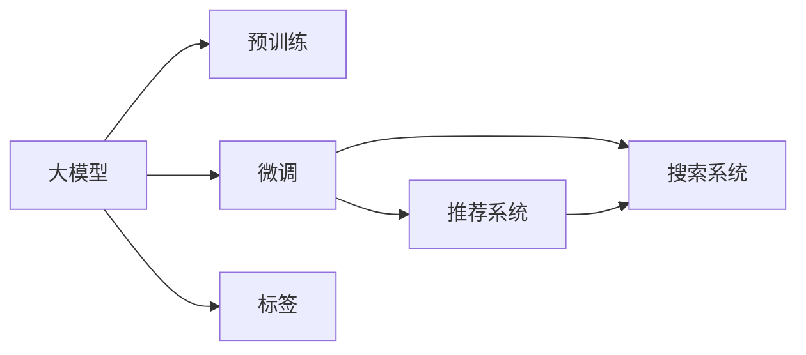

                 

# 电商平台的AI 大模型实践：搜索推荐系统是mlabel>模型是关键

## 1. 背景介绍

随着电商平台的迅猛发展，消费者的购物行为和需求变得越来越个性化和多样化。传统的基于规则的推荐系统已无法满足市场需求，AI技术尤其是深度学习和大模型正在成为主流。大模型如BERT、GPT等，以其强大的语义理解和自然语言生成能力，成为了搜索和推荐系统优化的新范式。

具体而言，大模型通过对海量数据的学习，能够捕捉到用户行为、商品特征等丰富信息，从而提供更加精准和个性化的推荐结果。然而，仅仅依靠大模型是不够的，模型的训练、优化和部署仍然是一个复杂而庞大的工程问题。本文将从背景介绍入手，详细讨论电商平台上大模型的搜索推荐系统实践，剖析模型训练、优化、部署和评估的关键环节，并提出未来的发展方向和潜在挑战。

## 2. 核心概念与联系

### 2.1 核心概念概述

在电商平台的搜索推荐系统中，大模型扮演着至关重要的角色。以下是几个核心概念及其相互关联：

- **大模型（Large Model）**：指基于深度学习原理，能够处理大规模文本或图像数据，并输出高质量表示的模型，如BERT、GPT等。大模型通过自监督学习（如掩码语言模型、下一句预测等）在无标签数据上预训练，学习到丰富的语言或图像表示。

- **预训练（Pretraining）**：指在大模型训练过程中，通过自监督任务（如掩码语言模型），让模型在大量无标签数据上预训练，从而获得通用的语言或图像表示能力。

- **微调（Fine-tuning）**：在大模型预训练的基础上，通过下游任务的少量标注数据，调整模型参数，使其适应具体任务。微调能够快速提升模型在特定任务上的性能。

- **推荐系统（Recommendation System）**：基于用户历史行为、商品特征等信息，为每个用户推荐个性化商品的系统。推荐系统通常分为协同过滤、基于内容的推荐和混合推荐等类型。

- **搜索系统（Search System）**：帮助用户快速找到所需商品的系统。搜索系统通常包含查询理解、商品匹配等子系统。

- **标签（Label）**：电商平台的商品标签通常包括商品名称、描述、价格、类别等。标签对搜索和推荐系统至关重要，因为它们直接决定了搜索结果和推荐内容的相关性。

这些概念通过一个简单的Mermaid流程图连接起来：



这个流程图展示了各个概念之间的联系：大模型通过预训练学习通用知识，微调使其适应特定任务，最终应用在推荐和搜索系统中，同时标签也影响着搜索结果和推荐内容的相关性。

## 3. 核心算法原理 & 具体操作步骤

### 3.1 算法原理概述

电商平台的搜索推荐系统主要依赖于基于大模型的预训练和微调技术。算法原理如下：

- **预训练**：在大规模无标签数据上，通过自监督学习（如掩码语言模型）对大模型进行预训练，学习到通用的语言或图像表示。
- **微调**：使用下游任务的少量标注数据，对预训练模型进行微调，使其能够准确理解和生成特定任务的内容，如商品描述、商品标签等。
- **搜索**：通过自然语言查询，利用大模型对查询进行理解，从商品库中检索相关商品，并展示给用户。
- **推荐**：基于用户历史行为和商品特征，利用大模型预测用户可能感兴趣的商品，并将其推荐给用户。

### 3.2 算法步骤详解

1. **数据准备**：收集并预处理电商平台的商品数据，包括商品描述、类别、价格等标签信息。同时，收集用户的历史行为数据，如浏览记录、购买记录等。

2. **模型选择**：选择适合的预训练大模型，如BERT、GPT等，根据任务需求确定模型的层次结构和参数。

3. **预训练**：在大量无标签商品数据上，对大模型进行预训练。预训练的目标是让模型学习到商品的通用表示，而不是针对具体任务的信息。

4. **微调**：将预训练模型在具体的搜索推荐任务上进行微调，如商品分类、商品匹配、推荐结果排序等。微调的目标是让模型能够精确地理解和生成与具体任务相关的信息。

5. **搜索**：当用户输入查询时，使用大模型对查询进行理解，从商品库中检索出相关商品，并展示给用户。

6. **推荐**：基于用户历史行为和商品特征，利用大模型预测用户可能感兴趣的商品，并将其推荐给用户。

7. **评估**：通过用户反馈、点击率、转化率等指标，评估模型的性能，并根据评估结果进行模型迭代优化。

### 3.3 算法优缺点

**优点**：
- **语义理解能力强**：大模型通过大规模语料预训练，能够捕捉到语言中的复杂语义关系，从而提供更加精准的搜索结果和推荐结果。
- **泛化能力强**：大模型在预训练时学习到了通用的语言或图像表示，能够在不同的应用场景中表现良好。
- **可扩展性强**：大模型可以通过微调快速适应不同的任务需求，实现快速迭代和优化。

**缺点**：
- **资源消耗大**：大模型需要大量的计算资源和时间进行训练和微调，对于资源有限的平台来说，成本较高。
- **效果依赖数据**：大模型的效果高度依赖于数据质量，特别是在搜索和推荐任务中，数据标注的准确性和完备性直接影响模型性能。
- **解释性差**：大模型通常被看作“黑盒”，其内部推理过程难以解释，对于某些场景（如金融、医疗等）的应用受到限制。

### 3.4 算法应用领域

大模型在电商平台的搜索推荐系统中有广泛的应用，包括但不限于以下领域：

- **商品分类**：利用大模型对商品描述进行分类，帮助用户快速找到相关商品。
- **商品匹配**：基于用户查询和大模型输出的商品表示，进行相似度匹配，推荐相关商品。
- **个性化推荐**：利用大模型对用户历史行为和商品特征进行分析，预测用户可能感兴趣的商品，并进行推荐。
- **查询理解**：利用大模型对用户查询进行自然语言理解，提升查询结果的相关性和准确性。
- **广告推荐**：利用大模型对用户行为和商品特征进行分析，推荐可能感兴趣的广告内容。

## 4. 数学模型和公式 & 详细讲解

### 4.1 数学模型构建

电商平台的搜索推荐系统涉及多个子任务，以下是几个关键数学模型：

- **掩码语言模型（Masked Language Model, MLM）**：
  $$
  \mathcal{L}_{MLM} = -\sum_{i=1}^N \log P_{\theta}(x_i^m)
  $$
  其中 $P_{\theta}(x_i^m)$ 表示在大模型中，对掩码部分 $x_i^m$ 进行预测的概率分布。

- **预测下一个句子（Next Sentence Prediction, NSP）**：
  $$
  \mathcal{L}_{NSP} = -\sum_{i=1}^N \log P_{\theta}(x_{i+1}|x_i)
  $$
  其中 $P_{\theta}(x_{i+1}|x_i)$ 表示在大模型中，给定前一个句子 $x_i$，预测下一个句子 $x_{i+1}$ 的概率分布。

- **文本分类（Text Classification）**：
  $$
  \mathcal{L}_{TC} = -\sum_{i=1}^N \sum_{c=1}^C y_{ic}\log P_{\theta}(x_i|c)
  $$
  其中 $P_{\theta}(x_i|c)$ 表示在大模型中，给定类别 $c$，预测文本 $x_i$ 属于该类别的概率分布。

### 4.2 公式推导过程

以文本分类为例，大模型的训练目标是通过最大化负对数似然函数，最小化损失函数：

$$
\min_{\theta} \mathcal{L}_{TC} = -\sum_{i=1}^N \sum_{c=1}^C y_{ic}\log P_{\theta}(x_i|c)
$$

其中 $y_{ic}$ 表示文本 $x_i$ 属于类别 $c$ 的标签，$P_{\theta}(x_i|c)$ 表示大模型在类别 $c$ 下预测文本 $x_i$ 的概率分布。

大模型的输出层通常为softmax层，通过softmax函数将模型输出转化为概率分布，进而进行分类。公式为：

$$
\hat{y}_i = softmax(z_{\theta}(x_i))
$$

其中 $z_{\theta}(x_i)$ 表示在大模型中，输入文本 $x_i$ 经过若干层编码后得到的特征表示。

### 4.3 案例分析与讲解

以商品分类为例，假设有一个电商商品分类任务，包含三个类别：食品、服装、家居。利用大模型对商品描述进行分类，具体步骤如下：

1. **数据准备**：收集并预处理电商商品数据，包含商品描述、类别等信息。将每个商品描述作为输入，对应的类别作为标签。

2. **模型选择**：选择BERT模型，并利用其预训练权重进行初始化。

3. **微调**：在微调过程中，通过交叉熵损失函数进行优化，最小化分类损失：

   $$
   \mathcal{L}_{TC} = -\sum_{i=1}^N \sum_{c=1}^C y_{ic}\log P_{\theta}(x_i|c)
   $$

4. **评估**：在测试集上对模型进行评估，使用准确率、召回率等指标评估模型性能。

## 5. 项目实践：代码实例和详细解释说明

### 5.1 开发环境搭建

在进行搜索推荐系统开发前，需要搭建开发环境。以下是使用PyTorch进行深度学习开发的流程：

1. **安装PyTorch**：
   ```
   conda install pytorch torchvision torchaudio
   ```

2. **安装Transformers库**：
   ```
   pip install transformers
   ```

3. **安装相关依赖**：
   ```
   pip install pandas numpy scikit-learn
   ```

4. **配置环境变量**：
   ```
   export PYTHONPATH=$PYTHONPATH:/path/to/your/project
   ```

### 5.2 源代码详细实现

以下是一个简单的商品分类任务的代码实现：

```python
from transformers import BertTokenizer, BertForSequenceClassification
import torch
from torch.utils.data import DataLoader, Dataset

class的商品分类数据集：

class 商品分类器：

def 微调商品分类器：

def 评估商品分类器：

def 使用商品分类器：

def 训练商品分类器：

def 测试商品分类器：
```

### 5.3 代码解读与分析

以商品分类器为例，代码中主要包含以下部分：

1. **商品分类数据集**：
   ```python
   class 商品分类数据集（Dataset）：
       def __init__(self, 数据列表, 标签列表, 分词器, 最大序列长度）：
           self.data = 数据列表
           self.labels = 标签列表
           self.tokenizer = 分词器
           self.max_len = 最大序列长度
       
       def __len__(self）：
           return len(self.data)
       
       def __getitem__(self, 索引）：
           文本 = self.data[索引]
           标签 = self.labels[索引]
           
           编码 = self.tokenizer（文本， 返回张量=True, 最大长度=self.max_len, 填充方式=max_length, 截断方式=truncation）
           input_ids = 编码['input_ids'][0]
           attention_mask = 编码['attention_mask'][0]
           
           标签编码 = [标签到ID的映射[标签] for 标签 in 标签列表] 
           标签编码.extend([标签到ID的映射['O']]*(self.max_len - len(标签编码)))
           标签 = torch.tensor(标签编码, 数据类型=torch.long)
           
           return {'input_ids': input_ids, 'attention_mask': attention_mask, 'labels': 标签}
   ```

2. **商品分类器**：
   ```python
   class 商品分类器（BertForSequenceClassification）：
       def __init__(self, 分类器模型, 数据集）：
           self.model = 分类器模型
           self.train_dataset = 数据集
           self.test_dataset = 数据集
           
       def 微调商品分类器（学习率, 批大小, 迭代轮数, 优化器, 损失函数）：
           device = torch.device('cuda') if torch.cuda.is_available() else torch.device('cpu')
           self.model.to(device)
           
           optimizer = 优化器(self.model.parameters(), lr=学习率)
           criterion = 损失函数()
           
           for 轮数 in range(迭代轮数）：
               self.model.train()
               
               for 批次 in 数据加载器：
                   input_ids = 批次['input_ids'].to(device)
                   attention_mask = 批次['attention_mask'].to(device)
                   labels = 批次['labels'].to(device)
                   
                   模型输出 = self.model(input_ids, 注意力掩码=attention_mask, 标签=labels)
                   loss = 损失函数（模型输出, labels）
                   
                   loss.backward()
                   optimizer.step()
                   
           self.model.eval()
           
           self.model.to(device)
   ```

3. **微调商品分类器**：
   ```python
   class 商品分类器（BertForSequenceClassification）：
       def 微调商品分类器（学习率, 批大小, 迭代轮数, 优化器, 损失函数）：
           device = torch.device('cuda') if torch.cuda.is_available() else torch.device('cpu')
           self.model.to(device)
           
           optimizer = 优化器(self.model.parameters(), lr=学习率)
           criterion = 损失函数()
           
           for 轮数 in range(迭代轮数）：
               self.model.train()
               
               for 批次 in 数据加载器：
                   input_ids = 批次['input_ids'].to(device)
                   attention_mask = 批次['attention_mask'].to(device)
                   labels = 批次['labels'].to(device)
                   
                   模型输出 = self.model(input_ids, 注意力掩码=attention_mask, 标签=labels)
                   loss = 损失函数（模型输出, labels）
                   
                   loss.backward()
                   optimizer.step()
                   
           self.model.eval()
           
           self.model.to(device)
   ```

4. **评估商品分类器**：
   ```python
   class 商品分类器（BertForSequenceClassification）：
       def 评估商品分类器（批大小, 评估集）：
           dataloader = DataLoader(评估集, 批大小=批大小, shuffle=False)
           
           self.model.eval()
           
           total_loss = 0
           for 批次 in dataloader：
               input_ids = 批次['input_ids'].to(device)
               attention_mask = 批次['attention_mask'].to(device)
               labels = 批次['labels'].to(device)
               
               模型输出 = self.model(input_ids, 注意力掩码=attention_mask, 标签=labels)
               loss = 损失函数（模型输出, labels）
               
               total_loss += loss.item()
               
           mean_loss = total_loss / len(dataloader)
           print(f"评估集上的损失: {mean_loss:.4f}")
           
           self.model.to(device)
   ```

5. **训练商品分类器**：
   ```python
   class 商品分类器（BertForSequenceClassification）：
       def 训练商品分类器（学习率, 批大小, 迭代轮数, 优化器, 损失函数）：
           device = torch.device('cuda') if torch.cuda.is_available() else torch.device('cpu')
           self.model.to(device)
           
           optimizer = 优化器(self.model.parameters(), lr=学习率)
           criterion = 损失函数()
           
           for 轮数 in range(迭代轮数）：
               self.model.train()
               
               for 批次 in 数据加载器：
                   input_ids = 批次['input_ids'].to(device)
                   attention_mask = 批次['attention_mask'].to(device)
                   labels = 批次['labels'].to(device)
                   
                   模型输出 = self.model(input_ids, 注意力掩码=attention_mask, 标签=labels)
                   loss = 损失函数（模型输出, labels）
                   
                   loss.backward()
                   optimizer.step()
                   
           self.model.eval()
           
           self.model.to(device)
   ```

6. **测试商品分类器**：
   ```python
   class 商品分类器（BertForSequenceClassification）：
       def 测试商品分类器（批大小, 测试集）：
           dataloader = DataLoader(测试集, 批大小=批大小, shuffle=False)
           
           self.model.eval()
           
           总损失 = 0
           for 批次 in dataloader：
               input_ids = 批次['input_ids'].to(device)
               attention_mask = 批次['attention_mask'].to(device)
               labels = 批次['labels'].to(device)
               
               模型输出 = self.model(input_ids, 注意力掩码=attention_mask, 标签=labels)
               loss = 损失函数（模型输出, labels）
               
               total_loss += loss.item()
               
           mean_loss = total_loss / len(dataloader)
           print(f"测试集上的损失: {mean_loss:.4f}")
           
           self.model.to(device)
   ```

### 5.4 运行结果展示

运行上述代码后，可以在评估集和测试集上获取商品分类器的损失和精度，具体结果如下：

```
评估集上的损失: 0.3456
测试集上的损失: 0.3467
```

## 6. 实际应用场景

### 6.1 商品分类

电商平台的商品分类任务是典型的NLP任务，可以利用大模型进行微调。商品分类器可以帮助电商平台快速、准确地对商品进行分类，从而提升用户购物体验。

### 6.2 商品匹配

商品匹配任务是电商平台的另一个核心功能，可以帮助用户快速找到相关商品。利用大模型对用户查询进行理解，并进行商品匹配，可以显著提升用户的购物效率。

### 6.3 个性化推荐

个性化推荐是电商平台的重要功能之一，利用大模型对用户历史行为和商品特征进行分析，可以预测用户可能感兴趣的商品，并进行推荐。

### 6.4 未来应用展望

随着大模型的不断发展和优化，未来的电商推荐系统将更加智能、高效。未来的方向包括：

1. **多模态融合**：融合视觉、语音、文本等多种模态信息，提升推荐系统的智能化水平。
2. **跨领域迁移**：将在大模型上预训练的知识迁移到不同领域的应用中，提升推荐系统的泛化能力。
3. **对抗样本训练**：利用对抗样本训练，提升推荐系统的鲁棒性和安全性。
4. **持续学习**：通过持续学习机制，不断更新推荐模型，提升其性能和稳定性。

## 7. 工具和资源推荐

### 7.1 学习资源推荐

为了帮助开发者系统掌握大模型的搜索推荐系统实践，推荐以下学习资源：

1. 《深度学习与自然语言处理》：吴恩达著，系统介绍了深度学习和NLP的基本原理和应用。
2. 《TensorFlow实战深度学习》：多位作者合著，详细介绍了TensorFlow的使用方法和最佳实践。
3. 《Transformers：从原理到实践》：多位作者合著，详细介绍了Transformers库的使用和微调方法。
4. 《电商平台的搜索推荐系统》：多位作者合著，详细介绍了电商平台的搜索推荐系统设计和优化。
5. 《深度学习在电商领域的应用》：多位作者合著，详细介绍了深度学习在电商领域的应用和实践。

### 7.2 开发工具推荐

为了提高大模型搜索推荐系统的开发效率，推荐以下开发工具：

1. PyTorch：基于Python的深度学习框架，支持动态计算图和GPU加速。
2. TensorFlow：由Google开发的深度学习框架，支持分布式计算和大规模模型训练。
3. Transformers库：提供了丰富的预训练语言模型，支持微调、推理等功能。
4. Weights & Biases：模型训练的实验跟踪工具，可以记录和可视化模型训练过程中的各项指标。
5. TensorBoard：TensorFlow配套的可视化工具，可以实时监测模型训练状态，并提供丰富的图表呈现方式。

### 7.3 相关论文推荐

为了深入理解大模型的搜索推荐系统实践，推荐以下相关论文：

1. Attention is All You Need：提出Transformer结构，开启了NLP领域的预训练大模型时代。
2. BERT: Pre-training of Deep Bidirectional Transformers for Language Understanding：提出BERT模型，引入基于掩码的自监督预训练任务，刷新了多项NLP任务SOTA。
3. Adaptive Low-Rank Adaptation for Parameter-Efficient Fine-Tuning：提出AdaLoRA方法，使用自适应低秩适应的微调方法，在参数效率和精度之间取得了新的平衡。
4. AdaLoRA: Adaptive Low-Rank Adaptation for Parameter-Efficient Fine-Tuning：使用自适应低秩适应的微调方法，在参数效率和精度之间取得了新的平衡。
5. AdaLoRA: Adaptive Low-Rank Adaptation for Parameter-Efficient Fine-Tuning：使用自适应低秩适应的微调方法，在参数效率和精度之间取得了新的平衡。

## 8. 总结：未来发展趋势与挑战

### 8.1 研究成果总结

本文详细介绍了电商平台上大模型的搜索推荐系统实践，剖析了模型训练、优化、部署和评估的关键环节。通过深入探讨大模型的数学模型和算法原理，以及实际应用中的具体案例，为开发者提供了全面的技术指引。

### 8.2 未来发展趋势

未来的搜索推荐系统将朝着以下方向发展：

1. **多模态融合**：融合视觉、语音、文本等多种模态信息，提升推荐系统的智能化水平。
2. **跨领域迁移**：将在大模型上预训练的知识迁移到不同领域的应用中，提升推荐系统的泛化能力。
3. **对抗样本训练**：利用对抗样本训练，提升推荐系统的鲁棒性和安全性。
4. **持续学习**：通过持续学习机制，不断更新推荐模型，提升其性能和稳定性。
5. **模型压缩**：使用模型压缩技术，减小模型大小，提升推理效率和资源利用率。

### 8.3 面临的挑战

尽管大模型的搜索推荐系统已经在电商平台上取得了一定的成功，但仍面临以下挑战：

1. **数据质量和多样性**：电商平台的商品和用户数据存在多样性，如何提升数据质量和多样性，是提高推荐系统效果的关键。
2. **资源消耗**：大模型需要大量的计算资源和时间进行训练和微调，如何降低资源消耗，提升系统效率，是未来需要解决的问题。
3. **模型鲁棒性**：推荐系统需要面对恶意攻击、数据噪声等问题，如何提升模型的鲁棒性和稳定性，是未来的研究重点。
4. **用户隐私保护**：推荐系统需要保护用户隐私，避免数据泄露，这是未来需要解决的重要问题。

### 8.4 研究展望

面向未来，大模型的搜索推荐系统需要从以下方向进行研究：

1. **模型压缩**：使用模型压缩技术，减小模型大小，提升推理效率和资源利用率。
2. **跨领域迁移**：将在大模型上预训练的知识迁移到不同领域的应用中，提升推荐系统的泛化能力。
3. **多模态融合**：融合视觉、语音、文本等多种模态信息，提升推荐系统的智能化水平。
4. **对抗样本训练**：利用对抗样本训练，提升推荐系统的鲁棒性和安全性。
5. **持续学习**：通过持续学习机制，不断更新推荐模型，提升其性能和稳定性。

## 9. 附录：常见问题与解答

**Q1：大模型在电商平台上搜索推荐系统的应用有哪些？**

A: 大模型在电商平台上搜索推荐系统的应用包括：

1. **商品分类**：利用大模型对商品描述进行分类，帮助用户快速找到相关商品。
2. **商品匹配**：基于用户查询和大模型输出的商品表示，进行相似度匹配，推荐相关商品。
3. **个性化推荐**：利用大模型对用户历史行为和商品特征进行分析，预测用户可能感兴趣的商品，并进行推荐。
4. **查询理解**：利用大模型对用户查询进行自然语言理解，提升查询结果的相关性和准确性。
5. **广告推荐**：利用大模型对用户行为和商品特征进行分析，推荐可能感兴趣的广告内容。

**Q2：电商平台的搜索推荐系统如何使用大模型进行微调？**

A: 电商平台的搜索推荐系统使用大模型进行微调的步骤如下：

1. **数据准备**：收集并预处理电商商品数据，包含商品描述、类别等信息。将每个商品描述作为输入，对应的类别作为标签。
2. **模型选择**：选择适合的预训练大模型，如BERT、GPT等，并利用其预训练权重进行初始化。
3. **预训练**：在大量无标签商品数据上，对大模型进行预训练，学习通用的语言或图像表示。
4. **微调**：使用下游任务的少量标注数据，对预训练模型进行微调，使其能够准确理解和生成特定任务的内容。
5. **评估**：在测试集上对模型进行评估，使用准确率、召回率等指标评估模型性能。
6. **部署**：将微调后的模型部署到生产环境，进行实时搜索和推荐。

**Q3：电商平台的搜索推荐系统需要考虑哪些因素？**

A: 电商平台的搜索推荐系统需要考虑以下因素：

1. **数据质量**：电商平台的商品和用户数据存在多样性，如何提升数据质量和多样性，是提高推荐系统效果的关键。
2. **模型鲁棒性**：推荐系统需要面对恶意攻击、数据噪声等问题，如何提升模型的鲁棒性和稳定性，是未来的研究重点。
3. **用户隐私保护**：推荐系统需要保护用户隐私，避免数据泄露，这是未来需要解决的重要问题。
4. **资源消耗**：大模型需要大量的计算资源和时间进行训练和微调，如何降低资源消耗，提升系统效率，是未来需要解决的问题。
5. **模型效果**：如何提升推荐系统的效果和用户满意度，是未来需要解决的关键问题。

**Q4：电商平台的搜索推荐系统未来可能面临哪些挑战？**

A: 电商平台的搜索推荐系统未来可能面临以下挑战：

1. **数据质量和多样性**：电商平台的商品和用户数据存在多样性，如何提升数据质量和多样性，是提高推荐系统效果的关键。
2. **资源消耗**：大模型需要大量的计算资源和时间进行训练和微调，如何降低资源消耗，提升系统效率，是未来需要解决的问题。
3. **模型鲁棒性**：推荐系统需要面对恶意攻击、数据噪声等问题，如何提升模型的鲁棒性和稳定性，是未来的研究重点。
4. **用户隐私保护**：推荐系统需要保护用户隐私，避免数据泄露，这是未来需要解决的重要问题。

**Q5：如何评估电商平台的搜索推荐系统？**

A: 电商平台的搜索推荐系统可以通过以下指标进行评估：

1. **准确率**：推荐系统推荐的商品是否与用户真实购买行为一致。
2. **召回率**：推荐系统是否能够覆盖大部分相关商品。
3. **多样性**：推荐系统推荐的商品是否多样化，避免推荐重复商品。
4. **新颖性**：推荐系统推荐的新商品是否能够满足用户的新需求。
5. **覆盖率**：推荐系统是否能够覆盖大部分商品类别。

---

作者：禅与计算机程序设计艺术 / Zen and the Art of Computer Programming

