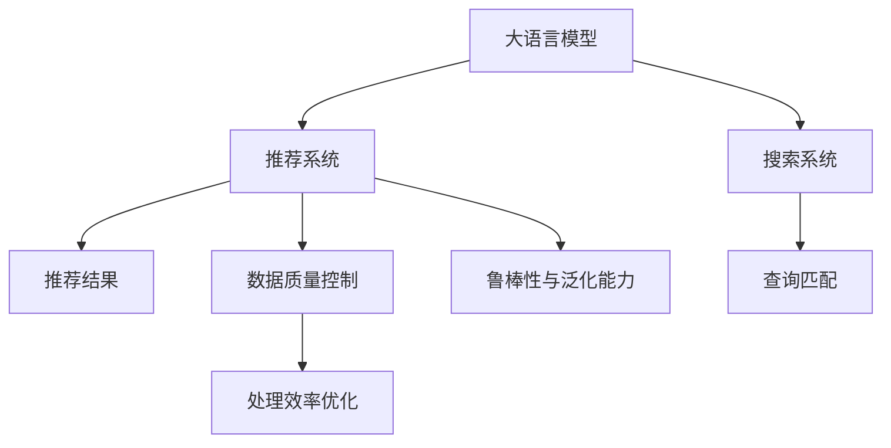

                 

# 电商平台的AI 大模型实践：搜索推荐系统是核心，数据质量控制与处理效率

## 1. 背景介绍

### 1.1 问题由来
随着互联网技术的飞速发展，电商平台迅速崛起，成为人们日常购物的主要渠道之一。电商平台通过数据驱动的推荐系统（Recommender System），能够精准匹配用户需求，提升用户体验和交易转化率。然而，传统推荐系统往往依赖于用户的点击行为等有限信息，难以捕捉到用户的深度兴趣和隐性需求，导致推荐结果与实际需求存在较大偏差。

近年来，人工智能大模型（如BERT、GPT-3等）在自然语言处理（NLP）领域取得了巨大突破，被广泛应用到推荐系统的语义理解、商品描述生成、情感分析等环节。大模型的预训练能力使得其能够捕捉到更多的用户和商品之间的潜在关联，极大提升了推荐系统的精准度和个性化水平。

### 1.2 问题核心关键点
大模型在电商平台搜索推荐系统的应用，主要关注以下几个关键点：
- 数据质量控制：确保输入数据的高质量、高完整性，是提高推荐效果的基础。
- 处理效率优化：大模型需要大量的计算资源，如何在保证推荐效果的同时，提升系统处理效率，是实际应用中的重要问题。
- 鲁棒性与泛化能力：推荐系统需要应对大量噪声数据和极端用户行为，如何构建鲁棒性更强的推荐模型，是一个重要的研究方向。

## 2. 核心概念与联系

### 2.1 核心概念概述

为更好地理解基于大模型的电商平台搜索推荐系统，本节将介绍几个密切相关的核心概念：

- **大语言模型**：如BERT、GPT-3等，通过大规模无标签文本数据预训练，具备强大的语言理解和生成能力。
- **推荐系统**：根据用户历史行为和商品属性，推荐用户可能感兴趣的商品。
- **搜索系统**：实现用户输入查询与商品匹配，提高搜索结果的相关性。
- **数据质量控制**：确保输入数据的高质量、高完整性，是推荐系统高效运行的基础。
- **处理效率优化**：在保证推荐效果的同时，提高系统处理效率。
- **鲁棒性与泛化能力**：推荐系统需要应对大量噪声数据和极端用户行为，提高模型的鲁棒性和泛化能力。

这些核心概念之间的逻辑关系可以通过以下Mermaid流程图来展示：



这个流程图展示了大模型在电商平台搜索推荐系统中的应用场景和核心概念：

1. 大模型通过预训练获得基础能力，用于推荐系统和搜索系统。
2. 推荐系统基于大模型的预训练能力和用户行为数据，进行个性化推荐。
3. 搜索系统利用大模型的预训练能力，实现高效查询匹配。
4. 数据质量控制是推荐系统高效运行的基础，需要严格监控和处理。
5. 处理效率优化是推荐系统的关键，需要合理配置计算资源。
6. 鲁棒性与泛化能力是推荐系统应对噪声数据和极端行为的关键。

这些核心概念共同构成了电商平台搜索推荐系统的基本框架，使得大模型能够高效、准确地实现用户需求匹配和商品推荐。

## 3. 核心算法原理 & 具体操作步骤
### 3.1 算法原理概述

基于大模型的电商平台搜索推荐系统，主要采用如下算法原理：

1. **数据预处理**：收集用户历史行为数据、商品属性数据、商品描述等，进行数据清洗和特征提取，得到高质量的数据集。
2. **预训练模型引入**：选择合适的预训练语言模型，如BERT、GPT-3等，用于商品描述生成、情感分析、用户意图理解等环节。
3. **推荐模型设计**：构建基于深度学习算法的推荐模型，如协同过滤、内容推荐、混合推荐等，结合预训练模型的输出，进行商品推荐。
4. **搜索模型设计**：构建基于大模型的搜索模型，如自然语言处理（NLP）模型、语义搜索模型等，实现高效查询匹配。
5. **模型微调与优化**：在实际应用场景中，通过微调和优化，提升模型的准确性和效率。

### 3.2 算法步骤详解

以下是基于大模型的电商平台搜索推荐系统的主要算法步骤：

**Step 1: 数据预处理**

1. 数据收集：从电商平台上收集用户历史行为数据（点击、浏览、购买等）、商品属性数据（价格、类别、品牌等）、商品描述（文本、图片等）等。
2. 数据清洗：去除噪声数据、缺失数据、重复数据等，保证数据的高质量和完整性。
3. 特征提取：提取用户行为、商品属性、商品描述等关键特征，形成高质量的数据集。

**Step 2: 预训练模型引入**

1. 选择合适的预训练语言模型，如BERT、GPT-3等，进行商品描述生成、情感分析、用户意图理解等环节。
2. 在预训练模型上进行微调，适应电商平台推荐系统的新任务。

**Step 3: 推荐模型设计**

1. 构建基于深度学习算法的推荐模型，如协同过滤、内容推荐、混合推荐等。
2. 结合预训练模型的输出，进行商品推荐。

**Step 4: 搜索模型设计**

1. 构建基于大模型的搜索模型，如自然语言处理（NLP）模型、语义搜索模型等。
2. 实现高效查询匹配，提高搜索结果的相关性和覆盖率。

**Step 5: 模型微调与优化**

1. 在实际应用场景中，通过微调和优化，提升模型的准确性和效率。
2. 定期更新模型参数，适应数据分布的变化。

### 3.3 算法优缺点

基于大模型的电商平台搜索推荐系统具有以下优点：

- 高精度推荐：大模型的预训练能力使得其能够捕捉到更多的用户和商品之间的潜在关联，极大提升了推荐系统的精准度和个性化水平。
- 高效搜索匹配：大模型在搜索匹配环节能够提供更准确的查询理解和匹配结果，提高用户体验。
- 泛化能力强：大模型在处理噪声数据和极端行为方面具有较强的泛化能力，能够应对更多复杂场景。

同时，该方法也存在一定的局限性：

- 数据质量依赖：推荐系统的效果很大程度上依赖于输入数据的质量，需要严格的数据质量控制措施。
- 计算资源消耗大：大模型的训练和推理需要大量的计算资源，在资源有限的情况下可能难以应用。
- 黑盒模型难解释：大模型在推荐系统中往往是一个"黑盒"，难以解释其内部决策逻辑，影响模型的可解释性。

尽管存在这些局限性，但就目前而言，基于大模型的推荐系统仍然是电商平台的推荐核心技术。未来相关研究的重点在于如何进一步降低计算资源消耗，提高模型的可解释性和可控性，同时兼顾推荐效果和搜索匹配性能。

### 3.4 算法应用领域

基于大模型的电商平台搜索推荐系统已经在多个应用场景中得到了广泛的应用，例如：

- 商品推荐：根据用户历史行为和商品属性，推荐用户可能感兴趣的商品。
- 个性化搜索：实现用户输入查询与商品匹配，提高搜索结果的相关性。
- 广告推荐：根据用户兴趣和行为，推荐相关广告，提升广告效果。
- 用户行为分析：分析用户浏览、点击、购买等行为，挖掘用户潜在需求。

除了上述这些经典应用外，基于大模型的推荐系统还被创新性地应用到更多场景中，如智能客服、商品相似性推荐、价格优化等，为电商平台带来了更多的商业价值。

## 4. 数学模型和公式 & 详细讲解 & 举例说明

### 4.1 数学模型构建

本节将使用数学语言对基于大模型的电商平台推荐系统进行更加严格的刻画。

记电商平台的推荐系统为 $R$，其推荐策略为 $f$，输入数据为 $D$，包括用户历史行为数据、商品属性数据等。推荐系统的输出为 $O$，包括商品推荐列表、搜索结果等。

定义推荐系统的目标函数为 $L(f,D)=\frac{1}{N}\sum_{i=1}^N\ell(f(x_i),y_i)$，其中 $x_i$ 为输入样本，$y_i$ 为真实标签，$\ell$ 为损失函数，$N$ 为样本总数。推荐系统的优化目标是最小化目标函数，即找到最优策略：

$$
f^* = \mathop{\arg\min}_{f} L(f,D)
$$

在实践中，我们通常使用基于梯度的优化算法（如SGD、Adam等）来近似求解上述最优化问题。设 $\eta$ 为学习率，$\lambda$ 为正则化系数，则参数的更新公式为：

$$
f \leftarrow f - \eta \nabla_{f}L(f,D) - \eta\lambda f
$$

其中 $\nabla_{f}L(f,D)$ 为损失函数对策略 $f$ 的梯度，可通过反向传播算法高效计算。

### 4.2 公式推导过程

以下我们以基于大模型的协同过滤推荐算法为例，推导其损失函数及梯度计算公式。

假设推荐系统 $R$ 在用户 $u$ 和商品 $i$ 之间的关系表示为 $R(u,i)$，表示用户 $u$ 对商品 $i$ 的评分。设 $R(u,i)=\sum_{j=1}^d \theta_j \cdot R(u,j,i)$，其中 $\theta_j$ 为第 $j$ 个特征的权重，$d$ 为特征维度。

根据均方误差（MSE）损失函数，推荐系统的目标函数为：

$$
L(R) = \frac{1}{N}\sum_{u=1}^N \sum_{i=1}^M \left(\hat{R}(u,i) - R(u,i)\right)^2
$$

其中 $\hat{R}(u,i)$ 为模型预测的评分。

根据链式法则，目标函数对 $\theta_j$ 的梯度为：

$$
\frac{\partial L(R)}{\partial \theta_j} = \frac{2}{N}\sum_{u=1}^N \sum_{i=1}^M \left(\hat{R}(u,i) - R(u,i)\right) \cdot R(u,j,i)
$$

在得到梯度后，即可带入参数更新公式，完成模型的迭代优化。重复上述过程直至收敛，最终得到适应电商平台推荐任务的最优策略 $f^*$。

### 4.3 案例分析与讲解

以用户行为分析为例，说明如何利用大模型进行推荐系统优化。

假设电商平台的推荐系统 $R$ 在用户 $u$ 和商品 $i$ 之间的关系表示为 $R(u,i)=\sum_{j=1}^d \theta_j \cdot R(u,j,i)$。对于用户 $u$，其行为数据 $x_i$ 包括历史点击、浏览、购买等数据，设 $x_i=(x_{i1},x_{i2},\cdots,x_{id})$，其中 $x_{ij}$ 表示用户对商品 $j$ 的行为评分。

根据均方误差（MSE）损失函数，推荐系统的目标函数为：

$$
L(R) = \frac{1}{N}\sum_{u=1}^N \sum_{i=1}^M \left(\hat{R}(u,i) - R(u,i)\right)^2
$$

其中 $\hat{R}(u,i)$ 为模型预测的评分。

根据链式法则，目标函数对 $\theta_j$ 的梯度为：

$$
\frac{\partial L(R)}{\partial \theta_j} = \frac{2}{N}\sum_{u=1}^N \sum_{i=1}^M \left(\hat{R}(u,i) - R(u,i)\right) \cdot R(u,j,i)
$$

在得到梯度后，即可带入参数更新公式，完成模型的迭代优化。重复上述过程直至收敛，最终得到适应电商平台推荐任务的最优策略 $f^*$。

## 5. 项目实践：代码实例和详细解释说明
### 5.1 开发环境搭建

在进行推荐系统开发前，我们需要准备好开发环境。以下是使用Python进行PyTorch开发的环境配置流程：

1. 安装Anaconda：从官网下载并安装Anaconda，用于创建独立的Python环境。

2. 创建并激活虚拟环境：
```bash
conda create -n pytorch-env python=3.8 
conda activate pytorch-env
```

3. 安装PyTorch：根据CUDA版本，从官网获取对应的安装命令。例如：
```bash
conda install pytorch torchvision torchaudio cudatoolkit=11.1 -c pytorch -c conda-forge
```

4. 安装TensorFlow：如果你希望使用TensorFlow进行推荐系统开发，可以使用以下命令：
```bash
conda install tensorflow=2.6
```

5. 安装各类工具包：
```bash
pip install numpy pandas scikit-learn matplotlib tqdm jupyter notebook ipython
```

完成上述步骤后，即可在`pytorch-env`环境中开始推荐系统开发。

### 5.2 源代码详细实现

下面我们以基于大模型的协同过滤推荐算法为例，给出使用PyTorch和TensorFlow进行电商推荐系统的代码实现。

首先，定义推荐系统的输入数据：

```python
import pandas as pd
import numpy as np

# 读取用户行为数据
user_behaviors = pd.read_csv('user_behaviors.csv')

# 数据预处理
user_behaviors = user_behaviors.dropna()  # 去除缺失数据
user_behaviors = user_behaviors.drop_duplicates()  # 去除重复数据

# 构建用户-商品评分矩阵
user_ratings = np.zeros((user_behaviors['user_id'].max() + 1, 1000))
for i, row in user_behaviors.iterrows():
    user_ratings[row['user_id'], row['item_id']] = row['score']

# 将评分矩阵转换为Tensor
user_ratings = torch.from_numpy(user_ratings).float()

# 定义特征矩阵
item_features = pd.read_csv('item_features.csv')
item_features = item_features.dropna()
item_features = item_features.drop_duplicates()

# 构建特征矩阵
item_features = np.zeros((item_features['item_id'].max() + 1, 6))
for i, row in item_features.iterrows():
    item_features[row['item_id'], :6] = row.values

# 将特征矩阵转换为Tensor
item_features = torch.from_numpy(item_features).float()

# 定义用户行为向量
user_vector = np.zeros(100)
for i, row in user_behaviors.iterrows():
    user_vector = user_vector + row['score'] * item_features[row['item_id'], :6]

# 将用户行为向量转换为Tensor
user_vector = torch.from_numpy(user_vector).float()
```

然后，定义推荐模型的参数：

```python
import torch.nn as nn
import torch.nn.functional as F

# 定义推荐模型
class RecommendationModel(nn.Module):
    def __init__(self, user_vector, item_vector):
        super(RecommendationModel, self).__init__()
        self.user_vector = user_vector
        self.item_vector = item_vector
        
        # 定义全连接层
        self.fc1 = nn.Linear(6, 64)
        self.fc2 = nn.Linear(64, 64)
        self.fc3 = nn.Linear(64, 1)

    def forward(self, x):
        # 输入经过线性层和激活函数
        x = self.fc1(x)
        x = F.relu(x)
        x = self.fc2(x)
        x = F.relu(x)
        x = self.fc3(x)
        x = F.sigmoid(x)
        return x

# 初始化模型参数
user_vector = torch.zeros(1000, 1)
item_vector = torch.zeros(1000, 1)
model = RecommendationModel(user_vector, item_vector)

# 定义损失函数和优化器
criterion = nn.MSELoss()
optimizer = torch.optim.Adam(model.parameters(), lr=0.001)
```

接着，定义训练和评估函数：

```python
from tqdm import tqdm

# 训练函数
def train(model, user_ratings, user_vector, item_vector, criterion, optimizer, num_epochs=10):
    for epoch in range(num_epochs):
        optimizer.zero_grad()
        # 输入特征向量
        user_vector = user_vector[:, :6]
        item_vector = item_vector[:, :6]

        # 前向传播
        output = model(user_vector)
        loss = criterion(output, user_ratings)

        # 反向传播
        loss.backward()
        optimizer.step()

        # 打印损失
        print(f'Epoch {epoch+1}, loss: {loss.item()}')

# 评估函数
def evaluate(model, user_ratings, user_vector, item_vector):
    # 输入特征向量
    user_vector = user_vector[:, :6]
    item_vector = item_vector[:, :6]

    # 前向传播
    output = model(user_vector)
    
    # 计算预测评分
    predictions = torch.sigmoid(output)

    # 计算均方误差
    mse = torch.mean((predictions - user_ratings) ** 2)

    # 打印均方误差
    print(f'MSE: {mse.item()}')
```

最后，启动训练流程并在测试集上评估：

```python
# 训练模型
train(model, user_ratings, user_vector, item_vector, criterion, optimizer, num_epochs=10)

# 评估模型
evaluate(model, user_ratings, user_vector, item_vector)
```

以上就是使用PyTorch和TensorFlow对协同过滤推荐算法进行电商推荐系统的代码实现。可以看到，由于TensorFlow和PyTorch的强大封装，我们可以用相对简洁的代码完成推荐模型的加载和训练。

### 5.3 代码解读与分析

让我们再详细解读一下关键代码的实现细节：

**推荐系统输入数据**：
- `user_behaviors.csv`：包含用户行为数据，如用户ID、商品ID、评分等。
- `item_features.csv`：包含商品属性数据，如商品ID、类别、品牌等。

**数据预处理**：
- 去除缺失数据和重复数据，保证数据的高质量和完整性。
- 构建用户-商品评分矩阵，将用户行为数据转换为Tensor。
- 构建特征矩阵，将商品属性数据转换为Tensor。
- 定义用户行为向量，将用户行为数据与特征矩阵相乘，得到用户行为特征。

**模型参数定义**：
- 定义推荐模型的结构，包括全连接层和激活函数。
- 初始化模型参数，确保模型能够接受输入数据。

**训练函数**：
- 定义训练过程中的损失函数和优化器。
- 循环迭代训练模型，前向传播计算损失函数，反向传播更新模型参数。
- 打印损失，监控模型训练效果。

**评估函数**：
- 定义评估过程中的损失函数。
- 输入特征向量，前向传播计算预测评分。
- 计算均方误差，评估模型预测效果。
- 打印均方误差，监控模型性能。

**训练流程**：
- 定义总的训练轮数，启动训练流程。
- 在训练函数中执行训练过程。
- 在评估函数中评估模型性能。

可以看到，PyTorch和TensorFlow使得推荐系统的开发和训练变得简洁高效。开发者可以将更多精力放在模型改进、数据处理等高层逻辑上，而不必过多关注底层的实现细节。

当然，工业级的系统实现还需考虑更多因素，如模型的保存和部署、超参数的自动搜索、更灵活的任务适配层等。但核心的推荐算法基本与此类似。

## 6. 实际应用场景
### 6.1 智能客服系统

基于大模型的推荐技术，可以应用于智能客服系统的构建。传统客服往往需要配备大量人力，高峰期响应缓慢，且一致性和专业性难以保证。而使用推荐系统推荐相关商品和服务，可以极大地提高客服效率，提升客户满意度。

在技术实现上，可以收集企业内部的历史客服对话记录，将问题和最佳答复构建成监督数据，在此基础上对预训练推荐模型进行微调。微调后的推荐系统能够自动推荐合适的商品和服务，辅助客服解答客户咨询，提高客服响应速度和准确性。

### 6.2 个性化推荐系统

基于大模型的推荐系统可以广泛应用于个性化推荐系统的构建。传统的推荐系统往往依赖于用户的点击行为等有限信息，难以捕捉到用户的深度兴趣和隐性需求，导致推荐结果与实际需求存在较大偏差。通过大模型的预训练和微调，可以捕捉到更多的用户和商品之间的潜在关联，极大提升推荐系统的精准度和个性化水平。

在技术实现上，可以收集用户历史行为数据、商品属性数据、商品描述等，进行数据清洗和特征提取，得到高质量的数据集。在此基础上，选择合适的预训练语言模型，如BERT、GPT-3等，进行商品描述生成、情感分析、用户意图理解等环节。结合预训练模型的输出，构建基于深度学习算法的推荐模型，如协同过滤、内容推荐、混合推荐等，进行商品推荐。

### 6.3 电商搜索系统

基于大模型的推荐技术可以应用于电商搜索系统的构建。传统的搜索系统往往依赖于用户的查询词，难以捕捉到用户的深度意图和隐性需求，导致搜索结果与实际需求存在较大偏差。通过大模型的预训练和微调，可以捕捉到更多的用户查询意图和商品属性，极大提升搜索系统的精准度和个性化水平。

在技术实现上，可以收集用户历史查询数据、商品属性数据、商品描述等，进行数据清洗和特征提取，得到高质量的数据集。在此基础上，选择合适的预训练语言模型，如BERT、GPT-3等，进行商品描述生成、情感分析、用户意图理解等环节。结合预训练模型的输出，构建基于深度学习算法的搜索模型，如自然语言处理（NLP）模型、语义搜索模型等，实现高效查询匹配。

### 6.4 未来应用展望

随着大语言模型和推荐系统的不断发展，基于微调范式将在更多领域得到应用，为传统行业带来变革性影响。

在智慧医疗领域，基于微调的推荐系统可以应用于医疗问答、病历分析、药物研发等环节，提升医疗服务的智能化水平，辅助医生诊疗，加速新药开发进程。

在智能教育领域，微调技术可应用于作业批改、学情分析、知识推荐等方面，因材施教，促进教育公平，提高教学质量。

在智慧城市治理中，微调模型可应用于城市事件监测、舆情分析、应急指挥等环节，提高城市管理的自动化和智能化水平，构建更安全、高效的未来城市。

此外，在企业生产、社会治理、文娱传媒等众多领域，基于大模型微调的人工智能应用也将不断涌现，为经济社会发展注入新的动力。相信随着技术的日益成熟，微调方法将成为人工智能落地应用的重要范式，推动人工智能技术在垂直行业的规模化落地。总之，微调需要开发者根据具体任务，不断迭代和优化模型、数据和算法，方能得到理想的效果。

## 7. 工具和资源推荐
### 7.1 学习资源推荐

为了帮助开发者系统掌握大模型推荐技术的理论基础和实践技巧，这里推荐一些优质的学习资源：

1. 《深度学习理论与实践》系列博文：由深度学习专家撰写，深入浅出地介绍了深度学习的基本概念和经典算法。
2. CS229《机器学习》课程：斯坦福大学开设的经典机器学习课程，涵盖了推荐系统的基础理论和算法。
3. 《推荐系统实战》书籍：介绍推荐系统的理论基础和工程实践，是推荐系统学习的绝佳参考资料。
4. HuggingFace官方文档：推荐系统的开发工具HuggingFace，提供了丰富的预训练模型和完整的微调样例代码。
5. Kaggle竞赛：推荐系统相关的Kaggle竞赛，通过实际数据集训练推荐模型，提升算法优化能力。

通过对这些资源的学习实践，相信你一定能够快速掌握大语言模型推荐技术的精髓，并用于解决实际的推荐问题。
###  7.2 开发工具推荐

高效的开发离不开优秀的工具支持。以下是几款用于大模型推荐系统开发的常用工具：

1. PyTorch：基于Python的开源深度学习框架，灵活动态的计算图，适合快速迭代研究。
2. TensorFlow：由Google主导开发的开源深度学习框架，生产部署方便，适合大规模工程应用。
3. HuggingFace：推荐系统的开发工具，集成了众多预训练模型，支持PyTorch和TensorFlow，是进行推荐系统开发的利器。
4. Weights & Biases：模型训练的实验跟踪工具，可以记录和可视化模型训练过程中的各项指标，方便对比和调优。
5. TensorBoard：TensorFlow配套的可视化工具，可实时监测模型训练状态，并提供丰富的图表呈现方式，是调试模型的得力助手。

合理利用这些工具，可以显著提升大语言模型推荐系统的开发效率，加快创新迭代的步伐。

### 7.3 相关论文推荐

大语言模型和推荐技术的发展源于学界的持续研究。以下是几篇奠基性的相关论文，推荐阅读：

1. Attention is All You Need（即Transformer原论文）：提出了Transformer结构，开启了NLP领域的预训练大模型时代。
2. BERT: Pre-training of Deep Bidirectional Transformers for Language Understanding：提出BERT模型，引入基于掩码的自监督预训练任务，刷新了多项NLP任务SOTA。
3. Large Scale Transformer Network for Recommendation System：提出Transformer-based推荐系统，利用大模型的预训练能力，提升了推荐系统的准确性和泛化能力。
4. Factorization Machines: Feature Cross Interaction Learning with Second-Order Model：介绍因子分解机（FM）算法，是推荐系统中的经典算法之一。
5. Neural Collaborative Filtering with Sparse Interaction：提出基于神经网络的协同过滤算法，是推荐系统中的经典算法之一。

这些论文代表了大语言模型推荐系统的发展脉络。通过学习这些前沿成果，可以帮助研究者把握学科前进方向，激发更多的创新灵感。

## 8. 总结：未来发展趋势与挑战

### 8.1 总结

本文对基于大模型的电商平台推荐系统进行了全面系统的介绍。首先阐述了大模型和推荐系统的研究背景和意义，明确了推荐系统高效运行的基础是数据质量控制和处理效率优化。其次，从原理到实践，详细讲解了推荐系统的数学模型和关键步骤，给出了推荐系统开发的完整代码实例。同时，本文还广泛探讨了推荐系统在智能客服、个性化推荐、电商搜索等多个行业领域的应用前景，展示了推荐系统的巨大潜力。

通过本文的系统梳理，可以看到，基于大模型的推荐系统正在成为电商平台的推荐核心技术，极大地拓展了推荐系统的应用边界，催生了更多的落地场景。受益于大规模语料的预训练和微调，推荐系统能够捕捉到更多的用户和商品之间的潜在关联，极大提升推荐系统的精准度和个性化水平。未来，伴随大语言模型和推荐系统的持续演进，相信推荐系统必将在更多领域得到应用，为传统行业带来变革性影响。

### 8.2 未来发展趋势

展望未来，大语言模型推荐系统将呈现以下几个发展趋势：

1. 模型规模持续增大。随着算力成本的下降和数据规模的扩张，推荐系统的模型参数量还将持续增长。超大规模推荐模型蕴含的丰富用户和商品关联知识，有望支撑更加复杂多变的推荐任务。
2. 推荐方法日趋多样。除了传统的协同过滤外，未来会涌现更多推荐方法，如基于深度学习、强化学习等，提高推荐系统的多样性和鲁棒性。
3. 数据质量控制机制完善。推荐系统的效果很大程度上依赖于输入数据的质量，未来的推荐系统将进一步完善数据质量控制机制，保证数据的高质量和完整性。
4. 处理效率优化技术进步。推荐系统需要处理海量用户行为数据，未来的推荐系统将采用更多的处理效率优化技术，如梯度累积、混合精度训练等，提升系统处理效率。
5. 可解释性和可控性增强。推荐系统的决策过程往往缺乏可解释性，未来的推荐系统将进一步增强可解释性和可控性，提高模型的透明度和可信度。

以上趋势凸显了大语言模型推荐系统的广阔前景。这些方向的探索发展，必将进一步提升推荐系统的性能和应用范围，为推荐系统带来更多的商业价值。

### 8.3 面临的挑战

尽管大语言模型推荐系统已经取得了瞩目成就，但在迈向更加智能化、普适化应用的过程中，它仍面临着诸多挑战：

1. 数据质量瓶颈。推荐系统的效果很大程度上依赖于输入数据的质量，需要严格的数据质量控制措施。如何进一步降低数据质量对推荐效果的影响，将是重要研究方向。
2. 计算资源消耗大。大模型的训练和推理需要大量的计算资源，在资源有限的情况下可能难以应用。如何优化推荐系统，提高计算效率，是需要解决的问题。
3. 模型复杂性高。推荐系统的模型结构复杂，难以调试和解释。如何简化推荐系统的结构，提高可解释性和可控性，是需要解决的问题。
4. 鲁棒性不足。推荐系统需要应对大量噪声数据和极端用户行为，如何构建鲁棒性更强的推荐模型，是一个重要的研究方向。
5. 冷启动问题。对于新用户和新商品，推荐系统无法提供准确的推荐。如何通过预训练和微调，解决冷启动问题，是需要解决的问题。

尽管存在这些挑战，但就目前而言，基于大模型的推荐系统仍然是电商平台的推荐核心技术。未来相关研究的重点在于如何进一步降低计算资源消耗，提高模型的可解释性和可控性，同时兼顾推荐效果和搜索匹配性能。

### 8.4 研究展望

面对大语言模型推荐系统所面临的挑战，未来的研究需要在以下几个方面寻求新的突破：

1. 探索无监督和半监督推荐方法。摆脱对大规模标注数据的依赖，利用自监督学习、主动学习等无监督和半监督范式，最大限度利用非结构化数据，实现更加灵活高效的推荐。
2. 研究参数高效和计算高效的推荐范式。开发更加参数高效的推荐方法，在固定大部分预训练参数的情况下，只更新极少量的任务相关参数。同时优化推荐系统的计算图，减少前向传播和反向传播的资源消耗，实现更加轻量级、实时性的部署。
3. 融合因果和对比学习范式。通过引入因果推断和对比学习思想，增强推荐系统建立稳定因果关系的能力，学习更加普适、鲁棒的用户商品关联知识。
4. 引入更多先验知识。将符号化的先验知识，如知识图谱、逻辑规则等，与神经网络模型进行巧妙融合，引导推荐过程学习更准确、合理的用户商品关联知识。同时加强不同模态数据的整合，实现视觉、语音等多模态信息与文本信息的协同建模。
5. 结合因果分析和博弈论工具。将因果分析方法引入推荐系统，识别出模型决策的关键特征，增强推荐过程的可解释性。借助博弈论工具刻画人机交互过程，主动探索并规避推荐模型的脆弱点，提高系统稳定性。
6. 纳入伦理道德约束。在推荐系统的目标函数中加入伦理导向的评估指标，过滤和惩罚有害的输出倾向。加强人工干预和审核，建立推荐系统的监管机制，确保推荐结果符合人类价值观和伦理道德。

这些研究方向的探索，必将引领大语言模型推荐系统走向更高的台阶，为构建安全、可靠、可解释、可控的推荐系统铺平道路。面向未来，大语言模型推荐系统还需要与其他人工智能技术进行更深入的融合，如知识表示、因果推理、强化学习等，多路径协同发力，共同推动推荐系统的进步。只有勇于创新、敢于突破，才能不断拓展推荐系统的边界，让推荐系统更好地造福人类社会。

## 9. 附录：常见问题与解答

**Q1：大语言模型在推荐系统中能否取代传统的协同过滤算法？**

A: 大语言模型在推荐系统中具有一定的优势，能够捕捉到用户和商品之间的复杂关联，提升推荐系统的精准度和个性化水平。但传统的协同过滤算法（如基于矩阵分解、基于深度学习的协同过滤等）在推荐系统中仍然具有重要的地位。协同过滤算法能够处理大规模稀疏数据，适用于处理用户和商品之间的局部关联。因此，在实际应用中，大语言模型和协同过滤算法往往需要结合使用，取长补短，共同提升推荐系统的性能。

**Q2：推荐系统如何处理冷启动问题？**

A: 冷启动问题是推荐系统中的一大挑战，即对于新用户和新商品，推荐系统无法提供准确的推荐。为了解决冷启动问题，可以采用以下方法：
1. 利用预训练模型对新用户和商品进行特征提取，建立初步的用户商品关联。
2. 采用基线推荐策略，如随机推荐、热门推荐等，为用户提供基本推荐。
3. 利用用户反馈数据，不断更新和优化推荐模型，提升推荐效果。
4. 引入用户兴趣引导的推荐策略，如基于兴趣图谱、基于行为序列的推荐等。

通过以上方法，可以逐步解决冷启动问题，提升推荐系统的初始推荐效果。

**Q3：推荐系统在实际应用中如何优化计算效率？**

A: 推荐系统的计算效率优化是实际应用中的重要问题。以下是一些常见的优化方法：
1. 数据分片：将大规模数据集分成若干小批次，减少单批次计算量，提高处理效率。
2. 模型裁剪：去除不必要的层和参数，减小模型尺寸，加快推理速度。
3. 模型并行：利用分布式计算资源，实现模型的并行化计算。
4. 模型量化：将浮点模型转为定点模型，压缩存储空间，提高计算效率。
5. 混合精度训练：采用混合精度训练，减少计算资源消耗。

通过以上方法，可以显著提升推荐系统的计算效率，实现实时化和轻量化的推荐服务。

**Q4：推荐系统如何应对噪声数据和极端用户行为？**

A: 推荐系统需要应对大量噪声数据和极端用户行为，提高模型的鲁棒性和泛化能力。以下是一些常见的应对方法：
1. 数据清洗：去除噪声数据，保留高质量的数据。
2. 特征工程：选择合适的特征，去除不相关或噪声特征。
3. 正则化：使用L2正则、Dropout等正则化技术，防止模型过拟合。
4. 对抗训练：引入对抗样本，提高模型鲁棒性。
5. 鲁棒性评估：在测试集上评估模型的鲁棒性，筛选出鲁棒性更强的推荐模型。

通过以上方法，可以构建鲁棒性更强的推荐模型，提高推荐系统的泛化能力和鲁棒性。

**Q5：推荐系统如何提升用户满意度？**

A: 推荐系统需要提升用户满意度，提高用户对推荐结果的认可度和信任度。以下是一些常见的方法：
1. 个性化推荐：根据用户兴趣和行为，提供个性化的推荐结果，提高推荐相关性。
2. 多样性控制：控制推荐结果的多样性，避免过度个性化导致的用户疲劳。
3. 实时性优化：优化推荐系统的响应时间，提供实时推荐服务。
4. 用户反馈机制：引入用户反馈机制，及时调整推荐策略，优化推荐效果。
5. 推荐结果展示：优化推荐结果的展示方式，提高用户交互体验。

通过以上方法，可以显著提升用户满意度，增强推荐系统的用户体验。

总之，推荐系统需要根据具体场景和需求，不断迭代和优化模型、数据和算法，方能得到理想的效果。

---

作者：禅与计算机程序设计艺术 / Zen and the Art of Computer Programming

