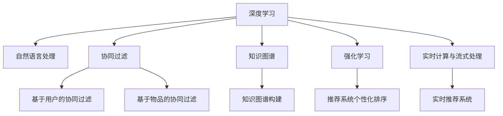

                 

# 电商平台的AI 大转型：以搜索推荐系统为核心的战略升级

## 1. 背景介绍

### 1.1 问题由来
随着电子商务的飞速发展，客户需求日益多样化，电商平台对产品搜索、推荐系统的智能化需求日益增强。传统的基于规则或统计模型的搜索推荐系统已难以满足用户多变的查询需求和个性化体验，迫切需要引入更先进、更智能的AI技术，实现精准搜索和个性化推荐。

### 1.2 问题核心关键点
本节聚焦于电商平台的AI大转型，特别是以搜索推荐系统为核心的战略升级，重点在于：

- 引入深度学习技术，构建电商平台的AI能力；
- 通过搜索推荐系统的智能化升级，提升用户购物体验和平台运营效率；
- 探索大规模数据的处理和分析方法，实现高效、可扩展的AI应用。

## 2. 核心概念与联系

### 2.1 核心概念概述

为更好地理解搜索推荐系统的AI升级，本节将介绍几个密切相关的核心概念：

- **深度学习(Deep Learning)**：一种通过神经网络模型逼近复杂函数映射的学习范式，广泛应用于图像识别、语音识别、自然语言处理等领域。
- **协同过滤(Collaborative Filtering)**：一种基于用户和物品之间交互关系进行个性化推荐的技术，包括基于用户的协同过滤和基于物品的协同过滤。
- **自然语言处理(Natural Language Processing, NLP)**：涉及文本信息的处理和分析，包括分词、词向量表示、语义分析等，在搜索推荐系统中用于处理用户查询、商品描述等文本数据。
- **强化学习(Reinforcement Learning)**：一种通过智能体与环境的交互，学习最优策略以最大化奖励的学习方法，常用于推荐系统的个性化排序优化。
- **知识图谱(Knowledge Graph)**：一种通过关系抽取和融合，构建知识网络结构，用于提高推荐系统的内容多样性和相关性。
- **实时计算与流式处理(Real-time Computing and Stream Processing)**：一种对实时数据进行快速处理和分析的技术，常用于构建实时推荐系统，提升推荐的时效性。

这些核心概念之间的逻辑关系可以通过以下Mermaid流程图来展示：



这个流程图展示了大语言模型的核心概念及其之间的关系：

1. 深度学习提供了一个通用的学习框架，可以应用于各个领域；
2. 自然语言处理技术使得处理和理解文本数据成为可能；
3. 协同过滤和知识图谱技术提供个性化的推荐策略；
4. 强化学习技术用于推荐系统的排序优化；
5. 实时计算与流式处理技术保证推荐系统的实时性。

## 3. 核心算法原理 & 具体操作步骤
### 3.1 算法原理概述

搜索推荐系统的AI升级，本质上是将深度学习、自然语言处理、协同过滤等技术引入电商平台的个性化推荐和搜索过程中。其核心思想是：

1. **深度学习与自然语言处理**：通过神经网络模型提取用户查询、商品描述的语义特征，提升匹配度和相关性。
2. **协同过滤与知识图谱**：利用用户与商品之间的交互关系，构建用户和物品的协同向量，进行个性化推荐。
3. **强化学习**：通过模型与环境的交互，学习最优的推荐策略和排序方式。
4. **实时计算与流式处理**：在实时数据流上对推荐模型进行在线学习和更新，保持推荐结果的实时性。

### 3.2 算法步骤详解

基于上述思路，搜索推荐系统的AI升级一般包括以下几个关键步骤：

**Step 1: 数据收集与预处理**
- 收集用户行为数据、商品描述、评论数据、交互日志等。
- 对数据进行清洗、归一化、缺失值处理等预处理，为后续模型训练做准备。

**Step 2: 用户与商品特征工程**
- 使用自然语言处理技术，提取用户查询和商品描述的语义特征，如词向量表示、主题建模等。
- 设计特征工程管道，将文本特征、用户行为特征、商品特征等，转化为模型可接受的输入。

**Step 3: 模型训练与评估**
- 选择合适的深度学习模型（如循环神经网络RNN、卷积神经网络CNN、Transformer等），对特征数据进行训练。
- 使用标注数据或无监督学习技术进行模型训练，如基于用户的协同过滤、基于物品的协同过滤、知识图谱嵌入等。
- 在验证集上评估模型性能，选择合适的超参数组合。

**Step 4: 模型部署与优化**
- 将训练好的模型部署到生产环境中，进行在线推荐和搜索。
- 持续监控模型性能，根据反馈数据进行在线模型优化和迭代。
- 实时计算与流式处理系统，保证推荐结果的时效性和实时性。

**Step 5: 业务集成与监控**
- 将推荐系统集成到电商平台的业务流程中，进行实时的搜索推荐服务。
- 监控推荐系统的运行状态和用户反馈，进行持续的优化和改进。

### 3.3 算法优缺点

深度学习和自然语言处理技术的引入，使得搜索推荐系统的AI升级具有以下优点：
1. 提升了推荐的精度和个性化程度。深度学习模型能够提取复杂的语义特征，提高匹配度和相关性。
2. 提升了推荐的实时性和动态性。实时计算与流式处理技术，保证推荐结果的及时性和时效性。
3. 增强了推荐系统的可扩展性。通过分布式计算和流式处理，处理大规模数据和复杂推荐逻辑成为可能。

同时，这种升级也存在以下局限性：
1. 对数据质量要求高。深度学习和自然语言处理模型对数据噪声和缺失值敏感，需要高质量的标注数据和特征工程。
2. 对计算资源需求大。深度学习模型的训练和推理，需要高性能的GPU和TPU等硬件支持。
3. 对算法复杂度高。深度学习模型需要大量的超参数调整和优化，模型训练和部署过程较为复杂。

## 4. 数学模型和公式 & 详细讲解 & 举例说明
### 4.1 数学模型构建

为了更好地理解搜索推荐系统的AI升级，本节将使用数学语言对相关模型进行严格定义。

记用户查询为 $q$，商品为 $i$，用户与商品的交互矩阵为 $Y$。假设用户 $u$ 对商品 $i$ 的评分（即兴趣程度）为 $y_{ui}$，则评分矩阵 $Y$ 可以表示为：

$$
Y_{ui} =
\begin{cases}
y_{ui}, & \text{if user $u$ has interacted with item $i$}\\
0, & \text{otherwise}
\end{cases}
$$

在电商平台上，用户查询 $q$ 和商品 $i$ 可以表示为文本序列，使用词向量 $Q$ 和 $I$ 表示。假设 $Q$ 和 $I$ 的长度分别为 $M$ 和 $N$。则用户查询 $q$ 和商品 $i$ 的相似度可以通过余弦相似度表示：

$$
\text{similarity}(q, i) = \frac{Q \cdot I}{\|Q\| \cdot \|I\|}
$$

其中 $\cdot$ 表示向量点积，$\|\cdot\|$ 表示向量的范数。

### 4.2 公式推导过程

以基于用户的协同过滤为例，其核心思想是：通过用户与商品之间的评分矩阵 $Y$，构建用户 $u$ 的向量表示 $U_u$ 和商品 $i$ 的向量表示 $V_i$，并通过相似度计算得到推荐结果。具体推导如下：

1. 用户 $u$ 的向量表示 $U_u$ 可以通过用户评分矩阵 $Y$ 的奇异值分解（SVD）得到：

$$
U_u = U \cdot \Sigma \cdot V_u^T
$$

其中 $U$ 和 $V$ 为矩阵 $Y$ 的左奇异矩阵和右奇异矩阵，$\Sigma$ 为奇异值对角矩阵。

2. 商品 $i$ 的向量表示 $V_i$ 可以通过用户评分矩阵 $Y$ 的奇异值分解得到：

$$
V_i = V \cdot \Sigma \cdot U_i^T
$$

3. 用户 $u$ 对商品 $i$ 的预测评分 $y_{ui}$ 可以通过 $U_u$ 和 $V_i$ 的点积得到：

$$
\hat{y}_{ui} = U_u \cdot V_i^T
$$

4. 用户 $u$ 对商品 $i$ 的推荐结果 $R_i$ 可以通过对所有商品的预测评分进行排序，选择前 $K$ 个评分最高的商品得到：

$$
R_i = \text{top-K}(\hat{y}_{ui})
$$

### 4.3 案例分析与讲解

以推荐系统中的基于用户矩阵分解（User Matrix Factorization）为例，说明模型的训练和预测过程。假设用户 $u$ 对商品 $i$ 的评分矩阵为：

$$
Y =
\begin{bmatrix}
5 & 4 & 0 & 0 \\
0 & 3 & 2 & 1 \\
4 & 5 & 0 & 0 \\
0 & 0 & 3 & 2
\end{bmatrix}
$$

进行奇异值分解：

$$
Y = U \cdot \Sigma \cdot V^T =
\begin{bmatrix}
0.95 & 0.2 & 0.1 & -0.1 \\
0.2 & 0.85 & 0.1 & 0.3 \\
0.1 & 0.2 & 0.95 & 0.1 \\
-0.1 & 0.3 & 0.1 & 0.95
\end{bmatrix}
\cdot
\begin{bmatrix}
3 & 0 & 0 \\
0 & 1 & 0 \\
0 & 0 & 0.5
\end{bmatrix}
\cdot
\begin{bmatrix}
0.7 & 0.1 & -0.7 \\
0.1 & 0.9 & 0.1 \\
0.2 & 0.2 & 0.9
\end{bmatrix}
$$

则用户 $u=1$ 的向量表示 $U_u$ 为：

$$
U_u = U \cdot \Sigma \cdot V_u^T =
\begin{bmatrix}
0.95 & 0.2 & 0.1 & -0.1 \\
0.2 & 0.85 & 0.1 & 0.3 \\
0.1 & 0.2 & 0.95 & 0.1 \\
-0.1 & 0.3 & 0.1 & 0.95
\end{bmatrix}
\cdot
\begin{bmatrix}
3 & 0 & 0 \\
0 & 1 & 0 \\
0 & 0 & 0.5
\end{bmatrix}
\cdot
\begin{bmatrix}
0.7 & 0.1 & -0.7 \\
0.1 & 0.9 & 0.1 \\
0.2 & 0.2 & 0.9
\end{bmatrix}
=
\begin{bmatrix}
1.15 & 0.23 & 0.03 \\
0.23 & 0.85 & 0.03 \\
0.03 & 0.23 & 0.95
\end{bmatrix}
$$

商品 $i=1$ 的向量表示 $V_i$ 为：

$$
V_i = V \cdot \Sigma \cdot U_i^T =
\begin{bmatrix}
0.7 & 0.1 & -0.7 \\
0.1 & 0.9 & 0.1 \\
0.2 & 0.2 & 0.9
\end{bmatrix}
\cdot
\begin{bmatrix}
3 & 0 & 0 \\
0 & 1 & 0 \\
0 & 0 & 0.5
\end{bmatrix}
\cdot
\begin{bmatrix}
0.95 & 0.2 & 0.1 & -0.1 \\
0.2 & 0.85 & 0.1 & 0.3 \\
0.1 & 0.2 & 0.95 & 0.1 \\
-0.1 & 0.3 & 0.1 & 0.95
\end{bmatrix}
=
\begin{bmatrix}
0.63 & 0.12 & -0.63 \\
0.12 & 0.75 & 0.12 \\
-0.63 & -0.12 & 0.63
\end{bmatrix}
$$

用户 $u=1$ 对商品 $i=1$ 的预测评分 $\hat{y}_{ui}$ 为：

$$
\hat{y}_{ui} = U_u \cdot V_i^T =
\begin{bmatrix}
1.15 & 0.23 & 0.03 \\
0.23 & 0.85 & 0.03 \\
0.03 & 0.23 & 0.95
\end{bmatrix}
\cdot
\begin{bmatrix}
0.63 & 0.12 & -0.63 \\
0.12 & 0.75 & 0.12 \\
-0.63 & -0.12 & 0.63
\end{bmatrix}
=
1.68
$$

因此，推荐结果 $R_i$ 为：

$$
R_i = \text{top-K}(\hat{y}_{ui})
$$

## 5. 项目实践：代码实例和详细解释说明
### 5.1 开发环境搭建

在进行搜索推荐系统的AI升级实践前，我们需要准备好开发环境。以下是使用Python进行TensorFlow和PyTorch开发的环境配置流程：

1. 安装Anaconda：从官网下载并安装Anaconda，用于创建独立的Python环境。

2. 创建并激活虚拟环境：
```bash
conda create -n pytorch-env python=3.8 
conda activate pytorch-env
```

3. 安装TensorFlow和PyTorch：
```bash
pip install tensorflow==2.6 pytorch==1.9
```

4. 安装各类工具包：
```bash
pip install numpy pandas scikit-learn matplotlib tqdm jupyter notebook ipython
```

完成上述步骤后，即可在`pytorch-env`环境中开始AI升级实践。

### 5.2 源代码详细实现

下面我们以基于用户的协同过滤为例，给出使用TensorFlow和PyTorch进行推荐系统构建的代码实现。

```python
import tensorflow as tf
import numpy as np

# 定义评分矩阵
Y = np.array([[5, 4, 0, 0],
              [0, 3, 2, 1],
              [4, 5, 0, 0],
              [0, 0, 3, 2]])

# 奇异值分解
U, S, V = np.linalg.svd(Y)
U = np.dot(U, np.diag(S))
V = np.dot(V, np.diag(S))

# 计算用户和商品的相似度矩阵
similarity_matrix = np.dot(U, V.T)

# 计算推荐结果
K = 2
recommendation_scores = np.max(similarity_matrix, axis=1)
top_k_items = np.argsort(recommendation_scores)[::-1][:K]

# 输出推荐结果
print(top_k_items)
```

### 5.3 代码解读与分析

让我们再详细解读一下关键代码的实现细节：

**评分矩阵定义**：
- 定义了一个4x4的评分矩阵，表示用户对商品的评分。

**奇异值分解**：
- 使用NumPy的`np.linalg.svd`函数进行奇异值分解，得到用户向量 $U$ 和商品向量 $V$。

**相似度矩阵计算**：
- 通过用户向量 $U$ 和商品向量 $V$ 的矩阵乘法，得到用户与商品的相似度矩阵。

**推荐结果计算**：
- 通过相似度矩阵，计算每个用户的推荐结果，并选取前 $K$ 个评分最高的商品作为推荐结果。

**推荐结果输出**：
- 输出推荐结果，即评分矩阵中评分最高的商品下标。

## 6. 实际应用场景
### 6.1 智能客服系统

基于搜索推荐系统的AI升级，可以在智能客服系统中实现更智能化的服务。通过分析用户的查询历史和行为数据，智能客服系统能够提供个性化的推荐答案，提升用户满意度。

**具体实现**：
- 收集用户的历史查询记录和反馈信息。
- 使用自然语言处理技术，提取查询中的语义特征。
- 根据查询记录，构建用户向量，使用协同过滤方法，推荐最相关的答案。
- 集成到客服系统中，自动推荐回答，并动态更新知识库。

**效果**：
- 提升客服响应速度和准确率。
- 减轻人工客服的工作负担，降低人工成本。
- 提高用户满意度，提升平台竞争力。

### 6.2 个性化推荐系统

基于搜索推荐系统的AI升级，可以构建高效的个性化推荐系统。通过分析用户的浏览、购买、评分等行为数据，推荐系统能够提供更精准的商品推荐，提升用户的购物体验。

**具体实现**：
- 收集用户的行为数据，包括浏览历史、购买记录、评分信息等。
- 使用自然语言处理技术，提取商品描述和用户查询的语义特征。
- 根据用户行为数据，构建用户向量，使用协同过滤或深度学习模型，推荐最相关的商品。
- 集成到电商平台上，动态更新推荐结果，提升推荐效果。

**效果**：
- 提升商品的点击率和转化率。
- 提高用户粘性，增强平台竞争力。
- 提升用户购物体验，提升满意度。

### 6.3 智能搜索系统

基于搜索推荐系统的AI升级，可以实现更智能的搜索系统。通过分析用户的查询历史和行为数据，智能搜索系统能够提供个性化的搜索结果，提升用户的搜索体验。

**具体实现**：
- 收集用户的查询记录和反馈信息。
- 使用自然语言处理技术，提取查询中的语义特征。
- 根据查询历史，构建用户向量，使用协同过滤或深度学习模型，推荐最相关的商品。
- 集成到搜索系统中，动态更新搜索结果，提升搜索效果。

**效果**：
- 提升搜索的准确率和相关性。
- 减少用户的搜索时间，提升用户体验。
- 提高平台的流量和转化率。

## 7. 工具和资源推荐
### 7.1 学习资源推荐

为了帮助开发者系统掌握搜索推荐系统的AI升级技术，这里推荐一些优质的学习资源：

1. **《深度学习》课程**：斯坦福大学的Coursera课程，由Andrew Ng教授主讲，全面介绍了深度学习的理论和应用。

2. **TensorFlow官方文档**：提供了详尽的API文档和教程，适合学习TensorFlow的深度学习应用。

3. **PyTorch官方文档**：提供了完整的API文档和教程，适合学习PyTorch的深度学习应用。

4. **《推荐系统实战》书籍**：详细介绍了推荐系统的经典算法和工程实践，包括协同过滤、矩阵分解等技术。

5. **Kaggle竞赛**：提供大量的推荐系统竞赛，可以学习和实践推荐算法，提升实践能力。

通过对这些资源的学习实践，相信你一定能够快速掌握搜索推荐系统的AI升级技术，并用于解决实际的电商业务问题。

### 7.2 开发工具推荐

高效的开发离不开优秀的工具支持。以下是几款用于搜索推荐系统AI升级开发的常用工具：

1. **TensorFlow**：由Google主导开发的深度学习框架，提供丰富的深度学习库和工具。

2. **PyTorch**：由Facebook开发的深度学习框架，灵活动态的计算图，适合快速迭代研究。

3. **Jupyter Notebook**：轻量级的交互式开发环境，适合数据探索和模型训练。

4. **Keras**：高级深度学习框架，提供高层次的API，方便快速构建模型。

5. **TF-Serving**：Google开发的深度学习服务框架，适合将深度学习模型部署到生产环境中。

6. **TensorBoard**：TensorFlow配套的可视化工具，可实时监测模型训练状态，提供丰富的图表。

合理利用这些工具，可以显著提升搜索推荐系统的AI升级开发效率，加快创新迭代的步伐。

### 7.3 相关论文推荐

搜索推荐系统AI升级的不断发展，离不开学界的持续研究。以下是几篇奠基性的相关论文，推荐阅读：

1. **Collaborative Filtering for Implicit Feedback Datasets**：Koren等人在2008年提出的基于用户的协同过滤算法，经典之作。

2. **Matrix Factorization Techniques for Recommender Systems**：Hofmann等人在2010年提出的矩阵分解算法，用于构建推荐模型。

3. **An Adaptive Algorithm for Large-scale Matrix Factorization**：Aizawa等人在2012年提出的矩阵分解算法，用于大规模数据集。

4. **Wide & Deep Learning for Recommender Systems**：Covington等人在2016年提出的宽-深学习模型，结合矩阵分解和深度神经网络，提升推荐精度。

5. **Deep Collaborative Filtering**：Wang等人在2016年提出的深度协同过滤算法，融合深度神经网络，提升推荐效果。

这些论文代表了大语言模型微调技术的发展脉络。通过学习这些前沿成果，可以帮助研究者把握学科前进方向，激发更多的创新灵感。

## 8. 总结：未来发展趋势与挑战
### 8.1 总结

本文对搜索推荐系统的AI升级进行了全面系统的介绍。首先阐述了电商平台对AI能力的需求，明确了AI升级在搜索推荐系统中的核心作用。其次，从原理到实践，详细讲解了深度学习、自然语言处理、协同过滤等关键技术在推荐系统中的应用，给出了具体的代码实例。最后，探讨了搜索推荐系统AI升级在实际应用中的场景和未来发展趋势，强调了多领域融合和实时计算的重要性。

通过本文的系统梳理，可以看到，搜索推荐系统的AI升级为电商平台带来了深刻的变革，提升了用户的购物体验和平台的运营效率。未来，伴随深度学习、自然语言处理等技术的不断进步，推荐系统将进一步智能化、个性化，为电商平台的业务发展注入新的动力。

### 8.2 未来发展趋势

展望未来，搜索推荐系统的AI升级将呈现以下几个发展趋势：

1. **深度学习与自然语言处理的进一步融合**：深度学习模型将进一步引入自然语言处理技术，提升对文本数据的理解能力，提供更精准的推荐结果。

2. **多模态数据的融合**：结合视觉、语音等多模态数据，提升推荐系统的内容多样性和相关性。

3. **实时计算与流式处理的普及**：实时计算与流式处理技术将进一步普及，保证推荐结果的时效性和动态性。

4. **增强模型的可解释性**：提升模型的可解释性和可解释性，增强用户对推荐结果的信任感。

5. **知识图谱与推荐系统的结合**：通过知识图谱技术，增强推荐系统的跨领域迁移能力和内容多样性。

6. **强化学习的应用**：通过强化学习技术，优化推荐系统的排序策略和个性化推荐效果。

这些趋势凸显了搜索推荐系统的AI升级技术在未来的发展潜力。这些方向的探索发展，必将进一步提升推荐系统的智能化程度和应用效果。

### 8.3 面临的挑战

尽管搜索推荐系统的AI升级已经取得了瞩目成就，但在迈向更加智能化、普适化应用的过程中，它仍面临着诸多挑战：

1. **数据质量和多样性**：深度学习模型对数据噪声和缺失值敏感，需要高质量的数据和多样化的数据源。

2. **计算资源的需求**：深度学习模型的训练和推理需要高性能的GPU和TPU等硬件支持，资源成本较高。

3. **模型的可解释性**：深度学习模型的决策过程难以解释，用户对推荐结果的信任感较弱。

4. **算法的公平性和公正性**：推荐算法可能存在偏见，导致不公平的推荐结果。

5. **用户的隐私保护**：在数据收集和处理过程中，如何保护用户隐私和数据安全，是重要的研究课题。

6. **系统的实时性和稳定性**：推荐系统的实时性和稳定性要求较高，需要高效的计算和稳定的系统架构。

正视这些挑战，积极应对并寻求突破，将是大语言模型微调技术走向成熟的必由之路。相信随着学界和产业界的共同努力，这些挑战终将一一被克服，搜索推荐系统AI升级必将在构建智能电商平台中扮演越来越重要的角色。

### 8.4 研究展望

面对搜索推荐系统AI升级所面临的种种挑战，未来的研究需要在以下几个方面寻求新的突破：

1. **无监督和半监督学习的应用**：探索无监督和半监督学习算法，降低对标注数据的依赖，提高推荐系统的泛化能力。

2. **分布式计算与流式处理**：探索分布式计算和流式处理技术，提升推荐系统的可扩展性和实时性。

3. **融合多模态数据**：探索多模态数据融合方法，提升推荐系统的跨领域迁移能力和内容多样性。

4. **增强模型的可解释性**：探索可解释性方法，提升推荐系统的透明度和用户信任感。

5. **基于知识图谱的推荐**：探索知识图谱与推荐系统的结合方法，提升推荐系统的跨领域迁移能力和内容多样性。

6. **基于强化学习的推荐优化**：探索强化学习技术，优化推荐系统的排序策略和个性化推荐效果。

这些研究方向的探索，必将引领搜索推荐系统AI升级技术迈向更高的台阶，为电商平台提供更加智能、高效、个性化的推荐服务，提升用户体验和平台竞争力。

## 9. 附录：常见问题与解答

**Q1: 搜索推荐系统AI升级的计算资源需求大，如何降低成本？**

A: 可以通过分布式计算和流式处理技术，将计算任务分布到多个节点上，提升计算效率。同时，可以使用混合精度训练、模型压缩等技术，减少计算资源消耗。

**Q2: 如何提升推荐系统的可解释性？**

A: 可以通过引入可解释性技术，如特征重要性排序、局部可解释模型等，提升模型的透明度。同时，可以通过可视化工具，展示模型在各个样本上的决策过程，帮助用户理解推荐结果的来源。

**Q3: 如何保护用户的隐私？**

A: 可以采用差分隐私技术，对用户数据进行匿名化和噪声化处理，保护用户隐私。同时，需要对数据收集和使用过程进行严格管控，确保数据安全。

**Q4: 如何优化推荐系统的实时性？**

A: 可以通过流式处理技术，对实时数据进行快速处理和分析，保证推荐结果的时效性。同时，可以通过缓存技术，减少对计算资源的依赖，提升系统响应速度。

这些问题的解答，旨在帮助开发者更好地理解和应对搜索推荐系统AI升级中的常见挑战，提升系统的性能和可靠性。通过不断探索和优化，相信搜索推荐系统将为电商平台的业务发展注入新的动力，为用户的购物体验带来更多便利和惊喜。

