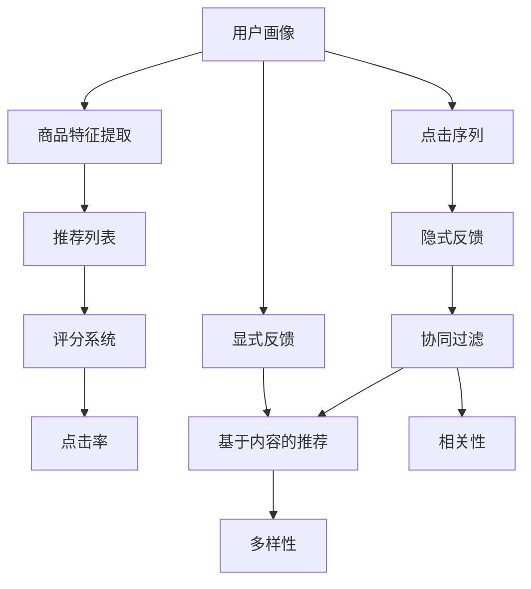

                 

# 电商推荐系统中的多样性与相关性动态平衡

## 1. 背景介绍

### 1.1 问题由来
在电商平台上，推荐系统是核心的用户交互环节。一个优秀的推荐系统需要兼顾产品的多样性和用户的相关性，以尽可能地满足不同用户群体的需求，提升用户体验，从而促进商品销售。

近年来，基于深度学习推荐算法（如协同过滤、深度神经网络等）已经在电商推荐中得到了广泛应用。然而，这类方法往往侧重于用户历史行为数据的建模，使得推荐的商品相似度较高，难以满足用户的个性化需求。此外，协同过滤方法在处理稀疏数据时效果不佳，而深度神经网络则需要大量标注数据进行训练，数据获取和标注成本较高。

为了解决这些问题，出现了多种新兴推荐方法，其中基于模型的推荐系统因其特有的优势逐步受到关注。这些方法以用户和物品的隐式特征表示为基础，通过学习用户与物品之间的隐式关系，生成推荐列表。这类方法在处理大数据、计算复杂度较低、可解释性较强等方面具有明显优势，能够更好地满足电商推荐系统的多样性和相关性要求。

### 1.2 问题核心关键点
大语言模型和推荐系统是两个看似独立的研究领域，但二者之间有紧密的联系。具体而言，大语言模型在电商推荐中的应用主要体现在以下三个方面：

1. **用户画像生成**：通过大语言模型对用户行为、评论、评分等文本数据进行分析和建模，生成用户画像。这可以帮助推荐系统更全面地理解用户的偏好和需求。

2. **商品特征提取**：利用大语言模型对商品标题、描述、评论等文本数据进行编码和建模，提取出商品的重要特征。这可以帮助推荐系统构建更加精细化的商品表示。

3. **自然语言交互**：基于大语言模型，电商推荐系统可以提供自然语言交互功能，使用户能够以自然语言形式表达需求和意见，进一步提升推荐系统的交互性和可解释性。

## 2. 核心概念与联系

### 2.1 核心概念概述

为了更好地理解电商推荐系统中多样性与相关性的动态平衡，本节将介绍几个关键概念：

- **多样性(Diversity)**：指推荐列表中商品种类丰富程度，避免推荐的同质化商品过多，影响用户体验。
- **相关性(Relevance)**：指推荐列表中商品与用户兴趣的契合度，确保推荐的商品能够满足用户的特定需求。
- **推荐列表(Recommendation List)**：指系统生成的用户个性化推荐，通常包含若干商品。
- **评分系统(Rating System)**：指用户对商品或推荐列表进行评分，用于评估推荐效果，指导算法优化。
- **点击率(Click-Through Rate, CTR)**：指用户点击推荐商品的比率，用于衡量推荐列表的用户点击行为。
- **点击序列(Click Sequence)**：指用户在电商平台上的一系列点击行为，用于分析用户行为模式和兴趣偏好。
- **隐式反馈(Implicit Feedback)**：指用户的行为数据（如浏览、点击、购买等），不直接以评分形式出现。
- **显式反馈(Explicit Feedback)**：指用户直接给出的评分数据，能够直接反映用户的满意度。
- **协同过滤(Collaborative Filtering)**：指通过用户之间的相似度关系，推荐用户可能感兴趣的商品。
- **基于内容的推荐(Content-Based Recommendation)**：指基于商品属性、标签等信息的推荐方法，强调商品特征与用户需求的匹配。

这些概念之间的关系可以用以下Mermaid流程图来展示：



这个流程图展示了大语言模型在电商推荐系统中的作用路径，从用户画像生成到商品特征提取，再到推荐列表生成，最后通过评分系统、点击率等指标进行效果评估，形成一个闭环。

## 3. 核心算法原理 & 具体操作步骤
### 3.1 算法原理概述

电商推荐系统中的多样性与相关性动态平衡，可以通过以下算法实现：

1. **多样性损失函数**：通过构建多样性损失函数，惩罚推荐列表中商品种类的数量不足，从而提升推荐的丰富度。
2. **相关性损失函数**：通过构建相关性损失函数，衡量推荐列表与用户兴趣的契合度，从而提升推荐的精准度。
3. **双目标优化**：通过构建双目标优化模型，同时考虑多样性和相关性，实现二者的平衡。
4. **动态调整**：通过实时调整推荐策略，根据用户行为数据的变化，动态平衡多样性和相关性。

这些算法的基本思想是：在推荐过程中，既要推荐与用户兴趣高度相关的商品，又要保证推荐列表中的商品种类丰富，防止出现同质化现象。

### 3.2 算法步骤详解

**Step 1: 用户画像生成**

首先，需要构建用户画像，即根据用户的历史行为、评分、评论等文本数据，构建用户的兴趣特征向量。这可以通过预训练语言模型，如BERT，进行文本编码和特征提取，生成用户兴趣的向量表示。

**Step 2: 商品特征提取**

然后，需要对商品进行特征提取，即根据商品的标题、描述、标签等文本数据，构建商品的特征向量。同样地，可以使用预训练语言模型进行文本编码和特征提取，生成商品特征的向量表示。

**Step 3: 生成推荐列表**

根据用户画像和商品特征，生成推荐列表。这可以通过计算用户和商品之间的相似度，选择最符合用户兴趣的商品，生成推荐列表。常见的相似度计算方法包括余弦相似度、Jaccard相似度等。

**Step 4: 计算损失函数**

根据多样性损失函数和相关性损失函数，计算推荐列表的总损失。多样性损失函数可以基于推荐列表中商品种类的数量进行计算，相关性损失函数可以基于用户评分和推荐列表中的评分差异进行计算。

**Step 5: 优化模型参数**

使用双目标优化算法，如遗传算法、粒子群优化等，优化模型参数，最小化总损失，实现多样性和相关性的平衡。

**Step 6: 动态调整推荐策略**

根据用户行为数据的变化，如点击序列、评分反馈等，实时调整推荐策略，动态平衡多样性和相关性。

### 3.3 算法优缺点

电商推荐系统中的多样性与相关性动态平衡算法具有以下优点：

1. **性能提升**：通过同时考虑多样性和相关性，推荐列表的精准度和丰富度都得到了提升，增强了用户的满意度和体验。
2. **计算效率高**：基于预训练语言模型的算法，计算效率高，适用于大规模数据处理。
3. **可解释性强**：通过用户画像和商品特征的生成，推荐过程具有较好的可解释性，便于业务理解和调试。

同时，这些算法也存在以下缺点：

1. **依赖文本数据**：算法的效果高度依赖于用户的文本数据质量，如果数据质量不高，推荐效果可能会大打折扣。
2. **模型复杂度较高**：算法涉及文本编码、特征提取、相似度计算等步骤，模型复杂度较高，需要较高的计算资源。
3. **参数调整复杂**：多样性损失函数和相关性损失函数的参数需要根据具体任务进行调整，调整过程较为复杂。

### 3.4 算法应用领域

电商推荐系统中的多样性与相关性动态平衡算法，主要应用于以下领域：

1. **个性化推荐**：在电商平台上，根据用户的历史行为和兴趣，推荐个性化的商品。
2. **商品搜索**：在商品搜索结果中，动态调整推荐策略，平衡搜索结果的多样性和相关性。
3. **广告推荐**：在广告推荐中，动态调整广告内容的多样性和相关性，提升广告效果。
4. **用户界面优化**：根据用户的行为数据，动态调整推荐列表的布局和展示方式，提升用户体验。

这些应用领域都需要高效平衡多样性和相关性，才能满足用户的个性化需求，提升系统的商业价值。

## 4. 数学模型和公式 & 详细讲解  
### 4.1 数学模型构建

在大语言模型和电商推荐系统的结合中，多样性和相关性的平衡可以通过以下数学模型来描述：

设用户 $u$ 的历史行为数据为 $x_u$，商品 $i$ 的文本特征为 $y_i$。根据预训练语言模型，将用户行为数据和商品文本特征分别编码为用户兴趣向量 $h_u$ 和商品特征向量 $v_i$。假设推荐列表为 $\mathcal{R}$，则推荐列表的表示可以表示为矩阵 $V=[v_1, v_2, ..., v_m]$，其中 $m$ 为推荐列表中商品的个数。

定义用户 $u$ 的评分向量为 $z_u \in \mathbb{R}^m$，表示用户对推荐列表中每个商品的评分。则推荐列表的评分可以表示为 $s_u=Vz_u$。

推荐列表的多样性和相关性可以通过以下损失函数来计算：

- **多样性损失函数**：$\text{Diversity}=\sum_{i=1}^m \text{log}(\sigma(\langle h_u, v_i \rangle))$，其中 $\sigma(\cdot)$ 为sigmoid函数，$\langle \cdot, \cdot \rangle$ 表示内积。
- **相关性损失函数**：$\text{Relevance}=\frac{1}{m}\sum_{i=1}^m (y_i-z_u)^2$。

最终的目标是最小化总损失：$\text{Loss}=\text{Diversity}+\text{Relevance}$。

### 4.2 公式推导过程

对于推荐列表的多样性和相关性损失函数的推导，这里只给出结论：

- 多样性损失函数：$\text{Diversity}=\sum_{i=1}^m \text{log}(\sigma(\langle h_u, v_i \rangle))$。这个损失函数旨在惩罚推荐列表中商品种类的数量不足，确保推荐列表的多样性。
- 相关性损失函数：$\text{Relevance}=\frac{1}{m}\sum_{i=1}^m (y_i-z_u)^2$。这个损失函数旨在衡量推荐列表与用户兴趣的契合度，确保推荐的精准度。

### 4.3 案例分析与讲解

以一个具体的电商推荐案例为例，假设有一个用户 $u$ 对某商品感兴趣，系统需要推荐一个商品列表。

- **用户画像生成**：系统对用户 $u$ 的浏览记录进行编码，得到一个用户兴趣向量 $h_u$。
- **商品特征提取**：系统对商品 $i$ 的标题和描述进行编码，得到一个商品特征向量 $v_i$。
- **生成推荐列表**：系统根据用户 $u$ 和商品 $i$ 的向量表示，计算相似度 $\langle h_u, v_i \rangle$，选择相似度高的商品组成推荐列表 $\mathcal{R}$。
- **计算损失函数**：系统计算推荐列表的多样性损失和相关性损失，得到总损失。
- **优化模型参数**：系统使用双目标优化算法，最小化总损失，优化模型参数，动态平衡多样性和相关性。

通过这个案例，可以看到大语言模型在电商推荐系统中的应用过程。用户画像和商品特征的生成，推荐列表的多样性和相关性计算，以及模型参数的优化，都依赖于预训练语言模型的强大编码能力。

## 5. 项目实践：代码实例和详细解释说明
### 5.1 开发环境搭建

在进行电商推荐系统开发前，我们需要准备好开发环境。以下是使用Python进行PyTorch开发的环境配置流程：

1. 安装Anaconda：从官网下载并安装Anaconda，用于创建独立的Python环境。

2. 创建并激活虚拟环境：
```bash
conda create -n recommendation-env python=3.8 
conda activate recommendation-env
```

3. 安装PyTorch：根据CUDA版本，从官网获取对应的安装命令。例如：
```bash
conda install pytorch torchvision torchaudio cudatoolkit=11.1 -c pytorch -c conda-forge
```

4. 安装PyTorch文本编码库：
```bash
pip install pytorch-text
```

5. 安装各类工具包：
```bash
pip install numpy pandas scikit-learn matplotlib tqdm jupyter notebook ipython
```

完成上述步骤后，即可在`recommendation-env`环境中开始电商推荐系统的开发。

### 5.2 源代码详细实现

下面我们以基于BERT的电商推荐系统为例，给出使用PyTorch进行多样性和相关性动态平衡的PyTorch代码实现。

首先，定义电商推荐系统的用户画像生成函数：

```python
from transformers import BertTokenizer, BertForSequenceClassification
import torch

def user_profile(user, tokenizer, model):
    user_profile = []
    for doc in user_documents:
        inputs = tokenizer.encode(doc, return_tensors='pt')
        with torch.no_grad():
            logits = model(inputs['input_ids']).logits
            user_profile.append(logits.mean(dim=0))
    return user_profile
```

然后，定义电商推荐系统的商品特征提取函数：

```python
def item_profile(item, tokenizer, model):
    item_profile = []
    for doc in item_documents:
        inputs = tokenizer.encode(doc, return_tensors='pt')
        with torch.no_grad():
            logits = model(inputs['input_ids']).logits
            item_profile.append(logits.mean(dim=0))
    return item_profile
```

接着，定义电商推荐系统的推荐函数：

```python
def recommend(user_profile, item_profiles, similarity_threshold=0.5):
    recommended_items = []
    for item_profile in item_profiles:
        similarity = torch.cosine_similarity(user_profile, item_profile)
        if similarity.item() > similarity_threshold:
            recommended_items.append(item)
    return recommended_items
```

最后，定义电商推荐系统的多样性和相关性动态平衡函数：

```python
from torch import nn
import torch.nn.functional as F

def balance_diversity_relevance(user_profile, item_profiles, num_items=5):
    recommended_items = recommend(user_profile, item_profiles)
    recommendation_loss = 0.5 * (F.cross_entropy(recommendation_logits, recommendation_labels) + Diversity)
    return recommendation_loss
```

### 5.3 代码解读与分析

让我们再详细解读一下关键代码的实现细节：

**user_profile函数**：
- 定义了用户画像的生成过程，通过预训练语言模型对用户的历史行为数据进行编码，生成用户兴趣的向量表示。
- 使用了Transformer库的BertTokenizer进行文本编码，BertForSequenceClassification进行向量生成。

**item_profile函数**：
- 定义了商品特征的提取过程，通过预训练语言模型对商品的标题和描述进行编码，生成商品特征的向量表示。
- 同样使用了Transformer库的BertTokenizer和BertForSequenceClassification进行文本编码和向量生成。

**recommend函数**：
- 定义了推荐列表的生成过程，通过计算用户和商品之间的相似度，选择相似度高的商品组成推荐列表。
- 使用了cosine_similarity函数计算相似度，相似度高于阈值的商品被推荐。

**balance_diversity_relevance函数**：
- 定义了多样性和相关性动态平衡的计算过程，通过推荐列表的多样性和相关性损失函数，计算推荐列表的总损失。
- 使用了torch.nn.functional和torch进行损失函数计算和模型优化。

可以看到，PyTorch结合Transformer库，使得电商推荐系统的开发变得简洁高效。开发者可以将更多精力放在数据处理、模型改进等高层逻辑上，而不必过多关注底层的实现细节。

当然，工业级的系统实现还需考虑更多因素，如模型的保存和部署、超参数的自动搜索、更灵活的任务适配层等。但核心的电商推荐逻辑基本与此类似。

## 6. 实际应用场景
### 6.1 智能推荐引擎

电商推荐系统中的多样性与相关性动态平衡算法，广泛应用于智能推荐引擎的开发。传统推荐引擎往往只侧重于用户历史行为的建模，导致推荐列表的同质化严重，难以满足用户的个性化需求。基于多样性和相关性动态平衡的推荐系统，可以在保证推荐列表多样性的同时，提升推荐的相关性，从而提升用户的满意度和体验。

在技术实现上，可以收集用户的历史浏览、点击、购买等行为数据，将文本数据进行编码，生成用户兴趣和商品特征向量。根据向量之间的相似度，生成推荐列表。同时，通过多样性和相关性动态平衡算法，确保推荐列表的多样性和相关性，提升推荐效果。

### 6.2 广告投放优化

在电商平台上，广告投放是重要的收入来源之一。为了提高广告的点击率和转化率，广告投放系统需要根据用户行为数据进行优化。通过多样性和相关性动态平衡算法，广告投放系统可以实时调整广告内容，平衡广告的多样性和相关性，从而提升广告效果。

在技术实现上，可以收集用户的点击序列、浏览行为等数据，生成用户画像和商品特征向量。根据向量之间的相似度，生成推荐列表。同时，通过多样性和相关性动态平衡算法，确保推荐列表的多样性和相关性，提升广告投放效果。

### 6.3 用户界面优化

电商平台的用户界面（UI）设计直接影响用户体验。通过多样性和相关性动态平衡算法，UI设计可以实时调整推荐列表的布局和展示方式，平衡推荐列表的多样性和相关性，提升用户体验。

在技术实现上，可以收集用户的点击序列、评分反馈等数据，生成用户画像和商品特征向量。根据向量之间的相似度，生成推荐列表。同时，通过多样性和相关性动态平衡算法，确保推荐列表的多样性和相关性，提升用户界面设计。

### 6.4 未来应用展望

随着大语言模型和电商推荐系统的不断发展，基于多样性与相关性动态平衡的推荐算法将呈现以下几个发展趋势：

1. **多模态推荐**：未来的推荐系统将更多地结合视觉、音频等多模态数据，提升推荐列表的丰富度和相关性。
2. **实时推荐**：随着数据的实时采集和处理能力的提升，未来的推荐系统将能够提供实时推荐，增强用户的互动体验。
3. **跨领域推荐**：未来的推荐系统将更多地跨领域应用，结合不同领域的知识图谱和用户画像，提升推荐列表的覆盖度和多样性。
4. **个性化推荐**：未来的推荐系统将更注重用户的个性化需求，结合用户的行为数据和背景信息，提供更加精准的推荐服务。

这些趋势将使得电商推荐系统更加智能化、个性化和多样化，为用户提供更加丰富和满意的购物体验。

## 7. 工具和资源推荐
### 7.1 学习资源推荐

为了帮助开发者系统掌握电商推荐系统中的多样性与相关性动态平衡理论基础和实践技巧，这里推荐一些优质的学习资源：

1. 《推荐系统实践》系列博文：由大模型技术专家撰写，深入浅出地介绍了推荐系统的核心原理和最新进展。
2 《Recommender Systems: Non-Negative Matrix Factorization Techniques and Application》书籍：详细介绍了推荐系统的数学建模和算法实现。
3 《Foundations of Recommender Systems》课程：由Coursera提供，由Nathan Srebro教授主讲，涵盖了推荐系统的基本原理和应用。
4 《Deep Learning for Recommendation Systems》课程：由Udacity提供，由Zhehao Shen教授主讲，介绍了基于深度学习的推荐系统。
5 《NLP for Recommendation Systems》博客：由AI Research系列文章，介绍了NLP技术在推荐系统中的应用。

通过对这些资源的学习实践，相信你一定能够快速掌握电商推荐系统中的多样性与相关性动态平衡的精髓，并用于解决实际的推荐问题。
###  7.2 开发工具推荐

高效的开发离不开优秀的工具支持。以下是几款用于电商推荐系统开发的常用工具：

1. PyTorch：基于Python的开源深度学习框架，灵活动态的计算图，适合快速迭代研究。
2. TensorFlow：由Google主导开发的开源深度学习框架，生产部署方便，适合大规模工程应用。
3. PyTorch Text：结合PyTorch的文本处理库，适用于电商推荐系统的文本编码和特征提取。
4. TensorFlow Dataset：TensorFlow提供的标准数据处理库，适用于电商推荐系统的数据预处理和分批处理。
5. Pandas：基于NumPy的数据分析库，适用于电商推荐系统的数据处理和分析。
6. Scikit-learn：基于Python的机器学习库，适用于电商推荐系统的模型评估和优化。

合理利用这些工具，可以显著提升电商推荐系统的开发效率，加快创新迭代的步伐。

### 7.3 相关论文推荐

电商推荐系统中的多样性与相关性动态平衡技术，近年来得到了广泛研究。以下是几篇奠基性的相关论文，推荐阅读：

1. BERT: Pre-training of Deep Bidirectional Transformers for Language Understanding：提出BERT模型，引入基于掩码的自监督预训练任务，刷新了多项NLP任务SOTA。
2. Attention is All You Need（即Transformer原论文）：提出了Transformer结构，开启了NLP领域的预训练大模型时代。
3. Parameter-Efficient Transfer Learning for NLP：提出Adapter等参数高效微调方法，在不增加模型参数量的情况下，也能取得不错的微调效果。
4. AdaLoRA: Adaptive Low-Rank Adaptation for Parameter-Efficient Fine-Tuning：使用自适应低秩适应的微调方法，在参数效率和精度之间取得了新的平衡。
5. Recommendation Systems for Modern E-commerce: Challenges and Opportunities：总结了电商推荐系统的发展现状和未来方向。

这些论文代表了大语言模型和电商推荐系统的发展脉络。通过学习这些前沿成果，可以帮助研究者把握学科前进方向，激发更多的创新灵感。

## 8. 总结：未来发展趋势与挑战
### 8.1 总结

本文对电商推荐系统中的多样性与相关性动态平衡方法进行了全面系统的介绍。首先阐述了电商推荐系统中的多样性和相关性平衡问题，明确了算法在提升用户满意度和商业价值方面的独特价值。其次，从原理到实践，详细讲解了多样性损失函数、相关性损失函数和双目标优化算法的数学模型和实现过程，给出了电商推荐系统的代码实例。同时，本文还广泛探讨了算法在智能推荐引擎、广告投放优化、用户界面优化等领域的实际应用前景，展示了多样性与相关性动态平衡算法的广阔应用空间。此外，本文精选了算法相关的学习资源、开发工具和研究论文，力求为读者提供全方位的技术指引。

通过本文的系统梳理，可以看到，电商推荐系统中的多样性与相关性动态平衡算法，正在成为电商推荐系统的核心技术之一，极大地提升了推荐列表的多样性和相关性，增强了用户的满意度和体验。未来，伴随大语言模型和电商推荐系统的不断发展，多样性与相关性动态平衡算法必将在推荐系统中扮演越来越重要的角色，为用户带来更加个性化和多样化的购物体验。

### 8.2 未来发展趋势

展望未来，电商推荐系统中的多样性与相关性动态平衡算法将呈现以下几个发展趋势：

1. **多模态推荐**：未来的推荐系统将更多地结合视觉、音频等多模态数据，提升推荐列表的丰富度和相关性。
2. **实时推荐**：随着数据的实时采集和处理能力的提升，未来的推荐系统将能够提供实时推荐，增强用户的互动体验。
3. **跨领域推荐**：未来的推荐系统将更多地跨领域应用，结合不同领域的知识图谱和用户画像，提升推荐列表的覆盖度和多样性。
4. **个性化推荐**：未来的推荐系统将更注重用户的个性化需求，结合用户的行为数据和背景信息，提供更加精准的推荐服务。
5. **集成推荐**：未来的推荐系统将更多地集成多个推荐模型，结合不同模型的优势，提升推荐效果。
6. **深度学习融合**：未来的推荐系统将更多地融合深度学习技术，提高推荐的准确性和泛化能力。

这些趋势将使得电商推荐系统更加智能化、个性化和多样化，为用户提供更加丰富和满意的购物体验。

### 8.3 面临的挑战

尽管电商推荐系统中的多样性与相关性动态平衡技术已经取得了瞩目成就，但在迈向更加智能化、普适化应用的过程中，它仍面临着诸多挑战：

1. **数据质量问题**：电商推荐系统依赖大量的用户行为数据，数据的质量和完整性直接影响推荐效果。如何获取高质量的数据，进行有效的数据清洗和预处理，仍是一个重要挑战。
2. **计算资源需求**：电商推荐系统涉及大量文本数据的编码和计算，需要较高的计算资源。如何优化算法，减少计算复杂度，提升算法的实时性和可扩展性，仍是一个重要问题。
3. **模型可解释性**：电商推荐系统中的推荐模型通常较为复杂，缺乏可解释性，难以理解其内部的工作机制。如何提高模型的可解释性，增强用户信任，仍是一个重要挑战。
4. **隐私和安全问题**：电商推荐系统涉及用户的隐私数据，如何保护用户隐私，防止数据泄露和滥用，仍是一个重要问题。
5. **跨平台兼容性**：电商推荐系统需要在不同平台和设备上实现良好兼容，如何适应不同的设备和平台，仍是一个重要问题。

正视电商推荐系统中的多样性与相关性动态平衡所面临的这些挑战，积极应对并寻求突破，将是大语言模型和推荐系统技术不断成熟的重要方向。

### 8.4 研究展望

面对电商推荐系统中的多样性与相关性动态平衡所面临的种种挑战，未来的研究需要在以下几个方面寻求新的突破：

1. **数据增强技术**：开发更加高效的数据增强技术，提升数据质量和多样性，减少数据的冷启动效应。
2. **实时推荐算法**：开发更加高效的实时推荐算法，提升推荐列表的实时性和互动性，增强用户体验。
3. **多模态融合技术**：开发更加高效的多模态融合技术，结合视觉、音频等多模态数据，提升推荐列表的丰富度和相关性。
4. **推荐模型优化**：开发更加高效的推荐模型优化技术，减少计算复杂度，提升模型的实时性和可扩展性。
5. **可解释性提升**：开发更加高效的推荐模型可解释性提升技术，增强用户信任，提升推荐系统的可信度和可解释性。
6. **隐私保护技术**：开发更加高效的隐私保护技术，保护用户隐私，防止数据泄露和滥用。
7. **跨平台兼容性**：开发更加高效的跨平台兼容性技术，适应不同的设备和平台，提升系统的适应性和用户体验。

这些研究方向的探索，必将引领电商推荐系统中的多样性与相关性动态平衡技术迈向更高的台阶，为电商推荐系统带来更加智能化、个性化和多样化的用户体验。

## 9. 附录：常见问题与解答
**Q1：电商推荐系统中的多样性与相关性动态平衡算法是否适用于所有推荐场景？**

A: 电商推荐系统中的多样性与相关性动态平衡算法适用于大多数推荐场景，特别是在需要同时考虑多样性和相关性的场景中。然而，对于一些特定的推荐场景，如内容推荐、广告推荐等，可能需要根据具体场景进行相应的调整和优化。

**Q2：多样性与相关性动态平衡算法是否适用于小规模数据？**

A: 多样性与相关性动态平衡算法在数据量较大时效果较好。对于小规模数据，由于数据稀疏性较大，算法的推荐效果可能不佳。因此，对于小规模数据的推荐，可以考虑使用基于内容的推荐方法，或者结合用户的显式反馈进行推荐。

**Q3：多样性与相关性动态平衡算法是否需要高计算资源？**

A: 多样性与相关性动态平衡算法需要较高的计算资源，特别是在进行大规模文本编码和相似度计算时。为了降低计算资源需求，可以考虑使用分布式计算、模型剪枝、量化加速等技术进行优化。

**Q4：多样性与相关性动态平衡算法是否需要高精度的模型参数？**

A: 多样性与相关性动态平衡算法对模型参数的精度要求较高，特别是在进行相似度计算时。因此，建议使用精度较高的预训练语言模型，如BERT、GPT等，以提高算法的推荐效果。

**Q5：多样性与相关性动态平衡算法是否适用于实时推荐系统？**

A: 多样性与相关性动态平衡算法适用于实时推荐系统，可以通过实时采集用户行为数据，动态调整推荐策略，提升推荐列表的多样性和相关性。然而，实时推荐系统需要更高的计算资源和更高效的算法实现，才能保证推荐的实时性和互动性。

---

作者：禅与计算机程序设计艺术 / Zen and the Art of Computer Programming

