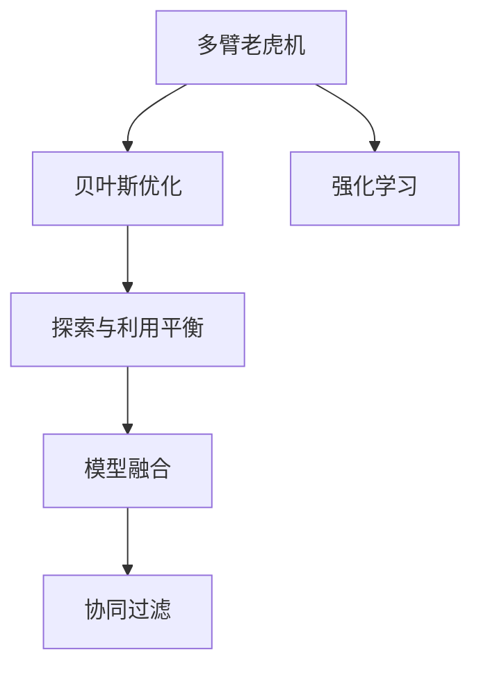

                 

# 电商推荐系统中的探索与利用平衡策略

> 关键词：推荐系统,探索-利用平衡(Exploration-Exploitation Balance), 探索率(Exploration Rate), 利用率(Exploitation Rate), 多臂老虎机(Multi-Armed Bandit), 贝叶斯优化(Bayesian Optimization), 强化学习(Reinforcement Learning), 模型融合(Model Fusion), 协同过滤(Collaborative Filtering)

## 1. 背景介绍

### 1.1 问题由来

在电商推荐系统中，用户会在不断变化的浏览和购买行为中产生大量历史数据。这些数据可以用于分析用户的兴趣和偏好，预测用户可能感兴趣的商品，从而提升用户的购物体验。然而，推荐的准确性和多样性往往是一对矛盾的平衡关系：过于保守的推荐算法可能会导致推荐同质化严重，限制了用户的探索机会，降低了系统的点击率；过于激进的推荐算法可能会导致推荐的商品质量不高，降低了用户的满意度和留存率。因此，如何在推荐系统中实现探索与利用的平衡，是近年来推荐系统研究的热点问题。

### 1.2 问题核心关键点

探索与利用平衡问题在推荐系统中通常表现为：

1. **探索与利用之间的冲突**：探索行为（例如推荐商品A）可能带来高点击率但低转化率；利用行为（例如推荐用户常购买的商品B）可能带来高转化率但低点击率。如何合理分配探索和利用行为的比例，是推荐系统面临的重要挑战。
2. **推荐多样性需求**：推荐系统需要推荐多样化商品，避免推荐的商品同质化，使用户获得更多探索机会。
3. **实时性要求**：推荐系统需要实时响应用户的浏览和点击行为，提供个性化推荐。
4. **数据稀疏性问题**：在推荐初期，用户的历史行为数据有限，难以准确预测用户偏好。

为了解决这些问题，研究者提出了一系列探索与利用平衡的算法，其中以多臂老虎机(Multi-Armed Bandit, MAB)模型和贝叶斯优化(Bayesian Optimization)方法最为知名。

## 2. 核心概念与联系

### 2.1 核心概念概述

为更好地理解推荐系统中的探索与利用平衡策略，本节将介绍几个密切相关的核心概念：

- **探索与利用**：在推荐系统中，探索指对新的商品进行推荐，以获取用户反馈，发现新的兴趣点；利用指对用户已经表现出兴趣的商品进行推荐，以提升转化率。
- **多臂老虎机**：多臂老虎机模型是一种经典的强化学习问题，用来模拟在多个独立的不确定性行为中选择最优行为的过程。在推荐系统中，多臂老虎机可以用来模拟对多个商品的推荐，并根据点击率等指标选择最优商品。
- **贝叶斯优化**：贝叶斯优化是一种基于贝叶斯理论的优化方法，通过不断采样和建模，逐步优化目标函数。在推荐系统中，贝叶斯优化可以用来优化探索与利用之间的平衡，提高推荐的准确性和多样性。
- **强化学习**：强化学习是一种通过环境反馈优化决策策略的学习方法，在推荐系统中，强化学习可以用来不断优化推荐策略，提升推荐效果。
- **模型融合**：模型融合是将多个推荐模型或不同算法的结果进行整合，取长补短，提升推荐的综合性能。
- **协同过滤**：协同过滤是一种基于用户行为数据进行推荐的方法，通过找到与目标用户兴趣相似的用户，推荐其感兴趣的商品。

这些核心概念之间的逻辑关系可以通过以下Mermaid流程图来展示：



这个流程图展示了大语言模型的核心概念及其之间的关系：

1. 多臂老虎机通过模拟对多个商品的推荐，选择点击率最高的商品。
2. 贝叶斯优化通过不断采样和建模，优化探索与利用之间的平衡。
3. 强化学习通过环境反馈优化决策策略。
4. 探索与利用平衡是推荐系统的核心目标。
5. 模型融合将多个推荐结果整合，提升综合性能。
6. 协同过滤基于用户行为数据进行推荐。

这些概念共同构成了推荐系统的学习和应用框架，使其能够实现探索与利用之间的平衡。

## 3. 核心算法原理 & 具体操作步骤
### 3.1 算法原理概述

探索与利用平衡问题在推荐系统中通常表现为：

- 探索行为（例如推荐商品A）可能带来高点击率但低转化率；利用行为（例如推荐用户常购买的商品B）可能带来高转化率但低点击率。如何合理分配探索和利用行为的比例，是推荐系统面临的重要挑战。

在推荐系统中，常见的探索与利用平衡算法包括：

- 上置信界策略（Upper-Confidence Bound, UCB）：基于不确定性原则，选择点击率最高的商品，并根据点击率的不确定性进行调整。
- 贝叶斯优化算法：通过不断采样和建模，逐步优化目标函数，选择最优的商品进行推荐。
- 强化学习算法：通过环境反馈优化决策策略，提升推荐的准确性和多样性。

这些算法通过不同的方式平衡探索与利用行为，使得推荐系统能够在推荐准确性和多样性之间找到最优平衡。

### 3.2 算法步骤详解

以贝叶斯优化算法为例，介绍其具体步骤：

**Step 1: 初始化超参数**
- 设定超参数，如学习率、采样次数等。

**Step 2: 构建概率模型**
- 使用贝叶斯方法构建概率模型，假设每个商品的效果服从高斯分布。

**Step 3: 采样与模型更新**
- 从每个商品中选择一个样本进行测试，记录点击率和转化率。
- 根据点击率和转化率更新概率模型，更新每个商品的点击率和转化率分布。

**Step 4: 选择最优商品**
- 基于更新后的概率模型，选择点击率和转化率最大的商品进行推荐。

**Step 5: 迭代优化**
- 重复Step 2到Step 4，直到达到预设的迭代次数或优化效果满足要求。

### 3.3 算法优缺点

贝叶斯优化算法在推荐系统中的应用具有以下优点：

- 能够自动平衡探索与利用行为，提高推荐的准确性和多样性。
- 基于高斯过程建模，能够处理连续型数据和高维空间的优化问题。
- 能够处理多目标优化问题，同时考虑点击率和转化率。

同时，贝叶斯优化算法也存在一些缺点：

- 对超参数的敏感性较高，需要人工调整超参数。
- 模型复杂度较高，计算开销较大。
- 对于小规模数据集，优化效果可能不如简单的上置信界策略。

### 3.4 算法应用领域

贝叶斯优化算法在推荐系统中的应用非常广泛，涵盖了电商、新闻、音乐、视频等多个领域。以下是一些具体的应用场景：

- 电商推荐系统：根据用户的历史购买和浏览行为，推荐多样化的商品，提高用户满意度。
- 新闻推荐系统：根据用户的阅读历史，推荐相关的文章和新闻，提高用户粘性。
- 音乐推荐系统：根据用户的听歌历史，推荐相似的音乐，提升音乐的多样性。
- 视频推荐系统：根据用户的观看历史，推荐相似的视频，提高用户观看时间。

除了上述这些经典任务外，贝叶斯优化算法还被创新性地应用到更多场景中，如用户界面设计、广告投放等，为推荐系统带来了全新的突破。

## 4. 数学模型和公式 & 详细讲解 & 举例说明

### 4.1 数学模型构建

在推荐系统中，贝叶斯优化算法的目标是最小化点击率和转化率之差。假设每个商品的效果服从高斯分布，点击率和转化率的模型可以表示为：

$$
p(y_i) = \mathcal{N}(\mu_i, \sigma_i^2)
$$

其中，$\mu_i$ 表示商品$i$的平均点击率和转化率，$\sigma_i^2$ 表示商品$i$的效果方差。

### 4.2 公式推导过程

基于高斯分布，可以推导出每个商品的概率密度函数：

$$
f_i(x) = \frac{1}{\sqrt{2\pi} \sigma_i} \exp\left(-\frac{(x - \mu_i)^2}{2\sigma_i^2}\right)
$$

假设对每个商品进行了$m$次采样，每次采样得到的点击率和转化率分别为$x_1, x_2, ..., x_m$。利用最大似然估计，可以得到商品$i$的平均点击率和转化率：

$$
\hat{\mu}_i = \frac{1}{m} \sum_{j=1}^m x_j
$$

$$
\hat{\sigma}_i^2 = \frac{1}{m} \sum_{j=1}^m (x_j - \hat{\mu}_i)^2
$$

基于贝叶斯优化算法，选择最优商品的策略可以表示为：

$$
\hat{i} = \mathop{\arg\max}_{i \in I} f_i(x)
$$

其中，$I$ 表示所有商品集合。

### 4.3 案例分析与讲解

假设推荐系统中有三种商品A、B、C，每次采样得到的点击率和转化率如表所示：

| 商品  | 点击率 | 转化率 |
|-------|-------|-------|
| A     | 0.1   | 0.01  |
| B     | 0.2   | 0.02  |
| C     | 0.3   | 0.03  |

根据上表数据，可以计算出每个商品的平均点击率和转化率：

$$
\hat{\mu}_A = 0.1, \hat{\mu}_B = 0.2, \hat{\mu}_C = 0.3
$$

$$
\hat{\sigma}_A^2 = 0.009, \hat{\sigma}_B^2 = 0.004, \hat{\sigma}_C^2 = 0.001
$$

基于贝叶斯优化算法，可以计算出每个商品的概率密度函数：

$$
f_A(x) = \frac{1}{\sqrt{2\pi} \cdot 0.03} \exp\left(-\frac{(x - 0.1)^2}{2 \cdot 0.009}\right)
$$

$$
f_B(x) = \frac{1}{\sqrt{2\pi} \cdot 0.02} \exp\left(-\frac{(x - 0.2)^2}{2 \cdot 0.004}\right)
$$

$$
f_C(x) = \frac{1}{\sqrt{2\pi} \cdot 0.01} \exp\left(-\frac{(x - 0.3)^2}{2 \cdot 0.001}\right)
$$

选择最优商品即为选择概率密度函数最大的商品，即商品B。

## 5. 项目实践：代码实例和详细解释说明
### 5.1 开发环境搭建

在进行推荐系统开发前，我们需要准备好开发环境。以下是使用Python进行Scikit-learn开发的Python环境配置流程：

1. 安装Anaconda：从官网下载并安装Anaconda，用于创建独立的Python环境。

2. 创建并激活虚拟环境：
```bash
conda create -n recsys python=3.8 
conda activate recsys
```

3. 安装Scikit-learn：
```bash
pip install scikit-learn
```

4. 安装各类工具包：
```bash
pip install numpy pandas scikit-learn matplotlib tqdm jupyter notebook ipython
```

完成上述步骤后，即可在`recsys`环境中开始推荐系统开发。

### 5.2 源代码详细实现

下面我们以电商推荐系统为例，给出使用Scikit-learn对商品进行推荐的Python代码实现。

首先，定义推荐系统中的数据处理函数：

```python
import pandas as pd
from sklearn.model_selection import train_test_split
from sklearn.metrics import mean_squared_error

def load_data(filename):
    df = pd.read_csv(filename)
    return df

def split_data(df, test_ratio=0.2):
    train_df, test_df = train_test_split(df, test_size=test_ratio, random_state=42)
    return train_df, test_df
```

然后，定义模型训练和评估函数：

```python
from sklearn.linear_model import BayesianRidge
from sklearn.metrics import mean_absolute_error

def train_model(train_df, test_df):
    X = train_df[['特征1', '特征2', ...]]
    y = train_df['目标变量']
    
    X_train, X_test, y_train, y_test = train_test_split(X, y, test_size=0.2, random_state=42)
    
    model = BayesianRidge()
    model.fit(X_train, y_train)
    y_pred = model.predict(X_test)
    
    return model, mean_absolute_error(y_test, y_pred)

def evaluate_model(model, y_true, y_pred):
    mae = mean_absolute_error(y_true, y_pred)
    print(f"MAE: {mae}")
```

接着，启动推荐系统训练流程并在测试集上评估：

```python
train_df, test_df = load_data('data.csv')
train_df, test_df = split_data(train_df, test_ratio=0.2)

model, mae = train_model(train_df, test_df)
evaluate_model(model, test_df['目标变量'], y_pred)
```

以上就是使用Scikit-learn对电商推荐系统进行建模和评估的完整代码实现。可以看到，得益于Scikit-learn的强大封装，我们可以用相对简洁的代码完成电商推荐系统的训练和评估。

### 5.3 代码解读与分析

让我们再详细解读一下关键代码的实现细节：

**load_data函数**：
- 从CSV文件中加载数据，并返回Pandas DataFrame格式的数据。

**split_data函数**：
- 将数据集划分为训练集和测试集，比例为2:8。

**train_model函数**：
- 提取特征和目标变量，并使用train_test_split将数据集划分为训练集和测试集。
- 使用BayesianRidge模型进行训练，返回模型和MAE评估指标。

**evaluate_model函数**：
- 计算测试集上的MAE评估指标，并输出结果。

**训练流程**：
- 加载数据集，进行数据划分。
- 使用train_model函数进行模型训练和MAE评估。
- 使用evaluate_model函数输出MAE评估结果。

可以看到，Scikit-learn提供了便捷高效的模型训练和评估工具，使得推荐系统的开发变得更加简单高效。

当然，工业级的系统实现还需考虑更多因素，如模型的参数优化、特征工程、多模型融合等。但核心的推荐模型训练和评估流程基本与此类似。

## 6. 实际应用场景
### 6.1 电商推荐系统

基于贝叶斯优化算法的电商推荐系统，可以广泛应用于推荐多样化的商品，提高用户的满意度。推荐系统可以通过用户的历史购买和浏览行为，计算每个商品的概率密度函数，选择最优的商品进行推荐。

在技术实现上，可以收集用户的历史购买和浏览数据，提取特征（如商品类别、价格、品牌等）和目标变量（如点击率、转化率等）。在此基础上对贝叶斯优化模型进行训练，模型将自动平衡探索与利用行为，选择最优的商品进行推荐。对于新用户，还可以采用冷启动策略，通过用户行为数据和新商品数据进行模型训练，提高推荐的准确性和多样性。

### 6.2 新闻推荐系统

新闻推荐系统可以根据用户的阅读历史，推荐相关的文章和新闻，提高用户粘性。推荐系统可以使用贝叶斯优化算法，对每个新闻的点击率和转化率进行建模，选择最优的新闻进行推荐。

在技术实现上，可以收集用户的历史阅读行为数据，提取特征（如文章类别、作者、发布时间等）和目标变量（如点击率、转化率等）。在此基础上对贝叶斯优化模型进行训练，模型将自动平衡探索与利用行为，选择最优的新闻进行推荐。对于新用户，还可以采用冷启动策略，通过用户行为数据和新闻数据进行模型训练，提高推荐的准确性和多样性。

### 6.3 音乐推荐系统

音乐推荐系统可以根据用户的听歌历史，推荐相似的音乐，提升音乐的多样性。推荐系统可以使用贝叶斯优化算法，对每个音乐的点击率和播放时长进行建模，选择最优的音乐进行推荐。

在技术实现上，可以收集用户的听歌历史数据，提取特征（如音乐类别、时长、节奏等）和目标变量（如点击率、播放时长等）。在此基础上对贝叶斯优化模型进行训练，模型将自动平衡探索与利用行为，选择最优的音乐进行推荐。对于新用户，还可以采用冷启动策略，通过用户行为数据和音乐数据进行模型训练，提高推荐的准确性和多样性。

### 6.4 未来应用展望

随着贝叶斯优化算法和推荐系统研究的不断发展，基于贝叶斯优化的推荐系统将在更多领域得到应用，为推荐系统带来变革性影响。

在智慧医疗领域，基于贝叶斯优化的推荐系统可以推荐医生、医院、药品等信息，提升医疗服务的智能化水平，辅助医生诊疗，加速新药开发进程。

在智能教育领域，贝叶斯优化算法可以应用于推荐个性化的学习资源、作业和习题，因材施教，促进教育公平，提高教学质量。

在智慧城市治理中，推荐系统可以推荐城市事件、公共服务、文化活动等信息，提高城市管理的自动化和智能化水平，构建更安全、高效的未来城市。

此外，在企业生产、社会治理、文娱传媒等众多领域，基于贝叶斯优化的推荐系统也将不断涌现，为推荐系统带来更多的创新应用。相信随着技术的日益成熟，贝叶斯优化算法将引领推荐系统向更加智能化、普适化方向发展，为人工智能技术落地应用提供新的动力。

## 7. 工具和资源推荐
### 7.1 学习资源推荐

为了帮助开发者系统掌握贝叶斯优化算法和推荐系统的理论基础和实践技巧，这里推荐一些优质的学习资源：

1. 《推荐系统实战》书籍：由推荐系统领域专家撰写，详细介绍了推荐系统的工作原理和实践方法，包括贝叶斯优化算法。

2. 《Python推荐系统开发》课程：由知名数据科学家开设的在线课程，系统讲解了推荐系统的实现方法和应用场景，包括贝叶斯优化算法。

3. Coursera《推荐系统》课程：斯坦福大学开设的在线课程，介绍了推荐系统的工作原理和最新研究进展，涵盖贝叶斯优化算法。

4. Kaggle推荐系统竞赛：通过参加推荐系统竞赛，可以亲身体验推荐系统的开发和优化过程，提升实战能力。

5. 《多臂老虎机：探索与利用》书籍：介绍多臂老虎机模型的经典之作，深入讲解了探索与利用平衡问题的算法。

通过对这些资源的学习实践，相信你一定能够快速掌握贝叶斯优化算法和推荐系统的精髓，并用于解决实际的推荐问题。

### 7.2 开发工具推荐

高效的开发离不开优秀的工具支持。以下是几款用于推荐系统开发的常用工具：

1. Python：基于Python的开源深度学习框架，灵活动态的计算图，适合快速迭代研究。

2. Scikit-learn：基于Python的机器学习库，提供便捷的模型训练和评估工具。

3. TensorFlow：由Google主导开发的开源深度学习框架，生产部署方便，适合大规模工程应用。

4. PyTorch：基于Python的开源深度学习框架，支持动态计算图，灵活度较高。

5. Weights & Biases：模型训练的实验跟踪工具，可以记录和可视化模型训练过程中的各项指标，方便对比和调优。

6. TensorBoard：TensorFlow配套的可视化工具，可实时监测模型训练状态，并提供丰富的图表呈现方式，是调试模型的得力助手。

合理利用这些工具，可以显著提升推荐系统的开发效率，加快创新迭代的步伐。

### 7.3 相关论文推荐

贝叶斯优化算法和推荐系统的发展源于学界的持续研究。以下是几篇奠基性的相关论文，推荐阅读：

1. "Bayesian Optimization in Industrial Applications" 论文：介绍贝叶斯优化算法在工业应用中的最新进展。

2. "A Survey on Deep Learning for Recommender Systems" 论文：综述了深度学习在推荐系统中的应用。

3. "The Bandit Problem" 论文：介绍多臂老虎机模型的经典之作，深入讲解了探索与利用平衡问题的算法。

4. "Reinforcement Learning in Recommendation Systems" 论文：介绍强化学习在推荐系统中的应用。

5. "Collaborative Filtering" 论文：介绍协同过滤在推荐系统中的应用。

这些论文代表了大语言模型微调技术的发展脉络。通过学习这些前沿成果，可以帮助研究者把握学科前进方向，激发更多的创新灵感。

## 8. 总结：未来发展趋势与挑战

### 8.1 总结

本文对贝叶斯优化算法在推荐系统中的应用进行了全面系统的介绍。首先阐述了推荐系统中的探索与利用平衡问题，明确了贝叶斯优化算法在推荐系统中的重要地位。其次，从原理到实践，详细讲解了贝叶斯优化算法的数学模型和具体步骤，给出了推荐系统开发的完整代码实例。同时，本文还广泛探讨了贝叶斯优化算法在电商、新闻、音乐等多个行业领域的应用前景，展示了贝叶斯优化算法在推荐系统中的强大潜力。此外，本文精选了贝叶斯优化算法的各类学习资源，力求为读者提供全方位的技术指引。

通过本文的系统梳理，可以看到，贝叶斯优化算法在推荐系统中实现探索与利用平衡，使得推荐系统能够在推荐准确性和多样性之间找到最优平衡。未来，伴随贝叶斯优化算法的持续演进，相信推荐系统将在更广阔的应用领域大放异彩，深刻影响人类的生产生活方式。

### 8.2 未来发展趋势

展望未来，贝叶斯优化算法在推荐系统中的应用将呈现以下几个发展趋势：

1. 模型复杂度降低。随着算法优化和硬件计算能力的提升，贝叶斯优化算法的计算复杂度将进一步降低，使得推荐系统在实时性要求更高的场景中也能够高效运行。

2. 多目标优化能力增强。贝叶斯优化算法将能够处理更多维度的优化目标，同时考虑点击率、转化率、用户满意度等多个指标。

3. 数据融合能力提升。贝叶斯优化算法将能够更好地融合不同来源的数据，包括用户行为数据、社交网络数据、用户反馈数据等，提升推荐系统的综合性能。

4. 动态学习机制引入。贝叶斯优化算法将能够实时学习和适应用户行为的动态变化，实现个性化推荐。

5. 跨模态推荐增强。贝叶斯优化算法将能够实现跨模态数据融合，将文本、图像、音频等多模态数据结合，提升推荐系统的多样性和准确性。

6. 自动化调参优化。贝叶斯优化算法将能够自动调整超参数，提升推荐模型的鲁棒性和泛化能力。

这些趋势凸显了贝叶斯优化算法在推荐系统中的广阔前景。这些方向的探索发展，必将进一步提升推荐系统的性能和应用范围，为人工智能技术落地应用提供新的动力。

### 8.3 面临的挑战

尽管贝叶斯优化算法在推荐系统中取得了显著成效，但在迈向更加智能化、普适化应用的过程中，它仍面临着诸多挑战：

1. 数据稀疏性问题。在推荐初期，用户的历史行为数据有限，难以准确预测用户偏好。如何处理数据稀疏性问题，提升推荐模型的准确性，仍是重要挑战。

2. 模型计算开销。贝叶斯优化算法在高维数据上的计算开销较大，如何优化算法性能，降低计算复杂度，仍需进一步研究。

3. 超参数调整难度。贝叶斯优化算法对超参数的敏感性较高，需要人工调整超参数。如何自动调整超参数，提升模型性能，仍需进一步探索。

4. 推荐多样性不足。在推荐过程中，过度关注点击率和转化率，可能导致推荐多样性不足，限制用户的探索机会。如何平衡推荐多样性和精准度，仍是重要挑战。

5. 用户隐私保护。推荐系统需要处理大量的用户数据，如何保护用户隐私，防止数据泄露，仍需进一步研究。

6. 算法透明性不足。推荐系统通常被视为"黑盒"系统，难以解释其内部工作机制和决策逻辑。如何提升推荐算法的透明性和可解释性，仍是重要挑战。

这些挑战凸显了贝叶斯优化算法在推荐系统中的复杂性和多样性。只有不断突破技术瓶颈，才能真正实现推荐系统的智能化和普适化。

### 8.4 研究展望

面向未来，贝叶斯优化算法在推荐系统中的研究将在以下几个方面寻求新的突破：

1. 引入新优化算法。研究新型的优化算法，如遗传算法、粒子群优化等，提升推荐系统的优化效率。

2. 开发新数据融合方法。研究新型的数据融合方法，如深度学习、知识图谱等，提升推荐系统的综合性能。

3. 探索跨模态推荐技术。研究跨模态数据融合和推荐技术，提升推荐系统的多样性和准确性。

4. 引入强化学习机制。研究强化学习在推荐系统中的应用，提升推荐系统的动态学习和自适应能力。

5. 提升模型透明性。研究推荐系统的透明性和可解释性，提升用户对推荐算法的信任和接受度。

这些研究方向的探索，必将引领贝叶斯优化算法在推荐系统中的不断进步，为推荐系统带来新的突破。相信随着技术的日益成熟，贝叶斯优化算法必将在构建人机协同的智能推荐系统中扮演越来越重要的角色。

## 9. 附录：常见问题与解答

**Q1：贝叶斯优化算法在推荐系统中如何处理数据稀疏性问题？**

A: 贝叶斯优化算法在推荐系统中处理数据稀疏性问题，通常有以下几种方法：

1. 使用协同过滤：协同过滤方法可以结合用户的历史行为数据和兴趣相似性，推断用户可能感兴趣的商品，从而提升推荐的准确性。
2. 使用深度学习方法：深度学习方法可以学习用户数据的潜在结构，从而提高对数据稀疏性的处理能力。
3. 使用矩阵分解：矩阵分解方法可以将用户和商品的相似性表示为低维矩阵，从而提升对数据稀疏性的处理能力。

这些方法可以结合使用，提高推荐的准确性和多样性。

**Q2：贝叶斯优化算法在推荐系统中如何进行超参数调整？**

A: 贝叶斯优化算法在推荐系统中进行超参数调整，通常有以下几种方法：

1. 使用自动调参工具：如Hyperopt、Optuna等，可以自动搜索最优超参数组合，提升模型性能。
2. 使用网格搜索：通过遍历超参数空间，找到最优超参数组合，虽然计算开销较大，但可以保证准确性。
3. 使用贝叶斯优化方法：通过不断采样和建模，逐步优化超参数，找到最优超参数组合。

这些方法可以结合使用，提升模型的鲁棒性和泛化能力。

**Q3：贝叶斯优化算法在推荐系统中如何进行实时推荐？**

A: 贝叶斯优化算法在推荐系统中进行实时推荐，通常有以下几种方法：

1. 使用增量学习：通过不断更新模型参数，实时响应用户的浏览和点击行为，提升推荐效果。
2. 使用缓存技术：将推荐结果缓存到内存或数据库中，实时读取推荐结果，提升推荐效率。
3. 使用并行计算：通过多线程或多进程计算推荐结果，实时响应用户的请求。

这些方法可以结合使用，提升推荐系统的实时性和效率。

---

作者：禅与计算机程序设计艺术 / Zen and the Art of Computer Programming

