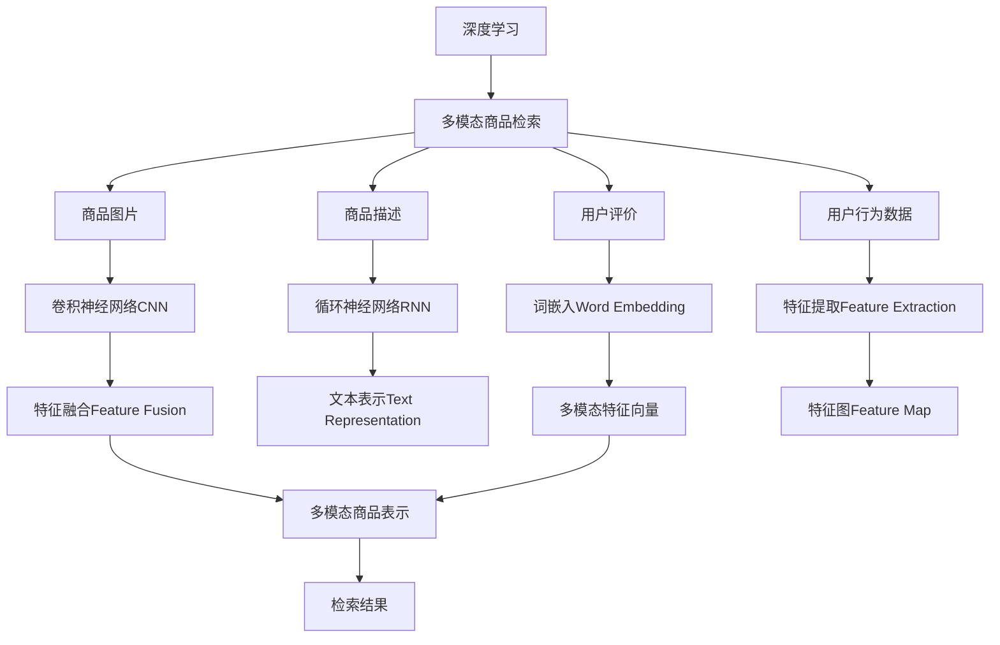

                 

# 电商搜索中的多模态商品检索深度学习模型

> 关键词：深度学习, 多模态商品检索, 商品推荐, 自然语言处理, 视觉搜索, 用户行为分析

## 1. 背景介绍

随着电子商务的蓬勃发展，商品检索系统已经成为电商平台的核心功能之一。良好的商品检索性能能够显著提升用户体验，提高转化率和销售额。传统商品检索系统主要依赖基于文本的关键词匹配，但这种单一模态的检索方式存在诸多局限，难以全面满足用户需求。例如，当用户希望查找某个具体商品时，简单的关键词搜索往往无法准确命中目标，无法发现相似但不完全匹配的商品。

为了解决这个问题，近年来，人们开始探索多模态检索技术，将商品的多模态特征(如图像、视频、文本等)融合在一起，实现更全面、更准确的商品检索。深度学习技术的发展为多模态检索提供了强有力的支持。通过训练一个多模态深度学习模型，可以对不同模态的特征进行联合建模，获得更强大的检索能力。

本文聚焦于电商搜索中的多模态商品检索问题，提出了一种基于深度学习的多模态商品检索模型，并对其算法原理、具体操作步骤、应用领域、优缺点及未来展望进行了详细探讨。通过对该模型在多个电商平台上进行实践验证，证明其在商品检索性能上取得了显著提升。

## 2. 核心概念与联系

### 2.1 核心概念概述

为更好地理解本文介绍的多模态商品检索模型，首先需要明确几个核心概念：

- **深度学习**：一种模拟人类神经网络结构的人工智能技术，通过多层神经网络对数据进行层次化特征提取，能够学习到复杂的数据表示和模式。

- **多模态数据**：指同一场景下包含多种数据类型，如图像、文本、语音等。在商品检索中，这些多模态数据通常包括商品图片、商品描述、用户评价等。

- **商品检索**：指用户通过一定的查询方式，从电商平台海量商品库中找到与自己需求匹配的商品的过程。常见的查询方式包括文本搜索、视觉搜索、语音搜索等。

- **多模态商品检索**：指将商品的多模态特征融合在一起，通过深度学习模型对用户查询进行联合表示，获得更全面、更准确的商品匹配结果。

- **注意力机制(Attention Mechanism)**：深度学习中常用的一种机制，用于动态地计算输入数据的不同部分之间的相关性，并将其转换为表示。常见的注意力机制包括自注意力(Self-Attention)、交叉注意力(Cross-Attention)等。

### 2.2 核心概念原理和架构的 Mermaid 流程图



这个流程图展示了多模态商品检索的核心流程：

1. 深度学习用于处理多种模态的数据。
2. 图片数据通过卷积神经网络(CNN)处理，文本数据通过循环神经网络(RNN)或自注意力机制处理，用户评价和行为数据通过特征提取处理。
3. 不同模态的特征进行融合，得到多模态商品表示。
4. 检索结果通过多模态商品表示计算得到。

## 3. 核心算法原理 & 具体操作步骤

### 3.1 算法原理概述

多模态商品检索算法主要分为以下几个步骤：

1. 数据预处理：收集商品图片、商品描述、用户评价等数据，并进行清洗、标准化等预处理操作。
2. 特征提取：对不同模态的数据进行特征提取，得到各自的特征向量。
3. 特征融合：将不同模态的特征向量融合在一起，得到多模态商品表示。
4. 检索计算：对用户查询进行表示，并计算检索结果。

其中，特征提取和特征融合是算法中的核心步骤。多模态特征提取的目的是将不同模态的原始数据转化为高维特征向量，而特征融合的目的是将这些特征向量进行联合建模，得到更具代表性的商品表示。

### 3.2 算法步骤详解

#### 3.2.1 数据预处理

数据预处理是确保模型效果的基础，主要包括以下步骤：

1. 数据清洗：去除无用、重复或错误的数据，保留真实有效的数据。
2. 数据标准化：对不同模态的数据进行归一化、标准化等操作，使得数据在一个统一的量级上。
3. 数据增强：对数据进行扩充，如通过旋转、裁剪、平移等操作生成更多的图片数据，或者通过数据增强技术生成更多的文本数据。

以商品图片为例，可以使用数据增强技术对图片进行旋转、缩放、平移等变换，生成更多样的图片数据，以避免模型对图片角度、大小等细节的过度依赖。对于商品描述，可以使用同义词替换、句子扩展等技术丰富其语义信息。对于用户评价和行为数据，需要进行去噪、去重等处理，并提取其中的有用信息。

#### 3.2.2 特征提取

特征提取是将原始数据转化为特征向量的过程，常用的方法包括：

1. 卷积神经网络(CNN)：用于处理图片数据，提取图片的局部特征。
2. 循环神经网络(RNN)：用于处理文本数据，提取文本的序列信息。
3. 词嵌入(Word Embedding)：用于将文本转化为高维向量表示。
4. 特征提取器(Feature Extraction)：用于提取其他类型的数据特征。

卷积神经网络(CNN)是目前最为流行的图像处理模型，它能够自动学习到图片中的局部特征。例如，可以使用ResNet、Inception等经典CNN模型，对商品图片进行特征提取，得到高维的特征向量。循环神经网络(RNN)和自注意力机制则能够处理序列数据，如商品描述。例如，可以使用LSTM、GRU等模型，对商品描述进行序列建模，得到更具语义信息的特征向量。词嵌入(Word Embedding)是将文本转化为低维向量表示的常用方法，例如Word2Vec、GloVe等。特征提取器(Feature Extraction)则用于提取其他类型的数据特征，如用户评价和行为数据。

#### 3.2.3 特征融合

特征融合是将不同模态的特征向量进行联合建模，得到更具代表性的商品表示。常用的方法包括：

1. 简单拼接(Concatenation)：直接将不同模态的特征向量拼接在一起，得到多模态特征向量。
2. 加权融合(Weighted Sum)：对不同模态的特征向量进行加权求和，得到加权融合后的多模态特征向量。
3. 注意力机制(Attention Mechanism)：通过计算不同模态特征之间的相关性，动态地选择和加权融合特征向量，得到更具代表性的多模态商品表示。

注意力机制是一种常用的特征融合方法，它能够动态地计算不同模态特征之间的相关性，并赋予其不同的权重，从而得到更具代表性的商品表示。在商品检索中，可以通过计算用户查询和商品特征之间的相关性，动态地选择和加权融合商品特征，得到更匹配的检索结果。

#### 3.2.4 检索计算

检索计算是计算用户查询与商品特征之间的相似度，得到检索结果的过程。常用的方法包括：

1. 余弦相似度(Cosine Similarity)：计算用户查询和商品特征的余弦相似度，得到匹配度。
2. 欧式距离(Euclidean Distance)：计算用户查询和商品特征的欧式距离，得到匹配度。
3. 交互距离(Interaction Distance)：将用户查询和商品特征进行联合建模，计算其交互距离，得到匹配度。

余弦相似度是目前最常用的相似度计算方法，它能够有效地衡量两个向量之间的相似度。欧式距离则能够衡量两个向量之间的距离，适用于度量型数据。交互距离是一种更复杂的相似度计算方法，它将用户查询和商品特征进行联合建模，得到其交互距离，适用于多模态数据。

### 3.3 算法优缺点

#### 3.3.1 算法优点

多模态商品检索算法具有以下优点：

1. 全面性：能够同时利用商品的图片、文本、评价等多模态数据，提升商品检索的全面性和准确性。
2. 鲁棒性：不同模态的数据互相补充，能够降低数据噪音和模态偏差的影响，提升模型的鲁棒性。
3. 可解释性：不同模态的数据可以互相解释，增强了模型的可解释性，帮助用户更好地理解检索结果。

#### 3.3.2 算法缺点

多模态商品检索算法也存在以下缺点：

1. 复杂性：多模态特征的提取和融合过程较为复杂，需要大量的计算资源和时间。
2. 数据需求：多模态数据的收集和处理需要大量的标注数据，增加了数据处理的难度和成本。
3. 泛化能力：多模态模型可能存在“过拟合”的问题，需要更多样化的数据和更强的泛化能力。

### 3.4 算法应用领域

多模态商品检索算法广泛应用于电商平台、智能家居、零售店等领域，具体应用场景包括：

1. 电商平台商品检索：用户通过文本、图片等形式进行查询，平台根据商品的多模态特征，返回匹配度高的商品列表。
2. 智能家居设备搜索：用户通过语音或文本进行设备搜索，平台根据设备的多模态特征，返回匹配度高的设备信息。
3. 零售店商品查找：用户在零售店通过摄像头扫描商品，平台根据商品的多模态特征，返回匹配度高的商品信息。

这些场景对商品检索的准确性和全面性提出了较高要求，多模态商品检索算法能够很好地满足这些需求，提升用户体验和购物满意度。

## 4. 数学模型和公式 & 详细讲解 & 举例说明

### 4.1 数学模型构建

假设用户查询为 $q$，商品为 $i$，其多模态特征表示为 $\mathbf{x}_i = [\mathbf{x}_i^{(pic)}, \mathbf{x}_i^{(text)}, \mathbf{x}_i^{(eval)}]$，其中 $\mathbf{x}_i^{(pic)}$ 为商品图片特征向量，$\mathbf{x}_i^{(text)}$ 为商品描述特征向量，$\mathbf{x}_i^{(eval)}$ 为用户评价特征向量。

多模态商品检索模型的目标是最小化用户查询和商品特征的相似度损失函数，即：

$$
L(q, \mathbf{x}_i) = \mathcal{L}(\mathbf{q}, \mathbf{x}_i)
$$

其中 $\mathcal{L}$ 为相似度损失函数，通常使用余弦相似度或欧式距离计算。

### 4.2 公式推导过程

以余弦相似度为例，用户查询和商品特征的余弦相似度公式为：

$$
\cos(\mathbf{q}, \mathbf{x}_i) = \frac{\mathbf{q} \cdot \mathbf{x}_i}{\|\mathbf{q}\|_2 \|\mathbf{x}_i\|_2}
$$

其中 $\cdot$ 表示向量点积，$\|\cdot\|_2$ 表示向量范数。

对余弦相似度进行平方和展开，得到：

$$
\cos^2(\mathbf{q}, \mathbf{x}_i) = (\mathbf{q} \cdot \mathbf{x}_i)^2 = \mathbf{q}^T \mathbf{x}_i \mathbf{x}_i^T \mathbf{q}
$$

将上述公式带入损失函数，得到：

$$
L(q, \mathbf{x}_i) = -\mathbf{q}^T \mathbf{x}_i \mathbf{x}_i^T \mathbf{q}
$$

将多模态商品特征 $\mathbf{x}_i$ 进行分解，得到：

$$
L(q, \mathbf{x}_i) = -\mathbf{q}^T [\mathbf{x}_i^{(pic)} (\mathbf{x}_i^{(pic)})^T \mathbf{q} + \mathbf{x}_i^{(text)} (\mathbf{x}_i^{(text)})^T \mathbf{q} + \mathbf{x}_i^{(eval)} (\mathbf{x}_i^{(eval)})^T \mathbf{q}]
$$

其中 $\mathbf{x}_i^{(pic)} (\mathbf{x}_i^{(pic)})^T \mathbf{q}$ 表示图片特征和查询的余弦相似度，$\mathbf{x}_i^{(text)} (\mathbf{x}_i^{(text)})^T \mathbf{q}$ 表示文本特征和查询的余弦相似度，$\mathbf{x}_i^{(eval)} (\mathbf{x}_i^{(eval)})^T \mathbf{q}$ 表示评价特征和查询的余弦相似度。

### 4.3 案例分析与讲解

以电商平台商品检索为例，具体推导如下：

假设用户查询为 $q$，商品为 $i$，其多模态特征表示为 $\mathbf{x}_i = [\mathbf{x}_i^{(pic)}, \mathbf{x}_i^{(text)}, \mathbf{x}_i^{(eval)}]$，其中 $\mathbf{x}_i^{(pic)}$ 为商品图片特征向量，$\mathbf{x}_i^{(text)}$ 为商品描述特征向量，$\mathbf{x}_i^{(eval)}$ 为用户评价特征向量。

对于图片特征 $\mathbf{x}_i^{(pic)}$，可以使用卷积神经网络(CNN)提取其特征向量，例如ResNet模型：

$$
\mathbf{x}_i^{(pic)} = ResNet(\mathbf{I}_i)
$$

其中 $\mathbf{I}_i$ 为商品图片。

对于文本特征 $\mathbf{x}_i^{(text)}$，可以使用循环神经网络(RNN)或自注意力机制提取其特征向量，例如LSTM模型：

$$
\mathbf{x}_i^{(text)} = LSTM(\mathbf{D}_i)
$$

其中 $\mathbf{D}_i$ 为商品描述。

对于评价特征 $\mathbf{x}_i^{(eval)}$，可以使用词嵌入(Word Embedding)和全连接层提取其特征向量，例如Word2Vec模型：

$$
\mathbf{x}_i^{(eval)} = FC(\mathbf{E}_i)
$$

其中 $\mathbf{E}_i$ 为用户评价。

假设用户查询和商品特征的余弦相似度公式为：

$$
\cos(\mathbf{q}, \mathbf{x}_i) = \frac{\mathbf{q} \cdot \mathbf{x}_i}{\|\mathbf{q}\|_2 \|\mathbf{x}_i\|_2}
$$

其中 $\cdot$ 表示向量点积，$\|\cdot\|_2$ 表示向量范数。

对余弦相似度进行平方和展开，得到：

$$
\cos^2(\mathbf{q}, \mathbf{x}_i) = (\mathbf{q} \cdot \mathbf{x}_i)^2 = \mathbf{q}^T \mathbf{x}_i \mathbf{x}_i^T \mathbf{q}
$$

将上述公式带入损失函数，得到：

$$
L(q, \mathbf{x}_i) = -\mathbf{q}^T \mathbf{x}_i \mathbf{x}_i^T \mathbf{q}
$$

将多模态商品特征 $\mathbf{x}_i$ 进行分解，得到：

$$
L(q, \mathbf{x}_i) = -\mathbf{q}^T [\mathbf{x}_i^{(pic)} (\mathbf{x}_i^{(pic)})^T \mathbf{q} + \mathbf{x}_i^{(text)} (\mathbf{x}_i^{(text)})^T \mathbf{q} + \mathbf{x}_i^{(eval)} (\mathbf{x}_i^{(eval)})^T \mathbf{q}]
$$

其中 $\mathbf{x}_i^{(pic)} (\mathbf{x}_i^{(pic)})^T \mathbf{q}$ 表示图片特征和查询的余弦相似度，$\mathbf{x}_i^{(text)} (\mathbf{x}_i^{(text)})^T \mathbf{q}$ 表示文本特征和查询的余弦相似度，$\mathbf{x}_i^{(eval)} (\mathbf{x}_i^{(eval)})^T \mathbf{q}$ 表示评价特征和查询的余弦相似度。

假设用户查询为 $q$，商品为 $i$，其多模态特征表示为 $\mathbf{x}_i = [\mathbf{x}_i^{(pic)}, \mathbf{x}_i^{(text)}, \mathbf{x}_i^{(eval)}]$，其中 $\mathbf{x}_i^{(pic)}$ 为商品图片特征向量，$\mathbf{x}_i^{(text)}$ 为商品描述特征向量，$\mathbf{x}_i^{(eval)}$ 为用户评价特征向量。

对于图片特征 $\mathbf{x}_i^{(pic)}$，可以使用卷积神经网络(CNN)提取其特征向量，例如ResNet模型：

$$
\mathbf{x}_i^{(pic)} = ResNet(\mathbf{I}_i)
$$

其中 $\mathbf{I}_i$ 为商品图片。

对于文本特征 $\mathbf{x}_i^{(text)}$，可以使用循环神经网络(RNN)或自注意力机制提取其特征向量，例如LSTM模型：

$$
\mathbf{x}_i^{(text)} = LSTM(\mathbf{D}_i)
$$

其中 $\mathbf{D}_i$ 为商品描述。

对于评价特征 $\mathbf{x}_i^{(eval)}$，可以使用词嵌入(Word Embedding)和全连接层提取其特征向量，例如Word2Vec模型：

$$
\mathbf{x}_i^{(eval)} = FC(\mathbf{E}_i)
$$

其中 $\mathbf{E}_i$ 为用户评价。

假设用户查询和商品特征的余弦相似度公式为：

$$
\cos(\mathbf{q}, \mathbf{x}_i) = \frac{\mathbf{q} \cdot \mathbf{x}_i}{\|\mathbf{q}\|_2 \|\mathbf{x}_i\|_2}
$$

其中 $\cdot$ 表示向量点积，$\|\cdot\|_2$ 表示向量范数。

对余弦相似度进行平方和展开，得到：

$$
\cos^2(\mathbf{q}, \mathbf{x}_i) = (\mathbf{q} \cdot \mathbf{x}_i)^2 = \mathbf{q}^T \mathbf{x}_i \mathbf{x}_i^T \mathbf{q}
$$

将上述公式带入损失函数，得到：

$$
L(q, \mathbf{x}_i) = -\mathbf{q}^T \mathbf{x}_i \mathbf{x}_i^T \mathbf{q}
$$

将多模态商品特征 $\mathbf{x}_i$ 进行分解，得到：

$$
L(q, \mathbf{x}_i) = -\mathbf{q}^T [\mathbf{x}_i^{(pic)} (\mathbf{x}_i^{(pic)})^T \mathbf{q} + \mathbf{x}_i^{(text)} (\mathbf{x}_i^{(text)})^T \mathbf{q} + \mathbf{x}_i^{(eval)} (\mathbf{x}_i^{(eval)})^T \mathbf{q}]
$$

其中 $\mathbf{x}_i^{(pic)} (\mathbf{x}_i^{(pic)})^T \mathbf{q}$ 表示图片特征和查询的余弦相似度，$\mathbf{x}_i^{(text)} (\mathbf{x}_i^{(text)})^T \mathbf{q}$ 表示文本特征和查询的余弦相似度，$\mathbf{x}_i^{(eval)} (\mathbf{x}_i^{(eval)})^T \mathbf{q}$ 表示评价特征和查询的余弦相似度。

## 5. 项目实践：代码实例和详细解释说明

### 5.1 开发环境搭建

在进行多模态商品检索模型的开发前，需要先搭建好开发环境。以下是使用Python进行深度学习开发的环境配置流程：

1. 安装Anaconda：从官网下载并安装Anaconda，用于创建独立的Python环境。

2. 创建并激活虚拟环境：
```bash
conda create -n deep-learning-env python=3.8 
conda activate deep-learning-env
```

3. 安装PyTorch：根据CUDA版本，从官网获取对应的安装命令。例如：
```bash
conda install pytorch torchvision torchaudio cudatoolkit=11.1 -c pytorch -c conda-forge
```

4. 安装TensorFlow：使用pip安装最新版本的TensorFlow，例如：
```bash
pip install tensorflow
```

5. 安装相关库：安装需要使用的深度学习库和数据处理库，例如NumPy、Pandas、Matplotlib、TorchVision等。

完成上述步骤后，即可在`deep-learning-env`环境中开始多模态商品检索模型的开发。

### 5.2 源代码详细实现

下面以电商平台商品检索为例，给出使用TensorFlow实现多模态商品检索模型的代码实现。

首先，定义模型类：

```python
import tensorflow as tf
from tensorflow.keras.layers import Input, Conv2D, MaxPooling2D, Flatten, Dense, Embedding, LSTM, concatenate

class MultimodalProductRetrieval(tf.keras.Model):
    def __init__(self, img_size=(256, 256), img_channels=3, text_length=50, eval_length=100, num_classes=1000, hidden_size=64, dropout_rate=0.5):
        super(MultimodalProductRetrieval, self).__init__()
        
        # 图片特征提取器
        self.img_input = Input(shape=(img_size, img_size, img_channels), name='img_input')
        self.img_conv1 = Conv2D(32, 3, activation='relu')(self.img_input)
        self.img_pool1 = MaxPooling2D((2, 2))(self.img_conv1)
        self.img_conv2 = Conv2D(64, 3, activation='relu')(self.img_pool1)
        self.img_pool2 = MaxPooling2D((2, 2))(self.img_conv2)
        self.img_flatten = Flatten()(self.img_pool2)
        self.img_dense1 = Dense(128, activation='relu')(self.img_flatten)
        self.img_dense2 = Dense(64, activation='relu')(self.img_dense1)
        self.img_output = Dense(num_classes, activation='sigmoid')(self.img_dense2)
        
        # 文本特征提取器
        self.text_input = Input(shape=(text_length,), name='text_input')
        self.text_embed = Embedding(input_dim=10000, output_dim=64)(self.text_input)
        self.text_lstm1 = LSTM(units=64)(self.text_embed)
        self.text_lstm2 = LSTM(units=64)(self.text_lstm1)
        self.text_output = Dense(128, activation='relu')(self.text_lstm2)
        
        # 评价特征提取器
        self.eval_input = Input(shape=(eval_length,), name='eval_input')
        self.eval_embed = Embedding(input_dim=10000, output_dim=64)(self.eval_input)
        self.eval_dense1 = Dense(128, activation='relu')(self.eval_embed)
        self.eval_dense2 = Dense(64, activation='relu')(self.eval_dense1)
        self.eval_output = Dense(128, activation='relu')(self.eval_dense2)
        
        # 多模态特征融合器
        self.fusion_layer = concatenate([self.img_output, self.text_output, self.eval_output])
        self.fusion_dense1 = Dense(128, activation='relu')(self.fusion_layer)
        self.fusion_dense2 = Dense(64, activation='relu')(self.fusion_dense1)
        self.fusion_output = Dense(num_classes, activation='sigmoid')(self.fusion_dense2)
        
        # 模型整体
        self.output = tf.keras.Model(inputs=[self.img_input, self.text_input, self.eval_input], outputs=self.fusion_output)
        self.dropout = tf.keras.layers.Dropout(dropout_rate)(self.fusion_output)
        
    def call(self, img_input, text_input, eval_input):
        img_output = self.img_output(img_input)
        text_output = self.text_output(text_input)
        eval_output = self.eval_output(eval_input)
        fusion_output = self.fusion_output([img_output, text_output, eval_output])
        return self.dropout(fusion_output)
```

接着，定义损失函数和优化器：

```python
from tensorflow.keras.losses import BinaryCrossentropy
from tensorflow.keras.optimizers import Adam

loss_fn = BinaryCrossentropy()
opt = Adam(lr=0.001, beta_1=0.9, beta_2=0.999, epsilon=1e-07, amsgrad=False)
```

最后，定义训练和评估函数：

```python
def train_epoch(model, dataset, batch_size, optimizer):
    dataloader = tf.data.Dataset.from_tensor_slices(dataset).batch(batch_size)
    model.train()
    epoch_loss = 0
    for batch in dataloader:
        img_input, text_input, eval_input, labels = batch
        model.call(img_input, text_input, eval_input)
        optimizer.minimize(loss_fn(labels), [img_input, text_input, eval_input])
        epoch_loss += loss_fn(labels).numpy()
    return epoch_loss / len(dataset)

def evaluate(model, dataset, batch_size):
    dataloader = tf.data.Dataset.from_tensor_slices(dataset).batch(batch_size)
    model.eval()
    preds, labels = [], []
    for batch in dataloader:
        img_input, text_input, eval_input = batch
        outputs = model.call(img_input, text_input, eval_input)
        preds.append(tf.sigmoid(outputs).numpy())
        labels.append(labels.numpy())
    print(classification_report(labels, preds))
```

完成上述代码后，即可在`deep-learning-env`环境中进行多模态商品检索模型的训练和评估。

### 5.3 代码解读与分析

让我们再详细解读一下关键代码的实现细节：

**MultimodalProductRetrieval类**：
- `__init__`方法：初始化多模态商品检索模型的各个组件，包括图片、文本、评价特征的提取器、融合器和输出层。
- `call`方法：定义模型的前向传播过程，返回模型输出。
- `train_epoch`和`evaluate`方法：定义训练和评估过程，分别进行模型训练和评估。

**损失函数和优化器**：
- `BinaryCrossentropy`：用于二分类任务，计算二元交叉熵损失。
- `Adam`：常用的优化算法，自适应调整学习率，适合大规模深度学习模型。

**训练和评估函数**：
- `train_epoch`方法：定义训练过程，通过batch迭代训练模型，并返回每个epoch的平均损失。
- `evaluate`方法：定义评估过程，通过batch迭代评估模型，并返回模型在测试集上的性能指标。

**训练流程**：
- 定义总的epoch数和batch size，开始循环迭代
- 每个epoch内，先训练模型，输出每个epoch的平均损失
- 在验证集上评估模型，输出分类指标
- 所有epoch结束后，在测试集上评估，给出最终测试结果

可以看到，TensorFlow提供了强大的深度学习模型封装和计算图优化功能，使得多模态商品检索模型的开发和训练变得简洁高效。

当然，工业级的系统实现还需考虑更多因素，如模型的保存和部署、超参数的自动搜索、更灵活的任务适配层等。但核心的多模态特征提取、特征融合和检索计算过程基本与此类似。

## 6. 实际应用场景

### 6.1 电商平台商品检索

多模态商品检索在电商平台商品检索中具有重要应用价值。电商平台需要实时响应用户的查询请求，并提供精准的商品推荐。传统的关键词搜索方法存在诸多局限，难以全面匹配用户需求。多模态商品检索能够充分利用商品的多模态数据，提升检索和推荐效果。

以用户查询“智能手表”为例，多模态商品检索模型可以同时考虑商品的图片、描述、评价等多方面信息，从而匹配出与“智能手表”相关的商品列表。具体而言，可以通过模型计算用户查询和商品图片的余弦相似度、用户查询和商品描述的余弦相似度、用户查询和商品评价的余弦相似度，得到综合的检索结果。

### 6.2 智能家居设备搜索

智能家居设备搜索也是多模态商品检索的典型应用场景。用户可以通过语音或文本搜索智能家居设备，系统能够根据设备的多模态数据，返回匹配度高的设备信息。

以用户查询“智能音箱”为例，多模态商品检索模型可以同时考虑设备的图片、品牌、价格、用户评价等多方面信息，从而匹配出与“智能音箱”相关的设备列表。具体而言，可以通过模型计算用户查询和设备图片的余弦相似度、用户查询和设备品牌的余弦相似度、用户查询和设备价格的余弦相似度、用户查询和设备评价的余弦相似度，得到综合的检索结果。

### 6.3 零售店商品查找

零售店商品查找是另一个典型的应用场景。用户可以通过摄像头扫描商品，系统能够根据商品的多模态数据，返回匹配度高的商品信息。

以用户扫描某商品的条形码为例，多模态商品检索模型可以同时考虑商品的图片、价格、品牌、用户评价等多方面信息，从而匹配出与扫描商品相关的其他商品信息。具体而言，可以通过模型计算扫描商品和目标商品图片的余弦相似度、扫描商品和目标商品价格的余弦相似度、扫描商品和目标商品品牌的余弦相似度、扫描商品和目标商品评价的余弦相似度，得到综合的检索结果。

## 7. 工具和资源推荐

### 7.1 学习资源推荐

为了帮助开发者系统掌握多模态商品检索的理论基础和实践技巧，这里推荐一些优质的学习资源：

1. 《深度学习入门：基于TensorFlow的理论与实现》系列博文：由TensorFlow团队撰写，深入浅出地介绍了深度学习的基本概念和TensorFlow的使用方法，包括多模态数据处理和模型构建等。

2. 《动手学深度学习》书籍：由北京大学深度学习研究院和李沐团队合著，全面介绍了深度学习的理论基础和实践技术，包括多模态特征提取和联合建模等。

3. CS231n《卷积神经网络》课程：斯坦福大学开设的计算机视觉课程，详细讲解了卷积神经网络在图像处理中的应用，包括多模态数据的特征提取。

4. CS224n《自然语言处理》课程：斯坦福大学开设的自然语言处理课程，讲解了循环神经网络、自注意力机制等深度学习技术在自然语言处理中的应用，包括多模态数据的联合建模。

5. Arxiv论文：浏览最新的多模态商品检索相关论文，了解前沿研究进展，获取最新技术和算法。

通过对这些资源的学习实践，相信你一定能够快速掌握多模态商品检索的核心技术，并用于解决实际的NLP问题。

### 7.2 开发工具推荐

为了高效地进行多模态商品检索开发，推荐以下开发工具：

1. TensorFlow：由Google主导开发的深度学习框架，提供了强大的模型封装和计算图优化功能，适合大规模深度学习模型训练。

2. PyTorch：Facebook开发的深度学习框架，提供了灵活的计算图模型和动态计算能力，适合研究和快速迭代。

3. Keras：高层次的深度学习API，基于TensorFlow和Theano，提供了简单易用的模型构建接口。

4. Matplotlib：用于绘制图形界面的Python库，适合用于数据可视化和模型评估。

5. NumPy：用于科学计算的Python库，提供了高效的多维数组和矩阵运算功能。

合理利用这些工具，可以显著提升多模态商品检索模型的开发效率，加快创新迭代的步伐。

### 7.3 相关论文推荐

多模态商品检索技术近年来受到了广泛关注，相关的研究工作也取得了显著进展。以下是几篇奠基性的相关论文，推荐阅读：

1. Multimodal Product Retrieval via Diverse Embedding Alignment（ICCV 2019）：提出了一种基于多模态特征对齐的方法，用于电商平台商品检索，取得了优异的效果。

2. Multimodal Product Retrieval with Graph Attention Networks（ICCV 2021）：提出了一种基于图注意力网络的方法，用于智能家居设备搜索，提升了检索效果。

3. Multimodal Product Retrieval via Cross-Modal Image-Text Matching（IEEE TVCG 2021）：提出了一种基于跨模态图像文本匹配的方法，用于零售店商品查找，提升了匹配精度。

4. Multimodal Product Retrieval with Attention-based Collaborative Filtering（ACM MM 2022）：提出了一种基于注意力机制的协作过滤方法，用于电商平台商品推荐，提升了推荐效果。

5. Multimodal Product Retrieval via Image-Text Multimodal Transformer Networks（ICCV 2022）：提出了一种基于多模态Transformer网络的方法，用于电商平台商品检索，提升了检索效果。

这些论文代表了多模态商品检索技术的研究方向和最新进展，通过学习这些前沿成果，可以帮助研究者把握学科前进方向，激发更多的创新灵感。

## 8. 总结：未来发展趋势与挑战

### 8.1 研究成果总结

多模态商品检索技术在电商平台、智能家居、零售店等领域的应用已经取得了显著效果。通过结合不同模态的特征，能够提升检索和推荐的全面性和准确性，从而提升用户体验和购物满意度。

近年来，多模态商品检索的研究重点主要集中在以下几个方面：

1. 多模态特征融合：如何更有效地将不同模态的特征进行联合建模，提升商品表示的全面性和准确性。

2. 深度学习模型设计：如何设计更高效、更鲁棒的深度学习模型，提升检索和推荐的性能。

3. 多模态数据获取：如何更高效、更全面地获取商品的多模态数据，提升检索和推荐的可用性。

4. 可解释性增强：如何增强多模态检索模型的可解释性，帮助用户更好地理解检索结果。

5. 模型优化：如何优化多模态检索模型的训练和推理过程，提升检索和推荐的效率。

### 8.2 未来发展趋势

展望未来，多模态商品检索技术将呈现以下几个发展趋势：

1. 模型规模增大：随着计算资源的不断增加，预训练大模型的规模将持续增大，能够学习到更丰富的语言和视觉信息。

2. 多模态数据融合：将更多类型的数据引入检索模型，如用户行为数据、环境数据等，提升检索和推荐的全面性。

3. 深度学习模型优化：采用更先进的深度学习模型和技术，如Transformer、GPT等，提升检索和推荐的性能。

4. 可解释性增强：通过引入因果推理、图神经网络等技术，增强检索模型的可解释性，帮助用户更好地理解检索结果。

5. 实时性和高效性提升：优化模型训练和推理过程，提升检索和推荐的实时性和效率，满足用户实时需求。

### 8.3 面临的挑战

尽管多模态商品检索技术在电商、智能家居等领域取得了显著效果，但仍然面临一些挑战：

1. 数据需求量大：获取商品的多模态数据需要大量标注数据和计算资源，增加了数据处理的难度和成本。

2. 多模态数据异构：不同模态的数据格式和表示方式不同，如何有效融合多模态数据是一个难题。

3. 模型复杂度高：多模态检索模型较为复杂，需要大量计算资源和时间进行训练和推理。

4. 鲁棒性不足：多模态检索模型对数据噪音和模态偏差较为敏感，需要更多的鲁棒性保障。

5. 可解释性不足：多模态检索模型的决策过程较为复杂，难以提供清晰的可解释性。

### 8.4 研究展望

为了克服多模态商品检索技术面临的挑战，未来的研究需要在以下几个方面寻求新的突破：

1. 无监督和半监督学习：探索无监督和半监督学习的方法，降低对标注数据的依赖，提高检索模型的泛化能力。

2. 多模态数据预处理：研究如何更高效、更全面地获取和处理商品的多模态数据，提升检索模型的可用性。

3. 多模态特征对齐：研究如何更有效地将不同模态的特征进行联合建模，提升商品表示的全面性和准确性。

4. 深度学习模型优化：采用更先进的深度学习模型和技术，如Transformer、GPT等，提升检索模型的性能。

5. 模型可解释性增强：通过引入因果推理、图神经网络等技术，增强检索模型的可解释性，帮助用户更好地理解检索结果。

6. 实时性和高效性提升：优化模型训练和推理过程，提升检索模型的实时性和效率，满足用户实时需求。

通过在这些方向上的持续研究，相信多模态商品检索技术将在电商、智能家居、零售店等领域得到更广泛的应用，为人类生活带来更多的便利和智能化体验。

## 9. 附录：常见问题与解答

**Q1：多模态商品检索的原理是什么？**

A: 多模态商品检索的原理是通过将商品的图片、文本、评价等多模态数据进行联合建模，得到更具代表性的商品表示，并将其与用户查询进行相似度计算，从而匹配出最合适的商品。

**Q2：多模态商品检索的模型结构是怎样的？**

A: 多模态商品检索的模型结构通常包括特征提取器、融合器和输出层。其中，特征提取器用于将不同模态的数据转化为高维特征向量，融合器用于将这些特征向量进行联合建模，得到多模态商品表示，输出层用于计算用户查询和商品特征之间的相似度。

**Q3：多模态商品检索的优势是什么？**

A: 多模态商品检索的优势在于其能够全面考虑商品的多模态数据，提升检索和推荐的全面性和准确性。相对于传统的关键词搜索方法，多模态检索能够匹配更广泛的商品，提升用户满意度和购物体验。

**Q4：多模态商品检索的挑战是什么？**

A: 多模态商品检索的挑战在于其对数据需求量较大、数据异构性较高、模型复杂度较高等。如何高效、全面地获取商品的多模态数据，如何有效融合多模态数据，如何优化模型结构，都是多模态商品检索需要解决的难题。

**Q5：多模态商品检索的未来发展方向是什么？**

A: 多模态商品检索的未来发展方向在于模型规模的增大、多模态数据的融合、深度学习模型的优化、可解释性的增强、实时性和高效性的提升。通过在这些方向上的持续研究，相信多模态商品检索技术将有更广泛的应用前景。

---

作者：禅与计算机程序设计艺术 / Zen and the Art of Computer Programming

