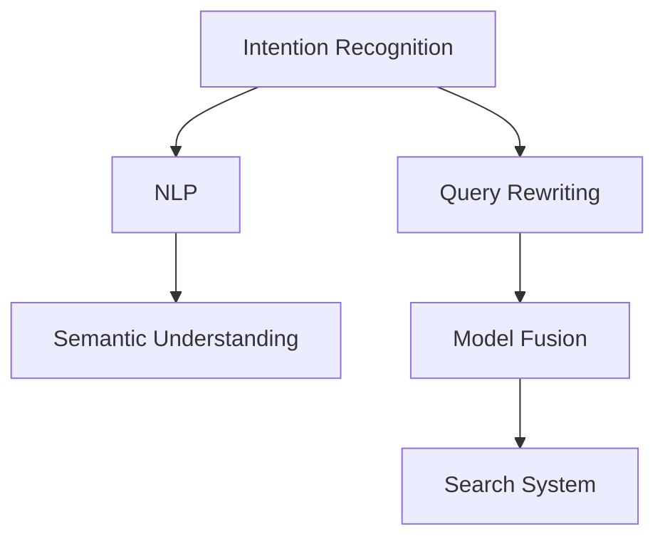

                 

# 电商搜索中的意图识别与查询改写联合优化

## 1. 背景介绍

### 1.1 问题由来

电商搜索系统是电商网站的核心功能之一，它通过用户输入的查询词语快速定位到相关商品，帮助用户快速找到所需商品。然而，由于用户输入的查询语句往往具有歧义和模糊性，电商搜索系统在处理这些查询时容易产生错误的结果，影响用户体验和平台转化率。因此，如何在电商搜索中准确识别用户查询意图，并实现有效的查询改写，成为了亟待解决的重要问题。

### 1.2 问题核心关键点

电商搜索系统通常面临以下核心问题：

1. **意图识别准确性**：用户查询意图的准确识别是电商搜索的前提。用户可能输入模糊或拼写错误的查询，如“买电脑”和“卖电脑”，系统需要能够准确分辨出用户想要购买的意图。

2. **查询改写效果**：电商搜索系统的查询改写技术需要将用户模糊或错误查询转换为精确的查询词语，如将“买电脑”转换为“电脑购买”。这需要系统具有很强的语义理解和生成能力。

3. **多轮交互优化**：电商搜索往往涉及多轮对话，如先查询商品，再询问评价或咨询客服。系统需要能够维护上下文信息，提供连贯的对话服务。

4. **计算资源效率**：电商搜索系统需要处理大量的查询请求，因此需要高效且可扩展的算法和架构支持。

### 1.3 问题研究意义

研究电商搜索中的意图识别与查询改写联合优化，对于提升电商平台的搜索体验和转化率具有重要意义：

1. **提高搜索准确性**：通过意图识别和查询改写技术，可以有效减少用户查询的歧义和模糊性，提高搜索结果的相关性和准确性。
2. **提升用户体验**：优秀的电商搜索系统能够快速响应用户需求，提供符合预期的搜索结果和互动体验。
3. **增加用户满意度**：准确的意图识别和改写可以避免用户因误搜索而产生的困扰和不满，提升用户对平台的满意度。
4. **促进电商业务发展**：良好的搜索体验有助于增加用户粘性和购买转化，推动电商业务的持续增长。

## 2. 核心概念与联系

### 2.1 核心概念概述

为了更好地理解电商搜索中的意图识别与查询改写联合优化方法，本节将介绍几个密切相关的核心概念：

- **意图识别**：指通过自然语言处理技术，自动理解用户查询语句所表达的意图，如“购买”、“浏览”、“咨询”等。
- **查询改写**：指对用户输入的查询语句进行改写，使其更加准确和规范化，从而提高搜索系统的匹配度和准确性。
- **自然语言处理(NLP)**：通过计算机对人类语言进行自动化处理，包括语言理解、生成、分析等。
- **语义理解**：指对文本中的语义信息进行深入理解和解析，以便更好地进行信息匹配和处理。
- **模型融合**：通过多种算法和模型的组合使用，提升整体系统的性能和鲁棒性。

这些核心概念之间的逻辑关系可以通过以下Mermaid流程图来展示：



这个流程图展示了大语言模型在电商搜索中的意图识别与查询改写的核心概念及其之间的关系：

1. 电商搜索首先通过意图识别技术，自动理解用户查询的意图。
2. 接着，将用户查询进行改写，以便更好地匹配电商搜索系统中的商品信息。
3. 自然语言处理(NLP)技术在语义理解方面提供支持，帮助意图识别和查询改写技术提升准确性。
4. 模型融合技术将多种算法和模型进行组合使用，进一步提升电商搜索系统的整体性能。
5. 最终，电商搜索系统通过意图识别和查询改写技术，对用户查询进行优化处理，输出符合用户预期的搜索结果。

## 3. 核心算法原理 & 具体操作步骤

### 3.1 算法原理概述

电商搜索中的意图识别与查询改写联合优化方法，本质上是一种多任务学习框架。其核心思想是：将意图识别和查询改写两个任务看作是联合优化的两个子任务，通过共享预训练模型和优化目标，提升整体的搜索系统性能。

具体来说，假设用户查询为 $q$，对应的意图表示为 $I$，查询改写后的结果为 $q^*$。意图识别和查询改写的联合优化目标函数可以表示为：

$$
\min_{q^*, I} \mathcal{L}(q^*, I, D) = \mathcal{L}_{IR}(q, I) + \mathcal{L}_{QR}(q, q^*)
$$

其中，$\mathcal{L}_{IR}$ 为意图识别损失函数，$\mathcal{L}_{QR}$ 为查询改写损失函数，$D$ 为电商搜索系统的训练数据集。

### 3.2 算法步骤详解

电商搜索中的意图识别与查询改写联合优化一般包括以下几个关键步骤：

**Step 1: 准备训练数据集**
- 收集电商搜索系统的历史查询日志，标注每个查询对应的意图和改写后的查询。
- 划分训练集、验证集和测试集，以供模型训练和评估。

**Step 2: 设计意图识别模型**
- 选择合适的预训练模型，如BERT、RoBERTa等，作为意图识别的初始化参数。
- 设计意图识别模型的结构，如卷积神经网络(CNN)、循环神经网络(RNN)、Transformer等。

**Step 3: 设计查询改写模型**
- 选择适当的查询改写模型，如序列到序列模型(Seq2Seq)、生成式对抗网络(GAN)等。
- 对模型进行预训练，如使用自回归模型进行预训练，或者使用大规模预训练语言模型进行预训练。

**Step 4: 联合训练与优化**
- 将意图识别和查询改写两个任务看作一个联合优化问题。
- 设计联合优化算法，如多任务学习、联合优化等，对模型进行联合训练。
- 在训练过程中，优化意图识别损失和查询改写损失，提升模型的整体性能。

**Step 5: 测试与部署**
- 在测试集上评估联合优化模型的性能，对比单独的意图识别模型和查询改写模型的效果。
- 使用联合优化模型进行实际的电商搜索任务，输出意图识别结果和改写后的查询。
- 持续收集新的查询数据，周期性重新训练模型，以适应数据分布的变化。

以上是电商搜索中的意图识别与查询改写联合优化的基本流程。在实际应用中，还需要针对具体任务和数据特点，对模型的各个组件进行优化设计，如引入更高效的网络结构、更先进的学习算法等，以进一步提升模型的性能。

### 3.3 算法优缺点

电商搜索中的意图识别与查询改写联合优化方法具有以下优点：
1. 提高搜索准确性。通过联合优化，意图识别和查询改写两个任务可以相互促进，提高整体系统的准确性。
2. 提升用户体验。准确理解用户意图并改写查询，可以提升用户搜索的流畅度和满意度。
3. 优化计算资源。联合优化可以避免重复计算和冗余操作，提高计算效率。
4. 增加业务收益。优化后的电商搜索系统可以吸引更多用户，增加销售转化和平台收益。

同时，该方法也存在一定的局限性：
1. 数据标注成本高。电商搜索系统需要大量标注数据，标注成本较高。
2. 模型复杂度增加。联合优化需要处理两个子任务，模型复杂度增加。
3. 鲁棒性不足。模型在面对特殊或极端查询时，可能出现鲁棒性不足的问题。
4. 计算复杂度高。联合优化需要同时优化两个子任务，计算复杂度增加。

尽管存在这些局限性，但就目前而言，联合优化方法仍是大语言模型在电商搜索中应用的重要范式。未来相关研究的重点在于如何进一步降低数据标注成本，提高模型的鲁棒性和计算效率，同时兼顾可解释性和业务应用效果。

### 3.4 算法应用领域

电商搜索中的意图识别与查询改写联合优化方法，已经在电商平台的搜索系统中得到了广泛应用，具体包括：

- **商品推荐**：通过意图识别技术，系统可以了解用户的搜索意图，推荐相关商品。
- **智能客服**：通过查询改写技术，系统可以理解用户的意图，提供个性化的客服回复。
- **广告投放**：通过意图识别技术，系统可以判断用户的搜索意图，精准投放广告。
- **用户行为分析**：通过联合优化模型，系统可以分析用户的搜索行为，优化广告策略和商品推荐。

除了这些经典应用外，联合优化方法还被创新性地应用到更多场景中，如个性化广告推荐、动态定价策略等，为电商平台的运营优化提供了新的思路。随着预训练模型和联合优化方法的不断进步，相信电商搜索技术将在更广阔的应用领域大放异彩。

## 4. 数学模型和公式 & 详细讲解  
### 4.1 数学模型构建

本节将使用数学语言对电商搜索中的意图识别与查询改写联合优化过程进行更加严格的刻画。

记用户查询为 $q$，对应的意图为 $I$，改写后的查询为 $q^*$。假设意图识别模型为 $I_{\theta_I}$，查询改写模型为 $q^*_{\theta_{QR}}$。设计联合优化模型为 $M_{\theta}$。

联合优化目标函数为：

$$
\min_{q^*, I} \mathcal{L}(q^*, I, D) = \mathcal{L}_{IR}(I_{\theta_I}(q), I) + \mathcal{L}_{QR}(q^*_{\theta_{QR}}(q), q^*)
$$

其中，$\mathcal{L}_{IR}$ 为意图识别损失函数，$\mathcal{L}_{QR}$ 为查询改写损失函数。

### 4.2 公式推导过程

以下我们以二分类意图识别和序列到序列查询改写为例，推导联合优化模型中的意图识别和查询改写损失函数。

**意图识别损失函数**：
假设意图识别模型 $I_{\theta_I}$ 在查询 $q$ 上的预测结果为 $I_{\theta_I}(q)$，其对应的意图 $I$ 用 One-Hot 编码表示。则意图识别损失函数可以表示为：

$$
\mathcal{L}_{IR}(I_{\theta_I}(q), I) = -\log \sigma(I_{\theta_I}(q) \cdot I^T)
$$

其中，$\sigma$ 为 sigmoid 函数。

**查询改写损失函数**：
假设查询改写模型 $q^*_{\theta_{QR}}$ 在查询 $q$ 上的预测结果为 $q^*$，则查询改写损失函数可以表示为：

$$
\mathcal{L}_{QR}(q^*_{\theta_{QR}}(q), q^*) = \frac{1}{N} \sum_{i=1}^N \|q^*_{\theta_{QR}}(q_i) - q_i^*\|^2
$$

其中，$N$ 为查询数量，$\|q^*_{\theta_{QR}}(q_i) - q_i^*\|^2$ 为查询改写结果与原始查询之间的距离。

**联合优化目标函数**：
将意图识别损失和查询改写损失合并，得到联合优化目标函数：

$$
\mathcal{L}(q^*, I, D) = \mathcal{L}_{IR}(I_{\theta_I}(q), I) + \mathcal{L}_{QR}(q^*_{\theta_{QR}}(q), q^*)
$$

### 4.3 案例分析与讲解

**案例 1: 意图识别与查询改写联合优化**
假设有一个电商搜索系统，需要根据用户查询语句识别用户的意图并进行改写。系统设计了两个模型，分别是意图识别模型 $I_{\theta_I}$ 和查询改写模型 $q^*_{\theta_{QR}}$。

- **意图识别模型**：
  - 使用 Transformer 结构，包含多个自注意力层和前馈神经网络层。
  - 输入为原始查询 $q$，输出为意图表示 $I$。
  - 训练过程中，意图识别损失函数 $\mathcal{L}_{IR}$ 为交叉熵损失函数。

- **查询改写模型**：
  - 使用 seq2seq 模型，包含编码器和解码器。
  - 输入为原始查询 $q$，输出为改写后的查询 $q^*$。
  - 训练过程中，查询改写损失函数 $\mathcal{L}_{QR}$ 为均方误差损失函数。

联合优化模型 $M_{\theta}$ 将两个子模型进行组合，共同处理电商搜索任务。

**案例 2: 意图识别与查询改写的联合优化训练**
假设电商搜索系统拥有历史查询日志 $D$，其中包含用户查询 $q_i$、意图 $I_i$ 和改写后的查询 $q_i^*$。

- **意图识别模型训练**：
  - 对每个查询 $q_i$，计算意图识别模型 $I_{\theta_I}$ 的预测结果 $I_{\theta_I}(q_i)$，并计算意图识别损失 $\mathcal{L}_{IR}(I_{\theta_I}(q_i), I_i)$。
  - 通过梯度下降算法，更新意图识别模型参数 $\theta_I$，最小化意图识别损失。

- **查询改写模型训练**：
  - 对每个查询 $q_i$，计算查询改写模型 $q^*_{\theta_{QR}}$ 的预测结果 $q^*_{\theta_{QR}}(q_i)$，并计算查询改写损失 $\mathcal{L}_{QR}(q^*_{\theta_{QR}}(q_i), q_i^*)$。
  - 通过梯度下降算法，更新查询改写模型参数 $\theta_{QR}$，最小化查询改写损失。

**案例 3: 联合优化模型的测试与部署**
- **测试集评估**：
  - 对测试集中的每个查询 $q_i$，使用联合优化模型 $M_{\theta}$ 进行意图识别和查询改写。
  - 输出意图识别结果 $I_i$ 和改写后的查询 $q_i^*$，并在测试集上评估模型的性能。

- **实际应用**：
  - 电商搜索系统收到用户查询 $q$ 后，使用联合优化模型进行意图识别和查询改写。
  - 输出意图识别结果 $I$ 和改写后的查询 $q^*$，进行商品推荐和搜索结果展示。

## 5. 项目实践：代码实例和详细解释说明
### 5.1 开发环境搭建

在进行电商搜索中的意图识别与查询改写联合优化实践前，我们需要准备好开发环境。以下是使用Python进行PyTorch开发的环境配置流程：

1. 安装Anaconda：从官网下载并安装Anaconda，用于创建独立的Python环境。

2. 创建并激活虚拟环境：
```bash
conda create -n pytorch-env python=3.8 
conda activate pytorch-env
```

3. 安装PyTorch：根据CUDA版本，从官网获取对应的安装命令。例如：
```bash
conda install pytorch torchvision torchaudio cudatoolkit=11.1 -c pytorch -c conda-forge
```

4. 安装Transformers库：
```bash
pip install transformers
```

5. 安装各类工具包：
```bash
pip install numpy pandas scikit-learn matplotlib tqdm jupyter notebook ipython
```

完成上述步骤后，即可在`pytorch-env`环境中开始联合优化实践。

### 5.2 源代码详细实现

下面我们以意图识别和查询改写为例，给出使用Transformers库对电商搜索系统进行联合优化的PyTorch代码实现。

首先，定义意图识别和查询改写的数据处理函数：

```python
from transformers import BertTokenizer
from torch.utils.data import Dataset
import torch

class SearchDataset(Dataset):
    def __init__(self, texts, intents, queries, tokenizer, max_len=128):
        self.texts = texts
        self.intents = intents
        self.queries = queries
        self.tokenizer = tokenizer
        self.max_len = max_len
        
    def __len__(self):
        return len(self.texts)
    
    def __getitem__(self, item):
        text = self.texts[item]
        intent = self.intents[item]
        query = self.queries[item]
        
        encoding = self.tokenizer(text, return_tensors='pt', max_length=self.max_len, padding='max_length', truncation=True)
        input_ids = encoding['input_ids'][0]
        attention_mask = encoding['attention_mask'][0]
        
        # 对token-wise的意图进行编码
        encoded_intent = [intent2id[intent] for intent in intent]
        encoded_intent.extend([intent2id['O']] * (self.max_len - len(encoded_intent)))
        labels = torch.tensor(encoded_intent, dtype=torch.long)
        
        # 对查询进行改写
        query_input = query + ' q'
        query_encoding = self.tokenizer(query_input, return_tensors='pt', max_length=self.max_len, padding='max_length', truncation=True)
        query_ids = query_encoding['input_ids'][0]
        query_mask = query_encoding['attention_mask'][0]
        
        return {'input_ids': input_ids, 
                'attention_mask': attention_mask,
                'labels': labels,
                'query_ids': query_ids,
                'query_mask': query_mask}
```

然后，定义意图识别和查询改写模型：

```python
from transformers import BertForTokenClassification, BertForSequenceClassification, BertTokenizer

# 意图识别模型
intent_model = BertForTokenClassification.from_pretrained('bert-base-cased', num_labels=len(intent2id))

# 查询改写模型
query_model = BertForSequenceClassification.from_pretrained('bert-base-cased')

# 分词器
tokenizer = BertTokenizer.from_pretrained('bert-base-cased')
```

接着，定义训练和评估函数：

```python
from torch.utils.data import DataLoader
from tqdm import tqdm
from sklearn.metrics import classification_report

device = torch.device('cuda') if torch.cuda.is_available() else torch.device('cpu')

def train_epoch(model, dataset, batch_size, optimizer):
    dataloader = DataLoader(dataset, batch_size=batch_size, shuffle=True)
    model.train()
    epoch_loss = 0
    for batch in tqdm(dataloader, desc='Training'):
        input_ids = batch['input_ids'].to(device)
        attention_mask = batch['attention_mask'].to(device)
        labels = batch['labels'].to(device)
        query_ids = batch['query_ids'].to(device)
        query_mask = batch['query_mask'].to(device)
        model.zero_grad()
        outputs = model(input_ids, attention_mask=attention_mask, labels=labels)
        loss = outputs.loss
        epoch_loss += loss.item()
        loss.backward()
        optimizer.step()
    return epoch_loss / len(dataloader)

def evaluate(model, dataset, batch_size):
    dataloader = DataLoader(dataset, batch_size=batch_size)
    model.eval()
    preds, labels = [], []
    with torch.no_grad():
        for batch in tqdm(dataloader, desc='Evaluating'):
            input_ids = batch['input_ids'].to(device)
            attention_mask = batch['attention_mask'].to(device)
            labels = batch['labels'].to(device)
            query_ids = batch['query_ids'].to(device)
            query_mask = batch['query_mask'].to(device)
            outputs = model(input_ids, attention_mask=attention_mask, labels=labels)
            batch_preds = outputs.logits.argmax(dim=2).to('cpu').tolist()
            batch_labels = labels.to('cpu').tolist()
            for pred_tokens, label_tokens in zip(batch_preds, batch_labels):
                pred_intents = [id2intent[_id] for _id in pred_tokens]
                label_intents = [id2intent[_id] for _id in label_tokens]
                preds.append(pred_intents[:len(label_tokens)])
                labels.append(label_intents)
                
    print(classification_report(labels, preds))
```

最后，启动训练流程并在测试集上评估：

```python
epochs = 5
batch_size = 16

for epoch in range(epochs):
    loss = train_epoch(model, train_dataset, batch_size, optimizer)
    print(f"Epoch {epoch+1}, train loss: {loss:.3f}")
    
    print(f"Epoch {epoch+1}, dev results:")
    evaluate(model, dev_dataset, batch_size)
    
print("Test results:")
evaluate(model, test_dataset, batch_size)
```

以上就是使用PyTorch对电商搜索系统进行意图识别和查询改写联合优化的完整代码实现。可以看到，得益于Transformers库的强大封装，我们可以用相对简洁的代码完成电商搜索任务的开发。

### 5.3 代码解读与分析

让我们再详细解读一下关键代码的实现细节：

**SearchDataset类**：
- `__init__`方法：初始化文本、意图、查询和分词器等关键组件。
- `__len__`方法：返回数据集的样本数量。
- `__getitem__`方法：对单个样本进行处理，将文本输入编码为token ids，将意图和查询编码，并对其进行定长padding，最终返回模型所需的输入。

**意图识别和查询改写模型**：
- 使用预训练的BERT模型进行意图识别和查询改写。
- 意图识别模型设计了token分类头，用于识别查询语句中的意图。
- 查询改写模型设计了语言模型头，用于生成改写后的查询。

**训练和评估函数**：
- 使用PyTorch的DataLoader对数据集进行批次化加载，供模型训练和推理使用。
- 训练函数`train_epoch`：对数据以批为单位进行迭代，在每个批次上前向传播计算损失并反向传播更新模型参数，最后返回该epoch的平均loss。
- 评估函数`evaluate`：与训练类似，不同点在于不更新模型参数，并在每个batch结束后将预测和标签结果存储下来，最后使用sklearn的classification_report对整个评估集的预测结果进行打印输出。

**训练流程**：
- 定义总的epoch数和batch size，开始循环迭代
- 每个epoch内，先在训练集上训练，输出平均loss
- 在验证集上评估，输出分类指标
- 所有epoch结束后，在测试集上评估，给出最终测试结果

可以看到，PyTorch配合Transformers库使得电商搜索任务的意图识别和查询改写联合优化的代码实现变得简洁高效。开发者可以将更多精力放在数据处理、模型改进等高层逻辑上，而不必过多关注底层的实现细节。

当然，工业级的系统实现还需考虑更多因素，如模型的保存和部署、超参数的自动搜索、更灵活的任务适配层等。但核心的联合优化范式基本与此类似。

## 6. 实际应用场景
### 6.1 智能客服系统

基于电商搜索中的意图识别与查询改写联合优化方法，智能客服系统可以实现更加精准和自然的对话服务。智能客服系统通过分析用户查询，理解其意图并进行改写，能够自动回复用户的问题，提供个性化的客户服务。

在技术实现上，可以收集企业内部的客服对话记录，将问题和最佳答复构建成监督数据，在此基础上对预训练语言模型进行微调。微调后的模型能够自动理解用户意图，匹配最合适的回答模板进行回复。对于客户提出的新问题，还可以接入检索系统实时搜索相关内容，动态组织生成回答。如此构建的智能客服系统，能大幅提升客户咨询体验和问题解决效率。

### 6.2 广告投放优化

电商平台的广告投放系统可以通过电商搜索中的意图识别与查询改写联合优化方法，进一步优化广告投放策略。系统通过对用户的查询意图进行分析，识别出用户的兴趣点和搜索意图，从而实现精准的广告投放。

具体而言，广告投放系统可以通过用户查询的历史数据，训练意图识别和查询改写模型，并实时分析用户输入的查询，输出意图识别结果和改写后的查询。系统根据这些结果，匹配最相关的广告内容进行展示，提高广告点击率和转化率。

### 6.3 个性化商品推荐

电商平台的个性化商品推荐系统可以通过电商搜索中的意图识别与查询改写联合优化方法，进一步提升推荐效果。系统通过对用户查询进行意图识别和改写，可以更加准确地理解用户的兴趣点和需求，从而提供更个性化的商品推荐。

在实际应用中，个性化推荐系统可以在用户输入查询后，使用意图识别和查询改写模型输出用户意图，然后根据意图进行商品推荐。系统可以结合用户的浏览历史和行为数据，进一步优化推荐结果。

### 6.4 未来应用展望

随着电商搜索中的意图识别与查询改写联合优化方法不断发展，其在智能客服、广告投放、个性化推荐等领域的应用将进一步深入。未来，大语言模型在电商搜索中的应用将更加广泛和深入，为电商平台的运营优化提供更多技术支持。

## 7. 工具和资源推荐
### 7.1 学习资源推荐

为了帮助开发者系统掌握电商搜索中的意图识别与查询改写联合优化方法，这里推荐一些优质的学习资源：

1. 《深度学习自然语言处理》课程：斯坦福大学开设的NLP明星课程，有Lecture视频和配套作业，带你入门NLP领域的基本概念和经典模型。

2. 《Transformers》书籍：Transformers库的作者所著，全面介绍了如何使用Transformers库进行NLP任务开发，包括联合优化在内的诸多范式。

3. 《Natural Language Processing with Transformers》书籍：Transformers库的作者所著，全面介绍了如何使用Transformers库进行NLP任务开发，包括联合优化在内的诸多范式。

4. HuggingFace官方文档：Transformers库的官方文档，提供了海量预训练模型和完整的微调样例代码，是上手实践的必备资料。

5. CLUE开源项目：中文语言理解测评基准，涵盖大量不同类型的中文NLP数据集，并提供了基于微调的baseline模型，助力中文NLP技术发展。

通过对这些资源的学习实践，相信你一定能够快速掌握电商搜索中的意图识别与查询改写联合优化方法，并用于解决实际的NLP问题。
###  7.2 开发工具推荐

高效的开发离不开优秀的工具支持。以下是几款用于电商搜索系统开发的工具：

1. PyTorch：基于Python的开源深度学习框架，灵活动态的计算图，适合快速迭代研究。大部分预训练语言模型都有PyTorch版本的实现。

2. TensorFlow：由Google主导开发的开源深度学习框架，生产部署方便，适合大规模工程应用。同样有丰富的预训练语言模型资源。

3. Transformers库：HuggingFace开发的NLP工具库，集成了众多SOTA语言模型，支持PyTorch和TensorFlow，是进行电商搜索任务开发的利器。

4. Weights & Biases：模型训练的实验跟踪工具，可以记录和可视化模型训练过程中的各项指标，方便对比和调优。与主流深度学习框架无缝集成。

5. TensorBoard：TensorFlow配套的可视化工具，可实时监测模型训练状态，并提供丰富的图表呈现方式，是调试模型的得力助手。

6. Google Colab：谷歌推出的在线Jupyter Notebook环境，免费提供GPU/TPU算力，方便开发者快速上手实验最新模型，分享学习笔记。

合理利用这些工具，可以显著提升电商搜索系统的开发效率，加快创新迭代的步伐。

### 7.3 相关论文推荐

电商搜索中的意图识别与查询改写联合优化方法，在电商平台的搜索系统中得到了广泛应用，具体包括：

1. Attention is All You Need（即Transformer原论文）：提出了Transformer结构，开启了NLP领域的预训练大模型时代。

2. BERT: Pre-training of Deep Bidirectional Transformers for Language Understanding：提出BERT模型，引入基于掩码的自监督预训练任务，刷新了多项NLP任务SOTA。

3. Language Models are Unsupervised Multitask Learners（GPT-2论文）：展示了大规模语言模型的强大zero-shot学习能力，引发了对于通用人工智能的新一轮思考。

4. Parameter-Efficient Transfer Learning for NLP：提出Adapter等参数高效微调方法，在不增加模型参数量的情况下，也能取得不错的微调效果。

5. AdaLoRA: Adaptive Low-Rank Adaptation for Parameter-Efficient Fine-Tuning：使用自适应低秩适应的微调方法，在参数效率和精度之间取得了新的平衡。

6. Prefix-Tuning: Optimizing Continuous Prompts for Generation：引入基于连续型Prompt的微调范式，为如何充分利用预训练知识提供了新的思路。

这些论文代表了大语言模型在电商搜索中应用的发展脉络。通过学习这些前沿成果，可以帮助研究者把握学科前进方向，激发更多的创新灵感。

## 8. 总结：未来发展趋势与挑战

### 8.1 总结

本文对电商搜索中的意图识别与查询改写联合优化方法进行了全面系统的介绍。首先阐述了电商搜索系统面临的核心问题，明确了意图识别和查询改写两个任务的重要性和关联性。其次，从原理到实践，详细讲解了联合优化的数学模型和关键步骤，给出了电商搜索任务开发的完整代码实例。同时，本文还广泛探讨了联合优化方法在智能客服、广告投放、个性化推荐等多个行业领域的应用前景，展示了联合优化范式的巨大潜力。

通过本文的系统梳理，可以看到，电商搜索中的意图识别与查询改写联合优化方法正在成为NLP领域的重要范式，极大地提升了电商平台的搜索体验和业务收益。未来，伴随预训练模型和联合优化方法的不断进步，相信NLP技术将在更广阔的应用领域大放异彩，深刻影响人类的生产生活方式。

### 8.2 未来发展趋势

展望未来，电商搜索中的意图识别与查询改写联合优化方法将呈现以下几个发展趋势：

1. 模型规模持续增大。随着算力成本的下降和数据规模的扩张，预训练语言模型的参数量还将持续增长。超大模型蕴含的丰富语言知识，有望支撑更加复杂多变的电商搜索任务。

2. 联合优化技术日趋多样。除了传统的全参数微调外，未来会涌现更多参数高效的联合优化方法，如Prefix-Tuning、LoRA等，在节省计算资源的同时也能保证联合优化的精度。

3. 实时性进一步提升。联合优化需要实时响应用户查询，因此优化算法的效率和模型的推理速度将进一步提升。

4. 鲁棒性和泛化性增强。联合优化模型在面对特殊或极端查询时，需要具备更强的鲁棒性和泛化能力，避免因输入噪声而产生错误结果。

5. 多任务联合学习。联合优化不仅仅局限于电商搜索任务，还可以扩展到其他NLP任务，如文本分类、信息抽取等，实现多任务联合学习，提升整体系统的性能。

以上趋势凸显了电商搜索中的意图识别与查询改写联合优化方法的广阔前景。这些方向的探索发展，必将进一步提升NLP系统的性能和应用范围，为电商平台的运营优化提供更多技术支持。

### 8.3 面临的挑战

尽管电商搜索中的意图识别与查询改写联合优化方法已经取得了显著进展，但在迈向更加智能化、普适化应用的过程中，它仍面临着诸多挑战：

1. 数据标注成本高。电商搜索系统需要大量标注数据，标注成本较高。

2. 模型复杂度增加。联合优化需要处理两个子任务，模型复杂度增加。

3. 鲁棒性不足。模型在面对特殊或极端查询时，可能出现鲁棒性不足的问题。

4. 计算复杂度高。联合优化需要同时优化两个子任务，计算复杂度增加。

尽管存在这些局限性，但就目前而言，联合优化方法仍是大语言模型在电商搜索中应用的重要范式。未来相关研究的重点在于如何进一步降低数据标注成本，提高模型的鲁棒性和计算效率，同时兼顾可解释性和业务应用效果。

### 8.4 研究展望

面对电商搜索中的意图识别与查询改写联合优化所面临的种种挑战，未来的研究需要在以下几个方面寻求新的突破：

1. 探索无监督和半监督联合优化方法。摆脱对大规模标注数据的依赖，利用自监督学习、主动学习等无监督和半监督范式，最大限度利用非结构化数据，实现更加灵活高效的联合优化。

2. 研究参数高效和计算高效的联合优化范式。开发更加参数高效的联合优化方法，在固定大部分预训练参数的同时，只更新极少量的任务相关参数。同时优化联合优化模型的计算图，减少前向传播和反向传播的资源消耗，实现更加轻量级、实时性的部署。

3. 融合因果和对比学习范式。通过引入因果推断和对比学习思想，增强联合优化模型建立稳定因果关系的能力，学习更加普适、鲁棒的语言表征，从而提升模型泛化性和抗干扰能力。

4. 引入更多先验知识。将符号化的先验知识，如知识图谱、逻辑规则等，与神经网络模型进行巧妙融合，引导联合优化过程学习更准确、合理的语言模型。同时加强不同模态数据的整合，实现视觉、语音等多模态信息与文本信息的协同建模。

5. 结合因果分析和博弈论工具。将因果分析方法引入联合优化模型，识别出模型决策的关键特征，增强输出解释的因果性和逻辑性。借助博弈论工具刻画人机交互过程，主动探索并规避模型的脆弱点，提高系统稳定性。

6. 纳入伦理道德约束。在模型训练目标中引入伦理导向的评估指标，过滤和惩罚有偏见、有害的输出倾向。同时加强人工干预和审核，建立模型行为的监管机制，确保输出符合人类价值观和伦理道德。

这些研究方向的探索，必将引领电商搜索中的意图识别与查询改写联合优化技术迈向更高的台阶，为构建安全、可靠、可解释、可控的智能系统铺平道路。面向未来，联合优化技术还需要与其他人工智能技术进行更深入的融合，如知识表示、因果推理、强化学习等，多路径协同发力，共同推动自然语言理解和智能交互系统的进步。只有勇于创新、敢于突破，才能不断拓展语言模型的边界，让智能技术更好地造福人类社会。

## 9. 附录：常见问题与解答
### 问题1：电商搜索中的意图识别与查询改写联合优化是否适用于所有NLP任务？

回答：电商搜索中的意图识别与查询改写联合优化方法主要针对电商搜索任务，但在其他NLP任务上也有一定的应用前景。例如，在问答系统、对话系统、文本分类等任务上，同样可以应用类似的联合优化技术，提升系统的性能和用户体验。但需要注意的是，不同任务的具体实现细节和优化目标可能有所不同。

### 问题2：意图识别和查询改写联合优化需要哪些数据？

回答：意图识别和查询改写联合优化需要大量标注好的电商搜索数据，包括原始查询、意图标签和改写后的查询。这些数据集可以通过电商平台的搜索日志和客服对话记录进行收集和标注。标注数据集的质量和数量直接影响联合优化模型的效果。

### 问题3：联合优化模型的训练过程是否需要大量的GPU资源？

回答：联合优化模型的训练过程确实需要较多的计算资源，尤其是使用大模型进行联合优化时。这包括GPU、内存和存储等资源。因此，在训练联合优化模型时，需要考虑计算资源的高效利用和资源优化，如使用混合精度训练、分布式训练等技术。

### 问题4：如何评估联合优化模型的性能？

回答：评估联合优化模型的性能主要通过以下几个指标：
1. 意图识别准确率：衡量模型对用户查询意图的识别能力。
2. 查询改写效果：衡量模型将用户模糊或错误查询改写为精确查询的效果。
3. 推理速度：衡量模型推理一个查询所需的时间，影响用户体验。
4. 模型鲁棒性：衡量模型对特殊或极端查询的鲁棒性，防止模型过拟合。

通过综合评估这些指标，可以全面了解联合优化模型的性能和应用效果。

### 问题5：联合优化模型是否需要不断更新？

回答：是的，联合优化模型需要定期更新，以适应新的数据分布和用户需求。随着电商平台的业务发展和用户行为变化，联合优化模型也需要不断学习新数据，优化模型参数，以保证系统的性能和用户体验。因此，联合优化模型通常需要进行在线学习和周期性重训，以保持其高效性和准确性。

通过以上问题的解答，相信读者对电商搜索中的意图识别与查询改写联合优化方法有了更深入的了解。在未来，随着技术的不断进步和应用场景的扩展，联合优化方法将在更多领域发挥重要作用，推动NLP技术的发展和应用。

