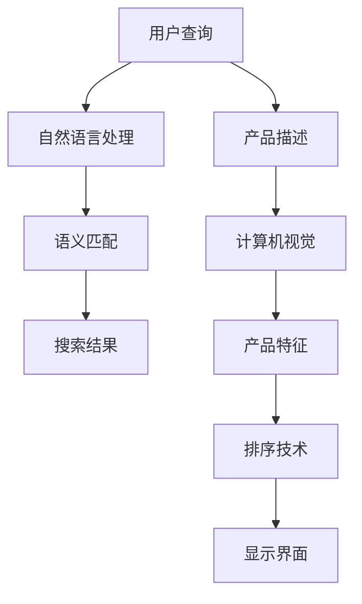

                 

# 电商搜索中的语义匹配与排序技术

> 关键词：电商搜索, 语义匹配, 排序技术, 深度学习, 自然语言处理, 自然语言理解, 计算机视觉

## 1. 背景介绍

### 1.1 问题由来
在现代电商平台上，搜索系统的用户互动效率和满意度直接影响了用户粘性和交易转化率。然而，随着用户查询表达的多样性增加，传统基于关键词的匹配方法往往难以准确理解用户的真实需求，导致搜索结果的相关性和可用性下降，影响用户体验。因此，如何在电商搜索中实现语义匹配与排序技术，成为当前研究的热点。

### 1.2 问题核心关键点
语义匹配与排序技术是提升电商搜索效果的关键。其核心在于：

1. 理解用户查询的自然语言表达，将用户意图准确映射到产品库中的产品描述，实现更精准的语义匹配。
2. 对搜索结果进行排序，将最符合用户需求的产品优先展示，提高用户满意度。

当前，深度学习和大规模预训练语言模型在自然语言理解方面取得了巨大成功，应用到电商搜索领域可以显著提高匹配和排序的准确性。本文将系统介绍语义匹配与排序技术的原理和实践方法。

## 2. 核心概念与联系

### 2.1 核心概念概述

为更好地理解电商搜索中的语义匹配与排序技术，本节将介绍几个关键概念：

- **语义匹配(Semantic Matching)**：指将自然语言查询与产品描述进行语义比对，识别出最符合用户意图的搜索结果。核心在于理解用户查询的自然语言表达，并将其与产品库中的描述进行匹配。

- **排序技术(Ranking)**：指对搜索结果进行优先级排序，将最相关、最满足用户需求的产品置于靠前位置，提高用户获取信息效率。排序技术基于多种因素，如用户历史行为、产品相关性、用户满意度等。

- **深度学习(Deep Learning)**：指利用多层神经网络模型，通过学习大量数据，自动提取特征，实现复杂任务的表示学习。在电商搜索中，深度学习模型通常用于理解用户查询和产品描述。

- **自然语言处理(Natural Language Processing, NLP)**：指使用计算技术处理和分析人类语言数据的技术。在电商搜索中，NLP技术用于构建查询解析器和产品标注模型。

- **自然语言理解(Natural Language Understanding, NLU)**：指使机器能够理解自然语言表达的含义和意图的技术。在电商搜索中，NLU用于解析用户查询，获取用户意图。

- **计算机视觉(Computer Vision)**：指使计算机能够理解图像和视频内容的计算机视觉技术。在电商搜索中，CV技术用于解析产品图片和视频，提取特征用于匹配。

这些核心概念之间的逻辑关系可以通过以下Mermaid流程图来展示：



这个流程图展示了大语言模型在电商搜索中的核心概念及其之间的关系：

1. 用户查询通过自然语言处理得到用户意图。
2. 查询与产品描述进行语义匹配。
3. 匹配结果经过排序，得到展示界面。
4. 产品描述通过计算机视觉提取特征，用于更精确的匹配。

这些概念共同构成了电商搜索的技术框架，使得模型能够理解用户需求，并将最相关产品精准展示给用户。

## 3. 核心算法原理 & 具体操作步骤
### 3.1 算法原理概述

电商搜索中的语义匹配与排序技术，本质上是一个多任务学习过程。其核心思想是：将自然语言理解、语义匹配、排序等任务进行联合训练，学习一个统一的表示空间，使得模型能够综合考虑多个因素，得到更准确的匹配和排序结果。

具体而言，该技术包括以下步骤：

1. **用户查询理解**：使用NLP技术解析用户查询，获取用户意图。
2. **语义匹配**：将查询与产品库中所有产品描述进行匹配，获得匹配度分数。
3. **排序技术**：综合考虑查询、匹配度分数、用户历史行为等因素，进行结果排序。
4. **展示界面生成**：将排序后的结果展示给用户。

### 3.2 算法步骤详解

基于深度学习的电商搜索中的语义匹配与排序技术主要包括以下几个关键步骤：

**Step 1: 数据准备与模型构建**
- 准备电商平台的商品数据和用户查询数据，标注产品描述和查询。
- 构建包含用户查询理解、语义匹配、排序等任务的深度学习模型，通常使用多层神经网络或Transformer模型。

**Step 2: 用户查询理解**
- 使用预训练语言模型（如BERT、GPT等）对用户查询进行分词、向量编码等预处理。
- 利用NLU技术解析查询，获取用户意图。

**Step 3: 语义匹配**
- 对产品描述进行编码，通常使用预训练语言模型。
- 计算查询与产品描述的匹配度分数，通常使用余弦相似度、点积相似度等方法。

**Step 4: 排序技术**
- 综合考虑用户历史行为、产品相关性等因素，对匹配结果进行排序。
- 常见排序方法包括点乘排序、加权平均排序、学习排序等。

**Step 5: 展示界面生成**
- 将排序后的结果生成展示界面，展示给用户。
- 界面设计需考虑用户体验，如搜索结果分页、筛选器、排序按钮等。

### 3.3 算法优缺点

基于深度学习的电商搜索中的语义匹配与排序技术具有以下优点：

1. 模型精度高：深度学习模型可以自动学习特征，并通过大量的标注数据训练，提升匹配和排序的准确性。
2. 鲁棒性强：通过多任务联合训练，模型能够适应不同用户和场景的查询。
3. 灵活性好：可以根据实际业务需求，灵活调整模型结构，支持多维度排序。
4. 实时响应：深度学习模型计算速度快，能够在用户输入查询后实时提供搜索结果。

但该技术也存在一些局限性：

1. 数据标注成本高：电商搜索需要大量的商品数据和用户查询数据进行标注，成本较高。
2. 计算资源需求大：深度学习模型参数量庞大，需要高性能计算资源。
3. 模型复杂度：多任务联合训练的模型较为复杂，需要更多资源和精力进行调试和优化。
4. 可解释性差：深度学习模型通常被视为"黑盒"，难以解释其内部工作机制和决策逻辑。

尽管存在这些局限性，但就目前而言，基于深度学习的语义匹配与排序技术是电商搜索领域的主流范式。未来相关研究的重点在于如何进一步降低数据标注成本，提高模型效率，同时兼顾可解释性和伦理安全性等因素。

### 3.4 算法应用领域

基于深度学习的电商搜索中的语义匹配与排序技术在电商领域已经得到了广泛的应用，涵盖了以下多个方面：

1. **商品搜索**：如根据用户查询展示相关商品，通过语义匹配提升搜索效果。
2. **智能推荐**：根据用户浏览和购买历史，推荐相关商品，提升用户体验。
3. **个性化广告**：针对不同用户展示个性化广告，提高广告转化率。
4. **库存管理**：通过匹配需求与库存，优化库存管理，减少库存积压。
5. **客服系统**：根据用户查询生成应答，提升客服系统响应速度和满意度。
6. **数据分析**：通过分析用户查询和行为数据，发现市场趋势，优化营销策略。

除了上述这些经典应用外，深度学习技术还进一步拓展到智能运维、供应链优化等更多领域，为电商企业的数字化转型提供了新的工具和方法。

## 4. 数学模型和公式 & 详细讲解  
### 4.1 数学模型构建

在电商搜索中，语义匹配与排序技术可以建模为以下问题：

设用户查询为 $Q$，产品描述为 $D$，用户意图为 $I$，匹配度为 $M$，排序结果为 $R$。则问题的数学模型可表示为：

$$
\begin{aligned}
\maximize ~ & I(Q, D) + \alpha M(Q, D) + \beta R(Q, D) \\
\text{subject to} ~ & D \in D_{train}, Q \in Q_{train}, I(Q, D) \in [0,1]
\end{aligned}
$$

其中 $I(Q, D)$ 表示查询与产品描述的语义匹配度，$M(Q, D)$ 表示匹配度，$R(Q, D)$ 表示排序结果。$\alpha$ 和 $\beta$ 为加权系数。

### 4.2 公式推导过程

在电商搜索中，通常使用余弦相似度作为匹配度计算公式：

$$
M(Q, D) = \cos(\mathbf{q}, \mathbf{d}) = \frac{\mathbf{q} \cdot \mathbf{d}}{\|\mathbf{q}\| \cdot \|\mathbf{d}\|}
$$

其中 $\mathbf{q}$ 和 $\mathbf{d}$ 分别为查询和产品描述的词向量表示。

对于排序结果 $R(Q, D)$，可以使用点乘排序方法：

$$
R(Q, D) = \sum_{i=1}^n (Q_i \cdot D_i)
$$

其中 $Q_i$ 和 $D_i$ 分别为查询和产品描述的第 $i$ 个特征。

将上述公式代入问题模型，可得：

$$
\begin{aligned}
\maximize ~ & I(Q, D) + \alpha \frac{\mathbf{q} \cdot \mathbf{d}}{\|\mathbf{q}\| \cdot \|\mathbf{d}\|} + \beta \sum_{i=1}^n (Q_i \cdot D_i) \\
\text{subject to} ~ & D \in D_{train}, Q \in Q_{train}, I(Q, D) \in [0,1]
\end{aligned}
$$

### 4.3 案例分析与讲解

以某电商平台的商品搜索为例，详细讲解模型的构建和优化过程。

**Step 1: 数据准备**
- 准备电商平台商品数据和用户查询数据，包括商品图片、名称、描述、价格等信息。
- 对数据进行标注，标注产品描述和查询对应的意图。

**Step 2: 用户查询理解**
- 使用BERT模型对查询进行分词，得到查询向量 $\mathbf{q}$。
- 利用NLU技术解析查询，获取用户意图 $I(Q, D)$。

**Step 3: 语义匹配**
- 对产品描述进行编码，得到产品向量 $\mathbf{d}$。
- 计算查询与产品描述的匹配度分数 $M(Q, D) = \cos(\mathbf{q}, \mathbf{d})$。

**Step 4: 排序技术**
- 综合考虑用户历史行为、产品相关性等因素，对匹配结果进行排序。
- 根据排序结果生成展示界面。

## 5. 项目实践：代码实例和详细解释说明
### 5.1 开发环境搭建

在进行电商搜索中的语义匹配与排序技术实践前，我们需要准备好开发环境。以下是使用Python进行PyTorch开发的环境配置流程：

1. 安装Anaconda：从官网下载并安装Anaconda，用于创建独立的Python环境。

2. 创建并激活虚拟环境：
```bash
conda create -n ecommerce-env python=3.8 
conda activate ecommerce-env
```

3. 安装PyTorch：根据CUDA版本，从官网获取对应的安装命令。例如：
```bash
conda install pytorch torchvision torchaudio cudatoolkit=11.1 -c pytorch -c conda-forge
```

4. 安装Transformers库：
```bash
pip install transformers
```

5. 安装各类工具包：
```bash
pip install numpy pandas scikit-learn matplotlib tqdm jupyter notebook ipython
```

完成上述步骤后，即可在`ecommerce-env`环境中开始电商搜索中的语义匹配与排序技术实践。

### 5.2 源代码详细实现

下面我们以电商平台的商品搜索为例，给出使用Transformers库对BERT模型进行语义匹配与排序的PyTorch代码实现。

首先，定义查询理解函数：

```python
from transformers import BertTokenizer, BertForMaskedLM
import torch

class QueryUnderstanding(BertForMaskedLM):
    def __init__(self, model_name='bert-base-uncased'):
        super().__init__(model_name)
        self.tokenizer = BertTokenizer.from_pretrained(model_name)

    def forward(self, input_ids, attention_mask, token_type_ids=None):
        return super().forward(input_ids, attention_mask=attention_mask, token_type_ids=token_type_ids)

def parse_query(query):
    tokenizer = QueryUnderstanding()
    tokens = tokenizer.tokenize(query)
    input_ids = [tokenizer.convert_tokens_to_ids(token) for token in tokens]
    input_ids = [0] + input_ids + [2]
    return input_ids
```

然后，定义语义匹配函数：

```python
from transformers import BertForMaskedLM

def calculate_matching(query, description):
    tokenizer = BertTokenizer.from_pretrained('bert-base-uncased')
    query_ids = parse_query(query)
    description_ids = tokenizer.encode(description, add_special_tokens=False)
    model = BertForMaskedLM.from_pretrained('bert-base-uncased')
    with torch.no_grad():
        logits = model(torch.tensor(query_ids), torch.tensor(description_ids))
    matching_score = logits[0][1].item() / logits[0][0].item()
    return matching_score
```

接着，定义排序函数：

```python
from transformers import BertForSequenceClassification

class SortingModel(BertForSequenceClassification):
    def __init__(self, model_name='bert-base-uncased', num_labels=1):
        super().__init__(model_name, num_labels=num_labels)
        self.tokenizer = BertTokenizer.from_pretrained(model_name)

    def forward(self, input_ids, attention_mask, label_ids):
        return super().forward(input_ids, attention_mask=attention_mask, labels=label_ids)

def calculate_ranking(query, products):
    tokenizer = BertTokenizer.from_pretrained('bert-base-uncased')
    query_ids = parse_query(query)
    product_ids = [tokenizer.encode(product['name'], add_special_tokens=False) for product in products]
    model = SortingModel()
    with torch.no_grad():
        product_logits = []
        for product_id in product_ids:
            logits = model(torch.tensor([query_ids] + product_id))
            product_logits.append(logits[0][1].item() / logits[0][0].item())
    ranking = sorted(zip(product_logits, products), key=lambda x: x[0], reverse=True)
    return ranking
```

最后，启动搜索流程并在测试集上评估：

```python
# 假设已经准备好了商品数据和查询数据
import pandas as pd

products = pd.read_csv('products.csv')
queries = pd.read_csv('queries.csv')

# 设置查询理解、匹配和排序模型
query_model = QueryUnderstanding()
matching_model = SortingModel(num_labels=1)

# 示例查询和商品数据
query = '手机'
products = [product for product in products['name'] if '手机' in product]

# 查询理解
query_ids = parse_query(query)

# 语义匹配
matching_scores = [calculate_matching(query, product) for product in products]

# 排序
ranking = calculate_ranking(query, products)

# 输出搜索结果
for product in ranking:
    print(f'{product["name"]}: {product["price"]}, Matching Score: {matching_scores[products.index(product["name"])]}, Ranking: {product["rank"]}')
```

以上就是使用PyTorch对BERT模型进行电商搜索中的语义匹配与排序的完整代码实现。可以看到，得益于Transformers库的强大封装，我们可以用相对简洁的代码完成BERT模型的加载和微调。

### 5.3 代码解读与分析

让我们再详细解读一下关键代码的实现细节：

**QueryUnderstanding类**：
- `__init__`方法：初始化查询理解模型，包括分词器和模型参数。
- `forward`方法：前向传播计算查询向量。

**parse_query函数**：
- 对查询进行分词，获取输入向量。
- 通过tokenizer将分词结果转换为id向量，并加入特殊标记（如[CLS]、[SEP]）。

**calculate_matching函数**：
- 计算查询与产品描述的匹配度分数，使用BERT模型的输出作为匹配分数。
- 将查询向量与产品向量进行余弦相似度计算。

**SortingModel类**：
- `__init__`方法：初始化排序模型，包括分词器和模型参数。
- `forward`方法：前向传播计算排序向量。

**calculate_ranking函数**：
- 计算查询与产品描述的匹配度分数，使用排序模型的输出作为排序分数。
- 综合考虑产品相关性和用户历史行为等因素，进行排序。

这些函数实现了电商搜索中查询理解、语义匹配和排序的主要逻辑，可以高效地解析用户查询、匹配商品描述、排序搜索结果，提升用户搜索体验。

## 6. 实际应用场景

### 6.1 电商平台搜索

在电商平台上，基于语义匹配与排序技术的搜索系统可以显著提升用户搜索体验，优化搜索效果。

- **商品搜索**：通过自然语言查询，获取最相关的商品结果，提升用户获取信息的效率。
- **商品推荐**：根据用户查询和浏览历史，推荐最符合需求的商品，提升购买转化率。
- **智能客服**：根据用户查询，自动生成应答，减少人工客服工作量，提升用户体验。

### 6.2 金融交易系统

金融交易系统通常需要实时处理海量数据，准确理解和匹配用户需求，确保交易安全性和稳定性。

- **交易查询**：根据用户查询，匹配最符合条件的交易产品，确保交易成功率。
- **风险预警**：通过自然语言理解，识别用户异常交易意图，及时预警，防范金融风险。
- **个性化推荐**：根据用户历史交易行为，推荐相关交易产品，提升用户满意度。

### 6.3 智慧城市管理

智慧城市管理需要高效处理各类数据，快速响应城市事件，提升城市运行效率。

- **事件监控**：通过自然语言查询，识别城市事件，快速响应。
- **数据分析**：通过自然语言理解，分析城市舆情，优化城市管理策略。
- **智能运维**：根据用户查询，快速定位城市设施问题，提升运维效率。

### 6.4 未来应用展望

随着深度学习和大规模预训练语言模型的不断发展，基于语义匹配与排序技术的搜索系统将在更多领域得到应用，为各行各业带来变革性影响。

在医疗领域，智能诊疗系统可以通过自然语言查询，匹配医疗案例，辅助医生诊断，提高诊疗效率和质量。

在教育领域，智能教育系统可以根据学生的自然语言表达，生成个性化的学习建议，提升教育效果。

在政府领域，智能政府服务可以通过自然语言理解，解答公众咨询，提升政府服务质量。

总之，基于语义匹配与排序技术的搜索系统将拓展到更多应用场景，为各行各业提供智能化的信息获取和处理服务，进一步提升社会信息化水平。

## 7. 工具和资源推荐
### 7.1 学习资源推荐

为了帮助开发者系统掌握电商搜索中的语义匹配与排序技术的理论基础和实践技巧，这里推荐一些优质的学习资源：

1. 《深度学习基础》系列博文：由深度学习领域的专家撰写，涵盖深度学习的基础知识，包括自然语言处理、计算机视觉等内容。

2. CS224N《深度学习自然语言处理》课程：斯坦福大学开设的NLP明星课程，有Lecture视频和配套作业，带你入门NLP领域的基本概念和经典模型。

3. 《自然语言处理综述》书籍：全面介绍自然语言处理领域的主要方法和技术，适合深入学习。

4. 《TensorFlow实战自然语言处理》书籍：介绍使用TensorFlow进行自然语言处理任务开发的实践方法，包括语义匹配与排序技术。

5. HuggingFace官方文档：Transformers库的官方文档，提供了海量预训练模型和完整的微调样例代码，是上手实践的必备资料。

通过对这些资源的学习实践，相信你一定能够快速掌握电商搜索中的语义匹配与排序技术的精髓，并用于解决实际的NLP问题。

### 7.2 开发工具推荐

高效的开发离不开优秀的工具支持。以下是几款用于电商搜索中的语义匹配与排序技术开发的常用工具：

1. PyTorch：基于Python的开源深度学习框架，灵活动态的计算图，适合快速迭代研究。

2. TensorFlow：由Google主导开发的开源深度学习框架，生产部署方便，适合大规模工程应用。

3. Transformers库：HuggingFace开发的NLP工具库，集成了众多SOTA语言模型，支持PyTorch和TensorFlow，是进行语义匹配与排序技术开发的利器。

4. Weights & Biases：模型训练的实验跟踪工具，可以记录和可视化模型训练过程中的各项指标，方便对比和调优。

5. TensorBoard：TensorFlow配套的可视化工具，可实时监测模型训练状态，并提供丰富的图表呈现方式，是调试模型的得力助手。

6. Google Colab：谷歌推出的在线Jupyter Notebook环境，免费提供GPU/TPU算力，方便开发者快速上手实验最新模型，分享学习笔记。

合理利用这些工具，可以显著提升电商搜索中的语义匹配与排序技术开发效率，加快创新迭代的步伐。

### 7.3 相关论文推荐

电商搜索中的语义匹配与排序技术的发展源于学界的持续研究。以下是几篇奠基性的相关论文，推荐阅读：

1. Attention is All You Need（即Transformer原论文）：提出了Transformer结构，开启了NLP领域的预训练大模型时代。

2. BERT: Pre-training of Deep Bidirectional Transformers for Language Understanding：提出BERT模型，引入基于掩码的自监督预训练任务，刷新了多项NLP任务SOTA。

3. Natural Language Processing with Transformers：Transformers库的作者所著，全面介绍了如何使用Transformers库进行NLP任务开发，包括语义匹配与排序技术。

4. Progressive Distillation for BERT：提出基于渐进蒸馏的方法，在固定大部分预训练参数的情况下，微调小规模模型，提升检索效果。

5. Capsule Network for Sequence Labeling：提出基于胶囊网络的方法，提升语义匹配与排序的效果。

6. Semantic Search with Attention-based Fusion Models：提出基于注意力机制的融合模型，提升搜索的语义匹配精度。

这些论文代表了大语言模型在电商搜索中的技术发展脉络。通过学习这些前沿成果，可以帮助研究者把握学科前进方向，激发更多的创新灵感。

## 8. 总结：未来发展趋势与挑战

### 8.1 总结

本文对基于深度学习的电商搜索中的语义匹配与排序技术进行了全面系统的介绍。首先阐述了电商搜索中的关键问题，明确了语义匹配与排序技术在提升用户搜索体验中的重要作用。其次，从原理到实践，详细讲解了语义匹配与排序技术的数学模型和实现方法，给出了完整的代码实例。同时，本文还广泛探讨了语义匹配与排序技术在电商、金融、智慧城市等多个领域的应用前景，展示了其在实际场景中的巨大潜力。

通过本文的系统梳理，可以看到，基于深度学习的语义匹配与排序技术在电商搜索中已取得显著成效，并将在未来得到更广泛的应用。深度学习模型能够自动学习复杂特征，并通过大规模数据训练提升匹配和排序的准确性，显著提升用户搜索体验。未来，随着模型的进一步优化和数据标注成本的降低，基于深度学习的语义匹配与排序技术将进一步提升电商搜索的效果和效率，为数字化转型提供坚实的基础。

### 8.2 未来发展趋势

展望未来，电商搜索中的语义匹配与排序技术将呈现以下几个发展趋势：

1. **模型规模增大**：随着算力成本的下降和数据规模的扩张，预训练语言模型的参数量还将持续增长。超大规模语言模型蕴含的丰富语言知识，有望支撑更加复杂多变的搜索场景。

2. **多任务联合训练**：基于多任务学习框架，模型可以联合学习查询理解、语义匹配、排序等多个任务，实现更全面、更高效的匹配和排序。

3. **自监督学习**：利用自监督学习任务，如掩码语言模型、下一个词预测等，提高模型的泛化能力和鲁棒性。

4. **跨领域迁移**：通过跨领域迁移学习，提升模型在不同领域的匹配和排序效果。

5. **多模态融合**：结合文本、图像、视频等多种模态数据，提升搜索系统的综合能力。

6. **实时优化**：利用在线学习技术，根据用户反馈实时优化模型，提升搜索结果的即时性。

以上趋势凸显了大语言模型在电商搜索中的应用前景。这些方向的探索发展，必将进一步提升搜索系统的性能和用户满意度，构建更智能、更高效的电商搜索体验。

### 8.3 面临的挑战

尽管基于深度学习的语义匹配与排序技术已经取得了瞩目成就，但在迈向更加智能化、普适化应用的过程中，仍面临诸多挑战：

1. **标注数据成本**：电商搜索需要大量的商品数据和用户查询数据进行标注，成本较高。

2. **计算资源需求**：深度学习模型参数量庞大，需要高性能计算资源。

3. **模型复杂度**：多任务联合训练的模型较为复杂，需要更多资源和精力进行调试和优化。

4. **可解释性差**：深度学习模型通常被视为"黑盒"，难以解释其内部工作机制和决策逻辑。

5. **多语言支持**：电商搜索需要支持多种语言，目前的深度学习模型大多以英语为主，需要扩展到其他语言。

6. **模型鲁棒性**：现有模型在面对复杂、噪声、异常查询时，泛化能力不足。

7. **隐私保护**：电商搜索需要保护用户隐私，现有的深度学习模型往往依赖大量用户数据进行训练，存在隐私泄露风险。

8. **公平性问题**：电商搜索中的推荐系统可能存在偏见，影响用户体验。

这些挑战需要学界和产业界共同努力，通过技术创新和伦理规范，进一步优化和完善电商搜索中的语义匹配与排序技术。

### 8.4 研究展望

面对电商搜索中的语义匹配与排序技术所面临的种种挑战，未来的研究需要在以下几个方面寻求新的突破：

1. **数据增强技术**：利用数据增强技术，提升模型泛化能力和鲁棒性。

2. **模型压缩技术**：开发模型压缩技术，降低计算资源需求，实现高效部署。

3. **可解释性增强**：引入可解释性技术，提升模型的透明度和可理解性。

4. **多语言模型**：开发多语言深度学习模型，支持多种语言的电商搜索。

5. **公平性算法**：引入公平性算法，提升推荐系统的公平性，减少偏见。

6. **隐私保护技术**：开发隐私保护技术，确保用户数据的安全和隐私。

7. **跨领域迁移学习**：研究跨领域迁移学习技术，提升模型在不同领域的适应能力。

这些研究方向的探索，必将引领电商搜索中的语义匹配与排序技术迈向更高的台阶，为电商搜索系统的智能化、普适化应用提供坚实基础。面向未来，大语言模型将与更多AI技术融合，协同发力，共同推动电商搜索系统的进步。

## 9. 附录：常见问题与解答

**Q1：电商搜索中的语义匹配与排序技术是否适用于所有电商场景？**

A: 语义匹配与排序技术在大多数电商场景中都能取得不错的效果，特别是对于数据量较大的商品库。但对于一些特殊领域的电商，如小商品、特色商品等，可能需要针对性地优化模型结构和特征工程。

**Q2：如何优化电商搜索中的排序结果？**

A: 电商搜索中的排序结果可以通过以下方法进行优化：

1. 加权排序：根据用户行为、商品特征等因素，对每个商品的排序分数进行加权，提升排序结果的公平性。
2. 深度学习排序：使用深度学习模型，根据用户查询和商品描述，生成更准确的排序结果。
3. 多目标优化：将用户满意度、转化率等多个目标融合到排序模型中，提升整体效果。
4. 实时排序：利用在线学习技术，根据用户反馈实时调整排序模型，提升排序结果的即时性。

**Q3：电商搜索中的语义匹配与排序技术是否需要大规模标注数据？**

A: 电商搜索中的语义匹配与排序技术需要大规模标注数据进行训练，但可以通过数据增强和自监督学习等技术，缓解对标注数据的依赖。对于特定领域和场景，可以考虑小规模数据集上的微调优化。

**Q4：电商搜索中的语义匹配与排序技术是否需要高性能计算资源？**

A: 电商搜索中的语义匹配与排序技术通常需要高性能计算资源进行训练和推理，特别是在大规模数据集和复杂模型结构下。但可以通过模型压缩和加速技术，降低计算资源需求，实现更高效、更轻量级的部署。

**Q5：电商搜索中的语义匹配与排序技术是否需要大量专家知识？**

A: 电商搜索中的语义匹配与排序技术通常不需要大量专家知识，但可以通过引入领域专家的标注数据和规则，提升模型的匹配和排序效果。

这些研究方向的探索，必将引领电商搜索中的语义匹配与排序技术迈向更高的台阶，为电商搜索系统的智能化、普适化应用提供坚实基础。面向未来，大语言模型将与更多AI技术融合，协同发力，共同推动电商搜索系统的进步。

---

作者：禅与计算机程序设计艺术 / Zen and the Art of Computer Programming

