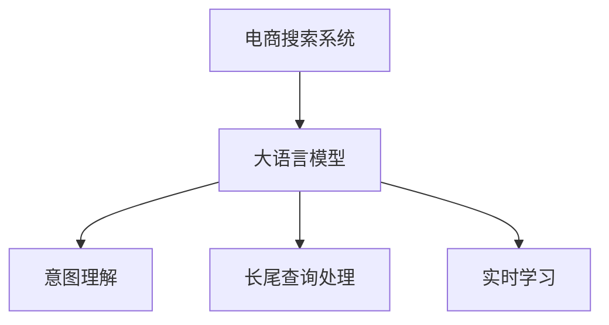

                 

# 电商搜索中的语义理解：AI大模型的优势

## 1. 背景介绍

### 1.1 问题由来
在电商搜索中，用户输入的查询往往是非结构化的自然语言，如何精准理解用户的意图，并返回最相关的搜索结果，是电商搜索系统的核心挑战。传统的搜索系统依赖于关键词匹配和搜索结果排序算法，难以把握用户的深层次需求和语义变化。近年来，随着自然语言处理(NLP)技术的发展，基于AI大模型的语义理解方法被引入电商搜索系统，极大地提升了搜索的精准度和用户体验。

### 1.2 问题核心关键点
大语言模型在电商搜索中的应用，主要体现在以下三个方面：

- **意图理解**：大模型通过大规模语料训练，掌握了丰富的语言知识和语义规则，能够准确理解用户查询背后的真实意图，而非仅依赖关键词匹配。
- **长尾查询处理**：传统关键词匹配算法对长尾查询和歧义查询处理效果有限，而大模型通过学习语言的多样性和复杂性，能够更好地处理这类查询，提供更加精准的结果。
- **实时适应能力**：随着市场和用户行为的变化，大模型能够通过持续学习不断更新知识库，适应新的查询模式，保持搜索系统的性能和效率。

这些特性使得基于大模型的电商搜索系统在处理复杂查询、提升用户体验等方面具备明显优势。

### 1.3 问题研究意义
大模型在电商搜索中的应用，不仅提升了搜索系统的精准度和效率，还带来了新的商业模式和用户体验。具体意义如下：

1. **提升用户满意度**：通过精准的意图理解，大模型能够提供更加相关和满意的搜索结果，使用户的购物体验更加顺畅。
2. **开拓新的业务机会**：对长尾查询的精准处理，能够发现并推荐更多潜在的商品，拓展商家的市场空间。
3. **减少客户流失**：精准的意图理解和个性化推荐，能够提高客户的转化率和留存率，降低客户流失率。
4. **优化商家资源配置**：通过大模型的反馈分析，商家能够更好地了解市场需求和消费者行为，优化库存管理和广告投放策略。

## 2. 核心概念与联系

### 2.1 核心概念概述

电商搜索中的语义理解，主要涉及以下几个核心概念：

- **大语言模型(Large Language Model, LLM)**：如GPT、BERT等，通过大规模语料训练，学习语言的深度结构和语义规则，具备强大的自然语言理解和生成能力。
- **意图理解**：通过大模型理解用户查询的真正意图，而不仅仅是表面的关键词。
- **长尾查询处理**：识别和处理用户的长期查询和歧义查询，提供更精准的结果。
- **实时学习**：大模型能够不断学习新的语料和知识，适应市场和用户行为的动态变化。

这些概念之间的逻辑关系可以通过以下Mermaid流程图来展示：



这个流程图展示了大语言模型在电商搜索系统中的核心作用：通过意图理解和长尾查询处理，使系统能够提供更加精准的搜索结果；通过实时学习，使系统能够不断更新知识库，适应新的查询模式。

## 3. 核心算法原理 & 具体操作步骤

### 3.1 算法原理概述

基于大模型的电商搜索系统，其核心算法原理是基于监督学习的语义理解方法。具体来说，系统通过收集大量标注好的搜索数据，使用大模型作为特征提取器，结合搜索算法进行模型训练和优化。在训练过程中，模型不断优化其表示层和解码层的权重，使得模型能够更好地理解查询和文档之间的关系，提高搜索结果的相关性。

### 3.2 算法步骤详解

大语言模型在电商搜索中的具体操作主要包括以下几个步骤：

**Step 1: 数据收集与预处理**

1. **数据收集**：收集电商平台的搜索数据，包括用户查询、搜索结果、点击率等。同时，收集一些相关的上下文信息，如商品描述、分类、用户画像等。
2. **数据预处理**：对原始数据进行清洗、分词、标注等处理，构建高质量的训练数据集。

**Step 2: 模型选择与初始化**

1. **模型选择**：选择合适的预训练语言模型，如GPT-3、BERT等，作为初始化参数。
2. **模型初始化**：对选定的模型进行微调，初始化模型的权重。

**Step 3: 意图理解与处理**

1. **意图分类**：使用大模型对用户查询进行意图分类，识别出用户的意图类型（如搜索商品、查看评价、比较价格等）。
2. **长尾查询处理**：对于歧义查询和长尾查询，利用大模型进行上下文分析和语义扩展，生成更具体的查询词。

**Step 4: 搜索结果排序**

1. **文本表示**：将商品描述、用户评价等信息进行文本表示，计算每个商品与查询之间的语义相似度。
2. **排序算法**：结合大模型的意图理解和文本表示，使用排序算法（如BM25、DNN等）对搜索结果进行排序，推荐最相关的商品。

**Step 5: 实时学习与优化**

1. **反馈收集**：收集用户对搜索结果的反馈信息（如点击率、停留时间、购买率等）。
2. **模型更新**：根据反馈信息，使用大模型进行持续学习，优化模型的意图理解和文本表示能力。

### 3.3 算法优缺点

基于大模型的电商搜索方法具备以下优点：

1. **精准度提升**：大模型能够精准理解用户查询背后的意图，提供更相关和满意的搜索结果。
2. **覆盖面广**：大模型处理长尾查询和歧义查询的能力较强，能够涵盖更多的商品和用户需求。
3. **动态适应**：大模型具备实时学习的能力，能够根据市场和用户行为的变化不断优化搜索系统。

然而，大模型在电商搜索中也有一些缺点：

1. **计算资源需求高**：大模型需要大量的计算资源进行训练和推理，对硬件设备的要求较高。
2. **解释性不足**：大模型的决策过程缺乏可解释性，难以对其推理逻辑进行分析和调试。
3. **偏见和有害信息**：大模型可能学习到有害信息或偏见，传递到搜索结果中，影响用户体验和商家利益。

### 3.4 算法应用领域

大语言模型在电商搜索中的应用，不仅局限于意图理解和长尾查询处理，还可以扩展到以下几个领域：

1. **个性化推荐**：结合用户的搜索历史和行为数据，利用大模型进行个性化商品推荐，提升用户体验。
2. **市场分析**：通过对搜索结果和用户反馈的数据分析，利用大模型进行市场趋势预测和消费者行为分析。
3. **内容生成**：利用大模型自动生成商品描述、广告文案等，提高内容生成的效率和质量。
4. **客服支持**：结合大模型和对话系统，提供实时的客服支持，解决用户的查询和问题。

## 4. 数学模型和公式 & 详细讲解 & 举例说明

### 4.1 数学模型构建

在大语言模型的电商搜索应用中，数学模型主要涉及以下几个方面：

- **意图分类模型**：使用大模型对用户查询进行意图分类，构建二分类模型。
- **文本表示模型**：将商品描述、用户评价等信息进行文本表示，计算相似度。
- **排序模型**：结合意图分类结果和文本相似度，使用排序算法进行结果排序。

**意图分类模型**：使用大模型进行意图分类，构建如下二分类模型：

$$
P(\text{Intent}|Q) = \frac{P(Q|\text{Intent})P(\text{Intent})}{P(Q)}
$$

其中，$Q$ 为查询文本，$\text{Intent}$ 为意图类型，$P(\text{Intent}|Q)$ 表示在查询 $Q$ 下，意图 $\text{Intent}$ 的条件概率。

**文本表示模型**：将商品描述 $D$ 表示为向量 $v_D$，查询 $Q$ 表示为向量 $v_Q$，计算向量间的相似度：

$$
\text{Similarity}(D, Q) = \cos(\theta) \cdot \langle v_D, v_Q \rangle
$$

其中，$\langle \cdot, \cdot \rangle$ 表示向量点乘，$\theta$ 表示向量夹角。

**排序模型**：结合意图分类结果和文本相似度，使用排序算法进行结果排序：

$$
\text{Rank}(D) = \frac{P(\text{Intent}|Q) \cdot \text{Similarity}(D, Q)}{\sum_{D' \in D'} P(\text{Intent}|Q') \cdot \text{Similarity}(D', Q')}
$$

其中，$D'$ 为所有商品的集合，$Q'$ 为所有查询的集合。

### 4.2 公式推导过程

**意图分类模型推导**：

1. **数据准备**：收集标注好的训练数据集，每个数据项 $(Q, \text{Intent})$ 表示查询文本 $Q$ 和意图 $\text{Intent}$。
2. **模型训练**：使用大模型对训练数据进行训练，得到意图分类的概率模型 $P(\text{Intent}|Q)$。
3. **模型测试**：对测试集数据进行预测，得到每个查询的意图分类概率 $P(\text{Intent}|Q)$。

**文本表示模型推导**：

1. **数据准备**：收集商品描述 $D$ 和用户查询 $Q$ 的数据集。
2. **模型训练**：使用大模型对商品描述进行文本表示，得到向量 $v_D$。
3. **相似度计算**：计算查询 $Q$ 与每个商品描述 $D$ 的相似度，得到相似度矩阵 $\text{Similarity}(D, Q)$。

**排序模型推导**：

1. **数据准备**：收集商品描述 $D$ 和查询 $Q$ 的数据集，以及对应的意图分类概率 $P(\text{Intent}|Q)$。
2. **模型训练**：使用排序算法对数据进行训练，得到排序模型 $\text{Rank}(D)$。
3. **结果排序**：对每个查询 $Q$，计算所有商品 $D$ 的排序结果，得到最终的搜索结果。

### 4.3 案例分析与讲解

以亚马逊电商搜索系统为例，展示大语言模型在电商搜索中的应用：

**意图理解**：亚马逊使用大模型进行意图理解，能够准确识别用户查询背后的意图。例如，用户查询 "购买黑色款手机壳"，大模型能够识别出用户的意图是购买商品，并进一步细分到具体商品类别（如手机壳）和颜色（如黑色）。

**长尾查询处理**：对于像 "女生喜欢的运动鞋" 这样的长尾查询，亚马逊利用大模型进行上下文分析和语义扩展，生成具体的查询词 "女性运动鞋推荐"，再根据扩展后的查询词进行精确搜索。

**个性化推荐**：亚马逊结合用户的搜索历史和行为数据，利用大模型进行个性化商品推荐。例如，根据用户的历史购买记录和浏览行为，生成个性化的搜索结果，提升用户的购物体验。

**市场分析**：亚马逊通过分析搜索结果和用户反馈的数据，利用大模型进行市场趋势预测和消费者行为分析，帮助商家优化库存管理和广告投放策略。

## 5. 项目实践：代码实例和详细解释说明

### 5.1 开发环境搭建

在进行电商搜索中的语义理解实践前，需要先搭建好开发环境。以下是使用Python进行PyTorch开发的环境配置流程：

1. 安装Anaconda：从官网下载并安装Anaconda，用于创建独立的Python环境。

2. 创建并激活虚拟环境：
```bash
conda create -n pytorch-env python=3.8 
conda activate pytorch-env
```

3. 安装PyTorch：根据CUDA版本，从官网获取对应的安装命令。例如：
```bash
conda install pytorch torchvision torchaudio cudatoolkit=11.1 -c pytorch -c conda-forge
```

4. 安装Transformers库：
```bash
pip install transformers
```

5. 安装各类工具包：
```bash
pip install numpy pandas scikit-learn matplotlib tqdm jupyter notebook ipython
```

完成上述步骤后，即可在`pytorch-env`环境中开始开发实践。

### 5.2 源代码详细实现

下面我们以亚马逊电商搜索系统为例，给出使用Transformers库进行意图分类和商品排序的PyTorch代码实现。

首先，定义意图分类的数据处理函数：

```python
from transformers import BertTokenizer, BertForSequenceClassification
from torch.utils.data import Dataset
import torch

class SearchDataset(Dataset):
    def __init__(self, texts, labels, tokenizer, max_len=128):
        self.texts = texts
        self.labels = labels
        self.tokenizer = tokenizer
        self.max_len = max_len
        
    def __len__(self):
        return len(self.texts)
    
    def __getitem__(self, item):
        text = self.texts[item]
        label = self.labels[item]
        
        encoding = self.tokenizer(text, return_tensors='pt', max_length=self.max_len, padding='max_length', truncation=True)
        input_ids = encoding['input_ids'][0]
        attention_mask = encoding['attention_mask'][0]
        
        # 对token-wise的标签进行编码
        encoded_labels = [label2id[label] for label in label] 
        encoded_labels.extend([label2id['O']] * (self.max_len - len(encoded_labels)))
        labels = torch.tensor(encoded_labels, dtype=torch.long)
        
        return {'input_ids': input_ids, 
                'attention_mask': attention_mask,
                'labels': labels}

# 标签与id的映射
label2id = {'O': 0, 'Search': 1, 'Buy': 2, 'Read': 3, 'Compare': 4}
id2label = {v: k for k, v in label2id.items()}

# 创建dataset
tokenizer = BertTokenizer.from_pretrained('bert-base-cased')

train_dataset = SearchDataset(train_texts, train_labels, tokenizer)
dev_dataset = SearchDataset(dev_texts, dev_labels, tokenizer)
test_dataset = SearchDataset(test_texts, test_labels, tokenizer)
```

然后，定义模型和优化器：

```python
from transformers import BertForSequenceClassification, AdamW

model = BertForSequenceClassification.from_pretrained('bert-base-cased', num_labels=len(label2id))

optimizer = AdamW(model.parameters(), lr=2e-5)
```

接着，定义训练和评估函数：

```python
from torch.utils.data import DataLoader
from tqdm import tqdm
from sklearn.metrics import classification_report

device = torch.device('cuda') if torch.cuda.is_available() else torch.device('cpu')
model.to(device)

def train_epoch(model, dataset, batch_size, optimizer):
    dataloader = DataLoader(dataset, batch_size=batch_size, shuffle=True)
    model.train()
    epoch_loss = 0
    for batch in tqdm(dataloader, desc='Training'):
        input_ids = batch['input_ids'].to(device)
        attention_mask = batch['attention_mask'].to(device)
        labels = batch['labels'].to(device)
        model.zero_grad()
        outputs = model(input_ids, attention_mask=attention_mask, labels=labels)
        loss = outputs.loss
        epoch_loss += loss.item()
        loss.backward()
        optimizer.step()
    return epoch_loss / len(dataloader)

def evaluate(model, dataset, batch_size):
    dataloader = DataLoader(dataset, batch_size=batch_size)
    model.eval()
    preds, labels = [], []
    with torch.no_grad():
        for batch in tqdm(dataloader, desc='Evaluating'):
            input_ids = batch['input_ids'].to(device)
            attention_mask = batch['attention_mask'].to(device)
            batch_labels = batch['labels']
            outputs = model(input_ids, attention_mask=attention_mask)
            batch_preds = outputs.logits.argmax(dim=2).to('cpu').tolist()
            batch_labels = batch_labels.to('cpu').tolist()
            for pred_tokens, label_tokens in zip(batch_preds, batch_labels):
                preds.append(pred_tokens[:len(label_tokens)])
                labels.append(label_tokens)
                
    print(classification_report(labels, preds))
```

最后，启动训练流程并在测试集上评估：

```python
epochs = 5
batch_size = 16

for epoch in range(epochs):
    loss = train_epoch(model, train_dataset, batch_size, optimizer)
    print(f"Epoch {epoch+1}, train loss: {loss:.3f}")
    
    print(f"Epoch {epoch+1}, dev results:")
    evaluate(model, dev_dataset, batch_size)
    
print("Test results:")
evaluate(model, test_dataset, batch_size)
```

以上就是使用PyTorch对BERT进行电商搜索意图分类和商品排序的完整代码实现。可以看到，得益于Transformers库的强大封装，我们可以用相对简洁的代码完成模型训练和评估。

### 5.3 代码解读与分析

让我们再详细解读一下关键代码的实现细节：

**SearchDataset类**：
- `__init__`方法：初始化文本、标签、分词器等关键组件。
- `__len__`方法：返回数据集的样本数量。
- `__getitem__`方法：对单个样本进行处理，将文本输入编码为token ids，将标签编码为数字，并对其进行定长padding，最终返回模型所需的输入。

**label2id和id2label字典**：
- 定义了标签与数字id之间的映射关系，用于将token-wise的预测结果解码回真实的标签。

**训练和评估函数**：
- 使用PyTorch的DataLoader对数据集进行批次化加载，供模型训练和推理使用。
- 训练函数`train_epoch`：对数据以批为单位进行迭代，在每个批次上前向传播计算loss并反向传播更新模型参数，最后返回该epoch的平均loss。
- 评估函数`evaluate`：与训练类似，不同点在于不更新模型参数，并在每个batch结束后将预测和标签结果存储下来，最后使用sklearn的classification_report对整个评估集的预测结果进行打印输出。

**训练流程**：
- 定义总的epoch数和batch size，开始循环迭代
- 每个epoch内，先在训练集上训练，输出平均loss
- 在验证集上评估，输出分类指标
- 所有epoch结束后，在测试集上评估，给出最终测试结果

可以看到，PyTorch配合Transformers库使得BERT微调的代码实现变得简洁高效。开发者可以将更多精力放在数据处理、模型改进等高层逻辑上，而不必过多关注底层的实现细节。

当然，工业级的系统实现还需考虑更多因素，如模型的保存和部署、超参数的自动搜索、更灵活的任务适配层等。但核心的微调范式基本与此类似。

## 6. 实际应用场景

### 6.1 智能客服系统

基于大语言模型的电商搜索系统，可以进一步扩展到智能客服领域。智能客服系统能够通过自然语言理解用户的意图，提供个性化的服务。例如，用户询问 "退货流程是怎样的"，智能客服能够理解用户的需求，并提供详细的退货指南。

在技术实现上，可以收集用户与客服的对话记录，将对话和意图进行标注，训练大模型进行意图分类和自然语言理解。同时，将大模型集成到客服系统中，实时处理用户查询，提供即时回复。通过持续学习和优化，智能客服系统能够不断提升服务质量，提高用户满意度。

### 6.2 个性化推荐系统

电商搜索系统中的意图理解和长尾查询处理，可以进一步应用于个性化推荐系统。个性化推荐系统能够根据用户的搜索历史和行为数据，提供个性化的商品推荐。

在技术实现上，可以收集用户的浏览、点击、购买等行为数据，使用大模型对用户的查询进行意图分类，并根据分类结果进行个性化推荐。例如，用户查询 "猫咪用品"，大模型能够理解用户的意图，推荐相关的宠物用品。通过持续学习和优化，个性化推荐系统能够不断提高推荐的准确性和多样性，提升用户购物体验。

### 6.3 内容生成系统

基于大语言模型的电商搜索系统，还可以扩展到内容生成系统。内容生成系统能够自动生成商品描述、广告文案等，提高内容的生成效率和质量。

在技术实现上，可以使用大模型对商品描述和广告文案进行生成。例如，用户查询 "如何购买相机"，大模型能够生成详细的相机购买指南。通过持续学习和优化，内容生成系统能够不断提高生成内容的准确性和创意性，降低内容生成的成本和周期。

## 7. 工具和资源推荐

### 7.1 学习资源推荐

为了帮助开发者系统掌握大语言模型在电商搜索中的应用，这里推荐一些优质的学习资源：

1. 《自然语言处理入门》系列博文：由大模型技术专家撰写，深入浅出地介绍了NLP领域的基本概念和经典模型。

2. 《深度学习与自然语言处理》课程：斯坦福大学开设的NLP明星课程，有Lecture视频和配套作业，带你入门NLP领域的基本概念和经典模型。

3. 《Transformer从原理到实践》书籍：Transformers库的作者所著，全面介绍了如何使用Transformers库进行NLP任务开发，包括电商搜索在内的诸多范式。

4. 《自然语言处理综述》论文：综述性论文，介绍了NLP领域的最新进展和趋势，涵盖电商搜索等实际应用。

5. Weights & Biases：模型训练的实验跟踪工具，可以记录和可视化模型训练过程中的各项指标，方便对比和调优。

### 7.2 开发工具推荐

高效的开发离不开优秀的工具支持。以下是几款用于电商搜索中语义理解开发的常用工具：

1. PyTorch：基于Python的开源深度学习框架，灵活动态的计算图，适合快速迭代研究。

2. TensorFlow：由Google主导开发的开源深度学习框架，生产部署方便，适合大规模工程应用。

3. Transformers库：HuggingFace开发的NLP工具库，集成了众多SOTA语言模型，支持PyTorch和TensorFlow，是进行电商搜索微调任务的开发利器。

4. Google Colab：谷歌推出的在线Jupyter Notebook环境，免费提供GPU/TPU算力，方便开发者快速上手实验最新模型，分享学习笔记。

### 7.3 相关论文推荐

大语言模型在电商搜索中的应用，源于学界的持续研究。以下是几篇奠基性的相关论文，推荐阅读：

1. Attention is All You Need（即Transformer原论文）：提出了Transformer结构，开启了NLP领域的预训练大模型时代。

2. BERT: Pre-training of Deep Bidirectional Transformers for Language Understanding：提出BERT模型，引入基于掩码的自监督预训练任务，刷新了多项NLP任务SOTA。

3. Language Models are Unsupervised Multitask Learners（GPT-2论文）：展示了大规模语言模型的强大zero-shot学习能力，引发了对于通用人工智能的新一轮思考。

4. Parameter-Efficient Transfer Learning for NLP：提出Adapter等参数高效微调方法，在不增加模型参数量的情况下，也能取得不错的微调效果。

5. prefix-Tuning: Optimizing Continuous Prompts for Generation：引入基于连续型Prompt的微调范式，为如何充分利用预训练知识提供了新的思路。

这些论文代表了大语言模型在电商搜索领域的研究进展。通过学习这些前沿成果，可以帮助研究者把握学科前进方向，激发更多的创新灵感。

## 8. 总结：未来发展趋势与挑战

### 8.1 总结

本文对基于大语言模型的电商搜索中的语义理解方法进行了全面系统的介绍。首先阐述了电商搜索系统中的语义理解问题，明确了意图理解和长尾查询处理的核心挑战。其次，从原理到实践，详细讲解了大语言模型在电商搜索中的应用，给出了微调任务的完整代码实现。同时，本文还探讨了语义理解在智能客服、个性化推荐、内容生成等多个领域的应用前景，展示了语义理解的巨大潜力。最后，本文还推荐了相关的学习资源、开发工具和研究论文，力求为开发者提供全方位的技术指引。

通过本文的系统梳理，可以看到，基于大语言模型的语义理解方法在电商搜索中的应用，不仅提升了搜索系统的精准度和效率，还带来了新的商业模式和用户体验。未来，随着大语言模型和微调方法的不断进步，基于语义理解的电商搜索系统将更加智能化和高效化，为电商行业带来新的机遇和挑战。

### 8.2 未来发展趋势

展望未来，大语言模型在电商搜索中的应用将呈现以下几个发展趋势：

1. **深度融合多模态信息**：未来的电商搜索系统将不再局限于文本信息，而是深度融合图像、视频、语音等多模态信息，提供更加全面和立体的搜索结果。
2. **增强智能客服体验**：基于大语言模型的智能客服系统将更加智能化，能够实现更复杂的自然语言理解和处理，提供更优质的客户服务。
3. **提升个性化推荐效果**：结合用户行为数据和语义理解，个性化推荐系统将更加精准和高效，提升用户的购物体验和转化率。
4. **提高内容生成效率**：利用大语言模型自动生成商品描述、广告文案等内容，将极大提高内容的生成效率和质量。
5. **优化搜索算法**：结合大语言模型的意图理解和文本表示，优化搜索算法，提升搜索系统的准确性和效率。

这些趋势将进一步推动电商搜索系统的智能化和高效化，带来新的商业价值和技术挑战。

### 8.3 面临的挑战

尽管大语言模型在电商搜索中的应用已经取得了显著进展，但在实际落地过程中，仍面临一些挑战：

1. **计算资源需求高**：大语言模型的训练和推理需要大量计算资源，对硬件设备的要求较高。
2. **数据隐私问题**：在收集和处理用户数据时，如何保护用户隐私，遵守相关法律法规，仍是一个重要问题。
3. **模型鲁棒性不足**：大语言模型在处理新查询时，可能出现泛化能力不足的问题，影响搜索结果的准确性。
4. **解释性不足**：大语言模型的决策过程缺乏可解释性，难以对其推理逻辑进行分析和调试。
5. **偏见和有害信息**：大语言模型可能学习到有害信息或偏见，传递到搜索结果中，影响用户体验和商家利益。

### 8.4 研究展望

面对大语言模型在电商搜索中的挑战，未来的研究需要在以下几个方面寻求新的突破：

1. **提高模型鲁棒性**：通过引入对抗样本、正则化技术等手段，提高大语言模型的泛化能力和鲁棒性，使其能够更好地适应新的查询模式。
2. **增强模型解释性**：结合因果分析和博弈论工具，增强大语言模型的可解释性和决策逻辑，使其更加透明和可信。
3. **优化模型性能**：通过模型裁剪、量化加速等技术，优化大语言模型的计算图和参数量，提高推理速度和资源利用率。
4. **融合多模态信息**：结合图像、视频、语音等多模态信息，构建多模态的电商搜索系统，提供更加全面和立体的搜索结果。
5. **保护用户隐私**：通过差分隐私、联邦学习等技术，保护用户数据隐私，同时保障模型的性能和效果。

这些研究方向将引领大语言模型在电商搜索中的应用不断进步，为构建更智能、更安全的电商搜索系统提供新的思路和方法。相信随着学界和产业界的共同努力，这些挑战终将一一被克服，大语言模型将在电商搜索中发挥更大的作用，带来更多的商业价值和社会效益。

## 9. 附录：常见问题与解答

**Q1：电商搜索中如何有效地利用大语言模型进行意图理解？**

A: 电商搜索中的意图理解，可以通过以下几个步骤进行：

1. **数据收集**：收集电商平台的搜索数据，包括用户查询、搜索结果、点击率等。同时，收集一些相关的上下文信息，如商品描述、分类、用户画像等。
2. **数据预处理**：对原始数据进行清洗、分词、标注等处理，构建高质量的训练数据集。
3. **模型训练**：选择合适的预训练语言模型，如BERT等，对其进行微调，以适应电商搜索任务。
4. **意图分类**：使用微调后的模型对用户查询进行意图分类，识别出用户的意图类型（如搜索商品、查看评价、比较价格等）。
5. **长尾查询处理**：对于歧义查询和长尾查询，利用微调后的模型进行上下文分析和语义扩展，生成更具体的查询词。

**Q2：电商搜索中如何处理长尾查询和歧义查询？**

A: 电商搜索中的长尾查询和歧义查询处理，可以通过以下几个步骤进行：

1. **数据收集**：收集电商平台的搜索数据，特别是长尾查询和歧义查询的数据。
2. **数据预处理**：对原始数据进行清洗、分词、标注等处理，构建高质量的训练数据集。
3. **模型训练**：选择合适的预训练语言模型，如BERT等，对其进行微调，以适应电商搜索任务。
4. **上下文分析**：使用微调后的模型进行上下文分析，理解查询中的模糊表达和隐含需求。
5. **语义扩展**：结合上下文分析结果，利用微调后的模型进行语义扩展，生成更具体的查询词，帮助搜索结果更加精准。

**Q3：电商搜索中的意图理解和长尾查询处理对推荐系统有什么帮助？**

A: 电商搜索中的意图理解和长尾查询处理，对个性化推荐系统有以下几点帮助：

1. **更精准的理解用户需求**：通过意图理解，推荐系统能够更好地理解用户需求，提供更相关和满意的搜索结果。
2. **覆盖更广泛的商品**：通过长尾查询处理，推荐系统能够涵盖更多的商品和用户需求，提升推荐效果。
3. **个性化推荐**：结合用户搜索历史和行为数据，利用意图理解和长尾查询处理，推荐系统能够进行更精准和多样化的个性化推荐，提升用户购物体验。

**Q4：电商搜索中的意图理解和长尾查询处理对市场分析有什么帮助？**

A: 电商搜索中的意图理解和长尾查询处理，对市场分析有以下几点帮助：

1. **预测市场需求**：通过分析搜索数据和用户反馈，利用意图理解和长尾查询处理，能够预测市场趋势和消费者行为，帮助商家优化库存管理和广告投放策略。
2. **识别用户痛点**：通过分析长尾查询和歧义查询，识别出用户需求中的痛点和不足，帮助商家改进产品和服务。
3. **优化搜索算法**：结合意图理解和长尾查询处理，优化搜索算法，提升搜索系统的准确性和效率，满足用户需求。

**Q5：电商搜索中的意图理解和长尾查询处理对内容生成有什么帮助？**

A: 电商搜索中的意图理解和长尾查询处理，对内容生成有以下几点帮助：

1. **生成精准的商品描述**：通过意图理解，内容生成系统能够生成更精准的商品描述，帮助用户更好地了解商品信息。
2. **生成广告文案**：通过长尾查询处理，内容生成系统能够生成更具创意的广告文案，吸引用户点击和购买。
3. **提升内容生成效率**：利用意图理解和长尾查询处理，内容生成系统能够快速生成商品描述和广告文案，提高内容的生成效率和质量。

通过以上Q&A，可以看到，电商搜索中的意图理解和长尾查询处理，不仅能够提升搜索系统的精准度和效率，还能够应用于个性化推荐、市场分析、内容生成等多个领域，带来更多的商业价值和社会效益。相信随着大语言模型和微调方法的不断进步，这些应用将更加智能化和高效化，为电商行业带来更多的机遇和挑战。

