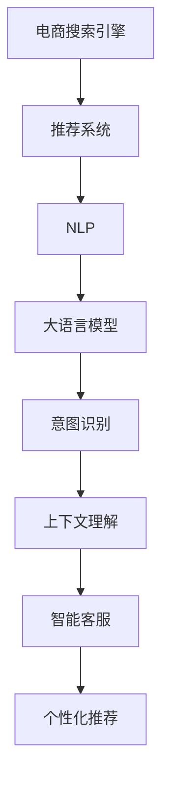

                 

# 电商搜索引擎优化：AI大模型的新思路

> 关键词：电商搜索引擎优化,大语言模型,深度学习,推荐系统,自然语言处理(NLP),意图识别,上下文理解,智能客服,个性化推荐

## 1. 背景介绍

### 1.1 问题由来

随着电子商务的迅猛发展，电商平台的用户数和商品种类呈现爆炸性增长。传统搜索引擎在面对海量、复杂且多变的用户查询时，常因信息过载而无法准确展示用户最感兴趣的搜索结果。为了改善用户体验，电商平台纷纷引入智能搜索技术，希望通过AI技术为用户呈现更加精准、个性化的商品推荐。然而，传统的推荐系统常常依赖于静态特征或简单的关键词匹配，无法充分利用文本语义信息，导致搜索结果的精准性和个性化程度不足。

近年来，大语言模型在自然语言处理(NLP)领域取得了显著进展。特别是BERT、GPT-3等预训练大模型，通过在大规模无标签文本上进行的预训练，获得了丰富的语言表示能力。这些大语言模型在诸如阅读理解、文本生成、机器翻译等NLP任务上取得了SOTA效果。因此，利用大语言模型进行电商搜索优化，成为当前的一大研究热点。

### 1.2 问题核心关键点

如何利用大语言模型改善电商平台的搜索体验，成为了关键问题。核心在于以下几个方面：

- 如何从海量的电商商品描述和用户查询中提取关键语义信息？
- 如何将提取出的语义信息与商品特征进行融合，形成更加精准的推荐？
- 如何处理大规模用户查询的实时计算，实现高效的搜索？
- 如何综合考虑用户意图、上下文信息、实时反馈等复杂因素，生成个性化推荐？

本文将围绕这些核心问题，全面介绍基于大语言模型的电商搜索引擎优化方法，帮助电商从业者充分利用AI技术提升搜索系统的智能化水平。

## 2. 核心概念与联系

### 2.1 核心概念概述

为了深入理解大语言模型在电商搜索引擎优化中的应用，本节将介绍几个密切相关的核心概念：

- 电商搜索引擎（Search Engine）：电商平台中用于搜索商品和信息的系统，用户通过输入查询词，获取匹配的商品列表。
- 推荐系统（Recommendation System）：根据用户行为数据、商品特征等信息，为用户推荐感兴趣的商品。
- 自然语言处理（NLP）：通过机器学习技术对人类语言进行处理和分析，是电商搜索优化的核心技术之一。
- 大语言模型（Large Language Model, LLM）：通过在大规模无标签文本上进行的自监督预训练，学习到丰富语言表示能力，广泛应用于NLP领域。
- 意图识别（Intent Recognition）：识别用户查询的意图，以便提供更符合期望的搜索结果。
- 上下文理解（Contextual Understanding）：理解用户查询与商品描述的语义关系，生成更精准的推荐。
- 智能客服（Intelligent Customer Service）：利用NLP技术，构建自动化客服系统，提升用户购物体验。
- 个性化推荐（Personalized Recommendation）：根据用户历史行为和实时查询，生成个性化的商品推荐。

这些核心概念之间的逻辑关系可以通过以下Mermaid流程图来展示：



这个流程图展示了大语言模型与电商搜索引擎优化相关的各个关键组件及其之间的联系：

1. 电商搜索引擎基于用户查询，调用推荐系统提供商品列表。
2. 推荐系统综合NLP和大语言模型技术，实现意图识别和上下文理解，生成个性化推荐。
3. 智能客服通过NLP技术，实现自动化的客户交互，提升用户体验。
4. 个性化推荐利用意图识别、上下文理解等技术，生成精准的商品推荐。

## 3. 核心算法原理 & 具体操作步骤
### 3.1 算法原理概述

基于大语言模型的电商搜索引擎优化方法，主要包含以下几个步骤：

1. 对电商商品描述和用户查询进行预处理和特征提取，构建适用于大语言模型的输入数据。
2. 利用大语言模型学习商品和查询的语义表示，提取商品意图和用户意图。
3. 根据提取出的意图，利用推荐算法生成个性化商品推荐。
4. 将推荐结果反馈给用户，根据用户的实时反馈不断优化模型。

其中，大语言模型的意图识别和上下文理解能力尤为关键。通过对用户查询和商品描述的深度语义理解，可以准确把握用户的搜索意图和商品的特征，从而生成更加精准的推荐。

### 3.2 算法步骤详解

下面详细介绍利用大语言模型进行电商搜索优化的具体操作步骤：

**Step 1: 数据预处理和特征提取**

电商商品描述和用户查询文本通常包含大量无意义的噪声，需要通过预处理提取关键语义信息。具体步骤包括：

1. 分词：将文本切分为单词或子词，去除停用词、特殊符号等噪声。
2. 词向量映射：将分词结果映射为低维向量表示，供大语言模型进行输入。
3. 特征构建：将商品和查询的词向量、属性、标签等信息，构建一个综合特征向量，用于训练大语言模型。

**Step 2: 意图识别与上下文理解**

大语言模型通过对商品描述和用户查询进行语义建模，可以准确识别商品和用户的意图。具体步骤如下：

1. 输入商品描述和用户查询，输入到大语言模型中，得到隐含的语义表示。
2. 利用微调后的模型，进行意图识别。对于商品，识别其所属的类别、属性、价格区间等；对于用户查询，识别其意图类型，如搜索、比较、浏览等。
3. 利用上下文理解技术，结合商品和查询的语义表示，提取关键特征，进行意图匹配。

**Step 3: 推荐算法生成推荐**

意图识别和上下文理解后，可以生成个性化的推荐。推荐算法一般包括以下几种：

1. 基于用户行为数据的协同过滤：通过分析用户历史行为，找到相似用户，推荐其喜欢的商品。
2. 基于内容的推荐：结合商品属性和用户查询的语义信息，生成相似的商品推荐。
3. 混合推荐算法：综合利用协同过滤和基于内容的推荐，提高推荐的精准性和多样性。

**Step 4: 反馈迭代优化模型**

根据用户的实时反馈，不断优化推荐模型。具体步骤包括：

1. 获取用户对推荐结果的反馈，如点击、购买、评分等行为。
2. 根据反馈数据，调整推荐算法的参数，优化推荐模型。
3. 利用在线学习技术，将用户反馈动态更新到大语言模型中，持续优化模型的语义理解能力。

### 3.3 算法优缺点

基于大语言模型的电商搜索引擎优化方法具有以下优点：

1. 语义理解能力强：通过大语言模型对商品和用户查询的深度语义建模，可以更好地理解用户的意图，生成更加精准的推荐。
2. 个性化程度高：结合用户行为数据和语义信息，生成个性化的推荐，满足用户的独特需求。
3. 实时性强：利用在线学习技术，不断根据用户反馈优化模型，保证推荐的时效性。
4. 易于扩展：大语言模型预训练在通用语料上，可以方便地应用于不同领域的电商搜索优化。

同时，该方法也存在一定的局限性：

1. 数据依赖性高：大语言模型的效果高度依赖于数据质量，若数据噪声较多，可能导致推荐精度下降。
2. 计算资源消耗大：大语言模型计算复杂度高，实时生成推荐时，需占用较多计算资源。
3. 隐私保护问题：电商平台涉及大量用户隐私信息，如何在推荐过程中保护用户隐私，是一大挑战。

尽管存在这些局限性，但就目前而言，基于大语言模型的电商搜索引擎优化方法仍具有显著的优势，值得进一步研究和发展。

### 3.4 算法应用领域

基于大语言模型的电商搜索引擎优化方法，在以下几个领域具有广泛的应用前景：

- 电子商务：电商平台通过智能搜索和推荐，提升用户购物体验，增加商品曝光率和转化率。
- 在线教育：在线课程平台利用智能搜索技术，推荐最适合用户学习需求的视频和资料，提高学习效果。
- 旅游服务：旅游平台通过智能搜索，提供个性化旅游攻略和景点推荐，提升用户旅行体验。
- 金融服务：金融平台利用智能搜索，推荐理财产品和金融信息，增加用户粘性和收入。
- 医疗健康：健康平台通过智能搜索，推荐合适的医疗信息和健康服务，提高用户健康水平。

以上领域中，电商平台的电商搜索优化最为典型，本文将重点介绍该场景下的实际应用。

## 4. 数学模型和公式 & 详细讲解 & 举例说明

### 4.1 数学模型构建

本节将使用数学语言对大语言模型在电商搜索优化中的应用进行更加严格的刻画。

假设电商平台的商品集合为 $I$，用户查询集合为 $Q$，商品描述集合为 $D$。商品描述和用户查询均可以表示为词语序列 $d \in D$ 和 $q \in Q$。假设大语言模型为 $M$，其预训练参数为 $\theta$，输入为商品描述 $d$ 和用户查询 $q$。

定义大语言模型对商品 $i \in I$ 和用户查询 $q$ 的语义表示为 $v_i^d$ 和 $v_q^q$。则意图识别和上下文理解的目标为：

$$
\begin{aligned}
&\min_{\theta} \mathcal{L}(M, D, Q) \\
&\mathcal{L}(M, D, Q) = \frac{1}{N} \sum_{i=1}^N \sum_{q=1}^M \ell(M(d_i, q))
\end{aligned}
$$

其中 $\ell$ 为意图识别和上下文理解的损失函数，$N$ 为训练集大小，$M$ 为用户查询集合大小。意图识别和上下文理解的目标是最大化商品和查询语义表示的相似度，从而生成精准的推荐。

### 4.2 公式推导过程

以下我们以意图识别为例，推导其目标函数的计算过程。

假设意图识别目标为将商品分为若干类别 $C$，类别 $c$ 的概率分布为 $p_c(v_i^d)$。利用大语言模型的输出，意图识别的目标函数可以表示为：

$$
\begin{aligned}
&\min_{\theta} \mathcal{L}(M, I, Q) \\
&\mathcal{L}(M, I, Q) = \frac{1}{N} \sum_{i=1}^N \sum_{q=1}^M \sum_{c=1}^C -\log p_c(M(d_i, q))
\end{aligned}
$$

利用softmax函数，可以将类别概率分布 $p_c(v_i^d)$ 表示为：

$$
p_c(v_i^d) = \frac{\exp(M(d_i, q) \cdot w_c)}{\sum_{c'=1}^C \exp(M(d_i, q) \cdot w_{c'})}
$$

其中 $w_c$ 为类别 $c$ 的权重向量，可以通过监督学习进行训练。

将上述表达式代入意图识别的目标函数中，得到：

$$
\begin{aligned}
\mathcal{L}(M, I, Q) &= \frac{1}{N} \sum_{i=1}^N \sum_{q=1}^M \sum_{c=1}^C -\log \frac{\exp(M(d_i, q) \cdot w_c)}{\sum_{c'=1}^C \exp(M(d_i, q) \cdot w_{c'})} \\
&= \frac{1}{N} \sum_{i=1}^N \sum_{q=1}^M \log \left( \sum_{c=1}^C \exp(M(d_i, q) \cdot w_c) \right) - \sum_{c=1}^C w_c \cdot M(d_i, q) \\
&= \frac{1}{N} \sum_{i=1}^N \sum_{q=1}^M \log \left( \sum_{c=1}^C \exp(M(d_i, q) \cdot w_c) \right) - \sum_{c=1}^C w_c \cdot M(d_i, q)
\end{aligned}
$$

通过上述推导，我们可以将意图识别的目标函数表示为最大似然函数的形式，通过优化最大化商品和用户查询语义表示的相似度。

### 4.3 案例分析与讲解

以下以一个电商平台的商品推荐系统为例，进行案例分析。

假设某电商平台的商品商品描述集合为 $D$，用户查询集合为 $Q$，商品-类别关系为 $C$。大语言模型 $M$ 通过预训练学习到了商品描述和用户查询的语义表示。我们希望利用大语言模型进行意图识别，生成个性化的推荐。

首先，我们构建一个简单的意图识别模型，假设意图分为两类：搜索（S）和比较（C）。利用大语言模型的输出，对商品 $d_i$ 和查询 $q_j$ 进行意图分类：

$$
p_S(v_i^d, v_q^q) = \frac{\exp(M(d_i, q) \cdot w_S)}{\exp(M(d_i, q) \cdot w_S) + \exp(M(d_i, q) \cdot w_C)}
$$

其中 $w_S$ 和 $w_C$ 为搜索和比较的权重向量，可以通过监督学习进行训练。利用上述目标函数进行训练，最大化商品和用户查询的意图相似度。

训练完成后，我们可以对用户输入的查询 $q$ 进行意图识别，得到意图分类概率分布 $p_S(v_q^q)$ 和 $p_C(v_q^q)$。对于每个查询 $q$，我们选取相似度最高的商品 $d_i$，生成推荐。

具体推荐算法可以采用基于内容的推荐，利用商品的属性和用户查询的语义信息，计算商品和查询的相似度：

$$
\text{similarity}(d_i, q) = M(d_i, q) \cdot w_d
$$

其中 $w_d$ 为商品描述的权重向量，可以通过监督学习进行训练。最终生成的推荐为：

$$
d_{\text{recommend}} = \arg\max_{d \in I} p_S(v_i^d) \cdot \text{similarity}(d, q)
$$

通过对大语言模型进行意图识别和上下文理解，结合推荐算法，可以生成个性化推荐，提升用户购物体验。

## 5. 项目实践：代码实例和详细解释说明
### 5.1 开发环境搭建

在进行电商搜索优化实践前，我们需要准备好开发环境。以下是使用Python进行PyTorch开发的环境配置流程：

1. 安装Anaconda：从官网下载并安装Anaconda，用于创建独立的Python环境。

2. 创建并激活虚拟环境：
```bash
conda create -n pytorch-env python=3.8 
conda activate pytorch-env
```

3. 安装PyTorch：根据CUDA版本，从官网获取对应的安装命令。例如：
```bash
conda install pytorch torchvision torchaudio cudatoolkit=11.1 -c pytorch -c conda-forge
```

4. 安装HuggingFace Transformers库：
```bash
pip install transformers
```

5. 安装各类工具包：
```bash
pip install numpy pandas scikit-learn matplotlib tqdm jupyter notebook ipython
```

完成上述步骤后，即可在`pytorch-env`环境中开始电商搜索优化实践。

### 5.2 源代码详细实现

我们以一个简单的电商商品推荐系统为例，展示如何使用Transformers库进行大语言模型微调。

首先，定义商品和查询的特征：

```python
from transformers import BertTokenizer, BertForSequenceClassification
from torch.utils.data import Dataset
import torch

class ItemQueryDataset(Dataset):
    def __init__(self, items, queries, tokenizer):
        self.items = items
        self.queries = queries
        self.tokenizer = tokenizer

    def __len__(self):
        return len(self.items)

    def __getitem__(self, item):
        item_text = self.items[item]
        query_text = self.queries[item]
        
        item_features = tokenizer(item_text, return_tensors='pt', max_length=256, padding='max_length', truncation=True)
        query_features = tokenizer(query_text, return_tensors='pt', max_length=256, padding='max_length', truncation=True)
        
        item_input_ids = item_features['input_ids']
        item_attention_mask = item_features['attention_mask']
        item_labels = torch.tensor([1])  # 商品类别为1
        
        query_input_ids = query_features['input_ids']
        query_attention_mask = query_features['attention_mask']
        
        return {'item_input_ids': item_input_ids,
                'item_attention_mask': item_attention_mask,
                'query_input_ids': query_input_ids,
                'query_attention_mask': query_attention_mask,
                'item_labels': item_labels}
```

然后，定义模型和优化器：

```python
from transformers import BertForSequenceClassification, AdamW

model = BertForSequenceClassification.from_pretrained('bert-base-cased', num_labels=2)

optimizer = AdamW(model.parameters(), lr=2e-5)
```

接着，定义训练和评估函数：

```python
from torch.utils.data import DataLoader
from tqdm import tqdm
from sklearn.metrics import accuracy_score

device = torch.device('cuda') if torch.cuda.is_available() else torch.device('cpu')
model.to(device)

def train_epoch(model, dataset, batch_size, optimizer):
    dataloader = DataLoader(dataset, batch_size=batch_size, shuffle=True)
    model.train()
    epoch_loss = 0
    for batch in tqdm(dataloader, desc='Training'):
        item_input_ids = batch['item_input_ids'].to(device)
        item_attention_mask = batch['item_attention_mask'].to(device)
        query_input_ids = batch['query_input_ids'].to(device)
        query_attention_mask = batch['query_attention_mask'].to(device)
        item_labels = batch['item_labels'].to(device)
        model.zero_grad()
        outputs = model(item_input_ids, item_attention_mask=item_attention_mask, query_input_ids=query_input_ids, query_attention_mask=query_attention_mask)
        loss = outputs.loss
        epoch_loss += loss.item()
        loss.backward()
        optimizer.step()
    return epoch_loss / len(dataloader)

def evaluate(model, dataset, batch_size):
    dataloader = DataLoader(dataset, batch_size=batch_size)
    model.eval()
    preds, labels = [], []
    with torch.no_grad():
        for batch in tqdm(dataloader, desc='Evaluating'):
            item_input_ids = batch['item_input_ids'].to(device)
            item_attention_mask = batch['item_attention_mask'].to(device)
            query_input_ids = batch['query_input_ids'].to(device)
            query_attention_mask = batch['query_attention_mask'].to(device)
            batch_labels = batch['item_labels'].to(device)
            outputs = model(item_input_ids, item_attention_mask=item_attention_mask, query_input_ids=query_input_ids, query_attention_mask=query_attention_mask)
            batch_preds = outputs.logits.argmax(dim=2).to('cpu').tolist()
            batch_labels = batch_labels.to('cpu').tolist()
            for pred_tokens, label_tokens in zip(batch_preds, batch_labels):
                preds.append(pred_tokens)
                labels.append(label_tokens)
                
    return accuracy_score(labels, preds)
```

最后，启动训练流程并在测试集上评估：

```python
epochs = 5
batch_size = 16

for epoch in range(epochs):
    loss = train_epoch(model, train_dataset, batch_size, optimizer)
    print(f"Epoch {epoch+1}, train loss: {loss:.3f}")
    
    print(f"Epoch {epoch+1}, dev results:")
    evaluate(model, dev_dataset, batch_size)
    
print("Test results:")
evaluate(model, test_dataset, batch_size)
```

以上就是使用PyTorch对BERT进行电商商品推荐系统微调的完整代码实现。可以看到，得益于Transformers库的强大封装，我们可以用相对简洁的代码完成BERT模型的加载和微调。

### 5.3 代码解读与分析

让我们再详细解读一下关键代码的实现细节：

**ItemQueryDataset类**：
- `__init__`方法：初始化商品和查询数据、分词器等关键组件。
- `__len__`方法：返回数据集的样本数量。
- `__getitem__`方法：对单个样本进行处理，将商品和查询文本输入编码为token ids，并返回模型所需的输入。

**训练和评估函数**：
- 使用PyTorch的DataLoader对数据集进行批次化加载，供模型训练和推理使用。
- 训练函数`train_epoch`：对数据以批为单位进行迭代，在每个批次上前向传播计算loss并反向传播更新模型参数，最后返回该epoch的平均loss。
- 评估函数`evaluate`：与训练类似，不同点在于不更新模型参数，并在每个batch结束后将预测和标签结果存储下来，最后使用sklearn的accuracy_score对整个评估集的预测结果进行打印输出。

**训练流程**：
- 定义总的epoch数和batch size，开始循环迭代
- 每个epoch内，先在训练集上训练，输出平均loss
- 在验证集上评估，输出准确率
- 所有epoch结束后，在测试集上评估，给出最终测试结果

可以看到，PyTorch配合Transformers库使得BERT微调的代码实现变得简洁高效。开发者可以将更多精力放在数据处理、模型改进等高层逻辑上，而不必过多关注底层的实现细节。

当然，工业级的系统实现还需考虑更多因素，如模型的保存和部署、超参数的自动搜索、更灵活的任务适配层等。但核心的微调范式基本与此类似。

## 6. 实际应用场景
### 6.1 智能客服系统

基于大语言模型的电商搜索引擎优化，可以实现智能客服系统的高效构建。传统的客服系统常常依赖于人工客服，不仅成本高，且无法7x24小时不间断服务。智能客服系统利用电商搜索优化技术，可以实时理解用户意图，生成符合期望的回复。

在技术实现上，可以收集用户的历史查询记录，将问题-答案对作为监督数据，在此基础上对预训练模型进行微调。微调后的模型能够自动理解用户意图，匹配最合适的答案模板进行回复。对于用户提出的新问题，还可以接入检索系统实时搜索相关内容，动态组织生成回答。如此构建的智能客服系统，能大幅提升客户咨询体验和问题解决效率。

### 6.2 商品推荐系统

传统的电商推荐系统依赖于静态特征或简单的关键词匹配，无法充分利用文本语义信息，导致推荐精度不高。基于大语言模型的电商搜索引擎优化，可以生成更加精准的商品推荐。

在实际应用中，可以通过对商品描述和用户查询的深度语义理解，生成商品意图和用户意图。利用上下文理解技术，结合商品属性和用户查询的语义信息，生成相似的商品推荐。通过不断调整模型参数和推荐算法，可以提高推荐系统的精准性和个性化程度，增加用户的点击率和购买率。

### 6.3 个性化搜索结果展示

在电商平台中，用户查询结果展示页面的设计对用户体验影响重大。传统的搜索结果展示方式简单，无法满足用户的个性化需求。基于大语言模型的电商搜索引擎优化，可以实现更加智能化的搜索结果展示。

通过大语言模型对用户查询进行意图识别和上下文理解，动态调整搜索结果的展示方式。例如，对于搜索意图明确的用户，可以展示最匹配的商品图片和简短描述；对于浏览意图较强的用户，可以展示商品的属性和用户评价等信息。通过动态调整，提高用户对搜索结果的满意度和购买率。

### 6.4 未来应用展望

随着大语言模型和电商搜索优化技术的不断发展，未来在电商领域的应用场景将更加丰富。

在智慧零售领域，基于电商搜索优化技术的智能商店将能够提供更加个性化和智能化的购物体验，提升顾客满意度和消费转化率。智能商店利用大语言模型，实现自然语言交互，提供商品推荐、价格比较、库存管理等功能，极大提升零售商的运营效率。

在供应链管理中，利用电商搜索优化技术，可以实时监测市场需求，动态调整库存和物流策略。通过智能化的大语言模型，实现对市场趋势的准确预测，提高供应链的响应速度和效率。

此外，在物流配送、智能营销等领域，电商搜索优化技术也将得到广泛应用，助力电商平台实现全链路的智能化升级。相信随着技术的不断进步，电商搜索优化将逐步成为电商平台智能化转型升级的重要驱动力，带来更加高效、便捷的电商购物体验。

## 7. 工具和资源推荐
### 7.1 学习资源推荐

为了帮助开发者系统掌握大语言模型在电商搜索引擎优化中的应用，这里推荐一些优质的学习资源：

1. 《Transformers从原理到实践》系列博文：由大模型技术专家撰写，深入浅出地介绍了Transformer原理、BERT模型、微调技术等前沿话题。

2. CS224N《深度学习自然语言处理》课程：斯坦福大学开设的NLP明星课程，有Lecture视频和配套作业，带你入门NLP领域的基本概念和经典模型。

3. 《Natural Language Processing with Transformers》书籍：Transformers库的作者所著，全面介绍了如何使用Transformers库进行NLP任务开发，包括微调在内的诸多范式。

4. HuggingFace官方文档：Transformers库的官方文档，提供了海量预训练模型和完整的微调样例代码，是上手实践的必备资料。

5. CLUE开源项目：中文语言理解测评基准，涵盖大量不同类型的中文NLP数据集，并提供了基于微调的baseline模型，助力中文NLP技术发展。

通过对这些资源的学习实践，相信你一定能够快速掌握大语言模型在电商搜索引擎优化中的应用，并用于解决实际的NLP问题。
### 7.2 开发工具推荐

高效的开发离不开优秀的工具支持。以下是几款用于电商搜索优化开发的常用工具：

1. PyTorch：基于Python的开源深度学习框架，灵活动态的计算图，适合快速迭代研究。大部分预训练语言模型都有PyTorch版本的实现。

2. TensorFlow：由Google主导开发的开源深度学习框架，生产部署方便，适合大规模工程应用。同样有丰富的预训练语言模型资源。

3. Transformers库：HuggingFace开发的NLP工具库，集成了众多SOTA语言模型，支持PyTorch和TensorFlow，是进行电商搜索优化开发的利器。

4. Weights & Biases：模型训练的实验跟踪工具，可以记录和可视化模型训练过程中的各项指标，方便对比和调优。与主流深度学习框架无缝集成。

5. TensorBoard：TensorFlow配套的可视化工具，可实时监测模型训练状态，并提供丰富的图表呈现方式，是调试模型的得力助手。

6. Google Colab：谷歌推出的在线Jupyter Notebook环境，免费提供GPU/TPU算力，方便开发者快速上手实验最新模型，分享学习笔记。

合理利用这些工具，可以显著提升电商搜索优化任务的开发效率，加快创新迭代的步伐。

### 7.3 相关论文推荐

大语言模型和电商搜索优化技术的发展源于学界的持续研究。以下是几篇奠基性的相关论文，推荐阅读：

1. Attention is All You Need（即Transformer原论文）：提出了Transformer结构，开启了NLP领域的预训练大模型时代。

2. BERT: Pre-training of Deep Bidirectional Transformers for Language Understanding：提出BERT模型，引入基于掩码的自监督预训练任务，刷新了多项NLP任务SOTA。

3. Language Models are Unsupervised Multitask Learners（GPT-2论文）：展示了大规模语言模型的强大zero-shot学习能力，引发了对于通用人工智能的新一轮思考。

4. Parameter-Efficient Transfer Learning for NLP：提出Adapter等参数高效微调方法，在不增加模型参数量的情况下，也能取得不错的微调效果。

5. Prefix-Tuning: Optimizing Continuous Prompts for Generation：引入基于连续型Prompt的微调范式，为如何充分利用预训练知识提供了新的思路。

6. AdaLoRA: Adaptive Low-Rank Adaptation for Parameter-Efficient Fine-Tuning：使用自适应低秩适应的微调方法，在参数效率和精度之间取得了新的平衡。

这些论文代表了大语言模型和电商搜索优化技术的发展脉络。通过学习这些前沿成果，可以帮助研究者把握学科前进方向，激发更多的创新灵感。

## 8. 总结：未来发展趋势与挑战
### 8.1 总结

本文对基于大语言模型的电商搜索引擎优化方法进行了全面系统的介绍。首先阐述了电商搜索优化的背景和意义，明确了电商搜索优化的核心目标在于提升用户体验和运营效率。其次，从原理到实践，详细讲解了电商搜索优化的数学模型和算法步骤，给出了电商搜索优化的完整代码实例。同时，本文还广泛探讨了电商搜索优化在智能客服、个性化推荐等多个场景中的应用前景，展示了电商搜索优化的广阔前景。

通过本文的系统梳理，可以看到，基于大语言模型的电商搜索引擎优化方法正在成为电商搜索优化的重要范式，极大地拓展了电商搜索系统的智能化水平，提升了电商平台的运营效率和用户体验。未来，伴随大语言模型和电商搜索优化技术的持续演进，基于大语言模型的电商搜索优化必将在电商领域产生深远影响，推动电商行业向智能化方向全面升级。

### 8.2 未来发展趋势

展望未来，大语言模型在电商搜索优化中的应用将呈现以下几个发展趋势：

1. 语义理解能力更强：通过预训练语言模型对商品描述和用户查询进行深度语义建模，可以更好地理解用户意图，生成更加精准的推荐。

2. 实时性更高：利用在线学习技术，不断根据用户反馈优化模型，提升推荐的实时性。

3. 个性化程度更深：结合用户行为数据和语义信息，生成更加个性化的推荐，满足用户的独特需求。

4. 用户交互更智能：基于大语言模型构建的智能客服系统，可以提供自然流畅的语言交互，提升用户体验。

5. 跨领域应用更广：大语言模型可以应用于不同类型的电商平台，如B2B、B2C等，提升其智能化水平。

以上趋势凸显了大语言模型在电商搜索优化中的应用前景。这些方向的探索发展，必将进一步提升电商搜索系统的智能化水平，为电商平台的运营带来革命性变化。

### 8.3 面临的挑战

尽管大语言模型在电商搜索优化中已经取得了显著的效果，但在实现更加智能化的电商搜索系统过程中，仍然面临诸多挑战：

1. 数据依赖性高：大语言模型的效果高度依赖于数据质量，若数据噪声较多，可能导致推荐精度下降。

2. 计算资源消耗大：大语言模型计算复杂度高，实时生成推荐时，需占用较多计算资源。

3. 隐私保护问题：电商平台涉及大量用户隐私信息，如何在推荐过程中保护用户隐私，是一大挑战。

4. 模型鲁棒性不足：大语言模型面对域外数据时，泛化性能往往大打折扣。

尽管存在这些局限性，但就目前而言，基于大语言模型的电商搜索优化方法仍具有显著的优势，值得进一步研究和发展。

### 8.4 研究展望

未来，大语言模型在电商搜索优化中的应用还需要在以下几个方面寻求新的突破：

1. 探索无监督和半监督电商搜索优化方法：摆脱对大规模标注数据的依赖，利用自监督学习、主动学习等无监督和半监督范式，最大限度利用非结构化数据，实现更加灵活高效的电商搜索优化。

2. 研究参数高效和计算高效的电商搜索优化范式：开发更加参数高效的电商搜索优化方法，在固定大部分预训练参数的同时，只更新极少量的任务相关参数。同时优化电商搜索优化模型的计算图，减少前向传播和反向传播的资源消耗，实现更加轻量级、实时性的部署。

3. 融合因果和对比学习范式：通过引入因果推断和对比学习思想，增强电商搜索优化模型建立稳定因果关系的能力，学习更加普适、鲁棒的语言表征，从而提升模型泛化性和抗干扰能力。

4. 引入更多先验知识：将符号化的先验知识，如知识图谱、逻辑规则等，与神经网络模型进行巧妙融合，引导电商搜索优化过程学习更准确、合理的语言模型。同时加强不同模态数据的整合，实现视觉、语音等多模态信息与文本信息的协同建模。

5. 结合因果分析和博弈论工具：将因果分析方法引入电商搜索优化模型，识别出模型决策的关键特征，增强输出解释的因果性和逻辑性。借助博弈论工具刻画人机交互过程，主动探索并规避模型的脆弱点，提高系统稳定性。

6. 纳入伦理道德约束：在电商搜索优化模型的训练目标中引入伦理导向的评估指标，过滤和惩罚有偏见、有害的输出倾向。同时加强人工干预和审核，建立模型行为的监管机制，确保输出符合人类价值观和伦理道德。

这些研究方向的探索，必将引领大语言模型在电商搜索优化中的应用迈向更高的台阶，为构建安全、可靠、可解释、可控的智能电商搜索系统铺平道路。面向未来，大语言模型在电商搜索优化技术还需要与其他人工智能技术进行更深入的融合，如知识表示、因果推理、强化学习等，多路径协同发力，共同推动电商搜索优化技术的进步。只有勇于创新、敢于突破，才能不断拓展大语言模型的边界，让智能技术更好地造福电商平台。

## 9. 附录：常见问题与解答

**Q1：电商搜索优化中如何处理数据噪声？**

A: 电商搜索优化高度依赖于数据质量，数据噪声较多可能导致推荐精度下降。以下是一些常用的数据处理方法：

1. 数据清洗：通过去除无关字段、异常值等，对原始数据进行清洗，提高数据质量。
2. 特征选择：通过统计分析，选择对推荐效果有显著影响的特征，减少噪声干扰。
3. 数据增强：利用文本生成技术，扩充训练集，增强模型的泛化能力。
4. 数据平衡：对于不平衡的数据集，利用数据增强或欠采样等方法，平衡样本分布，提高模型鲁棒性。

这些方法可以结合使用，最大限度降低数据噪声对推荐系统的影响。

**Q2：电商搜索优化中如何平衡个性化和多样性？**

A: 电商搜索优化需要同时考虑个性化和多样性，提高推荐的精准性和丰富性。以下是一些常用的方法：

1. 协同过滤：通过分析用户历史行为，找到相似用户，推荐其喜欢的商品，平衡个性化和多样性。
2. 基于内容的推荐：结合商品属性和用户查询的语义信息，生成相似的商品推荐，增加推荐的多样性。
3. 混合推荐算法：综合利用协同过滤和基于内容的推荐，提高推荐的精准性和个性化程度。
4. 反馈调整：根据用户对推荐结果的反馈，调整推荐算法，平衡个性化和多样性。

这些方法可以结合使用，通过不断优化推荐模型和算法，提高个性化推荐的效果。

**Q3：电商搜索优化中如何提升实时性？**

A: 电商搜索优化需要实时处理用户查询，生成推荐结果。以下是一些提升实时性的方法：

1. 模型压缩：通过剪枝、量化等技术，减小模型尺寸，提高推理速度。
2. 分布式计算：利用分布式计算框架，加速模型训练和推理。
3. 缓存机制：利用缓存技术，缓存部分中间结果，减少重复计算。
4. 预训练模型优化：通过预训练模型优化，减小计算资源消耗，提高实时性。

这些方法可以结合使用，通过不断优化计算资源和算法，提高电商搜索优化的实时性。

**Q4：电商搜索优化中如何保护用户隐私？**

A: 电商搜索优化涉及大量用户隐私信息，如何在推荐过程中保护用户隐私，是一大挑战。以下是一些常用的隐私保护方法：

1. 数据匿名化：通过去标识化、假名化等技术，保护用户隐私。
2. 差分隐私：通过添加噪声、限制信息泄露概率等手段，保护用户隐私。
3. 用户授权：通过用户授权机制，收集和使用用户数据，保护用户隐私。
4. 数据加密：通过加密技术，保护用户数据的安全性。

这些方法可以结合使用，通过不断优化数据处理和隐私保护技术，保护用户隐私。

**Q5：电商搜索优化中如何提升推荐模型的解释性？**

A: 电商搜索优化需要解释模型的决策过程，提高用户对推荐结果的理解和信任。以下是一些提升模型解释性的方法：

1. 特征重要性分析：通过计算特征对推荐结果的影响权重，解释模型的决策过程。
2. 可视化技术：利用可视化技术，展示模型的推理路径和关键特征。
3. 规则嵌入：通过规则嵌入技术，将符号化的规则嵌入到模型中，提高模型的可解释性。
4. 交互式界面：通过交互式界面，让用户参与到推荐过程中，提升用户对推荐结果的理解。

这些方法可以结合使用，通过不断优化解释性技术，提高电商搜索优化的透明度和可信度。

---

作者：禅与计算机程序设计艺术 / Zen and the Art of Computer Programming

