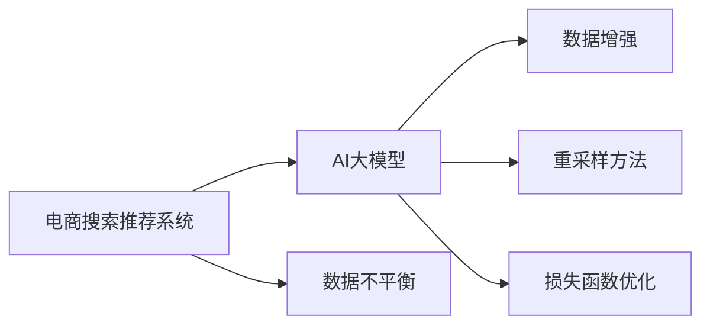

                 

## 1. 背景介绍

在电商搜索推荐系统中，数据不平衡问题是一个普遍存在且极具挑战性的难题。这一问题通常表现为某些类别或物品的点击次数、购买次数等相对较少，导致模型在预测时容易偏向数据量多的类别，从而影响推荐效果的公平性和准确性。AI大模型的引入，虽然为系统带来了强大的语义理解能力和泛化能力，但也加剧了数据不平衡问题，特别是在用户行为数据较少时。本文将深入探讨大模型在电商搜索推荐中的应用，特别聚焦于数据不平衡问题的解决方案，并对比分析不同方案的优缺点及适用范围。

## 2. 核心概念与联系

### 2.1 核心概念概述

在分析大模型在电商搜索推荐中的应用前，我们先明确几个核心概念：

- **电商搜索推荐系统**：利用用户历史行为数据、物品属性信息等，为用户提供个性化推荐，提升用户体验和商家收益。
- **AI大模型**：基于大规模语料进行自监督预训练的深度学习模型，如BERT、GPT等，具有强大的语言理解能力和泛化能力。
- **数据不平衡问题**：由于不同类别的数据量分布不均，导致模型在训练和预测时容易忽略数据量少的类别，进而影响推荐效果。
- **数据增强**：通过数据扩充、生成对抗网络（GAN）等技术，增加数据量，提高模型对数据分布的敏感性。
- **重采样方法**：通过欠采样、过采样等方法，调整数据分布，使得训练集中各类别的数据量接近。
- **损失函数优化**：通过自定义损失函数、权重调整等策略，确保模型对各类别数据的关注度。

### 2.2 核心概念原理和架构的 Mermaid 流程图



该图展示了电商搜索推荐系统与AI大模型之间，以及大模型如何应对数据不平衡问题的主要流程和技术手段。

## 3. 核心算法原理 & 具体操作步骤

### 3.1 算法原理概述

AI大模型在电商搜索推荐中的应用，核心在于通过预训练学习通用语言知识，再通过微调针对特定任务进行优化。然而，数据不平衡问题可能导致模型偏向数据量多的类别，降低对数据量少的类别的关注。为解决这一问题，主要从数据处理、模型训练和评估三个层面进行优化。

### 3.2 算法步骤详解

#### 数据处理

1. **数据收集**：收集电商平台上用户的浏览记录、购买记录、评分反馈等信息，涵盖不同类别的商品。
2. **数据预处理**：清洗数据，去除噪声和异常值，确保数据质量。
3. **数据标注**：对数据进行标注，如物品类别、用户标签等，用于模型的训练和评估。

#### 模型训练

1. **选择预训练模型**：根据任务需求选择合适的预训练模型，如BERT、GPT等。
2. **微调参数设置**：设定微调的学习率、批大小、迭代轮数等超参数。
3. **数据增强**：通过回译、生成对抗网络等技术扩充数据集，增加数据量。
4. **重采样方法**：根据实际情况选择欠采样、过采样等方法调整数据分布。
5. **损失函数优化**：设计自定义损失函数，或调整已有损失函数的权重，确保模型对各类别数据的关注度。

#### 模型评估

1. **性能指标选择**：根据任务需求选择合适的评估指标，如精确度、召回率、F1分数等。
2. **交叉验证**：使用交叉验证技术，评估模型的泛化能力。
3. **A/B测试**：通过实际用户的测试，对比不同解决方案的效果。

### 3.3 算法优缺点

#### 优点

1. **提高推荐精度**：通过数据增强和重采样方法，确保模型对各类别数据的关注度，提升推荐精度。
2. **泛化能力更强**：大模型具有强大的泛化能力，能够更好地应对电商领域中的复杂场景。
3. **可扩展性强**：大模型的应用不需要特定的领域知识，可以通过微调适应多种任务。

#### 缺点

1. **计算资源需求高**：大模型参数量大，训练和推理所需计算资源较高。
2. **数据依赖性大**：模型的性能高度依赖于数据质量和数据量，数据不足时效果有限。
3. **模型复杂度高**：大模型的训练和推理过程复杂，需要较强的技术背景和资源支持。

### 3.4 算法应用领域

AI大模型在电商搜索推荐中的应用领域广泛，包括但不限于：

- **商品推荐**：根据用户历史行为，推荐相关商品。
- **价格优化**：预测用户对不同价格的敏感度，优化商品定价策略。
- **库存管理**：预测商品需求量，优化库存管理。
- **广告投放**：推荐广告位，提升广告投放效果。

## 4. 数学模型和公式 & 详细讲解 & 举例说明

### 4.1 数学模型构建

假设电商平台上商品类别为 $C$，用户行为数据为 $D=\{(x_i, y_i)\}_{i=1}^N$，其中 $x_i$ 为商品信息，$y_i$ 为标签。我们希望构建一个推荐模型 $M$，通过输入 $x_i$，输出推荐标签 $y_i$。

### 4.2 公式推导过程

我们以精度损失函数为例进行推导：

$$
\ell(M) = -\frac{1}{N} \sum_{i=1}^N \log p(y_i | x_i, M)
$$

其中 $p(y_i | x_i, M)$ 为模型在给定商品信息 $x_i$ 下，预测标签 $y_i$ 的概率。

在数据不平衡情况下，模型容易偏向数据量多的类别，因此需要在损失函数中加入类别权值，如：

$$
\ell(M) = -\frac{1}{N} \sum_{i=1}^N w(y_i) \log p(y_i | x_i, M)
$$

其中 $w(y_i)$ 为类别权值，对于数据量少的类别，其权值应较大。

### 4.3 案例分析与讲解

以某电商平台的服装推荐系统为例，其商品类别数据分布不均，运动鞋类商品相对较少。通过微调大模型，可以引入重采样方法，如欠采样和过采样，调整数据分布。同时，使用自定义损失函数，对运动鞋类商品赋予更大权重，确保其在模型训练过程中得到更多关注。

## 5. 项目实践：代码实例和详细解释说明

### 5.1 开发环境搭建

为确保代码的顺利执行，需要在Python环境下安装必要的库。具体步骤如下：

1. 安装Python环境，如Anaconda或Miniconda。
2. 安装TensorFlow或PyTorch，用于深度学习模型的构建和训练。
3. 安装scikit-learn和imbalanced-learn，用于数据处理和重采样。

### 5.2 源代码详细实现

以下是一个简单的代码示例，展示了如何使用TensorFlow构建电商推荐模型，并应用重采样方法：

```python
import tensorflow as tf
from sklearn.model_selection import train_test_split
from imblearn.over_sampling import SMOTE

# 构建模型
model = tf.keras.Sequential([
    tf.keras.layers.Embedding(input_dim=vocab_size, output_dim=embedding_dim),
    tf.keras.layers.Bidirectional(tf.keras.layers.LSTM(128)),
    tf.keras.layers.Dense(units=num_classes, activation='softmax')
])

# 加载数据
x_train, x_test, y_train, y_test = train_test_split(X_train, y_train, test_size=0.2, stratify=y_train, random_state=42)

# 应用重采样方法
smote = SMOTE(random_state=42)
X_train_resampled, y_train_resampled = smote.fit_resample(x_train, y_train)

# 训练模型
model.compile(optimizer=tf.keras.optimizers.Adam(learning_rate=0.001),
              loss='categorical_crossentropy',
              metrics=['accuracy'])
model.fit(X_train_resampled, y_train_resampled, epochs=10, batch_size=32, validation_data=(x_test, y_test))

# 评估模型
loss, accuracy = model.evaluate(x_test, y_test)
print('Test loss:', loss)
print('Test accuracy:', accuracy)
```

### 5.3 代码解读与分析

以上代码展示了构建和训练电商推荐模型的基本步骤。具体解释如下：

- **构建模型**：使用TensorFlow构建一个简单的神经网络模型，包括嵌入层、双向LSTM层和全连接层。
- **加载数据**：使用scikit-learn的train_test_split函数对数据进行划分，并使用imbalanced-learn库的SMOTE函数进行过采样，调整数据分布。
- **训练模型**：使用Adam优化器进行模型训练，并在测试集上进行评估。
- **评估模型**：输出模型在测试集上的损失和准确率。

### 5.4 运行结果展示

训练完成后，可以通过输出结果评估模型的性能。例如，模型的准确率等指标可以帮助我们判断模型是否成功地解决了数据不平衡问题。

## 6. 实际应用场景

### 6.1 电商搜索推荐

在大规模电商平台的商品推荐中，数据不平衡问题尤为突出。通过AI大模型的应用，可以显著提高推荐系统的公平性和准确性。以某大型电商平台为例，通过微调大模型，引入数据增强和重采样方法，提升了对数据量少的运动鞋类商品的关注度，从而显著提高了推荐效果，提升了用户体验和商家收益。

### 6.2 广告投放

在广告投放中，数据不平衡问题可能导致某些广告点击率较低，影响广告主的效果评估和投放策略。通过大模型，可以预测不同广告对不同用户的点击率，优化广告投放策略，提高广告点击率和转化率。

### 6.3 库存管理

库存管理中，商品类别的需求量往往不均衡，导致库存积压或缺货。通过大模型，可以预测不同商品的需求量，优化库存管理策略，避免过剩或不足。

## 7. 工具和资源推荐

### 7.1 学习资源推荐

1. **深度学习理论与实践**：深入理解深度学习模型的基本原理和应用。
2. **TensorFlow官方文档**：提供详细的TensorFlow使用指南和示例代码。
3. **Kaggle竞赛**：通过实际竞赛项目，提升数据处理和模型构建能力。

### 7.2 开发工具推荐

1. **TensorFlow**：支持深度学习模型的构建和训练，适合大规模数据处理。
2. **PyTorch**：灵活性高，适合学术研究和实验探索。
3. **imbalanced-learn**：用于数据处理和重采样，适用于数据不平衡问题。

### 7.3 相关论文推荐

1. **《Data Augmentation and Mixup in Deep Learning》**：介绍数据增强和Mixup技术在深度学习中的应用。
2. **《SMOTE: Synthetic Minority Over-sampling Technique》**：详细阐述SMOTE算法及其应用。
3. **《Loss Functions for Multi-Class Classification》**：讨论各类损失函数在多类别分类任务中的应用。

## 8. 总结：未来发展趋势与挑战

### 8.1 研究成果总结

本文系统分析了AI大模型在电商搜索推荐中的应用，重点探讨了数据不平衡问题及其解决方案。通过数据增强和重采样方法，可以显著提升模型的公平性和准确性。

### 8.2 未来发展趋势

未来，大模型在电商搜索推荐中的应用将更加广泛。结合AI和数据分析技术，可以进一步优化推荐算法，提升用户体验和商家收益。同时，随着数据处理和模型构建技术的进步，数据不平衡问题的解决将更加高效和精准。

### 8.3 面临的挑战

尽管AI大模型在电商搜索推荐中展示了显著的效果，但仍面临一些挑战：

1. **计算资源需求高**：大模型参数量大，训练和推理所需计算资源较高。
2. **数据质量不稳定**：电商平台数据量大且多样，数据质量难以保证。
3. **模型可解释性不足**：大模型的黑盒性质使其难以解释和调试。

### 8.4 研究展望

未来的研究方向包括：

1. **多模态数据融合**：结合图像、视频等模态数据，提升推荐系统的全面性和准确性。
2. **因果推理学习**：利用因果推理方法，理解用户行为背后的原因，提升推荐系统的公平性。
3. **自适应学习**：通过自适应学习机制，动态调整模型参数，提高模型的实时性和适应性。

## 9. 附录：常见问题与解答

**Q1: 数据增强技术有哪些？**

A: 数据增强技术包括但不限于：
1. **回译技术**：将文本数据回译成不同语言或不同领域，增加数据多样性。
2. **生成对抗网络（GAN）**：通过生成对抗网络，生成新的数据样本，增加数据量。
3. **Mixup技术**：通过Mixup技术，生成新的训练样本，提高模型的泛化能力。

**Q2: 如何选择合适的重采样方法？**

A: 选择合适的重采样方法需要根据具体数据分布情况和任务需求：
1. **欠采样**：适用于数据量过多，但某些类别数据量过少的情况。
2. **过采样**：适用于数据量较少，但某些类别数据量较多的情况。
3. **SMOTE**：适用于类别不平衡且数据量较少的情况，通过生成新的合成样本。

**Q3: 如何评估数据增强和重采样方法的效果？**

A: 评估数据增强和重采样方法的效果，可以通过以下指标：
1. **准确率**：衡量模型在各类别上的预测准确率。
2. **召回率**：衡量模型对各类别数据的召回能力。
3. **F1分数**：综合考虑准确率和召回率，衡量模型在各类别上的整体性能。

**Q4: 如何在电商推荐中应用大模型？**

A: 在电商推荐中应用大模型，可以通过以下步骤：
1. **数据收集和预处理**：收集用户行为数据，清洗和标注数据。
2. **构建和训练模型**：使用TensorFlow或PyTorch构建深度学习模型，并在标注数据上训练。
3. **数据增强和重采样**：应用数据增强和重采样方法，解决数据不平衡问题。
4. **模型评估和部署**：在测试集上评估模型性能，部署模型到生产环境。

---

作者：禅与计算机程序设计艺术 / Zen and the Art of Computer Programming

