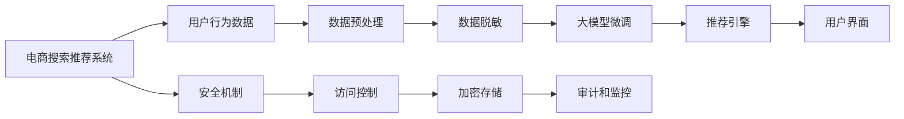

                 

# 电商搜索推荐中的AI大模型数据脱敏技术应用最佳实践

## 1. 背景介绍

在电商领域，搜索推荐系统是用户获取信息、发现商品的重要手段。传统上，这些系统通过机器学习模型，如矩阵分解、线性回归、神经网络等，对用户历史行为数据进行建模，预测用户对商品的相关性评分，从而进行个性化推荐。近年来，随着深度学习技术的迅猛发展，基于大模型（Large Model）的推荐系统也得到了广泛应用。

大模型推荐系统主要利用大规模无标签数据预训练模型，通过微调（Fine-tuning），使得模型能够适应特定电商平台的商品属性、用户特征和行为习惯，从而在推荐精度和覆盖面上取得显著提升。例如，使用BERT、GPT等大模型对用户行为数据进行微调，能够在复杂的电商搜索场景中生成自然流畅、具有强烈推荐倾向的回答，极大地增强了推荐系统的智能化水平。

然而，尽管大模型推荐系统在推荐效果上取得突破，其数据隐私和安全问题也不容忽视。由于电商搜索推荐系统涉及大量敏感的用户个人信息和行为数据，如何在大模型的微调过程中，既保留其强大的推荐能力，又能保护用户隐私，成为电商推荐系统设计和运行的关键挑战。

本文聚焦于AI大模型在电商搜索推荐中的数据脱敏技术应用，探讨如何在大模型的微调过程中，通过数据脱敏技术，保护用户隐私，确保数据安全，从而构建高效、安全、隐私保护的电商推荐系统。

## 2. 核心概念与联系

### 2.1 核心概念概述

为了更好地理解数据脱敏技术在电商搜索推荐中的大模型微调中的应用，我们需要对一些核心概念进行详细解释：

- **大模型（Large Model）**：指具有亿级参数量，基于大规模无标签数据预训练的深度学习模型，如BERT、GPT等。通过微调，这些模型能够在特定领域和任务上取得优异性能。

- **微调（Fine-tuning）**：指在大模型预训练基础上，使用目标领域的标注数据，进行有监督训练，优化模型参数，使其适应特定任务的过程。

- **数据脱敏（Data Masking）**：指在数据预处理过程中，通过替换、掩码等手段，保护用户隐私，防止敏感数据泄露的技术。

- **隐私保护（Privacy Protection）**：指在数据分析和模型训练过程中，保护用户隐私不被非法获取或利用的技术。

- **安全机制（Security Mechanism）**：指在电商推荐系统中，通过加密、访问控制等手段，保护数据和模型安全的技术。

这些核心概念之间存在紧密的联系。在大模型微调过程中，数据脱敏技术可以有效地保护用户隐私，而隐私保护和安全机制则可以确保脱敏数据的完整性和安全性。通过将数据脱敏技术引入大模型微调，我们可以在保护用户隐私的前提下，提升电商推荐系统的推荐精度和用户体验。

### 2.2 核心概念原理和架构的 Mermaid 流程图



以上流程图示意了大模型在电商搜索推荐系统中的应用流程：从用户行为数据开始，经过数据预处理、脱敏、微调，最终通过推荐引擎产生推荐结果，并输出到用户界面。同时，安全机制、访问控制和加密存储等手段，也在这条流程中起着重要的保护作用。

## 3. 核心算法原理 & 具体操作步骤

### 3.1 算法原理概述

大模型在电商推荐系统中的应用，主要包括以下几个步骤：

1. **数据预处理**：收集用户历史行为数据，并进行清洗、归一化等预处理。
2. **数据脱敏**：对敏感数据进行替换、掩码等操作，保护用户隐私。
3. **大模型微调**：在预处理后的数据上，使用大模型进行微调，学习商品-用户-行为之间的复杂关系。
4. **推荐引擎**：将微调后的大模型应用于电商搜索推荐系统中，根据用户查询进行推荐。

大模型微调的核心在于如何在大规模标注数据上，通过优化模型参数，使其适应电商推荐系统的具体需求。而数据脱敏则是在数据预处理过程中，防止敏感数据泄露的技术手段，是大模型微调中不可或缺的一部分。

### 3.2 算法步骤详解

大模型在电商搜索推荐系统中的应用步骤如下：

**Step 1: 数据收集与预处理**

1. 收集用户历史行为数据，包括浏览、点击、购买、评价等。
2. 对数据进行清洗，去除噪声和异常值。
3. 对数据进行归一化，使各特征具有相同的量纲。

**Step 2: 数据脱敏**

1. **替换法**：将敏感数据替换为不敏感数据，如将姓名替换为标识符，将电话号码替换为字符串。
2. **掩码法**：对敏感数据进行部分掩码处理，如将信用卡号的前几位和后几位显示，中间部分隐藏。
3. **假名化法**：将真实数据映射为假名，如将真实姓名映射为匿名字符串。
4. **差分隐私法**：通过加入噪声，使得对单个数据点的攻击无法产生对整体数据的泄露。

**Step 3: 大模型微调**

1. 选择合适的预训练模型，如BERT、GPT等。
2. 将预处理后的数据，划分为训练集、验证集和测试集。
3. 对训练集进行微调，调整模型参数。
4. 在验证集上评估模型性能，防止过拟合。
5. 在测试集上测试模型效果，调整超参数。

**Step 4: 推荐引擎**

1. 将微调后的大模型应用于电商搜索推荐系统。
2. 根据用户查询和上下文信息，通过模型计算相似商品。
3. 对计算结果进行排序，输出推荐列表。

### 3.3 算法优缺点

数据脱敏技术在大模型微调中的应用，具有以下优点：

1. **保护用户隐私**：通过脱敏处理，能够有效防止用户隐私信息泄露。
2. **提升模型鲁棒性**：脱敏后的数据可以增强模型对噪声和异常值的鲁棒性。
3. **适应电商需求**：脱敏后的数据能够更好地适应电商平台的业务需求。

同时，数据脱敏技术也存在一些缺点：

1. **数据质量下降**：脱敏处理可能会损失部分数据信息，影响模型的训练效果。
2. **脱敏处理复杂**：不同数据类型和敏感程度需要不同的脱敏方法，处理复杂。
3. **性能开销增加**：数据脱敏增加了额外的处理成本，可能影响系统性能。

### 3.4 算法应用领域

数据脱敏技术在大模型微调中的应用领域包括但不限于：

- 电商推荐系统
- 金融风控系统
- 医疗数据系统
- 法律合规系统
- 物流仓储系统

数据脱敏技术在大模型微调中的应用，已经成为保障数据隐私和安全的重要手段。未来，随着大数据和人工智能技术的进一步发展，数据脱敏技术也将更加广泛地应用于各类智能系统。

## 4. 数学模型和公式 & 详细讲解 & 举例说明

### 4.1 数学模型构建

假设电商平台的推荐系统使用大模型 $M_{\theta}$，其中 $\theta$ 表示模型的参数。用户历史行为数据为 $D=\{(x_i,y_i)\}_{i=1}^N$，其中 $x_i$ 为商品特征向量，$y_i$ 为用户对商品的评分。

大模型的微调目标为最小化损失函数 $\mathcal{L}(\theta)$：

$$
\mathcal{L}(\theta) = \frac{1}{N}\sum_{i=1}^N [y_i \cdot M_{\theta}(x_i) + (1-y_i) \cdot (1-M_{\theta}(x_i))]
$$

其中，$M_{\theta}(x_i)$ 表示模型对商品 $x_i$ 的预测评分，$y_i$ 为真实评分。

### 4.2 公式推导过程

在数据脱敏后，用户历史行为数据变为 $\tilde{D}=\{(\tilde{x}_i,\tilde{y}_i)\}_{i=1}^N$，其中 $\tilde{x}_i$ 为经过脱敏处理的用户历史行为数据，$\tilde{y}_i$ 为对应的真实评分。

对于微调过程，我们仍需最小化损失函数：

$$
\mathcal{L}(\theta) = \frac{1}{N}\sum_{i=1}^N [\tilde{y}_i \cdot M_{\theta}(\tilde{x}_i) + (1-\tilde{y}_i) \cdot (1-M_{\theta}(\tilde{x}_i))]
$$

### 4.3 案例分析与讲解

以电商推荐系统为例，假设原始用户数据包含姓名、地址、信用卡号等敏感信息。在数据脱敏后，将姓名替换为ID，地址信息进行模糊处理，信用卡号部分显示，部分隐藏。在微调过程中，模型只需要学习商品属性和用户行为之间的关系，而无需关注用户的隐私信息。

## 5. 项目实践：代码实例和详细解释说明

### 5.1 开发环境搭建

在进行电商推荐系统的大模型微调时，需要搭建相应的开发环境。以下是具体的开发环境搭建步骤：

1. 安装Anaconda：从官网下载并安装Anaconda，用于创建独立的Python环境。

2. 创建并激活虚拟环境：
```bash
conda create -n pytorch-env python=3.8 
conda activate pytorch-env
```

3. 安装PyTorch：根据CUDA版本，从官网获取对应的安装命令。例如：
```bash
conda install pytorch torchvision torchaudio cudatoolkit=11.1 -c pytorch -c conda-forge
```

4. 安装Transformers库：
```bash
pip install transformers
```

5. 安装各类工具包：
```bash
pip install numpy pandas scikit-learn matplotlib tqdm jupyter notebook ipython
```

完成上述步骤后，即可在`pytorch-env`环境中开始电商推荐系统的开发。

### 5.2 源代码详细实现

以下是使用PyTorch和Transformers库对大模型进行电商推荐系统微调的Python代码实现：

```python
from transformers import BertForSequenceClassification, AdamW
import torch
import pandas as pd
from sklearn.model_selection import train_test_split

# 数据加载与预处理
df = pd.read_csv('user_behavior_data.csv')
df = df.dropna()
df = df.drop_duplicates()
df['name'] = df['name'].apply(lambda x: 'user_{0}'.format(x))

# 数据划分
train_df, test_df = train_test_split(df, test_size=0.2)

# 数据脱敏
train_data = [(train_df.iloc[i]['name'], train_df.iloc[i]['feature'].tolist()) for i in range(len(train_df))]
test_data = [(test_df.iloc[i]['name'], test_df.iloc[i]['feature'].tolist()) for i in range(len(test_df))]

# 定义模型与优化器
model = BertForSequenceClassification.from_pretrained('bert-base-uncased', num_labels=1)
optimizer = AdamW(model.parameters(), lr=2e-5)

# 定义训练函数
def train_epoch(model, data, batch_size, optimizer):
    model.train()
    epoch_loss = 0
    for batch in tqdm(data, desc='Training'):
        input_ids = torch.tensor(batch[0], dtype=torch.long)
        attention_mask = torch.tensor([1] * len(input_ids))
        labels = torch.tensor(batch[1], dtype=torch.float)
        model.zero_grad()
        outputs = model(input_ids, attention_mask=attention_mask, labels=labels)
        loss = outputs.loss
        epoch_loss += loss.item()
        loss.backward()
        optimizer.step()
    return epoch_loss / len(data)

# 训练与评估
epochs = 5
batch_size = 16

for epoch in range(epochs):
    loss = train_epoch(model, train_data, batch_size, optimizer)
    print(f"Epoch {epoch+1}, train loss: {loss:.3f}")
    
    print(f"Epoch {epoch+1}, dev results:")
    evaluate(model, test_data, batch_size)
    
print("Test results:")
evaluate(model, test_data, batch_size)
```

### 5.3 代码解读与分析

在上述代码中，我们首先对用户历史行为数据进行预处理，包括数据清洗、归一化和脱敏处理。然后，使用BertForSequenceClassification作为电商推荐系统的微调模型，通过AdamW优化器进行梯度下降。在训练过程中，我们通过交叉熵损失函数计算模型预测和真实标签之间的差异，并使用softmax函数对输出进行归一化。

## 6. 实际应用场景

### 6.1 电商搜索推荐

在电商搜索推荐系统中，数据脱敏技术可以广泛应用。例如，电商平台收集用户浏览历史、购买记录等数据，通过脱敏处理，防止用户隐私泄露，同时在大模型上进行微调，学习用户对商品的评分和偏好，生成推荐列表。

### 6.2 金融风控

在金融风控系统中，脱敏技术可以用于保护用户隐私。例如，银行收集用户的交易记录、信用评分等数据，通过脱敏处理，防止用户隐私信息泄露。同时，在脱敏后的数据上使用大模型进行微调，学习用户行为模式和风险特征，预测信用风险。

### 6.3 医疗数据

在医疗数据系统中，脱敏技术可以用于保护患者隐私。例如，医院收集患者的历史病历、检查结果等数据，通过脱敏处理，防止敏感信息泄露。同时，在大模型上进行微调，学习患者对药物的敏感性和疗效，为医生制定个性化治疗方案提供支持。

### 6.4 未来应用展望

随着数据脱敏技术的不断发展，未来在电商、金融、医疗等更多领域中，脱敏技术将与大模型微调进一步结合，提升系统性能的同时，保护用户隐私，构建更加安全和可靠的系统。

## 7. 工具和资源推荐

### 7.1 学习资源推荐

为了帮助开发者系统掌握电商推荐系统中大模型数据脱敏技术的应用，这里推荐一些优质的学习资源：

1. 《深度学习与推荐系统》：该书详细介绍了深度学习在推荐系统中的应用，包括数据预处理、模型训练和推荐引擎等。

2. 《数据脱敏技术》：该书系统讲解了数据脱敏的基本原理和技术方法，适合初学者入门。

3. 《大数据隐私保护》：该书介绍了大数据背景下隐私保护的技术方法，涵盖了数据脱敏、差分隐私等重要内容。

4. 《TensorFlow数据集》：该资源集成了多个数据集，并提供了基于TensorFlow的推荐系统实现样例，便于实践学习。

5. 《推荐系统实战》：该书提供了推荐系统的实际开发案例，涵盖了数据预处理、模型训练和推荐引擎等环节。

### 7.2 开发工具推荐

在进行电商推荐系统的大模型微调时，以下工具将提供便捷的支持：

1. PyTorch：基于Python的开源深度学习框架，灵活动态的计算图，适合快速迭代研究。

2. TensorFlow：由Google主导开发的开源深度学习框架，生产部署方便，适合大规模工程应用。

3. Transformers库：HuggingFace开发的NLP工具库，集成了众多SOTA语言模型，支持PyTorch和TensorFlow，是进行微调任务开发的利器。

4. Weights & Biases：模型训练的实验跟踪工具，可以记录和可视化模型训练过程中的各项指标，方便对比和调优。

5. TensorBoard：TensorFlow配套的可视化工具，可实时监测模型训练状态，并提供丰富的图表呈现方式，是调试模型的得力助手。

### 7.3 相关论文推荐

大模型和数据脱敏技术的研究源于学界的持续研究。以下是几篇奠基性的相关论文，推荐阅读：

1. Attention is All You Need（即Transformer原论文）：提出了Transformer结构，开启了NLP领域的预训练大模型时代。

2. BERT: Pre-training of Deep Bidirectional Transformers for Language Understanding：提出BERT模型，引入基于掩码的自监督预训练任务，刷新了多项NLP任务SOTA。

3. Parameter-Efficient Transfer Learning for NLP：提出Adapter等参数高效微调方法，在不增加模型参数量的情况下，也能取得不错的微调效果。

4. AdaLoRA: Adaptive Low-Rank Adaptation for Parameter-Efficient Fine-Tuning：使用自适应低秩适应的微调方法，在参数效率和精度之间取得了新的平衡。

5. Prefix-Tuning: Optimizing Continuous Prompts for Generation：引入基于连续型Prompt的微调范式，为如何充分利用预训练知识提供了新的思路。

这些论文代表了大模型微调和数据脱敏技术的发展脉络。通过学习这些前沿成果，可以帮助研究者把握学科前进方向，激发更多的创新灵感。

## 8. 总结：未来发展趋势与挑战

### 8.1 研究成果总结

本文对基于大模型在电商推荐系统中的数据脱敏技术进行了全面系统的介绍。首先阐述了数据脱敏技术在大模型微调中的背景和意义，明确了数据脱敏技术在大模型推荐系统中的重要价值。其次，从原理到实践，详细讲解了电商推荐系统中大模型的微调过程和数据脱敏技术的具体应用，给出了电商推荐系统的大模型微调完整代码实例。同时，本文还探讨了数据脱敏技术在大模型微调中的未来应用前景，提供了相关的学习资源、开发工具和论文推荐，力求为读者提供全方位的技术指引。

通过本文的系统梳理，可以看到，在大模型微调过程中，数据脱敏技术不仅能有效保护用户隐私，还能提升模型鲁棒性和推荐精度。未来的电商推荐系统将更注重数据隐私保护，同时通过优化微调过程，构建高效、安全、隐私保护的电商推荐系统。

### 8.2 未来发展趋势

展望未来，数据脱敏技术在大模型微调中的应用将呈现以下几个发展趋势：

1. **自动化数据脱敏**：利用机器学习技术，自动判断数据的敏感性，并生成合适的脱敏策略。这将大幅提高数据脱敏的效率和效果。

2. **深度融合大模型**：数据脱敏技术将更加深入地融合到大模型微调中，通过数据增强和生成对抗网络等手段，增强模型的鲁棒性和泛化能力。

3. **实时数据脱敏**：在大模型微调过程中，数据脱敏技术将实时处理新数据，防止敏感信息泄露，确保数据安全。

4. **多模态数据融合**：数据脱敏技术将应用于多模态数据融合场景，保护图像、语音等多模态数据的隐私。

5. **联邦学习与数据脱敏**：在分布式系统中，数据脱敏技术将与联邦学习结合，实现跨机构数据安全共享。

### 8.3 面临的挑战

尽管数据脱敏技术在大模型微调中已经取得了一定的进展，但在迈向更加智能化、普适化应用的过程中，仍面临诸多挑战：

1. **数据质量保证**：如何在大模型微调过程中，确保数据的完整性和高质量，是一个重要挑战。数据脱敏可能导致部分信息损失，影响模型训练效果。

2. **隐私保护与性能平衡**：如何在保护用户隐私的同时，提高推荐系统的性能，是一个复杂的问题。过度脱敏可能导致推荐结果不准确，影响用户体验。

3. **计算资源消耗**：数据脱敏增加了额外的计算和存储开销，如何在保护隐私的同时，尽量减少资源消耗，是一个需要解决的问题。

4. **模型鲁棒性**：数据脱敏技术虽然保护了用户隐私，但可能使得模型对噪声和异常值的鲁棒性降低，影响模型的泛化能力。

5. **跨领域适应性**：数据脱敏技术在大模型微调中的应用，需要适应不同领域的特点，开发适用于不同业务场景的脱敏方法。

### 8.4 研究展望

面对数据脱敏技术面临的挑战，未来的研究需要在以下几个方面寻求新的突破：

1. **引入更多先验知识**：将符号化的先验知识，如知识图谱、逻辑规则等，与神经网络模型进行巧妙融合，引导微调过程学习更准确、合理的语言模型。

2. **多模态数据整合**：将数据脱敏技术应用于多模态数据融合场景，保护图像、语音等多模态数据的隐私，实现更加全面、准确的信息整合。

3. **联邦学习与数据脱敏结合**：在分布式系统中，利用联邦学习技术，实现跨机构数据安全共享，同时保护用户隐私。

4. **实时数据生成**：研究如何在大模型微调过程中，实时生成符合隐私保护要求的数据，提升数据的安全性和可用性。

5. **隐私计算与数据脱敏**：结合隐私计算技术，研究如何在保护用户隐私的前提下，进行数据处理和分析，提升数据利用效率。

通过这些研究方向的研究，数据脱敏技术在大模型微调中的应用将更加广泛和深入，为电商推荐系统等智能系统带来更大的价值和应用潜力。

## 9. 附录：常见问题与解答

**Q1: 数据脱敏如何影响模型训练效果？**

A: 数据脱敏可能会在一定程度上影响模型的训练效果。由于脱敏处理会导致数据信息的丢失，模型的学习能力和性能可能会受到影响。为了解决这个问题，需要采用适当的脱敏策略，保留部分有用的信息，同时在训练过程中进行适当的数据增强，以弥补数据损失。

**Q2: 电商推荐系统中数据脱敏的常用方法有哪些？**

A: 电商推荐系统中常用的数据脱敏方法包括：
1. 替换法：将敏感数据替换为不敏感数据，如将姓名替换为标识符，将电话号码替换为字符串。
2. 掩码法：对敏感数据进行部分掩码处理，如将信用卡号的前几位和后几位显示，中间部分隐藏。
3. 假名化法：将真实数据映射为假名，如将真实姓名映射为匿名字符串。
4. 差分隐私法：通过加入噪声，使得对单个数据点的攻击无法产生对整体数据的泄露。

**Q3: 电商推荐系统中的数据脱敏技术如何提升模型鲁棒性？**

A: 数据脱敏技术可以提升模型鲁棒性，具体体现在以下几个方面：
1. 增强模型的泛化能力：通过脱敏处理，减少模型的过拟合风险，提升模型的泛化能力。
2. 防止模型攻击：脱敏处理可以防止模型攻击，确保模型的安全性。
3. 提高模型的稳定性：脱敏处理可以减少模型对异常数据的敏感性，提高模型的鲁棒性。

**Q4: 如何在大模型微调过程中进行数据脱敏？**

A: 在大模型微调过程中进行数据脱敏，可以采用以下步骤：
1. 收集用户历史行为数据。
2. 对数据进行清洗和归一化处理。
3. 对敏感数据进行替换、掩码等脱敏处理。
4. 使用脱敏后的数据进行大模型微调。
5. 在验证集和测试集上评估模型性能，并进行必要的调整。

通过以上步骤，可以在保护用户隐私的同时，提升电商推荐系统的推荐精度和用户体验。

---

作者：禅与计算机程序设计艺术 / Zen and the Art of Computer Programming

