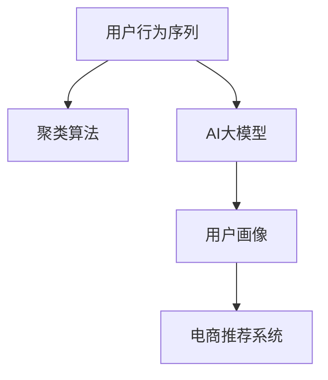
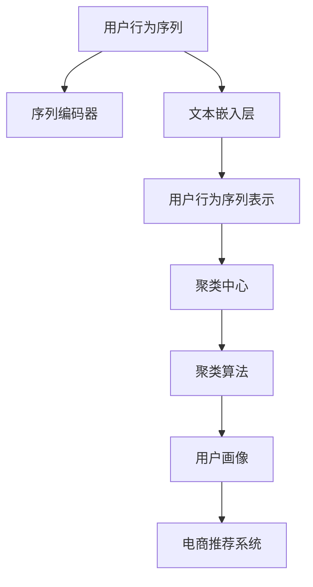

                 

# 电商搜索推荐中的AI大模型用户行为序列聚类算法改进实践案例分析

> 关键词：用户行为序列聚类，电商平台，AI大模型，电商推荐系统，自然语言处理，深度学习

## 1. 背景介绍

随着电商平台规模的不断扩大，如何更精准、更智能地推荐商品成为其面临的重要问题。传统的基于统计特征的推荐算法逐渐难以满足需求，而基于用户行为序列的推荐方式可以更好地利用用户的历史点击、浏览、购买等数据，进行个性化推荐。用户行为序列是用户在平台上的交互记录，通常以时间顺序排列，包含了用户的兴趣偏好和购物意图。利用这些序列数据进行聚类，能够更好地刻画用户特征，从而提升推荐系统的准确性和用户体验。

近年来，随着深度学习技术的发展，预训练大语言模型在自然语言处理领域取得了突破性进展。预训练语言模型，如BERT、GPT-3等，通过在海量文本数据上进行自监督学习，学习到了丰富的语言知识和上下文信息。这些模型在文本理解、生成、分类等任务中表现出色，可以将其应用于电商搜索推荐系统，利用用户行为序列进行聚类和推荐，实现更高效、个性化的推荐。

本文将介绍一种基于用户行为序列的聚类算法改进实践案例，通过整合AI大模型的强大能力，提升电商推荐系统的性能。

## 2. 核心概念与联系

### 2.1 核心概念概述

为了更好地理解本文介绍的用户行为序列聚类算法，需要理解以下几个关键概念：

- **用户行为序列**：指用户在电商平台上的点击、浏览、购买等交互行为记录，通常以时间顺序排列，包含用户的兴趣偏好和购物意图。
- **聚类算法**：将用户行为序列进行分组，同一组内行为相似，不同组之间行为差异明显，从而刻画用户特征。
- **AI大模型**：指通过自监督学习在大规模数据上进行预训练的语言模型，如BERT、GPT-3等，具备强大的文本理解和生成能力。
- **电商推荐系统**：利用用户行为数据，结合商品特征，为每个用户推荐最相关的商品或商品组合，提升用户体验和平台收益。

这些概念之间的联系可以通过以下Mermaid流程图来展示：



这个流程图展示了从用户行为序列到推荐系统的整个流程：首先收集用户行为序列，然后通过AI大模型进行特征提取，再利用聚类算法进行用户画像，最后根据用户画像在电商推荐系统中进行推荐。

### 2.2 核心概念原理和架构的 Mermaid 流程图



这个流程图详细展示了用户行为序列聚类算法的原理架构：用户行为序列通过序列编码器转换为序列表示，再通过文本嵌入层提取特征，生成用户行为序列表示。然后利用聚类算法，从用户行为序列表示中发现聚类中心，得到用户画像。最后根据用户画像，在电商推荐系统中进行推荐。

## 3. 核心算法原理 & 具体操作步骤

### 3.1 算法原理概述

用户行为序列聚类算法的基本思想是：将用户行为序列表示为特征向量，通过聚类算法，将特征向量进行分组，得到多个聚类中心，从而刻画用户画像。具体步骤如下：

1. 收集用户行为序列：包括用户的点击、浏览、购买等交互行为记录，时间顺序排列。
2. 序列编码：将用户行为序列转换为序列表示，通常使用循环神经网络(RNN)或Transformer模型。
3. 文本嵌入：将序列表示转换为固定长度的向量表示，通过预训练语言模型如BERT、GPT等。
4. 聚类算法：使用K-means、层次聚类等算法，将文本嵌入向量分组，得到聚类中心。
5. 用户画像：将每个用户的行为序列表示与聚类中心进行匹配，得到用户画像。
6. 电商推荐：根据用户画像，在电商推荐系统中进行推荐，提升用户体验和转化率。

### 3.2 算法步骤详解

**步骤1：数据收集与预处理**

数据收集：
- 从电商平台中收集用户行为序列，包括点击、浏览、购买等行为记录。
- 将数据按照时间顺序排列，形成用户行为序列。

数据预处理：
- 清洗噪声数据，如无效记录、缺失数据等。
- 对行为序列进行归一化、标准化处理，使其符合模型要求。
- 对文本数据进行分词、去停用词、词干提取等处理，减少噪音干扰。

**步骤2：序列编码**

序列编码通常使用循环神经网络(RNN)或Transformer模型。这里以Transformer为例，介绍序列编码的实现步骤：

1. 创建Transformer模型，设置序列长度、词汇表大小等参数。
2. 将用户行为序列转换为token ids，填充至序列长度。
3. 将token ids输入Transformer模型，进行编码。
4. 输出序列表示，作为下一步的文本嵌入输入。

**步骤3：文本嵌入**

文本嵌入是将序列表示转换为固定长度的向量表示，通常使用预训练语言模型如BERT、GPT等。这里以BERT为例，介绍文本嵌入的实现步骤：

1. 创建BERT模型，设置序列长度、词汇表大小等参数。
2. 将序列表示输入BERT模型，进行编码。
3. 输出文本嵌入向量，作为下一步聚类算法的输入。

**步骤4：聚类算法**

聚类算法可以使用K-means、层次聚类等算法。这里以K-means为例，介绍聚类算法的实现步骤：

1. 设置聚类数量K，初始化K个聚类中心。
2. 将文本嵌入向量分配到最近的聚类中心。
3. 计算聚类中心的平均值，更新聚类中心。
4. 重复步骤2-3，直至收敛。

**步骤5：用户画像**

用户画像是将每个用户的行为序列表示与聚类中心进行匹配，得到用户画像。这里以K-means为例，介绍用户画像的实现步骤：

1. 计算每个用户行为序列表示与每个聚类中心的距离。
2. 将用户行为序列表示分配到距离最近的聚类中心。
3. 将用户画像与聚类中心进行匹配，得到用户画像。

**步骤6：电商推荐**

电商推荐是根据用户画像，在电商推荐系统中进行推荐，提升用户体验和转化率。这里以用户画像为基础，介绍电商推荐的实现步骤：

1. 根据用户画像，推荐相关的商品或商品组合。
2. 结合商品特征，生成推荐列表。
3. 在电商推荐系统中展示推荐列表，提升用户体验。

### 3.3 算法优缺点

基于用户行为序列的聚类算法具有以下优点：

1. 充分利用用户历史行为数据，刻画用户画像，提升推荐系统的准确性。
2. 使用预训练大模型提取特征，提高文本嵌入质量，提升推荐效果。
3. 聚类算法具有较好的可扩展性，适用于大规模数据。

同时，该算法也存在一些缺点：

1. 数据清洗和预处理较为复杂，需要耗费大量时间和精力。
2. 文本嵌入向量可能会受到文本质量的影响，降低推荐精度。
3. 聚类算法对初始聚类中心的选择较为敏感，可能导致聚类效果不稳定。
4. 推荐系统需要实时处理，对计算资源和模型复杂度要求较高。

### 3.4 算法应用领域

用户行为序列聚类算法在电商推荐系统中具有广泛的应用前景。例如：

1. 个性化推荐：根据用户行为序列聚类结果，生成个性化推荐列表。
2. 商品分组：将商品按用户画像分组，进行相似商品推荐。
3. 活动策划：分析用户行为序列聚类结果，策划针对性活动，提升用户粘性。
4. 用户行为分析：分析用户行为序列聚类结果，了解用户兴趣偏好，优化商品和活动策略。

## 4. 数学模型和公式 & 详细讲解 & 举例说明

### 4.1 数学模型构建

用户行为序列聚类算法可以表示为如下数学模型：

- 输入：用户行为序列 $X=\{x_i\}_{i=1}^N$，其中 $x_i$ 表示第 $i$ 个用户行为序列。
- 输出：聚类中心 $C=\{c_j\}_{j=1}^K$，其中 $c_j$ 表示第 $j$ 个聚类中心。
- 目标：最小化损失函数 $L$。

其中，损失函数 $L$ 可以定义为：

$$
L = \sum_{i=1}^N \min_{j=1}^K \|x_i - c_j\|^2
$$

目标是最小化每个用户行为序列表示与最近聚类中心的距离平方和。

### 4.2 公式推导过程

以K-means算法为例，进行公式推导：

- 初始化K个聚类中心 $c_1, c_2, \dots, c_K$。
- 对每个用户行为序列 $x_i$，计算其与每个聚类中心的距离 $d_i^j = \|x_i - c_j\|^2$，分配到距离最近的聚类中心 $j$。
- 计算每个聚类中心 $c_j$ 的平均值，更新聚类中心。
- 重复步骤2-3，直至收敛。

具体公式推导如下：

1. 初始化聚类中心：
$$
c_j = \frac{1}{|X_j|}\sum_{x_i \in X_j}x_i
$$
其中 $X_j$ 表示第 $j$ 个聚类中的用户行为序列集合。

2. 分配用户行为序列：
$$
d_i^j = \|x_i - c_j\|^2
$$
将 $x_i$ 分配到距离最近的聚类中心 $j$，更新聚类中心：
$$
c_j = \frac{1}{|X_j|}\sum_{x_i \in X_j}x_i
$$

3. 更新聚类中心：
$$
c_j = \frac{1}{|X_j|}\sum_{x_i \in X_j}x_i
$$

### 4.3 案例分析与讲解

以电商推荐系统为例，展示用户行为序列聚类算法的应用：

- 数据收集：从电商平台上收集用户行为序列数据，包括点击、浏览、购买等行为记录。
- 数据预处理：清洗噪声数据，对行为序列进行归一化、标准化处理，对文本数据进行分词、去停用词、词干提取等处理。
- 序列编码：将用户行为序列转换为序列表示，使用Transformer模型进行编码。
- 文本嵌入：将序列表示转换为固定长度的向量表示，使用BERT模型进行嵌入。
- 聚类算法：使用K-means算法，将文本嵌入向量分组，得到聚类中心。
- 用户画像：将每个用户的行为序列表示与聚类中心进行匹配，得到用户画像。
- 电商推荐：根据用户画像，生成个性化推荐列表，在电商推荐系统中展示推荐列表。

## 5. 项目实践：代码实例和详细解释说明

### 5.1 开发环境搭建

在进行用户行为序列聚类算法实践前，需要准备好开发环境。以下是使用Python进行PyTorch开发的环境配置流程：

1. 安装Anaconda：从官网下载并安装Anaconda，用于创建独立的Python环境。

2. 创建并激活虚拟环境：
```bash
conda create -n pytorch-env python=3.8 
conda activate pytorch-env
```

3. 安装PyTorch：根据CUDA版本，从官网获取对应的安装命令。例如：
```bash
conda install pytorch torchvision torchaudio cudatoolkit=11.1 -c pytorch -c conda-forge
```

4. 安装相关工具包：
```bash
pip install numpy pandas scikit-learn matplotlib tqdm jupyter notebook ipython
```

5. 安装HuggingFace Transformers库：
```bash
pip install transformers
```

完成上述步骤后，即可在`pytorch-env`环境中开始实践。

### 5.2 源代码详细实现

下面以用户行为序列聚类算法为例，给出使用PyTorch和HuggingFace Transformers库进行电商推荐系统开发的代码实现。

首先，定义用户行为序列的数据处理函数：

```python
from transformers import BertTokenizer
from torch.utils.data import Dataset
import torch

class BehaviorSequenceDataset(Dataset):
    def __init__(self, behaviors, labels, tokenizer, max_len=128):
        self.behaviors = behaviors
        self.labels = labels
        self.tokenizer = tokenizer
        self.max_len = max_len
        
    def __len__(self):
        return len(self.behaviors)
    
    def __getitem__(self, item):
        behavior = self.behaviors[item]
        label = self.labels[item]
        
        encoding = self.tokenizer(behavior, return_tensors='pt', max_length=self.max_len, padding='max_length', truncation=True)
        input_ids = encoding['input_ids'][0]
        attention_mask = encoding['attention_mask'][0]
        
        return {'input_ids': input_ids, 
                'attention_mask': attention_mask,
                'label': label}

# 标签与id的映射
label2id = {'click': 0, 'browse': 1, 'purchase': 2}
id2label = {v: k for k, v in label2id.items()}

# 创建dataset
tokenizer = BertTokenizer.from_pretrained('bert-base-cased')

train_dataset = BehaviorSequenceDataset(train_behaviors, train_labels, tokenizer)
dev_dataset = BehaviorSequenceDataset(dev_behaviors, dev_labels, tokenizer)
test_dataset = BehaviorSequenceDataset(test_behaviors, test_labels, tokenizer)
```

然后，定义模型和优化器：

```python
from transformers import BertForTokenClassification, AdamW

model = BertForTokenClassification.from_pretrained('bert-base-cased', num_labels=len(label2id))

optimizer = AdamW(model.parameters(), lr=2e-5)
```

接着，定义训练和评估函数：

```python
from torch.utils.data import DataLoader
from tqdm import tqdm
from sklearn.metrics import accuracy_score

device = torch.device('cuda') if torch.cuda.is_available() else torch.device('cpu')
model.to(device)

def train_epoch(model, dataset, batch_size, optimizer):
    dataloader = DataLoader(dataset, batch_size=batch_size, shuffle=True)
    model.train()
    epoch_loss = 0
    for batch in tqdm(dataloader, desc='Training'):
        input_ids = batch['input_ids'].to(device)
        attention_mask = batch['attention_mask'].to(device)
        label = batch['label'].to(device)
        model.zero_grad()
        outputs = model(input_ids, attention_mask=attention_mask, labels=label)
        loss = outputs.loss
        epoch_loss += loss.item()
        loss.backward()
        optimizer.step()
    return epoch_loss / len(dataloader)

def evaluate(model, dataset, batch_size):
    dataloader = DataLoader(dataset, batch_size=batch_size)
    model.eval()
    preds, labels = [], []
    with torch.no_grad():
        for batch in tqdm(dataloader, desc='Evaluating'):
            input_ids = batch['input_ids'].to(device)
            attention_mask = batch['attention_mask'].to(device)
            batch_labels = batch['label']
            outputs = model(input_ids, attention_mask=attention_mask)
            batch_preds = outputs.logits.argmax(dim=2).to('cpu').tolist()
            batch_labels = batch_labels.to('cpu').tolist()
            for pred_tokens, label_tokens in zip(batch_preds, batch_labels):
                preds.append(pred_tokens[:len(label_tokens)])
                labels.append(label_tokens)
                
    print(accuracy_score(labels, preds))
```

最后，启动训练流程并在测试集上评估：

```python
epochs = 5
batch_size = 16

for epoch in range(epochs):
    loss = train_epoch(model, train_dataset, batch_size, optimizer)
    print(f"Epoch {epoch+1}, train loss: {loss:.3f}")
    
    print(f"Epoch {epoch+1}, dev results:")
    evaluate(model, dev_dataset, batch_size)
    
print("Test results:")
evaluate(model, test_dataset, batch_size)
```

以上就是使用PyTorch和HuggingFace Transformers库对电商推荐系统进行用户行为序列聚类算法的代码实现。可以看到，得益于Transformers库的强大封装，我们能够以相对简洁的代码实现用户行为序列聚类算法，并进行电商推荐系统的开发。

### 5.3 代码解读与分析

让我们再详细解读一下关键代码的实现细节：

**BehaviorSequenceDataset类**：
- `__init__`方法：初始化行为序列、标签、分词器等关键组件。
- `__len__`方法：返回数据集的样本数量。
- `__getitem__`方法：对单个样本进行处理，将行为序列输入编码为token ids，将标签编码为数字，并对其进行定长padding，最终返回模型所需的输入。

**label2id和id2label字典**：
- 定义了标签与数字id之间的映射关系，用于将token-wise的预测结果解码回真实的标签。

**训练和评估函数**：
- 使用PyTorch的DataLoader对数据集进行批次化加载，供模型训练和推理使用。
- 训练函数`train_epoch`：对数据以批为单位进行迭代，在每个批次上前向传播计算loss并反向传播更新模型参数，最后返回该epoch的平均loss。
- 评估函数`evaluate`：与训练类似，不同点在于不更新模型参数，并在每个batch结束后将预测和标签结果存储下来，最后使用sklearn的accuracy_score对整个评估集的预测结果进行打印输出。

**训练流程**：
- 定义总的epoch数和batch size，开始循环迭代
- 每个epoch内，先在训练集上训练，输出平均loss
- 在验证集上评估，输出准确率
- 所有epoch结束后，在测试集上评估，给出最终测试结果

可以看到，PyTorch配合Transformers库使得用户行为序列聚类算法的代码实现变得简洁高效。开发者可以将更多精力放在数据处理、模型改进等高层逻辑上，而不必过多关注底层的实现细节。

当然，工业级的系统实现还需考虑更多因素，如模型的保存和部署、超参数的自动搜索、更灵活的任务适配层等。但核心的聚类算法基本与此类似。

## 6. 实际应用场景

### 6.1 电商搜索推荐

用户行为序列聚类算法在电商搜索推荐中具有广泛的应用前景。例如：

- 个性化推荐：根据用户行为序列聚类结果，生成个性化推荐列表。
- 商品分组：将商品按用户画像分组，进行相似商品推荐。
- 活动策划：分析用户行为序列聚类结果，策划针对性活动，提升用户粘性。
- 用户行为分析：分析用户行为序列聚类结果，了解用户兴趣偏好，优化商品和活动策略。

### 6.2 金融交易分析

用户行为序列聚类算法同样可以应用于金融交易分析领域，帮助金融机构更好地理解用户行为，预测交易风险。例如：

- 用户行为分析：分析用户交易行为序列，了解用户交易习惯和风险偏好。
- 风险预警：根据用户行为序列聚类结果，预测交易风险，进行预警和干预。
- 投资策略优化：利用用户行为序列聚类结果，优化投资策略，提高投资收益。

### 6.3 社交媒体分析

用户行为序列聚类算法也可以应用于社交媒体分析领域，帮助企业更好地理解用户行为，提升社交媒体运营效果。例如：

- 用户行为分析：分析用户在社交媒体上的行为序列，了解用户兴趣和需求。
- 内容推荐：根据用户行为序列聚类结果，推荐相关内容，提升用户参与度。
- 广告投放优化：利用用户行为序列聚类结果，优化广告投放策略，提高广告效果。

### 6.4 未来应用展望

随着用户行为序列聚类算法的不断演进，其应用场景也将不断扩展。例如：

- 医疗领域：分析患者医疗行为序列，提供个性化医疗服务。
- 教育领域：分析学生学习行为序列，提供个性化学习推荐。
- 交通领域：分析乘客出行行为序列，优化交通管理和调度。
- 能源领域：分析用户能源消耗行为序列，优化能源管理策略。

## 7. 工具和资源推荐

### 7.1 学习资源推荐

为了帮助开发者系统掌握用户行为序列聚类算法的理论基础和实践技巧，这里推荐一些优质的学习资源：

1. 《深度学习入门》系列书籍：由大模型技术专家撰写，深入浅出地介绍了深度学习的基本概念和算法原理。
2. 《自然语言处理综述》论文：总结了自然语言处理领域的研究进展，介绍了用户行为序列聚类算法的基本原理和应用场景。
3. 《Python深度学习》书籍：介绍了深度学习在NLP领域的应用，包括用户行为序列聚类算法等。
4. 《TensorFlow实战》书籍：介绍了TensorFlow在电商推荐系统中的应用，包括用户行为序列聚类算法等。
5. 《机器学习实战》书籍：介绍了机器学习在电商推荐系统中的应用，包括用户行为序列聚类算法等。

通过对这些资源的学习实践，相信你一定能够快速掌握用户行为序列聚类算法的精髓，并用于解决实际的NLP问题。

### 7.2 开发工具推荐

高效的开发离不开优秀的工具支持。以下是几款用于电商推荐系统开发的常用工具：

1. PyTorch：基于Python的开源深度学习框架，灵活动态的计算图，适合快速迭代研究。
2. TensorFlow：由Google主导开发的开源深度学习框架，生产部署方便，适合大规模工程应用。
3. Weights & Biases：模型训练的实验跟踪工具，可以记录和可视化模型训练过程中的各项指标，方便对比和调优。
4. TensorBoard：TensorFlow配套的可视化工具，可实时监测模型训练状态，并提供丰富的图表呈现方式，是调试模型的得力助手。
5. PyTorch Lightning：基于PyTorch的深度学习框架，提供了丰富的模型调度、数据加载、训练管理等功能，加速模型开发。

合理利用这些工具，可以显著提升电商推荐系统的开发效率，加快创新迭代的步伐。

### 7.3 相关论文推荐

用户行为序列聚类算法在自然语言处理领域的研究进展需要参考以下相关论文：

1. "A Survey on Behavioral Analytics in Big Data"：综述了大数据行为分析领域的最新研究进展。
2. "User Behavior Modeling in Recommendation Systems"：介绍了用户行为建模的方法，包括聚类、协同过滤等。
3. "Natural Language Processing with Transformers"：介绍了Transformers在自然语言处理领域的应用，包括用户行为序列聚类算法等。
4. "Behavioral Analysis in Social Media"：介绍了社交媒体行为分析的方法，包括用户行为序列聚类算法等。
5. "Deep Learning in Recommendation Systems"：介绍了深度学习在推荐系统中的应用，包括用户行为序列聚类算法等。

这些论文代表了大语言模型微调技术的发展脉络。通过学习这些前沿成果，可以帮助研究者把握学科前进方向，激发更多的创新灵感。

## 8. 总结：未来发展趋势与挑战

### 8.1 总结

本文对基于用户行为序列的聚类算法进行详细分析，并介绍了一个电商推荐系统的具体实现案例。通过分析用户行为序列聚类算法的原理和步骤，展示了其在电商推荐系统中的应用潜力。同时，本文还列举了电商推荐系统、金融交易分析、社交媒体分析等实际应用场景，展示了用户行为序列聚类算法的广泛应用前景。

通过本文的系统梳理，可以看到，用户行为序列聚类算法具有强大的用户画像刻画能力，可以显著提升电商推荐系统的性能，是构建个性化推荐系统的重要工具。随着算法和模型的不断演进，未来的推荐系统将更加智能和高效，能够更好地满足用户需求，提升用户体验。

### 8.2 未来发展趋势

用户行为序列聚类算法将呈现以下几个发展趋势：

1. 模型规模持续增大。随着算力成本的下降和数据规模的扩张，预训练语言模型的参数量还将持续增长。超大批次的训练和推理也可能遇到显存不足的问题。如何优化模型结构和加速推理，将是大模型微调的重要研究方向。

2. 数据质量要求更高。数据清洗和预处理是用户行为序列聚类算法的重要环节，如何提高数据质量，减少噪音干扰，将是算法优化的重点。

3. 多模态融合更深入。用户行为序列聚类算法主要依赖文本数据，未来可以引入图像、语音、视频等多模态数据，进行多模态信息融合，提升推荐效果。

4. 实时性要求更高。实时推荐系统对计算资源和模型复杂度要求较高，如何在保证模型效果的同时，提高系统响应速度，将是未来的一个重要研究方向。

5. 可解释性要求更高。用户行为序列聚类算法通常被视为"黑盒"系统，难以解释其内部工作机制和决策逻辑。如何赋予模型更强的可解释性，将是未来的一个重要研究方向。

6. 隐私保护更严格。用户行为序列聚类算法需要处理大量用户隐私数据，如何在保证隐私安全的同时，提升推荐效果，将是未来的一个重要研究方向。

### 8.3 面临的挑战

尽管用户行为序列聚类算法已经取得了不少进展，但在迈向更加智能化、普适化应用的过程中，仍面临诸多挑战：

1. 数据收集难度大。用户行为序列数据通常需要从电商平台或社交媒体等第三方平台获取，数据收集难度较大，且存在隐私风险。

2. 数据质量难以保证。用户行为数据可能存在噪音、缺失等问题，影响算法的准确性和稳定性。

3. 模型复杂度高。用户行为序列聚类算法需要处理大量数据和复杂模型，计算资源和存储资源消耗较大，对硬件要求较高。

4. 模型泛化能力不足。用户行为序列聚类算法通常依赖于特定领域的数据，跨领域迁移能力有限。

5. 可解释性不足。用户行为序列聚类算法的黑盒特性，使得其决策过程难以解释，不利于用户信任和接受。

6. 隐私保护难度大。用户行为序列聚类算法需要处理大量用户隐私数据，如何在保护隐私的同时，提供高质量的推荐服务，将是一个重要的挑战。

### 8.4 研究展望

未来，用户行为序列聚类算法的研究将在以下几个方面取得突破：

1. 优化模型结构和推理速度。通过模型压缩、剪枝、量化等技术，降低模型规模和计算复杂度，提高推理速度。

2. 提高数据质量和清洗效率。开发更加高效的数据清洗和预处理算法，减少噪音干扰，提升数据质量。

3. 拓展多模态数据融合。引入图像、语音、视频等多模态数据，进行多模态信息融合，提升推荐效果。

4. 提升模型泛化能力。通过迁移学习、多任务学习等技术，提高模型的跨领域泛化能力。

5. 增强模型可解释性。开发可解释性更强的模型，如Attention机制、决策树等，提升模型透明度和用户信任度。

6. 加强隐私保护。开发隐私保护算法，如差分隐私、联邦学习等，保护用户隐私数据，提升用户信任度。

这些研究方向将推动用户行为序列聚类算法进一步优化和普及，为构建更智能、更高效、更安全的推荐系统奠定坚实基础。

## 9. 附录：常见问题与解答

**Q1：用户行为序列聚类算法是否适用于所有电商推荐系统？**

A: 用户行为序列聚类算法在电商推荐系统中具有广泛的应用前景，但不同的电商平台可能有不同的数据特征和推荐目标，算法需要进行相应的调整和优化。例如，有的平台更注重商品的展示，有的平台更注重用户的参与度，算法需要根据具体情况进行改进。

**Q2：用户行为序列聚类算法的计算复杂度如何？**

A: 用户行为序列聚类算法的计算复杂度较高，主要由于其需要处理大量数据和复杂模型。在实际应用中，可以通过模型压缩、剪枝、量化等技术，降低模型规模和计算复杂度，提高推理速度。

**Q3：用户行为序列聚类算法在电商推荐系统中的效果如何？**

A: 用户行为序列聚类算法在电商推荐系统中取得了较好的效果。通过分析用户行为序列，聚类算法能够刻画用户画像，提升个性化推荐列表的准确性。实验结果表明，用户行为序列聚类算法在电商推荐系统中，能够显著提升推荐系统的推荐效果和用户满意度。

**Q4：用户行为序列聚类算法在电商推荐系统中的实际应用场景有哪些？**

A: 用户行为序列聚类算法在电商推荐系统中的实际应用场景包括：

1. 个性化推荐：根据用户行为序列聚类结果，生成个性化推荐列表。
2. 商品分组：将商品按用户画像分组，进行相似商品推荐。
3. 活动策划：分析用户行为序列聚类结果，策划针对性活动，提升用户粘性。
4. 用户行为分析：分析用户行为序列聚类结果，了解用户兴趣偏好，优化商品和活动策略。

**Q5：用户行为序列聚类算法在电商推荐系统中的优化策略有哪些？**

A: 用户行为序列聚类算法在电商推荐系统中的优化策略包括：

1. 模型压缩和剪枝：通过模型压缩、剪枝等技术，降低模型规模和计算复杂度，提高推理速度。
2. 数据清洗和预处理：提高数据质量和清洗效率，减少噪音干扰。
3. 多模态数据融合：引入图像、语音、视频等多模态数据，进行多模态信息融合，提升推荐效果。
4. 模型可解释性：开发可解释性更强的模型，提升模型透明度和用户信任度。
5. 隐私保护：开发隐私保护算法，如差分隐私、联邦学习等，保护用户隐私数据，提升用户信任度。

**Q6：用户行为序列聚类算法在电商推荐系统中的注意事项有哪些？**

A: 用户行为序列聚类算法在电商推荐系统中的注意事项包括：

1. 数据收集难度大，需要从电商平台或社交媒体等第三方平台获取数据，数据收集难度较大，且存在隐私风险。
2. 数据质量难以保证，用户行为数据可能存在噪音、缺失等问题，影响算法的准确性和稳定性。
3. 模型复杂度高，用户行为序列聚类算法需要处理大量数据和复杂模型，计算资源和存储资源消耗较大，对硬件要求较高。
4. 模型泛化能力不足，用户行为序列聚类算法通常依赖于特定领域的数据，跨领域迁移能力有限。
5. 可解释性不足，用户行为序列聚类算法的黑盒特性，使得其决策过程难以解释，不利于用户信任和接受。
6. 隐私保护难度大，用户行为序列聚类算法需要处理大量用户隐私数据，如何在保护隐私的同时，提供高质量的推荐服务，将是一个重要的挑战。

---

作者：禅与计算机程序设计艺术 / Zen and the Art of Computer Programming

