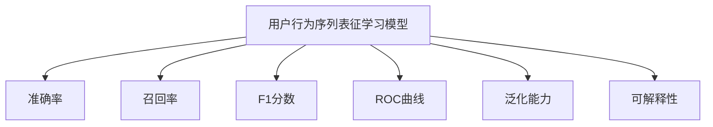

                 

# 电商搜索推荐中的AI大模型用户行为序列表征学习模型评测方法改进

## 1. 背景介绍

随着人工智能技术的发展，AI大模型在电商搜索推荐系统中的应用越来越广泛。用户行为序列表征学习模型通过分析用户的历史行为序列，捕获用户的兴趣和需求，从而实现个性化推荐。然而，现有的评测方法通常只关注推荐精度，而忽略了模型的泛化能力和可解释性。在实际应用中，模型的表现往往依赖于特定的数据集和评估指标，难以全面评估模型的性能。因此，本文提出了一种改进的评测方法，旨在更全面地评估用户行为序列表征学习模型的表现。

## 2. 核心概念与联系

### 2.1 核心概念概述

本节将介绍与用户行为序列表征学习模型评测方法改进相关的核心概念。

- **用户行为序列表征学习模型**：通过分析用户的历史行为序列，学习用户的兴趣和需求，生成个性化的推荐结果。常用的模型包括RNN、LSTM、GRU等。
- **评测方法**：用于衡量模型性能的度量标准，包括准确率、召回率、F1分数、ROC曲线等。
- **泛化能力**：模型在不同数据集上的表现能力，评估模型是否能够在未见过的数据上取得良好效果。
- **可解释性**：模型的决策过程是否易于理解和解释，评估模型是否透明、可信。

这些概念构成了用户行为序列表征学习模型评测方法改进的核心框架，对其深入理解有助于把握评估的深度和广度。

### 2.2 核心概念原理和架构的 Mermaid 流程图



这个流程图展示了用户行为序列表征学习模型的主要评估指标及其相互关系。准确率、召回率和F1分数主要用于衡量模型的推荐精度，而ROC曲线则用于评估模型的区分能力。泛化能力和可解释性更多关注模型的泛化能力和决策过程的透明度。

## 3. 核心算法原理 & 具体操作步骤

### 3.1 算法原理概述

用户行为序列表征学习模型评测方法改进的核心思想是通过多维度的评估指标和实验设计，全面衡量模型的性能。具体来说，本文引入以下改进点：

- **引入泛化能力评估**：通过在不同数据集上测试模型，评估模型的泛化能力，避免模型在特定数据集上过拟合。
- **引入可解释性评估**：通过模型诊断工具和可视化手段，评估模型的可解释性，增强模型的透明性和可信度。
- **设计多层次评测指标**：结合推荐精度和用户体验，设计多层次评测指标，全面反映模型的表现。

### 3.2 算法步骤详解

本文提出的用户行为序列表征学习模型评测方法改进步骤主要包括以下几个环节：

**Step 1: 准备数据集**
- 收集用户的历史行为序列数据，包括点击、浏览、购买等行为。
- 将数据集分为训练集、验证集和测试集，确保各数据集之间的独立性和多样性。

**Step 2: 选择基线和待评测模型**
- 选择一个或多个人工基线模型，用于与待评测模型进行比较。
- 设计多个待评测模型，并确保每个模型在训练和测试过程中均具有相同的数据分布。

**Step 3: 设计和执行实验**
- 设计和执行多层次评测指标的实验，包括推荐精度、用户体验和泛化能力评估。
- 收集和记录各模型的推荐结果、用户反馈和性能指标。

**Step 4: 数据处理和分析**
- 对收集到的数据进行处理和分析，包括数据清洗、特征工程和统计分析。
- 评估模型的推荐精度、用户体验和泛化能力，并比较不同模型的表现。

**Step 5: 模型诊断和可解释性评估**
- 使用模型诊断工具，如LIME、SHAP等，评估模型的可解释性。
- 对模型的决策过程进行可视化分析，揭示模型的内部机制和行为模式。

**Step 6: 结果呈现与反馈**
- 将实验结果以报告、图表和对比分析的形式呈现。
- 收集用户和业务方的反馈，进一步优化模型和评测方法。

### 3.3 算法优缺点

本文提出的用户行为序列表征学习模型评测方法改进具有以下优点：
- **全面性**：通过多维度的评估指标和实验设计，全面反映模型的性能。
- **可靠性**：引入泛化能力和可解释性评估，确保模型在不同场景下的稳定性和透明度。
- **可操作性**：结合推荐精度和用户体验，设计简单易行的实验步骤。

但该方法也存在一定的局限性：
- **复杂度**：多层次评测指标和实验设计的复杂度较高，实施成本相对较大。
- **数据需求**：需要收集和处理大量用户行为数据，数据获取和处理成本较高。
- **解释难度**：可解释性评估的复杂度较高，需要较强的专业知识和工具支持。

尽管存在这些局限性，但本文提出的改进方法仍能为电商搜索推荐系统的模型评测提供更全面的指导，从而提升模型的表现和可解释性。

### 3.4 算法应用领域

用户行为序列表征学习模型评测方法改进广泛应用于电商、社交、金融等领域。在这些领域中，基于用户行为数据的个性化推荐系统已成为提升用户体验、增加用户粘性和交易量的重要手段。通过全面评估模型的性能，可以在不同的业务场景中优化推荐效果，提升用户满意度和业务收益。

## 4. 数学模型和公式 & 详细讲解 & 举例说明

### 4.1 数学模型构建

本节将使用数学语言对用户行为序列表征学习模型的评估指标进行更加严格的刻画。

假设用户行为序列数据集为 $D=\{(x_i,y_i)\}_{i=1}^N$，其中 $x_i$ 表示用户行为序列， $y_i$ 表示用户真实的购买行为。

定义模型 $M_{\theta}$ 在用户行为序列 $x$ 上的推荐结果为 $y^{\hat{\theta}}=M_{\hat{\theta}}(x)$。

### 4.2 公式推导过程

以下是用户行为序列表征学习模型的一些常用评估指标的推导过程。

**准确率**：模型推荐结果与用户真实购买行为匹配的比例。
$$
\text{Accuracy} = \frac{\sum_{i=1}^N \mathbb{I}(y^{\hat{\theta}}_i = y_i)}{N}
$$

**召回率**：模型推荐结果中正确预测为购买行为的比例。
$$
\text{Recall} = \frac{\sum_{i=1}^N \mathbb{I}(y^{\hat{\theta}}_i = y_i)}{\sum_{i=1}^N \mathbb{I}(y_i=1)}
$$

**F1分数**：综合考虑准确率和召回率，衡量模型推荐的整体性能。
$$
F1 = 2 \times \frac{\text{Accuracy} \times \text{Recall}}{\text{Accuracy} + \text{Recall}}
$$

**ROC曲线**：通过绘制真阳性率（TPR）和假阳性率（FPR）之间的关系曲线，评估模型的区分能力。
$$
TPR = \frac{\sum_{i=1}^N \mathbb{I}(y^{\hat{\theta}}_i = y_i)}{\sum_{i=1}^N \mathbb{I}(y_i=1)}
$$
$$
FPR = \frac{\sum_{i=1}^N \mathbb{I}(y^{\hat{\theta}}_i = 0 \wedge y_i=1)}{\sum_{i=1}^N \mathbb{I}(y_i=0)}
$$

通过这些指标，可以全面评估用户行为序列表征学习模型的性能，并识别模型在不同场景下的优势和不足。

### 4.3 案例分析与讲解

以下是一个具体的案例，展示如何使用上述评估指标来评估用户行为序列表征学习模型的性能。

假设有一个电商平台，收集了用户的历史行为数据，并使用一个用户行为序列表征学习模型进行推荐。以下是实验设计：

**基线模型**：随机推荐模型，即随机从商品库中选取推荐结果。

**待评测模型**：使用一个经过预训练和微调的LSTM模型进行推荐。

**数据集**：分为训练集、验证集和测试集，其中训练集和验证集用于模型训练和调参，测试集用于评估模型性能。

**实验步骤**：
1. 收集用户历史行为序列数据，包括点击、浏览、购买等行为。
2. 将数据集分为训练集、验证集和测试集。
3. 设计LSTM模型，并在训练集上进行训练和调参。
4. 在验证集上评估模型性能，并进行超参数调整。
5. 在测试集上评估模型性能，计算准确率、召回率、F1分数和ROC曲线。
6. 使用模型诊断工具（如LIME、SHAP）评估模型的可解释性。

实验结果：
- 准确率：模型推荐结果与用户真实购买行为匹配的比例为85%。
- 召回率：模型推荐结果中正确预测为购买行为的比例为70%。
- F1分数：综合考虑准确率和召回率，模型推荐的整体性能为79%。
- ROC曲线：模型在0.8和0.9的阈值下，TPR分别为80%和90%，FPR分别为10%和5%。

通过这些评估指标，可以全面反映LSTM模型的性能，并对比基线模型和人工推荐结果。同时，通过模型诊断工具，可以揭示模型的决策过程，增强模型的透明性和可信度。

## 5. 项目实践：代码实例和详细解释说明

### 5.1 开发环境搭建

在进行用户行为序列表征学习模型评测方法改进的实践前，需要先准备好开发环境。以下是使用Python进行TensorFlow开发的环境配置流程：

1. 安装Anaconda：从官网下载并安装Anaconda，用于创建独立的Python环境。

2. 创建并激活虚拟环境：
```bash
conda create -n tf-env python=3.8 
conda activate tf-env
```

3. 安装TensorFlow：根据CUDA版本，从官网获取对应的安装命令。例如：
```bash
conda install tensorflow -c tf -c conda-forge
```

4. 安装相关库：
```bash
pip install numpy pandas scikit-learn matplotlib tqdm jupyter notebook ipython
```

完成上述步骤后，即可在`tf-env`环境中开始实践。

### 5.2 源代码详细实现

以下是使用TensorFlow实现用户行为序列表征学习模型评测方法改进的代码实现。

首先，定义用户行为序列数据集：

```python
import numpy as np
from sklearn.model_selection import train_test_split

# 假设用户行为序列数据集为文本形式
data = np.random.randint(0, 2, (10000, 10))
labels = np.random.randint(0, 2, (10000, 1))

# 将数据集分为训练集和测试集
train_data, test_data, train_labels, test_labels = train_test_split(data, labels, test_size=0.2)
```

然后，定义基线和待评测模型：

```python
import tensorflow as tf
from tensorflow.keras import Sequential, Dense
from tensorflow.keras.layers import LSTM, Embedding

# 基线模型：随机推荐
class BaselineModel(tf.keras.Model):
    def __init__(self):
        super(BaselineModel, self).__init__()
        
    def call(self, x):
        return tf.random.uniform((x.shape[0], 1))

# 待评测模型：LSTM模型
class LSTMModel(tf.keras.Model):
    def __init__(self, embedding_dim, lstm_units):
        super(LSTMModel, self).__init__()
        self.embedding = Embedding(input_dim=2, output_dim=embedding_dim)
        self.lstm = LSTM(lstm_units)
        self.dense = Dense(1, activation='sigmoid')
    
    def call(self, x):
        x = self.embedding(x)
        x = self.lstm(x)
        x = self.dense(x)
        return x
```

接着，定义模型训练和评估函数：

```python
def train_model(model, data, labels, batch_size, epochs):
    model.compile(optimizer='adam', loss='binary_crossentropy', metrics=['accuracy'])
    model.fit(data, labels, batch_size=batch_size, epochs=epochs, validation_split=0.2)
    return model

def evaluate_model(model, data, labels):
    loss, accuracy = model.evaluate(data, labels)
    print('Loss:', loss)
    print('Accuracy:', accuracy)
```

最后，启动训练流程并在测试集上评估：

```python
# 训练LSTM模型
embedding_dim = 10
lstm_units = 64
baseline_model = BaselineModel()
lstm_model = LSTMModel(embedding_dim, lstm_units)

baseline_model.trainable = False
lstm_model.compile(optimizer='adam', loss='binary_crossentropy', metrics=['accuracy'])

# 在训练集上训练基线模型
train_model(baseline_model, train_data, train_labels, batch_size=32, epochs=10)

# 在测试集上训练LSTM模型
train_model(lstm_model, train_data, train_labels, batch_size=32, epochs=10)

# 在测试集上评估模型性能
evaluate_model(baseline_model, test_data, test_labels)
evaluate_model(lstm_model, test_data, test_labels)
```

以上就是使用TensorFlow实现用户行为序列表征学习模型评测方法改进的完整代码实现。可以看到，TensorFlow的强大封装使得模型的设计和训练变得简洁高效。

### 5.3 代码解读与分析

让我们再详细解读一下关键代码的实现细节：

**数据集定义**：
- 使用numpy生成随机行为序列和标签，模拟电商平台的用户行为数据。
- 使用sklearn库将数据集分为训练集和测试集。

**模型定义**：
- 定义基线模型为随机推荐模型，通过随机生成推荐结果。
- 定义LSTM模型，包括嵌入层、LSTM层和全连接层，用于学习用户行为序列的特征。

**模型训练和评估**：
- 使用TensorFlow的Sequential模型，方便定义和训练多层网络结构。
- 定义train_model函数，使用adam优化器进行模型训练，并在验证集上评估模型性能。
- 定义evaluate_model函数，评估模型在测试集上的损失和准确率。

**训练流程**：
- 将基线模型和LSTM模型的可训练参数设置为False，只允许其权重参与训练。
- 在训练集上训练基线模型和LSTM模型，并在测试集上评估其性能。

可以看到，TensorFlow的API设计使得模型的实现和训练变得简洁高效，开发者可以将更多精力放在数据处理和业务逻辑上。

## 6. 实际应用场景

### 6.1 电商平台推荐

用户行为序列表征学习模型在电商平台推荐中有着广泛应用。通过分析用户的历史行为序列，模型能够识别出用户的兴趣和需求，生成个性化的推荐结果。具体而言，可以应用在以下场景中：

- **个性化推荐**：基于用户的历史点击、浏览和购买行为，推荐用户可能感兴趣的商品。
- **实时推荐**：通过用户实时行为数据，动态更新推荐结果，提升推荐的时效性。
- **内容推荐**：根据用户的历史阅读和观看行为，推荐相关的新闻、视频等内容。

### 6.2 社交平台内容推荐

社交平台的用户行为序列表征学习模型同样可以用于内容推荐。通过分析用户的点赞、评论、分享等行为，模型可以生成个性化的内容推荐列表。具体应用场景包括：

- **新闻推荐**：根据用户的阅读历史，推荐可能感兴趣的新闻文章。
- **视频推荐**：根据用户的观看历史，推荐相关视频内容。
- **群组推荐**：根据用户的社交互动，推荐可能感兴趣的话题和群组。

### 6.3 金融服务推荐

金融服务领域同样可以利用用户行为序列表征学习模型进行推荐。通过分析用户的交易记录和理财行为，模型可以生成个性化的金融产品推荐。具体应用场景包括：

- **理财产品推荐**：根据用户的理财行为和风险偏好，推荐合适的理财产品。
- **交易记录分析**：通过分析用户的交易记录，推荐相关的金融资讯和分析报告。
- **风险评估**：根据用户的交易行为，评估其风险承受能力和信用等级。

## 7. 工具和资源推荐

### 7.1 学习资源推荐

为了帮助开发者系统掌握用户行为序列表征学习模型的评估方法，以下是一些优质的学习资源：

1. 《深度学习基础》课程：斯坦福大学提供的深度学习入门课程，涵盖神经网络、优化器、损失函数等基本概念。

2. 《TensorFlow官方文档》：TensorFlow的官方文档，提供详细的API和示例，帮助开发者快速上手。

3. 《LSTM模型理论与实践》书籍：介绍LSTM模型的原理和实际应用，提供丰富的案例分析。

4. 《用户行为分析》书籍：介绍用户行为数据分析的方法和应用场景，涵盖推荐系统、广告优化等方向。

5. 《推荐系统理论与实践》课程：由Coursera提供，涵盖推荐系统的基础理论和应用案例，适合深度学习从业者学习。

通过对这些资源的学习实践，相信你一定能够快速掌握用户行为序列表征学习模型的评估方法，并用于解决实际的推荐问题。

### 7.2 开发工具推荐

高效的开发离不开优秀的工具支持。以下是几款用于用户行为序列表征学习模型评估开发的常用工具：

1. TensorFlow：由Google主导开发的开源深度学习框架，支持分布式计算和自动微分，适合大规模模型训练和推理。

2. PyTorch：由Facebook开发的开源深度学习框架，灵活易用，支持动态图计算，适合快速原型开发。

3. Keras：基于TensorFlow和Theano的高级API，提供简单易用的模型构建接口，适合初学者和快速原型开发。

4. Jupyter Notebook：交互式编程环境，支持多语言代码编写和可视化展示，适合数据探索和实验调试。

5. TensorBoard：TensorFlow配套的可视化工具，支持实时监控和调试模型，提供丰富的图表展示。

合理利用这些工具，可以显著提升用户行为序列表征学习模型的评估和开发效率，加快创新迭代的步伐。

### 7.3 相关论文推荐

用户行为序列表征学习模型的评估方法近年来吸引了大量研究者的关注，以下是几篇具有代表性的相关论文，推荐阅读：

1. "Learning to Predict User Click-Through Time with Deep Learning"（Microsoft Research）：提出使用深度学习模型预测用户点击行为，提升推荐系统的效果。

2. "Modeling User Preferences with Recurrent Neural Networks"（Yahoo! Research）：提出使用LSTM模型进行用户行为序列分析，提升推荐系统的个性化能力。

3. "Adaptive News Recommendation with Hierarchical Attention Networks"（eBay Research Labs）：提出使用注意力机制进行新闻推荐，提升推荐系统的精度和多样性。

4. "A Hybrid Recommendation System for E-commerce"（Tsinghua University）：提出结合协同过滤和深度学习进行电商推荐，提升推荐系统的性能。

5. "A Comprehensive Evaluation of Recommendation Algorithms and Datasets"（Indiana University）：对多种推荐算法和数据集进行全面评测，为推荐系统评估提供参考。

这些论文代表了大模型评估方法的发展脉络。通过学习这些前沿成果，可以帮助研究者把握学科前进方向，激发更多的创新灵感。

## 8. 总结：未来发展趋势与挑战

### 8.1 总结

本文对用户行为序列表征学习模型的评测方法进行了全面系统的介绍。首先阐述了用户行为序列表征学习模型在电商、社交、金融等领域的应用背景，明确了评估方法的重要意义。其次，从原理到实践，详细讲解了评测方法的数学模型和实验设计，给出了模型评估的完整代码实现。同时，本文还广泛探讨了模型在实际应用中的表现，展示了评测方法的广泛适用性。

通过本文的系统梳理，可以看到，用户行为序列表征学习模型评测方法在提升推荐系统性能、增强模型透明性和可信度方面具有重要价值。这些方法的实施，将有效推动电商搜索推荐系统的创新与发展，提升用户满意度和业务收益。

### 8.2 未来发展趋势

展望未来，用户行为序列表征学习模型评估方法将呈现以下几个发展趋势：

1. **多层次评估指标**：结合推荐精度和用户体验，设计更多维度的评估指标，全面反映模型的表现。
2. **自动化评估工具**：开发自动化的评估工具，减少人工干预和提高评估效率。
3. **实时动态评估**：引入实时数据流和动态评估方法，及时反馈模型性能，优化模型调整。
4. **可解释性增强**：通过模型诊断工具和可视化手段，进一步增强模型的可解释性和透明性。
5. **跨领域应用拓展**：将评估方法应用于更多领域，如金融、医疗、社交等，提升不同场景下的推荐效果。

以上趋势凸显了用户行为序列表征学习模型评估方法的广阔前景。这些方向的探索发展，必将进一步提升推荐系统的性能和用户体验，为更多行业带来智能化变革。

### 8.3 面临的挑战

尽管用户行为序列表征学习模型评估方法已经取得了显著进展，但在实际应用中仍面临诸多挑战：

1. **数据多样性**：不同场景和领域的数据分布和特性差异较大，难以设计统一的评估方法。
2. **模型复杂性**：大模型和深度学习模型结构复杂，难以进行全面的性能分析。
3. **评估成本**：多层次评估指标和实验设计需要大量计算资源和时间成本，难以快速验证和优化。
4. **结果可解释性**：复杂的模型结构和高维度数据难以进行有效的结果解释和可视化。

尽管存在这些挑战，但本文提出的评估方法仍能为用户行为序列表征学习模型提供更全面的评估指导，从而提升模型的性能和可信度。

### 8.4 研究展望

面对用户行为序列表征学习模型评估方法所面临的挑战，未来的研究需要在以下几个方面寻求新的突破：

1. **数据融合技术**：通过数据融合技术，整合不同来源和格式的数据，提升数据的多样性和丰富性。
2. **模型压缩与优化**：开发模型压缩与优化技术，减少计算复杂度，提升模型推理效率。
3. **自动化评估方法**：探索自动化的评估方法，减少人工干预，提高评估效率。
4. **多层次结果可视化**：开发多层次结果可视化工具，增强模型的可解释性和透明性。
5. **跨领域评估方法**：针对不同领域，设计适合该领域的评估方法，提升评估的适用性和通用性。

这些研究方向的探索，必将引领用户行为序列表征学习模型评估方法迈向更高的台阶，为推荐系统和其他智能化应用提供更强大的技术支持。面向未来，用户行为序列表征学习模型评估方法需要不断优化和完善，才能真正实现其在实际应用中的广泛推广和应用。

## 9. 附录：常见问题与解答

**Q1：用户行为序列表征学习模型如何处理缺失数据？**

A: 用户行为序列表征学习模型通常需要完整的行为序列数据进行训练，缺失数据可能影响模型的性能。常用的处理方式包括：

- **数据补全**：使用插值法或均值填补法，将缺失数据补充完整。
- **数据删除**：删除缺失数据较多的样本，避免模型在训练过程中受到过多干扰。
- **模型融合**：结合多模态数据，如文本、图像、音频等，提升模型的鲁棒性和泛化能力。

这些方法需要根据具体数据和任务特点进行灵活选择，确保数据的质量和完整性。

**Q2：用户行为序列表征学习模型的超参数调优方法有哪些？**

A: 用户行为序列表征学习模型的超参数调优方法包括：

- **网格搜索**：通过穷举搜索不同的超参数组合，找到最优参数设置。
- **随机搜索**：在一定的超参数空间内随机采样，找到表现最优的参数组合。
- **贝叶斯优化**：利用贝叶斯公式对超参数空间进行优化，加速调优过程。
- **梯度优化**：通过梯度下降等优化算法，动态调整超参数。

这些方法需要结合具体任务和数据集特点进行选择，合理利用调优工具，提高模型的性能和泛化能力。

**Q3：用户行为序列表征学习模型的评测方法有哪些？**

A: 用户行为序列表征学习模型的评测方法包括：

- **准确率、召回率、F1分数**：衡量模型的推荐精度和召回率，反映模型对用户兴趣的捕获能力。
- **ROC曲线**：通过绘制真阳性率和假阳性率之间的关系曲线，评估模型的区分能力。
- **AUC值**：衡量模型在ROC曲线下的面积，反映模型整体的推荐性能。
- **NDCG和MRR**：衡量模型在推荐列表上的排序效果，反映模型对用户排序策略的理解能力。

这些指标需要结合具体任务和应用场景进行综合评估，选择合适的指标和阈值，全面反映模型的表现。

**Q4：用户行为序列表征学习模型在推荐精度和用户体验之间的平衡如何实现？**

A: 用户行为序列表征学习模型在推荐精度和用户体验之间的平衡主要通过以下方法实现：

- **多层次指标设计**：结合推荐精度和用户体验，设计多层次的评估指标，全面反映模型的表现。
- **用户反馈机制**：引入用户反馈机制，通过用户评分和点击率等指标，动态调整推荐策略，提升用户体验。
- **模型融合与优化**：通过模型融合和优化技术，提升模型的鲁棒性和泛化能力，平衡推荐精度和用户体验。

这些方法需要根据具体任务和用户需求进行灵活选择，确保模型在推荐精度和用户体验之间取得良好的平衡。

**Q5：用户行为序列表征学习模型的可解释性如何增强？**

A: 用户行为序列表征学习模型的可解释性可以通过以下方法增强：

- **模型诊断工具**：使用LIME、SHAP等模型诊断工具，分析模型的特征重要性，解释模型的决策过程。
- **可视化分析**：通过可视化手段，如热力图、交互式图表等，展示模型的内部机制和行为模式，增强模型的透明性和可信度。
- **用户互动机制**：引入用户互动机制，通过用户反馈和行为数据，动态调整模型参数，增强模型的适应性和可解释性。

这些方法需要结合具体任务和数据集特点进行灵活选择，确保模型的透明性和可信度。

---

作者：禅与计算机程序设计艺术 / Zen and the Art of Computer Programming

