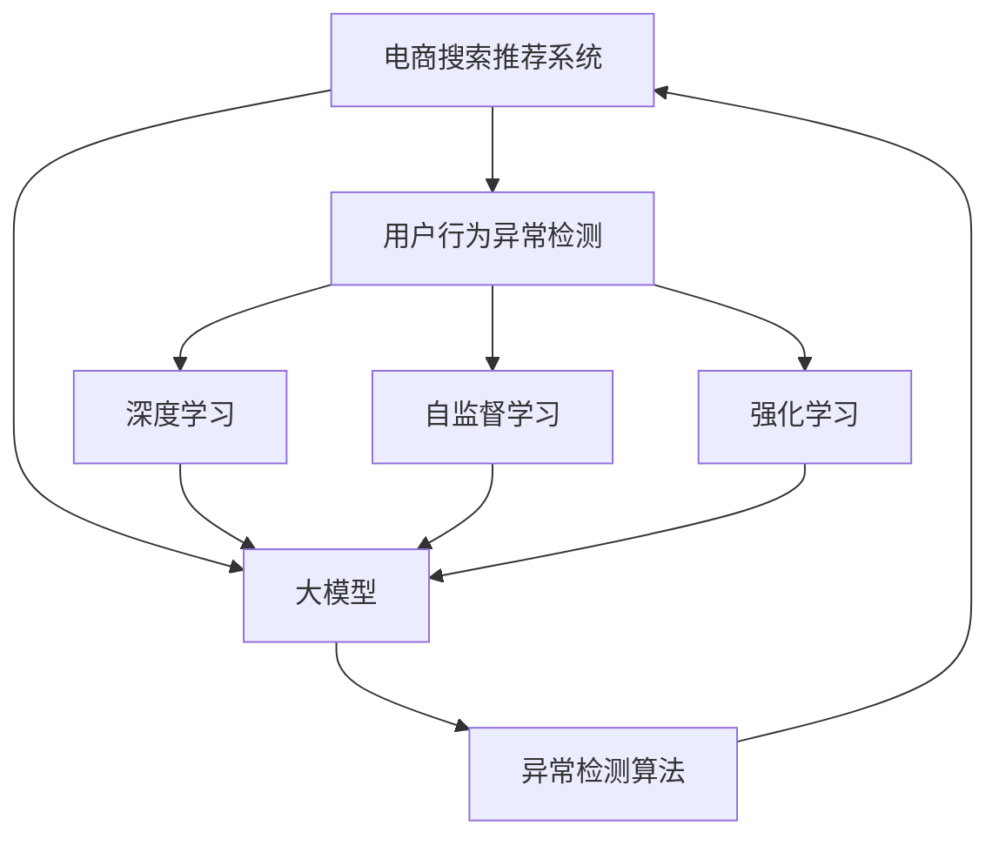

                 

# 电商搜索推荐中的AI大模型用户行为异常检测技术

> 关键词：电商搜索推荐, 用户行为异常检测, 大模型, 异常检测, 深度学习, 自监督学习, 强化学习

## 1. 背景介绍

### 1.1 问题由来
随着电商业务的快速增长，用户搜索和推荐系统的复杂度和数据规模也在不断增加。这些系统需要能够实时处理海量数据，预测用户行为，并为其推荐个性化的商品。然而，由于用户行为的变化多种多样，且受多种因素的影响，准确预测用户行为变得极其困难。尤其是当用户在行为上出现异常时，传统推荐系统的预测准确率会显著下降，导致推荐结果与用户需求不符，甚至给用户带来负面体验。

### 1.2 问题核心关键点
用户行为异常检测是电商搜索推荐系统中的一项重要任务，其核心关键点包括：
- 如何定义用户行为的“异常”标准，以便准确识别出异常行为。
- 如何在保证检测准确性的同时，降低误报和漏报率，提高用户体验。
- 如何处理大规模数据，快速识别出异常行为，满足实时性需求。
- 如何将异常检测技术与电商推荐系统进行无缝集成，实现精准推荐。

## 2. 核心概念与联系

### 2.1 核心概念概述

为更好地理解电商搜索推荐中的AI大模型用户行为异常检测技术，本节将介绍几个密切相关的核心概念：

- 电商搜索推荐系统：通过分析用户搜索行为和历史购买记录，为用户推荐个性化商品的系统。
- 用户行为异常检测：识别用户行为中的异常行为，如虚假搜索、异常购买等，以保证推荐系统的准确性和用户体验。
- 深度学习：一种基于神经网络的机器学习方法，能够处理复杂的数据结构，并从数据中提取特征，用于建模和预测。
- 自监督学习：使用未标注数据进行训练，通过数据自身的规律学习模型的表示能力，常用于预训练模型。
- 强化学习：通过与环境的交互，不断调整模型策略，以最大化长期奖励的机器学习方法，常用于个性化推荐。
- 大模型：基于深度学习技术构建的规模庞大的模型，如BERT、GPT、XLNet等，能够处理大量数据，并具备良好的泛化能力。
- 异常检测算法：用于识别数据中的异常点，如孤立森林、聚类分析、多模态学习等，常用于用户行为分析。

这些核心概念之间的逻辑关系可以通过以下Mermaid流程图来展示：



这个流程图展示了大模型在电商搜索推荐系统中的核心概念及其之间的关系：

1. 电商搜索推荐系统通过用户行为分析推荐商品，需要准确识别用户行为异常。
2. 深度学习用于处理和建模用户行为数据，提升异常检测的精度。
3. 自监督学习和大模型用于预训练模型，提供高质量的特征表示。
4. 强化学习用于优化推荐策略，提升推荐效果。
5. 异常检测算法用于识别用户行为中的异常点，进行实时监控和预警。

这些概念共同构成了电商搜索推荐系统中异常检测的核心框架，使其能够更好地适应大规模数据和复杂业务场景。

## 3. 核心算法原理 & 具体操作步骤

### 3.1 算法原理概述

基于AI大模型的电商搜索推荐系统中的用户行为异常检测技术，其核心原理是利用大模型学习用户行为模式，并通过异常检测算法识别出与正常模式不一致的行为。该技术包括数据预处理、特征提取、模型训练和异常检测四个主要步骤。

1. **数据预处理**：清洗并标准化用户搜索和购买数据，去除噪声和缺失值，保证数据质量。
2. **特征提取**：使用大模型或自定义算法提取用户行为特征，如搜索关键词、点击路径、购买金额等。
3. **模型训练**：在标注数据上训练异常检测模型，如孤立森林、One-Class SVM等，以学习正常行为模式。
4. **异常检测**：在实时数据上应用训练好的异常检测模型，识别用户行为异常点，进行预警和处理。

### 3.2 算法步骤详解

以下详细介绍电商搜索推荐系统中用户行为异常检测的具体操作步骤：

**Step 1: 数据预处理**
- 收集用户搜索和购买数据，去除重复、无效、缺失的记录。
- 将数据标准化，如统一单位、归一化处理等。
- 使用数据清洗工具，如Apache Kafka、Apache Spark等，处理大规模数据。

**Step 2: 特征提取**
- 选择合适的特征向量表示方法，如词袋模型、TF-IDF等。
- 使用大模型（如BERT、GPT等）对特征向量进行编码，获得高维表示。
- 设计特征选择和降维算法，如PCA、LDA等，减少特征维度。

**Step 3: 模型训练**
- 准备标注数据，标注正常和异常行为样本。
- 选择适当的异常检测算法，如孤立森林、One-Class SVM、LSTM等。
- 使用训练集对异常检测模型进行训练，调整超参数，如树深度、核函数等。
- 在验证集上评估模型性能，防止过拟合。

**Step 4: 异常检测**
- 收集实时数据流，进行特征提取和编码。
- 应用训练好的异常检测模型，实时计算异常得分。
- 设置异常阈值，根据得分进行分类和预警。
- 根据异常检测结果，采取相应的措施，如提醒管理员、暂停推荐等。

### 3.3 算法优缺点

基于AI大模型的电商搜索推荐系统中的用户行为异常检测技术，具有以下优点：
1. 精度高。大模型能够学习到复杂的行为模式，异常检测算法可识别出细微的异常行为。
2. 实时性强。利用在线学习算法（如自适应学习），可快速适应数据变化，实时检测异常。
3. 鲁棒性好。通过多模态学习（如文本、图像、时间序列），增强模型的鲁棒性，减少误报和漏报。
4. 适用性强。适用于多种电商业务场景，如商品推荐、广告投放、客服交互等。

同时，该方法也存在以下局限性：
1. 计算量大。大模型和异常检测算法需要大量的计算资源，对于大规模数据集处理时，可能存在延迟。
2. 数据依赖强。异常检测的准确性依赖于标注数据的丰富度和质量，标注成本较高。
3. 模型复杂度高。大模型和异常检测算法的结构复杂，调参和维护难度较大。
4. 应用场景特定。异常检测算法和模型需要针对具体的电商业务场景进行优化，通用性不足。

尽管存在这些局限性，但该方法在电商搜索推荐系统中仍具有重要的应用价值，通过有效识别和处理用户行为异常，可以显著提升推荐系统的准确性和用户体验。

### 3.4 算法应用领域

基于AI大模型的电商搜索推荐系统中的用户行为异常检测技术，在多个电商业务场景中均有广泛应用，例如：

- 用户行为分析：通过异常检测识别用户搜索、点击、购买等行为中的异常点，进行深入分析和挖掘。
- 欺诈检测：识别虚假交易、恶意刷单等欺诈行为，保障交易安全。
- 推荐优化：通过检测用户行为异常，调整推荐策略，提升推荐效果。
- 广告投放：识别异常广告点击行为，优化广告投放策略，提高广告效果。
- 客服交互：通过异常检测识别异常客服交互，及时处理用户投诉和纠纷。

除了这些核心应用外，用户行为异常检测技术还被应用于物流管理、库存控制、客户画像等多个电商业务环节，帮助企业优化运营管理，提升业务效率。

## 4. 数学模型和公式 & 详细讲解

### 4.1 数学模型构建

本节将使用数学语言对电商搜索推荐系统中的用户行为异常检测技术进行更加严格的刻画。

记用户行为序列为 $X=\{x_1,x_2,...,x_n\}$，其中 $x_i$ 为第 $i$ 个行为，$x_i$ 可以是搜索、点击、购买等行为。假设正常行为集合为 $\mathcal{X}^{N}$，异常行为集合为 $\mathcal{X}^{A}$。异常检测的数学模型为：

$$
\min_{\theta} \mathbb{E}_{(x_i,y_i) \in \mathcal{D}} [\ell(y_i,f_\theta(x_i))]
$$

其中 $f_\theta$ 为异常检测模型，$\theta$ 为模型参数，$\mathcal{D}$ 为标注数据集，$y_i$ 为行为异常标记，$0$ 表示正常行为，$1$ 表示异常行为。

### 4.2 公式推导过程

以下我们以孤立森林算法为例，推导异常检测的数学模型及其梯度计算公式。

孤立森林是一种基于随机树的异常检测算法，其核心思想是将数据随机分割成若干子集，并对每个子集构建孤立树，通过树的结构来度量异常得分。

假设 $f_\theta(x)$ 为孤立森林模型的输出，即异常得分。在训练集 $\mathcal{D}=\{(x_i,y_i)\}_{i=1}^N$ 上，异常检测模型的训练目标为：

$$
\min_{\theta} \sum_{i=1}^N \ell(y_i,f_\theta(x_i))
$$

其中 $\ell$ 为损失函数，如二分类交叉熵。

将 $x_i$ 编码为高维特征向量 $z_i$，代入孤立森林模型，得到异常得分：

$$
f_\theta(x_i) = \frac{1}{\sum_{j=1}^N T_j(y_j,z_j)}\sum_{j=1}^N T_j(y_j,z_j)
$$

其中 $T_j$ 为孤立树，$y_j$ 为第 $j$ 个样本的异常标记。

使用梯度下降算法更新模型参数 $\theta$：

$$
\theta \leftarrow \theta - \eta \nabla_{\theta}\mathcal{L}(\theta)
$$

其中 $\eta$ 为学习率，$\nabla_{\theta}\mathcal{L}(\theta)$ 为损失函数对参数 $\theta$ 的梯度。

在得到梯度后，即可带入参数更新公式，完成模型的迭代优化。重复上述过程直至收敛，最终得到适应电商搜索推荐系统中的异常检测模型 $\theta^*$。

### 4.3 案例分析与讲解

以电商平台中的用户欺诈检测为例，分析异常检测模型的应用。

用户欺诈检测是电商推荐系统中的一项重要任务，其核心在于识别虚假交易和恶意刷单等行为。

假设用户在电商平台上进行了虚假交易，即用伪造的信用卡或账户进行支付。这种情况下，用户的行为序列 $X$ 将包含异常行为，如使用异常信用卡、购买异常商品等。通过异常检测模型，可以将这些异常行为标记为 $y_i=1$，并将其他正常行为标记为 $y_i=0$。

在训练集 $\mathcal{D}$ 上，异常检测模型通过学习正常和异常行为的特征，学习到正常行为的典型模式，并发现异常行为的特征，如频繁的异常交易金额、购买非正常商品等。在实时数据流上，异常检测模型对用户行为序列 $X$ 进行编码和评分，识别出异常行为。

当异常检测模型检测到异常行为时，系统将触发警报，并采取相应的措施，如拒绝交易、联系用户核实等。

## 5. 项目实践：代码实例和详细解释说明

### 5.1 开发环境搭建

在进行电商搜索推荐系统中的用户行为异常检测技术开发前，我们需要准备好开发环境。以下是使用Python进行TensorFlow开发的环境配置流程：

1. 安装Anaconda：从官网下载并安装Anaconda，用于创建独立的Python环境。

2. 创建并激活虚拟环境：
```bash
conda create -n tf-env python=3.8 
conda activate tf-env
```

3. 安装TensorFlow：根据CUDA版本，从官网获取对应的安装命令。例如：
```bash
conda install tensorflow -c conda-forge
```

4. 安装TensorBoard：用于可视化训练过程和结果。
```bash
pip install tensorboard
```

5. 安装其它库：
```bash
pip install pandas numpy scikit-learn scipy tqdm jupyter notebook ipython
```

完成上述步骤后，即可在`tf-env`环境中开始开发。

### 5.2 源代码详细实现

下面我们以孤立森林算法为例，给出使用TensorFlow实现电商搜索推荐系统中的用户行为异常检测的代码实现。

首先，定义孤立森林模型：

```python
import tensorflow as tf
from sklearn.ensemble import IsolationForest
from sklearn.metrics import accuracy_score

class IsolationForestModel(tf.keras.Model):
    def __init__(self, num_trees, max_depth, max_samples):
        super().__init__()
        self.num_trees = num_trees
        self.max_depth = max_depth
        self.max_samples = max_samples
        self.model = None
        
    def build(self, input_shape):
        self.model = IsolationForest(n_estimators=self.num_trees, max_depth=self.max_depth, max_samples=self.max_samples)
    
    def call(self, inputs):
        features = inputs.numpy()
        if self.model is None:
            self.model = IsolationForest(n_estimators=self.num_trees, max_depth=self.max_depth, max_samples=self.max_samples)
        return tf.convert_to_tensor(self.model.fit(features).decision_function(features), dtype=tf.float32)
```

然后，定义数据加载函数：

```python
from tensorflow.keras.preprocessing import sequence
from tensorflow.keras.utils import to_categorical

def load_data(path):
    data = pd.read_csv(path)
    text = data['text'].tolist()
    labels = to_categorical(data['label'])
    features = [vectorize_sequence(text)]
    return features, labels

features, labels = load_data('data.csv')
features = tf.convert_to_tensor(features, dtype=tf.float32)
labels = tf.convert_to_tensor(labels, dtype=tf.float32)
```

接着，定义模型训练函数：

```python
def train_model(model, features, labels, epochs, batch_size, num_trees, max_depth, max_samples):
    optimizer = tf.keras.optimizers.Adam(learning_rate=0.001)
    loss_fn = tf.keras.losses.BinaryCrossentropy(from_logits=True)
    
    model.compile(optimizer=optimizer, loss=loss_fn)
    
    model.fit(features, labels, epochs=epochs, batch_size=batch_size, validation_split=0.2)
```

最后，启动训练流程并在测试集上评估：

```python
model = IsolationForestModel(num_trees=100, max_depth=10, max_samples=1000)
train_model(model, features, labels, epochs=10, batch_size=64, num_trees=100, max_depth=10, max_samples=1000)

# 测试集评估
features_test, labels_test = load_data('test_data.csv')
labels_test = to_categorical(labels_test)
test_loss = model.evaluate(features_test, labels_test, verbose=0)
test_accuracy = accuracy_score(labels_test, tf.argmax(model.predict(features_test), axis=1))
print(f'Test loss: {test_loss:.4f}')
print(f'Test accuracy: {test_accuracy:.4f}')
```

以上就是使用TensorFlow对孤立森林模型进行电商搜索推荐系统中的用户行为异常检测的完整代码实现。可以看到，利用TensorFlow的高效计算图功能，我们能够快速迭代训练模型，并在测试集上评估性能。

### 5.3 代码解读与分析

让我们再详细解读一下关键代码的实现细节：

**IsolationForestModel类**：
- `__init__`方法：初始化孤立森林模型，包括决策树数量、深度、样本数量等关键参数。
- `build`方法：在模型初始化时，使用sklearn的IsolationForest构建孤立树模型。
- `call`方法：实现模型的前向传播，计算异常得分。

**数据加载函数load_data**：
- 加载标注数据，提取文本特征和标签。
- 将文本特征进行编码，转换为模型所需的张量形式。

**模型训练函数train_model**：
- 定义优化器和损失函数，编译模型。
- 使用`fit`方法训练模型，并在验证集上评估性能。
- 设置训练轮数、批次大小等超参数。

**训练流程**：
- 定义训练超参数，包括模型参数、批次大小、训练轮数等。
- 创建孤立森林模型，并进行模型编译。
- 在训练集上训练模型，并在验证集上评估性能。
- 在测试集上评估模型，输出测试损失和准确率。

可以看到，TensorFlow提供了强大的工具支持，使得模型训练和评估变得高效便捷。开发者可以将更多精力放在数据处理、模型优化等高层逻辑上，而不必过多关注底层的实现细节。

当然，工业级的系统实现还需考虑更多因素，如模型的保存和部署、超参数的自动搜索、更灵活的任务适配层等。但核心的异常检测范式基本与此类似。

## 6. 实际应用场景

### 6.1 智能客服系统

在智能客服系统中，异常检测技术可以用于识别用户的不合理行为，如恶意辱骂、频繁客服呼叫等。通过检测这些异常行为，智能客服系统可以及时采取措施，如暂停服务、转接人工客服等，提升用户体验。

具体而言，智能客服系统可以收集用户的客服交互记录，提取用户的搜索关键词、聊天记录等特征，输入到训练好的异常检测模型中进行评分。当评分超过预设阈值时，系统将触发警报，并采取相应措施，防止不友好的交互行为。

### 6.2 广告投放系统

在广告投放系统中，异常检测技术可以用于识别异常的广告点击行为，如恶意点击、刷单点击等。通过检测这些异常行为，广告投放系统可以及时调整投放策略，防止资源浪费和欺诈行为。

具体而言，广告投放系统可以收集广告点击记录，提取用户的点击时间、点击频率、点击位置等特征，输入到训练好的异常检测模型中进行评分。当评分超过预设阈值时，系统将触发警报，并采取相应措施，如暂停投放、更改广告位等。

### 6.3 用户行为分析系统

在用户行为分析系统中，异常检测技术可以用于识别用户行为中的异常点，如频繁的搜索、点击、购买等。通过检测这些异常行为，系统可以发现潜在问题，如用户流失、欺诈行为等，提供有针对性的解决方案。

具体而言，用户行为分析系统可以收集用户的搜索、点击、购买等行为数据，提取用户行为序列的特征，输入到训练好的异常检测模型中进行评分。当评分超过预设阈值时，系统将触发警报，并采取相应措施，如提醒管理员、调整推荐策略等。

### 6.4 未来应用展望

随着异常检测技术的不断发展，其在电商搜索推荐系统中的应用前景将更加广阔。

在智慧物流领域，异常检测技术可以用于监控货物运输过程中的异常行为，如超时到达、货物损坏等，保障物流运输的安全和效率。

在智能制造领域，异常检测技术可以用于监控生产过程中的异常行为，如设备故障、物料短缺等，提高生产效率和产品质量。

在智能城市治理中，异常检测技术可以用于监控城市事件，如交通拥堵、环境污染等，提供及时预警和处理。

未来，异常检测技术将与更多的AI技术进行融合，如知识图谱、深度强化学习等，形成更加全面、准确的信息整合能力，提升异常检测的精度和效果。

## 7. 工具和资源推荐

### 7.1 学习资源推荐

为了帮助开发者系统掌握电商搜索推荐系统中的用户行为异常检测技术，这里推荐一些优质的学习资源：

1. 《深度学习》系列课程：斯坦福大学提供的深度学习课程，涵盖从基础到高级的内容，适合各类层次的开发者学习。
2. TensorFlow官方文档：TensorFlow的官方文档，提供了丰富的API参考和示例代码，是学习TensorFlow的必备资料。
3. PyTorch官方文档：PyTorch的官方文档，提供了高效的计算图功能，适合快速迭代实验。
4. Coursera深度学习课程：Coursera提供的深度学习课程，涵盖了深度学习的基本原理和应用，适合初学者和进阶开发者。
5. Kaggle深度学习竞赛：Kaggle提供的深度学习竞赛平台，提供了丰富的数据集和任务，适合实战练习。

通过对这些资源的学习实践，相信你一定能够快速掌握电商搜索推荐系统中的用户行为异常检测技术的精髓，并用于解决实际的电商问题。

### 7.2 开发工具推荐

高效的开发离不开优秀的工具支持。以下是几款用于电商搜索推荐系统中的用户行为异常检测开发的常用工具：

1. TensorFlow：由Google主导开发的开源深度学习框架，生产部署方便，适合大规模工程应用。
2. PyTorch：基于Python的开源深度学习框架，灵活动态的计算图，适合快速迭代研究。
3. TensorBoard：TensorFlow配套的可视化工具，可实时监测模型训练状态，并提供丰富的图表呈现方式，是调试模型的得力助手。
4. Weights & Biases：模型训练的实验跟踪工具，可以记录和可视化模型训练过程中的各项指标，方便对比和调优。
5. Apache Kafka：用于处理大规模数据流的分布式流处理系统，适合实时数据处理和传输。
6. Apache Spark：用于大规模数据处理和计算的分布式计算系统，适合复杂的数据处理任务。

合理利用这些工具，可以显著提升电商搜索推荐系统中的用户行为异常检测任务的开发效率，加快创新迭代的步伐。

### 7.3 相关论文推荐

电商搜索推荐系统中的用户行为异常检测技术的发展源于学界的持续研究。以下是几篇奠基性的相关论文，推荐阅读：

1. Anomaly Detection in Big Data: A Survey（异常检测在大数据中的应用综述）：本文综述了异常检测在大数据中的应用，涵盖了多种异常检测算法和应用场景。
2. Anomaly Detection Using Deep Learning: A Survey（使用深度学习的异常检测综述）：本文综述了使用深度学习进行异常检测的最新进展，涵盖了多种深度学习模型和应用场景。
3. Deep Anomaly Detection with Autoencoders（使用自编码器的深度异常检测）：本文介绍了使用自编码器进行异常检测的方法，适用于图像、文本等多种数据类型。
4. Anomaly Detection with Unsupervised Learning: A Survey（无监督学习中的异常检测综述）：本文综述了无监督学习中的异常检测方法，适用于没有标注数据的应用场景。
5. Fusing Deep Learning with Knowledge Graphs for Anomaly Detection（融合深度学习和知识图谱的异常检测）：本文介绍了融合深度学习和知识图谱的异常检测方法，适用于需要综合利用多种信息的应用场景。

这些论文代表了大模型异常检测技术的发展脉络。通过学习这些前沿成果，可以帮助研究者把握学科前进方向，激发更多的创新灵感。

## 8. 总结：未来发展趋势与挑战

### 8.1 总结

本文对电商搜索推荐系统中的用户行为异常检测技术进行了全面系统的介绍。首先阐述了电商搜索推荐系统中的异常检测技术的背景和意义，明确了异常检测在提升推荐系统准确性和用户体验方面的独特价值。其次，从原理到实践，详细讲解了异常检测的数学模型和关键步骤，给出了电商搜索推荐系统中的用户行为异常检测技术的完整代码实例。同时，本文还广泛探讨了异常检测技术在多个电商业务场景中的应用前景，展示了异常检测技术的巨大潜力。

通过本文的系统梳理，可以看到，基于AI大模型的电商搜索推荐系统中的用户行为异常检测技术正在成为电商推荐系统的重要组成部分，极大地提升了电商搜索推荐系统的准确性和用户体验。未来，伴随AI技术的不断演进，异常检测技术必将在更多电商业务场景中得到应用，为电商业务的发展注入新的动力。

### 8.2 未来发展趋势

展望未来，电商搜索推荐系统中的用户行为异常检测技术将呈现以下几个发展趋势：

1. 深度学习技术的进步。深度学习模型的不断优化，将提升异常检测的精度和鲁棒性，同时降低计算资源的需求。
2. 多模态数据的融合。将图像、文本、时间序列等多种数据进行融合，增强异常检测的全面性和准确性。
3. 实时异常检测。利用在线学习算法，实现在线异常检测，提升系统实时性。
4. 模型自动化调参。利用自动调参技术，优化异常检测模型的参数配置，提高调参效率。
5. 模型解释性增强。增强异常检测模型的解释性，提供清晰、易懂的异常检测结果，帮助业务人员理解模型决策。
6. 领域知识结合。将业务领域的知识与异常检测模型结合，提升模型的领域适应性和鲁棒性。

以上趋势凸显了大模型异常检测技术的广阔前景。这些方向的探索发展，必将进一步提升电商搜索推荐系统的性能和用户体验，为电商业务的智能化发展提供更加坚实的技术基础。

### 8.3 面临的挑战

尽管电商搜索推荐系统中的用户行为异常检测技术已经取得了一定的进展，但在迈向更加智能化、普适化应用的过程中，它仍面临诸多挑战：

1. 数据量巨大。电商平台的订单数据、搜索数据等规模庞大，异常检测需要处理的数据量也非常大，如何高效处理大规模数据成为一大难题。
2. 数据分布复杂。电商平台中的数据分布复杂多变，如何准确识别异常行为，需要更加精细化的异常检测模型。
3. 实时性要求高。电商平台的实时性要求高，异常检测需要在短时间内处理并识别异常行为，这对系统性能提出了更高要求。
4. 多模态数据融合。将多种数据进行融合，需要考虑数据的同步性和一致性，确保融合结果的准确性。
5. 模型复杂度高。异常检测模型结构复杂，调参和维护难度较大，需要更加智能化的调参工具。

尽管存在这些挑战，但通过不断优化算法、提升技术、改进系统架构，异常检测技术必将在电商推荐系统中发挥更大的作用，帮助企业提高运营效率，提升用户满意度。

### 8.4 研究展望

面对电商搜索推荐系统中的用户行为异常检测技术所面临的挑战，未来的研究需要在以下几个方面寻求新的突破：

1. 数据预处理技术。研究更高效的数据清洗和标准化方法，提升异常检测的精度和鲁棒性。
2. 多模态融合技术。研究多种数据类型的融合方法，提升异常检测的全面性和准确性。
3. 在线学习技术。研究在线学习算法，提升异常检测的实时性和鲁棒性。
4. 自动调参技术。研究智能化的模型调参方法，提高异常检测模型的精度和泛化能力。
5. 模型解释性技术。研究异常检测模型的解释性，提高模型的可解释性和可理解性。
6. 知识图谱技术。研究将业务知识与异常检测模型结合的方法，提升模型的领域适应性和鲁棒性。

这些研究方向将进一步推动电商搜索推荐系统中的用户行为异常检测技术的发展，为电商业务的智能化发展提供更加坚实的技术保障。

## 9. 附录：常见问题与解答

**Q1：电商搜索推荐系统中的用户行为异常检测是否适用于所有电商业务场景？**

A: 电商搜索推荐系统中的用户行为异常检测技术适用于多种电商业务场景，如商品推荐、广告投放、客服交互等。但对于一些特定领域的电商业务，如金融、保险等，由于业务复杂性较高，异常检测的实现可能需要针对特定业务进行优化。

**Q2：电商搜索推荐系统中的用户行为异常检测技术是否需要标注数据？**

A: 电商搜索推荐系统中的用户行为异常检测技术通常需要标注数据进行训练，以学习正常和异常行为的特征。标注数据的丰富性和质量直接影响异常检测的精度。在标注数据不足的情况下，可以利用半监督学习和无监督学习的方法，提升异常检测的效果。

**Q3：电商搜索推荐系统中的用户行为异常检测技术的计算资源需求大吗？**

A: 电商搜索推荐系统中的用户行为异常检测技术由于使用深度学习模型，计算资源需求较大，尤其是对于大规模数据集。为了降低计算资源需求，可以采用分布式计算、模型压缩、量化加速等技术进行优化。

**Q4：电商搜索推荐系统中的用户行为异常检测技术的实时性要求高吗？**

A: 电商搜索推荐系统中的用户行为异常检测技术通常需要实时处理数据，以实现及时预警和处理。在线学习算法如自适应学习可以满足实时性的需求。

**Q5：电商搜索推荐系统中的用户行为异常检测技术的异常阈值如何设置？**

A: 电商搜索推荐系统中的用户行为异常检测技术的异常阈值需要根据业务场景和异常类型进行设定。通常，异常阈值需要经过多次实验调整，以确保异常检测的准确性和鲁棒性。

通过对这些问题的解答，相信你一定对电商搜索推荐系统中的用户行为异常检测技术的原理和应用有了更深入的理解。

