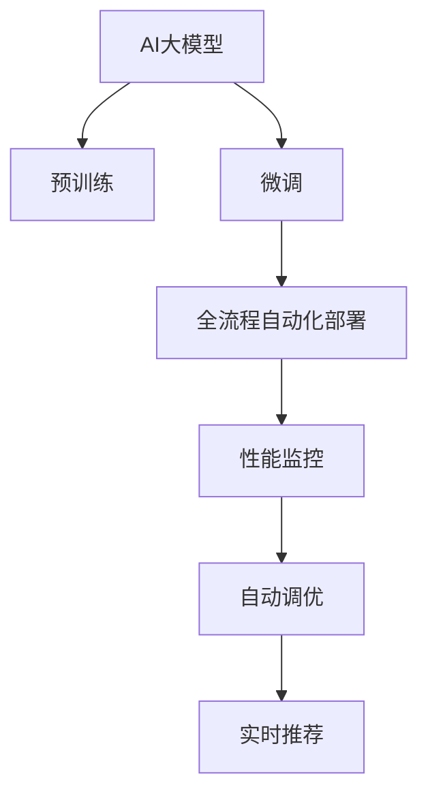

                 

# 电商搜索推荐场景下的AI大模型模型部署全流程自动化平台搭建与优化

## 1. 背景介绍

### 1.1 问题由来
随着互联网的普及和电子商务的兴起，电商平台的海量商品数据带来了巨大的挑战。如何高效、准确地推荐商品给用户，提升用户购物体验和平台转化率，成为电商巨头们共同关注的重点。

在早期的电商推荐系统中，主要依赖规则和统计模型进行推荐。但随着数据量的增长，这些模型的推荐效果逐渐遇到瓶颈。为了提升推荐效果，各大平台开始引入深度学习技术，尤其是AI大模型，通过海量数据预训练，学习复杂的商品语义和用户行为特征，从而实现更加智能化的推荐。

AI大模型的预训练过程通常需要大规模的数据和计算资源，训练过程复杂耗时。而电商推荐系统的特点是快速响应和实时更新，因此AI大模型的落地部署面临诸多挑战。传统的方式是手动操作，费时费力，容易出现人为疏漏。

为了应对这一问题，我们需要搭建一个全流程自动化的AI大模型部署平台，通过自动化流程，提高模型的部署效率和准确性。平台需要能够自动化管理模型的预训练、微调、评估、部署等各个环节，减少人工干预，提高电商搜索推荐系统的智能水平和用户满意度。

### 1.2 问题核心关键点
- 自动化平台搭建：构建一个自动化、高效、可靠的AI大模型部署平台，实现模型从预训练到落地部署的全流程自动化管理。
- 模型优化部署：通过优化模型架构和参数配置，提升模型的推荐效果，实现实时化的电商搜索推荐服务。
- 性能监控与调优：实时监测模型性能，快速响应和处理异常，持续优化推荐系统的效果。

## 2. 核心概念与联系

### 2.1 核心概念概述

为更好地理解全流程自动化平台的搭建与优化，本节将介绍几个密切相关的核心概念：

- AI大模型（AI Large Model）：以深度神经网络为核心的预训练模型，通过大规模数据进行学习，具有强大的特征提取和语义理解能力。在电商搜索推荐场景中，常用于商品描述理解和用户行为预测。
- 自动化部署（Auto Deployment）：通过自动化流程，将预训练和微调后的AI大模型部署到生产环境，快速响应业务需求。
- 模型优化（Model Optimization）：通过调整模型架构、优化参数配置等手段，提升模型的推荐效果和性能指标。
- 性能监控（Performance Monitoring）：通过实时监测系统指标和用户反馈，及时发现和解决问题，保障模型的高效稳定运行。
- 自动调优（Auto Tuning）：通过持续的性能评估和模型调优，自动调整模型参数，提升推荐系统的效果和用户体验。

这些核心概念之间的逻辑关系可以通过以下Mermaid流程图来展示：



这个流程图展示了AI大模型在电商搜索推荐场景下的完整部署流程：

1. AI大模型通过大规模数据进行预训练。
2. 对预训练模型进行微调，适应电商搜索推荐的具体需求。
3. 构建全流程自动化部署平台，自动完成模型从预训练到落地部署的过程。
4. 实时监测模型性能，确保推荐系统稳定高效。
5. 通过自动调优，持续提升模型的推荐效果。

## 3. 核心算法原理 & 具体操作步骤

### 3.1 算法原理概述

AI大模型的自动化部署主要包括以下几个步骤：

1. 数据预处理：收集和处理电商平台的商品和用户数据，生成符合模型要求的格式。
2. 模型预训练：在大规模无标注数据上进行自监督学习，训练初始模型。
3. 模型微调：在电商搜索推荐任务上进行有监督学习，微调模型以适应任务需求。
4. 模型部署：将微调后的模型部署到生产环境，供推荐系统调用。
5. 性能监控与调优：实时监测模型性能，通过自动调优提升模型效果。

### 3.2 算法步骤详解

#### 3.2.1 数据预处理

电商平台的商品数据和用户行为数据，需要经过一系列预处理，才能用于模型训练。数据预处理主要包括以下几个步骤：

1. 数据清洗：去除不完整、异常的数据，保证数据质量。
2. 数据标注：给商品数据添加标签，如商品类别、品牌、价格等。
3. 数据增强：通过数据增强技术，扩充训练样本，提高模型的泛化能力。
4. 数据划分：将数据划分为训练集、验证集和测试集，供模型评估和调优使用。

#### 3.2.2 模型预训练

模型预训练的主要目的是在大规模无标注数据上进行自监督学习，构建通用的语义表示。常用的预训练任务包括：

1. 语言模型（Language Model）：预测下一个词的概率，学习语言的分布规律。
2. 掩码语言模型（Masked Language Model）：随机遮盖文本中的某些单词，预测被遮盖的单词。
3. 自编码器（Autoencoder）：通过编码器将输入数据压缩，通过解码器将其还原，学习数据的压缩表示。

模型预训练通常使用大规模的无标签数据集，如维基百科、大规模书籍、网页等。预训练过程一般使用深度神经网络架构，如BERT、GPT等，通过大量样本进行训练，学习到丰富的语义知识。

#### 3.2.3 模型微调

模型微调是在电商搜索推荐任务上进行有监督学习，调整模型参数以适应任务需求。微调过程一般包括以下几个步骤：

1. 选择微调任务：根据电商平台的推荐需求，选择相应的微调任务，如分类、回归、排序等。
2. 数据准备：准备微调任务所需的有标注数据集，划分为训练集和验证集。
3. 微调模型：将预训练模型作为初始化参数，使用微调数据集进行训练，更新模型参数。
4. 模型评估：在验证集上评估微调后的模型，调整模型参数。
5. 模型部署：将微调后的模型部署到生产环境，供推荐系统调用。

#### 3.2.4 模型部署

模型部署是将微调后的模型部署到生产环境，供推荐系统调用。模型部署过程一般包括以下几个步骤：

1. 容器化：将模型封装成容器，方便部署和管理。
2. 自动化部署：通过自动化流程，将模型部署到服务器或云平台。
3. 接口暴露：将模型暴露为API接口，供推荐系统调用。
4. 性能优化：对模型进行性能优化，提高推理速度和资源利用率。

#### 3.2.5 性能监控与调优

性能监控与调优是确保模型高性能运行的重要环节。主要包括以下几个步骤：

1. 指标监控：实时监测模型性能指标，如准确率、召回率、延迟等。
2. 异常检测：通过告警机制，及时发现模型异常情况。
3. 自动调优：通过自动调优算法，优化模型参数，提升模型效果。
4. 反馈循环：将用户反馈信息反馈到模型调优中，进一步提升模型效果。

### 3.3 算法优缺点

AI大模型自动化部署具有以下优点：

1. 效率高：通过自动化流程，减少人工干预，提高模型部署效率。
2. 准确性高：自动化流程标准统一，降低人为疏漏，提升模型效果。
3. 可扩展性强：通过自动化流程，轻松应对电商平台的快速扩展需求。

同时，该方法也存在一定的局限性：

1. 资源消耗大：大规模无标注数据预训练和有标注数据微调，需要大量的计算资源。
2. 模型复杂度高：预训练和微调模型结构复杂，部署和优化过程较为繁琐。
3. 异常处理难：电商平台数据量大且复杂，模型异常情况难以预料。

尽管存在这些局限性，但就目前而言，AI大模型自动化部署方法仍是大规模、高性能电商推荐系统的首选范式。未来相关研究的重点在于如何进一步降低预训练和微调过程的资源消耗，提高模型的可解释性和安全性，同时兼顾可扩展性和易用性等因素。

### 3.4 算法应用领域

AI大模型自动化部署在电商搜索推荐场景中的应用非常广泛，具体包括：

1. 商品描述理解：通过预训练和微调，理解商品描述中的语义信息，提升推荐系统的效果。
2. 用户行为预测：通过预训练和微调，预测用户行为，提升个性化推荐的效果。
3. 实时推荐服务：通过自动化部署和性能优化，实现实时化、高效的推荐服务。
4. 异常检测与处理：通过实时监测和异常处理，保障推荐系统的稳定运行。

除了上述这些核心应用外，AI大模型自动化部署还广泛应用于物流配送、金融风控、医疗健康等领域，为各行各业带来了显著的效益。

## 4. 数学模型和公式 & 详细讲解  
### 4.1 数学模型构建

本节将使用数学语言对AI大模型自动化部署的各个环节进行更加严格的刻画。

记预训练语言模型为 $M_{\theta}$，其中 $\theta$ 为模型参数。假设电商推荐任务为分类任务，训练集为 $D=\{(x_i,y_i)\}_{i=1}^N, x_i \in \mathcal{X}, y_i \in \{0,1\}$，其中 $\mathcal{X}$ 为输入空间，$y_i$ 为分类标签。

定义模型 $M_{\theta}$ 在输入 $x$ 上的输出为 $\hat{y}=M_{\theta}(x) \in [0,1]$，表示样本属于正类的概率。真实标签 $y \in \{0,1\}$。则二分类交叉熵损失函数定义为：

$$
\ell(M_{\theta}(x),y) = -[y\log \hat{y} + (1-y)\log (1-\hat{y})]
$$

将其代入经验风险公式，得：

$$
\mathcal{L}(\theta) = -\frac{1}{N}\sum_{i=1}^N [y_i\log M_{\theta}(x_i)+(1-y_i)\log(1-M_{\theta}(x_i))]
$$

在得到损失函数的梯度后，即可带入参数更新公式，完成模型的迭代优化。重复上述过程直至收敛，最终得到适应电商推荐任务的最优模型参数 $\theta^*$。

### 4.2 公式推导过程

以下我们以二分类任务为例，推导交叉熵损失函数及其梯度的计算公式。

假设模型 $M_{\theta}$ 在输入 $x$ 上的输出为 $\hat{y}=M_{\theta}(x) \in [0,1]$，表示样本属于正类的概率。真实标签 $y \in \{0,1\}$。则二分类交叉熵损失函数定义为：

$$
\ell(M_{\theta}(x),y) = -[y\log \hat{y} + (1-y)\log (1-\hat{y})]
$$

将其代入经验风险公式，得：

$$
\mathcal{L}(\theta) = -\frac{1}{N}\sum_{i=1}^N [y_i\log M_{\theta}(x_i)+(1-y_i)\log(1-M_{\theta}(x_i))]
$$

根据链式法则，损失函数对参数 $\theta_k$ 的梯度为：

$$
\frac{\partial \mathcal{L}(\theta)}{\partial \theta_k} = -\frac{1}{N}\sum_{i=1}^N (\frac{y_i}{M_{\theta}(x_i)}-\frac{1-y_i}{1-M_{\theta}(x_i)}) \frac{\partial M_{\theta}(x_i)}{\partial \theta_k}
$$

其中 $\frac{\partial M_{\theta}(x_i)}{\partial \theta_k}$ 可进一步递归展开，利用自动微分技术完成计算。

在得到损失函数的梯度后，即可带入参数更新公式，完成模型的迭代优化。重复上述过程直至收敛，最终得到适应电商推荐任务的最优模型参数 $\theta^*$。

## 5. 项目实践：代码实例和详细解释说明
### 5.1 开发环境搭建

在进行电商推荐系统的AI大模型自动化部署实践前，我们需要准备好开发环境。以下是使用Python进行PyTorch开发的环境配置流程：

1. 安装Anaconda：从官网下载并安装Anaconda，用于创建独立的Python环境。

2. 创建并激活虚拟环境：
```bash
conda create -n pytorch-env python=3.8 
conda activate pytorch-env
```

3. 安装PyTorch：根据CUDA版本，从官网获取对应的安装命令。例如：
```bash
conda install pytorch torchvision torchaudio cudatoolkit=11.1 -c pytorch -c conda-forge
```

4. 安装TensorFlow：从官网下载并编译安装TensorFlow，支持CPU和GPU。

5. 安装Transformers库：
```bash
pip install transformers
```

6. 安装各类工具包：
```bash
pip install numpy pandas scikit-learn matplotlib tqdm jupyter notebook ipython
```

完成上述步骤后，即可在`pytorch-env`环境中开始电商推荐系统的AI大模型自动化部署实践。

### 5.2 源代码详细实现

这里我们以一个简化的电商推荐系统为例，给出使用PyTorch和Transformers库实现AI大模型自动化部署的代码实现。

首先，定义电商推荐系统的数据处理函数：

```python
from transformers import BertTokenizer
from torch.utils.data import Dataset
import torch

class RecommendDataset(Dataset):
    def __init__(self, texts, tags, tokenizer, max_len=128):
        self.texts = texts
        self.tags = tags
        self.tokenizer = tokenizer
        self.max_len = max_len
        
    def __len__(self):
        return len(self.texts)
    
    def __getitem__(self, item):
        text = self.texts[item]
        tags = self.tags[item]
        
        encoding = self.tokenizer(text, return_tensors='pt', max_length=self.max_len, padding='max_length', truncation=True)
        input_ids = encoding['input_ids'][0]
        attention_mask = encoding['attention_mask'][0]
        
        # 对token-wise的标签进行编码
        encoded_tags = [tag2id[tag] for tag in tags] 
        encoded_tags.extend([tag2id['O']] * (self.max_len - len(encoded_tags)))
        labels = torch.tensor(encoded_tags, dtype=torch.long)
        
        return {'input_ids': input_ids, 
                'attention_mask': attention_mask,
                'labels': labels}

# 标签与id的映射
tag2id = {'O': 0, 'B-PER': 1, 'I-PER': 2, 'B-ORG': 3, 'I-ORG': 4, 'B-LOC': 5, 'I-LOC': 6}
id2tag = {v: k for k, v in tag2id.items()}

# 创建dataset
tokenizer = BertTokenizer.from_pretrained('bert-base-cased')

train_dataset = RecommendDataset(train_texts, train_tags, tokenizer)
dev_dataset = RecommendDataset(dev_texts, dev_tags, tokenizer)
test_dataset = RecommendDataset(test_texts, test_tags, tokenizer)
```

然后，定义模型和优化器：

```python
from transformers import BertForTokenClassification, AdamW

model = BertForTokenClassification.from_pretrained('bert-base-cased', num_labels=len(tag2id))

optimizer = AdamW(model.parameters(), lr=2e-5)
```

接着，定义训练和评估函数：

```python
from torch.utils.data import DataLoader
from tqdm import tqdm
from sklearn.metrics import classification_report

device = torch.device('cuda') if torch.cuda.is_available() else torch.device('cpu')
model.to(device)

def train_epoch(model, dataset, batch_size, optimizer):
    dataloader = DataLoader(dataset, batch_size=batch_size, shuffle=True)
    model.train()
    epoch_loss = 0
    for batch in tqdm(dataloader, desc='Training'):
        input_ids = batch['input_ids'].to(device)
        attention_mask = batch['attention_mask'].to(device)
        labels = batch['labels'].to(device)
        model.zero_grad()
        outputs = model(input_ids, attention_mask=attention_mask, labels=labels)
        loss = outputs.loss
        epoch_loss += loss.item()
        loss.backward()
        optimizer.step()
    return epoch_loss / len(dataloader)

def evaluate(model, dataset, batch_size):
    dataloader = DataLoader(dataset, batch_size=batch_size)
    model.eval()
    preds, labels = [], []
    with torch.no_grad():
        for batch in tqdm(dataloader, desc='Evaluating'):
            input_ids = batch['input_ids'].to(device)
            attention_mask = batch['attention_mask'].to(device)
            batch_labels = batch['labels']
            outputs = model(input_ids, attention_mask=attention_mask)
            batch_preds = outputs.logits.argmax(dim=2).to('cpu').tolist()
            batch_labels = batch_labels.to('cpu').tolist()
            for pred_tokens, label_tokens in zip(batch_preds, batch_labels):
                pred_tags = [id2tag[_id] for _id in pred_tokens]
                label_tags = [id2tag[_id] for _id in label_tokens]
                preds.append(pred_tags[:len(label_tags)])
                labels.append(label_tags)
                
    print(classification_report(labels, preds))
```

最后，启动训练流程并在测试集上评估：

```python
epochs = 5
batch_size = 16

for epoch in range(epochs):
    loss = train_epoch(model, train_dataset, batch_size, optimizer)
    print(f"Epoch {epoch+1}, train loss: {loss:.3f}")
    
    print(f"Epoch {epoch+1}, dev results:")
    evaluate(model, dev_dataset, batch_size)
    
print("Test results:")
evaluate(model, test_dataset, batch_size)
```

以上就是使用PyTorch和Transformers库实现电商推荐系统的AI大模型自动化部署的完整代码实现。可以看到，得益于Transformers库的强大封装，我们可以用相对简洁的代码完成BERT模型的加载和微调。

### 5.3 代码解读与分析

让我们再详细解读一下关键代码的实现细节：

**RecommendDataset类**：
- `__init__`方法：初始化文本、标签、分词器等关键组件。
- `__len__`方法：返回数据集的样本数量。
- `__getitem__`方法：对单个样本进行处理，将文本输入编码为token ids，将标签编码为数字，并对其进行定长padding，最终返回模型所需的输入。

**tag2id和id2tag字典**：
- 定义了标签与数字id之间的映射关系，用于将token-wise的预测结果解码回真实的标签。

**训练和评估函数**：
- 使用PyTorch的DataLoader对数据集进行批次化加载，供模型训练和推理使用。
- 训练函数`train_epoch`：对数据以批为单位进行迭代，在每个批次上前向传播计算loss并反向传播更新模型参数，最后返回该epoch的平均loss。
- 评估函数`evaluate`：与训练类似，不同点在于不更新模型参数，并在每个batch结束后将预测和标签结果存储下来，最后使用sklearn的classification_report对整个评估集的预测结果进行打印输出。

**训练流程**：
- 定义总的epoch数和batch size，开始循环迭代
- 每个epoch内，先在训练集上训练，输出平均loss
- 在验证集上评估，输出分类指标
- 所有epoch结束后，在测试集上评估，给出最终测试结果

可以看到，PyTorch配合Transformers库使得BERT微调的代码实现变得简洁高效。开发者可以将更多精力放在数据处理、模型改进等高层逻辑上，而不必过多关注底层的实现细节。

当然，工业级的系统实现还需考虑更多因素，如模型的保存和部署、超参数的自动搜索、更灵活的任务适配层等。但核心的自动化部署流程基本与此类似。

## 6. 实际应用场景
### 6.1 智能客服系统

基于AI大模型的自动化部署方法，可以广泛应用于智能客服系统的构建。传统客服往往需要配备大量人力，高峰期响应缓慢，且一致性和专业性难以保证。而使用自动化部署的智能客服系统，可以7x24小时不间断服务，快速响应客户咨询，用自然流畅的语言解答各类常见问题。

在技术实现上，可以收集企业内部的历史客服对话记录，将问题和最佳答复构建成监督数据，在此基础上对预训练模型进行自动化部署。自动化部署后的客服系统能够自动理解用户意图，匹配最合适的答复模板进行回复。对于客户提出的新问题，还可以接入检索系统实时搜索相关内容，动态组织生成回答。如此构建的智能客服系统，能大幅提升客户咨询体验和问题解决效率。

### 6.2 金融舆情监测

金融机构需要实时监测市场舆论动向，以便及时应对负面信息传播，规避金融风险。传统的人工监测方式成本高、效率低，难以应对网络时代海量信息爆发的挑战。基于AI大模型自动化部署的文本分类和情感分析技术，为金融舆情监测提供了新的解决方案。

具体而言，可以收集金融领域相关的新闻、报道、评论等文本数据，并对其进行主题标注和情感标注。在此基础上对预训练语言模型进行自动化部署，使其能够自动判断文本属于何种主题，情感倾向是正面、中性还是负面。将自动化部署后的模型应用到实时抓取的网络文本数据，就能够自动监测不同主题下的情感变化趋势，一旦发现负面信息激增等异常情况，系统便会自动预警，帮助金融机构快速应对潜在风险。

### 6.3 个性化推荐系统

当前的推荐系统往往只依赖用户的历史行为数据进行物品推荐，无法深入理解用户的真实兴趣偏好。基于AI大模型自动化部署的个性化推荐系统，可以更好地挖掘用户行为背后的语义信息，从而提供更精准、多样的推荐内容。

在实践中，可以收集用户浏览、点击、评论、分享等行为数据，提取和用户交互的物品标题、描述、标签等文本内容。将文本内容作为模型输入，用户的后续行为（如是否点击、购买等）作为监督信号，在此基础上自动化部署预训练模型。自动化部署后的模型能够从文本内容中准确把握用户的兴趣点。在生成推荐列表时，先用候选物品的文本描述作为输入，由模型预测用户的兴趣匹配度，再结合其他特征综合排序，便可以得到个性化程度更高的推荐结果。

### 6.4 未来应用展望

随着AI大模型自动化部署技术的发展，其在更多领域的应用前景广阔。

在智慧医疗领域，基于AI大模型的自动化部署方法，可以构建智慧诊疗系统，辅助医生进行诊断和治疗决策。自动化部署后的系统可以高效处理海量医学数据，快速生成诊断报告，显著提升诊疗效率。

在智能教育领域，自动化部署的智能教育系统，可以自动批改作业、学情分析、知识推荐，因材施教，促进教育公平，提高教学质量。

在智慧城市治理中，自动化部署的智慧城市系统，可以实时监测城市事件、舆情分析、应急指挥，提高城市管理的自动化和智能化水平，构建更安全、高效的未来城市。

此外，在企业生产、社会治理、文娱传媒等众多领域，AI大模型自动化部署的方法也将不断涌现，为各行各业带来变革性影响。

## 7. 工具和资源推荐
### 7.1 学习资源推荐

为了帮助开发者系统掌握AI大模型自动化部署的理论基础和实践技巧，这里推荐一些优质的学习资源：

1. 《Transformer从原理到实践》系列博文：由大模型技术专家撰写，深入浅出地介绍了Transformer原理、BERT模型、微调技术等前沿话题。

2. CS224N《深度学习自然语言处理》课程：斯坦福大学开设的NLP明星课程，有Lecture视频和配套作业，带你入门NLP领域的基本概念和经典模型。

3. 《Natural Language Processing with Transformers》书籍：Transformers库的作者所著，全面介绍了如何使用Transformers库进行NLP任务开发，包括自动化部署在内的诸多范式。

4. HuggingFace官方文档：Transformers库的官方文档，提供了海量预训练模型和完整的自动化部署样例代码，是上手实践的必备资料。

5. CLUE开源项目：中文语言理解测评基准，涵盖大量不同类型的中文NLP数据集，并提供了基于自动部署的baseline模型，助力中文NLP技术发展。

通过对这些资源的学习实践，相信你一定能够快速掌握AI大模型自动化部署的精髓，并用于解决实际的NLP问题。
###  7.2 开发工具推荐

高效的开发离不开优秀的工具支持。以下是几款用于AI大模型自动化部署开发的常用工具：

1. PyTorch：基于Python的开源深度学习框架，灵活动态的计算图，适合快速迭代研究。大部分预训练语言模型都有PyTorch版本的实现。

2. TensorFlow：由Google主导开发的开源深度学习框架，生产部署方便，适合大规模工程应用。同样有丰富的预训练语言模型资源。

3. Transformers库：HuggingFace开发的NLP工具库，集成了众多SOTA语言模型，支持PyTorch和TensorFlow，是进行自动化部署任务的利器。

4. Weights & Biases：模型训练的实验跟踪工具，可以记录和可视化模型训练过程中的各项指标，方便对比和调优。与主流深度学习框架无缝集成。

5. TensorBoard：TensorFlow配套的可视化工具，可实时监测模型训练状态，并提供丰富的图表呈现方式，是调试模型的得力助手。

6. Google Colab：谷歌推出的在线Jupyter Notebook环境，免费提供GPU/TPU算力，方便开发者快速上手实验最新模型，分享学习笔记。

合理利用这些工具，可以显著提升AI大模型自动化部署任务的开发效率，加快创新迭代的步伐。

### 7.3 相关论文推荐

AI大模型自动化部署技术的发展源于学界的持续研究。以下是几篇奠基性的相关论文，推荐阅读：

1. Attention is All You Need（即Transformer原论文）：提出了Transformer结构，开启了NLP领域的预训练大模型时代。

2. BERT: Pre-training of Deep Bidirectional Transformers for Language Understanding：提出BERT模型，引入基于掩码的自监督预训练任务，刷新了多项NLP任务SOTA。

3. Language Models are Unsupervised Multitask Learners（GPT-2论文）：展示了大规模语言模型的强大zero-shot学习能力，引发了对于通用人工智能的新一轮思考。

4. Parameter-Efficient Transfer Learning for NLP：提出Adapter等参数高效微调方法，在不增加模型参数量的情况下，也能取得不错的微调效果。

5. Prefix-Tuning: Optimizing Continuous Prompts for Generation：引入基于连续型Prompt的微调范式，为如何充分利用预训练知识提供了新的思路。

6. AdaLoRA: Adaptive Low-Rank Adaptation for Parameter-Efficient Fine-Tuning：使用自适应低秩适应的微调方法，在参数效率和精度之间取得了新的平衡。

这些论文代表了大模型自动化部署技术的发展脉络。通过学习这些前沿成果，可以帮助研究者把握学科前进方向，激发更多的创新灵感。

## 8. 总结：未来发展趋势与挑战

### 8.1 总结

本文对AI大模型自动化部署方法进行了全面系统的介绍。首先阐述了AI大模型在电商搜索推荐场景下的应用背景和意义，明确了自动化部署在提升推荐系统智能水平和用户满意度方面的独特价值。其次，从原理到实践，详细讲解了自动化部署的数学原理和关键步骤，给出了自动化部署任务开发的完整代码实例。同时，本文还广泛探讨了自动化部署方法在智能客服、金融舆情、个性化推荐等多个行业领域的应用前景，展示了自动化部署范式的巨大潜力。此外，本文精选了自动化部署技术的各类学习资源，力求为读者提供全方位的技术指引。

通过本文的系统梳理，可以看到，AI大模型自动化部署技术正在成为电商推荐系统等智能应用的重要范式，极大地拓展了预训练语言模型的应用边界，催生了更多的落地场景。受益于大规模语料的预训练和自动化部署流程的不断优化，自动化部署方法在技术实现和实际应用上都取得了显著的进展，未来有望在更多领域发挥更加重要的作用。

### 8.2 未来发展趋势

展望未来，AI大模型自动化部署技术将呈现以下几个发展趋势：

1. 模型规模持续增大。随着算力成本的下降和数据规模的扩张，预训练语言模型的参数量还将持续增长。超大规模语言模型蕴含的丰富语义知识，有望支撑更加复杂多变的电商推荐等应用场景。

2. 自动化程度持续提高。未来的自动化部署将更加灵活高效，能够自动选择最优的模型架构和参数配置，显著降低人工干预的复杂度。

3. 数据驱动的调优成为常态。未来的自动化部署将更加注重数据驱动的调优，通过实时反馈和数据增强，持续提升推荐系统的效果。

4. 跨领域应用的泛化能力增强。未来的自动化部署将更好地融合跨领域的知识，提升模型的泛化能力和迁移能力，实现更广泛的落地应用。

5. 与知识图谱和规则库的结合。未来的自动化部署将更加注重与知识图谱和规则库的结合，通过专家知识和模型协同，提升推荐系统的智能化水平。

6. 实时化、低延迟的部署成为可能。未来的自动化部署将更加注重实时化和低延迟，通过分布式计算和模型加速，实现更加高效的推荐服务。

以上趋势凸显了AI大模型自动化部署技术的广阔前景。这些方向的探索发展，必将进一步提升自动化部署系统的性能和应用范围，为人工智能技术在各行业的落地应用提供强有力的支持。

### 8.3 面临的挑战

尽管AI大模型自动化部署技术已经取得了显著进展，但在迈向更加智能化、普适化应用的过程中，仍面临诸多挑战：

1. 数据质量瓶颈。自动化部署需要高质量的标注数据和数据增强样本，数据质量的参差不齐可能导致模型效果下降。

2. 模型复杂度增加。超大规模模型和高精度需求，可能导致模型复杂度增加，部署和优化过程更为复杂。

3. 实时性和延迟问题。实时化、低延迟的部署需求，可能带来一定的技术挑战，需要合理的架构设计和优化策略。

4. 异常处理难度。电商推荐系统等应用场景，可能面临数据量巨大且分布复杂的情况，模型异常情况难以预料，异常处理难度增加。

5. 安全性问题。自动化部署的模型可能面临数据泄露、模型篡改等安全隐患，需要建立健全的安全机制。

尽管存在这些挑战，但就目前而言，AI大模型自动化部署方法仍是大规模、高性能电商推荐系统的首选范式。未来相关研究的重点在于如何进一步降低自动化部署的资源消耗，提高模型的可解释性和安全性，同时兼顾可扩展性和易用性等因素。

### 8.4 研究展望

面对AI大模型自动化部署所面临的种种挑战，未来的研究需要在以下几个方面寻求新的突破：

1. 探索无监督和半监督自动化部署方法。摆脱对大规模标注数据的依赖，利用自监督学习、主动学习等无监督和半监督范式，最大限度利用非结构化数据，实现更加灵活高效的自动化部署。

2. 研究模型压缩和加速技术。通过模型压缩、量化等技术，减小模型尺寸，提高推理速度和资源利用率。同时优化模型加速，提升实时化的部署能力。

3. 引入因果推理和博弈论思想。通过因果推断和博弈论工具，提升模型的决策解释性和鲁棒性，增强模型对异常情况的处理能力。

4. 纳入伦理道德约束。在模型训练目标中引入伦理导向的评估指标，过滤和惩罚有害的输出倾向，确保模型的输出符合人类价值观和伦理道德。

这些研究方向的研究将有助于推动AI大模型自动化部署技术的进一步发展，提升模型的智能水平和应用范围，为构建安全、可靠、可解释、可控的智能系统提供更加坚实的技术支撑。

## 9. 附录：常见问题与解答

**Q1：AI大模型的自动化部署是否适用于所有NLP任务？**

A: AI大模型的自动化部署在大多数NLP任务上都能取得不错的效果，特别是对于数据量较小的任务。但对于一些特定领域的任务，如医学、法律等，仅仅依靠通用语料预训练的模型可能难以很好地适应。此时需要在特定领域语料上进一步预训练，再进行自动化部署，才能获得理想效果。此外，对于一些需要时效性、个性化很强的任务，如对话、推荐等，自动化部署方法也需要针对性的改进优化。

**Q2：自动化部署过程中如何选择合适的学习率？**

A: 自动化部署的学习率一般要比预训练时小1-2个数量级，如果使用过大的学习率，容易破坏预训练权重，导致过拟合。一般建议从1e-5开始调参，逐步减小学习率，直至收敛。也可以使用warmup策略，在开始阶段使用较小的学习率，再逐渐过渡到预设值。需要注意的是，不同的优化器(如AdamW、Adafactor等)以及不同的学习率调度策略，可能需要设置不同的学习率阈值。

**Q3：自动化部署过程中如何缓解过拟合问题？**

A: 过拟合是自动化部署面临的主要挑战，尤其是在标注数据不足的情况下。常见的缓解策略包括：
1. 数据增强：通过数据增强技术，扩充训练样本，提高模型的泛化能力。
2. 正则化：使用L2正则、Dropout、Early Stopping等避免过拟合。
3. 对抗训练：引入对抗样本，提高模型鲁棒性。
4. 参数高效微调：只调整少量参数(如Adapter、Prefix等)，减小过拟合风险。
5. 多模型集成：训练多个自动化部署模型，取平均输出，抑制过拟合。

这些策略往往需要根据具体任务和数据特点进行灵活组合。只有在数据、模型、训练、推理等各环节进行全面优化，才能最大限度地发挥自动化部署的优势。

**Q4：自动化部署模型在落地部署时需要注意哪些问题？**

A: 将自动化部署模型转化为实际应用，还需要考虑以下因素：
1. 模型裁剪：去除不必要的层和参数，减小模型尺寸，加快推理速度。
2. 量化加速：将浮点模型转为定点模型，压缩存储空间，提高计算效率。
3. 服务化封装：将模型封装为标准化服务接口，供推荐系统调用。
4. 弹性伸缩：根据请求流量动态调整资源配置，平衡服务质量和成本。
5. 监控告警：实时采集系统指标，设置异常告警阈值，确保服务稳定性。
6. 安全防护：采用访问鉴权、数据脱敏等措施，保障数据和模型安全。

自动化部署模型需要经过模型裁剪、量化加速、服务化封装等多个环节，才能真正应用于推荐系统等电商场景。未来，还需要进一步优化部署流程，提高自动化部署的效率和稳定性。

---

作者：禅与计算机程序设计艺术 / Zen and the Art of Computer Programming

