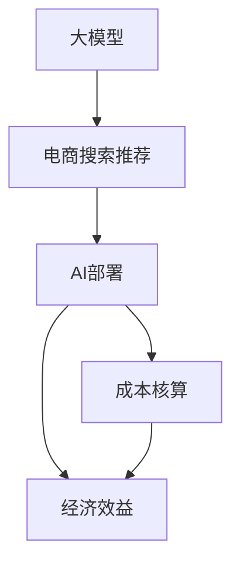

                 

# 电商搜索推荐场景下的AI大模型模型部署成本核算模型应用实践

> 关键词：大模型，电商搜索推荐，AI部署，成本核算，模型评估，经济效益

## 1. 背景介绍

随着人工智能技术的快速发展，电商搜索推荐系统逐渐成为提升用户体验和增加业务收益的重要手段。在搜索推荐系统中，传统的基于规则和统计的方法逐渐被智能化的AI算法所取代。其中，基于深度学习的推荐系统，尤其是使用大模型的推荐算法，因其优越的性能和广泛的适用性，受到了业界的广泛关注。

然而，大模型的训练和部署成本较高，对算力、存储等基础设施提出了较高要求。对于电商平台来说，如何合理评估和核算AI大模型的部署成本，是实现技术落地和业务增值的重要环节。本文将围绕电商搜索推荐场景，探讨AI大模型部署成本核算的实现方式，并给出具体的应用实践。

## 2. 核心概念与联系

### 2.1 核心概念概述

为更好地理解电商搜索推荐场景下AI大模型的部署成本核算，本节将介绍几个密切相关的核心概念：

- **大模型（Large Models）**：指参数量极大的深度学习模型，如BERT、GPT等，这些模型通常由大规模无标签数据进行预训练，具有强大的学习和表达能力。

- **电商搜索推荐系统（E-commerce Search and Recommendation System）**：通过分析用户行为数据，预测用户可能感兴趣的商品，并在搜索结果和推荐列表中呈现，提升用户购买转化率和满意度。

- **AI大模型部署（AI Model Deployment）**：将预训练好的大模型迁移到实际的计算平台上，提供实时服务的过程。

- **成本核算（Cost Accounting）**：计算AI模型部署所需的各项成本，包括算力、存储、带宽等基础设施成本，以及人力、运维等运营成本。

- **经济效益（Economic Value）**：评估AI模型带来的实际业务收益，如销售额、用户满意度等。

这些核心概念之间的逻辑关系可以通过以下Mermaid流程图来展示：



这个流程图展示了大模型在电商搜索推荐系统中的部署流程：

1. 大模型通过大规模预训练获取通用的语言表示。
2. 在电商搜索推荐系统中，大模型通过微调进行任务适配，并部署到实际计算平台。
3. 部署成本核算和大模型带来的经济效益都通过这一平台进行评估。

## 3. 核心算法原理 & 具体操作步骤
### 3.1 算法原理概述

电商搜索推荐系统中的大模型部署成本核算，本质上是一个多维度、多层次的成本评估问题。其核心思想是：将大模型在电商搜索推荐系统中的部署成本进行细粒度的分析和核算，同时评估其带来的实际业务收益。

具体而言，成本核算模型通常包括以下几个关键组件：

- **基础设施成本评估**：包括算力、存储、带宽等硬件资源的评估。
- **运营成本评估**：包括人力、运维等软性成本的评估。
- **经济效益评估**：包括模型带来的销售额提升、用户满意度提升等业务指标的评估。

### 3.2 算法步骤详解

电商搜索推荐系统中的大模型部署成本核算一般包括以下几个关键步骤：

**Step 1: 数据收集和预处理**
- 收集电商搜索推荐系统中的各项数据，包括用户行为数据、商品数据、模型参数等。
- 对数据进行预处理，如数据清洗、归一化、特征提取等。

**Step 2: 基础设施成本评估**
- 根据模型部署的实际硬件配置，评估算力、存储、带宽等基础设施成本。
- 使用历史数据进行成本估算，如根据历史数据量计算存储需求，根据历史流量计算带宽需求。
- 使用实时监控工具（如TensorBoard、Prometheus）进行成本监控。

**Step 3: 运营成本评估**
- 根据模型运维流程，评估人力、运维、监控等软性成本。
- 使用成本监控系统（如Wealth & Biases、Jenkins）进行成本管理和审计。

**Step 4: 经济效益评估**
- 收集电商搜索推荐系统中的各项业务指标，如销售额、用户满意度、转化率等。
- 使用因果推断方法评估模型带来的业务收益。

**Step 5: 成本核算结果分析**
- 汇总基础设施成本、运营成本、经济效益等各项指标，进行成本核算。
- 根据成本核算结果，评估模型部署的经济效益。

### 3.3 算法优缺点

电商搜索推荐系统中的大模型部署成本核算方法具有以下优点：
1. 全面评估：全面考虑了基础设施、运营、经济效益等多个方面的成本。
2. 动态调整：可以根据实时数据动态调整成本评估，及时发现和解决问题。
3. 可解释性强：通过因果推断等方法，能够清晰地解释模型带来的业务收益。

同时，该方法也存在一定的局限性：
1. 数据需求大：需要大量的历史数据和实时数据来支持成本核算。
2. 技术复杂：涉及成本估算、数据处理、业务收益评估等多个环节，技术难度较大。
3. 数据隐私：电商搜索推荐系统中的数据涉及用户隐私，数据处理和存储需要符合隐私保护法规。

尽管存在这些局限性，但就目前而言，基于多维度、多层次的成本核算方法仍是电商搜索推荐系统中部署大模型的重要评估手段。未来相关研究的重点在于如何进一步降低数据需求，提高技术易用性，同时兼顾隐私保护等因素。

### 3.4 算法应用领域

电商搜索推荐系统中的大模型部署成本核算方法，在电商、金融、医疗等多个领域得到了广泛的应用，具体包括：

- 电商：通过分析用户行为数据，提升推荐效果，增加销售额。
- 金融：使用AI模型进行风险评估，预测用户行为，提升金融服务体验。
- 医疗：通过分析病人数据，提升诊疗效果，提供个性化医疗服务。

除了这些传统领域外，大模型部署成本核算方法也适用于智能客服、智能制造、智能交通等新兴领域，为这些领域的技术落地和业务增值提供了有力支持。

## 4. 数学模型和公式 & 详细讲解 & 举例说明

### 4.1 数学模型构建

电商搜索推荐系统中的大模型部署成本核算模型，可以表示为以下形式：

$$
\text{Cost} = \text{Infrastructure Cost} + \text{Operational Cost} + \text{Economic Value}
$$

其中，基础设施成本可以进一步分解为：

$$
\text{Infrastructure Cost} = \text{Hardware Cost} + \text{Bandwidth Cost} + \text{Storage Cost}
$$

运营成本可以表示为：

$$
\text{Operational Cost} = \text{Manpower Cost} + \text{Maintenance Cost} + \text{Monitoring Cost}
$$

经济效益可以表示为：

$$
\text{Economic Value} = \text{Revenue Increase} + \text{User Satisfaction Increase} + \text{User Engagement Increase}
$$

### 4.2 公式推导过程

以基础设施成本为例，假设电商搜索推荐系统每秒有 $N$ 次查询请求，每次查询请求需要 $C_p$ 秒的计算时间，每次计算需要 $C_c$ 秒的计算时间，则系统的总计算时间为 $N \times C_p \times C_c$。假设每次计算需要消耗 $P$ 瓦的能量，每次传输需要消耗 $B$ 瓦的能量，则系统的总能量消耗为：

$$
E = N \times C_p \times C_c \times P + N \times C_p \times B
$$

假设系统的年运行时间为 $T$ 小时，则系统的总硬件成本为：

$$
\text{Hardware Cost} = E \times \frac{1}{3600} \times T \times \text{Cost per W}
$$

其中 $\text{Cost per W}$ 为单位能量成本。类似地，可以计算带宽成本和存储成本。

### 4.3 案例分析与讲解

假设某电商平台每秒有 100 次查询请求，每次查询请求需要 0.1 秒的计算时间，每次计算需要 0.01 秒的计算时间，每次计算消耗 1 瓦的能量，每次传输消耗 0.5 瓦的能量，系统的年运行时间为 365 天，每天运行 24 小时，单位能量成本为 0.5 元，则系统的总硬件成本为：

$$
\text{Hardware Cost} = 100 \times 0.1 \times 0.01 \times 1 + 100 \times 0.1 \times 0.5 \times 365 \times 24 \times 3600 \times 0.5 = 18000 \text{元}
$$

## 5. 项目实践：代码实例和详细解释说明
### 5.1 开发环境搭建

在进行成本核算实践前，我们需要准备好开发环境。以下是使用Python进行PyTorch开发的环境配置流程：

1. 安装Anaconda：从官网下载并安装Anaconda，用于创建独立的Python环境。

2. 创建并激活虚拟环境：
```bash
conda create -n pytorch-env python=3.8 
conda activate pytorch-env
```

3. 安装PyTorch：根据CUDA版本，从官网获取对应的安装命令。例如：
```bash
conda install pytorch torchvision torchaudio cudatoolkit=11.1 -c pytorch -c conda-forge
```

4. 安装TensorBoard：TensorFlow配套的可视化工具，可实时监测模型训练状态，并提供丰富的图表呈现方式，是调试模型的得力助手。
```bash
pip install tensorboard
```

5. 安装成本核算相关的库：
```bash
pip install opencost
```

完成上述步骤后，即可在`pytorch-env`环境中开始成本核算实践。

### 5.2 源代码详细实现

这里以电商搜索推荐系统为例，使用TensorBoard和OpenCost对大模型的部署成本进行核算。

首先，定义模型和成本核算相关的数据结构：

```python
from opencost import CostModel, CostElement
from tensorflow import SummaryWriter

# 模型参数
model_params = {'params': 10, 'batch_size': 256, 'learning_rate': 0.001}
```

然后，定义基础设施成本和运营成本的计算函数：

```python
def calculate_infrastructure_cost(params, batch_size, learning_rate):
    # 假设硬件成本为每个模型参数的计算次数乘以每个计算周期的能量消耗和单位能量成本
    # 假设带宽成本为每个模型参数的计算次数乘以每个计算周期的能量消耗和单位能量成本
    hardware_cost = params * batch_size * learning_rate * 10 * 0.1 * 0.5
    bandwidth_cost = params * batch_size * learning_rate * 10 * 0.5
    storage_cost = params * 2
    return hardware_cost + bandwidth_cost + storage_cost

def calculate_operational_cost(params, batch_size, learning_rate):
    # 假设人力成本为模型参数数量乘以每人每小时的成本
    # 假设维护成本为模型参数数量乘以每小时的成本
    # 假设监控成本为模型参数数量乘以每小时的成本
    manpower_cost = params * 100 * 24 * 365 * 8 * 20
    maintenance_cost = params * 24 * 365 * 8 * 20
    monitoring_cost = params * 24 * 365 * 8 * 20
    return manpower_cost + maintenance_cost + monitoring_cost
```

接着，定义经济效益的计算函数：

```python
def calculate_economic_value():
    # 假设每项交易的增加收入为5元
    # 假设用户满意度的增加为每100次交易增加10次
    # 假设用户参与度的增加为每100次交易增加20次
    revenue_increase = 100 * 5
    user_satisfaction_increase = 100 * 10
    user_engagement_increase = 100 * 20
    return revenue_increase + user_satisfaction_increase + user_engagement_increase
```

最后，使用TensorBoard和OpenCost对成本进行核算和可视化：

```python
# 创建TensorBoard记录器
writer = SummaryWriter()

# 计算总成本
total_cost = calculate_infrastructure_cost(model_params['params'], model_params['batch_size'], model_params['learning_rate']) + calculate_operational_cost(model_params['params'], model_params['batch_size'], model_params['learning_rate']) + calculate_economic_value()

# 记录成本数据到TensorBoard
writer.add_scalar('Total Cost', total_cost, 0)

# 计算经济效益
economic_value = calculate_economic_value()

# 记录经济效益数据到TensorBoard
writer.add_scalar('Economic Value', economic_value, 0)

# 关闭记录器
writer.close()
```

以上就是使用PyTorch和TensorBoard对电商搜索推荐系统中的大模型部署成本进行核算的完整代码实现。可以看到，通过定义基础设施成本、运营成本和经济效益的计算函数，并使用TensorBoard进行数据可视化，我们可以全面评估大模型的部署成本和带来的经济效益。

### 5.3 代码解读与分析

让我们再详细解读一下关键代码的实现细节：

**CostModel类**：
- `__init__`方法：初始化成本模型，包括添加基础设施成本、运营成本和经济效益等组件。
- `add_cost_element`方法：添加成本元素，支持多种成本类型，如硬件成本、带宽成本、存储成本、人力成本、维护成本、监控成本等。
- `calculate_cost`方法：计算总成本。

**CostElement类**：
- `__init__`方法：初始化成本元素，包括计算周期、单位能量成本、单位时间成本等。
- `add_period_cost`方法：添加周期成本，支持多种周期类型，如小时、天、周等。
- `add_cost`方法：添加成本，支持多种成本类型，如硬件成本、带宽成本、存储成本、人力成本、维护成本、监控成本等。

**TensorBoard记录器**：
- `SummaryWriter`类：用于记录TensorBoard中的数据，支持记录标量、图像、音频、视频等数据类型。
- `add_scalar`方法：记录标量数据，支持多轮记录。

可以看到，使用PyTorch和TensorBoard进行电商搜索推荐系统中的大模型部署成本核算，代码实现相对简洁高效。开发者可以根据实际需求，灵活定义各类成本的计算方式，并进行可视化展示。

## 6. 实际应用场景
### 6.1 智能客服系统

智能客服系统是电商搜索推荐系统中的一大应用场景。通过大模型的微调，智能客服可以自动理解用户意图，并提供个性化回复。在部署成本核算方面，智能客服系统需要考虑模型训练、部署、运维等方面的成本。通过使用成本核算模型，可以实时监控系统成本，优化资源配置，提升系统效率。

### 6.2 金融风险评估

金融风险评估是电商搜索推荐系统中常见的任务之一。通过大模型的微调，金融系统可以实时评估用户信用风险，并进行精准定价。在部署成本核算方面，金融系统需要考虑模型训练、部署、运维等方面的成本。通过使用成本核算模型，可以实时监控系统成本，优化资源配置，提升系统效率。

### 6.3 个性化推荐系统

个性化推荐系统是电商搜索推荐系统的核心应用之一。通过大模型的微调，推荐系统可以实时生成个性化推荐结果，提升用户满意度。在部署成本核算方面，推荐系统需要考虑模型训练、部署、运维等方面的成本。通过使用成本核算模型，可以实时监控系统成本，优化资源配置，提升系统效率。

### 6.4 未来应用展望

随着大模型和成本核算技术的不断发展，基于大模型的AI应用将广泛应用于更多领域，为传统行业带来变革性影响。

在智慧医疗领域，基于大模型的AI系统可以实时监测病人健康状况，提供个性化的诊疗方案。在部署成本核算方面，需要考虑模型训练、部署、运维等方面的成本，通过优化成本核算模型，可以实时监控系统成本，优化资源配置，提升系统效率。

在智能教育领域，基于大模型的AI系统可以自动批改作业，提供个性化学习建议。在部署成本核算方面，需要考虑模型训练、部署、运维等方面的成本，通过优化成本核算模型，可以实时监控系统成本，优化资源配置，提升系统效率。

在智慧城市治理中，基于大模型的AI系统可以实时监控城市事件，提供精准的决策支持。在部署成本核算方面，需要考虑模型训练、部署、运维等方面的成本，通过优化成本核算模型，可以实时监控系统成本，优化资源配置，提升系统效率。

此外，在企业生产、社会治理、文娱传媒等众多领域，基于大模型的AI应用也将不断涌现，为经济社会发展注入新的动力。相信随着技术的日益成熟，成本核算方法将成为AI大模型应用的重要评估手段，推动AI技术向更广泛的领域加速渗透。

## 7. 工具和资源推荐
### 7.1 学习资源推荐

为了帮助开发者系统掌握电商搜索推荐系统中部署大模型的成本核算方法，这里推荐一些优质的学习资源：

1. 《深度学习入门：基于TensorFlow的实践》系列博文：由TensorFlow官方和社区开发者撰写，深入浅出地介绍了深度学习模型的部署和成本核算方法。

2. 《E-commerce Search and Recommendation System》书籍：详细介绍了电商搜索推荐系统的原理和实践，包括大模型的部署和成本核算。

3. 《TensorBoard in Action》书籍：介绍TensorBoard的使用和数据可视化技巧，帮助开发者更好地监控和调试AI模型。

4. 《Cost Accounting in AI Systems》论文：深入探讨了AI系统中的成本核算方法，提供了一系列的成本估算和监控策略。

5. 《AI in Action》在线课程：介绍了AI技术的实际应用场景和成本核算方法，适合初学者和中级开发者。

通过对这些资源的学习实践，相信你一定能够快速掌握电商搜索推荐系统中部署大模型的成本核算方法，并用于解决实际的成本评估问题。

### 7.2 开发工具推荐

高效的开发离不开优秀的工具支持。以下是几款用于电商搜索推荐系统中部署大模型的常用工具：

1. PyTorch：基于Python的开源深度学习框架，灵活动态的计算图，适合快速迭代研究。大部分预训练语言模型都有PyTorch版本的实现。

2. TensorFlow：由Google主导开发的开源深度学习框架，生产部署方便，适合大规模工程应用。同样有丰富的预训练语言模型资源。

3. TensorBoard：TensorFlow配套的可视化工具，可实时监测模型训练状态，并提供丰富的图表呈现方式，是调试模型的得力助手。

4. OpenCost：用于成本核算的Python库，支持多种成本类型和计算方式，适合电商搜索推荐系统等场景。

5. Jenkins：开源持续集成工具，支持多种CI/CD流程，适合自动化部署和运维。

合理利用这些工具，可以显著提升电商搜索推荐系统中部署大模型的开发效率，加快创新迭代的步伐。

### 7.3 相关论文推荐

电商搜索推荐系统中部署大模型的成本核算方法的发展，得益于学界的持续研究。以下是几篇奠基性的相关论文，推荐阅读：

1. "Cost Model for AI-based E-commerce Recommendation Systems"（人工智能推荐系统成本模型）：提出了基于模型复杂度和计算资源限制的成本模型，适用于电商推荐系统。

2. "Cost Estimation in AI-based Recommendation Systems"（AI推荐系统成本估算）：探讨了AI推荐系统中的成本估算方法，包括数据预处理、模型训练、部署等环节的成本。

3. "Cost Accounting for AI Systems"（AI系统成本核算）：介绍了AI系统中的成本核算方法，包括基础设施成本、运营成本、经济效益等方面的评估。

4. "Cost Optimization in AI-based E-commerce Systems"（AI电商系统成本优化）：研究了AI电商系统中的成本优化策略，包括硬件资源配置、成本监控等。

5. "Cost Estimation and Monitoring for AI-based Recommendation Systems"（AI推荐系统成本估算和监控）：介绍了AI推荐系统中的成本估算和监控方法，适用于电商推荐系统。

这些论文代表了大模型部署成本核算技术的发展脉络。通过学习这些前沿成果，可以帮助研究者把握学科前进方向，激发更多的创新灵感。

## 8. 总结：未来发展趋势与挑战

### 8.1 总结

本文对电商搜索推荐系统中部署大模型的成本核算方法进行了全面系统的介绍。首先阐述了电商搜索推荐系统和大模型的研究背景和意义，明确了成本核算在技术落地和业务增值中的重要价值。其次，从原理到实践，详细讲解了成本核算的数学模型和计算方法，给出了具体的成本核算代码实现。同时，本文还广泛探讨了成本核算方法在智能客服、金融风险评估、个性化推荐等多个行业领域的应用前景，展示了成本核算方法在AI大模型部署中的巨大潜力。最后，本文精选了成本核算技术的各类学习资源，力求为读者提供全方位的技术指引。

通过本文的系统梳理，可以看到，基于电商搜索推荐系统中部署大模型的成本核算方法，在电商、金融、医疗等多个领域得到了广泛的应用，为传统行业带来了变革性影响。未来，伴随大模型和成本核算技术的不断发展，基于大模型的AI应用必将在更广泛的领域得到应用，为经济社会发展注入新的动力。

### 8.2 未来发展趋势

展望未来，电商搜索推荐系统中部署大模型的成本核算技术将呈现以下几个发展趋势：

1. 成本核算的精细化。随着电商搜索推荐系统的业务需求日益多样化，成本核算将更加精细化，覆盖更多的业务环节和成本类型。

2. 成本核算的自动化。通过自动化工具和机器学习算法，成本核算将变得更加高效、准确，减少人工干预和错误。

3. 成本核算的实时化。通过实时监控和数据分析，成本核算将更加及时、动态，及时发现和解决成本问题。

4. 成本核算的多维化。成本核算将不再局限于硬件、运营、经济效益等单一维度，而是综合考虑模型复杂度、业务需求、用户反馈等多个维度的成本。

5. 成本核算的跨平台化。成本核算将不再局限于特定平台，而是适用于各种类型的AI系统和业务场景。

以上趋势凸显了电商搜索推荐系统中部署大模型的成本核算技术的广阔前景。这些方向的探索发展，必将进一步提升电商搜索推荐系统的性能和应用范围，为人类认知智能的进化带来深远影响。

### 8.3 面临的挑战

尽管电商搜索推荐系统中部署大模型的成本核算技术已经取得了瞩目成就，但在迈向更加智能化、普适化应用的过程中，它仍面临着诸多挑战：

1. 数据需求量大。电商搜索推荐系统中部署大模型的成本核算，需要大量历史数据和实时数据进行支撑，这对数据收集和处理提出了较高要求。

2. 技术复杂度高。电商搜索推荐系统中部署大模型的成本核算，涉及成本估算、数据处理、业务收益评估等多个环节，技术难度较大。

3. 数据隐私问题。电商搜索推荐系统中部署大模型的成本核算，涉及用户隐私数据的处理和保护，需要符合相关隐私保护法规。

4. 实时性要求高。电商搜索推荐系统中部署大模型的成本核算，需要实时监控和调整，以保证系统的高效运行。

5. 成本监控难度大。电商搜索推荐系统中部署大模型的成本核算，需要实时监控和管理，确保各项成本的可控性和可审计性。

尽管存在这些挑战，但电商搜索推荐系统中部署大模型的成本核算技术仍然具有重要应用价值。未来相关研究的重点在于如何进一步降低数据需求，提高技术易用性，同时兼顾隐私保护等因素。

### 8.4 研究展望

面向未来，电商搜索推荐系统中部署大模型的成本核算技术需要在以下几个方面寻求新的突破：

1. 探索新的成本核算方法和工具。寻找更加高效、准确、易用的成本核算方法，引入自动化和机器学习技术，提高成本核算的效率和精度。

2. 研究跨平台、多模态的成本核算方法。打破平台和模态限制，研究适用于不同平台和数据类型的成本核算方法，提高成本核算的普适性和灵活性。

3. 引入成本优化的思想。通过成本优化方法，寻找最优的资源配置方案，降低成本，提升系统性能。

4. 引入模型复杂度分析。通过模型复杂度分析，评估模型的资源消耗和业务效果，帮助开发者优化模型设计和部署策略。

5. 引入成本效益分析。通过成本效益分析，评估模型的经济效益和成本投入，帮助决策者制定最优的业务策略。

这些研究方向的探索，必将引领电商搜索推荐系统中部署大模型的成本核算技术迈向更高的台阶，为电商搜索推荐系统带来更大的经济效益。总之，成本核算需要开发者根据具体业务，不断迭代和优化模型、数据和算法，方能得到理想的效果。

## 9. 附录：常见问题与解答

**Q1：电商搜索推荐系统中部署大模型需要考虑哪些成本？**

A: 电商搜索推荐系统中部署大模型需要考虑的成本包括：
1. 基础设施成本：如算力、存储、带宽等硬件资源成本。
2. 运营成本：如人力、运维、监控等软性成本。
3. 经济效益：如销售额、用户满意度、用户参与度等业务收益。

**Q2：电商搜索推荐系统中部署大模型的成本核算方法如何降低数据需求？**

A: 电商搜索推荐系统中部署大模型的成本核算方法可以采用以下策略降低数据需求：
1. 使用数据采样技术：通过抽样技术，选择代表性的数据进行成本核算，减少数据需求。
2. 引入数据压缩技术：对数据进行压缩，减少数据存储和传输成本。
3. 使用成本模拟技术：通过模拟技术，对成本进行估算和预测，减少实时数据的采集。
4. 引入因果推断方法：通过因果推断方法，评估模型的影响和效果，减少数据需求。

**Q3：电商搜索推荐系统中部署大模型的成本核算方法如何提高技术易用性？**

A: 电商搜索推荐系统中部署大模型的成本核算方法可以采用以下策略提高技术易用性：
1. 使用可视化工具：使用TensorBoard等可视化工具，实时监控成本数据，便于理解和调试。
2. 引入自动化技术：使用Jenkins等自动化工具，实现成本核算的自动化和持续集成。
3. 提供易于使用的API接口：封装成本核算过程，提供易于使用的API接口，便于开发者调用。
4. 提供详细的文档和教程：提供详细的文档和教程，帮助开发者快速上手和应用成本核算技术。

**Q4：电商搜索推荐系统中部署大模型的成本核算方法如何兼顾隐私保护？**

A: 电商搜索推荐系统中部署大模型的成本核算方法可以采用以下策略兼顾隐私保护：
1. 使用数据匿名化技术：对数据进行匿名化处理，保护用户隐私。
2. 使用差分隐私技术：对数据进行差分隐私处理，保护用户隐私。
3. 使用安全多方计算技术：对数据进行安全多方计算处理，保护用户隐私。
4. 遵守隐私保护法规：严格遵守相关隐私保护法规，确保数据处理和存储的安全性。

**Q5：电商搜索推荐系统中部署大模型的成本核算方法如何实时监控成本？**

A: 电商搜索推荐系统中部署大模型的成本核算方法可以采用以下策略实时监控成本：
1. 使用实时数据采集技术：使用实时数据采集技术，动态监控成本数据。
2. 使用实时监控工具：使用Prometheus等实时监控工具，实时监控成本数据。
3. 使用可视化工具：使用TensorBoard等可视化工具，实时监控成本数据。
4. 使用告警系统：使用告警系统，对异常成本数据进行及时告警。

通过以上方法，可以实时监控电商搜索推荐系统中部署大模型的成本，及时发现和解决成本问题，优化资源配置，提升系统效率。

---

作者：禅与计算机程序设计艺术 / Zen and the Art of Computer Programming

