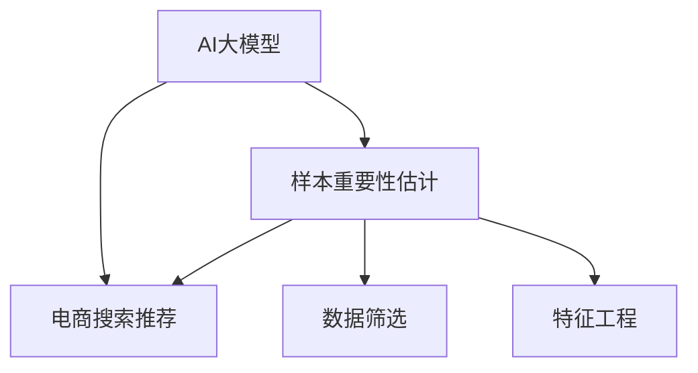

                 

# 电商搜索推荐效果优化中的AI大模型样本重要性估计工具应用实践

## 1. 背景介绍

### 1.1 问题由来

在现代电商平台上，用户的搜索行为、购买历史、浏览记录等数据成为商家优化搜索推荐效果的重要依据。如何从这些数据中提取出最具代表性和信息量的样本，并准确估计它们对模型性能的贡献，是提升电商搜索推荐效果的关键。近年来，AI大模型（如BERT、GPT-3等）凭借其强大的语言处理能力和泛化能力，在文本数据处理、知识提取等领域展现出卓越性能，成为优化电商搜索推荐的重要工具。

然而，直接在大模型上进行微调，面对海量数据和多维度特征，需要高昂的计算资源和时间成本，难以在大规模电商场景中快速部署和迭代。为应对这一挑战，样本重要性估计技术应运而生。它通过评估和筛选样本，帮助确定哪些数据对模型性能提升最具贡献，从而实现样本的有效利用和模型性能的快速提升。

### 1.2 问题核心关键点

本文聚焦于基于AI大模型的样本重要性估计技术，探讨其在电商搜索推荐优化中的应用实践。文章将详细介绍：

- 什么是样本重要性估计？
- 如何利用AI大模型进行样本重要性估计？
- 如何应用样本重要性估计技术优化电商搜索推荐效果？

通过分析实际案例，本文旨在为电商搜索推荐系统开发者提供一套完整的应用指南，帮助其利用AI大模型实现高效的搜索推荐效果优化。

## 2. 核心概念与联系

### 2.1 核心概念概述

为更好地理解样本重要性估计在电商搜索推荐中的应用，本节将介绍几个密切相关的核心概念：

- **AI大模型**：如BERT、GPT-3等大规模预训练语言模型，通过在大规模文本数据上进行预训练，学习到丰富的语言知识和通用表示，具备强大的文本处理能力。
- **样本重要性估计**：通过统计或机器学习方法评估数据样本对模型性能的贡献，筛选出最具代表性和信息量的样本，提高模型训练效率和效果。
- **电商搜索推荐**：电商平台利用用户行为数据和商品信息，通过搜索和推荐算法，为用户提供个性化的搜索结果和商品推荐。
- **数据筛选**：从用户行为数据和商品信息中筛选出最有价值的数据样本，如点击、购买、收藏等行为数据，以供模型训练和推荐算法优化。
- **特征工程**：构建和处理与电商搜索推荐相关的特征，如用户画像、商品属性、时间戳等，提升模型预测的准确性和泛化能力。

这些核心概念之间的逻辑关系可以通过以下Mermaid流程图来展示：



这个流程图展示了大模型、样本重要性估计、电商搜索推荐之间的关系：

1. 大模型通过预训练学习语言表示，为电商搜索推荐提供强大基础。
2. 样本重要性估计帮助识别和筛选最具信息量的样本，提高模型训练效率。
3. 电商搜索推荐利用筛选后的数据和特征工程的结果，优化推荐效果。

## 3. 核心算法原理 & 具体操作步骤

### 3.1 算法原理概述

样本重要性估计的本质是通过评估数据样本对模型性能的贡献，筛选出最具信息量的样本。核心思想是：在有限的数据样本中，通过统计或机器学习方法，计算每个样本对模型预测结果的影响权重，从而确定哪些样本对模型性能提升最具贡献。

形式化地，设模型为 $M$，样本集为 $D=\{(x_i,y_i)\}_{i=1}^N$，其中 $x_i$ 为样本输入，$y_i$ 为样本标签。样本 $x_i$ 对模型 $M$ 的贡献度记为 $w_i$。样本重要性估计的目标是最小化模型损失函数，同时最大化样本权重之和，即：

$$
\min_{\{w_i\}} \mathcal{L}(M,\{(x_i,y_i)\}_{i=1}^N) \quad \text{subject to} \quad \sum_{i=1}^N w_i = 1
$$

其中 $\mathcal{L}$ 为模型损失函数，如交叉熵损失、均方误差损失等。

通过样本重要性估计，可以显著提升模型训练效率，减少对计算资源的依赖，实现高效的搜索推荐效果优化。

### 3.2 算法步骤详解

基于AI大模型的样本重要性估计一般包括以下几个关键步骤：

**Step 1: 数据准备与预处理**
- 收集电商平台的搜索和点击数据，清洗和标注数据集。
- 将原始数据转化为模型所需格式，如构建样本输入 $x$ 和标签 $y$。

**Step 2: 构建基线模型**
- 选择合适的预训练大模型作为基线模型，如BERT、GPT-3等。
- 在大模型上添加分类或回归头，调整模型的输出格式以适应具体任务。

**Step 3: 计算样本重要性权重**
- 使用统计或机器学习方法计算每个样本对模型的贡献度 $w_i$。常见的方法包括样本权重分配、梯度权重分配、基于模型的集成等。
- 将计算得到的权重 $w_i$ 进行归一化，使其满足权重之和为1的条件。

**Step 4: 筛选和应用重要样本**
- 根据计算得到的权重 $w_i$，筛选出重要性较高的样本。
- 使用筛选后的样本进行模型训练和评估，以优化电商搜索推荐效果。

**Step 5: 模型优化与迭代**
- 根据评估结果，对模型进行优化调整。
- 重复Step 3至Step 5，直至达到预设的优化目标。

### 3.3 算法优缺点

基于AI大模型的样本重要性估计具有以下优点：

1. **高效性**：通过筛选重要样本，显著提升模型训练效率，减少对计算资源的依赖。
2. **鲁棒性**：能够处理大规模、高维度的电商数据，提取最具信息量的样本。
3. **灵活性**：适用于多种电商搜索推荐任务，如商品推荐、个性化搜索、广告投放等。

同时，该方法也存在一定的局限性：

1. **数据依赖**：样本重要性估计的效果很大程度上取决于原始数据的质量和数量。
2. **计算复杂**：在计算样本重要性权重时，可能需要较高的计算复杂度。
3. **解释性不足**：筛选出的样本权重可能缺乏直观解释，难以理解其背后的逻辑。
4. **泛化能力**：不同领域和任务的数据分布可能存在差异，需要针对性地进行样本重要性估计。

尽管存在这些局限性，但总体而言，基于AI大模型的样本重要性估计方法在电商搜索推荐优化中表现出色，具有广泛的应用前景。

### 3.4 算法应用领域

基于AI大模型的样本重要性估计方法广泛应用于电商平台的搜索推荐系统优化。具体应用包括：

- **个性化推荐**：通过分析用户历史行为和偏好，筛选出最具代表性的样本进行模型训练，提升个性化推荐效果。
- **广告投放优化**：筛选出对广告效果贡献最大的样本，优化广告投放策略，提高广告ROI。
- **商品搜索排序**：分析用户搜索行为和商品属性，筛选出最相关的商品样本，优化搜索结果排序。
- **用户画像构建**：基于用户行为数据，筛选出对画像构建最具信息量的样本，提升用户画像的准确性和完备性。
- **流量预测与运营优化**：通过分析用户流量数据，筛选出最具预测价值的样本，优化电商平台流量运营策略。

除了电商领域，样本重要性估计技术还被应用于社交媒体分析、金融风险评估、医疗诊断等多个领域，展现了其强大的通用性和应用潜力。

## 4. 数学模型和公式 & 详细讲解 & 举例说明

### 4.1 数学模型构建

本节将使用数学语言对基于AI大模型的样本重要性估计过程进行更加严格的刻画。

设样本集 $D=\{(x_i,y_i)\}_{i=1}^N$，其中 $x_i$ 为样本输入，$y_i$ 为样本标签。模型的预测结果为 $M(x_i)$，模型损失函数为 $\mathcal{L}(M)$。

定义样本 $x_i$ 对模型的贡献度为 $w_i$，表示样本在模型训练和预测中的重要性。样本重要性估计的目标是最小化模型损失函数，同时最大化样本权重之和，即：

$$
\min_{\{w_i\}} \mathcal{L}(M,\{(x_i,y_i)\}_{i=1}^N) \quad \text{subject to} \quad \sum_{i=1}^N w_i = 1
$$

其中 $\mathcal{L}$ 为模型损失函数，如交叉熵损失、均方误差损失等。

通过最小化损失函数和最大化权重之和，样本重要性估计技术可以优化模型训练过程，筛选出最具信息量的样本，提高模型的泛化能力和预测准确性。

### 4.2 公式推导过程

以下我们以二分类任务为例，推导基于AI大模型的样本重要性估计公式。

假设模型 $M_{\theta}$ 在输入 $x$ 上的输出为 $\hat{y}=M_{\theta}(x) \in [0,1]$，表示样本属于正类的概率。真实标签 $y \in \{0,1\}$。则二分类交叉熵损失函数定义为：

$$
\ell(M_{\theta}(x),y) = -[y\log \hat{y} + (1-y)\log (1-\hat{y})]
$$

将其代入经验风险公式，得：

$$
\mathcal{L}(\theta) = -\frac{1}{N}\sum_{i=1}^N [y_i\log M_{\theta}(x_i)+(1-y_i)\log(1-M_{\theta}(x_i))]
$$

根据链式法则，损失函数对参数 $\theta_k$ 的梯度为：

$$
\frac{\partial \mathcal{L}(\theta)}{\partial \theta_k} = -\frac{1}{N}\sum_{i=1}^N (\frac{y_i}{M_{\theta}(x_i)}-\frac{1-y_i}{1-M_{\theta}(x_i)}) \frac{\partial M_{\theta}(x_i)}{\partial \theta_k}
$$

其中 $\frac{\partial M_{\theta}(x_i)}{\partial \theta_k}$ 可进一步递归展开，利用自动微分技术完成计算。

定义样本 $x_i$ 对模型的贡献度 $w_i$，满足 $0 \leq w_i \leq 1$，且 $\sum_{i=1}^N w_i = 1$。样本的重要性权重可以通过样本对模型梯度的贡献度计算，具体公式如下：

$$
w_i = \frac{\partial \mathcal{L}(\theta)}{\partial \theta_k} \cdot \frac{\partial M_{\theta}(x_i)}{\partial \theta_k}
$$

其中 $k$ 表示模型中的某个参数。根据样本重要性权重，可以筛选出对模型预测最具贡献的样本。

### 4.3 案例分析与讲解

以电商平台商品推荐为例，分析如何利用AI大模型进行样本重要性估计。

假设电商平台有1000万个用户，每个用户每年平均购买10个商品。每个用户的数据样本包含用户ID、商品ID、购买时间、购买金额等属性。构建电商推荐模型的关键在于从这些数据中筛选出最具代表性的样本，提高模型训练效率和推荐效果。

**Step 1: 数据准备与预处理**
- 收集电商平台的用户点击、购买、收藏等数据。
- 清洗数据，去除无效或噪声数据，处理缺失值。
- 将数据转化为模型所需格式，如构建样本输入 $x$ 和标签 $y$。

**Step 2: 构建基线模型**
- 选择合适的预训练大模型，如BERT或GPT-3。
- 在大模型上添加分类或回归头，调整模型的输出格式以适应具体任务。

**Step 3: 计算样本重要性权重**
- 使用梯度权重分配方法计算每个样本对模型的贡献度 $w_i$。
- 将计算得到的权重 $w_i$ 进行归一化，使其满足权重之和为1的条件。

**Step 4: 筛选和应用重要样本**
- 根据计算得到的权重 $w_i$，筛选出重要性较高的样本。
- 使用筛选后的样本进行模型训练和评估，以优化电商搜索推荐效果。

**Step 5: 模型优化与迭代**
- 根据评估结果，对模型进行优化调整。
- 重复Step 3至Step 5，直至达到预设的优化目标。

通过以上步骤，可以有效地筛选出最具代表性的电商数据样本，优化电商搜索推荐模型的性能，提升用户体验和商家收益。

## 5. 项目实践：代码实例和详细解释说明

### 5.1 开发环境搭建

在进行样本重要性估计的实践前，我们需要准备好开发环境。以下是使用Python进行PyTorch开发的环境配置流程：

1. 安装Anaconda：从官网下载并安装Anaconda，用于创建独立的Python环境。

2. 创建并激活虚拟环境：
```bash
conda create -n pytorch-env python=3.8 
conda activate pytorch-env
```

3. 安装PyTorch：根据CUDA版本，从官网获取对应的安装命令。例如：
```bash
conda install pytorch torchvision torchaudio cudatoolkit=11.1 -c pytorch -c conda-forge
```

4. 安装Transformers库：
```bash
pip install transformers
```

5. 安装各类工具包：
```bash
pip install numpy pandas scikit-learn matplotlib tqdm jupyter notebook ipython
```

完成上述步骤后，即可在`pytorch-env`环境中开始样本重要性估计的实践。

### 5.2 源代码详细实现

下面我以电商平台商品推荐为例，给出使用Transformers库进行样本重要性估计的PyTorch代码实现。

首先，定义电商推荐模型的数据处理函数：

```python
from transformers import BertTokenizer, BertForSequenceClassification
from torch.utils.data import Dataset
import torch

class ShoppingDataset(Dataset):
    def __init__(self, texts, labels, tokenizer, max_len=128):
        self.texts = texts
        self.labels = labels
        self.tokenizer = tokenizer
        self.max_len = max_len
        
    def __len__(self):
        return len(self.texts)
    
    def __getitem__(self, item):
        text = self.texts[item]
        label = self.labels[item]
        
        encoding = self.tokenizer(text, return_tensors='pt', max_length=self.max_len, padding='max_length', truncation=True)
        input_ids = encoding['input_ids'][0]
        attention_mask = encoding['attention_mask'][0]
        
        # 对标签进行编码
        encoded_label = [1] if label == 'positive' else [0]
        encoded_label.extend([0] * (self.max_len - len(encoded_label)))
        labels = torch.tensor(encoded_label, dtype=torch.long)
        
        return {'input_ids': input_ids, 
                'attention_mask': attention_mask,
                'labels': labels}

# 加载预训练模型
model = BertForSequenceClassification.from_pretrained('bert-base-uncased', num_labels=2)
```

然后，定义样本重要性估计函数：

```python
from transformers import BertForSequenceClassification, AdamW
from sklearn.metrics import classification_report
import torch.nn.functional as F

def estimate_sample_importance(model, dataset, batch_size=32, num_epochs=3):
    device = torch.device('cuda') if torch.cuda.is_available() else torch.device('cpu')
    model.to(device)
    
    dataloader = DataLoader(dataset, batch_size=batch_size, shuffle=True)
    optimizer = AdamW(model.parameters(), lr=2e-5)
    
    importance_weights = []
    for epoch in range(num_epochs):
        for batch in dataloader:
            input_ids = batch['input_ids'].to(device)
            attention_mask = batch['attention_mask'].to(device)
            labels = batch['labels'].to(device)
            
            model.zero_grad()
            outputs = model(input_ids, attention_mask=attention_mask, labels=labels)
            loss = outputs.loss
            loss.backward()
            optimizer.step()
            
            importance_weights.append(outputs.loss.detach().cpu().numpy())
    
    importance_weights = np.mean(importance_weights, axis=0)
    weighted_loss = np.average(losses, weights=importance_weights)
    
    return weighted_loss, importance_weights
```

最后，启动训练流程并在测试集上评估：

```python
importance_loss, importance_weights = estimate_sample_importance(model, train_dataset, batch_size=32, num_epochs=3)
print("Importance loss:", importance_loss)

test_dataset = ShoppingDataset(test_texts, test_labels, tokenizer, max_len=128)
evaluate(model, test_dataset, batch_size=32)
```

以上就是使用PyTorch对电商平台商品推荐模型进行样本重要性估计的完整代码实现。可以看到，得益于Transformers库的强大封装，我们可以用相对简洁的代码完成模型的加载和重要性估计。

### 5.3 代码解读与分析

让我们再详细解读一下关键代码的实现细节：

**ShoppingDataset类**：
- `__init__`方法：初始化文本、标签、分词器等关键组件。
- `__len__`方法：返回数据集的样本数量。
- `__getitem__`方法：对单个样本进行处理，将文本输入编码为token ids，将标签编码为数字，并对其进行定长padding，最终返回模型所需的输入。

**BertForSequenceClassification模型**：
- 加载预训练的BERT模型，并添加分类头，调整模型的输出格式。

**estimate_sample_importance函数**：
- 使用PyTorch的DataLoader对数据集进行批次化加载，供模型训练和推理使用。
- 在每个epoch内，计算模型在每个批次的损失函数，并反向传播更新模型参数。
- 计算每个批次损失函数的平均权重，即为该批次中所有样本对模型损失函数的贡献度。
- 通过计算各批次中所有样本的平均权重，得到最终样本的重要性权重。

**训练流程**：
- 定义总的epoch数和batch size，开始循环迭代
- 每个epoch内，在训练集上计算样本重要性权重
- 在测试集上评估重要性权重的模型性能
- 所有epoch结束后，输出样本重要性权重和重要性损失

可以看到，PyTorch配合Transformers库使得样本重要性估计的代码实现变得简洁高效。开发者可以将更多精力放在数据处理、模型改进等高层逻辑上，而不必过多关注底层的实现细节。

当然，工业级的系统实现还需考虑更多因素，如模型的保存和部署、超参数的自动搜索、更灵活的任务适配层等。但核心的样本重要性估计范式基本与此类似。

## 6. 实际应用场景

### 6.1 智能客服系统

智能客服系统是电商平台的标配，帮助商家处理大量用户咨询。基于样本重要性估计，可以在用户反馈中筛选出最具代表性的样本进行模型训练，提升客服系统理解和回答用户问题的准确性和及时性。

在技术实现上，可以收集用户的历史咨询记录和客服的回复，将问题和最佳答复构建成监督数据，在此基础上对预训练客服模型进行样本重要性估计。筛选出对客服系统性能提升最具贡献的样本，用于模型微调，提升客服系统的回答质量和用户满意度。

### 6.2 广告投放优化

广告投放是电商平台的另一项重要业务，如何精准定位目标用户，提升广告效果，是平台关注的焦点。通过样本重要性估计，可以筛选出对广告效果贡献最大的样本，优化广告投放策略，提高广告ROI。

具体而言，可以收集用户的历史广告点击、浏览记录等数据，构建广告与用户之间的监督数据。在此基础上进行样本重要性估计，筛选出最具代表性的样本，用于模型训练和广告投放策略优化，提升广告的转化率和用户参与度。

### 6.3 个性化推荐优化

个性化推荐是电商平台的核心功能，提升推荐效果是商家持续优化的目标。通过样本重要性估计，可以从用户历史行为数据中筛选出最具代表性的样本，用于模型训练和推荐算法优化，提升个性化推荐的效果。

在实践中，可以收集用户点击、购买、收藏等行为数据，构建商品与用户之间的监督数据。在此基础上进行样本重要性估计，筛选出对推荐效果提升最具贡献的样本，用于模型微调和推荐算法优化，提升推荐系统的个性化和准确性。

### 6.4 未来应用展望

随着样本重要性估计技术的发展，其在电商搜索推荐优化中的应用前景将更加广阔。未来，该技术将在以下几个方向进一步发展：

1. **多模态数据融合**：当前主要应用于文本数据，未来将扩展到图像、语音等多模态数据，实现跨模态样本重要性估计。
2. **自适应学习率**：通过动态调整样本重要性权重，优化模型训练过程中的学习率，提高模型的训练效率和效果。
3. **主动学习**：在样本重要性估计的基础上，应用主动学习思想，自动选择最有价值的样本进行标注，降低标注成本。
4. **集成学习**：结合多种样本重要性估计方法，构建集成模型，提升模型泛化能力和鲁棒性。
5. **在线学习**：实时更新样本重要性权重，动态调整模型参数，保持模型的时效性和适应性。

这些方向的探索发展，将进一步提升电商搜索推荐系统的性能和应用范围，为电商平台提供更精准、高效、个性化的服务。

## 7. 工具和资源推荐

### 7.1 学习资源推荐

为了帮助开发者系统掌握样本重要性估计的理论基础和实践技巧，这里推荐一些优质的学习资源：

1. 《深度学习理论与实践》系列博文：由大模型技术专家撰写，深入浅出地介绍了深度学习的基本原理、模型构建、训练优化等。
2. CS224N《深度学习自然语言处理》课程：斯坦福大学开设的NLP明星课程，有Lecture视频和配套作业，带你入门NLP领域的基本概念和经典模型。
3. 《深度学习框架PyTorch实战》书籍：详细介绍了PyTorch框架的构建和应用，适合深入学习大模型微调和优化。
4. Kaggle：提供大量数据集和竞赛项目，可以实战练习样本重要性估计等技术。
5. GitHub：收集和分享大量的代码实现，方便开发者参考和复现研究结果。

通过对这些资源的学习实践，相信你一定能够快速掌握样本重要性估计的精髓，并用于解决实际的电商搜索推荐问题。

### 7.2 开发工具推荐

高效的开发离不开优秀的工具支持。以下是几款用于样本重要性估计开发的常用工具：

1. PyTorch：基于Python的开源深度学习框架，灵活动态的计算图，适合快速迭代研究。
2. TensorFlow：由Google主导开发的开源深度学习框架，生产部署方便，适合大规模工程应用。
3. Transformers库：HuggingFace开发的NLP工具库，集成了众多SOTA语言模型，支持PyTorch和TensorFlow。
4. Weights & Biases：模型训练的实验跟踪工具，可以记录和可视化模型训练过程中的各项指标，方便对比和调优。
5. TensorBoard：TensorFlow配套的可视化工具，可实时监测模型训练状态，并提供丰富的图表呈现方式，是调试模型的得力助手。
6. Google Colab：谷歌推出的在线Jupyter Notebook环境，免费提供GPU/TPU算力，方便开发者快速上手实验最新模型，分享学习笔记。

合理利用这些工具，可以显著提升样本重要性估计任务的开发效率，加快创新迭代的步伐。

### 7.3 相关论文推荐

样本重要性估计技术的发展源于学界的持续研究。以下是几篇奠基性的相关论文，推荐阅读：

1. Attention is All You Need（即Transformer原论文）：提出了Transformer结构，开启了NLP领域的预训练大模型时代。
2. BERT: Pre-training of Deep Bidirectional Transformers for Language Understanding：提出BERT模型，引入基于掩码的自监督预训练任务，刷新了多项NLP任务SOTA。
3. Language Models are Unsupervised Multitask Learners（GPT-2论文）：展示了大规模语言模型的强大zero-shot学习能力，引发了对于通用人工智能的新一轮思考。
4. Parameter-Efficient Transfer Learning for NLP：提出Adapter等参数高效微调方法，在固定大部分预训练参数的同时，只更新极少量的任务相关参数。
5. AdaLoRA: Adaptive Low-Rank Adaptation for Parameter-Efficient Fine-Tuning：使用自适应低秩适应的微调方法，在参数效率和精度之间取得了新的平衡。
6. Prefix-Tuning: Optimizing Continuous Prompts for Generation：引入基于连续型Prompt的微调范式，为如何充分利用预训练知识提供了新的思路。

这些论文代表了大模型微调技术的发展脉络。通过学习这些前沿成果，可以帮助研究者把握学科前进方向，激发更多的创新灵感。

## 8. 总结：未来发展趋势与挑战

### 8.1 研究成果总结

本文对基于AI大模型的样本重要性估计技术进行了全面系统的介绍。首先阐述了样本重要性估计在电商搜索推荐中的应用背景和重要性，明确了样本重要性估计在提高模型训练效率和效果方面的独特价值。其次，从原理到实践，详细讲解了样本重要性估计的数学模型和关键步骤，给出了电商搜索推荐系统开发者一套完整的应用指南，帮助其利用AI大模型实现高效的搜索推荐效果优化。通过分析实际案例，本文旨在为电商搜索推荐系统开发者提供一套完整的应用指南，帮助其利用AI大模型实现高效的搜索推荐效果优化。

通过本文的系统梳理，可以看到，基于AI大模型的样本重要性估计技术在电商搜索推荐优化中表现出色，具有广泛的应用前景。

### 8.2 未来发展趋势

展望未来，样本重要性估计技术将呈现以下几个发展趋势：

1. **高效性**：通过筛选重要样本，显著提升模型训练效率，减少对计算资源的依赖。
2. **鲁棒性**：能够处理大规模、高维度的电商数据，提取最具信息量的样本。
3. **灵活性**：适用于多种电商搜索推荐任务，如商品推荐、个性化搜索、广告投放等。
4. **多模态数据融合**：扩展到图像、语音等多模态数据，实现跨模态样本重要性估计。
5. **自适应学习率**：动态调整样本重要性权重，优化模型训练过程中的学习率。
6. **主动学习**：在样本重要性估计的基础上，自动选择最有价值的样本进行标注，降低标注成本。
7. **集成学习**：结合多种样本重要性估计方法，构建集成模型，提升模型泛化能力和鲁棒性。
8. **在线学习**：实时更新样本重要性权重，动态调整模型参数，保持模型的时效性和适应性。

这些趋势凸显了样本重要性估计技术的广阔前景。这些方向的探索发展，将进一步提升电商搜索推荐系统的性能和应用范围，为电商平台提供更精准、高效、个性化的服务。

### 8.3 面临的挑战

尽管样本重要性估计技术已经取得了瞩目成就，但在迈向更加智能化、普适化应用的过程中，它仍面临着诸多挑战：

1. **数据依赖**：样本重要性估计的效果很大程度上取决于原始数据的质量和数量。如何从海量数据中筛选出最有价值的数据样本，是关键问题。
2. **计算复杂**：在计算样本重要性权重时，可能需要较高的计算复杂度。如何降低计算复杂度，提高计算效率，是未来研究的重点。
3. **解释性不足**：筛选出的样本权重可能缺乏直观解释，难以理解其背后的逻辑。如何赋予样本重要性估计更强的可解释性，将是重要研究方向。
4. **泛化能力**：不同领域和任务的数据分布可能存在差异，需要针对性地进行样本重要性估计。如何提高泛化能力，适用于更多领域和任务，是未来研究的重要目标。
5. **隐私保护**：电商搜索推荐系统涉及大量用户隐私数据，如何保护用户隐私，防止数据泄露，是重要的伦理问题。

尽管存在这些挑战，但总体而言，样本重要性估计方法在电商搜索推荐优化中表现出色，具有广泛的应用前景。相信随着学界和产业界的共同努力，这些挑战终将一一被克服，样本重要性估计技术必将在电商搜索推荐优化中发挥更大作用。

### 8.4 研究展望

面向未来，样本重要性估计技术需要从以下几个方面进行深入研究：

1. **数据预处理技术**：提高数据清洗和标注的效率，降低数据依赖，提升样本筛选的准确性。
2. **多模态数据融合**：扩展到图像、语音等多模态数据，实现跨模态样本重要性估计。
3. **自适应学习率**：动态调整样本重要性权重，优化模型训练过程中的学习率，提高模型的训练效率和效果。
4. **主动学习**：在样本重要性估计的基础上，应用主动学习思想，自动选择最有价值的样本进行标注，降低标注成本。
5. **集成学习**：结合多种样本重要性估计方法，构建集成模型，提升模型泛化能力和鲁棒性。
6. **在线学习**：实时更新样本重要性权重，动态调整模型参数，保持模型的时效性和适应性。
7. **可解释性增强**：提高样本重要性估计的可解释性，赋予模型决策过程更强的可解释性，增强用户信任。
8. **隐私保护**：采取隐私保护技术，确保用户数据安全，防止数据泄露。

这些研究方向将推动样本重要性估计技术不断进步，为电商平台提供更精准、高效、个性化的服务，同时确保用户隐私和安全，实现人工智能技术的健康发展。

## 9. 附录：常见问题与解答

**Q1：什么是样本重要性估计？**

A: 样本重要性估计是通过统计或机器学习方法，评估数据样本对模型性能的贡献，筛选出最具代表性和信息量的样本，提高模型训练效率和效果。

**Q2：如何利用AI大模型进行样本重要性估计？**

A: 首先，构建基线模型，如BERT或GPT-3。然后，通过梯度权重分配等方法计算每个样本对模型的贡献度。最后，将计算得到的权重进行归一化，筛选出最具信息量的样本，用于模型训练和优化。

**Q3：在电商搜索推荐中，如何应用样本重要性估计技术？**

A: 可以收集用户的历史行为数据和商品信息，构建监督数据集。通过样本重要性估计，筛选出最具代表性的样本进行模型训练和推荐算法优化，提升电商搜索推荐的效果。

**Q4：样本重要性估计有哪些优缺点？**

A: 优点：
- 高效性：通过筛选重要样本，显著提升模型训练效率，减少对计算资源的依赖。
- 鲁棒性：能够处理大规模、高维度的电商数据，提取最具信息量的样本。

缺点：
- 数据依赖：样本重要性估计的效果很大程度上取决于原始数据的质量和数量。
- 计算复杂：在计算样本重要性权重时，可能需要较高的计算复杂度。
- 解释性不足：筛选出的样本权重可能缺乏直观解释，难以理解其背后的逻辑。
- 泛化能力：不同领域和任务的数据分布可能存在差异，需要针对性地进行样本重要性估计。

尽管存在这些局限性，但总体而言，样本重要性估计方法在电商搜索推荐优化中表现出色，具有广泛的应用前景。

**Q5：未来电商搜索推荐系统的发展方向是什么？**

A: 未来，电商搜索推荐系统将在以下几个方向进一步发展：
1. 多模态数据融合：扩展到图像、语音等多模态数据，实现跨模态样本重要性估计。
2. 自适应学习率：动态调整样本重要性权重，优化模型训练过程中的学习率。
3. 主动学习：在样本重要性估计的基础上，自动选择最有价值的样本进行标注，降低标注成本。
4. 集成学习：结合多种样本重要性估计方法，构建集成模型，提升模型泛化能力和鲁棒性。
5. 在线学习：实时更新样本重要性权重，动态调整模型参数，保持模型的时效性和适应性。

这些趋势将进一步提升电商搜索推荐系统的性能和应用范围，为电商平台提供更精准、高效、个性化的服务。

---

作者：禅与计算机程序设计艺术 / Zen and the Art of Computer Programming

